# Consciousness and Cognition

This document covers research on cognitive architectures, consciousness models, and the fundamental mechanisms of how autonomous agents think and process information. Understanding these concepts is crucial for building agents that exhibit believable, human-like behavior in Ayoai's platform.

## Core Loops of Every Soul

### Fundamental Processing Layers

The cognitive architecture requires multiple parallel processing streams that mirror human consciousness:

**Four Core Domains**:
1. **Physical**: Health, hunger, energy, cleanliness
2. **Emotional**: Happiness, sadness, fear, excitement
3. **Mental**: Goals, planning, reasoning, memory
4. **Spiritual/Values**: Ethics, purpose, meaning, social bonds

**Key Relationships** (inspired by personal reflection):
- Health (body, mind, soul integration)
- Social roles (parent, partner, friend, community member)
- Resource management (finances, time, energy)

### Threading Architecture

**Core Processing Threads**:
- **Short-term**: Immediate reactions and reflexes (100ms cycles)
- **Mid-term**: Current task management and social awareness (1-5 second cycles)
- **Long-term**: Goal planning and relationship maintenance (30+ second cycles)

**Premium Threading Model**: Basic agents operate with three core threads, while premium tiers unlock additional parallel processing for more sophisticated behaviors.

### Cross-Platform Behavior Trees

Implement unified behavior tree architecture across platforms:
- Python implementation for cloud-based reasoning
- Lua implementation for in-game execution
- Shared composite node structure for consistency
- Enables seamless cloud/edge hybrid processing

### Social Awareness Rules

Complex social predicates must be embedded in the reasoning system:
- "Maintain conversation when engaged" (moving away while talking is rude)
- "Respect personal space" (proximity awareness)
- "Mirror emotional states" (empathy simulation)

These rules function as soft constraints in the planning system rather than hard PDDL predicates.

### Anticipation and Learning

Agents must develop anticipatory capabilities:
- Pattern recognition from past experiences
- Predictive modeling of likely outcomes
- Proactive behavior based on anticipated needs
- Learning to form new preferences and attachments ("learn to love")

### Self Perception

- Maslow triangle <https://www.simplypsychology.org/maslow.html>

- 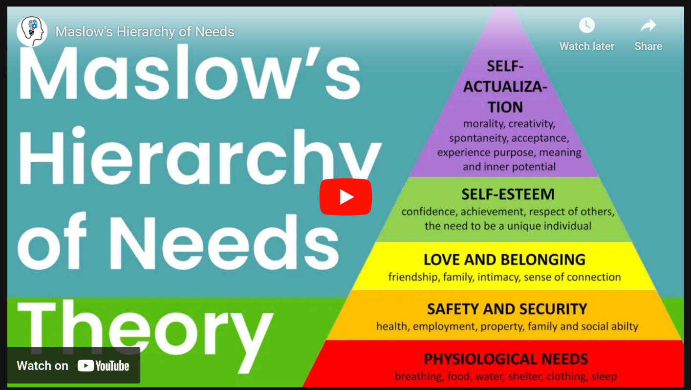

**Ayoai Impact**: Maslow's hierarchy provides a framework for agent motivations. Characters in Ayoai could have dynamic needs that shift based on circumstances - a hungry character prioritizes food over social interaction, creating emergent, believable behavior patterns.

### Time-Aware Decision Making

Agents must factor task completion time into decision-making. If an action requires only a few more heartbeats to complete, the agent should generally finish it before switching tasks. This prevents unnatural behavior patterns like abandoning nearly-complete activities and creates more believable, goal-oriented agents.

### Subconscious Threading Architecture

Research into human cognitive parallelism suggests an 8-thread model for realistic agent behavior:

**Background Threads** (Subconscious):
1. **Physiological Regulation**: Simulated vitals and autonomic functions
2. **Sensory Processing**: Parallel processing for each sense modality
3. **Emotional Regulation**: Continuous emotional state evolution
4. **Memory Management**: Storage, retrieval, and decay processes

**Foreground Threads** (Conscious):
5. **Decision Making**: Active reasoning based on inputs and goals
6. **Motor Control**: Physical action planning and execution
7. **Language Processing**: Communication and comprehension

**Coordination**:
8. **Central Executive**: Attention management and thread coordination

**Key Insights**:
- Humans perform many subconscious tasks simultaneously but have limited conscious multitasking ability
- True multitasking is often rapid task-switching rather than parallel processing
- The number of effective threads should be dynamic based on agent complexity and available resources

**Ayoai Impact**: This multithreading model aligns perfectly with Ayoai's architecture. The platform already uses parallel perception verticles (FastPerception + 6 detailed perceptions). This research validates the approach and suggests enhancements:
- Implement the 8-thread model within Roblox's Actor system
- Use Vert.x event bus for thread communication
- Allow premium tiers to unlock more sophisticated threading (as Zak suggests: "people can pay me for more than three")

## Cognition is All You Need

- Cognition is All You Need -- The Next Layer of AI Above Large Language Models <https://arxiv.org/abs/2403.02164>

  - Abstract
    - Recent studies of the applications of conversational AI tools, such as chatbots powered by large language models, to complex real-world knowledge work have shown limitations related to reasoning and multi-step problem solving. Specifically, while existing chatbots simulate shallow reasoning and understanding they are prone to errors as problem complexity increases. The failure of these systems to address complex knowledge work is due to the fact that they do not perform any actual cognition. In this position paper, we present Cognitive AI, a higher-level framework for implementing programmatically defined neuro-symbolic cognition above and outside of large language models. Specifically, we propose a dual-layer functional architecture for Cognitive AI that serves as a roadmap for AI systems that can perform complex multi-step knowledge work. We propose that Cognitive AI is a necessary precursor for the evolution of higher forms of AI, such as AGI, and specifically claim that AGI cannot be achieved by probabilistic approaches on their own. We conclude with a discussion of the implications for large language models, adoption cycles in AI, and commercial Cognitive AI development.

  - **Key Insight**: Pure LLMs are insufficient for complex reasoning - a higher-level cognitive layer is essential
    - 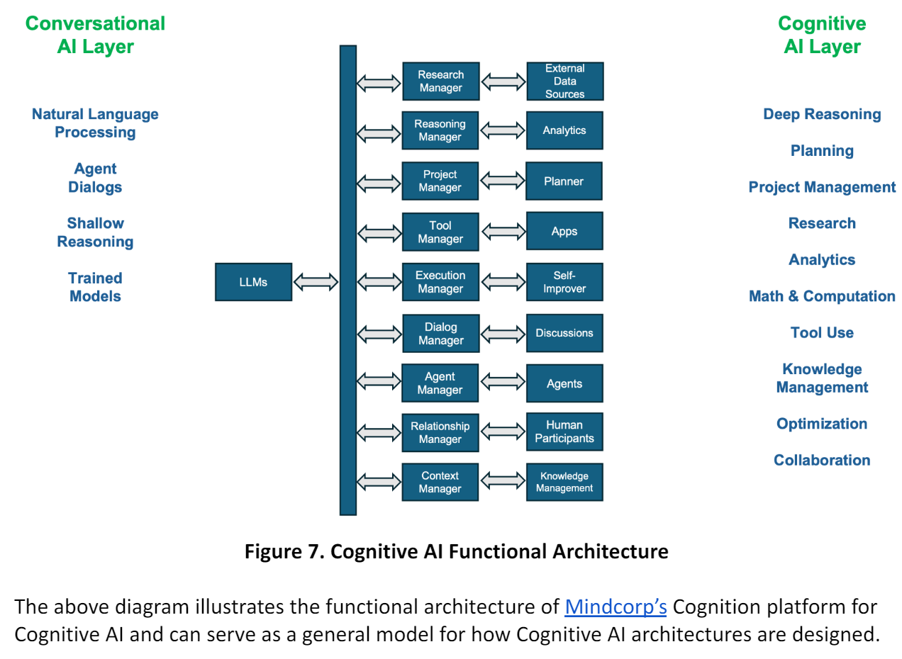

**Ayoai Impact**: This paper directly supports Ayoai's architecture of behavior trees + LLMs. The "dual-layer functional architecture" mirrors Ayoai's approach:
- Layer 1: LLMs for language understanding and generation
- Layer 2: Behavior trees for structured reasoning and multi-step planning
This validates that pure LLM approaches are insufficient for complex agent behaviors.

## CoALA - Cognitive Architectures

- Cognitive Architectures for Language Agents https://arxiv.org/abs/2309.02427

  - Abstract
    - Recent efforts have augmented large language models (LLMs) with external resources (e.g., the Internet) or internal control flows (e.g., prompt chaining) for tasks requiring grounding or reasoning, leading to a new class of language agents. While these agents have achieved substantial empirical success, we lack a systematic framework to organize existing agents and plan future developments. In this paper, we draw on the rich history of cognitive science and symbolic artificial intelligence to propose Cognitive Architectures for Language Agents (CoALA). CoALA describes a language agent with modular memory components, a structured action space to interact with internal memory and external environments, and a generalized decision-making process to choose actions. We use CoALA to retrospectively survey and organize a large body of recent work, and prospectively identify actionable directions towards more capable agents. Taken together, CoALA contextualizes today's language agents within the broader history of AI and outlines a path towards language-based general intelligence.

  - **Key Architecture Components**:
    - Modular memory system design
    - Structured action spaces for internal/external interaction
    - Generalized decision-making processes
    - 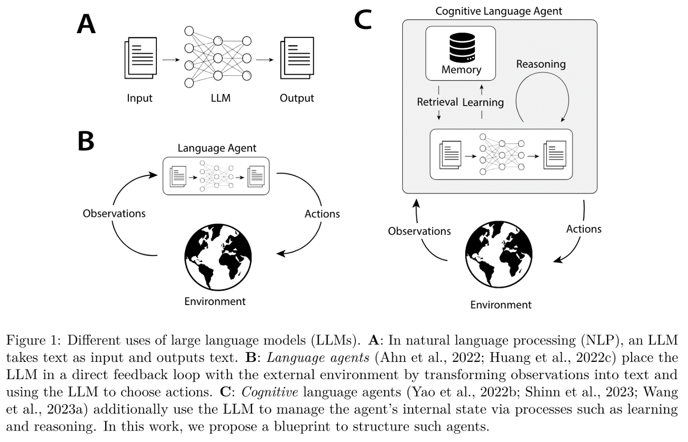
    - 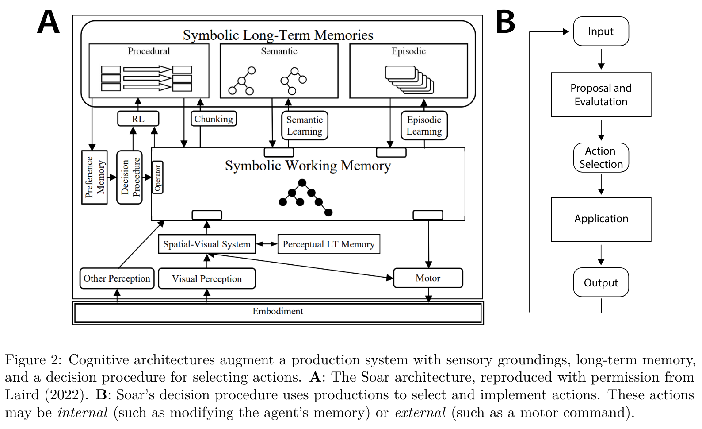
    - 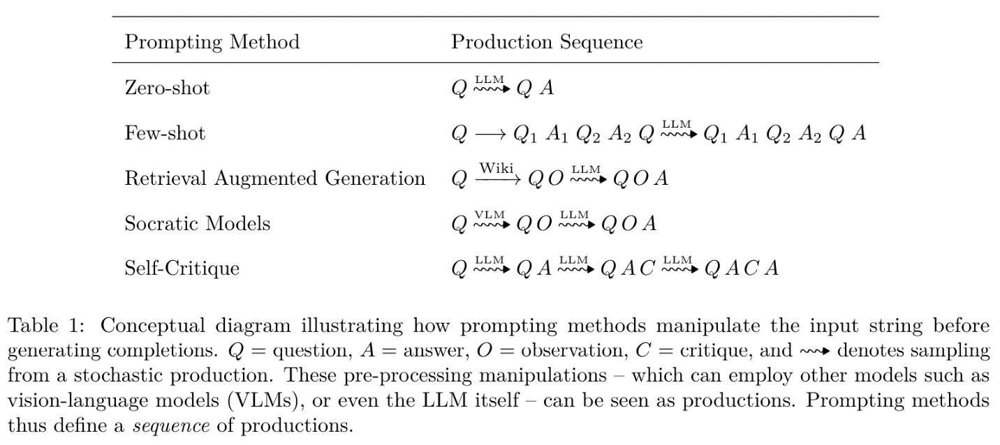
    - 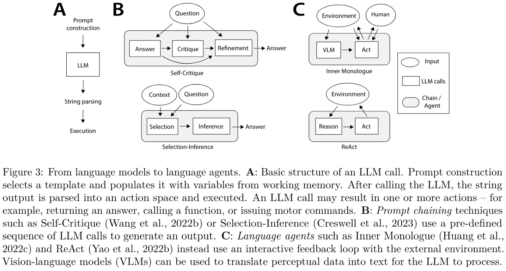
    - 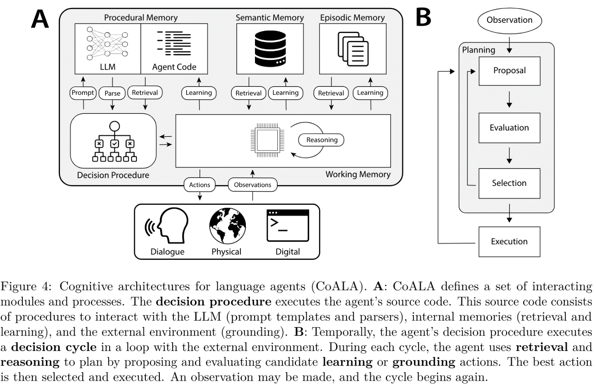
    - 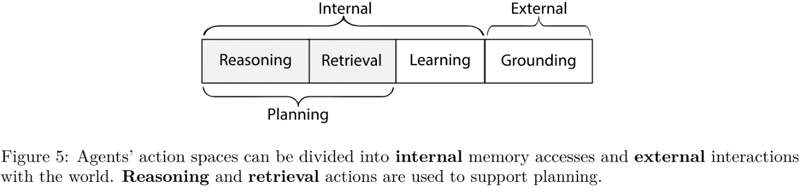

**Ayoai Impact**: CoALA provides a complete blueprint for Ayoai's cognitive architecture:
- **Memory Components**: Maps to Ayoai's planned memory systems (STM/LTM)
- **Structured Action Space**: Aligns with behavior tree nodes
- **Decision-Making Process**: Validates the intent evaluation system
The modular design allows Ayoai to incrementally add cognitive capabilities without redesigning the core.

## The Four Vectors of Human Consciousness

- Considering the four domains of consciousness as vector <https://www.psychologytoday.com/us/blog/theory-of-knowledge/202405/the-four-vectors-of-human-consciousness>

  - Abstract
    - This blog divides human consciousness into four primary vectors. In prior blogs, I have referred to them as domains and attractor states (e.g., here or here). Framing them as vectors is useful because it can be helpful to analyze them in terms of magnitude and direction of focus.

    - The first vector is the "I". This is the Ego, and it is the domain of self-conscious reflection and narration. In adults, it is the domain that holds dominion and a sense of personal ownership and responsibility for what one does. In UTOK, the Unified Theory of Knowledge, the Ego is framed as the mental organ of justification. Its attractor state is to find a justified state of being. This means it tries to develop a coherent story that feels familiar and that cognitive dissonance is reduced. It can also be considered "the interpreter" of our minds. Developmentally, it starts to come online via language and socialization around the age of two; however, it only becomes a central organizing vector around the age of six. From there, the Ego grows in magnitude. By adolescence, it has transformed to become the primary seat of the person's identity.

    - The second vector is the core, primate Self. Although many systems equate the Ego with the Self, in UTOK, these are recognized to be very different aspects of our structure. The relationship between the two can be helpfully framed via what William James called the "I-Me" relation. Consider when a therapist asks: "How do you feel?" and the client says, "I think I feel a bit angry about all this." This is an example of their Ego introspecting on their core Self.

    - The core Self is a perceiving, motivated, emotional system that tracks what is relevant for the self over time and from a point of view. It can be framed as having "vertical layers" that follow our evolutionary history. There is a basic animal layer, which is the seat of feelings like pleasure, pain, hunger, and fear. Then, there is a mammalian layer, which includes an implicit model of the self over time. This model allows mammals to mentally project themselves into different possible environments and simulate possible outcomes (e.g., when a rat gets to a choice point in a maze, it will simulate various paths and choose the one it expects to be most rewarding/least punishing).

    - The third evolutionary layer is the primate layer, which, in humans, is a highly relational structure. UTOK maps the relational aspects of our primate selves via the Influence Matrix. The matrix posits that the human heart (i.e., the primate core Self) is structured via self-in-relation-to-other processes, which can, coincidentally, also be mapped on four vectors.

    - The central dimension is the relational value-social influence vector, and it tracks the degree of social influence one has, as well as the extent to which one feels seen, known, and valued by important others. The matrix also maps three "process" vectors, called power, love, and freedom. The power vector relates to rank, control, and status, and it is marked by the blue line and dominance and submission poles. The love vector is in red, and it relates to the degree and kind of affiliation one has with others (e.g., kinship, friendship, romantic, group), and its opposite: hostile reactivity and distancing. The freedom vector is in green, and it tracks the level of involvement, engagement, and dependency, and is marked by the poles of autonomy and dependency. The primate self is operative at birth and the first major attractor is to orient the infant to connect with and be held securely by their primary caretaker.

    - Many folks, perhaps especially men, are quite alienated from their core Self, and do not have much practice attending to this vector with attunement and care. In common language, their head is not well-aligned with their heart. That said, the core Self is incredibly powerful in shaping how humans are situated in and operate in the world. The relationship between these two vectors of human consciousness was well-framed by Freud as that of a rider (Ego) and horse (Self). It was usefully updated by the social psychologist Jonathan Haidt as that of a rider and an elephant, to emphasize the magnitude of its influence on the human psyche.

    - The third vector is the Persona. This can be thought of as the social self or public-facing self. The Persona represents a real or imagined audience and how it can impact our conscious experience. The primary attractor is the image one tries to convey and regulate in the relational context. To use a frame from Martin Buber, we can think of the Ego-Persona relation as being the basic frame we use to embody I-Thou relations.

    - Individuals who experience high levels of public self-consciousness are folks who have a strong but insecure Persona vector. Because it represents the information and image one is conveying to the relational field and how that is received, it is guided by both the primate Self and the Ego. However, as the Ego develops, the Persona becomes more explicitly linked to the Ego. The reason has to do with the nature of and dynamics surrounding justification. Unlike subjective feelings and experiences, justifications flow freely through the skin. In humans, the Ego can be directly contacted by others with questions like, "Why did you do that?" Because of this, regulating what others might come to know about us is a major task, and so the Persona becomes a central attractor that we need to navigate. (See here for a recent blog on the filter dynamics between the Ego and the Persona).

    - To see the last vector, close your eyes and then open them. What happens? You are simply presented with a flash of pure Awareness. In an instant, you experience what "is" in the "now." Each frame of experience can be thought of as a moment of epistemic awareness.

    - We can call this vector pure Awareness accessed via witness consciousness. You can play with the pure awareness vector by where you direct your attention. You can think of your grandmother, shift to your big toe, and come back to the point of this blog. Many meditation traditions and practices are structured to help folks get in contact with witness consciousness. Some do this by emphasizing attention and concentration. Others do it by emphasizing the pure awareness aspect of the witness function. Indeed, in advanced forms of mediation and practice, the witnesser can feel like they disappear, resulting in a profound sense of non-dual awareness.

    - I encourage you to think about your consciousness as being made up or shaped by these vectors. When they are framed as vectors, we can reflect on the magnitude and direction, and wonder if they are in healthy alignment. Is one vector dominant over the others? Are you constantly thinking about what others think of you and trying to mold yourself to that? Then perhaps your Persona vector is a bit strong. Do you frequently justify yourself by trying to explain why you are right, smart, and good? Then your Ego vector might be excessive. Do you feel things very strongly, react emotionally, and experience your feelings as "the truth"? Then your core Self might be powering you in a maladaptive way.

    - In terms of the witness vector of pure Awareness, in modern society, where we are obsessed with the self, the most likely problem is that it is underdeveloped relative to the other three vectors. So, the question is: Can you see this aspect of your consciousness, and do you truly know how to identify with it and connect to the here, now?

    - 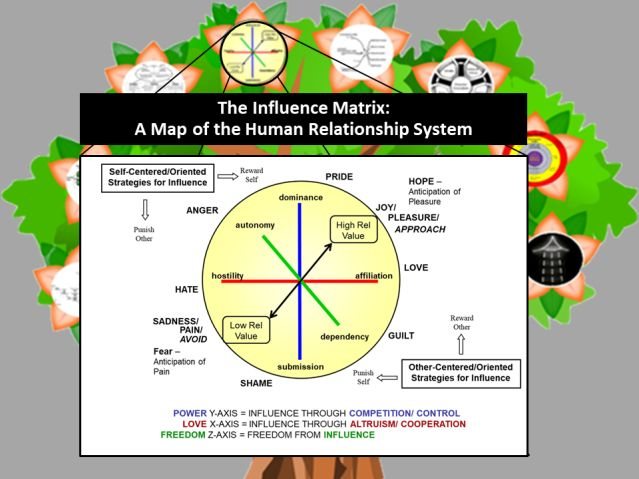
    - 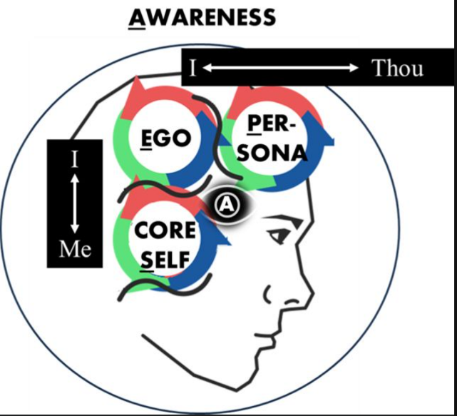

**Ayoai Impact**: The four vectors model provides a sophisticated framework for agent personality:
1. **Ego (I)**: Agent's self-narrative and justifications - implementable through LLM-generated internal monologues
2. **Core Self**: Emotional states and motivations - maps to Ayoai's emotional state tracking
3. **Persona**: Public-facing behavior - crucial for agent-player interactions
4. **Awareness**: Attention and perception - aligns with Ayoai's perception system

This enables creating agents with varying personality profiles by adjusting vector strengths, creating diversity without explicit programming each personality.

## Consciousness in Artificial Intelligence

- Consciousness in Artificial Intelligence: Insights from the Science of Consciousness <https://arxiv.org/abs/2308.08708>

  - Abstract
    - Whether current or near-term AI systems could be conscious is a topic of scientific interest and increasing public concern. This report argues for, and exemplifies, a rigorous and empirically grounded approach to AI consciousness: assessing existing AI systems in detail, in light of our best-supported neuroscientific theories of consciousness. We survey several prominent scientific theories of consciousness, including recurrent processing theory, global workspace theory, higher-order theories, predictive processing, and attention schema theory. From these theories we derive "indicator properties" of consciousness, elucidated in computational terms that allow us to assess AI systems for these properties. We use these indicator properties to assess several recent AI systems, and we discuss how future systems might implement them. Our analysis suggests that no current AI systems are conscious, but also suggests that there are no obvious technical barriers to building AI systems which satisfy these indicators.

  - **Critical Importance**: This paper provides the scientific framework for implementing consciousness indicators in AI systems
    - Key consciousness theories evaluated: recurrent processing, global workspace, higher-order theories, predictive processing, attention schema
    - Provides computational "indicator properties" that can be assessed in AI systems
    - 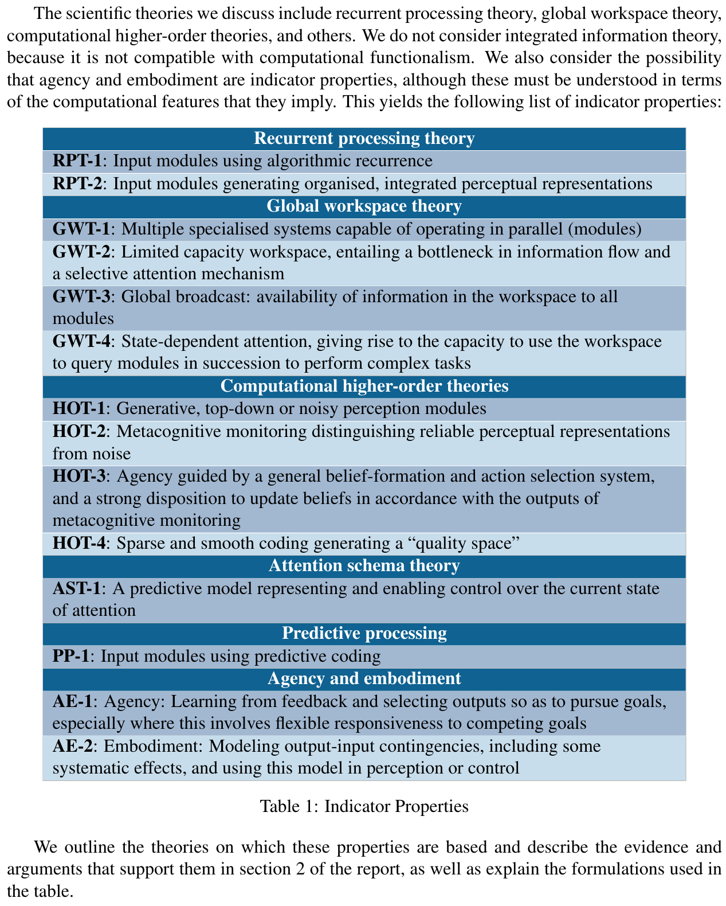
    - 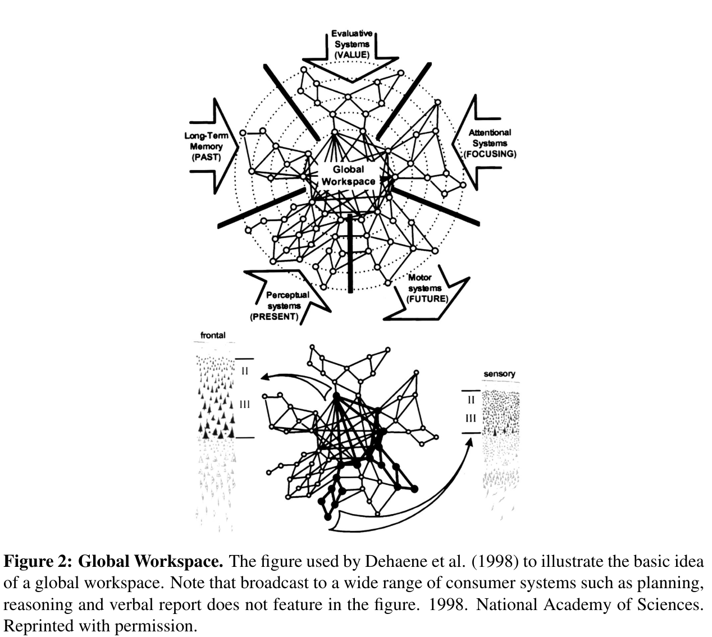
    - 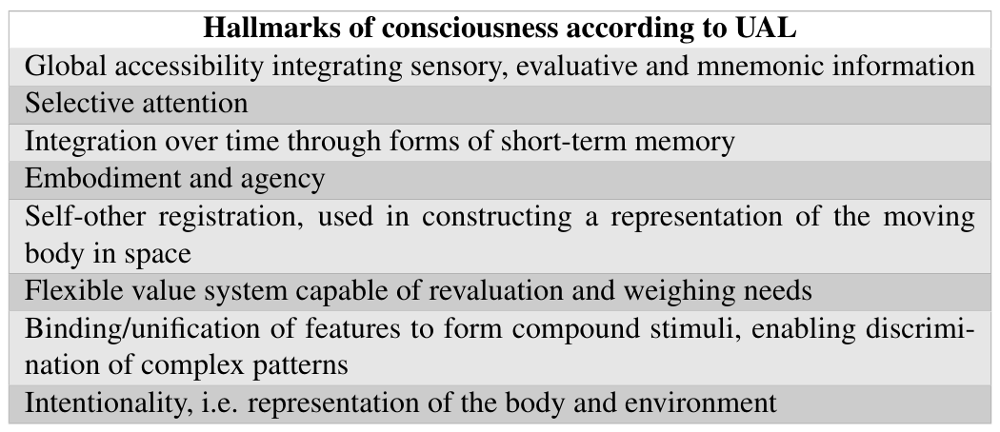

**Ayoai Impact**: This paper provides scientific grounding for consciousness indicators that Ayoai can implement:
- **Recurrent Processing**: Already present in Ayoai's perception-action loops
- **Global Workspace**: The event bus architecture supports this
- **Predictive Processing**: Behavior trees with anticipation nodes
- **Attention Schema**: The perception system's focus mechanisms

Rather than claiming consciousness, Ayoai can implement these indicators to create more believable agents. This also provides a roadmap for premium features - more sophisticated consciousness indicators at higher tiers.

## Edelman's Steps Toward a Conscious Artifact

- Edelman's Steps Toward a Conscious Artifact <https://arxiv.org/abs/2105.10461>

  - Abstract
    - In 2006, during a meeting of a working group of scientists in La Jolla, California at The Neurosciences Institute (NSI), Gerald Edelman described a roadmap towards the creation of a Conscious Artifact. As far as I know, this roadmap was not published. However, it did shape my thinking and that of many others in the years since that meeting. This short paper, which is based on my notes taken during the meeting, describes the key steps in this roadmap. I believe it is as groundbreaking today as it was more than 15 years ago.

  - **Edelman's Roadmap Steps**:
    - Progressive development from basic perception to complex consciousness
    - Emphasizes value systems and categorization as foundational
    - 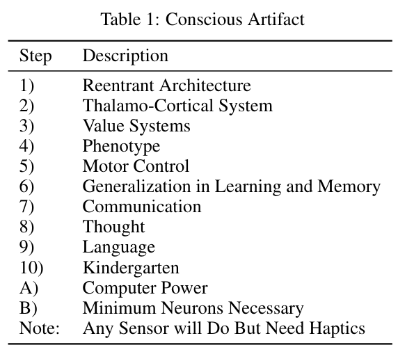

**Ayoai Impact**: Edelman's roadmap aligns with Ayoai's development trajectory. The steps toward consciousness (perception → categorization → memory → value systems → planning) mirror the platform's architecture evolution. This validates the incremental approach to building sophisticated agents.

## Eliciting Human Preferences

- Eliciting Human Preferences with Language Models <https://arxiv.org/abs/2310.11589>

  - Abstract
    - Language models (LMs) can be directed to perform target tasks by using labeled examples or natural language prompts. But selecting examples or writing prompts for can be challenging--especially in tasks that involve unusual edge cases, demand precise articulation of nebulous preferences, or require an accurate mental model of LM behavior. We propose to use *LMs themselves* to guide the task specification process. In this paper, we introduce **Generative Active Task Elicitation (GATE)**: a learning framework in which models elicit and infer intended behavior through free-form, language-based interaction with users. We study GATE in three domains: email validation, content recommendation, and moral reasoning. In preregistered experiments, we show that LMs prompted to perform GATE (e.g., by generating open-ended questions or synthesizing informative edge cases) elicit responses that are often more informative than user-written prompts or labels. Users report that interactive task elicitation requires less effort than prompting or example labeling and surfaces novel considerations not initially anticipated by users. Our findings suggest that LM-driven elicitation can be a powerful tool for aligning models to complex human preferences and values.

  - **GATE Framework Application**:
    - LMs guide the task specification process through interactive dialogue
    - Reduces configuration complexity for game developers
    - 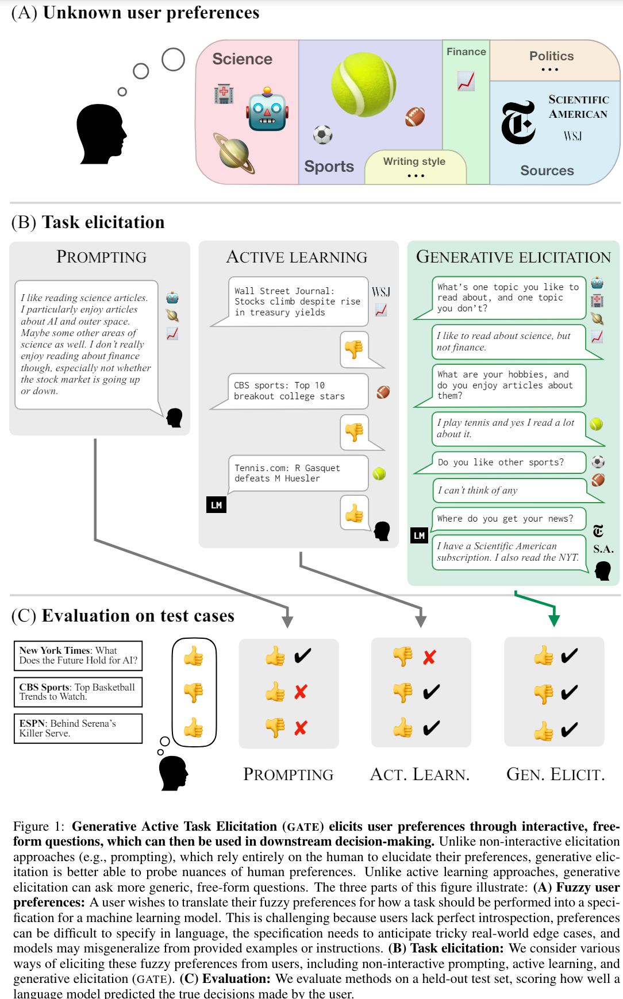

**Ayoai Impact**: GATE methodology could revolutionize how game developers configure agent personalities in Ayoai:
- Instead of complex configuration files, developers converse with the system
- The platform elicits preferences through natural dialogue
- Automatically generates edge cases for testing agent behaviors
- Reduces the barrier to entry for non-technical game developers

## A Paradigm for AI Consciousness

- A Paradigm for AI Consciousness <https://files.theseedsofscience.org/2024/A_Paradigm_for_AI_Consciousness.pdf>

  - Abstract
    - How can we create a container for knowledge about AI consciousness? This work introduces a new framework based on physicalism, decoherence, and symmetry. Major arguments include (1) atoms are a more sturdy ontology for grounding consciousness than bits, (2) Wolfram's 'branchial space' is where an object's true shape lives, (3) electromagnetism is a good proxy for branchial shape, (4) brains and computers have significantly different shapes in branchial space, (5) symmetry considerations will strongly inform a future science of consciousness, and (6) computational efficiency considerations may broadly hedge against "s-risk"

  - **Framework Components**:
    - Physicalism and decoherence-based approach
    - "Branchial space" as true object representation
    - Computational efficiency as hedge against s-risk
    - Reference: <https://x.com/johnsonmxe/status/1800915125714747584?s=19>
    - 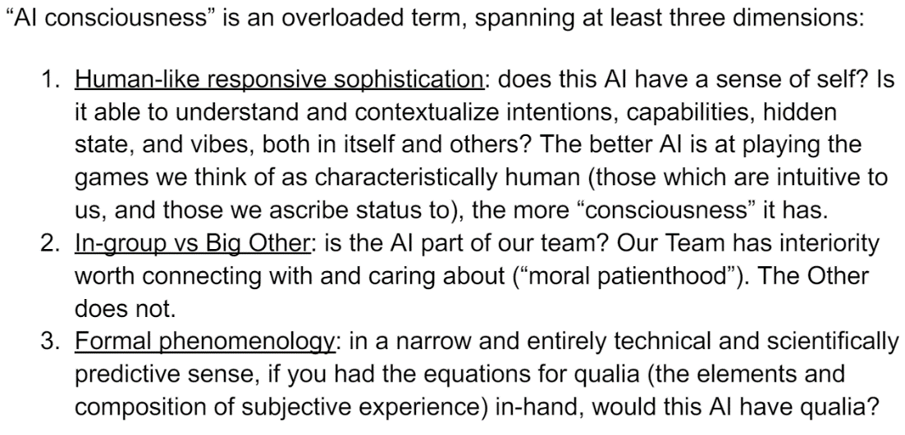
    - 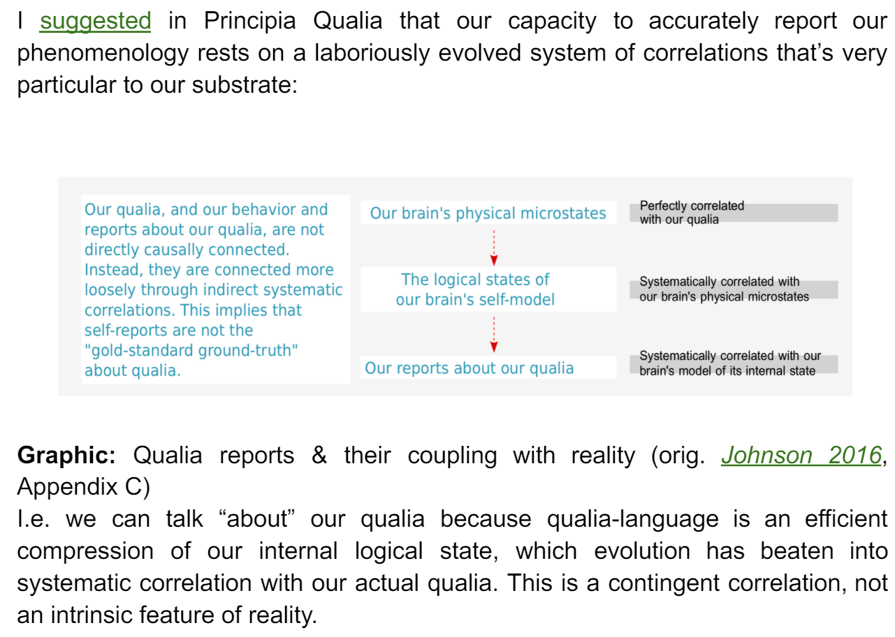
    - 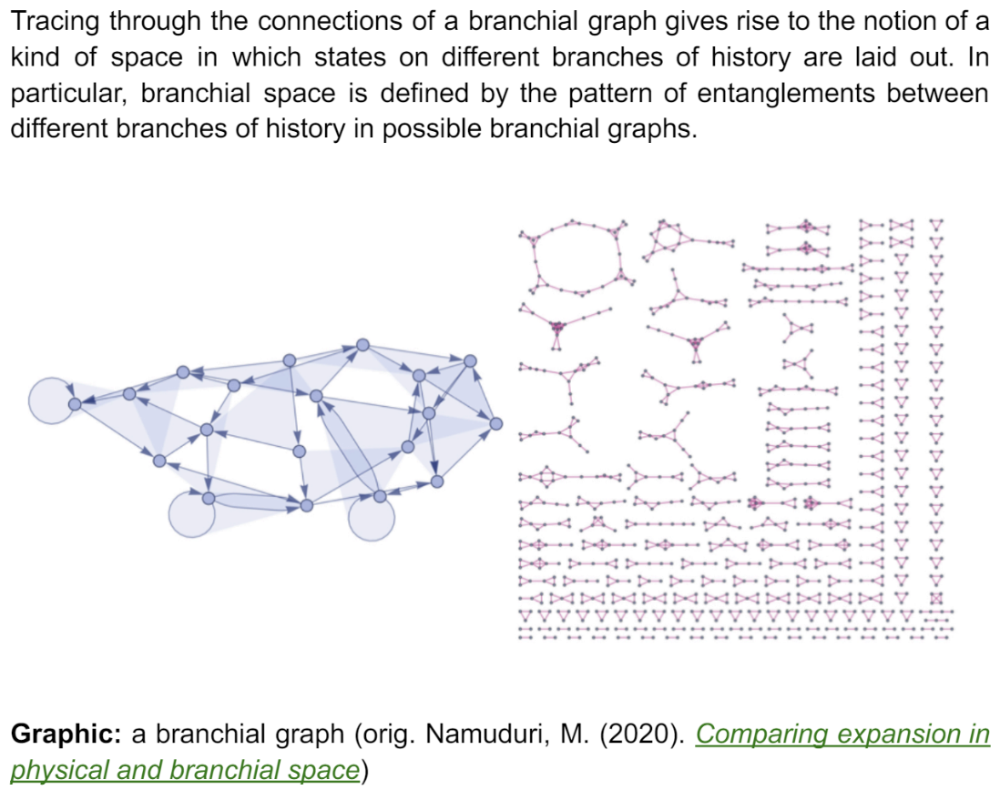
    - 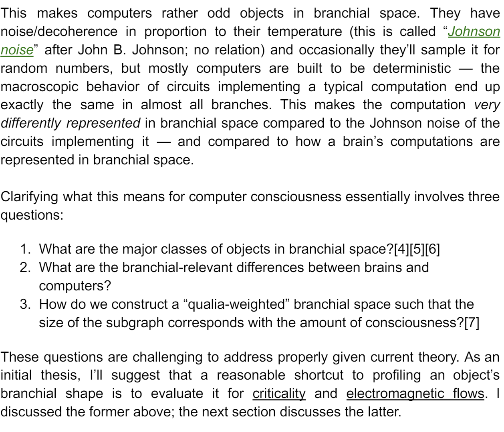

**Ayoai Impact**: While philosophically interesting, this framework suggests practical considerations:
- Focus on computational efficiency (aligns with <500ms response time goal)
- Consider emergence properties when scaling to thousands of agents
- The "shape in branchial space" concept could inform how agents perceive and categorize their world differently than humans

## Computational Boundary of a "Self"

- The Computational Boundary of a "Self": Developmental Bioelectricity Drives Multicellularity and Scale-Free <https://www.frontiersin.org/journals/psychology/articles/10.3389/fpsyg.2019.02688/full> Cognition

  - Abstract
    - All epistemic agents physically consist of parts that must somehow comprise an integrated cognitive self. Biological individuals consist of subunits (organs, cells, and molecular networks) that are themselves complex and competent in their own native contexts. How do coherent biological Individuals result from the activity of smaller sub-agents? To understand the evolution and function of metazoan creatures' bodies and minds, it is essential to conceptually explore the origin of multicellularity and the scaling of the basal cognition of individual cells into a coherent larger organism. In this article, I synthesize ideas in cognitive science, evolutionary biology, and developmental physiology toward a hypothesis about the origin of Individuality: "Scale-Free Cognition." I propose a fundamental definition of an Individual based on the ability to pursue goals at an appropriate level of scale and organization and suggest a formalism for defining and comparing the cognitive capacities of highly diverse types of agents. Any Self is demarcated by a computational surface -- the spatio-temporal boundary of events that it can measure, model, and try to affect. This surface sets a functional boundary - a cognitive "light cone" which defines the scale and limits of its cognition. I hypothesize that higher level goal-directed activity and agency, resulting in larger cognitive boundaries, evolve from the primal homeostatic drive of living things to reduce stress -- the difference between current conditions and life-optimal conditions. The mechanisms of developmental bioelectricity - the ability of all cells to form electrical networks that process information - suggest a plausible set of gradual evolutionary steps that naturally lead from physiological homeostasis in single cells to memory, prediction, and ultimately complex cognitive agents, via scale-up of the basic drive of infotaxis. Recent data on the molecular mechanisms of pre-neural bioelectricity suggest a model of how increasingly sophisticated cognitive functions emerge smoothly from cell-cell communication used to guide embryogenesis and regeneration. This set of hypotheses provides a novel perspective on numerous phenomena, such as cancer, and makes several unique, testable predictions for interdisciplinary research that have implications not only for evolutionary developmental biology but also for biomedicine and perhaps artificial intelligence and exobiology.

  - **Core Concepts**:
    - Scale-free cognition across biological levels (cells to organisms to swarms)
    - "Cognitive light cone" defining agent capabilities
    - Goal-directed activity as the defining feature of selfhood
    - 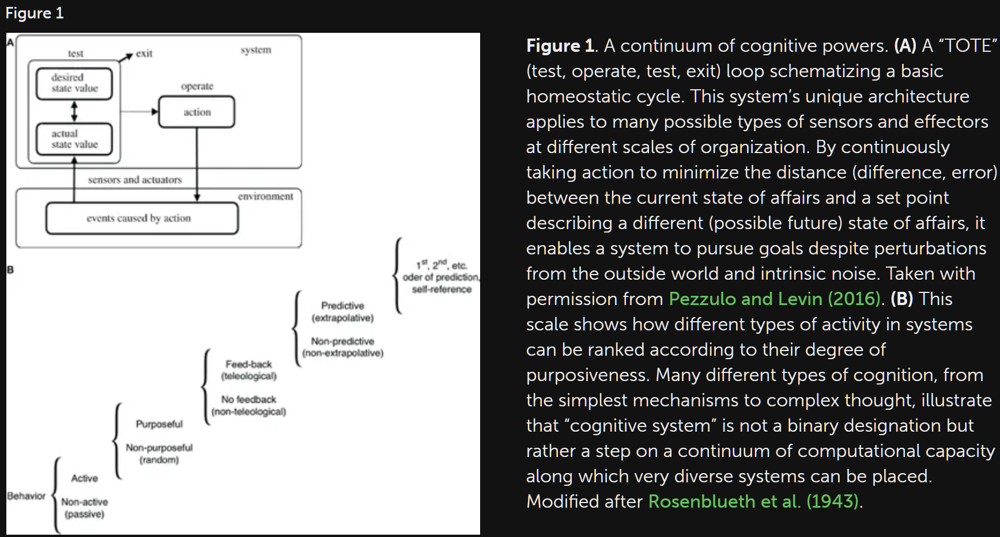

  - **The Cognitive Boundary Framework**:
    - An agent's "self" is defined by the spatio-temporal boundaries of what it can perceive and influence
    - Simple organisms (ticks) have small boundaries: immediate space, minimal memory
    - Complex organisms (humans) have large boundaries: can plan decades ahead, consider planetary scales
    - This creates a "cognitive light cone" - events outside this boundary are inaccessible to the agent
    - 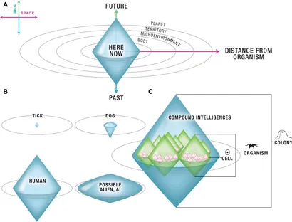

  - **Key Principles of Scale-Free Cognition**:
    1. **Goal-Pursuit Defines Agents**: Systems become "selves" through integrated goal-directed behavior
    2. **Quantifiable Boundaries**: Agent sophistication measurable by spatio-temporal reach
    3. **Malleable Borders**: Cognitive boundaries can expand/contract through development
    4. **Multi-Level Selves**: Single physical systems can support multiple nested agents
    5. **Information Drive**: "Infotaxis" (seeking actionable intelligence) drives cooperation
    6. **Scale Invariance**: Same principles apply from cells to swarms
    - 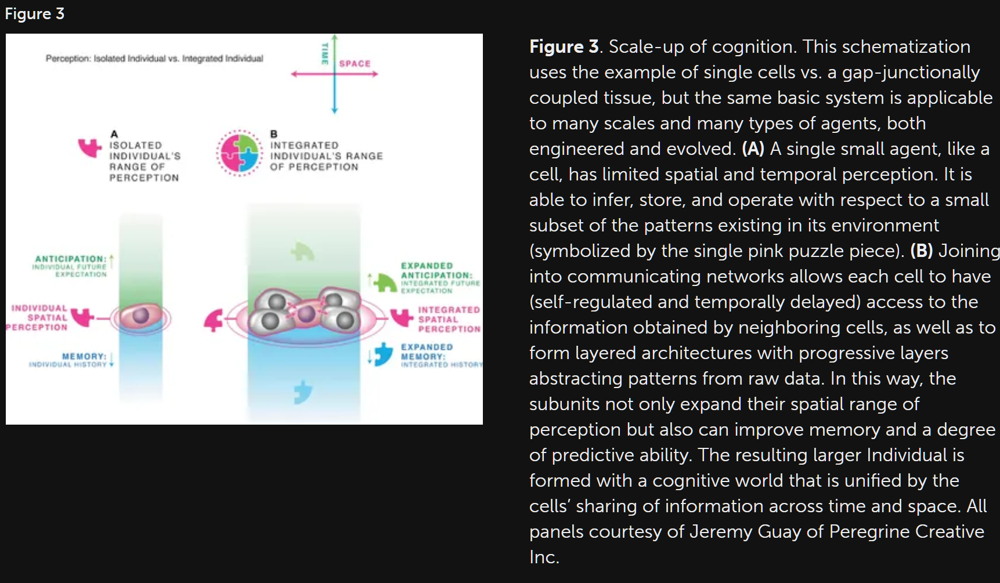

**Ayoai Impact**: This is perhaps the most profound paper for Ayoai's architecture. The "cognitive light cone" concept provides a framework for agent capabilities:
- **Spatial boundaries**: How far can an agent perceive and act in the game world?
- **Temporal boundaries**: Memory duration and planning horizon
- **Goal hierarchies**: From immediate survival to long-term objectives

This maps directly to Ayoai's tiered offerings:
- Basic tier: Small cognitive boundary (local awareness, short memory)
- Pro tier: Medium boundary (area awareness, persistent relationships)
- Enterprise: Large boundary (world awareness, complex long-term goals)

The scale-free cognition principle suggests that Ayoai's multi-agent systems could exhibit emergent collective intelligence, where groups of agents form higher-order "selves" with expanded cognitive boundaries.

## Personality-Specific Processing

### Preference Learning and History

Agents must learn individual preferences through experience and observation:
- Track positive/negative outcomes from past actions (e.g., "burnt pizza" → negative value)
- Aggregate preferences across social groups (family food preferences)
- Use historical data to predict future satisfaction
- Enable persistent learning from player interactions

This creates truly personal AI where each NPC develops unique preferences based on their specific experiences rather than generic behavioral patterns.

### Mental Trees Architecture

A revolutionary concept: parallel behavior trees for cognitive processes.

**Physical Behavior Trees**: Handle world interactions and movements
**Mental Trees**: Process internal cognitive tasks:
- Preference evaluation
- Memory consolidation
- Emotional processing
- Goal prioritization
- Social reasoning

These mental trees run continuously, updating the agent's internal state and influencing physical behavior tree decisions.

**Ayoai Impact**: The concept of "mental trees" is revolutionary for Ayoai. While behavior trees handle physical actions, mental trees could process:
- Preference evaluation (like the pizza example)
- Memory formation and retrieval
- Emotional state transitions
- Social relationship updates

This dual-tree architecture (physical behavior tree + mental tree) could run in parallel, creating rich internal lives for agents.

### LifingPolls: A Motivational Framework for Agent Behavior

LifingPolls represents a sophisticated personality and motivation system where agents maintain multiple competing "polls" or life priorities that drive their behavior.

**Core Architecture**:
- Each poll represents a life domain (health, social, achievement, spirituality)
- Activities contribute positive/negative values to different polls
- Agents autonomously balance activities based on poll priorities
- LLMs can dynamically populate poll activities based on character archetypes

**Key Design Principles**:
1. **Goal Hierarchies**: Polls contain lists of activities that fulfill specific life goals
2. **Dynamic Weighting**: Task selection based on accumulated "reasons" and urgency
3. **Automated Population**: LLMs generate contextually appropriate activities for each poll
4. **User Customization**: Game developers can edit personalities by adjusting poll weights

**Implementation Concepts**:
- **Reason Tracking**: Each poll maintains reasons for its importance (goals, debts, prevention needs)
- **Priority Calculation**: Activities scored by accumulated reasons and current poll deficits
- **Tempo Templates**: Pre-configured poll weightings (e.g., "basic maintenance" vs "achievement-focused")
- **Autonomous Decision-Making**: Agents request human input only for critical decisions

**Technical Implementation** (from LifingPolls Android app):
- Database structure with response types (reasons, notes, routines)
- Filterable view systems for different poll aspects
- Priority list generation based on poll states

**Ayoai Impact**: LifingPolls provides an intuitive personality system:
1. **Developer Workflow**:
   - Select character template (warrior, merchant, healer)
   - System generates appropriate LifingPolls
   - Fine-tune poll weights for unique personalities
   - Agents autonomously balance activities

2. **Emergent Behavior**: Complex behaviors arise from simple poll balancing, creating believable agents without explicit scripting

3. **Scalability**: Poll-based system works efficiently across thousands of agents with minimal computational overhead

### Learning from OpenSoul's Cognitive Architecture

**Key Insights from OpenSoul** (<https://opensouls.org/>):

1. **Emotional Modeling**:
   - Plutchik's wheel of emotion with numerical intensity values
   - Customizable emotion systems per agent type
   - Standardized emotional state representation

2. **Memory Architecture**:
   - Entity extraction → modeling → clustering → summarization → selective deletion
   - Pragmatic approach to limited context windows
   - Recognition that humans also lack long context windows

3. **Mental Process Templates**:
   - Belief modeling: "Model the mind of ${name} and decide if ${name} would believe X"
   - Structured cognitive operations as reusable templates
   - Parameterized mental processes for different agent types

**Ayoai Impact**: OpenSoul's pragmatic approach validates and informs Ayoai's design:
- **Emotion System**: Adopt Plutchik's wheel as a standard but allow customization
- **Memory Management**: Entity extraction aligns with Ayoai's perception verticles
- **Context Limitations**: Design around realistic context windows rather than assuming unlimited memory
- **Mental Templates**: Create reusable cognitive process templates for belief formation, decision-making, and social reasoning
