# Consciousness and Cognition

This document covers research on cognitive architectures, consciousness models, and the fundamental mechanisms of how autonomous agents think and process information. Understanding these concepts is crucial for building agents that exhibit believable, human-like behavior in Ayoai's platform.

## Core Loops of Every Soul

### Overall Notes

- The anticipation... animals can anticipate things. Hmmm

- How to add a predicate like - if someone is chatting with you, it is rude to move away. So if we were working and starting moving away, we could no longer engage in conversation and that would end. So how are those complexities going to work in pddl?

- What are the things humans should do at the same time subconsciously? I need to know so I can think about the the right threads to use inside roblox. So I can think of the count of threads for one npc.

- I need multiple threads, and people can pay me for more than three. The three core are. Short term, mid term, long term. Can add mid level threads or something? How does that work? Or have the user designate what kind of thread so that is generative???

- Need behavior tree in python? Meaning, say one of the actions picked for the plan needs to be actioned in cloud vs in roblox. Therefore, I need a behavior tree in python as well as in lua. I should have them operate in the same way with the same composite node. The benefit of this is I only have to lean one tree, and that tool and can be refused by me and my prompts fast.

- Give the agent the ability to create these situation/antecedent. They can learn to love...

- The first layer is spiritual, physical, emotional, and mental. Then there are things within those that affect weights. For mental, you have your goals, etc. For spiritual, you have your values like good or bad. For physical, you have your health, hunger, cleanliness. Emotional are your happiness/sadness things.
- But what else did pat have as goals here? Family,
  - Happiness =
  - Health (body, mind, soul)
  - Husband
  - Father
  - Family
  - Friend
  - Finances

- Think like a squirrel, on how the npc's should learn.

### Immediate health

- ?
  - Abstract
    - ?
  - Zak thoughts
    - ?

### Self Perception

- Maslow triangle <https://www.simplypsychology.org/maslow.html>

- 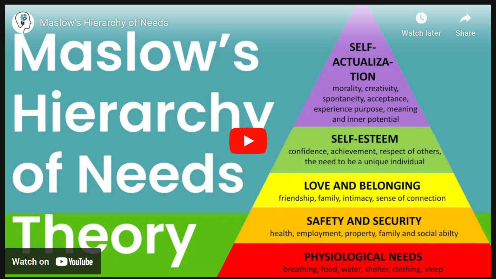

**Ayoai Impact**: Maslow's hierarchy provides a framework for agent motivations. Characters in Ayoai could have dynamic needs that shift based on circumstances - a hungry character prioritizes food over social interaction, creating emergent, believable behavior patterns.

### Time Impacts

- if something is going to take 5 more heart beats to complete, maybe finish that first.

**Ayoai Impact**: Time-based decision making is crucial for realistic agent behavior. Agents should consider task completion time when switching between activities, preventing unnatural behavior like abandoning nearly-complete tasks.

### How Subconscious Threads?

- Zak thinking I can ask an llm how many threads lol. But in future, this is a topic people discuss. To me, it should dynamic.

  - Abstract
    - What are the things humans can do at the same time subconsciously? Like, how many threads are possible at once for a human?

    - If you were to write a computer program to mimic human behavior, how many threads would you use in that program? In other words, how would you use multithreading in a program to mimic human behavior?

  - Zak thoughts
    - What are the things humans can do at the same time subconsciously? Like, how many threads are possible at once for a human?

      - Humans can perform several tasks subconsciously at the same time, much like a computer can run multiple processes in the background. This is largely thanks to the autonomic nervous system, which regulates bodily functions such as heart rate, digestion, respiratory rate, pupillary response, urination, and sexual arousal. This system operates subconsciously and allows us to perform vital functions without thinking about them.

      - Apart from these physiological processes, humans can also engage in automatic processes such as walking, breathing, and blinking simultaneously without conscious thought, especially once these tasks have been well learned and internalized.

      - When it comes to mental or cognitive tasks, multitasking becomes more complicated. While we can perform some automatic mental tasks subconsciously (such as processing sensory information or retaining balance), our conscious brain has limited bandwidth for multitasking, especially when it comes to tasks requiring active thought or attention. Research suggests that when we think we are multitasking, we are often actually switching between tasks rapidly rather than doing them simultaneously.

      - The actual "number of threads" a human can manage at once varies from person to person and depends on a variety of factors, including the nature of the tasks, how well they are learned, and the individual's mental and physical condition. However, it's clear that for tasks requiring conscious thought, this number is quite limited---often effectively one task at a time, especially if the tasks are complex or unfamiliar.

      - In summary, while humans can perform multiple subconscious tasks simultaneously, our capacity for conscious multitasking is significantly more limited.

    - If you were to write a computer program to mimic human behavior, how many threads would you use in that program? In other words, how would you use multithreading in a program to mimic human behavior?

      - Designing a computer program to mimic human behavior using multithreading would be an ambitious and complex task, largely because human behavior is influenced by a vast array of factors including emotions, memories, sensory inputs, and subconscious processes. However, I can provide a conceptual framework for how you might approach this using multithreading, based on various aspects of human behavior and cognitive function.

      - Core Subsystems (Background Threads)
        - Firstly, you could use different threads to simulate the autonomic functions and background processes that the human body maintains subconsciously:

        - 1. Physiological Regulation Thread: This could simulate heart rate, breathing, digestion, and other bodily functions controlled by the autonomic nervous system.

        - 2. Sensory Processing Threads: Separate threads could handle different senses (sight, sound, touch, taste, smell), processing incoming sensory information like a human would, albeit in a simplified form.

        - 3. Emotional Regulation Thread: This could simulate the fluctuation of emotional states over time and in response to various stimuli or thoughts.

        - 4. Memory Management Thread: This would handle the storage, retrieval, and decay of short-term and long-term memories.

        - Active Processing (Foreground Threads)
        - In addition to the background processes, there would be threads dedicated to active, conscious thought and actions:

        - 5. Decision Making Thread: This thread would simulate the process of making decisions based on the current sensory input, emotional state, memories, and logical processing.

        - 6. Motor Control Thread: This would simulate the planning and execution of physical actions, translating decisions into movements.

        - 7. Language Processing Thread: Dedicated to understanding and generating language, simulating conversation, reading, and writing.

        - Integration and Management
        - Finally, you would need a way to coordinate all these threads:

        - 8. Central Executive Thread: Inspired by the central executive component of working memory in cognitive psychology, this thread would manage attention, coordinate the input and output of the other threads, and handle task switching. It simulates the conscious focus of the human mind.

      - Challenges and Considerations
        - • Synchronization and Conflict Resolution: Just like in the human brain, there would need to be mechanisms for these threads to communicate and resolve conflicts (e.g., deciding whether to focus on a task or respond to a new sensory input).

        - • Scalability and Complexity: The real challenge lies in the complexity and depth of each thread. Human behavior is incredibly nuanced and context-dependent.

        - • Learning and Adaptation: Humans learn and adapt over time. The program should include mechanisms for adjusting behavior based on past experiences, which could involve complex algorithms like neural networks or machine learning models within certain threads.

      - Remember, this is a highly simplified and abstracted conceptual model. Actual human cognition and behavior are extraordinarily complex and not fully understood. This model doesn't capture all aspects of human behavior and would be extremely challenging to implement effectively in a real program. However, it does give an idea of how multithreading could be employed in an attempt to simulate different aspects of human behavior and cognition in parallel, much like our brains process multiple streams of information at once.

**Ayoai Impact**: This multithreading model aligns perfectly with Ayoai's architecture. The platform already uses parallel perception verticles (FastPerception + 6 detailed perceptions). This research validates the approach and suggests enhancements:
- Implement the 8-thread model within Roblox's Actor system
- Use Vert.x event bus for thread communication
- Allow premium tiers to unlock more sophisticated threading (as Zak suggests: "people can pay me for more than three")

## Cognition is All You Need

- Cognition is All You Need -- The Next Layer of AI Above Large Language Models <https://arxiv.org/abs/2403.02164>

  - Abstract
    - Recent studies of the applications of conversational AI tools, such as chatbots powered by large language models, to complex real-world knowledge work have shown limitations related to reasoning and multi-step problem solving. Specifically, while existing chatbots simulate shallow reasoning and understanding they are prone to errors as problem complexity increases. The failure of these systems to address complex knowledge work is due to the fact that they do not perform any actual cognition. In this position paper, we present Cognitive AI, a higher-level framework for implementing programmatically defined neuro-symbolic cognition above and outside of large language models. Specifically, we propose a dual-layer functional architecture for Cognitive AI that serves as a roadmap for AI systems that can perform complex multi-step knowledge work. We propose that Cognitive AI is a necessary precursor for the evolution of higher forms of AI, such as AGI, and specifically claim that AGI cannot be achieved by probabilistic approaches on their own. We conclude with a discussion of the implications for large language models, adoption cycles in AI, and commercial Cognitive AI development.

  - Zak Thoughts
    - 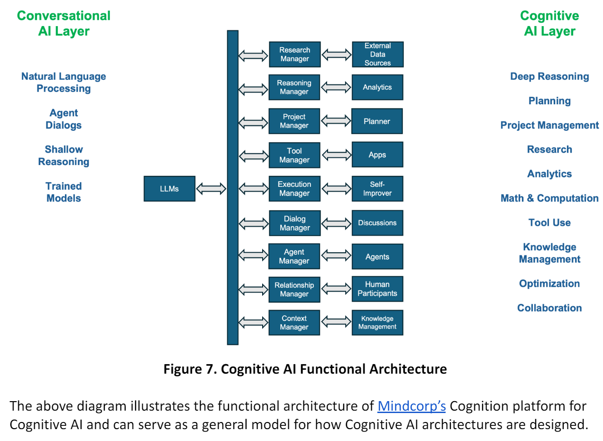

**Ayoai Impact**: This paper directly supports Ayoai's architecture of behavior trees + LLMs. The "dual-layer functional architecture" mirrors Ayoai's approach:
- Layer 1: LLMs for language understanding and generation
- Layer 2: Behavior trees for structured reasoning and multi-step planning
This validates that pure LLM approaches are insufficient for complex agent behaviors.

## CoALA - Cognitive Architectures

- Cognitive Architectures for Language Agents https://arxiv.org/abs/2309.02427

  - Abstract
    - Recent efforts have augmented large language models (LLMs) with external resources (e.g., the Internet) or internal control flows (e.g., prompt chaining) for tasks requiring grounding or reasoning, leading to a new class of language agents. While these agents have achieved substantial empirical success, we lack a systematic framework to organize existing agents and plan future developments. In this paper, we draw on the rich history of cognitive science and symbolic artificial intelligence to propose Cognitive Architectures for Language Agents (CoALA). CoALA describes a language agent with modular memory components, a structured action space to interact with internal memory and external environments, and a generalized decision-making process to choose actions. We use CoALA to retrospectively survey and organize a large body of recent work, and prospectively identify actionable directions towards more capable agents. Taken together, CoALA contextualizes today's language agents within the broader history of AI and outlines a path towards language-based general intelligence.

  - Zak Thoughts
    - 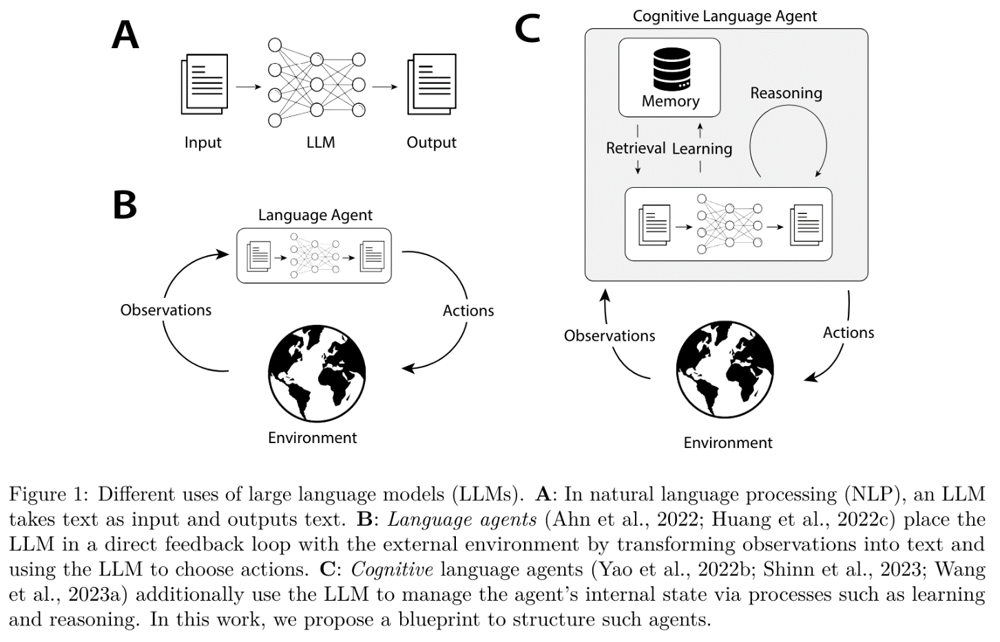
    - 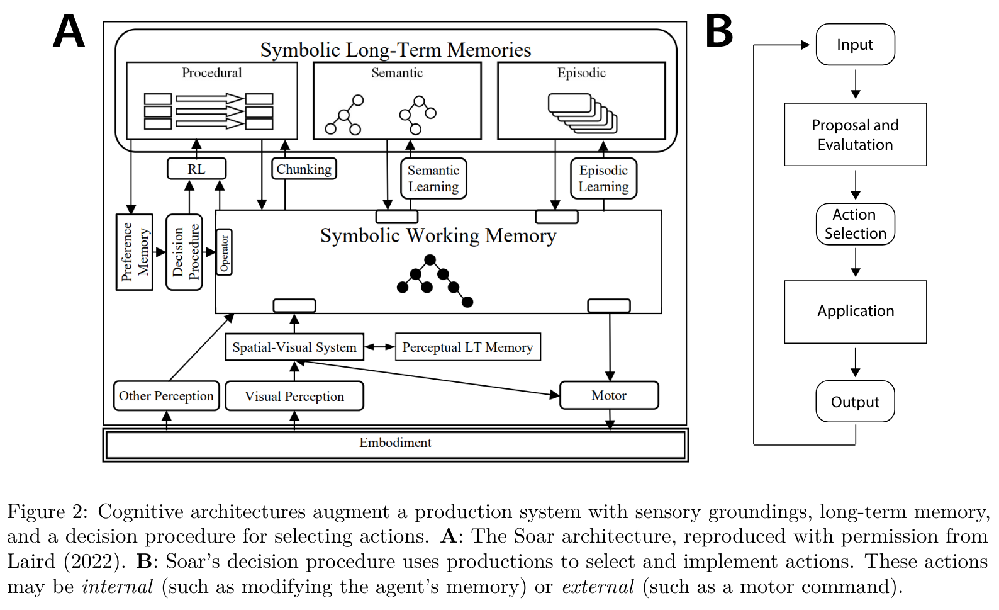
    - 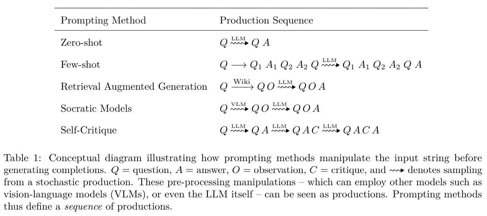
    - 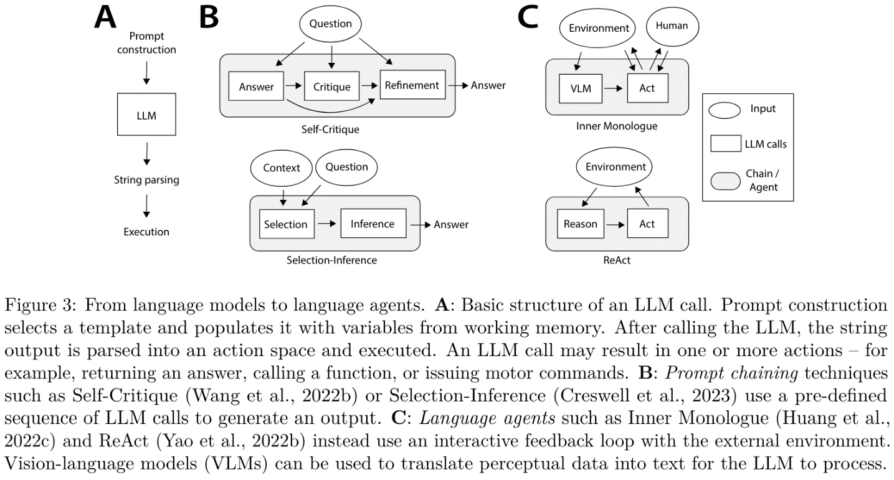
    - 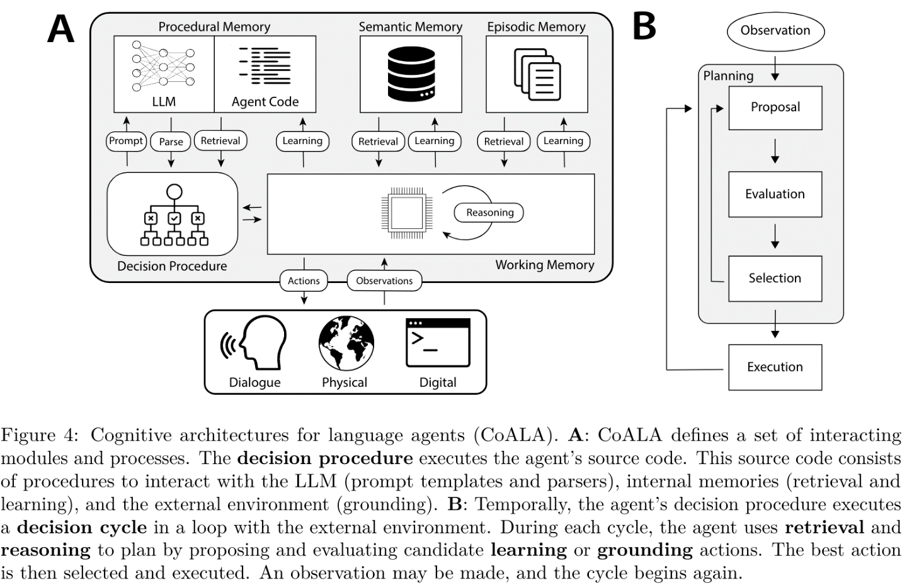
    - 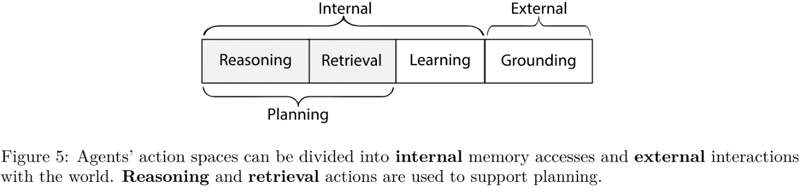

**Ayoai Impact**: CoALA provides a complete blueprint for Ayoai's cognitive architecture:
- **Memory Components**: Maps to Ayoai's planned memory systems (STM/LTM)
- **Structured Action Space**: Aligns with behavior tree nodes
- **Decision-Making Process**: Validates the intent evaluation system
The modular design allows Ayoai to incrementally add cognitive capabilities without redesigning the core.

## The Four Vectors of Human Consciousness

- Considering the four domains of consciousness as vector <https://www.psychologytoday.com/us/blog/theory-of-knowledge/202405/the-four-vectors-of-human-consciousness>

  - Abstract
    - This blog divides human consciousness into four primary vectors. In prior blogs, I have referred to them as domains and attractor states (e.g., here or here). Framing them as vectors is useful because it can be helpful to analyze them in terms of magnitude and direction of focus.

    - The first vector is the "I". This is the Ego, and it is the domain of self-conscious reflection and narration. In adults, it is the domain that holds dominion and a sense of personal ownership and responsibility for what one does. In UTOK, the Unified Theory of Knowledge, the Ego is framed as the mental organ of justification. Its attractor state is to find a justified state of being. This means it tries to develop a coherent story that feels familiar and that cognitive dissonance is reduced. It can also be considered "the interpreter" of our minds. Developmentally, it starts to come online via language and socialization around the age of two; however, it only becomes a central organizing vector around the age of six. From there, the Ego grows in magnitude. By adolescence, it has transformed to become the primary seat of the person's identity.

    - The second vector is the core, primate Self. Although many systems equate the Ego with the Self, in UTOK, these are recognized to be very different aspects of our structure. The relationship between the two can be helpfully framed via what William James called the "I-Me" relation. Consider when a therapist asks: "How do you feel?" and the client says, "I think I feel a bit angry about all this." This is an example of their Ego introspecting on their core Self.

    - The core Self is a perceiving, motivated, emotional system that tracks what is relevant for the self over time and from a point of view. It can be framed as having "vertical layers" that follow our evolutionary history. There is a basic animal layer, which is the seat of feelings like pleasure, pain, hunger, and fear. Then, there is a mammalian layer, which includes an implicit model of the self over time. This model allows mammals to mentally project themselves into different possible environments and simulate possible outcomes (e.g., when a rat gets to a choice point in a maze, it will simulate various paths and choose the one it expects to be most rewarding/least punishing).

    - The third evolutionary layer is the primate layer, which, in humans, is a highly relational structure. UTOK maps the relational aspects of our primate selves via the Influence Matrix. The matrix posits that the human heart (i.e., the primate core Self) is structured via self-in-relation-to-other processes, which can, coincidentally, also be mapped on four vectors.

    - The central dimension is the relational value-social influence vector, and it tracks the degree of social influence one has, as well as the extent to which one feels seen, known, and valued by important others. The matrix also maps three "process" vectors, called power, love, and freedom. The power vector relates to rank, control, and status, and it is marked by the blue line and dominance and submission poles. The love vector is in red, and it relates to the degree and kind of affiliation one has with others (e.g., kinship, friendship, romantic, group), and its opposite: hostile reactivity and distancing. The freedom vector is in green, and it tracks the level of involvement, engagement, and dependency, and is marked by the poles of autonomy and dependency. The primate self is operative at birth and the first major attractor is to orient the infant to connect with and be held securely by their primary caretaker.

    - Many folks, perhaps especially men, are quite alienated from their core Self, and do not have much practice attending to this vector with attunement and care. In common language, their head is not well-aligned with their heart. That said, the core Self is incredibly powerful in shaping how humans are situated in and operate in the world. The relationship between these two vectors of human consciousness was well-framed by Freud as that of a rider (Ego) and horse (Self). It was usefully updated by the social psychologist Jonathan Haidt as that of a rider and an elephant, to emphasize the magnitude of its influence on the human psyche.

    - The third vector is the Persona. This can be thought of as the social self or public-facing self. The Persona represents a real or imagined audience and how it can impact our conscious experience. The primary attractor is the image one tries to convey and regulate in the relational context. To use a frame from Martin Buber, we can think of the Ego-Persona relation as being the basic frame we use to embody I-Thou relations.

    - Individuals who experience high levels of public self-consciousness are folks who have a strong but insecure Persona vector. Because it represents the information and image one is conveying to the relational field and how that is received, it is guided by both the primate Self and the Ego. However, as the Ego develops, the Persona becomes more explicitly linked to the Ego. The reason has to do with the nature of and dynamics surrounding justification. Unlike subjective feelings and experiences, justifications flow freely through the skin. In humans, the Ego can be directly contacted by others with questions like, "Why did you do that?" Because of this, regulating what others might come to know about us is a major task, and so the Persona becomes a central attractor that we need to navigate. (See here for a recent blog on the filter dynamics between the Ego and the Persona).

    - To see the last vector, close your eyes and then open them. What happens? You are simply presented with a flash of pure Awareness. In an instant, you experience what "is" in the "now." Each frame of experience can be thought of as a moment of epistemic awareness.

    - We can call this vector pure Awareness accessed via witness consciousness. You can play with the pure awareness vector by where you direct your attention. You can think of your grandmother, shift to your big toe, and come back to the point of this blog. Many meditation traditions and practices are structured to help folks get in contact with witness consciousness. Some do this by emphasizing attention and concentration. Others do it by emphasizing the pure awareness aspect of the witness function. Indeed, in advanced forms of mediation and practice, the witnesser can feel like they disappear, resulting in a profound sense of non-dual awareness.

    - I encourage you to think about your consciousness as being made up or shaped by these vectors. When they are framed as vectors, we can reflect on the magnitude and direction, and wonder if they are in healthy alignment. Is one vector dominant over the others? Are you constantly thinking about what others think of you and trying to mold yourself to that? Then perhaps your Persona vector is a bit strong. Do you frequently justify yourself by trying to explain why you are right, smart, and good? Then your Ego vector might be excessive. Do you feel things very strongly, react emotionally, and experience your feelings as "the truth"? Then your core Self might be powering you in a maladaptive way.

    - In terms of the witness vector of pure Awareness, in modern society, where we are obsessed with the self, the most likely problem is that it is underdeveloped relative to the other three vectors. So, the question is: Can you see this aspect of your consciousness, and do you truly know how to identify with it and connect to the here, now?

    - 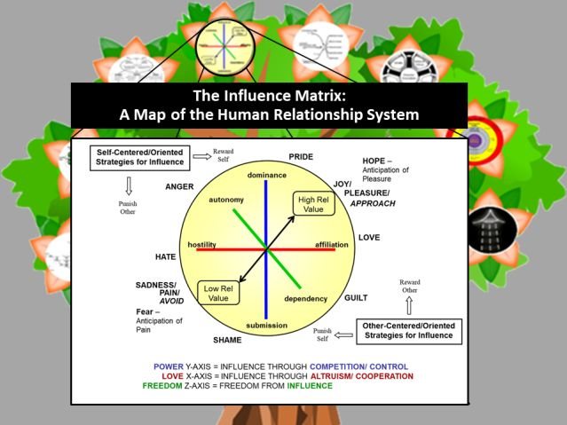
    - 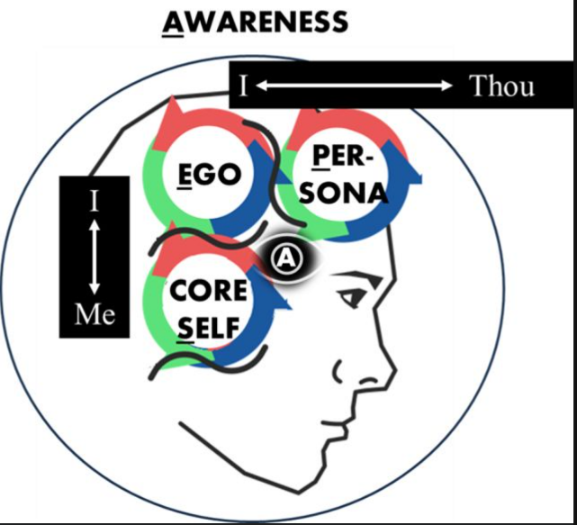

**Ayoai Impact**: The four vectors model provides a sophisticated framework for agent personality:
1. **Ego (I)**: Agent's self-narrative and justifications - implementable through LLM-generated internal monologues
2. **Core Self**: Emotional states and motivations - maps to Ayoai's emotional state tracking
3. **Persona**: Public-facing behavior - crucial for agent-player interactions
4. **Awareness**: Attention and perception - aligns with Ayoai's perception system

This enables creating agents with varying personality profiles by adjusting vector strengths, creating diversity without explicit programming each personality.

## Consciousness in Artificial Intelligence

- Consciousness in Artificial Intelligence: Insights from the Science of Consciousness <https://arxiv.org/abs/2308.08708>

  - Abstract
    - Whether current or near-term AI systems could be conscious is a topic of scientific interest and increasing public concern. This report argues for, and exemplifies, a rigorous and empirically grounded approach to AI consciousness: assessing existing AI systems in detail, in light of our best-supported neuroscientific theories of consciousness. We survey several prominent scientific theories of consciousness, including recurrent processing theory, global workspace theory, higher-order theories, predictive processing, and attention schema theory. From these theories we derive "indicator properties" of consciousness, elucidated in computational terms that allow us to assess AI systems for these properties. We use these indicator properties to assess several recent AI systems, and we discuss how future systems might implement them. Our analysis suggests that no current AI systems are conscious, but also suggests that there are no obvious technical barriers to building AI systems which satisfy these indicators.

  - Zak thoughts
    - This is one of the most important papers here, and it should be a gold standard guiding star for us to follow. Pay attention to this stuff. . .
    - 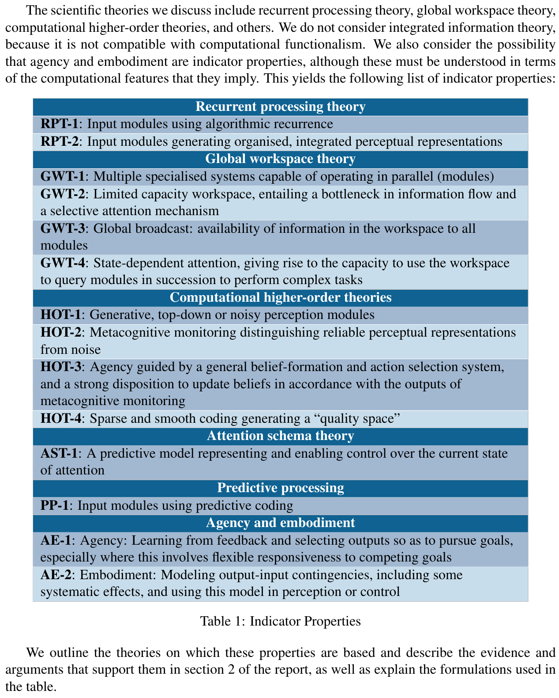
    - 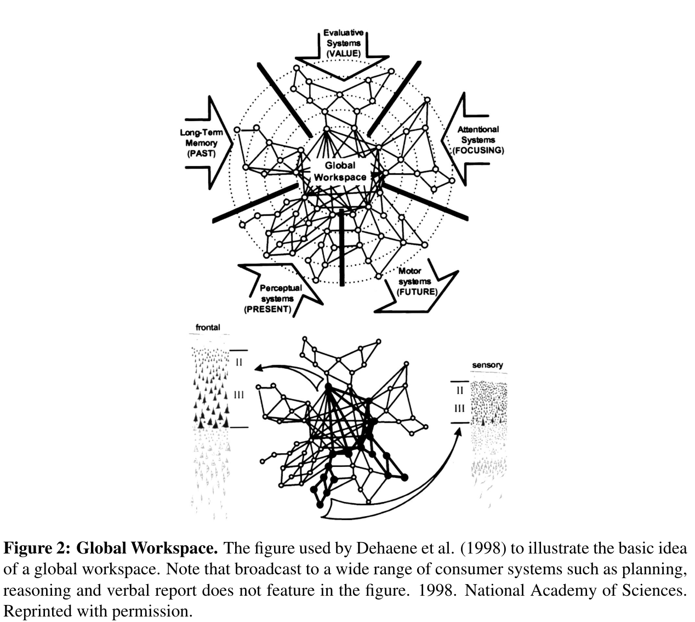
    - 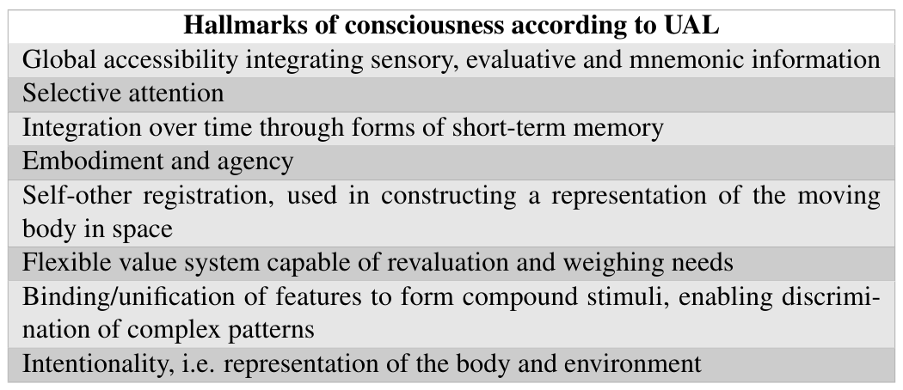

**Ayoai Impact**: This paper provides scientific grounding for consciousness indicators that Ayoai can implement:
- **Recurrent Processing**: Already present in Ayoai's perception-action loops
- **Global Workspace**: The event bus architecture supports this
- **Predictive Processing**: Behavior trees with anticipation nodes
- **Attention Schema**: The perception system's focus mechanisms

Rather than claiming consciousness, Ayoai can implement these indicators to create more believable agents. This also provides a roadmap for premium features - more sophisticated consciousness indicators at higher tiers.

## Edelman's Steps Toward a Conscious Artifact

- Edelman's Steps Toward a Conscious Artifact <https://arxiv.org/abs/2105.10461>

  - Abstract
    - In 2006, during a meeting of a working group of scientists in La Jolla, California at The Neurosciences Institute (NSI), Gerald Edelman described a roadmap towards the creation of a Conscious Artifact. As far as I know, this roadmap was not published. However, it did shape my thinking and that of many others in the years since that meeting. This short paper, which is based on my notes taken during the meeting, describes the key steps in this roadmap. I believe it is as groundbreaking today as it was more than 15 years ago.

  - Zak thoughts
    - 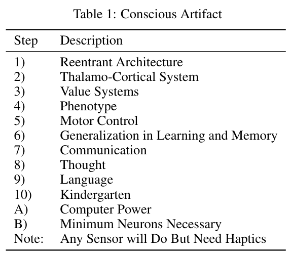

**Ayoai Impact**: Edelman's roadmap aligns with Ayoai's development trajectory. The steps toward consciousness (perception → categorization → memory → value systems → planning) mirror the platform's architecture evolution. This validates the incremental approach to building sophisticated agents.

## Eliciting Human Preferences

- Eliciting Human Preferences with Language Models <https://arxiv.org/abs/2310.11589>

  - Abstract
    - Language models (LMs) can be directed to perform target tasks by using labeled examples or natural language prompts. But selecting examples or writing prompts for can be challenging--especially in tasks that involve unusual edge cases, demand precise articulation of nebulous preferences, or require an accurate mental model of LM behavior. We propose to use *LMs themselves* to guide the task specification process. In this paper, we introduce **Generative Active Task Elicitation (GATE)**: a learning framework in which models elicit and infer intended behavior through free-form, language-based interaction with users. We study GATE in three domains: email validation, content recommendation, and moral reasoning. In preregistered experiments, we show that LMs prompted to perform GATE (e.g., by generating open-ended questions or synthesizing informative edge cases) elicit responses that are often more informative than user-written prompts or labels. Users report that interactive task elicitation requires less effort than prompting or example labeling and surfaces novel considerations not initially anticipated by users. Our findings suggest that LM-driven elicitation can be a powerful tool for aligning models to complex human preferences and values.

  - Zak Thoughts
    - 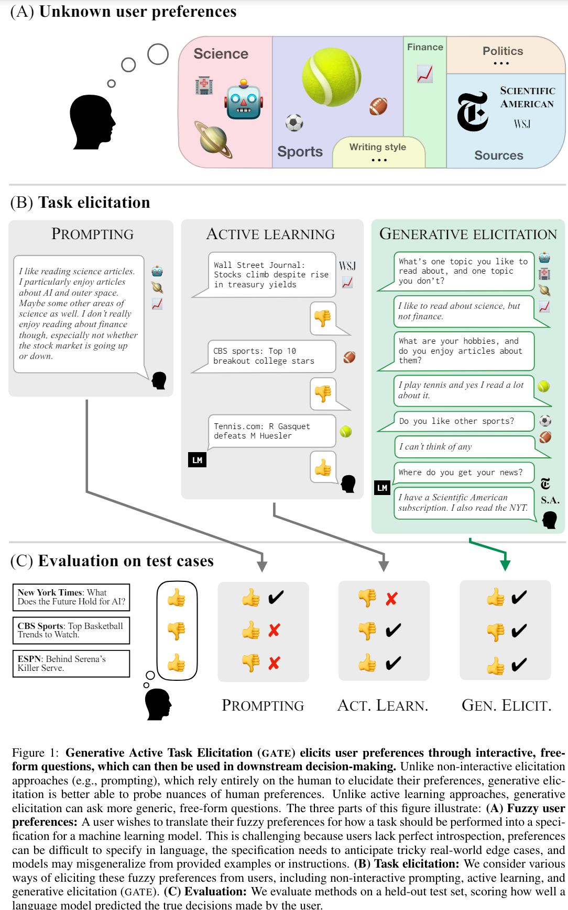

**Ayoai Impact**: GATE methodology could revolutionize how game developers configure agent personalities in Ayoai:
- Instead of complex configuration files, developers converse with the system
- The platform elicits preferences through natural dialogue
- Automatically generates edge cases for testing agent behaviors
- Reduces the barrier to entry for non-technical game developers

## A Paradigm for AI Consciousness

- A Paradigm for AI Consciousness <https://files.theseedsofscience.org/2024/A_Paradigm_for_AI_Consciousness.pdf>

  - Abstract
    - How can we create a container for knowledge about AI consciousness? This work introduces a new framework based on physicalism, decoherence, and symmetry. Major arguments include (1) atoms are a more sturdy ontology for grounding consciousness than bits, (2) Wolfram's 'branchial space' is where an object's true shape lives, (3) electromagnetism is a good proxy for branchial shape, (4) brains and computers have significantly different shapes in branchial space, (5) symmetry considerations will strongly inform a future science of consciousness, and (6) computational efficiency considerations may broadly hedge against "s-risk"

  - Zak Thoughts
    - Cool twitter post: <https://x.com/johnsonmxe/status/1800915125714747584?s=19>
    - 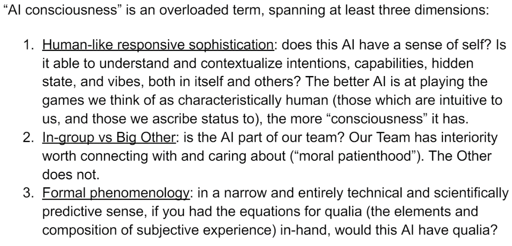
    - 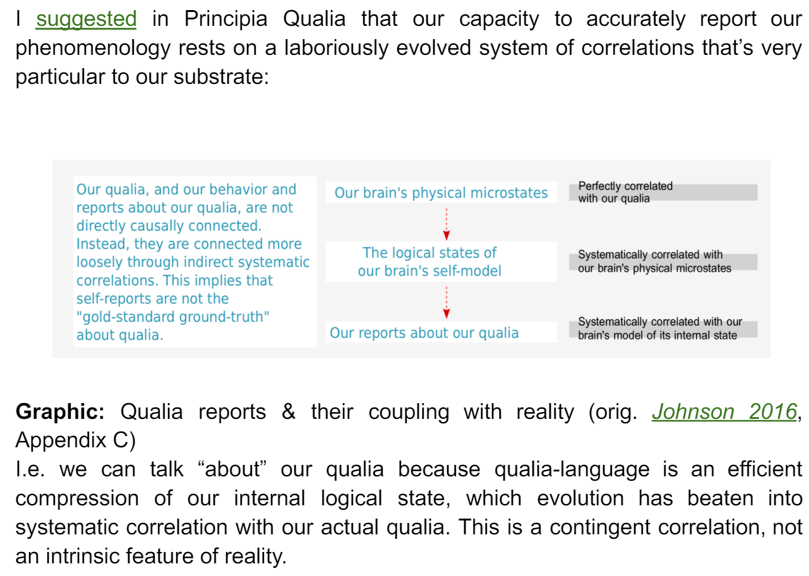
    - 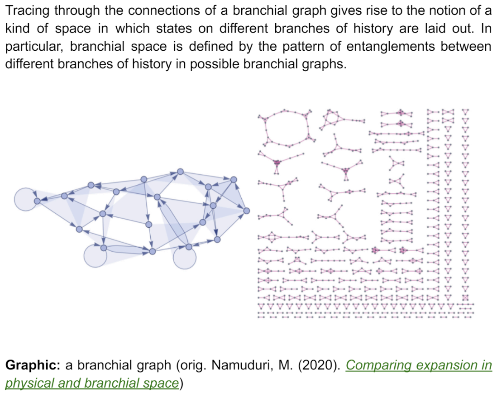
    - 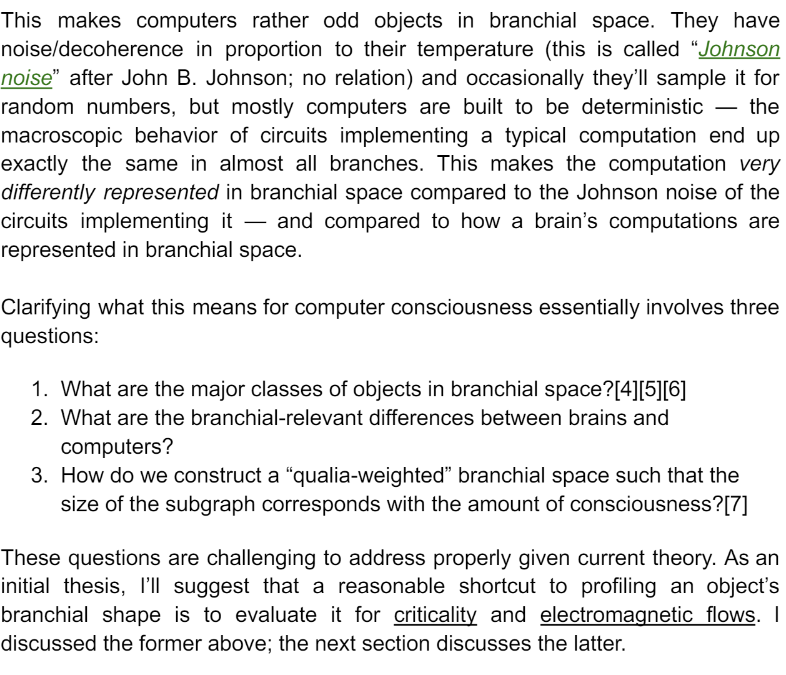

**Ayoai Impact**: While philosophically interesting, this framework suggests practical considerations:
- Focus on computational efficiency (aligns with <500ms response time goal)
- Consider emergence properties when scaling to thousands of agents
- The "shape in branchial space" concept could inform how agents perceive and categorize their world differently than humans

## Computational Boundary of a "Self"

- The Computational Boundary of a "Self": Developmental Bioelectricity Drives Multicellularity and Scale-Free <https://www.frontiersin.org/journals/psychology/articles/10.3389/fpsyg.2019.02688/full> Cognition

  - Abstract
    - All epistemic agents physically consist of parts that must somehow comprise an integrated cognitive self. Biological individuals consist of subunits (organs, cells, and molecular networks) that are themselves complex and competent in their own native contexts. How do coherent biological Individuals result from the activity of smaller sub-agents? To understand the evolution and function of metazoan creatures' bodies and minds, it is essential to conceptually explore the origin of multicellularity and the scaling of the basal cognition of individual cells into a coherent larger organism. In this article, I synthesize ideas in cognitive science, evolutionary biology, and developmental physiology toward a hypothesis about the origin of Individuality: "Scale-Free Cognition." I propose a fundamental definition of an Individual based on the ability to pursue goals at an appropriate level of scale and organization and suggest a formalism for defining and comparing the cognitive capacities of highly diverse types of agents. Any Self is demarcated by a computational surface -- the spatio-temporal boundary of events that it can measure, model, and try to affect. This surface sets a functional boundary - a cognitive "light cone" which defines the scale and limits of its cognition. I hypothesize that higher level goal-directed activity and agency, resulting in larger cognitive boundaries, evolve from the primal homeostatic drive of living things to reduce stress -- the difference between current conditions and life-optimal conditions. The mechanisms of developmental bioelectricity - the ability of all cells to form electrical networks that process information - suggest a plausible set of gradual evolutionary steps that naturally lead from physiological homeostasis in single cells to memory, prediction, and ultimately complex cognitive agents, via scale-up of the basic drive of infotaxis. Recent data on the molecular mechanisms of pre-neural bioelectricity suggest a model of how increasingly sophisticated cognitive functions emerge smoothly from cell-cell communication used to guide embryogenesis and regeneration. This set of hypotheses provides a novel perspective on numerous phenomena, such as cancer, and makes several unique, testable predictions for interdisciplinary research that have implications not only for evolutionary developmental biology but also for biomedicine and perhaps artificial intelligence and exobiology.

  - Zak Thoughts
    - 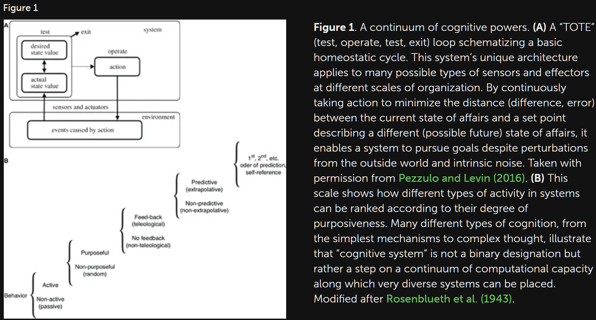

    - Eco-systems consist of groups that are comprised of organisms, which in turn are made of organs composed of tissues, which consist of cells made up of biochemical networks.

    - Remarkably, flexible and adaptive behavior is found at every level, which provides an important background for thinking about scale-invariant, essential features of Individuals in the broadest sense. Do integrated Selves only exist at the level of "organisms" (bodies), or could they arise and co-exist at multiple levels of organization and be recognized in novel contexts and implementations? In preparation for a proposed definition of Selves as goal-directed computational agents regardless of implementation, it is helpful to begin by considering novel embodiments of capacities usually associated with brains.

    - The emerging field known as "basal cognition" tracks the evolutionary history of learning and decision-making processes, beginning from the dynamic problem-solving capacities of cellular and subcellular forms (Lyon, 2006, 2015; Ginsburg et al., 2019). Many examples of memory, anticipation, context-dependent decision-making, and learning are exhibited by organisms from yeast and bacteria to plants and somatic cells [reviewed in (Lyon, 2006, 2015; Baluška and Levin, 2016)].

    - Also important to the understanding of compound biological individuals is the ability of cells to make decisions as a single coherent unit. For example, in early embryos, regions on the left and right sides of the midline need to express left- or right-specific genes in order to establish invariant laterality of the heart and visceral organs.

    - The empirical utility of pursuing metaphors based on the parallels between adaptive whole organism behavior and the plasticity of cellular activity during construction and repair of a body is discussed in detail elsewhere (Pezzulo and Levin, 2015). However, for the proposed view of agency described below, and for thinking about its evolutionary origin, it is important to realize that the parallels between goal-directed behaviors and morphogenesis are not only functional but reflect deep conservation of molecular mechanisms. Neural networks control the movement of a body in three-dimensional space; this scheme may be an evolutionary exaptation and speed-optimization of a more ancient, slower role of bioelectrical signaling: the movement of body configuration through anatomical morphospace during embryogenesis, repair, and remodeling (Sullivan et al., 2016; Mathews and Levin, 2018; Mclaughlin and Levin, 2018). This is an expansion of previous proposals of minimal cognition as sensorimotor coordination (Van Duijn et al., 2006), to include cell behavior during morphogenesis as a kind of sensorimotor activity of a patterning Agent.

    - I propose a definition of an Individual based on its information-processing structure (Barandiaran et al., 2009): the scale and types of goals that a system can pursue defines (determines) the boundaries and content of the putative "agent." On this view, what defines a coherent, unified Self out of its constituent components and the surrounding environment is the set of parts that operate toward reaching specific goal states.

    - Complex cognitive systems can have very large and multifaceted goals, and this arises through evolutionary and ontogenetic scale-up and elaboration of primitive goals that arose from constraints of thermodynamics and homeostasis. The initial, most primitive feature of a living system is preferences -- the fact that some states of the world are better for its welfare than others. This enables learning from positive and negative reinforcement, which leads to an explosion of computational and behavioral capabilities. Preferences evolve into goals to the extent that a system grows in complexity and causal power and becomes able to act in the world in ways that are likely to move it toward preferred regions of its state space (initially, focused on simple metabolic survival, but ranging all the way to complex human psychological needs and perhaps beyond). It is likely that any life we observe today (which has passed the filter of selection) has preferences and is good at optimizing for them (making this criterion a useful part of the very definition of life), but it is possible that our initial efforts at artificial life may construct some truly primitive, transitional cases that can maintain a degree of coherence in a sheltered laboratory environment without an efficient goal-seeking capacity.

    - A very simple organism can only have preferences about what is occurring at the current time, in its immediate environment. A more complex organism whose causal structure enables associative learning can pursue or avoid stimuli that are several steps removed in space, time, and causal connection from whatever it is choosing among. This kind of learning enables associations between stimuli that impinge on very different sensors in different parts of the organism and leads to behavioral preferences about stimuli that are in themselves neutral (do not cause damage or provide immediate reward) but are linked to future positive and negative outcomes by past experience (indirect causal connections stretching across body distance and life history).

    - Others have already made the link between associative learning and the emergence of self (Ginsburg et al., 2019). Very complex selves can have preferences about abstract states that are very far away indeed (such as human beings who are genuinely troubled by the ultimate fate of our star and are actively working toward long-distance space travel and the fate of humanity as a whole). However, the spectrum of Selves is not a simple linear one because of the very wide range of possible natural and artificial agents we do (and will increasingly) encounter. The biological world offers numerous corner cases of swarm individuals, but a good conceptual framework will also include organic artificial life, engineered (computer-based) artificial intelligences, and potential exobiological discoveries. Can highly diverse Selves, with very different material structures be compared with each other in any meaningful way? I suggest that a universal rubric, applicable regardless of the physical implementation, can be defined by focusing on the information processing and goal-directed activity of any given system.

    - The cognitive boundary of an Individual [a "Center of Concern" (Murase and Asakura, 2003)] is the most distant (in time and space) set of events that this system can measure and attempts to regulate in its goal-directed activity. It is a surface indicating what things this system can possibly care about (conversely, it defines preferences as the spatio-temporal domain of states that serve as inputs and outputs to the system). In advanced agents, it is also the boundary of the self-model. A range of such systems is illustrated in Figure 2: using one axis for time and one axis to represent three dimensions of space enables a semi-quantitative representation within which individuals of very variable cognitive capacity can be plotted in the same virtual space. Recent work in artificial life has already begun to characterize the cognitive domains of very diverse kinds of complex systems (Beer, 2014).

    - 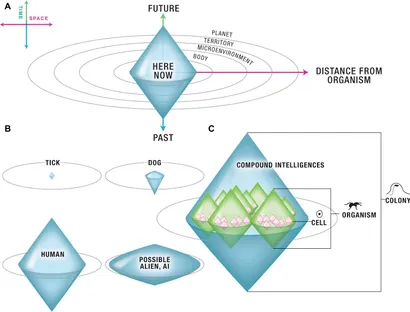

    - Figure 2. Arbitrary cognitive "Individuals" can be classified according to their computational boundary. (A) Each living system has a delimited "area of concern" -- a region of space-time, with the organism at its center, within which its cognitive apparatus functions to take measurements and act. The borders of its cognition are schematized on a semi-quantitative state space defined as follows. The vertical axis is time. Values below the individual's Now are past events, of which it may have a memory extending some duration in the past; values above the Now are future events, which it may be able to predict or anticipate to some distance in the future. The horizontal axis represents three dimensions of space. Each individual, based on its sensory and effector apparatus, and the complexity and organization of information-processing unit layers between them, can measure and attempt to modify conditions within some distance of itself. (B) The size and shape of this cognitive boundary defines the sophistication of the agent and determines the scale of its goal directedness. This scheme enables multiple agents, regardless of their composition/structure or origin (evolved, engineered) to be directly plotted on the same space. The shape of boundary defines each agent's "cognitive light cone" -- anything outside this region is mentally inaccessible to that system. Here are illustrated a few representative life forms. Primitive agents such as ticks may only have a very small area within which they can sense signals and operate -- immediately next to them, and without much memory or ability to anticipate future events. Dogs have significant memory, but very limited ability to plan for the future and can only really care about events in their local vicinity (it is not possible to get a dog to care about what will happen several miles away, or in 2 weeks). Humans exhibit a great diversity of cognitive boundary shapes but on average have a memory that lasts ~102 years, can anticipate decades into the future, and often plan and act to attempt to modify events on quite distant spatial scales (sometimes planetary or even beyond). A variety of as-yet unknown alien, engineered, and bio-synthetic life forms could occupy every conceivable corner of this option space. (C) In this scheme, Individuals can overlap -- the same biophysical system can support a number of coexisting, coupled Selves with different cognitive borders. A coordinated swarm of animals, the individual animals themselves, their organs, their cells, and even the metabolic and transcriptional networks inside the cells each have their own cognitive horizon. They cooperate or compete based on specific circumstances and each can be addressed semi-independently because of the differential goals they pursue (and thus, the different positive and negative reinforcements that can be brought to bear to modify events at a given level). All panels courtesy of Jeremy Guay of Peregrine Creative.

    - The edges of a given Agent's goal space define a sort of "computational light cone" -- the boundaries beyond which its cognitive system cannot operate. For example, a tick has a relatively small cognitive boundary, having very little memory or predictive power in the temporal direction, and sensing/acting very locally. A dog has much more temporal memory, some forward prediction ability, and a degree of spatial concern. However, it is likely impossible for a dog's cognitive apparatus to operate with notions about what is going to happen next month or in the adjacent town. Human minds can operate over goals of vastly greater spatial and temporal scales, and one can readily imagine artificial (organic or software-based) Selves with properties that define every possible shape in this space (and perhaps change their boundaries over evolutionary and individual timescales). As will be seen in the next section, expanding the horizon is what enables information (in the Shannon sense) to acquire meaning, because data become causally linked to distant and past experiences, and acquires implications for future expectations. The formalism also suggests semi-quantitative definitions of maximum cognitive rate (the speed at which information propagates across an agent's body); this and other similarities to the space-time diagrams of Relativity remain to be explored.

    - 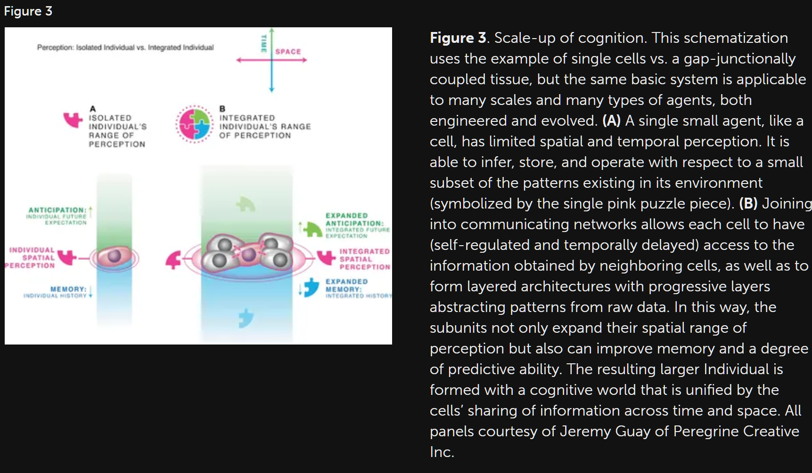

    - Summary of key ideas of Scale-Free Cognition

      - 1. A unified, integrated cognitive Self or Individual can be defined with respect to the integrated ability to pursue specific goals via a homeostatic process that resists perturbations. Goals also define positive and negative reinforcement for that agent, thus enabling communication with/training of highly diverse intelligences. The ability to pursue goals is a major ratchet for evolution because it smooths the selection landscape: the potentially destructive effects of individual mutations are often made up for by the regulative ability of other mechanisms to accomplish specific outcomes despite changes of circumstance (e.g., cells providing blood vessels and tendons to make a coherent finger when a new hand bone is induced).

      - 2. An Agent's cognitive world can be quantified and characterized, enabling comparison with others (regardless of their material implementation), by estimating the spatio-temporal boundaries of its area of concern: the volume in space and time over which the agent is able to take measurements, exert influence, and functionally link disparate events (learning, association).

      - 3. The borders of the temporal and spatial events of which a given system is capable of measuring and acting map out a "cognitive light cone" -- a boundary in the informational space of a mind. These borders can grow or shrink, on evolutionary or ontogenic time scales, as the organization of an agent changes. The key is a balance of selective information sharing, via "synapses" -- structures of arbitrary physical construction which share the feature that they can regulate the passage of signals based on the state of other such elements. Too little sharing results in a failure to bind subunits into a new Self. Too much sharing results in a homogenous soup with insufficient differentiation of modules and abstraction of information across distinct layers.

      - 4. Cancer is a (reversible) shrinking of the computational boundary of a biosystem: by isolating itself from the surrounding tissue's physiological signals, a cell's cognitive boundary shrinks to the small size it had before multicellularity. Cancer cells are not more selfish than somatic metazoan cells -- they are equally selfish but their Self is now scaled down to a single cell (which will reproduce and migrate as much as it can), whereas the normal physiological binding in healthy tissues binds each cell to a common goal represented by the large network -- the construction and repair of a specific large anatomy. These ideas connect naturally to gene-level views of selfishness (Dawkins, 1989); if it is useful to think of genes as selfish agents, it is doubly plausible to view cells and tissues as such, since the latter have much more capacity for activity and computation. Future work will develop, in the contexts of ontogeny and evolution, how the optimization of specific states of affairs (pursuit of goals -- selfish or otherwise) occurs simultaneously at many scales of biological organization.

      - 5. Agents scaled up by evolving from basic homeostatic loops, driven by active inference (surprise minimization) via addition of delays (memory), anticipation (inference), and networks (spatially-distributed processing that enables learning and progressive abstraction/generalization from data). Gathering into larger collectives with optimal informational structure (Klein and Hoel, 2019) improves the computational (predictive) capabilities and gives rise to functional relationships (memories, encoded goal states, test-operate-test-exit loops) that exist over and above any individual member (Miller et al., 1960). These levels coexist, enabling numerous coherent Selves of different scales to be implemented by any collection of living matter.

      - 6. Infotaxis (the drive for better actionable intelligence about the regularities/patterns in the world, and in the agent's own mechanisms) encourages cells to connect in groups via signaling. On the cellular level, this is implemented by diffusion (bacterial biofilm proto-bodies) or direct connections via gap junctions or neurons.

      - 7. Collecting into a syncytium enables all of the cells to share the same data and access the same memories (illustrated, e.g., by the ability of trained slime molds to pass on information to naïve hosts by fusion [Vogel and Dussutour, 2016)], This shared information structure extends to the edges of the large collective, which binds small, individual competent sub-agents into a larger unified Self. These principles likely apply beyond cells in organs, to swarms of whole organisms such as bees and termites (Seeley, 2009; Turner, 2011), as do the dynamics of breakdowns in coordination which share important similarities for example between cancer and social insect colonies (Amdam and Seehuus, 2006).

      - 8. The hypothesis of scale-free cognition does not rely on cooperation per se -- it builds up apparent cooperation from selfish agents minimizing their stress (surprise) and competing for information. Greed, at the single-cell level, for information (infotaxis) drives cooperativity, as each unit expands its measurement boundary (communication with neighbors) and thus inevitably becomes part of a bigger self with bigger set points serving as homeostatic attractors. It only looks like cooperation from a perspective of a higher level, because the higher level of organization shows an integrated Self which appears, necessarily, cooperative.

      - 9. There is a fundamental symmetry between anatomical control mechanisms and cognitive mechanisms. Co-evolution and exaptation drove the mutual enlargement of mechanisms that control patterning and behavioral goals. The same dynamics operate in unicellular systems, multicellular systems, and colonial/swarm organisms and most concepts from memory to cancer are found at every level of organization in biology, from memory in transcriptional networks to regeneration of termite nest structures.

      - 10. Neurons utilize bioelectric computational strategies that were discovered and exploited by evolution as far back as bacteria. There are no sharp distinctions between neural networks and non-neural somatic bioelectrical networks (although they function on different time scales). The functional isomorphism between patterning and cognitive processes is also reflected in the ancient molecular conservation of mechanisms: ion channels and neurotransmitter molecules are ubiquitous across the tree of life. Bioelectric integration helped evolve control strategies and cognitive content across the continuum from chemical networks to human minds -- it illustrates an important mechanism of early evolution. But clearly, numerous aspects of physics (from stress forces to diffusing chemicals/pheromones) are exploited by evolution, or could be exploited by engineers, across the wide range of possible systems.

      - 11. There is a deep functional scale-invariance between the decision-making of cells in building body structures, the workings of an insect colony, and the integrated behavior of a human "Person": these are the cybernetic processes of learning and parameter optimization implemented by large numbers of units pursuing infotaxis and homeostatic goals at whatever scale the sensory channels permit.

      - 12. A conceptual unification is proposed as Scale-Free Cognition: one major control knob is the boundaries between self and world. These boundaries are malleable, and can shift at different time scales, to sizes limited by what the underlying hardware supports. This parameter determines the scope of the self and implements the continuum leading smoothly from cell- > body- > swarm. Signaling between animals in an ecosystem (Pais-Vieira et al., 2013; Kingsbury et al., 2019; Zhang and Yartsev, 2019) is not fundamentally different than signaling within the brain -- both are examples of information propagating through a network of locally-competent micro-agents. Others have pointed out the parallels between the dynamics of cancer and ecosystem-level degradation (Degregori and Eldredge, 2019). Thus, multiple levels of approach to living systems are a priori equally valid, with no unique privilege for the lowest (molecular) levels at which everything looks like a mechanism. In any given example of biology or artificial life, the most appropriate level of analysis or description is to be determined empirically: it is the one that facilitates prediction and control with the least effort (by the experimenter or by the system itself), and gives rise to unified understanding that drives the most novel, robust research programs at the bench.

**Ayoai Impact**: This is perhaps the most profound paper for Ayoai's architecture. The "cognitive light cone" concept provides a framework for agent capabilities:
- **Spatial boundaries**: How far can an agent perceive and act in the game world?
- **Temporal boundaries**: Memory duration and planning horizon
- **Goal hierarchies**: From immediate survival to long-term objectives

This maps directly to Ayoai's tiered offerings:
- Basic tier: Small cognitive boundary (local awareness, short memory)
- Pro tier: Medium boundary (area awareness, persistent relationships)
- Enterprise: Large boundary (world awareness, complex long-term goals)

The scale-free cognition principle suggests that Ayoai's multi-agent systems could exhibit emergent collective intelligence, where groups of agents form higher-order "selves" with expanded cognitive boundaries.

## Specific Loops per personality

### Overall Notes

- So a brain is taking what's available for a preference of each person. Like. If one person likes pizza, and the two sons hate pizza, like the ai would know not to do that. , or pick chicken. Like what would the agent suggest to you based on everyone's surroundings.

  - This works with history. Like, the person got negative value from eating a burnt pizza. So in future, they know not to eat the pizza again because of the past bad experience.

  - I'm going for personal ai. So the agent knows the player when it comes back. We need to that. Npcs can learn from them.

  - General is ai with a dictionary. Big is ai for huge hard problems, like proteins. Personal is like the npc

- Mental Tree?

  - What if we need a mental tree? Its like a behavior tree, but instead of the tasks being grounded in physical worlds, the tasks are made up of all mental tasks.

  - Yes, mental tree!! Actions could drive all the cognitive processes.

**Ayoai Impact**: The concept of "mental trees" is revolutionary for Ayoai. While behavior trees handle physical actions, mental trees could process:
- Preference evaluation (like the pizza example)
- Memory formation and retrieval
- Emotional state transitions
- Social relationship updates

This dual-tree architecture (physical behavior tree + mental tree) could run in parallel, creating rich internal lives for agents.

### LifingPolls

- Where do these LifingPolls fit in? I like them more and more, and it is, in part, what triggered them. Remember that is why I have all those poll types. Like, these polls where a list of actions I had available to me I could do, and I can select them at will depending on reward, ugh, hmmm, what is the star here I am aligning too.

  - Basically, each poll represents a guiding force in life. The poll can be health, religion, exercise, family. Then, each poll has a list of activities it wants that adds positive rewards to that LifingPolls and the lack of activities or other consequences could reduce this LifingPoll.

  - But instead of having a human input all these activities, I could have an llm populate these LifingPolls with trees that give reward. Then, we can pull actions from the LifingPoll. Hmmmm.

  - It's like one system is needed to build characters with these different LifingPolls to simulate a real person. This is how the user is going to be able to edit the personalities and the behaviors of these things.

    - So technically, only by throwing it reasons, could it choose what to do. I need to make a small model and play with this? Then user child search through the reasons. But the reasons are goals, tasks, debts, to prevent.

    - Don't forget what I realized though, which is no one has the time for this shit. It's too much? But what if the value was actually a computer choosing to do it, and only asking your help when it needs it. There are some things a computer will never do. Oh but that is how I can make a priority list.

    - And default should have the default tempo. Which is basic exercise. Then you can have a "losing weight" tempo

  - Ok and after these polls are set, the agent will attempt to fill the polls. But we need someway in knowing why to do certain polls. Like, the reasons why you do something are critical. Perhaps what is on top is what ever task has most points (calc points by weather or not it has enough reasons to get done. It does not have to know at that point what exactly to do, it could instead know generally what was a guiding star for the action to be undertaken.

  - So I need to make adc response, and have one drop down for response type. Like reasons why have this Pol. Notes on the poll. Routine response. Then, on view poll, basically have a way to filter to those different points. From same table.

[Overview of LifingPolls Android App and related work details preserved as in original]

**Ayoai Impact**: LifingPolls is a brilliant personality system for Ayoai agents:
- Each agent has multiple "polls" (motivations) like health, social, achievement
- Activities contribute positive/negative values to different polls
- Agent behavior emerges from balancing competing poll values
- LLMs can dynamically generate poll activities based on character archetype

This provides a intuitive interface for game developers:
1. Select character template (warrior, merchant, healer)
2. System generates appropriate LifingPolls
3. Adjust poll weights to create unique personalities
4. Agents autonomously balance their activities based on poll values

### OpenSoul Inspiration Jen First Take

- How open souls does it from a twitter post

  - <https://x.com/tobowers/status/1798042012199063847?s=19> Or <https://x.com/tobowers/status/1798042333625373028?s=19>

  - And emotions follow Plutchik's wheel of emotion using numerical intensity. That said, every soul is different and not all of them use those systems.

  - Memory is complicated and we are just scratching through surface. In rappy it's an entity extraction, model, cluster, summarize, delete system.

  - don't have high hopes for long context to approximate human behavior because *we* don't have long context windows.

- I asked Jen to try to make a basic mental processes.

  - Abstract

    - Open souls uses mental processes, and I was thinking, what if we modeled some of this off open souls?

    - Here are some mental processes OpenSouls is playing with: <https://opensouls.org/>

      - Model the mind of ${name} and decide if ${name} would believe

**Ayoai Impact**: OpenSoul's approach validates several Ayoai design decisions:
- Plutchik's emotion wheel for standardized emotional states
- Entity extraction for memory (aligns with Ayoai's perception system)
- Limited context windows (supports Ayoai's approach vs. relying on long context)

The mental processes framework from OpenSoul could enhance Ayoai's cognitive architecture, particularly for belief formation and social reasoning.