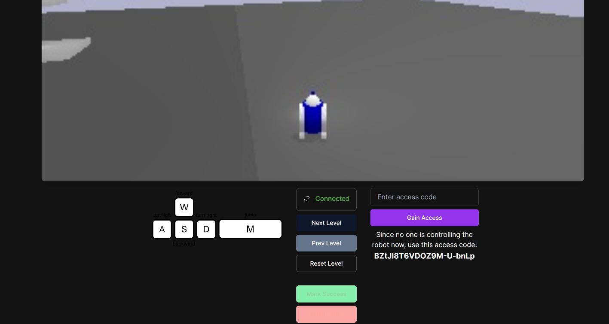
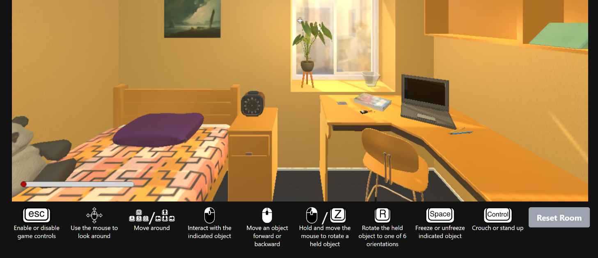

# Perception and World Understanding

This document covers research on how agents perceive and understand their environment, including player tracking, ownership concepts, world perception, and spatial awareness.

## Player Tracking

The players actions and their behavior trees are needed for multi agent interaction. It is nice to have to help drive better and more realistic behaviors. If enough data is collected, we could train large action models and sell those models as well as use them to make our processes more efficient.

### Implementation Notes
- We will need to convert a player's actions (key strokes and such) into my current internal conical form
- Get an llm to make me a player tracker in Roblox. Like, tell to the llm that I want to track every movement of that player...
- OMNI-EPIC has nice game controls, I probably need to follow that!
  - 
- Nah, the goal one looked awesome
  - <https://game-generation-public.web.app/>
  - 
- As part of this, it is related to the "E" to interact.

## Ownership

Whether something is owned or not has impacts on planning.

### Overall Notes

- Why does no one talk about ownership during planning? It feels like key aspect of it, no?

- Eventually I need people to be able to create invisible entities from the world, but they are visible in the tree pane. That way people can create a "park" instance, and attached objects to it, but not actually for it to be in the world. I need to implement a @ function and then have it pull up ayo keys to select from. That way users know exactly who they are pulling up.

- I'm thinking these units will get moved around the workspace. If they are in workspace with no ownership, people can think they are unowned?

- Like, only characters will be able to own things? What about companies or organizations? What about a folder called desk with a buck of models under it, does the desk own all the models?

- What about atag called, ayoOwner? And the ayoKey will be there? That way, no matter the structure, ownership can be assigned. This will also allow players to see everything that character owns. Also, it will allow entities that are not part of the world to be created.

- We can have invisible. Non physical entity? These can be created by the players. Like, someone could create a non physical entity called, zak_and_jen marriage. Give it an ayo key, and boom, we have a new unit that is not part of the world at all. Then we can provide ownership to that entity, as many people as we want. Then the non physical entity will be only related to the ayokeys with ownership

- How would the json world representation look if more than entity was attached for ownership on a non physical one? I think they should be on all, so the can keep private notes on the relation ship

## World Perception

### Overall Notes

- Generalized perception is the Holy Grail of AI research. The solution must encompass the following: composable static/dynamic patterns, attention, prediction, causality, STM/LTM and recognition. The latter must be orders of magnitude more data-efficient than deep learning. <https://twitter.com/TrueAIHound/status/1785379305922712030?s=19>

- Why is grounding not mentioned here yet?

- Found random: hmmm
  - I'm also using a "sensors" subsystem: in each frame, a bunch of "sensors" collect various info about the world and update the "blackboard" with this info. Some sensors are:
    - looker - checks if enemies are visible
    - feeler - checks if an enemy has been standing close to AI, but outside of its sight, so that the AI can get "nervous"
    - equipment_monitor - checks what items are currently equipped
    - damage_monitor - checks if damage has been received recently
    - world_weapon_monitor - checks what other weapons are available nearby for a pickup

- Have the npc observe the behavior of the light changing. Also, monitor the changed state of things as antecedents, and transfer them to proper data.

- Multi perception, more than one perception, perception is always changing, hmm, like, I change my interest all time, and etc. People changing the lifing polls are people changing the neurons of nureal network

- What about my algorithm has the need to pick up on the fact it wants to more weathrr the leaves made foliage in fall earlier or later than normal. And that affects how we think on it, or compare current situation. So how to compare similar function first, and take note of

### World2World

- Word2World: Generating Stories and Worlds through Large Language Models <https://arxiv.org/abs/2405.06686>

  - Abstract
    - Large Language Models (LLMs) have proven their worth across a diverse spectrum of disciplines. LLMs have shown great potential in Procedural Content Generation (PCG) as well, but directly generating a level through a pre-trained LLM is still challenging. This work introduces Word2World, a system that enables LLMs to procedurally design playable games through stories, without any task-specific fine-tuning. Word2World leverages the abilities of LLMs to create diverse content and extract information. Combining these abilities, LLMs can create a story for the game, design narrative, and place tiles in appropriate places to create coherent worlds and playable games. We test Word2World with different LLMs and perform a thorough ablation study to validate each step. We open-source the code at this https URL.

  - Zak thoughts
    - Has Code!! <https://github.com/umair-nasir14/Word2World>
    - 
    - 

### Planning with World Knowledge Model

- Agent Planning with World Knowledge Model <https://arxiv.org/abs/2405.14205>

  - Abstract
    - Recent endeavors towards directly using large language models (LLMs) as agent models to execute interactive planning tasks have shown commendable results. Despite their achievements, however, they still struggle with brainless trial-and-error in global planning and generating hallucinatory actions in local planning due to their poor understanding of the ''real'' physical world. Imitating humans' mental world knowledge model which provides global prior knowledge before the task and maintains local dynamic knowledge during the task, in this paper, we introduce parametric World Knowledge Model (WKM) to facilitate agent planning. Concretely, we steer the agent model to self-synthesize knowledge from both expert and sampled trajectories. Then we develop WKM, providing prior task knowledge to guide the global planning and dynamic state knowledge to assist the local planning. Experimental results on three complex real-world simulated datasets with three state-of-the-art open-source LLMs, Mistral-7B, Gemma-7B, and Llama-3-8B, demonstrate that our method can achieve superior performance compared to various strong baselines. Besides, we analyze to illustrate that our WKM can effectively alleviate the blind trial-and-error and hallucinatory action issues, providing strong support for the agent's understanding of the world. Other interesting findings include: 1) our instance-level task knowledge can generalize better to unseen tasks, 2) weak WKM can guide strong agent model planning, and 3) unified WKM training has promising potential for further development. Code will be available at this https URL.

  - Zak Thoughts
    - Seem cool. Has code!!! <https://github.com/zjunlp/WKM>
    - 
    - 

### Worldy Trackers

- Time of day and weather, etc. . Some stuff comes from roblox, but the rest are things I want to track, like time of day, location. Preceding events.

- How do things perceive the world? They have to care about things -- that is the spark. What do they care about? LifingPolls?

## Spatial Perception

What if its a obby. How do they jump? They need an influence layer, grid type, or stunting like that? Well no, right, because of it senses down... Nah but how does it sense down? Doesn't roblox do path finding? Or influence maps or something like that. .

### Overall Notes

- Grid based? Like we could build and maintain a grid of the world.

- Can use tags as point of interest. Like. Doctors will want to work at doctors, or soldiers will hang out at x, or giant will protect y. Only salute officer. A leader can place atag on someone for the army to go after. Or it can be time based.

- How will the move to function use its past to "help" determine best route? Meaning, we could put places on the map ourselves?

## Emoji and Animations

Must take body language into account for history, communication, and behavior trees realism.

### Overall Notes

- I want a user generated market place of actions, per agent. Each action can have a sub action, like a tree of actions. Then we can sell the action packs.