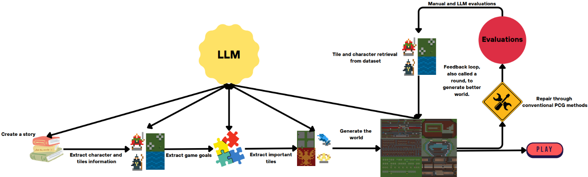
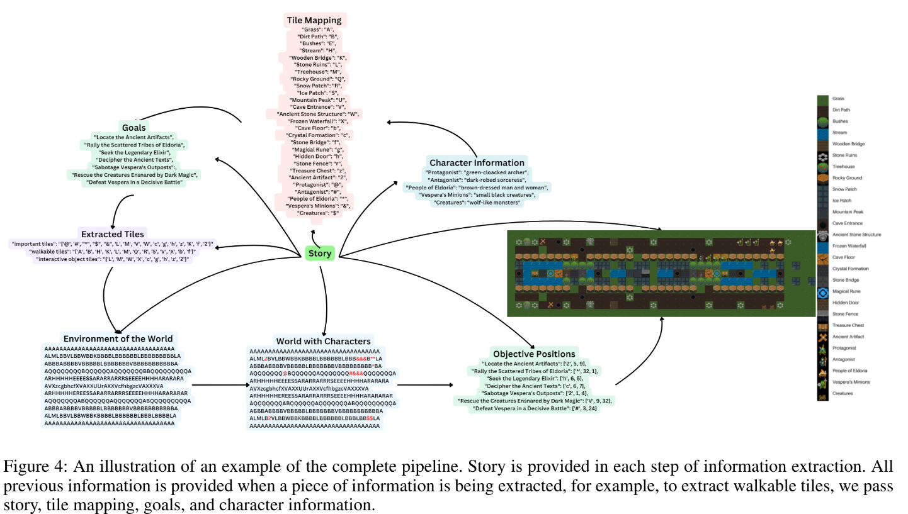
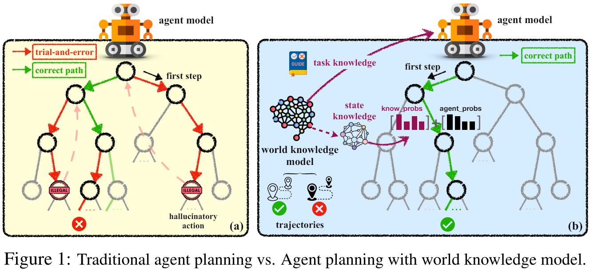
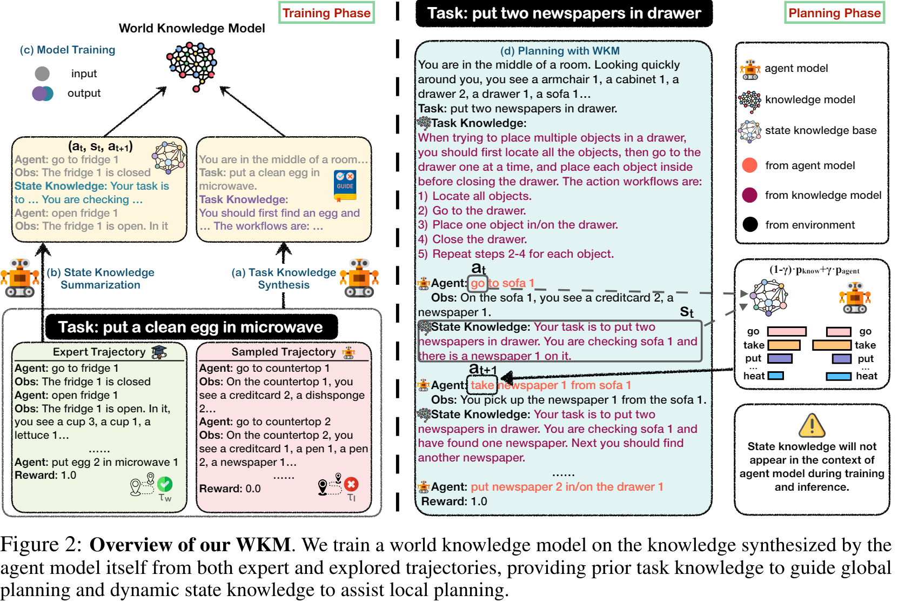

# Perception and World Understanding

This document covers research on how agents perceive and understand their environment, including player tracking, ownership concepts, world perception, and spatial awareness.

## Ownership

Ownership represents a fundamental but often overlooked aspect of agent planning and decision-making. Objects in the world can be owned, shared, or unclaimed, and these relationships significantly impact how agents interact with their environment.

### Key Concepts

**Ownership Architecture**:
- Implement ownership tags (e.g., `ayoOwner`) linked to unique entity keys (`ayoKey`) for clear ownership tracking
- Support multi-level ownership hierarchies (characters, organizations, abstract entities)
- Enable workspace object movement while maintaining ownership relationships

**Non-Physical Entities**:
- Create abstract ownership entities not physically present in the world (e.g., "marriage", "company", "alliance")
- Allow multiple entities to share ownership of non-physical constructs
- Support private annotations and relationships between co-owners

**Implementation Considerations**:
- Unowned objects in workspace should be clearly distinguishable from owned objects
- Support entity selection through reference systems (e.g., @entity notation)
- Maintain ownership visibility in UI tree structures while keeping non-physical entities invisible in the game world
- Design JSON world representations that can handle complex multi-entity ownership relationships

## World Perception

### Core Requirements

Generalized perception remains one of AI's greatest challenges. A complete solution must integrate:
- Composable static/dynamic pattern recognition
- Attention mechanisms and prediction systems
- Causal understanding and grounding
- Short-term/long-term memory integration
- Data-efficient recognition surpassing current deep learning approaches

Reference: <https://twitter.com/TrueAIHound/status/1785379305922712030?s=19>

### Sensor Subsystem Architecture

A practical implementation uses multiple specialized sensors updating a shared blackboard each frame:
- **Looker**: Enemy visibility detection
- **Feeler**: Proximity awareness for threats outside visual range (inducing "nervousness")
- **Equipment Monitor**: Current item/tool tracking
- **Damage Monitor**: Recent damage detection and source identification
- **World Weapon Monitor**: Available pickups and environmental tools

### Dynamic Perception Concepts

**State Change Monitoring**:
- Track environmental changes (lighting, weather, object states) as behavioral antecedents
- Enable NPCs to notice and respond to subtle environmental variations
- Support seasonal pattern recognition (e.g., early/late foliage changes affecting behavior)

**Multi-Modal Perception**:
- Perception constantly shifts based on context and priorities
- Interest and attention dynamically adjust like neurons in a neural network
- Comparative analysis enables pattern recognition across similar situations

### World2World

- Word2World: Generating Stories and Worlds through Large Language Models <https://arxiv.org/abs/2405.06686>

  - Abstract
    - Large Language Models (LLMs) have proven their worth across a diverse spectrum of disciplines. LLMs have shown great potential in Procedural Content Generation (PCG) as well, but directly generating a level through a pre-trained LLM is still challenging. This work introduces Word2World, a system that enables LLMs to procedurally design playable games through stories, without any task-specific fine-tuning. Word2World leverages the abilities of LLMs to create diverse content and extract information. Combining these abilities, LLMs can create a story for the game, design narrative, and place tiles in appropriate places to create coherent worlds and playable games. We test Word2World with different LLMs and perform a thorough ablation study to validate each step. We open-source the code at this https URL.

  - **Ayoai Impact**: 
    - Open-source implementation available: <https://github.com/umair-nasir14/Word2World>
    - Demonstrates LLM capability for procedural world generation from narrative
    - Could enable dynamic environment creation based on NPC experiences or player stories
    - 
    - 

### Planning with World Knowledge Model

- Agent Planning with World Knowledge Model <https://arxiv.org/abs/2405.14205>

  - Abstract
    - Recent endeavors towards directly using large language models (LLMs) as agent models to execute interactive planning tasks have shown commendable results. Despite their achievements, however, they still struggle with brainless trial-and-error in global planning and generating hallucinatory actions in local planning due to their poor understanding of the ''real'' physical world. Imitating humans' mental world knowledge model which provides global prior knowledge before the task and maintains local dynamic knowledge during the task, in this paper, we introduce parametric World Knowledge Model (WKM) to facilitate agent planning. Concretely, we steer the agent model to self-synthesize knowledge from both expert and sampled trajectories. Then we develop WKM, providing prior task knowledge to guide the global planning and dynamic state knowledge to assist the local planning. Experimental results on three complex real-world simulated datasets with three state-of-the-art open-source LLMs, Mistral-7B, Gemma-7B, and Llama-3-8B, demonstrate that our method can achieve superior performance compared to various strong baselines. Besides, we analyze to illustrate that our WKM can effectively alleviate the blind trial-and-error and hallucinatory action issues, providing strong support for the agent's understanding of the world. Other interesting findings include: 1) our instance-level task knowledge can generalize better to unseen tasks, 2) weak WKM can guide strong agent model planning, and 3) unified WKM training has promising potential for further development. Code will be available at this https URL.

  - **Ayoai Impact**:
    - Open-source implementation: <https://github.com/zjunlp/WKM>
    - Addresses critical issues in agent planning: blind trial-and-error and hallucinatory actions
    - WKM provides both global prior knowledge and local dynamic state tracking
    - Demonstrates that weak knowledge models can effectively guide stronger agent models
    - 
    - 

### Environmental Context Tracking

**Essential World State Variables**:
- Temporal data (time of day, day/night cycles, seasonal changes)
- Weather conditions and environmental effects
- Location-based context and spatial relationships
- Event sequences and causal chains

**Perception Drivers**:
Agents must have intrinsic motivations to perceive selectively. The "spark" of perception comes from caring about specific aspects of the world - essentially internal goals and priorities that filter what information is relevant. This connects directly to the purpose bar system where agent motivations drive attention and perception.

## Spatial Perception

Spatial navigation presents unique challenges, particularly in complex environments like obstacle courses (obbies) that require precise movement and jumping. The solution involves layered perception systems that combine native pathfinding with intelligent decision-making.

### Navigation Architecture

**Pathfinding Layers**:
- Leverage existing engine pathfinding (e.g., Roblox's built-in systems)
- Overlay influence maps or grid-based representations for tactical decision-making
- Implement vertical awareness for jumping and climbing scenarios

**Point of Interest System**:
- Tag-based location marking for role-specific attractions (hospitals for doctors, barracks for soldiers)
- Dynamic interest points that can be placed by players or other agents
- Time-based or event-triggered location preferences

**Learned Route Optimization**:
- Agents remember successful paths and prefer proven routes
- Historical movement data influences future pathfinding decisions
- Support for manually placed waypoints and preferred paths

## Non-Verbal Communication

Body language and animations are crucial components of agent perception and expression. NPCs must both display and interpret non-verbal cues to create believable social interactions.

### Implementation Concepts

**Expression Systems**:
- Integrate body language into behavioral history tracking
- Use animations as communication channels between agents
- Ensure behavior trees account for non-verbal expression timing and context

**Action Marketplace**:
- Create user-generated animation libraries specific to agent types
- Support hierarchical action trees where complex animations contain sub-actions
- Enable monetization through curated action pack sales
