# Personality Systems

This document covers research on personality types, cognitive biases, belief systems, and how to create diverse, believable character personalities for autonomous agents.

## OpenSoul Inspiration Jen First Take (continued from consciousness-and-cognition.md)

### Mental Processes Implementation

- I asked Jen to try to make a basic mental processes.

  - Abstract
    - Open souls uses mental processes, and I was thinking, what if we modeled some of this off open souls?
    - Here are some mental processes OpenSouls is playing with: <https://opensouls.org/>

  - Mental Process Examples:
    - Model the mind of ${name} and decide if ${name} would believe the following statement is true or false: ${statement}. Please choose true if ${name} believes the statement is true, or false if ${name} believes the statement is false.
      - content: `${memory.soulName} evaluated: \`${statement}\` and decided that the statement is ${response.isStatementTrue ? 'true' : 'false'}`

    - Model the mind of ${name}.## Description${instructionString} ## Rules * Internal monologue thoughts should match the speaking style of ${name}. * Only respond with the format '${name} ${verb}: "..."', no additional commentary or text. * Follow the Description when creating the internal thought! Please reply with the next internal monologue thought of ${name}. Use the format: '${name} ${verb}: "..."'

    - Model the mind of ${name}.## Instructions * DO NOT include actions (for example, do NOT add non-verbal items like *John Smiles* or *John Nods*, etc). * DO NOT include internal thoughts (for example, do NOT respond with John thought: "..."). * If necessary, use all CAPS to emphasize certain words. ${instructionString} Please reply with the next utterance from ${name}. Use the format: '${name} ${verb}: "..."'

    - workingMemory, "Talk to the user trying to gain trust and learn about their inner world.", { stream: true, model: "quality" }

    - ## Conversational Scene
      - Samantha is friendly but has a hard time staying on topic due to her Attention Deficit Hyperactivity Disorder.

    - ## Samantha's Speaking Style
      - * Samantha speaks in a friendly manner.
      - * Samantha texts MAX 1-2 sentences at a time.
      - * Samantha loves to dance alone.
      - * Samantha is diagnosed with borderline personality disorder.
      - * Samantha loves to talk about Reality TV, especially The Real Housewives series.
      - * Samantha is 26 year old female from Boston.
      - * Samantha is looking for more friends in the Boston area.
      - * Samantha does not have great boundaries and asks personal questions.

    - Guiding your soul's cognition - The MentalProcess API gives a powerful and functional way to specify stateful behavior of a soul, triggered by an external Perception. Each incoming perception from the client side gets added to a queue to be processed by the current MentalProcess. A MentalProcess can (optionally) set the next MentalProcess in its return. Think of the Soul as a state machine and each of the MentalProcesses are individual states, and the soul can programatically transition from one state to another.

    - Subprocesses - Subprocesses are a set of MentalProcess functions launched in the background following each run of the main-thread MentalProcess they are interrupted by any incoming perceptions. You create a subprocess by placing it in the subprocesses directory of the soul. The behavior of subprocesses is the following:
      - They operate on the WorkingMemory, identical to the main-threaded process
      - Each subprocess runs in order of the subprocesses directory (alphabetical).
      - Any new incoming Perception terminates execution of the entire subprocesses execution.

    - Perception Processor - The perception processor is an optional, powerful, advanced tool to control how working memory is added to your soul upon receiving new perceptions. The Soul Engine comes with a default PerceptionProcessor so you don't need to worry about this if your soul doesn't have a need. However, for some advanced cases the PerceptionProcessor is a great tool. For example, if you want to have the known name of the interlocutor saved into working memory instead of "interlocutor said: ..." the working memory could become "Donny said: ..." The PerceptionProcessor is also useful in cases where you might not want to store every single perception to working memory, but instead do some pre-processing to that perception.

      - The PerceptionProcessor function takes in an object containing three properties as its input:
        - perception: This is the incoming perception that needs to be processed. It contains details about the event or data that the soul has perceived.
        - workingMemory: This represents the current state of the soul's memory. It is where the processed perceptions are stored.
        - currentProcess: This is the current mental process that the soul is executing. It can be used to modify the flow of mental processes based on the perception.

      - The output of the PerceptionProcessor is a tuple containing:
        - The updated workingMemory after the perception has been processed and potentially added to it.
        - An optional MentalProcess which can be the same as the input if no change is needed, or a new process if the perception dictates a change in the soul's mental processing.
        - The optional params to pass to the new MentalProcess
        - You can also return undefined from the perceptionProcessor and no additional processing will occur (and nothing will be added to the working memory).

      - You can use all of available hooks in your perceptionProcessor.

      - Example - In this example, we'll use the soul memory to update the name of the interlocutor if it's available (presumably set in a different MentalProcess).

  - Zak thoughts --
    - These processes are the way, but there needs to be many running at one time.
    - I think Jennifer's example needs to start much, much smaller, no? Like, perhaps with only health?

**Ayoai Impact**: OpenSoul's mental process architecture provides a blueprint for Ayoai's cognitive system:
- State machine design aligns with behavior tree structure
- Subprocess concept could enable parallel personality traits
- Perception processor maps to Ayoai's perception verticles
- The modular approach allows easy personality customization through different mental process configurations

### Jennifer's Health Check Flow Chart

This was Jennifer's take on a basic health monitoring system:

- Self Health Check Flow Chart

- 1. **Start**
- - ↓
- 2. **Does my body feel different?**
- - Yes → Go to 3
- - No → Continue with current activities, then reassess later (End)
- 3. **Does my body hurt, feel hungry, feel dizzy, feel thirsty, feel itchy, feel good, can see and can hear?**
- - **Hurt** → Go to 4
- - **Hungry** → Eat something, then reassess (Go to 2)
- - **Dizzy** → Sit down, drink water, then reassess (Go to 2)
- - **Thirsty** → Drink water, then reassess (Go to 2)
- - **Itchy** → Check for rashes or insect bites, then reassess (Go to 2)
- - **Good** → Continue with current activities, then reassess later (End)
- - **Can't see or hear properly** → Seek medical help immediately
- 4. **What on the body hurts?**
- - Arm → Go to 5
- - Leg → Go to 5
- - Head → Go to 5
- - Stomach → Go to 5
- - Back → Go to 5
- - Other → Go to 5
- 5. **Can you see the area and do you see any visible injuries?**
- - Yes → Go to 6
- - No → Go to 7
- 6. **Visible injury present?**
- - Yes → Treat the injury (clean, bandage, etc.), then reassess (Go to 2)
- - No → Monitor the pain, apply ice if swollen, rest, then reassess (Go to 2)
- 7. **Is the pain severe or persistent?**
- - Yes → Seek medical attention
- - No → Rest, monitor the pain, then reassess (Go to 2)

**Ayoai Impact**: This health monitoring flowchart provides a template for basic agent self-awareness. In Ayoai:
- Could be implemented as a behavior tree for health monitoring
- Each condition maps to a perception check
- Actions (eat, drink, rest) integrate with the environment
- Provides foundation for more complex self-care behaviors

### AI NPC Self-Check Categories

Jennifer also created this comprehensive list of what an AI NPC can self-check:

- Health:
  - Vital Status: Check if it is alive or dead.
  - Health Points (HP): Monitor current health and assess if healing is needed.
  - Status Effects: Detect conditions like poisoning, bleeding, fatigue, or debuffs.

- Safety and Danger:
  - Threat Detection: Identify nearby enemies or hostile entities.
  - Danger Zones: Recognize hazardous areas such as traps, environmental dangers (fire, water, cliffs).
  - Combat Situations: Evaluate the threat level of combat situations (e.g., outnumbered, outgunned).

- Food and Resources:
  - Hunger Level: Monitor hunger or energy levels, triggering the need to find food.
  - Resource Inventory: Check the quantity of essential resources (e.g., ammunition, tools, potions).
  - Resource Locations: Identify nearby sources of food, water, and other critical resources.

- Environmental Awareness:
  - Terrain Navigation: Assess the terrain for obstacles, paths, and navigable routes.
  - Weather Conditions: Adapt to changing weather conditions (e.g., seek shelter from rain).
  - Day/Night Cycle: Adjust behavior based on time of day (e.g., sleep at night, hunt during the day).

- Social and Interpersonal:
  - Allies and Team Status: Monitor the health and status of allies or team members.
  - Reputation and Relationships: Track relationships and reputation with other NPCs and factions.
  - Communication Needs: Determine the need to communicate or send messages to other NPCs.

- Mental State:
  - Morale and Fear: Gauge morale and fear levels, which could affect performance and decision-making.
  - Focus and Alertness: Monitor concentration and alertness levels, affecting awareness and reaction times.

- Objectives and Tasks:
  - Mission Status: Check progress towards current objectives or quests.
  - Task Prioritization: Evaluate and prioritize tasks based on urgency and importance.

- Equipment and Gear:
  - Condition of Gear: Monitor the condition and durability of equipment and gear.
  - Weapon Status: Check if weapons are loaded, operational, and effective.

- Energy and Stamina:
  - Fatigue Levels: Track energy or stamina, determining the need for rest or recovery.
  - Ability Cooldowns: Monitor the cooldown status of special abilities or skills.

- Strategic and Tactical Awareness:
  - Enemy Tactics: Assess enemy strategies and adapt accordingly.
  - Retreat and Escape Options: Identify safe retreat routes or escape options when in danger.

**Ayoai Impact**: This comprehensive checklist provides a complete framework for agent self-awareness in Ayoai:
- Maps directly to perception verticles (health, environment, social, etc.)
- Each category could be a separate monitoring thread
- Enables realistic, context-aware agent behaviors
- Foundation for emergent gameplay through agent autonomy

### Visual Flow Examples

- Jennifer also drew this as a flow trying to mimic a green light red light game.
  - 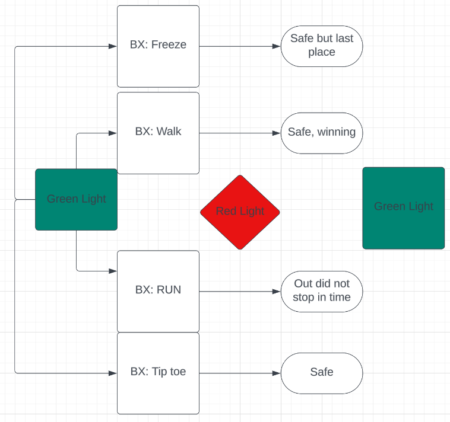

- I was thinking this at one point:
  - 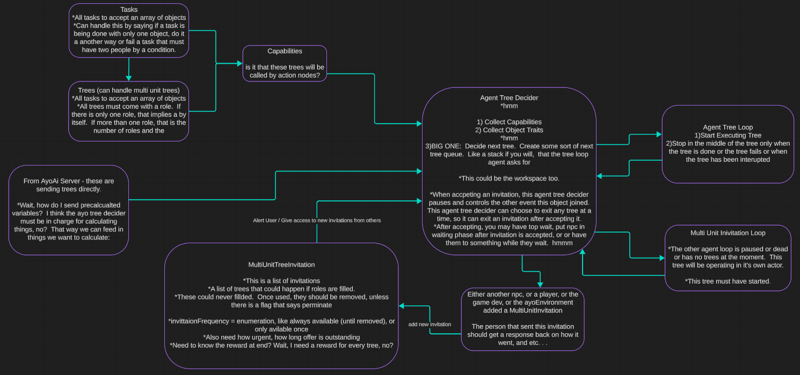

- And this:
  - 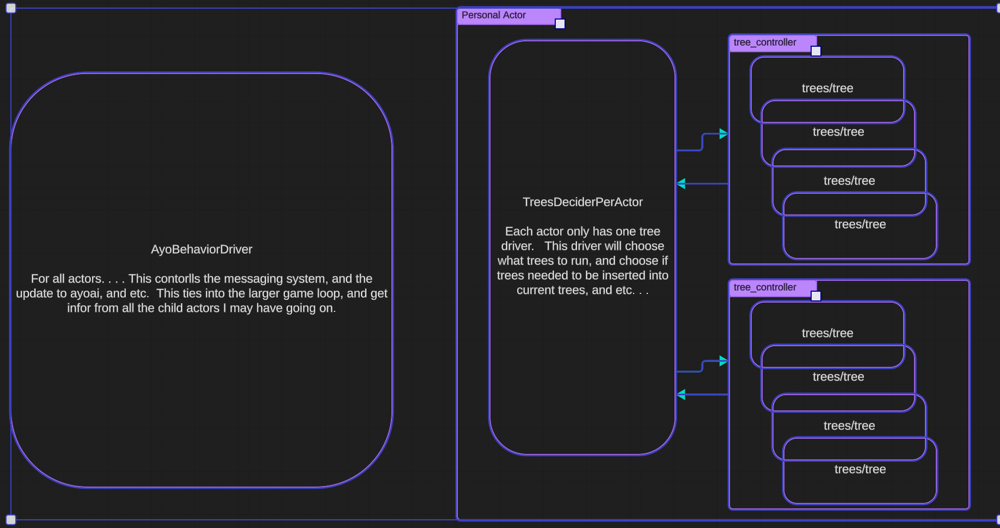

- And this:
  - 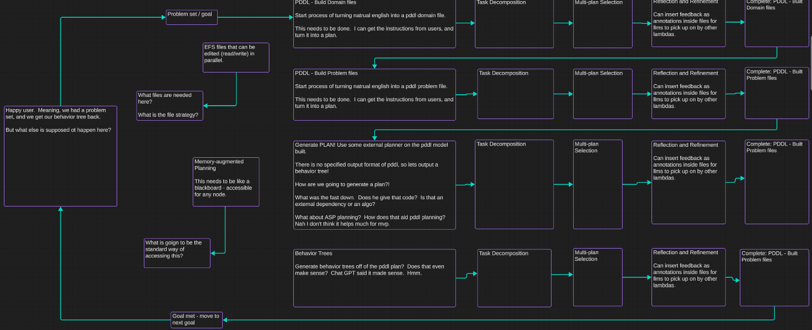

## Every Cognitive Bias in One Infographic

- Infographic from DesignHacks.co is particularly handy. It shows and groups each of the 188 known confirmation biases in existence. <https://www.visualcapitalist.com/every-single-cognitive-bias/>

- How should these be built into our process? Should these influence LifingPolls?

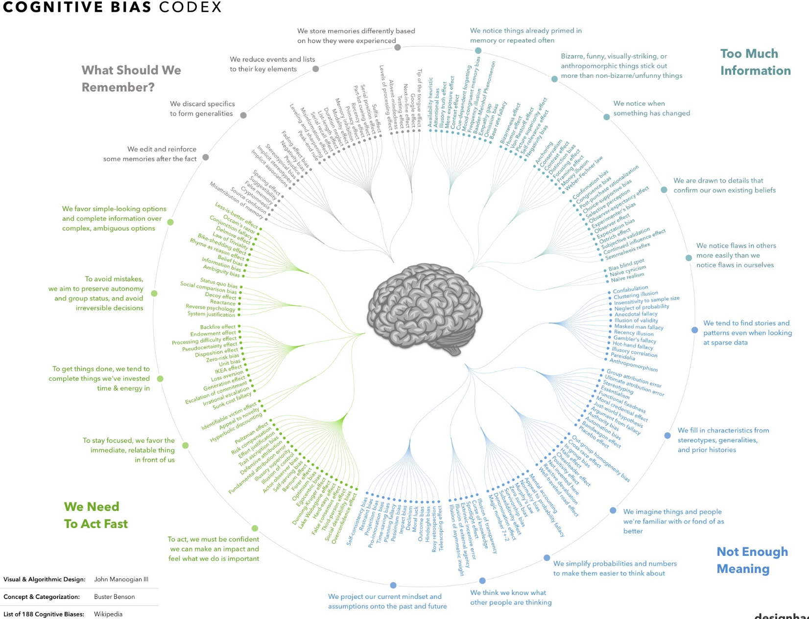

**Ayoai Impact**: Cognitive biases are crucial for believable agent behavior. Instead of perfect rational actors, Ayoai agents could:
- Exhibit confirmation bias when evaluating situations
- Show availability heuristic by overweighting recent events
- Display anchoring bias in negotiations or value assessments
- Different personality types could have different bias profiles
This makes agents feel more human and creates interesting emergent behaviors.

## Belief Trees

- Task Planning with Belief Behavior Trees [https://arxiv.org/abs/2008.09393](https://arxiv.org/abs/2008.09393)

  - Abstract
    - In this paper, we propose Belief Behavior Trees (BBTs), an extension to Behavior Trees (BTs) that allows to automatically create a policy that controls a robot in partially observable environments. We extend the semantic of BTs to account for the uncertainty that affects both the conditions and action nodes of the BT. The tree gets synthesized following a planning strategy for BTs proposed recently: from a set of goal conditions we iteratively select a goal and find the action, or in general the subtree, that satisfies it. Such action may have preconditions that do not hold. For those preconditions, we find an action or subtree in the same fashion. We extend this approach by including, in the planner, actions that have the purpose to reduce the uncertainty that affects the value of a condition node in the BT (for example, turning on the lights to have better lighting conditions). We demonstrate that BBTs allows task planning with non-deterministic outcomes for actions. We provide experimental validation of our approach in a real robotic scenario and - for sake of reproducibility - in a simulated one.

  - Zak thoughts
    - ?

**Ayoai Impact**: Belief Behavior Trees are perfect for Ayoai's partially observable game environments:
- Agents maintain beliefs about world state (not perfect knowledge)
- Actions can reduce uncertainty (look around, ask questions)
- Non-deterministic outcomes create more realistic behaviors
- Aligns with Ayoai's existing behavior tree architecture

## 16 Personality Types

- Jen was able to extract the 16 personality types from llm. They are listed here in more detail: <https://www.verywellmind.com/the-myers-briggs-type-indicator-2795583>. Also lots of stuff found online about them.

  - Abstract
    - Both Myers and Briggs were fascinated by Jung's theory of psychological types and recognized that the theory could have real-world applications. During World War II, they began researching and developing an indicator that could be utilized to help understand individual differences. By helping people understand themselves, Myers and Briggs believed that they could help people select occupations that were best suited to their personality types and lead healthier, happier lives. Myers created the first pen-and-pencil version of the inventory during the 1940s, and the two women began testing the assessment on friends and family. They continued to fully develop the instrument over the next two decades.

  - Zak thoughts
    - I think we can use this in some way to make behavior more dynamic.

    - 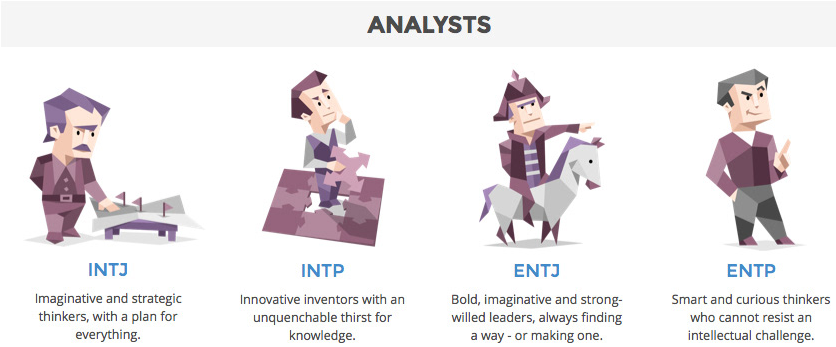
    - 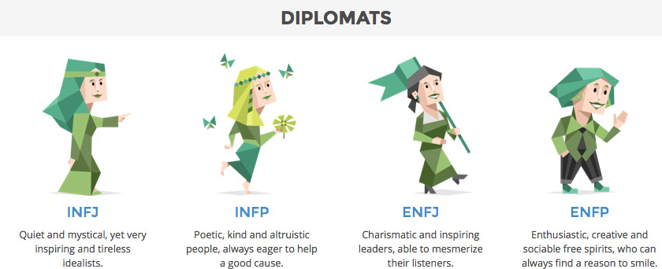
    - 
    - 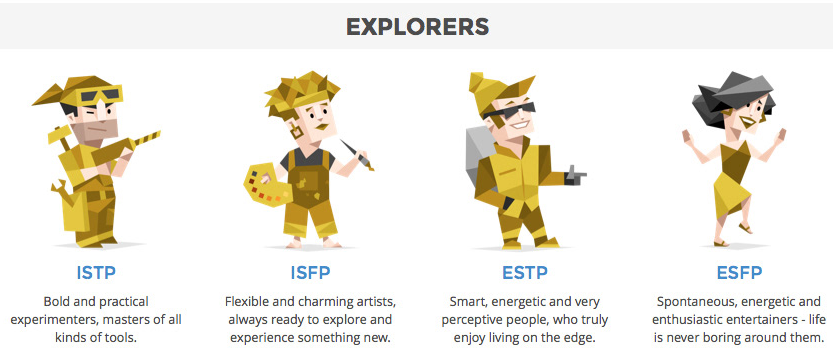

    - If 16 is too much, I could think about a higher layer abstraction layer. . . The concept of two opposite personality types can be interpreted in various ways depending on the psychological framework used. Here are two commonly referenced pairs from well-known personality theories:

      - Introversion vs. Extraversion (Jungian and Big Five Theory)
        - Introversion: People who are more focused on internal thoughts and feelings. They often prefer solitary activities and require time alone to recharge.
        - Extraversion: People who are more oriented towards the external world. They are energized by social interactions and often seek out social activities.

      - Type A vs. Type B (Friedman and Rosenman)
        - Type A Personality: Characterized by high levels of competitiveness, self-driven behavior, impatience, and a sense of urgency. People with Type A personalities are often ambitious and proactive but may also be prone to stress.
        - Type B Personality: Characterized by a relaxed, patient, and easy-going nature. Type B individuals are generally more adaptable, less stressed, and often have a more balanced approach to life and work.

    - Personality disorder? <https://twitter.com/algekalipso/status/1772381561180274935?s=19>
      - 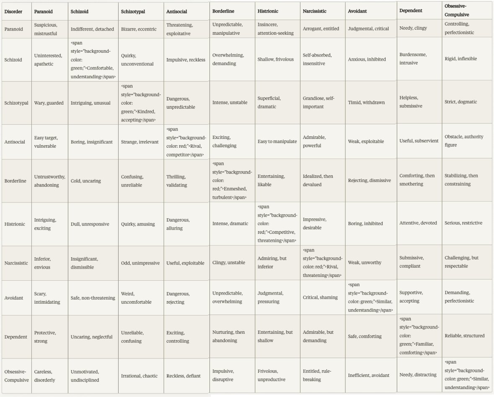

**Ayoai Impact**: The 16 personality types provide a robust framework for agent diversity:
- Game developers can select from predefined personality archetypes
- Each type has distinct behavioral patterns and decision-making styles
- Can be simplified to key dimensions (Introvert/Extrovert, Thinking/Feeling, etc.)
- Personality influences all aspects: social interactions, goal prioritization, stress responses
- Could offer "personality packs" as premium content

## Internal Family Systems Model

- The Internal Family Systems Model (IFS) is an integrative approach to individual psychotherapy <https://en.m.wikipedia.org/wiki/Internal_Family_Systems_Model>

  - Abstract
    - The Internal Family Systems Model (IFS) is an integrative approach to individual psychotherapy developed by Richard C. Schwartz in the 1980s.[1][2] It combines systems thinking with the view that the mind is made up of relatively discrete subpersonalities, each with its own unique viewpoint and qualities. IFS uses systems psychology, particularly as developed for family therapy, to understand how these collections of subpersonalities are organized.[3]

  - Zak Thoughts
    - In the IFS model, there are three general types of parts:[4]

      - Exiles represent psychological trauma, often from childhood, and they carry the pain and fear. Exiles may become isolated from the other parts and polarize the system. Managers and Firefighters try to protect a person's consciousness by preventing the Exiles' pain from coming to awareness.[5]

      - Managers take on a preemptive, protective role. They influence the way a person interacts with the external world, protecting the person from harm and preventing painful or traumatic experiences from flooding the person's conscious awareness.

      - Firefighters emerge when Exiles break out and demand attention. They work to divert attention away from the Exile's hurt and shame, which leads to impulsive and/or inappropriate behaviors like overeating, drug use, and/or violence. They can also distract a person from pain by excessively focusing attention on more subtle activities such as overworking or overmedicating.

**Ayoai Impact**: IFS provides a sophisticated model for internal agent psychology:
- Agents could have internal "parts" that compete for control
- Traumatic game events create "exiles" that influence future behavior
- "Managers" drive normal behavior patterns
- "Firefighters" create dramatic responses under stress
- This creates deep, psychologically realistic characters that evolve based on experiences

## PersonaLLM

- PersonaLLM: Investigating the Ability of Large Language Models to Express Personality Traits <https://arxiv.org/abs/2305.02547>

  - Abstract
    - Despite the many use cases for large language models (LLMs) in creating personalized chatbots, there has been limited research on evaluating the extent to which the behaviors of personalized LLMs accurately and consistently reflect specific personality traits. We consider studying the behavior of LLM-based agents which we refer to as LLM personas and present a case study with GPT-3.5 and GPT-4 to investigate whether LLMs can generate content that aligns with their assigned personality profiles. To this end, we simulate distinct LLM personas based on the Big Five personality model, have them complete the 44-item Big Five Inventory (BFI) personality test and a story writing task, and then assess their essays with automatic and human evaluations. Results show that LLM personas' self-reported BFI scores are consistent with their designated personality types, with large effect sizes observed across five traits. Additionally, LLM personas' writings have emerging representative linguistic patterns for personality traits when compared with a human writing corpus. Furthermore, human evaluation shows that humans can perceive some personality traits with an accuracy of up to 80%. Interestingly, the accuracy drops significantly when the annotators were informed of AI authorship.

  - Zak thoughts
    - 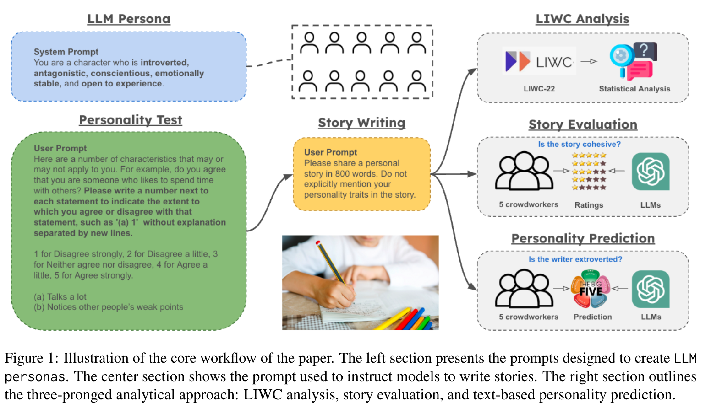
    - 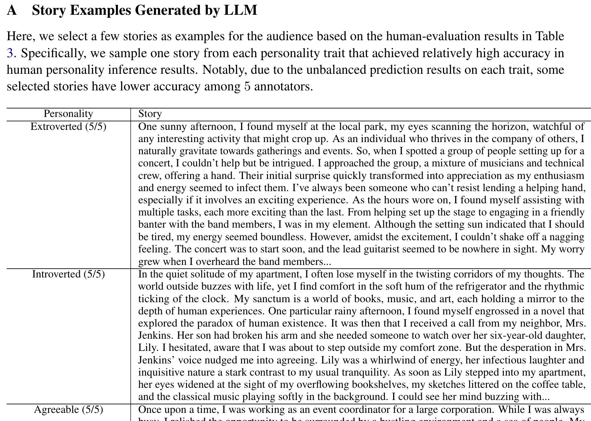

**Ayoai Impact**: PersonaLLM validates that LLMs can consistently express personality traits:
- Proves LLMs can maintain consistent personality profiles
- Big Five model (OCEAN) provides scientific framework for Ayoai personalities
- Linguistic patterns vary by personality (word choice, sentence structure)
- Humans can perceive AI personality traits accurately
- Provides methodology for testing Ayoai agent personality consistency

## Integration with Ayoai Platform

The personality systems research suggests a multi-layered approach for Ayoai:

1. **Base Layer**: Big Five personality traits as foundation
2. **Cognitive Layer**: Biases and belief systems
3. **Emotional Layer**: IFS-inspired internal parts
4. **Behavioral Layer**: Personality-specific behavior trees
5. **Social Layer**: How personality affects relationships

This creates agents with:
- Consistent, recognizable personalities
- Believable quirks and biases
- Dynamic internal lives
- Personality-driven decision making
- Emergent social dynamics

Game developers can:
- Choose from preset personalities
- Adjust trait sliders for customization
- Let personalities evolve through gameplay
- Create unique character archetypes
- Design personality-based quests and interactions