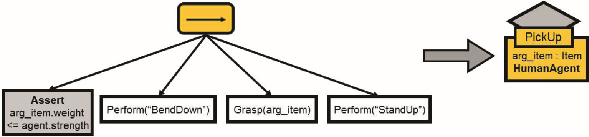
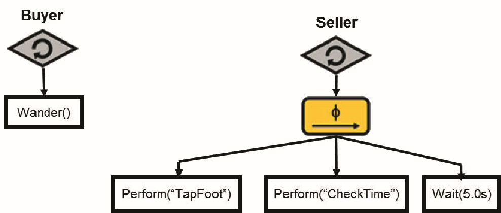
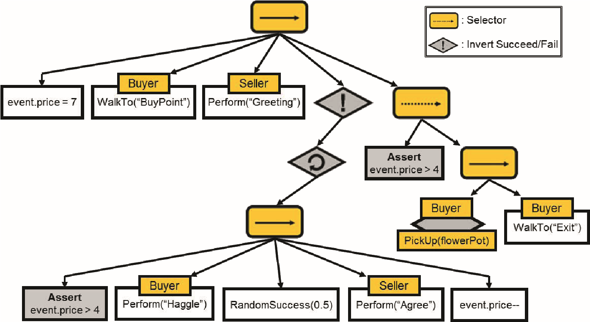
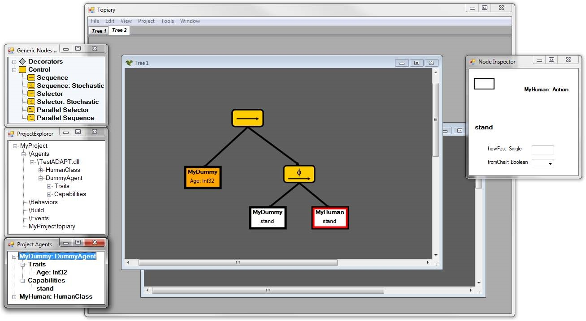

**Parameterizing Behavior Trees**

Alexander Shoulson, Francisco M. Garcia, Matthew Jones, Robert Mead, and
Norman I. Badler

Department of Computer and Information Science

University of Pennsylvania

Philadelphia, PA 19104-6389, USA
{shoulson,fgarcia,majo,robmead,badler}@seas.upenn.edu

> **Abstract.** This paper introduces and motivates the application of
> parameterization to behavior trees. As a framework, behavior trees are
> becoming more commonly used for agent controllers in interactive game
> environments. We describe a way by which behavior trees can be
> authored for acting upon functions with arguments, as opposed to being
> limited to nonparametric tasks. We expand upon this idea to provide a
> method by which a subtree itself can be encapsulated with an exposed
> parameter interface through a lookup node, which enables code reuse in
> a manner already exploited by object oriented programming languages.
> Parameterization also allows us to recast Smart Events (a mechanism
> for co-opting agents to perform a desired activity) as behavior trees
> that can act generically upon groups of typed agents. Finally, we
> introduce a tool called Topiary, which enables the
> graphically-oriented authoring of behavior trees with this
> functionality as part of a broader testbed for agent simulation.
>
> **Keywords:** Behavior Trees, Smart Events, Behavioral AI, Agents.

# Introduction

While traditionally known for use in industrial and commercial
environments for describing large-scale projects \[4\], behavior trees
are garnering attention in the computer gaming industry for use in
designing the artificial intelligence logic for environmental agents. In
particular, they have been applied in sophisticated, popular games
requiring intelligent teammates and adversaries such as Spore \[2\],
Halo 2 \[5\], and Halo 3 \[6\], among others. This formalism is a
natural choice for game AI, as behavior trees lend themselves well to
behavior-oriented design for complex systems \[3\]. The paradigm enables
sophisticated sequences of actions and contingencies to be represented
as a concise graphical structure following a set of very simple rules
with equivalent representations as Communicating Sequential Processes
(CSPs). The notation allows task requirements and specifications,
normally conceptualized in natural language, to be captured and
expressed in an actionable format \[12\] that can be converted to code
or data streams \[7\].

One of the most appealing aspects of behavior trees is their simplicity.
As part of this, we recognize that Millington and Funge \[9, p. 361\]
insist, "We certainly don't want to pass data into tasks as parameters
to their run method"

J.M. Allbeck and P. Faloutsos (Eds.): MIG 2011, LNCS 7060, pp. 144--155,
2011.

c Springer-Verlag Berlin Heidelberg 2011

when a leaf node calls a subroutine. This follows a guideline of
building behavior trees that can invoke tasks solely as if they were
functions with no explicit parameters. However, lexicalized parameter
sequences are a powerful feature of object-oriented programming
languages \[8\], and avoiding them results in opaque and confusing data
flow. Making each node aware of the parameters of its associated agent
member function is a simple task given a description of that agent, and
streamlines the way in which these functions are invoked. With the
parameters of functions exposed to the nodes that use them, an author
has the power to directly modulate the way in which an agent performs a
certain action using just that node on the behavior tree itself.

For communication between nodes and with invoked functions, behavior
trees traditionally rely on a *blackboard*, which is a centralized, flat
repository of data to which all interested parties have access \[9\].
This approach does not lend itself well to encapsulation and, as a
result, frustrates subtree reuse. The behavior tree structure itself can
make it difficult to track what and where data is stored where in the
blackboard. For example, two encapsulated subtrees may both use the same
fields of the blackboard several layers down in their hierarchy, and
could overwrite each other in a manner difficult to trace.

We also would like to allow external parameterization, such as a subtree
where an agent sleeps for *N* hours. This is possible with a blackboard;
one could first write *N* somewhere on the blackboard and then build the
subtree to read that field. However, this paradigm is clumsy and
unintuitive -- there is no explicitly visualized causality in the tree
between setting a value for *N* and executing the "sleep" subtree,
especially if that sleep subtree is buried under layers of hierarchy.
This approach is also made difficult by the common "parallel" node
construct for cooperative multithreading in trees, where each subtree is
executed in an interwoven fashion. If two independent subtrees read and
write the same parameter fields on the blackboard, race conditions can
occur, and so we would require decorators to lock nodes all for the sake
of parameterizing subtrees. All of this machinery directly contradicts
the simplicity that makes behavior trees desirable.

To help alleviate this problem, we propose a system designed to
intuitively reduce behavior tree reliance on blackboard fields. We not
only expose the parameters of the functions invoked by tree leaves, but
parameterize subtrees themselves -- encapsulating them as nodes with
their own allocated parameter scope that is exposed to the parent tree
as an interface. Parameters are now given to these wrapped subtree nodes
without a blackboard, and can be clearly represented in the tree. We
draw this idea from Parameterized Action Representations (PARs) \[1\],
but generalize it further into any behavior tree that provides a
parameter interface at its topmost level.

Introducting the notion of parameterization to the structure of behavior
trees enables new opportunities for code flexibility. We gain the
ability to parameterize not only the way in which tasks are executed,
but also which agents are executing the tasks, which also allows us to
revisit the Smart Event \[11\] formalism from a behavior tree
perspective. In the remainder of this paper we discuss the various
methods we employ to recast PARs and Smart Events within a behavior tree
framework that exploits a new, reasoned approach to subtree
encapsulation and parameterization. We also describe a tool currently in
development, called Topiary, that enables the graphical construction of
parameterized behavior trees and behavior tree-based Smart Events for
use in the Agent Development and Prototyping Testbed (ADAPT), a
simulation platform built on the Unity game engine.

# Parameterizing Subtrees

## The Agent Model

Beforebuilding a behaviortreeforanagent,wemusthavesomedescriptionofthat
agent with respect to the data it stores and the actions it can perform.
We refer to these two sets of qualities as *traits* and *capabilities*.
In an object-oriented environment, we define an agent as an object
class, where traits are specially tagged member variables, and
capabilities are similarly tagged member functions. We use a tagging
system to differentiate them from internal data and helper functions
that we do not wish to expose to the behavior tree. Traits comprise the
key components of an agent's state -- any information that may be
necessary for the agent to make a decision about its next action in a
behavior tree. Capabilities contain all of the mechanics needed to
perform the atomic tasks with which they are associated. An agent may
have a "yawn" capability, which plays an animation and a sound. A
capability may act on data, either that of its parameters or that stored
in or perceived by the agent. For instance, the "yawn" capability may
take a parameter for the volume of the played sound, which would be
specified upon invocation of the capability function. The "yawn"
capability may also consider a "rudeness" quality inherent to the agent,
to determine whether or not to display the agent covering its mouth
according to social norms.

Traits and capabilities haveparallelrepresentations as behavior tree
leaf nodes. Traits are manifested as *assertion* leaf nodes, which
compare the given trait's value to another expression when ticked, and
succeed if and only if the comparison evaluates to true. Capabilities
are utilized by *action* nodes that, when started, invoke the underlying
capability function and return its status result (success, failure, or
still running) after each tick. Trees are built for an agent after the
interface of the agent model is defined, and so the lexicon of nodes
available to the behavior tree designer follows directly from reading
that interface.

Assertions take parameters comprising the expression to which they are
compared, and actions take as many parameters as the underlying
capability function in the agent model interface. The values for these
parameters can come from three sources. First, they can be hardcoded
literals embedded in the tree by the author. Second, parameters can be
taken from the traits of the world or agent itself, so the volume
parameter to the example "yawn" capability could be drawn from the time
of day in the environment or the agent's "tiredness" trait. Finally,
parameter values can be satisfied with what we call a *PAR argument*.

## Subtrees with Arguments

PAR arguments serve as parameters to the scope of specific subtree. They
can be created as needed by the tree designer and can be reused in
multiple places for the parameters to multiple tree leaf nodes. For
example, we can designate an
*arg*{width="4.3333333333333335e-2in"
height="6.666666666666667e-3in"}*tiredness* PAR argument, and pass that
same argument with respect to both the volume for a yawning sound, and
the speed at which an agent should walk for two distinct nodes in a
single behavior tree.

The key value of PAR arguments arises when we revisit behavior tree
abstraction and encapsulation. Recall that in behavior trees, distinct
trees can be designed and stored, and then used in other trees by means
of a "lookup" node. Wherever that "lookup" node appears in a tree, it is
treated as if root of that subtree stood in its place. When we design
and store a behavior tree with PAR arguments and then reference that
tree in a larger tree by means of a lookup node, the PAR arguments of
that referenced tree are exposed as parameters to the lookup node
itself. These operates the same was as action nodes that take parameters
for agent capabilities.

PAR arguments can traverse nested layers of scope and change names in
each. That is, a behavior tree can invoke a subtree with parameters, for
which it uses another PAR argument as a value. If that parent tree is
encapsulated in another lookup node reference, the value of that
top-level PAR argument is propagated down to the internal lookup node's
parameter, which then populates the internal subtree's PAR argument.
This is directly analogous to the way function calls can be nested in
the body of another function.

With this technique, we can build libraries of parameterized behavior
trees (to which we refer as PAR trees) that take various parameters and
reuse their logic in places throughout the larger tree without the need
for storing and retrieving parameter data from the blackboard. Because
the entire parent-child message passing system is encoded in the
structure of the tree itself, it can be handled programmatically without
the use of an external data structure. This eases subtree encapsulation
(hierarchy-based abstraction already being a key benefit of behavior
trees) and exposes it to the designer of the tree in an intuitive
fashion that is already paradigmatically ubiquitious in familiar
programming languages.

# Smart Events as Behavior Trees

Smart Events provide an event-centric behavior authoring approach in
which desired or scheduled occurrences in the environment contain all of
the information the agent requires in order to participate \[11\]. This
is especially useful for behaviors requiring the simultaneous control of
multiple agents. Rather than designing agents to react to one another
when, say, taking turns in a conversation, the entire interplay of the
interaction can be placed in a single structure dictating the actions of
the appropriate agent at the appropriate position in the sequence.
Authoring behavior from the perspective of the entire event gives us a
clearer point of view than we are afforded when focusing individually on
the behavior of each individual participating agent out of context.

Traditional Smart Events influence agents by use of a message board.
Agents in the environment regularly consult an appropriate message board
to determine which action they should perform at that moment based on
the situation in which they are involved. From the contents of that
message board, agents retrieve the appropriate action and follow the
sequence of behaviors encoded within. In introducing behavior trees as
the underlying control structure, we must change this process to some
degree. In particular, externally changing which node is active in a
behavior tree, or otherwise affecting the node execution order can yield
undesired results (not unlike arbitratily jumping to or reordering lines
of code in a traditional programming language). Rather than attempting
to externally manipulate an active behavior tree, we find it easier to
split behaviors into multiple behavior trees that can be started,
stopped, and replaced with one another depending on desired activity
outcome.

With this in mind, we say the following: the behavior contained within
an event is represented as a behavior tree that preempts any other
behaviors that the agents involved in that event would perform. In other
words, agents outside of events will traverse the environment and
accomplish tasks based on their own individualized behavior trees, but
whenever that agent is involved in an event, that internal agent tree is
stopped, the agent is temporarily stripped of all autonomy, and the tree
contained in the event itself begins to act upon the agent. When the
event ends, the agent restarts its own internal behavior tree and
regains the autonomy to act according to it. Note that we do not
*resume* the original tree -- any well-designed behavior tree should
always find an appropriate action to perform when started based on the
agent's context.

For events involving multiple agents at once, we build one centralized
tree for the event that can act upon participating agents by treating
them as limbs of the same entity. In trees for these multi-agent events,
all assertion and action nodes take an additional parameter identifying
which agent will be performing that node. The agent in the first role
may be told to perform an action, and then the agent in the second, and
so on. Of course, in events with heterogenous agents, certain types of
assertion and action nodes are restricted only to the agents with the
appropriate traits and capabilities. In a sense, the participating
agents themselves become parameters of that *event PAR tree*. For
example, a conversation may be designed generically for any three agents
to perform (in three different roles), and then at runtime any three
appropriate agents may be selected to enact those roles in the event.

Event trees and agent-specific trees can leverage the same set of
encapsulated PAR trees, provided the subject is appropriate. When a PAR
tree is designed for one or more agents and stored as an encapsulated
subtree, that subtree description stores the agent type(s) for which
that subtree was built. If we design a subtree for a particular type of
agent and wrap it as a PAR tree, it can be invoked by the agent's own
internal tree, or by any event that has that agent type in one of its
roles and wishes to make that particular agent role perform that PAR
tree.

Events are also allocated their own variable scope, which can be
instantiated with data and modified at any time by both the event's
internal control PAR tree and external components of the system
interested in manipulating the progression of the event. Note that
because of this unique scope, the top-level PAR tree for an event cannot
have PAR arguments. Instead, it can access the variables in the event
scope in the same way it would access the traits of an agent, using them
to fill in parameters for nodes, or evaluating them using assertion
nodes. These three qualities of an event -- the agents involved and
their types, the fields in the event's scope, and the behavior tree
dictating the actions those agents perform are all authored by a
designer as a cohesive structure to be later instantiated and dispatched
to groups of agents as appropriate.

# Example

We will now present an example incorporating all of these techniques.
Suppose we wish to display two human agents haggling over a large flower
pot on the ground. Upon purchase, the seller will permit the buyer to
pick the object up and leave. First, we define a very simple human agent
model as follows:

class HumanAgent { \[Traits\] name : String strength : Int tiredness :
Int

> \[Capabilities\] function perform(act_name : String) { // Perform the
> named animation and/or sound \...
>
> return Success
>
> }
>
> function Grasp(item_reference : Item) { // Reach out and grab the
> referenced item \...
>
> return Success
>
> }
>
> function WalkTo(location_name : String) {
>
> // Walk towards the named location in the environment \...
>
> return Success
>
> }
>
> function Wander() {
>
> // Wander around the environment \...
>
> return Success
>
> }

}

Obviously, problems such as locomotion and hand positioning for grasping
are well beyond the scope of our discussion and would be handled in the
capability functions themselves.

We will continue by building behavior trees. Like any large system, we
will organize individual components, encapsulate them, and build them
into the larger structure. For instance, we encapsulate a 'pick up' PAR
tree for bending over and grabbing an item from the ground in Fig. 1. On
the left, we create a

> {width="4.656667760279965in"
> height="1.0866666666666667in"}

**Fig.1.** An encapsulation of a parameterized subtree as a PAR tree
with one argument

sequence node with four children. The leftmost child, an assertion, will
succeed if and only if the weight of the item (specified as a PAR
argument) is less than or equal to the strength of the agent. The next
three nodes, all actions, will invoke the agent's capabilities to
display the agent bending down, grasping the item, and standing up. When
we store this tree as a PAR tree, we can access it later with a lookup
node (on the right) called "PickUp". This lookup node takes one
parameter, arg item of type Item, and because it uses traits and
capabilities from the HumanAgent agent model, it can only be invoked on
agents of type HumanAgent (as indicated at the bottom of the lookup
node's description). Omitted from this tree are a number of other
assertions, such as the agent being close enough to the object to grasp
it. We exclude these for simplicity, providing a single assertion when
in fact there would be several requirements to satisfy. These
preparatory specifications (as they are called in the original PAR
knowledge frame) are also expressed in the behavior tree. To ensure that
the agent is close enough to the object, we would use a selector node
with two children: an assertion that the agent is close, and a subtree
navigating the agent closer (executing only if the assertion fails).

For our simple example, we give the two agents small trees for their
behavior when they are not involved in any events. These are illustrated
in Fig. 2. Observe that though the two agents are of the same type, they
can have two different individualized trees. Both trees have an infinite
loop decorator at their root, so that they will continue to perform
their behaviors unless interrupted. On the left, the buyer wanders the
environment until interrupted by the transaction. On the right, the
seller will randomly alternate between tapping his foot, checking his
watch, or idly waiting, as he does not want to walk away and leave the
flower pot unguarded (the *φ*-sequence node is a stochastic sequence,
which performs its children in random order). This is a distant analogue
of CAROSA's aleatoric actions \[10\], though here simplified to
triviality for the sake of illustration. Note

> {width="3.2933333333333334in"
> height="1.4033333333333333in"}

**Fig.2.** The two agent trees for when each agent is not involved in an
event

that the Wait(5.0s) function is not part of the agent model, but a
global capability of the world itself. These trees start and receive
ticks as soon as the simulation begins, so that the agents are always
active.

Finally, we design the event tree for the transaction itself, which is
more sophisticated, as shown in Fig. 3. The root of this tree is not a
loop decorator, which means that the event can end upon completion. The
first child of the root sequence node initializes a variable in the
event variable scope, called price, to be equal to seven. We use this
for counting the progress of the haggling transaction. We consider the
goal of the buyer to reduce that value to four. The next child instructs
the buyer to perform its WalkTo capability to approach the buying
location, at which point the seller greets the buyer. We use a tag at
the top-left of a node to indicate the subject of that action or
assertion, if there is one. Next, we enter the haggling loop. The bottom
sequence node, with five children, displays the sequence of events in a
successful pass of the haggling action from the perspective. If the
current agreed upon price is greater than four, the buyer will perform a
haggling animation, we will succeed on a random chance of 50%, and then
the seller will perform an agreement animation and the price will be
decreased. If any of these nodes fail (mainly the assertion or the
random coin toss), the failure will be propagated through that sequence
node through the loop decorator (terminating it), and then through the
invert decorator, which will convert the result into a success so that
the root sequence node at the top of the event tree can continue on to
its next child.

After the haggling sequence terminates, the root sequence node advances
to its selector node child. The selector's leftmost child checks to see
if the haggling loop managed to reduce the price below four. If the
final price was indeed below four, that assertion will fail and so the
selector node will advance to its second child, a sequence which will
execute the PickUp lookup node we defined in Fig. 1 and a WalkTo command
for the buyer. of the buyer. This subtree will instruct the Buyer to
perform that PickUp action, filling in its arg item parameter with with
a reference to the flower pot, and then walk towards the exit. If the
agreed upon price ended up being greater than or equal to 4, then the
assertion will succeed, so the selector will succeed and skip over its
second child (i.e., the buyer will not pick up the flower pot and
leave). At this point, the event terminates. If

> {width="4.65in" height="2.54in"}

**Fig.3.** The PAR tree for the haggling event

the buyer has not left with the flower pot, it will restart its
individualized tree and continue wandering the environment.

Only the PickUp complex action was encapsulated as a PAR tree as a
demonstration, but other subtrees within this event could have been
abstracted. PAR trees can be built to accommodate multiple agents,
acting in a sense like subevents without their own variable scope. Note
in our example that no external process initialized or modified the
event's data, but some other structure could have changed the
event.price value at any time. Finally, while Fig. 3 explicitly states
"Buyer" and "Seller" as the subjects of the actions performed during the
event, these are roles local to the event, not global to the
environment. Any other pair of agents of type HumanAgent could be used
as the Buyer or Seller, or the original two agents could have had their
positions reversed.

# Topiary and ADAPT

Topiary is a tool, currently in development, for the graphical creation
of behavior trees with awareness of and support for the parameterization
described in the previous sections. It is designed to work with ADAPT,
our platform wrapping the components needed for agent simulation (like
locomotion and pathfinding) for use with the Unity engine. We follow a
short pipeline for authoring agent behavior. First, the agent model is
created as a C# class, using code from Unity and ADAPT for traits and
capabilities, which are tagged with C# attributes. That agent (along
with any others) is then built into an agent DLL, which is then both
imported into Unity and read by Topiary. Topiary extracts the tagged
capabilities and attributes using C# reflection from each DLL, and uses
this information to populate a list of available action and assertion
nodes for that particular agent. In each PAR tree, Topiary allows the
addition of one or more agents from the available types, and facilitates
the assembly of trees using nodes specific to those agents (actions and
assertions), along with global nodes (waits, etc.), and structural nodes
available to all behavior trees (sequences, selectors, parallel nodes,
etc.). Actions and assertions, gleaned from the tagged function
signatures and data types in the agent model class, can be parameterized
accordingly (using hardcoded values, data from agents or the world, or

> {width="4.35674978127734in"
> height="2.3904997812773403in"}

**Fig.4.** Building a PAR tree in Topiary

PAR arguments), and PAR trees can be saved and used in other PAR trees,
with parameters, using lookup nodes. All of this is performed in a
drag-and-drop development environment designed to be familiar to users
of tools like Microsoft Visual Studio and Adobe Photoshop.

Once agent and event PAR trees are built, they will be able to be built
into C# scripts by Topiary, which can be imported into Unity for use in
game objects. The scripts are designed to call the requisite functions
and access the appropriate data in the agent models against which they
have been built. Both the agent model and the behavior tree are attached
to the game object in Unity, the former providing a wrapper for the
functionality of that game object, and the latter responsible for its
decision logic. What results is an integrated development environment
for building PAR trees to control arbitrary agent models (as defined by
some author for the functionality of that agent). Figure 4 displays the
current Topiary interface. The center window is the canvas for arranging
and connecting nodes in the PAR tree. To the left, windows display the
following:

- The library of generic nodes (decorators and control structures)

- The current files in the project, including the imported agents and
  already authored PAR trees for both agents and events

- For the current active window, the agents that have been added to the
  PAR being built, along with the action and assertion nodes available
  to them

The Node Inspector sits at the right of the screenshot, which displays
the selected node (currently the "stand" action node of the MyHuman
agent), the parameters of that action (with fields to fill in their
values), and space for setting comments or renaming nodes.

The Topiary canvas can be dynamically sized to accommodate large trees,
but we ultimately bring into question the scalability of behavior tree
design. A large, sophisticated tree for complex agent behavior cannot be
visualized in its entirety without some degree of abstraction, no matter
the representational system. After a certain point, we simply lack the
space in which to draw the entire tree. It is far more reasonable to
present compact trees that delegate to lookup nodes for managing
subtrees at a finer grain of detail, for which parameterization of
behavior trees is a valuable asset.

# Conclusions

While behavior trees are already a powerful tool for authoring agent
behaviors, the adding capability for encapsulated code reuse within a
behavior tree framework exploits an already prominent feature of
behavior trees -- hierarchical abstraction. Already we can use
decorators to modify the behavior of a subtree at its root, say by
looping that subtree or preventing its execution, but decorators cannot
penetrate that subtree to modify its behavior at any lower level in
great detail. Parameterization allows us to do just that. If a tree is
built around key parameters to modify its execution, the author of the
tree gains the power to tweak the nature of that tree without unwrapping
its abstracted components and modifying its integral structure. An
entire subtree, for example, can be disabled at a very low level in the
tree using an assertion on a boolean parameter. In code, it is difficult
to visualize and manage this encapsulation in the context of a behavior
tree structure, but a highly visual tool such as Topiary simplifies the
process with its awareness of PAR tree parameterization and arguments.
Without a tool like Topiary, one of the key advantages of Behavior Trees
-- intuitive visualization -- is entirely lost.

This method does not entirely eliminate the need for information to be
stored in a central location for trees to access. In particular, for
passing information between distinct branches of a tree,
parameterization will not help. However, this data would already likely
fall under the category of information associated with the agent's
state, and would have space allocated for it in the agent model itself.

The application of Smart Events as a parameterized behavior tree greatly
simplifies the process of authoring events. Where agents were programmed
to be reactive to messages from a central message board, agents can now
be entirely co-opted by a smart event, which specifies all of the
details (leveraging abstraction) of how to execute that event. This
recasting of Smart Events also provides the simplifying assumption of
control. In particular, the knowledge that an author for an event has
complete authority over that agent for its duration (unless preempted by
an event of higher priority) mitigates the set of contingencies and
emergent misbehavior that arises when designing agents to participate in
group activities purely from a standpoint of reacting to stimuli. This
cannot be accomplished, however, in a behavior tree framework that does
not accommodate the parameterization of its subjects and objects. While
intentionally simplified, the merchant haggling example illustrates how
idle agents in the environment can be involved in an arbitrary event,
perform the requisite actions, and then return to plausible individual
behavior all dictated by behavior trees. It is parameterization on the
layer of encapsulating entire trees with exposed interfaces that makes
this possible.

**Acknowledgements.** The research reported in this
document/presentation was performed in connection with Contract Number
W911NF-10-2-0016 with the U.S. Army Research Laboratory. The views and
conclusions contained in this document/presentation are those of the
authors and should not be interpreted as presenting the official
policies or position, either expressed or implied, of the U.S. Army
Research Laboratory, or the U.S. Government unless so designated by
other authorized documents. Citation of manufacturers or trade names
does not constitute an official endorsement or approval of the use
thereof. The U.S. Government is authorized to reproduce and distribute
reprints for Government purposes notwithstanding any copyright notation
heron. **References**

1.  Badler, N.I., Bindiganavale, R., Allbeck, J., Schuler, W., Zhao, L.,
    Palmer, M.: Parameterized action representation for virtual human
    agents. In: Embodied Conversational Agents, pp. 256--284. MIT Press,
    Cambridge (2000)

2.  Hecker, C., McHugh, L., Argenton, M., Dyckho, M.: Three approaches
    to Halo-stylebehavior tree ai. In: Game Developers Conference (2007)

3.  Colvin, R., Grunske, L., Winter, K.: Probabilistic Timed Behavior
    Trees. In: Davies, J., Gibbons, J. (eds.) IFM 2007. LNCS, vol. 4591,
    pp. 156--175. Springer, Heidelberg (2007)

4.  Colvin, R.J., Hayes, I.J.: A semantics for behavior trees using csp
    with specificationcommands. Sci. Comput. Program. 76, 891--914
    (2011)

5.  Isla, D.: Handling complexity in the Halo 2 ai. In: Game Developers
    Conference(2005)

6.  Isla, D.: Halo 3 - building a better battle. In: Game Developers
    Conference (2008)

7.  Knafla, B.: Data-oriented streams spring behavior trees (April
    2011),[http://altdevblogaday.com/2011/04/24/
    data-oriented-streams-spring-behavior-trees/](http://altdevblogaday.com/2011/04/24/data-oriented-streams-spring-behavior-trees/)

8.  Meyer, B.: Object-Oriented Software Construction, 2nd edn. Prentice
    Hall, UpperSaddle River (1997)

9.  Millington, I., Funge, J.: Artificial Intelligence for Games. Morgan
    Kaufmann,Elsevier (2009)

10. Pelechano, N., Allbeck, J.M., Badler, N.I.: Virtual Crowds: Methods,
    Simulation,and Control. In: Lectures on Computer Graphics and
    Animation. Morgan & Claypool Publishers (2008)

11. Stocker, C., Sun, L., Huang, P., Qin, W., Allbeck, J.M., Badler,
    N.I.: Smart Eventsand Primed Agents. In: Safonova, A. (ed.)
    IVA 2010. LNCS, vol. 6356, pp. 15--27. Springer, Heidelberg (2010)

12. Winter, K.: Formalising Behaviour Trees with CSP. In: Boiten, E.A.,
    Derrick, J.,Smith, G.P. (eds.) IFM 2004. LNCS, vol. 2999, pp.
    148--167. Springer, Heidelberg (2004)

