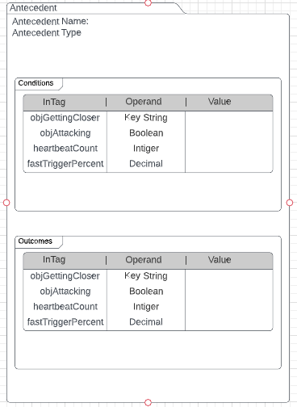
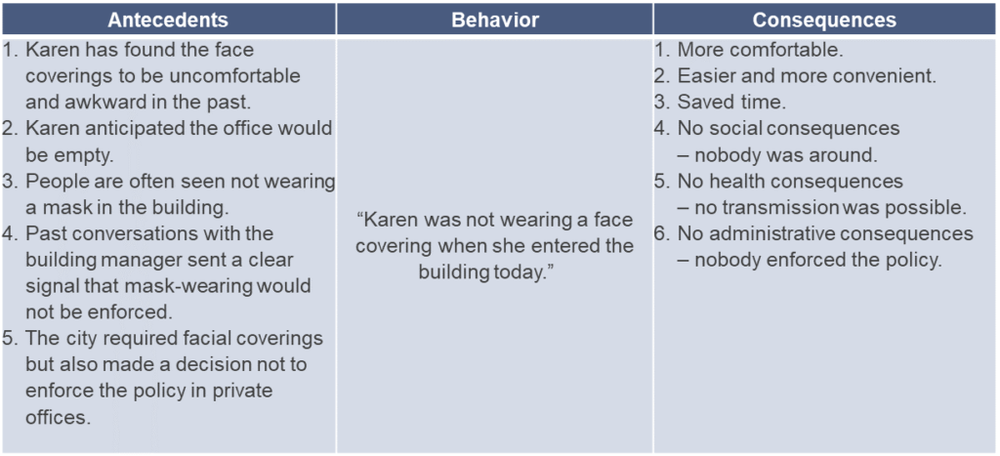
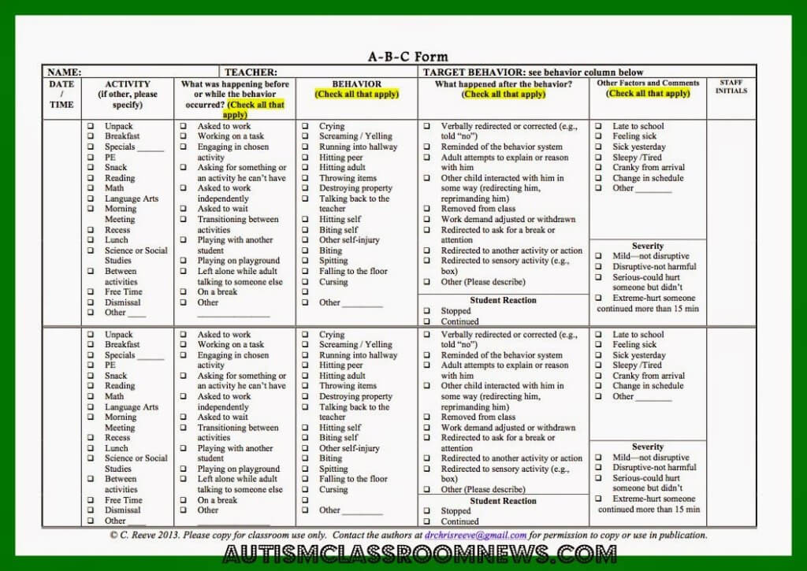

# ABC Method (Antecedent, Behavior, Consequence)

## Core Concepts

### ABC Framework Origins

The ABC (Antecedent-Behavior-Consequence) method provides a foundational framework for understanding and predicting behavior, originally developed in behavioral psychology and adapted for AI agent systems.

### Key Principles

**Recursive Antecedent Processing**:
- Consequences can function as antecedents for future behaviors
- Input specification crucial for recursive processing
- Enables complex behavioral chains

**Player-Specific Histories**:
- Individual antecedent histories maintained per player
- Timestamp-based merging capabilities
- Additive list structure for flexible ordering
- Synchronization with world-level antecedent lists

**World Context Integration**:
- Different worlds maintain separate antecedent lists
- Linked list structure with priority querying
- Early evaluation for world-specific conditions

**Habit Formation**:
- Paired behavior identification
- Consequence-antecedent relationships
- Algebraic solving for behavior prediction

**Temporal Parameters**:
- Present-focused vs future-oriented processing
- Adjustable through LifingPolls system
- Character-specific temporal preferences

**Action Space Design**:
- Start with simple action sets (R2D2 model):
  - Do nothing
  - Go forward/backward
  - Rotate clockwise/counterclockwise
  - Jump
- Efficient learning through constrained spaces

**Event Chain Structure**:
Setting Events → Preexisting Conditions → Antecedents → Behaviors → Consequences → Reflections

**Ayoai Impact**: ABC method provides behavioral framework:
- Recursive antecedent processing
- Player-specific histories
- World-specific antecedent lists
- Habit formation patterns
- Living in now vs future planning

## Book Predicting Behavior

Below are takeaways from the book.

### Behavioral Modification Process

**5-Step Framework**:
1. Identify actor behavior to modify
2. Observe and sample actor behavior
3. Identify antecedents of target behaviors
4. Identify patterns of antecedents and subsequent behaviors
5. Predict and modify behavior based on established patterns

### Key Concepts

**Attack Network Structure**:
- Antecedents as attack vectors on subconscious
- Network-based data structure for response mapping
- Reactive system design

**Setting Events**:
- Collections of past antecedents
- Equivalent to planning structures
- Predictive selection of future antecedents

**Environmental Specificity**:
- Different environments yield different antecedents
- Context-dependent behavioral triggers
- Algorithm must account for environmental variation

**Scope of Influence**:
- Individual level
- Organizational level
- Regional/city level
- Country/global level
- Hierarchical influence structures

**Individual Variation**:
- Basic needs differ per individual
- Customizable need hierarchies
- Rules engine requirement for personalization
- Historical antecedent-behavior-consequence associations

**Temporal Dynamics**:
- Imminent behaviors: Days of precedence
- Long-term behaviors: Extended precedence periods
- Time-based antecedent relevance

**Relationship Context**:
- Different relationships generate unique antecedents
- Internal relationships (reasoning unit, memory unit)
- External relationships (social, environmental)

### ThemeMate

- Identifies conceptual precursor themes. Pre-incident indicators. The way the data is in the array, these themes can be converted into antecedents, behavior, or consequences. This serves as a bridge between extracted antecedent candidates and examples of past behaviors.

- [[file {"file_name":"20220712_213409.jpg","file_size":2115322,"file_type":"image/jpeg","file_url":"https://files.todoist.com/XgKgkectQxEe-CSK9e3cf7v3e2NYbqIhiHZNVILsFVfV6qAdFpSwqFIEXo-YgVAJ/by/279997/as/file.jpg","image":"https://files.todoist.com/XgKgkectQxEe-CSK9e3cf7v3e2NYbqIhiHZNVILsFVfV6qAdFpSwqFIEXo-YgVAJ/by/279997/as/file.jpg","image_height":4032,"image_width":3024,"resource_type":"image","upload_state":"completed"}]]

- Data array rows are behaviors. The rows are created by naming all the documents for a specific example of behavior with the same identifier name.

- Data array column are themes. extracted across all documents. Themes are the antecedents to the behavior. In other words, events or situational variables preceding the occurrence of the behavior are logically related to the behavior. These themes could include basic information about event (time of day), behavior (atm stolen), antecedent candidates (an event or situation that occurred before the behavior), consequences (successful stolen atm). [Each candidate was allotted 80 characters.

- The outcomes added to the end of the array are very important. He mentions he did this manually, yikes. He says, ThemeMate cannot divine what we would like to predict, that is up to us. For example, he added threat levels 1 vs. threat level 2 columns which turned it into a Boolean, whether it will be a threat or will not be a threat. Then we were able to predict which one. Hmm, this needs to be improved.

- It is essential to remove any events from the analysis that led to the unsuccessful consequences. Humans do not repeat behaviors that lead to failure. [Note to self: Hmm, not sure I agree with removing everything here though. . . That does not change that the behavior did actually happen?] Must be careful about what a failure is.

- There is a really good excel example I need to replicate with my red light green light game.

- He is using a date occurrence as a key to the row it looks like. If more than one incident occurs on more than one day, it gets a a b or c. Time is important in the table he says. Hmm, I don't like the a, b, or c thing.

- A behavior-consequences analysis can be completed, resulting in a separate array.

- Analysis of the antecedent conditions can be enhanced by correlate all antecedents against all other antecedents. This will show how specific themes group together for certain types of behavior. High correlations (above .9) should be combined (yet have to be carful about this because data could be limited). This correlation table needs to be built, see comment pic.

- [[file {"file_name":"20220712_215756.jpg","file_size":2662882,"file_type":"image/jpeg","file_url":"https://files.todoist.com/z5hiz2f6n7yp3-ZsiYSL2p6XHVgmyZl9AI4gR9z8g0GTMVMj_CMadrsTuVF0chtC/by/279997/as/file.jpg","image":"https://files.todoist.com/z5hiz2f6n7yp3-ZsiYSL2p6XHVgmyZl9AI4gR9z8g0GTMVMj_CMadrsTuVF0chtC/by/279997/as/file.jpg","image_height":4032,"image_width":3024,"resource_type":"image","upload_state":"completed"}]]

- Can use sensor output as a form of antecedent. Movement tracking is an antecedent.

### AutoAnalyzer

- A behavioral applications, is an automated pattern classification model builder. It takes as input the data array presented by ThemeMate and reduces the set of antecedents candidates to the most relevant events and situations serving as antecedent predictors.

- Page 177 (cahpter 7) has a detailed explanation of the model he used, lack back propagations and stuff. I need to reach and google some of that. Read the autoanalyzer on the math behind the probability of something happening is. . . hmm Fisher's exxact statistical significance test - 5 chances out of a 100. That would be sweet to auto populate that as a new setting event was being defined.

- [[file {"file_name":"20220712_220456.jpg","file_size":2611675,"file_type":"image/jpeg","file_url":"https://files.todoist.com/IUDL7eqcjizB-AvNd7Ipuqg9TggRcWRbqog8OqwkfZQ4utJudrYf8SZJ2kZ8ZSo1/by/279997/as/file.jpg","image":"https://files.todoist.com/IUDL7eqcjizB-AvNd7Ipuqg9TggRcWRbqog8OqwkfZQ4utJudrYf8SZJ2kZ8ZSo1/by/279997/as/file.jpg","image_height":4032,"image_width":3024,"resource_type":"image","upload_state":"completed"}]]

- AutoAnalyzer processes the data array prepared by ThemeMate and reduces the set of antecedent candidates to the most relevant events and situations serving as antecedent predictors for defined outcomes. The application then contracts back propigations model. and validates it, then producing a learned model. Hmmm (why only one learned model?). For each model, the true positive, true negative, false positive, and false negative rates are presented. Read page 491 about Fishers probability

- ChackMate and InMate

- I believe these are variations of auto analyzer.

- Look at his applications. The way he separated out his applications could be a good way to form the pattern of the algo. Take a look at that.

- Hmm, these are very specific. Chapter 11 and 12 explain them more. Example is, for check mate on network exclusion, they look fior experience and deception as prediction factors. Hmm, what does this mean for what I want to do in roblox?

**Ayoai Impact**: ThemeMate and AutoAnalyzer provide:
- Data structure for behavior analysis
- Theme extraction from behaviors
- Antecedent correlation analysis
- Pattern classification models
- Statistical validation methods

## Antecedent Map Idea?

[Conditions - these could be core predicates!]

objGettingCloserTo
objGettingFurtherFrom
heatrbeatCountSinceLast
objAttacking
obstacle (where)
WithinDinstanceOf
DistanceFrom
Must NOT do something, or must do
MustHaveTool
MustHaveInventory
MyHealth
MyAmmo
MySpeed
MyCurrentWeaponRange
DinstanceFromMe
HealthOf
StrengthCount
AllyCount
EnemyCount
AllyEnemyRatio

 

 

[Antecedent Type]

Answer Yes/No Question
Answer Question with Number
Answer Question with text
Evaluation
Competition (highest Number)
Competition (Tournament)
Vote/Poll
SmpleBehavior, hmm
Recurring - mark true after # days?

 

**[List of behaviors]**

GoNextTo - Go next to an object
Explore - Uncover unseen environment
Open - Open Something
Close - Close Something
Pickup - Pickup Something
Drop - Drop Somethign
Find - Find something
GiveAway
Push
Pull
Attack - (group or person?) (intent?)
Avoid (group or person?) (intent?))
Respawn (where)
Idle
Memorize
Forget
AdjustConsequnceBar
SendMessageTo
EnterCompetition
EnterGroup
Build
fight
allow walking
chat
Move head, can base what to do where the head is.

Drive

Touch

 

 

**[Emotes]**

Jump
Run
Backstep
Crawl
Duck
Pushup
Juming-Jacks
MoveBodyPart? (how do we move a tail or a wing or a leg or a head?)
Waving
LookAtObj
Saluting

 

**[Constraints]**

Should happen when
When should happen
How urgent
Recurring
 

 

 

 

These would be cool to use inside the sensory processing unit and stuff like that:

what are the high level categories for antecedents a human deals with?

The high-level categories of antecedents a human deals with can generally be divided into several areas, reflecting the various dimensions of human experience and interaction. These include:

1. Psychological Antecedents: These involve factors related to an individual's internal mental state, such as emotions, beliefs, attitudes, and motivation. This category also includes cognitive aspects such as perception, memory, and decision-making processes.

2. Biological Antecedents: These refer to the physiological and genetic factors that influence human behavior and well-being. This category includes genetics, brain chemistry, neuroanatomy, and physical health conditions.

3. Social Antecedents: These involve the influence of social factors on human behavior, including family, peers, culture, social norms, and the media. This category examines how social contexts and interactions shape individual behavior and attitudes.

4. Environmental Antecedents: These encompass the physical and ecological factors that affect humans, such as geography, climate, urban or rural settings, and access to resources. This category also includes the built environment, such as architecture and urban planning.

5. Economic Antecedents: These refer to the economic conditions and factors that influence human behavior and life circumstances, including income, employment, market dynamics, and socioeconomic status.

6. Historical Antecedents: These are the influences from past events and conditions that have shaped current situations, beliefs, and behaviors. This includes personal history as well as broader historical contexts.

7. Cultural Antecedents: These include the shared beliefs, values, customs, and practices of a group or society. Cultural factors can greatly influence individual behavior, attitudes, and interactions.

8. Technological Antecedents: These involve the impact of technological developments and digital media on human life and behavior, including information access, communication methods, and interaction with artificial intelligence and automation.

These categories are not mutually exclusive and can interact with one another to influence human behavior and experiences in complex ways.

## ABC Analysis

- Here's a 5-step method for an ABC analysis, with an example. https://krausebellgroup.com/abc-analysis/

  - Abstract

    - Step 1: Pinpoint a single action that you want to change. Be extremely specific. Think of a specific person, at a specific point in time, in a specific situation.

    - Step 2: Identify as many antecedents that were present in that specific situation. Antecedents are signals, events, and cues that triggered the person to do what they did. Reminders, email, conversations, signs, training and rules are all common attempts to trigger behavior in organizations.

    - Step 3: Identify as many consequences that were in play in that specific situation. A consequence is an experience that follows behavior and affects the chance the behavior will occur again in a similar situation.

    - Step 4: Evaluate the impact of the consequences on the person. Positive consequences encourage the behavior to continue into the future. Negative consequences discourage it1. In either case, consequences are most powerful when they happen right away and when they are meaningful to the person.

    - Step 5: Create a plan for change. This is where leadership decision making becomes essential and critically important. In the above example, the only consequences affecting Karen were soon, certain, and positive. Unless something changes, it is very likely that Karen will continue not wearing her face covering in the office building. Leaders have the opportunity to create such a plan.

    - The plan starts with repeating the above ABC analysis on the desired behavior. In this case, maybe the desired behavior is for Karen speak up about a policy that makes no sense. Then we can change the antecedents and consequences: The goal is to create a situation in which the desired behavior is more likely to occur, and the undesired behavior is less likely to occur.

### Visual Example

## ABC Data Sheet

- Collecting ABC Data: A Freebie in Step 2 of Meaningful Behavioral Support https://autismclassroomresources.com/collecting-abc-data-freebie-in-step-2/

  - Abstract

    - ABC data, or antecedent-behavior-consequence data is critical to the process of a functional behavior assessment. The more clear and comprehensive the information collected the better able we are to draw conclusions about the potential functions. However, the hard part is trying to collect comprehensive while not having it interfere with addressing the behavior, assuring safety, and, you know, little things like...instruction. So today I wanted to share an ABC data sheet that I use to try to get specific information easily.

### Data Collection Template

**Ayoai Impact**: ABC analysis provides:
- 5-step behavior change method
- Clear data collection framework
- Focus on immediate consequences
- Meaningful behavior tracking
- Perfect for NPC behavior learning

## Integration with Ayoai Platform

ABC Method implementation for Ayoai:

1. **Antecedent System**
   - Player-specific histories
   - World-specific lists
   - Recursive processing
   - Attack network structure
   - 8 categories of human antecedents

2. **Behavior Mapping**
   - Core behaviors list
   - Emote system
   - Constraints framework
   - Action space design

3. **Consequence Processing**
   - Immediate feedback
   - Learning from failures
   - Habit formation
   - Success reinforcement

4. **Data Structures**
   - ThemeMate-inspired arrays
   - Correlation analysis
   - Statistical validation
   - Time-based tracking

This method provides the foundation for Ayoai's learning system, enabling NPCs to:
- Learn from past experiences
- Form habits and patterns
- Adapt to different environments
- Maintain individual histories
- React to antecedent networks