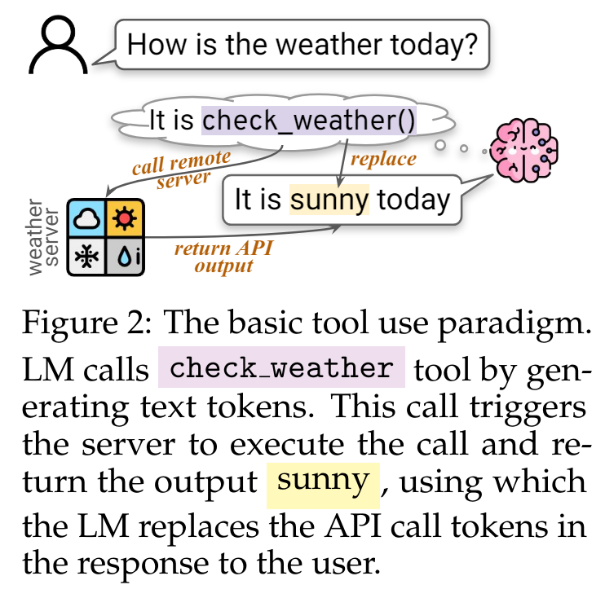
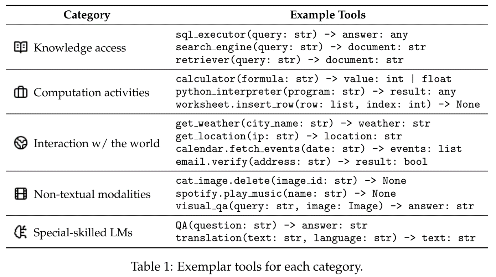

# Agent Capabilities

This document covers practical implementation aspects of agent capabilities including communication, tool use, and agent-agent interactions.

## Communications (agent-agent and agent-player)

### Architecture Overview

**Communication as Behavior**:
- Chat actions integrated as behavior tree nodes
- Decision-making for when and what to communicate
- Mental behavior trees guide conversation initiation

**Server-Side Processing**:
- Communication logic runs on Ayoai servers, not in game engine
- LLM-generated behavior trees for conversation flow
- Separation of reasoning (server) from execution (client)

**Response Generation**:
- AyoChatResponseBuilderVerticle handles conversation processing
- History-aware context management
- Multi-agent conversation coordination

**Ayoai Impact**: Communication design considerations:
- Chat as a behavior tree action node
- Server-side communication processing (not in Roblox)
- LLM-generated conversation trees
- History-aware response generation

## Tool Use

### Research Gap

Despite the importance of tool use in agent systems, there's limited research combining tool use with planning frameworks. This section addresses this critical intersection.

### What are tools anyway?

- What Are Tools Anyway? A Survey from the Language Model Perspective <https://arxiv.org/abs/2403.15452>

  - Abstract
    - Language models (LMs) are powerful yet mostly for text generation tasks. Tools have substantially enhanced their performance for tasks that require complex skills. However, many works adopt the term "tool" in different ways, raising the question: What is a tool anyway? Subsequently, where and how do tools help LMs? In this survey, we provide a unified definition of tools as external programs used by LMs, and perform a systematic review of LM tooling scenarios and approaches. Grounded on this review, we empirically study the efficiency of various tooling methods by measuring their required compute and performance gains on various benchmarks, and highlight some challenges and potential future research in the field.

### Visual Framework

**Ayoai Impact**: Tool use is essential for game agent capabilities:
- Tools = external programs/functions agents can invoke
- In Ayoai context: game mechanics, inventory management, combat actions
- Need clear tool definitions and usage patterns
- Tools bridge LLM reasoning to game actions

## Integration with Ayoai Platform

The research on agent capabilities suggests:

1. **Communication Architecture**
   - Mental behavior trees for conversation decisions
   - Server-side dialogue processing
   - Context-aware response generation
   - Multi-agent conversation coordination

2. **Tool Framework**
   - Clear tool/action definitions
   - Programmatic interfaces
   - Usage examples for LLMs
   - Error handling and fallbacks

3. **Implementation Patterns**
   - Separate reasoning (LLM) from execution (game engine)
   - Asynchronous communication handling
   - Tool discovery and documentation
   - Performance monitoring

This enables:
- Natural agent-agent conversations
- Meaningful player interactions
- Complex tool-based behaviors
- Scalable multi-agent systems
