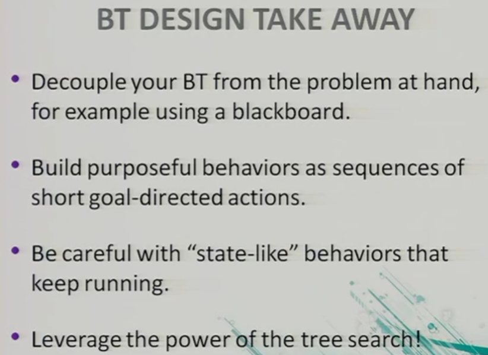
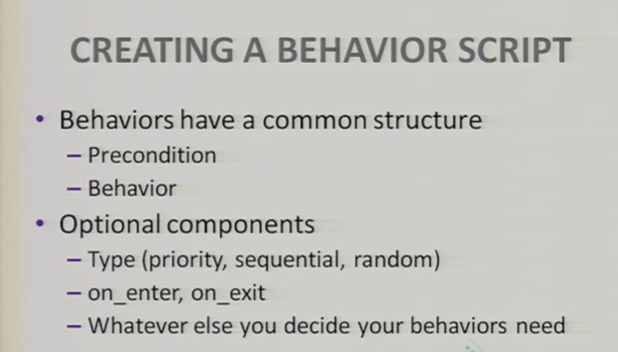

# Game AI Architectures

Patterns and architectures from game development conferences and industry leaders.

## The Bitter Lesson

The bitter lesson, what is this?!!!! http://www.incompleteideas.net/IncIdeas/BitterLesson.html. Reread this again.

> The bitter lesson is based on the historical observations that 1) AI researchers have often tried to build knowledge into their agents, 2) this always helps in the short term, and is personally satisfying to the researcher, but 3) in the long run it plateaus and even inhibits further progress, and 4) breakthrough progress eventually arrives by an opposing approach based on scaling computation by search and learning. The eventual success is tinged with bitterness, and often incompletely digested, because it is success over a favored, human-centric approach.
>
>  
>
> One thing that should be learned from the bitter lesson is the great power of general purpose methods, of methods that continue to scale with increased computation even as the available computation becomes very great. The two methods that seem to scale arbitrarily in this way are *search* and *learning*.
>
>  
>
> The second general point to be learned from the bitter lesson is that the actual contents of minds are tremendously, irredeemably complex; we should stop trying to find simple ways to think about the contents of minds, such as simple ways to think about space, objects, multiple agents, or symmetries. All these are part of the arbitrary, intrinsically-complex, outside world. They are not what should be built in, as their complexity is endless; instead we should build in only the meta-methods that can find and capture this arbitrary complexity. Essential to these methods is that they can find good approximations, but the search for them should be by our methods, not by us. We want AI agents that can discover like we can, not which contain what we have discovered. Building in our discoveries only makes it harder to see how the discovering process can be done.

**Ayoai Impact**: The Bitter Lesson is crucial for Ayoai's philosophy:
- Avoid hard-coding behaviors - let agents learn
- Focus on scalable search and learning methods
- Build meta-methods, not specific behaviors
- Let agents discover patterns, not contain our discoveries
- This aligns with Ayoai's approach of emergent behaviors

## Dave Mark's Site

This stuff is awesome!

### Multi-Tasking

- Multi-Tasking https://gameai.com/example-plan.php

  - What they see: An NPC is cold and needs to build a fire. But before that, the NPC needs to bring wood to the storage area near the campfire location. To do that, the NPC needs to wander and find wood to pick up into their personal inventory so they can head back to the storage location when their arms are full. But the NPC is also hungry---not just now, but wouldn't mind storing some food in a pouch for later. And the NPC is curious about new things that it sees nearby. And the NPC is wary of bad things that are nearby and acts friendly to the forest animals that it sees. So the NPC sets out from the campfire and is looking around the area. As it sees a stick of wood, it wanders over to pick it up, bends over, grabs it, and puts it into a sling for carrying wood. It wanders again, sees another piece of wood and heads in that direction. However, before getting to it, it sees a nearby piece of fruit on the ground. The NPC diverts slightly away from the piece of wood to get the fruit, bend over, pick it up, and pop it into it's mouth. It then resumes heading for the 2nd piece of wood, picks it up, and puts it into its pouch. The NPC continues on, seeing wood and food, diverting to pick them both up if they are close---even interrupting its path at times. In the meantime, it steers clear of a baddie it sees---ignoring a piece of fruit that was too close to risk. On the way to a stick on the ground, the character waves to a friendly woodland creature, cheerfully saying hello. At some point, their food pouch is full and they aren't hungry so they stop moving to and picking up more berries and fruits. And then, when their wood bag is full, they return to the camp, dump the contents into the storage area, use some of it to build a fire, light it, and then sit down to get warm. Mission accomplished---not just getting the wood and building the fire, but collecting the food, staying safe, and greeting little furry friends.

  - What is happening? The steps involved in building a fire seem like something out of an example of a planner such as GOAP. In fact, the collection of the food could also be a GOAP plan as well. However, planners will typically pick a single goal and execute a single plan (which may change) in order to accomplish that single goal. What is extrordinary here is that these plans are running at the same time---in parallel! Sometimes they would even be executing one step of one plan, discover something else that was more convenient at the time (from the other plan?), execute that, and resume what it was doing in the first plan (if it was still a good idea). Additionally, these two plans are being interupted by general "life" moments. At the very simple level, the agent is moving to, picking up, and storing or using the items because they are tagged like "Flammable" or "Edible". While the agent could have been left to simply pick up objects with the appropriate tags as it sees them, that takes away not only the reason for doing so, but what comes next once they are picked up. In our implementation, the IAUS has a series of behaviors that, at their core, have the same premise---in this case, "I am cold" (or need to cook food, etc.). However, thinking in terms of the series, each behavior has another consideration specifying a prerequisite that needs to be in place. So, while "I am cold" certainly is a valid reason to build a fire, the "build fire" behavior requires that there be a certain amount of wood in the storage pile. If the pile doesn't have enough, then "I am cold" plus "not enough wood" would lead to the "search for wood" behavior. This would continue on so that even "pick up wood" has the same "I am cold" consideration plus the others that go after. The result is that the behaviors get self-assembled in order of their need and, as they are satisfied, the progression towards the ultimate goal continues. But because, in the IAUS, we are evaluating all of our possible behaviors every think cycle, we can be thinking about "move to wood" and "move to food" at the same time. In the example case, if we are moving towards a piece of wood and see a convenient pice of fruit, we can execute that and, when it is no longer in play, the "move to wood" we were doing will likely be back to the highest scoring behavior to execute. The parallel plans all stay intact as long as they are appropriate!

### Infinite Axis Utility System

- Infinite Axis Utility System

  - The Infinite Axis Utility System (IAUS) provides the "brains" for game agents from NPCs, to squads, to armies, and even to otherwise inanimate objects. It is entirely data-driven through a database oriented design tool (included) that allows designers to create, manipulate, and tune the behaviors in subtle, yet very understandable ways. Because of the nature of utliity AI, much of the variation spills out of the nuanced nature of the behavior scoring and selection system. Additionally, because of this difference from the standard if/then approach to behavior selection, the behavior systems are less rigid and, therefore, less brittle. The AI rarely---if ever---get's "stuck" in a behavior that it shouldn't because it can't get out of what it is doing. Put another way, the AI is analyzing the complex situations in ways that make sense to us but are enormously difficult to script out. (For those familiar with computational complexity theory, the IAUS is helping you do the NP-Hard problems by making sure you don't have to think of everything!) The IAUS exists as a stand-alone black box that can be installed into a project codebase with minimal work. We have both C++ and C# versions based on the needs to the client. In theory, minus any specific custom language or library issues, this means that this core AI system can be installed on day 1 and work can begin on hooking it up to world information, existing behavior and animation code, and behavior logic can be authored in the tool we have developed for that purpose.

- Zak Thoughts:

  - Three things do different than Dave Mark. 1) instead of sum at the end, use the inputs into a neural network. 2) have actions embedded into actions. 3) Have the actions, and the axsies of that action, be user defined and generated.

**Ayoai Impact**: Dave Mark's work is foundational for game AI:
- Parallel goal execution (not sequential planning)
- Utility-based decision making
- Self-assembling behaviors based on needs
- Data-driven behavior tuning
- Avoiding brittle if/then logic
- Perfect model for Ayoai's behavior selection

## GDC Behavior Tree Notes

Behavior Trees: Three Ways of Cultivating Strong AI

https://www.gdcvault.com/play/1012416/Behavior-Trees-Three-Ways-of

At the higher level you have the above pic, on the top few layers. But the below low level sequences will be at bottom of tree. To have the tree more like states, like cover, you could get locked into the tree . . . Its not trying to figure out if anything broke or whatever. So for each behavior , it it monitors if assumptions have changed. You want your nodes forward looking.  

A tree is not a planner. A planner plans some moves ahead, whereas the tree reacts to things. Hmm . . ..

**Ayoai Impact**: Key insights from GDC:
- Trees are reactive, not planning
- Need forward-looking nodes
- Monitor assumption changes
- Avoid getting locked in states

## One-Liner Inspirations

- The next challenge is recognizing what a robot is actually able to do. A robot may understand perfectly well when you ask it to grab a bottle of cleaner from the top of the fridge, where it is safely stored out of the way of children. The problem is, the robot can't reach that high. The big breakthrough is what Google is calling "affordances" --- what can the robot actually do with some reasonable degree of success. This might includ - - Google makes robots smarter teaching them their limitations -- TechCrunch - -

- BabyAgi: https://twitter.com/yoheinakajima/status/1642881722495954945?s=19

- Do not think I agree with this: "To scale cost-effectively, application developers will likely need to figure out ways to shift model workloads to end-user devices, but this will take time." Awesome article regardless though. https://a16z.com/the-neverending-game-how-ai-will-create-a-new-category-of-games/

- Decentraland npcs: https://decentraland.org/blog/announcements/ai-npcs-herald-the-beginning-of-ai-in-decentraland

- Unitiy NPCs

- There is a difference between education and intelligence. Education one can observe, intelligence is something else.

- Someone should be able to take their npc, and copy it, and edit it, etc. And place in different worlds. They can even add antecedents form the past. The algo should it has to restart if things from the past have changed. nah just that one. Hmm.

- Instead of use tabs, people and then factions, need company ai too and social factions

- The next challenge is recognizing what a robot is actually able to do. A robot may understand perfectly well when you ask it to grab a bottle of cleaner from the top of the fridge, where it is safely stored out of the way of children. The problem is, the robot can't reach that high. The big breakthrough is what Google is calling "affordances" --- what can the robot actually do with some reasonable degree of success. This might include easy tasks ("move a meter forward"), slightly more advanced tasks ("Go find a can of Coke in the kitchen"), to complex, multi-step actions that require the robot to show quite a bit of understanding of its own abilities and the world around it. ("Ugh, I spilled my can of Coke on the floor. Could you mop it up and bring me a healthy drink?"). https://techcrunch.com/2022/08/16/google-robotics/

- Wow, fractile neural network?! http://sohl-dickstein.github.io/2024/02/12/fractal.html

- Sims called it their "needs" or their "skills" or their aspirations which led to them picking more interesting next behaviors. They definitely have some sort of central "next" tree selector. And they had a tree running (which the user can choose to kill or not). Then they have a list of skills waiting in a queue like I was saying.

  - The Sims - The Sims games are real-life simulation games that focus on the everyday life of people, where the player controls artificial human beings to perform tasks such as cooking, bathing, going to work, exercising, you name it! The Sims games have some of the best examples of AI with behavior trees due to the fact that the sims can interact with tons of everyday items. For example, in one of the videos below, you can see a sim cooking a meal on the kitchen counter. This describes how that sim utilizes a sequence node to walk to the fridge, grab some materials to make the food item, walk to the counter, chop up the food, cook it, serve it at the table, and finally begin eating the food! Also, in the Sims, the player can interrupt the current sim's actions if he/she wants to. In terms of our last example, this means the player can send a 'failure' status message up to that food sequence node that is currently executing, which ultimately causes the sim to stop what he/she is doing and put the food somewhere. When the player isn't controlling the behaviors of a certain sim (i.e. when the player is playing as a different sim or is away from the controller), the sims automatically control their own behaviors depending on their daily needs, such as their thirst, their hunger, their bladder, their tiredness, their hygiene, and so on. These sims utilize behavior trees to maintain their wellbeing autonomously! Check out the sims if you haven't before.

**Ayoai Impact**: Implementation insights for Ayoai:
- Affordances - what agents can actually do
- Needs/skills/aspirations driving behavior
- Interruptible behavior sequences
- Queue of pending skills
- Central tree selector
- Autonomous wellbeing maintenance

## Integration with Ayoai Platform

Game AI architecture research suggests:

1. **Core Principles**
   - Follow the Bitter Lesson - scalable methods
   - Utility-based decision making
   - Parallel goal execution
   - Reactive behavior trees
   - Affordance awareness

2. **Architecture Patterns**
   - IAUS for behavior scoring
   - Forward-looking nodes
   - Self-assembling behaviors
   - Data-driven tuning
   - Interruptible sequences

3. **Implementation Approach**
   - Start with simple affordances
   - Build utility evaluation system
   - Support parallel goals
   - Enable behavior interruption
   - Track needs/skills/aspirations

This research provides the foundation for Ayoai's behavior architecture, combining utility theory with behavior trees for emergent, realistic NPC behaviors.