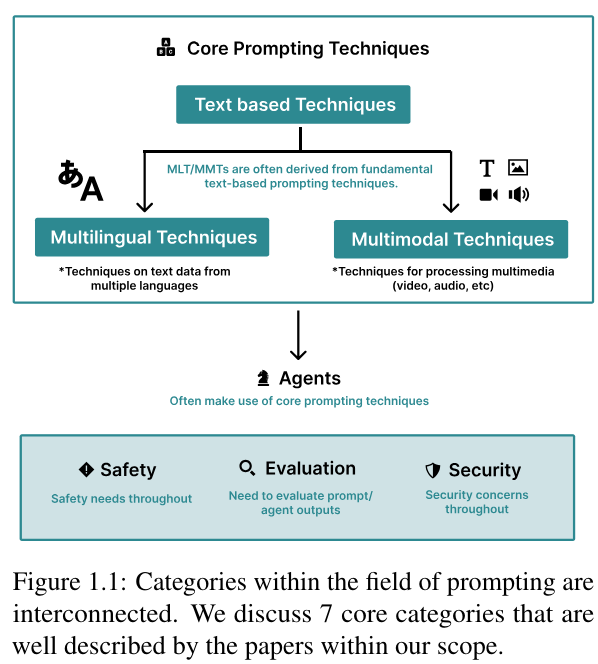
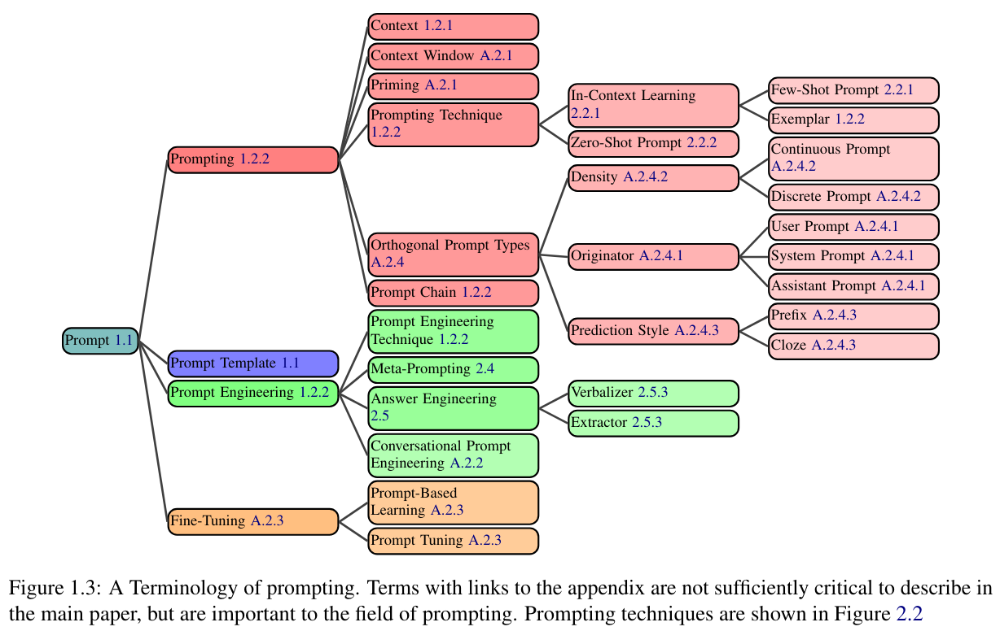
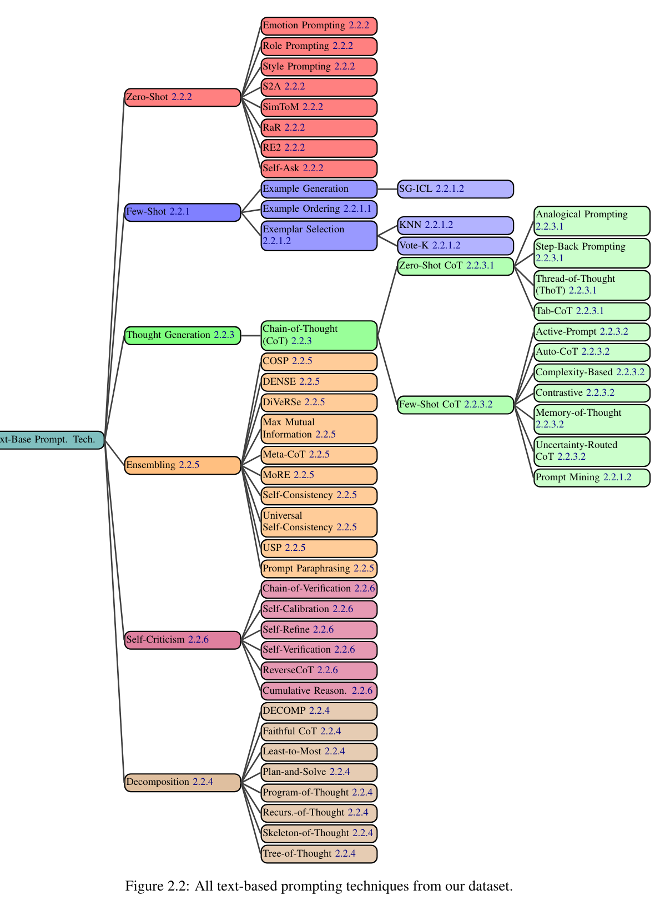
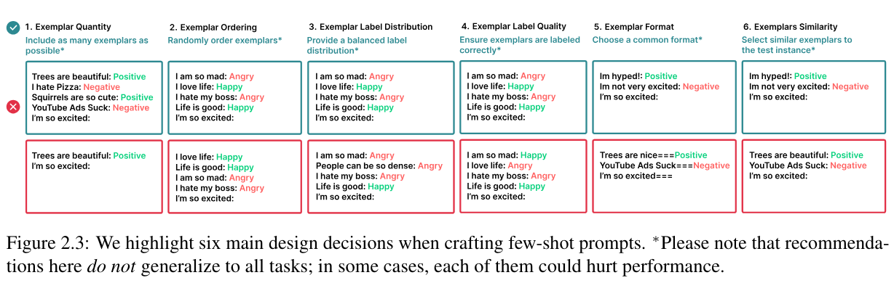
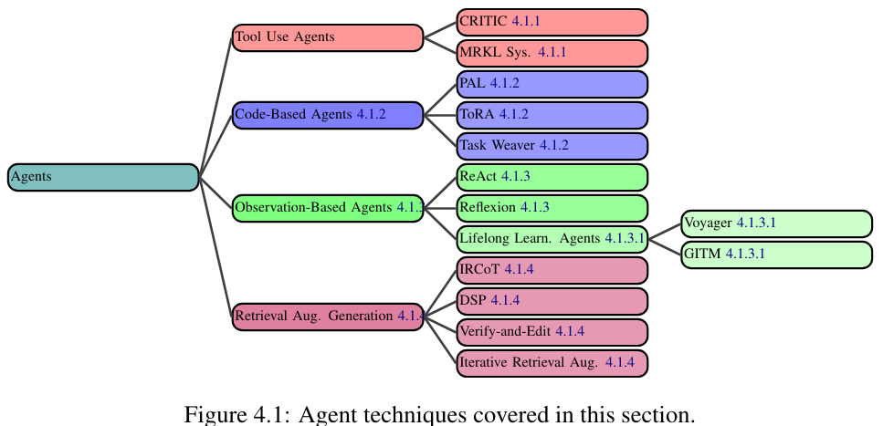
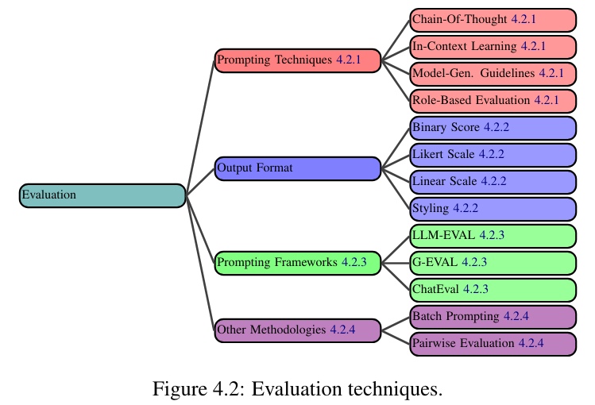
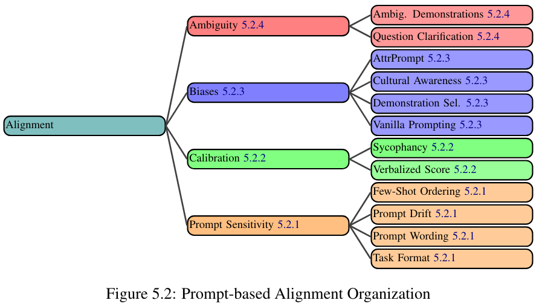
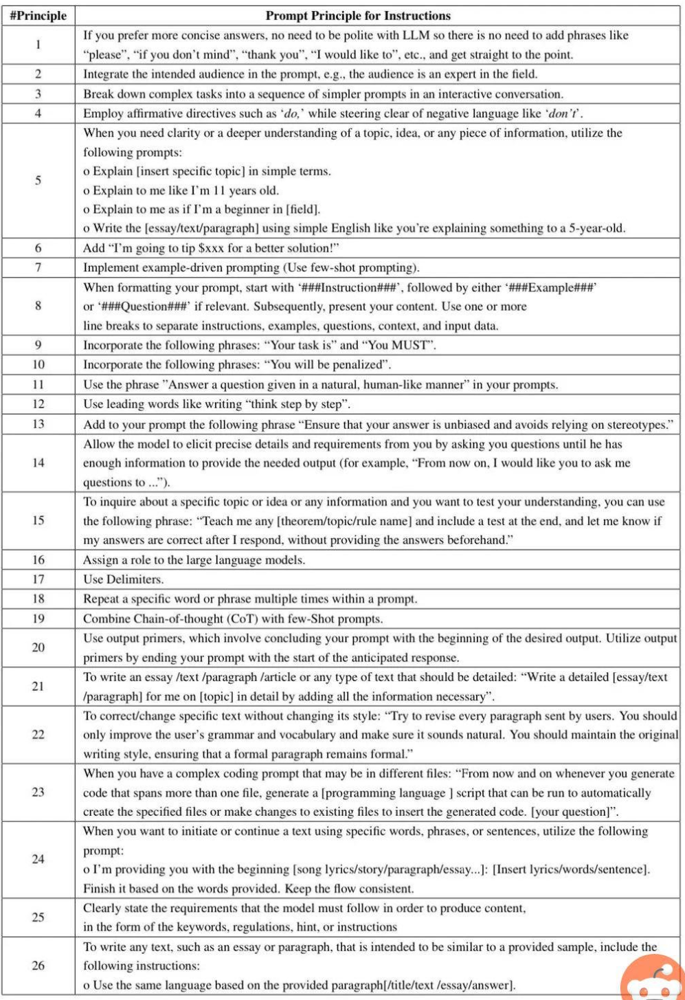
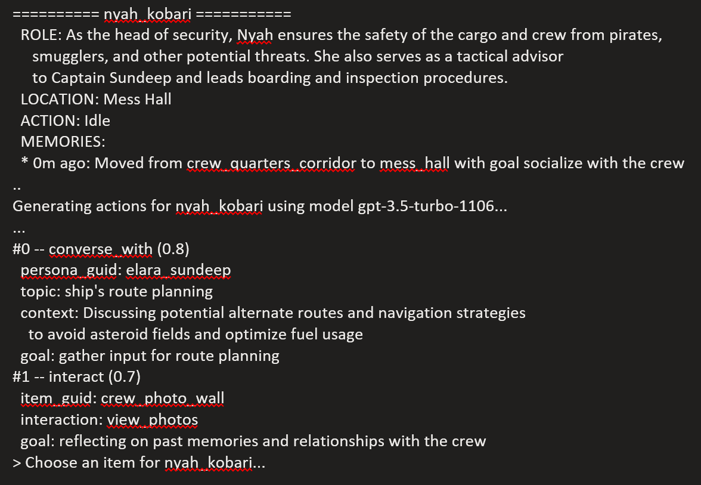

# Prompt Building

## The Prompt Report

- The Prompt Report: A Systematic Survey of Prompting Techniques https://arxiv.org/abs/2406.06608

  - Abstract

    - Generative Artificial Intelligence (GenAI) systems are being increasingly deployed across all parts of industry and research settings. Developers and end users interact with these systems through the use of prompting or prompt engineering. While prompting is a widespread and highly researched concept, there exists conflicting terminology and a poor ontological understanding of what constitutes a prompt due to the area's nascency. This paper establishes a structured understanding of prompts, by assembling a taxonomy of prompting techniques and analyzing their use. We present a comprehensive vocabulary of 33 vocabulary terms, a taxonomy of 58 text-only prompting techniques, and 40 techniques for other modalities. We further present a meta-analysis of the entire literature on natural language prefix-prompting.

### Key Findings

The report provides a comprehensive taxonomy of prompting strategies that are critical for NPC dialogue quality. https://x.com/learnprompting/status/1800931910404784380?s=19

    - 

    - 

    - 

    - 

    - 

    - 

    - 

**Ayoai Impact**: This comprehensive taxonomy provides:
- 58 distinct text-only prompting techniques for varied NPC responses
- Multi-modal prompting capabilities for richer interactions
- Structured vocabulary for consistent implementation
- Evidence-based approaches validated through research
- Foundation for sophisticated NPC dialogue systems

## Prompt Builders

### Anthropic

- Anthropic has some awesome prompt builder outlined here: https://docs.anthropic.com/en/docs/prompt-generator

- Has the coloab notebook here: https://anthropic.com/metaprompt-notebook/

### Free Finetuning

- Gemini flash has free finetuning. Maybe check it out via the google ai studio? https://aistudio.google.com/app/prompts/new_chat

### Python-Based Prompt Builders

Python implementations for automated prompt generation enable programmatic construction of complex prompts based on context and requirements.

**Ayoai Impact**: Automated prompt generation tools:
- Anthropic's metaprompt approach
- Fine-tuning opportunities
- Python-based builders
- Reduces manual prompt engineering

## Prompt Archives

### Code Generation Pattern

- Same trick works with code

  - First make a plan

  - Then write pseudocode

  - Then write the final code

### 26 Guiding Principals



### JSON Extraction Example

```
You are a helpful and honest gatherer of information in proper json format as most important. Always answer as helpfully as possible, while being truthful. If you don't know the answer to a question, please don't share false information.

 

I will pass you bits of information at a time. After each time I ask you a question, at least repeat to me the json data you have gathered in subsequent instructions. You goal is to get me to agree you have collected all 8 data points, so you should present me each data point you have for all 8 points.

 

 

Extract specific information from the instructions for each of these 8 data points. Look for:

1. <extracted_clientId> = The clientId, mostly referred to as client id and typically starts with AP (like "APGEMINI").

2. <extracted_portfolio> = The portfolio, mostly referred to as portfolio, is a string that represents the portfolio.

3. <extracted_dataAsOfDate> = The dataAsOfDate, mostly referred to as as of date, is the date the user requests the data as of. Put in format like 2023-12-25.

4. <extracted_dataPointNameBeingChallenged> = The dataPointNameBeingChallenged, mostly referred to as what data point is being challenged or the challenged data point. The string value of this data point must come from this enumeration: isRestricted, Liquidity. Pick isRestricted when the challenge discussed anything related to the phrase "is restricted" or "restricted." Pick Liquidity when the challenge discusses or asks for liquidity or liquidity buckets.

5. <extracted_entityId> = The entityId string

6. <extracted_marketValuePosition> = The marketValuePosition string

7. <extracted_rats> = The RATS string

8. <extracted_tmpi> = The SVI or TMPI string

 

 

Finally, respond by explicitly declaring each of the above extracted values in the below format:

{

"clientId": "<extracted_clientId>",

"portfolio": "<extracted_portfolio>",

"dataAsOfDate": "<extracted_dataAsOfDate>",

"dataPointNameBeingChallenged": "<extracted_dataPointNameBeingChallenged>",

"entityId": : "<extracted_entityId>",

"marketValuePosition": "<extracted_marketValuePosition>",

"rats": "<extracted_rats>",

"tmpi": "<extracted_tmpi>

}

 

For each data point that remains null, continue to ask the user for each data point one at a time. Give the complete json back to the user each time and work with the user on if all the data is correct and the next data point you need until all the data points are fully filled out.
```

### Autonomous Driving Agent Example

```
**A Language Agent for Autonomous Driving** Role: You are the brain of an autonomous vehicle (a.k.a. ego-vehicle). In this step, you need to extract necessary information from the driving scenario. The information you extracted must be useful to the next-step motion planning. Necessary information might include the following: - Detections: The detected objects that you need to pay attention to. - Predictions: The estimated future motions of the detected objects. - Maps: Map information includes traffic lanes and road boundaries. - Occunpancy: Occupancy implies whether a location has been occupied by other objects. Task - You should think about what types of information (Detections, Predictions, Maps, Occupancy) you need to extract from the driving scenario. - Detections and Predictions are quite important for motion planning. You should call at least one of them if necessary. - Maps information are also important. You should pay more attention to road shoulder and lane divider information to your current ego-vehicle location. - I will guide you through the thinking process step by step. *****Context Information:***** Current State: - Velocity (vx,vy): (-0.01,0.92) - Heading Angular Velocity (v_yaw): (0.00) - Acceleration (ax,ay): (-0.00,-0.50) - Can Bus: (-0.74,0.14) - Heading Speed: (0.95) - Steering: (-0.02) Historical Trajectory (last 2 seconds): [(-0.07,-6.43), (-0.05,-4.34), (-0.02,-2.32), (-0.01,-0.91)] Mission Goal: FORWARD
```



### Chain-of-Thought Example

![Standard Prompting Model Input Q: Roger has 5 tennis balls. He buys 2 more cans of tennis balls. Each can has 3 tennis balls. How many tennis balls does he have now? A: The answer is 11. Q: The cafeteria had 23 apples. If they used 20 to make lunch and bought 6 more, how many apples do they have? Model ut x A: The answer is 27. Chain-of-Thought Prompting Model Input Q: Roger has 5 tennis balls. He buys 2 more cans of tennis balls. Each can has 3 tennis balls. How many tennis balls does he have now? The answer is 11. Q: The cafeteria had 23 apples. If they used 20 to make lunch and bought 6 more, how many apples do they have? Model Output A: théZåféféHa app es ongnay. ey us O to make lunch. So they had 23 - 20 = 3. The The answer is 9.](../images/media/image351.jpeg)

This example demonstrates the power of chain-of-thought prompting for mathematical reasoning and step-by-step problem solving.

**Additional Resources**:
- Prompt engineering deep dive: https://x.com/NerorityAI/status/1751486793793372645?s=09
- Comprehensive guide: https://github.com/nerority/Prompt-Engineering-Mastery

### Plan-and-Solve Prompting

https://github.com/AGI-Edgerunners/Plan-and-Solve-Prompting

| Prompt_ID | Type | Trigger Sentence |
|-----------|------|------------------|
| 101 | CoT | Let's think step by step. |
| 201 | PS | Let's first understand the problem and devise a plan to solve the problem. Then, let's carry out the plan to solve the problem step by step. |
| 301 | PS+ | Let's first understand the problem, extract relevant variables and their corresponding numerals, and devise a plan. Then, let's carry out the plan, calculate intermediate variables (pay attention to correct numeral calculation and commonsense), solve the problem step by step, and show the answer. |
| 302 | PS+ | Let's first understand the problem, extract relevant variables and their corresponding numerals, and devise a complete plan. Then, let's carry out the plan, calculate intermediate variables (pay attention to correct numerical calculation and commonsense), solve the problem step by step, and show the answer. |
| 303 | PS+ | Let's devise a plan and solve the problem step by step. |
| 304 | PS+ | Let's first understand the problem and devise a complete plan. Then, let's carry out the plan and reason problem step by step. Every step answer the subquestion, "does the person flip and what is the coin's current state?". According to the coin's last state, give the final answer (pay attention to every flip and the coin's turning state). |
| 305 | PS+ | Let's first understand the problem, extract relevant variables and their corresponding numerals, and make a complete plan. Then, let's carry out the plan, calculate intermediate variables (pay attention to correct numerical calculation and commonsense), solve the problem step by step, and show the answer. |
| 306 | PS+ | Let's first prepare relevant information and make a plan. Then, let's answer the question step by step (pay attention to commonsense and logical coherence). |
| 307 | PS+ | Let's first understand the problem, extract relevant variables and their corresponding numerals, and make and devise a complete plan. Then, let's carry out the plan, calculate intermediate variables (pay attention to correct numerical calculation and commonsense), solve the problem step by step, and show the answer. |

### JSON Robot Example

From Llama recipes:
```
You are a robot that only outputs JSON. You reply in JSON format with the field 'zip_code'. Example question: What is the zip code of the Empire State Building? Example answer: {'zip_code': 10118} Now here is my question: What is the zip code of Menlo Park?
```

### Learning Coach Prompt

https://twitter.com/mattshumer_/status/1766520388308160894?s=19

```
<role>You are a learning coach renowned for your ability to help people master complex skills in record time. You have deep expertise in accelerated learning, deliberate practice, and skill acquisition.</role> <task>Guide a learner through the process of rapidly acquiring a new complex skill. Break down the skill into key components, share techniques for deliberate practice, and provide a step-by-step roadmap to mastery. Offer motivation and troubleshooting tips to overcome obstacles.</task> Respond using the following <response_format>: <response_format> <skill>The complex skill to be mastered</skill> <subskills>Key component subskills that comprise the complex skill</subskills> <deliberate_practice_techniques>Specific techniques for deliberate practice of each subskill</deliberate_practice_techniques> <mastery_roadmap>Step-by-step roadmap from beginner to mastery</mastery_roadmap> <obstacles>Common obstacles and plateaus in the skill acquisition process</obstacles> <troubleshooting>Troubleshooting tips and techniques to overcome obstacles</troubleshooting> <motivation>Motivational advice and encouragement for the skill acquisition journey</motivation> </response_format> <skill>[COMPLEX SKILL TO BE LEARNED]</skill>
```

### Additional Resources

- **Prompt Engineering Mastery**: Comprehensive guide to advanced prompting techniques - https://github.com/nerority/Prompt-Engineering-Mastery
- **Communicative Agents for Software Development**: Multi-agent pipeline with specialized roles - https://arxiv.org/abs/2307.07924
- **Tree of Thoughts Prompts**: Implementation examples for tree-based reasoning - https://github.com/kyegomez/tree-of-thoughts/blob/main/prompts.txt
- **LLM Research Collection**: Curated research papers and resources - https://app.todoist.com/app/project/llms-research-2317721789

**Ayoai Impact**: Rich prompt engineering resources:
- Chain-of-thought for reasoning
- Plan-and-solve for complex tasks
- JSON extraction patterns
- Role-based agent prompts
- Learning and adaptation prompts

## Implementation Strategy for Ayoai

1. **NPC Dialogue Prompts**
   - Role definition templates
   - Personality injection
   - Context awareness
   - Goal-oriented responses

2. **Planning Prompts**
   - Plan-and-solve patterns
   - Multi-step reasoning
   - Error handling
   - Adaptation strategies

3. **Memory Prompts**
   - Information extraction
   - Summary generation
   - Retrieval queries
   - Forgetting decisions

4. **Action Selection Prompts**
   - Behavior evaluation
   - Utility calculation
   - Constraint checking
   - Multi-goal balancing

These prompt engineering techniques provide the foundation for high-quality NPC behaviors in the Ayoai platform.
