# Behavior Generation

Trees are the way! Mind trees, Behavior trees, Binary trees, etc.

## Overall Notes

- Execute Behaviors with Behavior Trees??!!!!

- Could expand behavior trees: Need an engine that can choose:
  - What tree to pause
  - What tree to start
  - How many trees of what type at a time
    - Goal planning tree
    - Day planning tree
    - Deep task tree
    - The higher up ones can trigger the priority at the lower level. . .
      - How to make these level elastic?
  - Who controls this brain?

- Random notes
  - You should be able to give someone else a tree, buy a tree, trade a tree.
  - I like starting with R2D2 behaviors: we demonstrate results using an R2D2 robot
    - with a discrete action space of six actions: do nothing, go forward, go backward, rotate clockwise,
    - rotate counterclockwise, and jump. This simple action space allows the agent to learn new tasks more
    - efficiently, requiring fewer time steps compared to robots with more complex action spaces.
    - What is the most ideal situation to be in right now. That would be a good prompt?!
  - I need two models!! I need something to decide what class of things to do, and then something else to decide how to do that. The, "how to do that" is going to be a bigger model than the others? But I need the model to give me the top 5 or top 10 behaviors, that way the how engine will know what to fall back to if something doesn't line up.
  - Also, one should be able to trace up to parent antecedents (in same tree or all trees) to see if there is some grand prize. That needs to be taken into acoount, I think. And it should see if antecedent for the user is completed or met started kind of things.
  - I need to maintain a bi temporal history of all trees. How is that possible?! I've only seen that done on linear, like relation database.
  - Predicates!! Attractive or not, naughty or nice, fat or skinny, gender
  - The ayo si server on start up shills have one master tree it load that handles fast reaction and emergency stuff, singing l something like that. Maybe think of them as "instinctual trees" that npcs could respond with quickly on the lack of instruction from planning.
  - How do we handle competitions. How to handle social situations. How do you handle being in a social group, like a family. This is an antecedent too.
    - The default when am npc encounters something it does not know, it's scared
    - There is a training phase that all npc brains must go through. Just like the unity ml agents. Like, Roblox users could create training environments

**Ayoai Impact**: Behavior trees are the core execution mechanism:
- Hierarchical tree management
- Multiple concurrent trees
- Tradeable/shareable behaviors
- Instinctual trees for fast reactions
- Bi-temporal history tracking

## SAM Action LLM

- What is this small 7-b model for reasoning?! SAM. SmartAgi

  - Abstract
    - <https://huggingface.co/SuperAGI/SAM>
    - <https://superagi.com/introducing-sam-small-agentic-model/>
    - <https://huggingface.co/TheBloke/SAM-GGUF>
    - Would this be cheaper to run on aws than gpt 3.5? Hmm
    - Here is a blog from them that is interesting! [https://superagi.com/policy-optimization-algorithms-frameworks/](https://superagi.com/policy-optimization-algorithms-frameworks/)

**Ayoai Impact**: Small models for specific reasoning:
- 7B model for agent reasoning
- Could be cost-effective for simple behaviors
- Specialized for agentic tasks

## Self-Play fIne-tuNing

- Mimicking Human-Level Performance with SPIN (Self-Play fIne-tuNing)

  - Abstract
    - 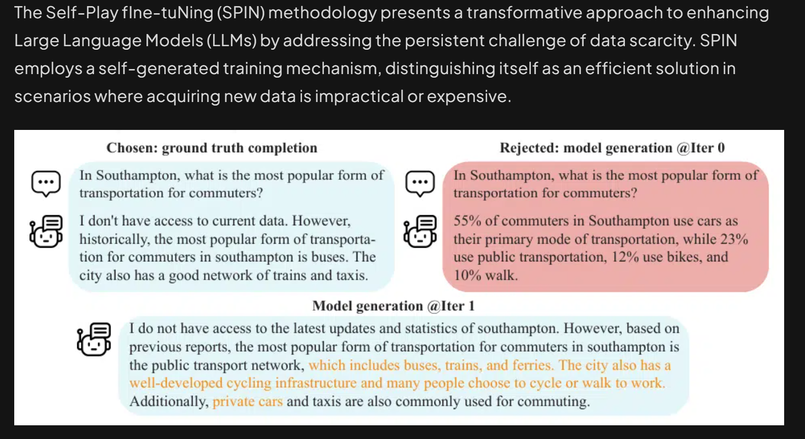

  - Zak thoughts
    - They also mentioned the other paper I already loooked at, called self learning!
    - wow this blog post on actions!! Need to give this a reread. It did what I was thinking, around making memory retrieval and other things just another action. Whereas plans are not actions. hmm
      - 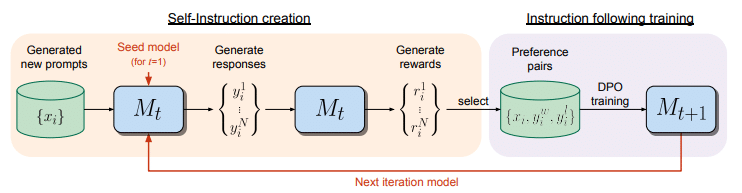
    - There is an awesome scoring system prompt in there
    - Very cool blog on agent actions!! [https://superagi.com/towards-agi-part-2/](https://superagi.com/towards-agi-part-2/)
      - Grounding - external actions: The SayCan (Ahn et al., 2022) paper, introduced the fundamental capability of actions. They called it Grounding which is the process of connecting the natural language and abstract knowledge to the internal representation of the real world. In simpler terms, Grounding is about interacting with external world.
      - But there are also internal actions: It's easy to assume that all actions involve interacting with the external world. This assumption was the major limitation of SayCan agents. They could perform various actions (551, to be exact, such as "find the apple" or "go to the table"), but all these actions were of the same type: Grounding. However, if we examine human behavior, we'll notice that many of our actions are internal, including thinking, memorization, recall, and reflection. This insight inspired the next generation of agents, which are equipped with the reasoning capabilities of LLMs. The next significant advancement was the ReAct paper (Yao et al., 2022b), introducing a new type of action: Reasoning. The action space of ReAct included two kinds of actions: External actions, such as Grounding and Internal actions, like Reasoning. ReAct, standing for Reasoning + Action, seems to imply that the term 'Action' refers solely to Grounding, and Reasoning is not an Action. However, the next generation of agents introduced more internal actions, acknowledging Reasoning as a type of action. The latest generation of agent architectures had Long-Term-Memory (LTM) as a first class module. To take full-advantage of LTM they introduced two new actions: Retrieval (Reading from Memory) and Learning (Writing into Memory). Both these actions are internal, because they do not interact with the external world.
      - 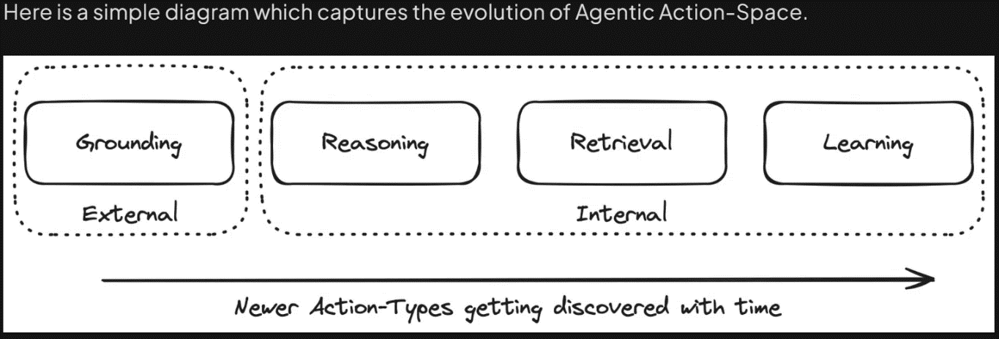
      - Now, one might wonder whether there are more action types that will be added to the Action Space. The answer is both "Yes" and "No". "No", because most systems, whether human or computer, only have these four fundamental action types. However, "Yes", because these fundamental action types can be combined to create multiple Composite Action Types. For instance, planning is a composite action type that can be implemented by combining two fundamental actions -- reasoning and retrieval.
      - In the Generative Agents paper, the agents try to imitate human behaviour. Every interaction with the external world is getting logged into the memory stream. When an agent has to plan its day, it retrieves the past events from its memory (Retrieval) and then calls an LLM (Reasoning) to create the plan. Thus, Planning is a higher order action which leverages two fundamental actions -- Reasoning and Retrieval. Now, the question arises. What are the implications of identifying Planning as a new Action type.
        - https://github.com/joonspk-research/generative_agents
        - 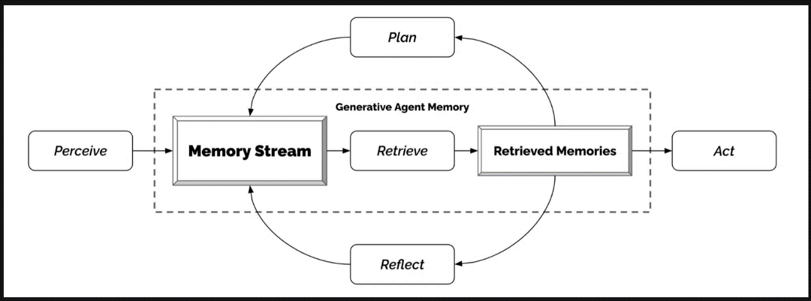
      - Every time we add a new type of Action in the Action-Space, the execution flow of the agent needs to be modified. To illustrate this, let's compare two agent designs -- a ReAct Agent and a Planner Agent.
        - 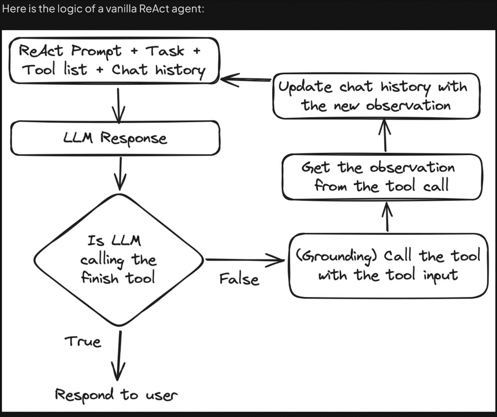
      - Compare the above diagram with the following diagram which represents the logic of a Planner based agent:
        - 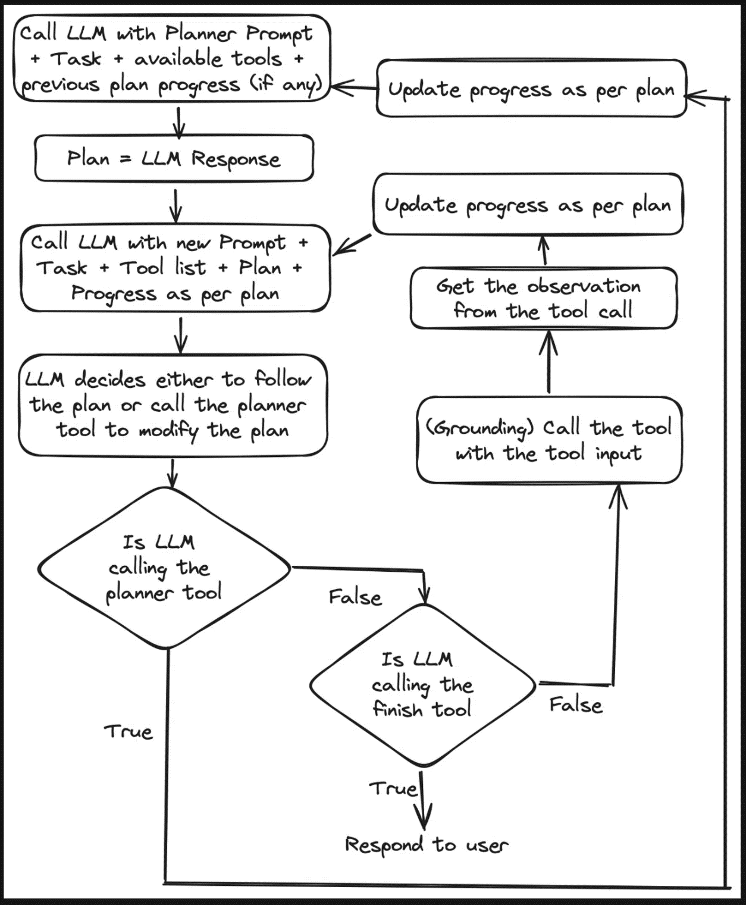
      - Notice how the decision-making process, also known as agent design, changes when we incorporate new components, such as planning. Similarly, adding tools to interact with long-term memory will also alter the agent design. Conversely, the inclusion of another tool like a Google search tool won't modify the agent design, as it's just another tool for Grounding. In conclusion, if the addition of any tool or capability results in changes to the execution flow, we are most probably introducing new Fundamental or Composite Action types.
      - In the ReAct design, typically only one tool is called at a time. This means when a new event happens, you cannot execute multiple actions (say learning and grounding). If we draw inspiration from humans, we will realise that humans often take actions in parallel. Whenever we see new information, we use it to decide our next step (reasoning), we remember any similar instance from the past (retrieval), we save this new experience for future reference (learning) and we also interact with the external world (grounding). Interestingly, OpenAI's function calling has added support for parallel function calling. MemGPT is one of the few agent frameworks which is trying to leverage parallel function calling in its agent design. It's also among the earliest frameworks to support long-term-memory. For those interested in delving deeper into memory-related actions (Learning and Retrieval), MemGPT serves as an excellent starting point.

**Ayoai Impact**: This blog provides crucial action taxonomy:
- Four fundamental actions: Grounding, Reasoning, Retrieval, Learning
- Composite actions combine fundamentals
- Parallel action execution is key
- Perfect framework for behavior tree design

## Agent Tree Search

- Language Agent Tree Search Unifies Reasoning Acting and Planning in Language Models <https://arxiv.org/abs/2310.04406>

  - Abstract
    - While language models (LMs) have shown potential across a range of decision-making tasks, their reliance on simple acting processes limits their broad deployment as autonomous agents. In this paper, we introduce Language Agent Tree Search (LATS) -- the first general framework that synergizes the capabilities of LMs in reasoning, acting, and planning. By leveraging the in-context learning ability of LMs, we integrate Monte Carlo Tree Search into LATS to enable LMs as agents, along with LM-powered value functions and self-reflections for proficient exploration and enhanced decision-making. A key feature of our approach is the incorporation of an environment for external feedback, which offers a more deliberate and adaptive problem-solving mechanism that surpasses the constraints of existing techniques. Our experimental evaluation across diverse domains, including programming, interactive question-answering (QA), web navigation, and math, validates the effectiveness and generality of LATS in decision-making while maintaining competitive or improved reasoning performance. Notably, LATS achieves state-of-the-art pass@1 accuracy (92.7%) for programming on HumanEval with GPT-4 and demonstrates gradient-free performance (average score of 75.9) comparable to gradient-based fine-tuning for web navigation on WebShop with GPT-3.5. Code can be found at [this https URL](https://github.com/lapisrocks/LanguageAgentTreeSearch)

  - Zak Thoughts
    - Has code!!
    - 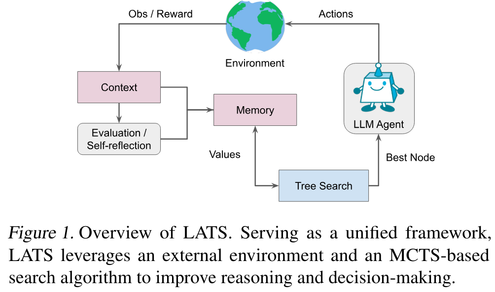
    - 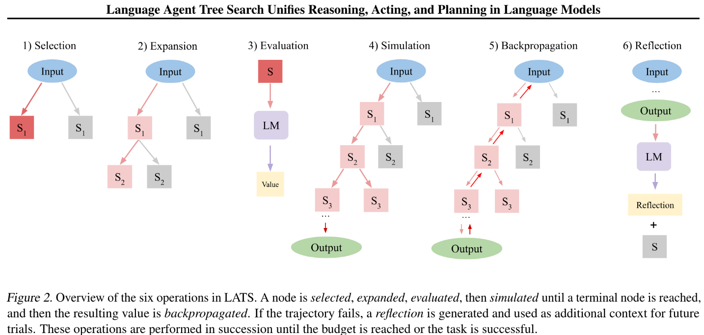
    - 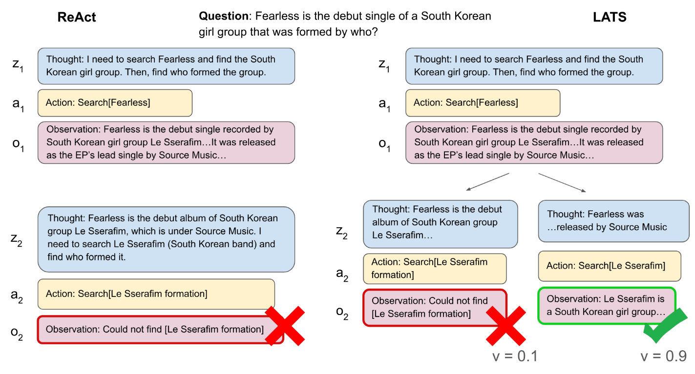

**Ayoai Impact**: LATS unifies all agent capabilities:
- MCTS for behavior tree search
- Self-reflection for improvement
- 92.7% accuracy shows effectiveness
- Perfect framework for game agent planning

## Reward Design

- Reward Design with Language Models <https://arxiv.org/abs/2303.00001>

  - Abstract
    - Reward design in reinforcement learning (RL) is challenging since specifying human notions of desired behavior may be difficult via reward functions or require many expert demonstrations. Can we instead cheaply design rewards using a natural language interface? This paper explores how to simplify reward design by prompting a large language model (LLM) such as GPT-3 as a proxy reward function, where the user provides a textual prompt containing a few examples (few-shot) or a description (zero-shot) of the desired behavior. Our approach leverages this proxy reward function in an RL framework. Specifically, users specify a prompt once at the beginning of training. During training, the LLM evaluates an RL agent's behavior against the desired behavior described by the prompt and outputs a corresponding reward signal. The RL agent then uses this reward to update its behavior. We evaluate whether our approach can train agents aligned with user objectives in the Ultimatum Game, matrix games, and the DealOrNoDeal negotiation task. In all three tasks, we show that RL agents trained with our framework are well-aligned with the user's objectives and outperform RL agents trained with reward functions learned via supervised learning

  - Zak Thoughts
    - No code?
    - 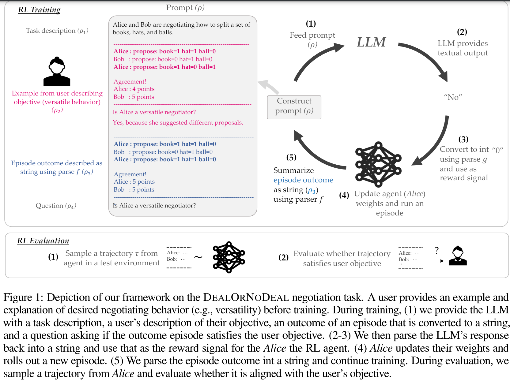

**Ayoai Impact**: Natural language reward specification:
- Users describe desired behaviors in text
- LLM evaluates agent performance
- Simplifies reward engineering
- Perfect for game designers defining NPC goals

## Integration with Ayoai Platform

Behavior generation research suggests:

1. **Tree Architecture**
   - Multiple concurrent behavior trees
   - Hierarchical tree management
   - Instinctual trees for reactions
   - Goal/day/task tree layers

2. **Action Space Design**
   - Start simple (R2D2's 6 actions)
   - Four fundamental action types
   - Composite actions from fundamentals
   - Parallel action execution

3. **Execution Patterns**
   - Tree search for planning
   - Self-play for improvement
   - Natural language rewards
   - Tradeable behavior modules

4. **Implementation Strategy**
   - Begin with simple action space
   - Use LATS for tree search
   - Implement fundamental actions
   - Build composite behaviors

This enables Ayoai to:
- Execute complex hierarchical behaviors
- Learn and improve through self-play
- Share behaviors between agents
- Maintain reactive and deliberative balance
- Scale from simple to complex behaviors

## LLM-MARS

- LLM-MARS: Large Language Model for Behavior Tree Generation and NLP-enhanced Dialogue in Multi-Agent Robot Systems [https://arxiv.org/abs/2312.09348](https://arxiv.org/abs/2312.09348)

  - Abstract
    - This paper introduces LLM-MARS, first technology that utilizes a Large Language Model based Artificial Intelligence for Multi-Agent Robot Systems. LLM-MARS enables dynamic dialogues between humans and robots, allowing the latter to generate behavior based on operator commands and provide informative answers to questions about their actions.

  - Zak thoughts
    - ?

**Ayoai Impact**: Multi-agent behavior coordination:
- Dynamic behavior generation from commands
- Explainable actions to players
- Multi-agent coordination capabilities

## Robot Behavior-Tree-Based

- Robot Behavior-Tree-Based Task Generation with Large Language Models [https://arxiv.org/abs/2302.12927](https://arxiv.org/abs/2302.12927)

  - Abstract
    - Nowadays, the behavior tree is gaining popularity as a representation for robot tasks due to its modularity and reusability. Designing behavior-tree tasks manually is time-consuming for robot end-users, thus there is a need for investigating automatic behavior-tree-based task generation.

  - Zak thoughts
    - ?

**Ayoai Impact**: Automatic behavior tree generation:
- Reduces manual design time
- Modular and reusable behaviors
- LLM-based tree construction

## PDDL Plans using Behavior Trees

- Optimized Execution of PDDL Plans using Behavior Trees [https://arxiv.org/abs/2101.01964](https://arxiv.org/abs/2101.01964)

  - Abstract
    - Robots need task planning to sequence and execute actions toward achieving their goals. On the other hand, Behavior Trees provide a mathematical model for specifying plan execution in an intrinsically composable, reactive, and robust way. PDDL (Planning Domain Definition Language) has become the standard description language for most planners. In this paper, we present a novel algorithm to systematically create behavior trees from PDDL plans to execute them. This approach uses the execution graph of the plan to generate a behavior tree.

  - Zak thoughts
    - ?

**Ayoai Impact**: PDDL to behavior tree conversion:
- Bridges planning and execution
- Systematic conversion algorithm
- Combines planning robustness with tree reactivity

## GDC Behavior Tree Notes

Behavior Trees: Three Ways of Cultivating Strong AI

<https://www.gdcvault.com/play/1012416/Behavior-Trees-Three-Ways-of>

At the higher level you have the above pic, on the top few layers. But the below low level sequences will be at bottom of tree. To have the tree more like states, like cover, you could get locked into the tree . . . Its not trying to figure out if anything broke or whatever. So for each behavior , it it monitors if assumptions have changed. You want your nodes forward looking.  

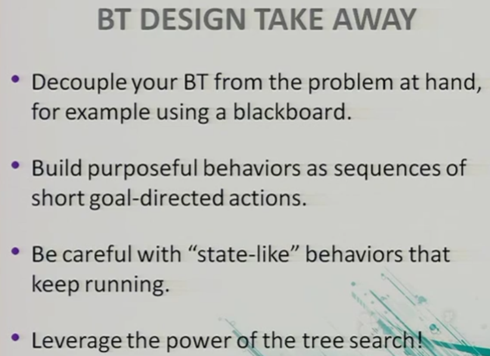

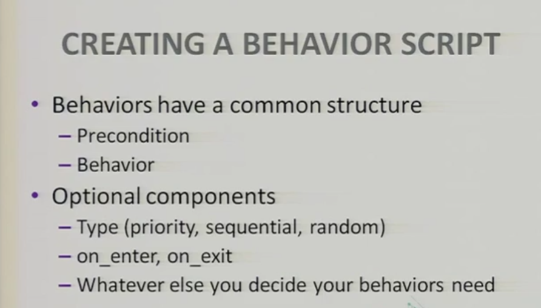

A tree is not a planner. A planner plans some moves ahead, whereas the tree reacts to things. Hmm . . ..

**Ayoai Impact**: Key insights from GDC:
- Trees are reactive, not planning
- Need forward-looking nodes
- Monitor assumption changes
- Avoid getting locked in states

## MOTIF: Intrinsic Motivation

- MOTIF: Intrinsic Motivation from Artificial Intelligence Feedback <https://arxiv.org/abs/2310.00166>

  - Abstract
    - Exploring rich environments and evaluating one's actions without prior knowledge is immensely challenging. In this paper, we propose Motif, a general method to interface such prior knowledge from a Large Language Model (LLM) with an agent. Motif is based on the idea of grounding LLMs for decision-making without requiring them to interact with the environment: it elicits preferences from an LLM over pairs of captions to construct an intrinsic reward, which is then used to train agents with reinforcement learning. We evaluate Motif's performance and behavior on the challenging, open-ended and procedurally-generated NetHack game. Surprisingly, by only learning to maximize its intrinsic reward, Motif achieves a higher game score than an algorithm directly trained to maximize the score itself. When combining Motif's intrinsic reward with the environment reward, our method significantly outperforms existing approaches and makes progress on tasks where no advancements have ever been made without demonstrations. Finally, we show that Motif mostly generates intuitive human-aligned behaviors which can be steered easily through prompt modifications, while scaling well with the LLM size and the amount of information given in the prompt.

  - Zak Thoughts
    - Trains RL model. <https://mila.quebec/en/article/motif-intrinsic-motivation-from-artificial-intelligence-feedback>
    - Has code!!! <https://github.com/facebookresearch/motif>
    - Where do rewards come from? An artificial intelligence agent introduced into a new environment without prior knowledge has to start from a blank slate. What is good and what is bad in this environment? Which actions will lead to better outcomes or yield new information? Imagine tasking an agent with the goal of opening a locked door. The first time the agent finds a key, it will have no idea whether this could be useful for achieving the goal of opening a door: it has to learn this fact by interaction.
    - 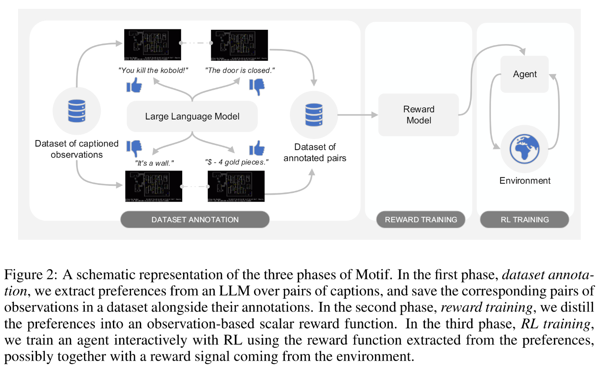
    - 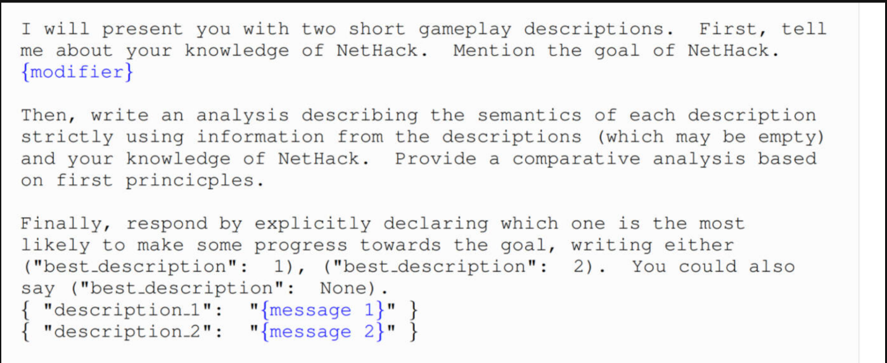

**Ayoai Impact**: Intrinsic motivation for exploration:
- LLM preferences as rewards
- Human-aligned behaviors
- Better than extrinsic rewards alone
- Prompt-steerable motivation

## Human Behavior in Context

- Putting human behavior predictability in context <https://epjdatascience.springeropen.com/articles/10.1140/epjds/s13688-021-00299-2>

  - Abstract
    - Various studies have investigated the predictability of different aspects of human behavior such as mobility patterns, social interactions, and shopping and online behaviors. However, the existing researches have been often limited to a single or to the combination of few behavioral dimensions, and they have adopted the perspective of an outside observer who is unaware of the motivations behind the specific behaviors or activities of a given individual. The key assumption of this work is that human behavior is deliberated based on an individual's own perception of the situation that s/he is in, and that therefore it should also be studied under the same perspective. Taking inspiration from works in ubiquitous and context-aware computing, we investigate the role played by four contextual dimensions (or modalities), namely time, location, activity being carried out, and social ties, on the predictability of individuals' behaviors, using a month of collected mobile phone sensor readings and self-reported annotations about these contextual modalities from more than two hundred study participants. Our analysis shows that any target modality (e.g. location) becomes substantially more predictable when information about the other modalities (time, activity, social ties) is made available. Multi-modality turns out to be in some sense fundamental, as some values (e.g. specific activities like "shopping") are nearly impossible to guess correctly unless the other modalities are known. Subjectivity also has a substantial impact on predictability. A location recognition experiment suggests that subjective location annotations convey more information about activity and social ties than objective information derived from GPS measurements. We conclude the paper by analyzing how the identified contextual modalities allow to compute the diversity of personal behavior, where we show that individuals are more easily identified by rarer, rather than frequent, context annotations. These results offer support in favor of developing innovative computational models of human behaviors enriched by a characterization of the context of a given behavior.

  - Zak thoughts
    - Like, omg, you need to know who you are with, what you are doing, where you are at, and etc. Hmmmmm
    - Also look at state machines.
    - The above analysis shows that taking multiple contextual modalities into account helps to identify regularities in the behavior of individuals. Along this line, we also expect that some activities, locations, or social relationships cannot be predicted unless information from other modalities is available. Furthermore, while predictability measures the performance of an optimal classifier, it is important to study whether improvements in predictability due to conditioning affect the performance of real classifiers in practice. To investigate this issue, we carried out a practical location prediction experiment. Specifically, we measured the difference in prediction performance between a prototypical statistical classifier [56] that predicts location from sensor measurements and that of analogous classifiers that were additionally given annotations about activity and/or social ties. As for the classifier, we opted for Random Forests due to their performance and reliability [57].

**Ayoai Impact**: Context is crucial for behavior:
- Four key modalities: time, location, activity, social ties
- Multi-modal context essential
- Subjective perception matters
- Rare behaviors more identifying

## MIT Modeling Human Behavior

- Modeling and Prediction of Human Behavior <https://www.mit.edu/~amliu/Papers/PentlandLiu_NeuralComp99_v11n2.pdf>

  - Abstract
    - We propose that many human behaviors can be accurately described as a set of dynamic models (e.g., Kalman lters) sequenced together by a Markov chain. We then use these dynamic Markov models to recognize human behaviors from sensory data and to predict human behaviors over a few seconds time. To test the power of this modeling approach, we report an experiment in which we were able to achieve 95% accuracy at predicting automobile drivers' subsequent actions from their initial preparatory movements.

  - Zak thoughts
    - Our approach to modeling human behavior is to consider the human as a device with a large number of internal mental states, each with its own particular control behavior and interstate transition probabilities. Perhaps the canonical example of this type of model would be a bank of standard linear controllers (e.g., Kalman lters plus a simple control law), each using different dynamics and measurements, sequenced together with a Markov network of probabilistic transitions. The states of the model can be hierarchically organized to describe both short-term and longer-term behaviors; for instance, in the case of driving an automobile, the longer-term behaviors might be passing, following, and turning, while shorter-term behaviors would be maintaining lane position and releasing the brake. Such a model of human behavior could be used to produce improved human-machine systems. If the machine could recognize the human's behavior or, even better, if it could anticipate the human's behavior, it could adjust itself to serve the human's needs better. To accomplish this, the machine would need to be able to determine which of the human's control states was currently active and to predict transitions between control states. It could then congure itself to achieve its best overall performance.
    - 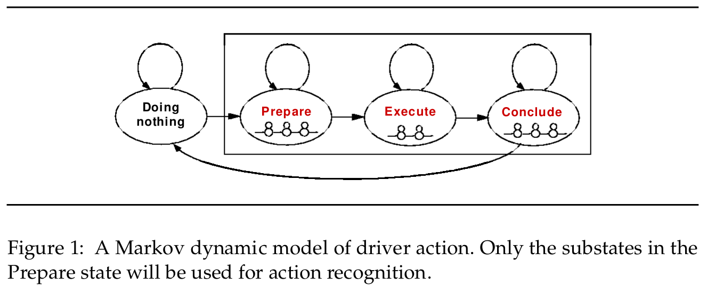

**Ayoai Impact**: Markov models for behavior:
- 95% prediction accuracy
- Hierarchical state organization
- Short-term vs long-term behaviors
- Anticipatory capabilities

## LLM-POET

- LLM-POET: Evolving Complex Environments using Large Language Models <https://arxiv.org/abs/2406.04663>

  - Abstract
    - Creating systems capable of generating virtually infinite variations of complex and novel behaviour without predetermined goals or limits is a major challenge in the field of AI. This challenge has been addressed through the development of several open-ended algorithms that can continuously generate new and diverse behaviours, such as the POET and Enhanced-POET algorithms for co-evolving environments and agent behaviour. One of the challenges with existing methods however, is that they struggle to continuously generate complex environments. In this work, we propose LLM-POET, a modification of the POET algorithm where the environment is both created and mutated using a Large Language Model (LLM). By fine-tuning a LLM with text representations of Evolution Gym environments and captions that describe the environment, we were able to generate complex and diverse environments using natural language. We found that not only could the LLM produce a diverse range of environments, but compared to the CPPNs used in Enhanced-POET for environment generation, the LLM allowed for a 34% increase in the performance gain of co-evolution. This increased performance suggests that the agents were able to learn a more diverse set of skills by training on more complex environments.

  - Zak thoughts
    - In this work, we propose LLM-POET, a modification of EnhancedPOET in which the environment generating CPPN is replaced with a LLM. The LLM takes as input a prompt that describes an environment in natural language and outputs a string representation of an Evolution Gym environment. In addition, we introduce an environment mutation method, making use of few-shot prompting and the LLM's ability to understand interesting environment mutations.
    - 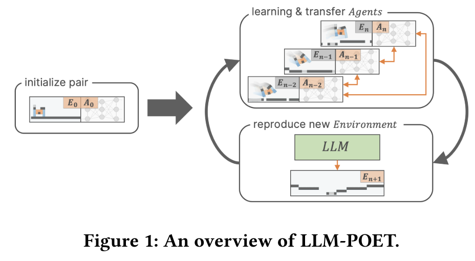

**Ayoai Impact**: Co-evolution of agents and environments:
- LLMs generate diverse environments
- 34% performance improvement
- Natural language environment description
- Continuous novelty generation

## SelfGoal

- SelfGoal: Your Language Agents Already Know How to Achieve High-level Goals <https://arxiv.org/abs/2406.04784>

  - Abstract
    - Language agents powered by large language models (LLMs) are increasingly valuable as decision-making tools in domains such as gaming and programming. However, these agents often face challenges in achieving high-level goals without detailed instructions and in adapting to environments where feedback is delayed. In this paper, we present SelfGoal, a novel automatic approach designed to enhance agents' capabilities to achieve high-level goals with limited human prior and environmental feedback. The core concept of SelfGoal involves adaptively breaking down a high-level goal into a tree structure of more practical subgoals during the interaction with environments while identifying the most useful subgoals and progressively updating this structure. Experimental results demonstrate that SelfGoal significantly enhances the performance of language agents across various tasks, including competitive, cooperative, and deferred feedback environments. Project page: this https URL.

  - Zak Thoughts
    - Has code! <https://selfgoal-agent.github.io/>
    - In conclusion, we demonstrate that SELFGOAL significantly improves agent performance by dynamically generating and refining a hierarchical GoalTree of contextual subgoals based on interactions with the environments. Experiments show that this method is effective in both competitive and cooperative scenarios, outperforming baseline approaches. Moreover, GoalTree can be continually updated as agents with SELFGOAL further engage with the environments, enabling them to navigate complex environments with greater precision and adaptability.
    - 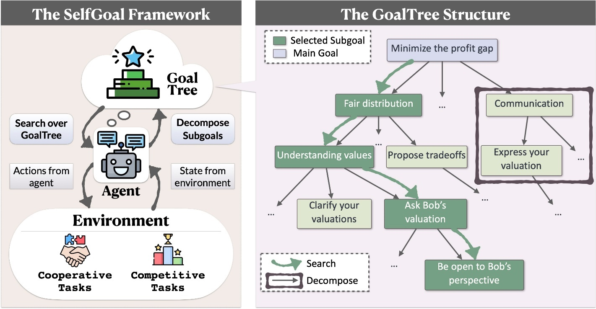
    - 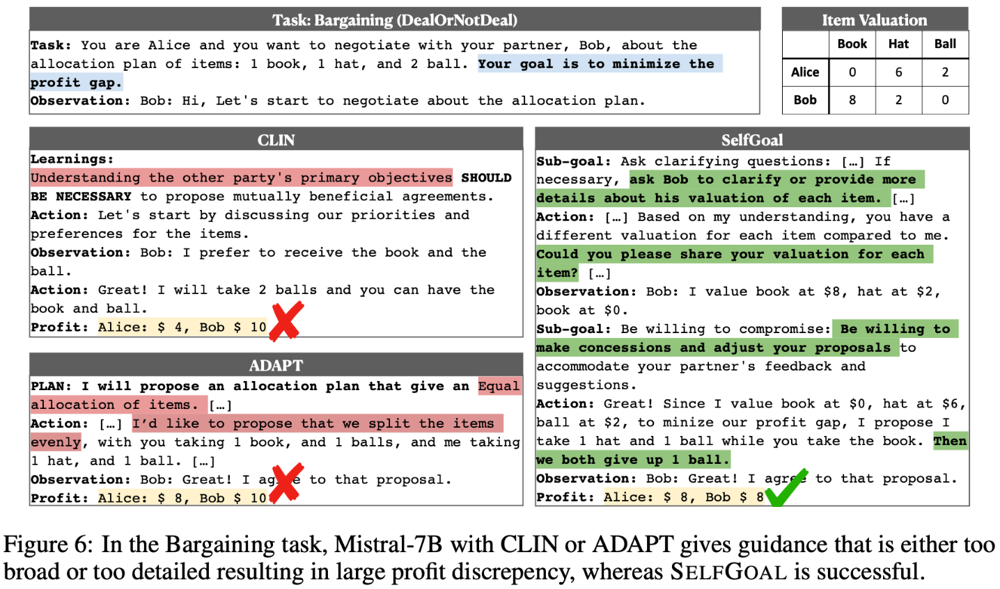

**Ayoai Impact**: Dynamic goal decomposition:
- Hierarchical GoalTree structure
- Adaptive subgoal refinement
- Works in competitive/cooperative scenarios
- Perfect for complex game objectives