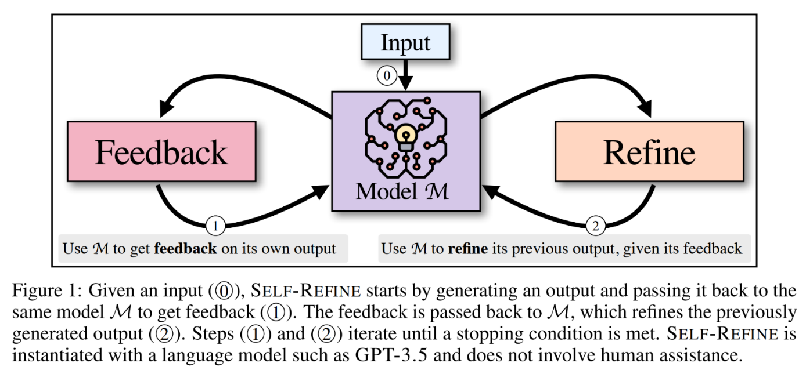
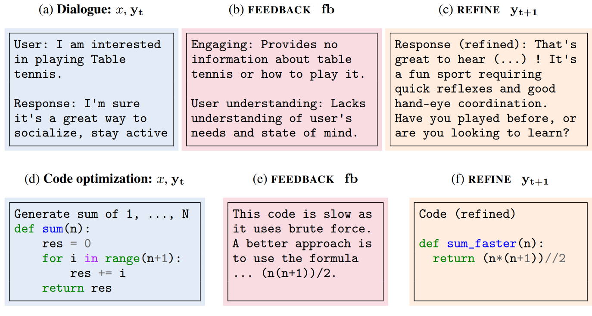
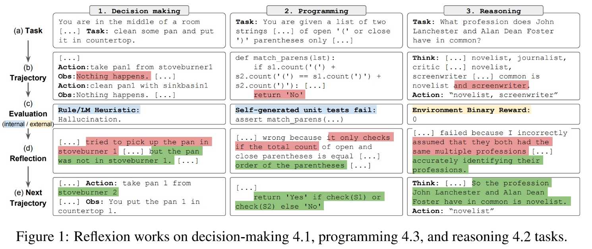
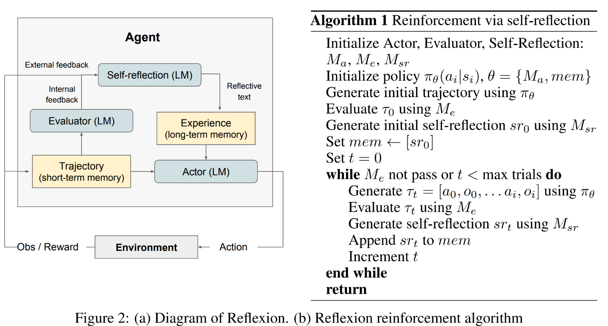
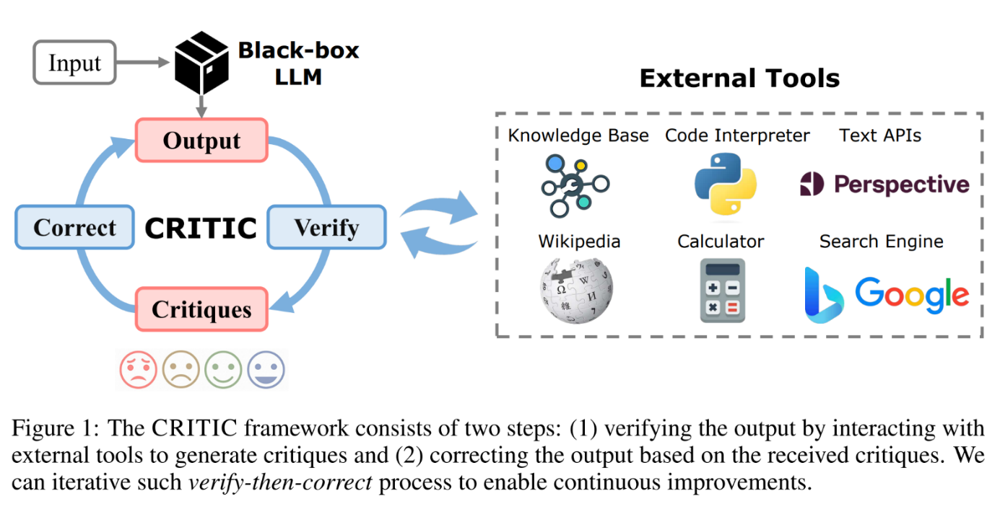
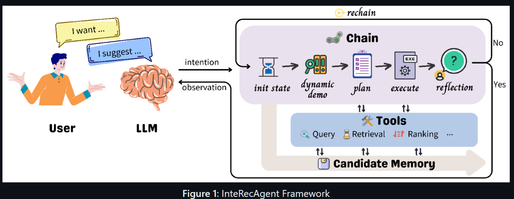
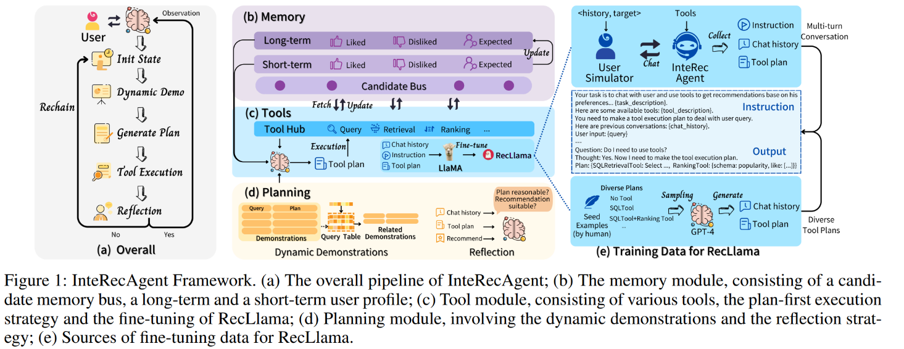
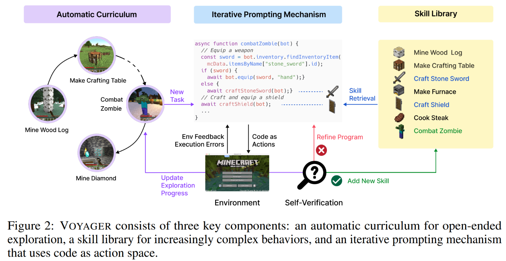
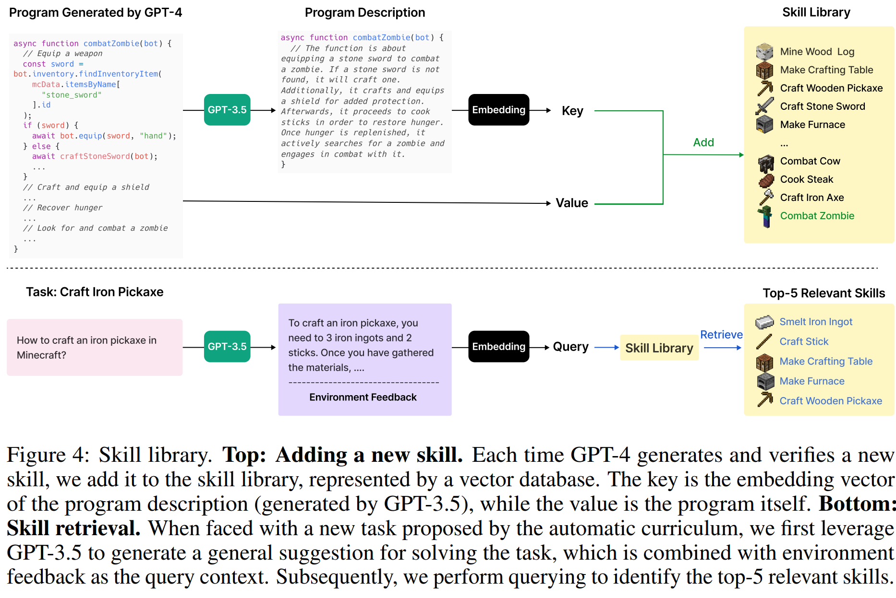
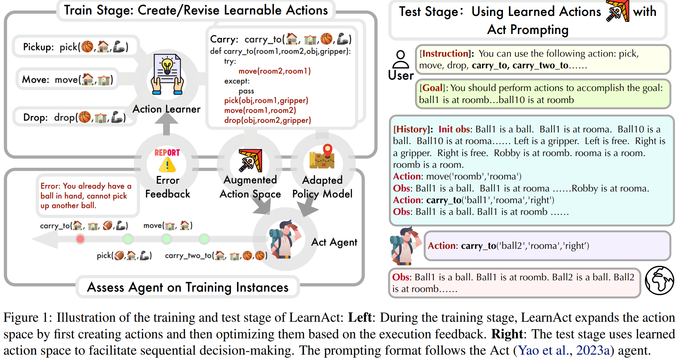

# Reflection and Refinement

Encourages LLM to reflect on failures and then refine the plan.

## Overall Notes

- Thoughts on this method from this planning survey:
  - Reflection and refinement are indispensable components in the planning process. They enhance the fault tolerance and error correction capabilities of LLM-Agent planning.

  - Due to existing hallucination issues and insufficient reasoning abilities for complex problems, LLM-Agents may make errors and get stuck in "thought loops" during planning due to limited feedback. Reflecting on and summarizing failures helps agents correct errors and break out of such loops in subsequent attempts.

  - Particularly, the self-reflective strategy bears resemblance to the principles of reinforcement learning, where the agent plays the role of the decision-maker, such as the policy network. Environmental feedback triggers updates of the policy network. However, in contrast to deep reinforcement learning where updates are achieved by modifying model parameters, in the LLM agent, this update occurs through selfreflection by the LLM itself, culminating in textual verbal feedbacks. These textual feedbacks can serve as both longterm and short-term memory, influencing the agent's subsequent planning outputs through the prompts.

  - Nevertheless, the convergence of this textual form of update currently lacks a guaranteed proof, indicating the inability to demonstrate that continual reflection can ultimately lead the LLM agent to a specified goal.

  - The performance increases with the expenses.

  - Reflection plays a crucial role in improving the success rate, especially for complex tasks. Despite Reflexion consuming about twice the tokens compared with ReAct (task decompensation), the improvements in complicated tasks are promising (shows that LLM possesses the error-correcting capability).

- Zak thoughts on this method
  - Is this the area where I would want to summarize past experiences by antecedent, consequence, behavior model?

  - Is it here that we adopt the summarize and forget.

  - Definitely need to do this

  - There are some great prompts scattered all across these reflection papers - be sure to utilize. Voyager has some good ones, and so do the others.

  - Do multiple layers to recap history again in same spots of tree. Also run process to look for equal trees, connect them, and see if the other had positive outcome on the future. Hmm. So the npc must give feedback logic. Like, you have what you predicted, then you have what actually happened. It should update immediately.

  - Jen idea... people go 360 with behavior. Meaning. They may start with doing something, then change to something else because of bad consequences, then ultimately go back to the original thing. Hhhmmm! They went 360. When this happens, we should keep track of it. When we go 360. It's like there is now an extra layer/filter, that knows not to do that 360 again.

**Ayoai Impact**: Reflection is crucial for adaptive agent behavior:
- Error correction without retraining
- Breaking out of behavioral loops
- Learning from consequences
- 360-degree behavior tracking
- Textual feedback as memory

## Self-refine

- Self-refine [Madaan et al., 2023] [https://arxiv.org/abs/2303.17651](https://arxiv.org/abs/2303.17651) (found from: Planning-of-LLM-Agents)

  - Abstract
    - Like humans, large language models (LLMs) do not always generate the best output on their first try. Motivated by how humans refine their written text, we introduce Self-Refine, an approach for improving initial outputs from LLMs through iterative feedback and refinement. The main idea is to generate an initial output using an LLMs; then, the same LLMs provides feedback for its output and uses it to refine itself, iteratively. Self-Refine does not require any supervised training data, additional training, or reinforcement learning, and instead uses a single LLM as the generator, refiner, and feedback provider. We evaluate Self-Refine across 7 diverse tasks, ranging from dialog response generation to mathematical reasoning, using state-of-the-art (GPT-3.5, ChatGPT, and GPT-4) LLMs. Across all evaluated tasks, outputs generated with Self-Refine are preferred by humans and automatic metrics over those generated with the same LLM using conventional one-step generation, improving by ~20% absolute on average in task performance. Our work demonstrates that even state-of-the-art LLMs like GPT-4 can be further improved at test time using our simple, standalone approach.

  - Descriptions from this planning survey:
    - Utilizes an iterative process of generation, feedback, and refinement. After each generation, LLM generates feedback for the plan, facilitating adjustments based on the feedback.

  - Zak thoughts
    - Has code!!! [https://github.com/madaan/self-refine](https://github.com/madaan/self-refine)
    - 

**Ayoai Impact**: Self-refine enables iterative improvement:
- No additional training required
- 20% average performance improvement
- Single LLM for all roles
- Perfect for runtime behavior refinement

## Reflexion

- Reflexion [Shinn et al., 2023] [https://arxiv.org/abs/2303.11366](https://arxiv.org/abs/2303.11366) (found from: Planning-of-LLM-Agents)

  - Abstract
    - Large language models (LLMs) have been increasingly used to interact with external environments (e.g., games, compilers, APIs) as goal-driven agents. However, it remains challenging for these language agents to quickly and efficiently learn from trial-and-error as traditional reinforcement learning methods require extensive training samples and expensive model fine-tuning. We propose Reflexion, a novel framework to reinforce language agents not by updating weights, but instead through linguistic feedback. Concretely, Reflexion agents verbally reflect on task feedback signals, then maintain their own reflective text in an episodic memory buffer to induce better decision-making in subsequent trials. Reflexion is flexible enough to incorporate various types (scalar values or free-form language) and sources (external or internally simulated) of feedback signals, and obtains significant improvements over a baseline agent across diverse tasks (sequential decision-making, coding, language reasoning). For example, Reflexion achieves a 91% pass@1 accuracy on the HumanEval coding benchmark, surpassing the previous state-of-the-art GPT-4 that achieves 80%. We also conduct ablation and analysis studies using different feedback signals, feedback incorporation methods, and agent types, and provide insights into how they affect performance.

  - Descriptions from this planning survey:
    - Extends ReAct by incorporating an evaluator to assess trajectories. LLM generates self-reflections upon error detection, aiding in error correction.

  - Zak thoughts
    - Has code!!! [https://github.com/noahshinn/reflexion](https://github.com/noahshinn/reflexion)
      - This looks like really good code, no install, a couple agents to play with. It looks like it gives you the reflection part and the history part - good amount of code to use?!? . . .
    - Reflexion has several advantages compared to more traditional RL approaches like policy or valuebased learning: 1) it is lightweight and doesn't require finetuning the LLM, 2) it allows for more nuanced forms of feedback (e.g. targeted changes in actions), compared to scalar or vector rewards that are challenging to perform accurate credit assignment with, 3) it allows for a more explicit and interpretable form of episodic memory over prior experiences, and 4) it provides more explicit hints for actions in future episodes. At the same time, it does have the disadvantages of relying on the power of the LLM's self-evaluation capabilities (or heuristics) and not having a formal guarantee for success. However, as LLM capabilities improve, we only expect this paradigm to get better over time
    - 
    - 

**Ayoai Impact**: Reflexion is perfect for game agents:
- Linguistic feedback instead of weight updates
- Episodic memory buffer for experiences
- 91% vs 80% shows massive improvement
- Lightweight - no fine-tuning needed
- Interpretable memory for debugging

## CRITIC

- CRITIC [Gou et al., 2023] [https://arxiv.org/abs/2305.11738](https://arxiv.org/abs/2305.11738) (found from: Planning-of-LLM-Agents)

  - Abstract
    - Recent developments in large language models (LLMs) have been impressive. However, these models sometimes show inconsistencies and problematic behavior, such as hallucinating facts, generating flawed code, or creating offensive and toxic content. Unlike these models, humans typically utilize external tools to cross-check and refine their initial content, like using a search engine for fact-checking, or a code interpreter for debugging. Inspired by this observation, we introduce a framework called CRITIC that allows LLMs, which are essentially "black boxes" to validate and progressively amend their own outputs in a manner similar to human interaction with tools. More specifically, starting with an initial output, CRITIC interacts with appropriate tools to evaluate certain aspects of the text, and then revises the output based on the feedback obtained during this validation process. Comprehensive evaluations involving free-form question answering, mathematical program synthesis, and toxicity reduction demonstrate that CRITIC consistently enhances the performance of LLMs. Meanwhile, our research highlights the crucial importance of external feedback in promoting the ongoing self-improvement of LLMs.

  - Descriptions from this planning survey:
    - Uses external tools like Knowledge Bases and Search Engines to validate LLM-generated actions. It then leverages external knowledge for self-correction, significantly reducing factual errors.

  - Zak thoughts
    - Has code!!! [https://github.com/microsoft/ProphetNet/tree/master/CRITIC](https://github.com/microsoft/ProphetNet/tree/master/CRITIC)
      - Wow this code looks clean. Hmm, can a critic and a Reflexion merge?
    - How to verify though? They use external tools, not sure I want to rely on that. . .
    - 

**Ayoai Impact**: CRITIC provides external validation:
- Tool-based verification of agent actions
- Could use game physics/rules as validator
- Reduces hallucinated behaviors
- Clean implementation available

## InteRecAgent

- InteRecAgent [Huang et al., 2023b] [https://arxiv.org/abs/2308.16505](https://arxiv.org/abs/2308.16505) (found from: Planning-of-LLM-Agents)

  - Abstract
    - Recommender models excel at providing domain-specific item recommendations by leveraging extensive user behavior data. Despite their ability to act as lightweight domain experts, they struggle to perform versatile tasks such as providing explanations and engaging in conversations. On the other hand, large language models (LLMs) represent a significant step towards artificial general intelligence, showcasing remarkable capabilities in instruction comprehension, commonsense reasoning, and human interaction. However, LLMs lack the knowledge of domain-specific item catalogs and behavioral patterns, particularly in areas that diverge from general world knowledge, such as online e-commerce. Finetuning LLMs for each domain is neither economic nor efficient. In this paper, we bridge the gap between recommender models and LLMs, combining their respective strengths to create a versatile and interactive recommender system. We introduce an efficient framework called \textbf{InteRecAgent}, which employs LLMs as the brain and recommender models as tools. We first outline a minimal set of essential tools required to transform LLMs into InteRecAgent. We then propose an efficient workflow within InteRecAgent for task execution, incorporating key components such as memory components, dynamic demonstration-augmented task planning, and reflection. InteRecAgent enables traditional recommender systems, such as those ID-based matrix factorization models, to become interactive systems with a natural language interface through the integration of LLMs. Experimental results on several public datasets show that InteRecAgent achieves satisfying performance as a conversational recommender system, outperforming general-purpose LLMs. The source code of InteRecAgent is released at [this https URL](https://aka.ms/recagent).

  - Descriptions from this planning survey:
    - Employs a mechanism called ReChain for self-correction. An LLM is used to evaluate the response and tool-using plan generated by the interactive recommendation agent, summarize feedback on errors, and decide whether to restart planning.

  - Zak thoughts
    - Has code!!! [https://github.com/microsoft/RecAI](https://github.com/microsoft/RecAI)
      - There are some really cool prompts in here and in the paper appendix.
    - The comprehensive framework of InteRecAgent is depicted in Figure 1. Fundamentally, LLMs function as the brain, while recommendation models serve as tools that supply domain-specific knowledge. Users engage with an LLM using natural language. The LLM interprets users' intentions and determines whether the current conversation necessitates the assistance of tools. For instance, in a casual chitchat, the LLM will respond based on its own knowledge; whereas for in-domain recommendations, the LLM initiates a chain of tool calls and subsequently generates a response by observing the execution results of the tools. Consequently, the quality of recommendations relies heavily on the tools, making the composition of tools a critical factor in overall performance. To ensure seamless communication between users and InteRecAgent, covering both casual conversation and item recommendations, we propose a minimum set of tools that encompass the following aspects:
    - 
    - 

**Ayoai Impact**: InteRecAgent shows LLM-as-brain pattern:
- LLMs orchestrate specialized tools
- ReChain mechanism for self-correction
- Aligns with Ayoai's perception verticles
- Natural language interface for complex systems

## LEMA

- LEMA [An et al., 2023] [https://arxiv.org/abs/2310.20689](https://arxiv.org/abs/2310.20689) (found from: Planning-of-LLM-Agents)

  - Abstract
    - Large language models (LLMs) recently exhibited remarkable reasoning capabilities on solving math problems. To further improve their reasoning capabilities, this work explores whether LLMs can LEarn from MistAkes (LEMA), akin to the human learning process. Consider a human student who failed to solve a math problem, he will learn from what mistake he has made and how to correct it. Mimicking this error-driven learning process, LEMA incorporates mistake-correction data pairs during fine-tuning LLMs. Specifically, we first collect inaccurate reasoning paths from various LLMs, and then employ GPT-4 as a "corrector" to identify the mistake step, explain the reason for the mistake, correct the mistake and generate the final answer. In addition, we apply a correction-centric evolution strategy that effectively expands the question set for generating correction data. Experiments across various LLMs and reasoning tasks show that \textsc{LeMa} consistently improves CoT-alone fine-tuning. Our further analysis sheds light on the non-homogeneous effectiveness between CoT data and correction data, and the contribution from different correction information. These results suggest a significant potential for LLMs to improve through learning from their mistakes. Our code and models are publicly available at [this https URL](https://github.com/microsoft/LEMA).

  - Descriptions from this planning survey:
    - Gathers mistaken planning samples first and employs more powerful GPT-4 for correction. Those corrected samples are then used to fine-tune the LLM-Agent, resulting in significant performance improvements across various scales of the LLaMA model.

  - Zak thoughts
    - Has code!!! [https://github.com/microsoft/LEMA](https://github.com/microsoft/LEMA)
      - Good prompts too
    - It has a fined tuned model, but I am not sure I want that. Else it does not work.

**Ayoai Impact**: LEMA demonstrates learning from mistakes:
- Error-driven learning like humans
- GPT-4 as corrector for mistakes
- Could collect failed NPC behaviors for improvement
- Requires fine-tuning (may not be practical)

## Voyager

- Voyager [Wang et al., 2023] [https://arxiv.org/abs/2305.16291](https://arxiv.org/abs/2305.16291) (found from twitter)

  - Abstract
    - We introduce Voyager, the first LLM-powered embodied lifelong learning agent in Minecraft that continuously explores the world, acquires diverse skills, and makes novel discoveries without human intervention. Voyager consists of three key components: 1) an automatic curriculum that maximizes exploration, 2) an ever-growing skill library of executable code for storing and retrieving complex behaviors, and 3) a new iterative prompting mechanism that incorporates environment feedback, execution errors, and self-verification for program improvement. Voyager interacts with GPT-4 via blackbox queries, which bypasses the need for model parameter fine-tuning. The skills developed by Voyager are temporally extended, interpretable, and compositional, which compounds the agent's abilities rapidly and alleviates catastrophic forgetting. Empirically, Voyager shows strong in-context lifelong learning capability and exhibits exceptional proficiency in playing Minecraft. It obtains 3.3x more unique items, travels 2.3x longer distances, and unlocks key tech tree milestones up to 15.3x faster than prior SOTA. Voyager is able to utilize the learned skill library in a new Minecraft world to solve novel tasks from scratch, while other techniques struggle to generalize. We open-source our full codebase and prompts at [this https URL](https://voyager.minedojo.org/).

  - Description
    - Voyager consists of three key components: 1) an automatic curriculum that maximizes exploration, 2) an ever-growing skill library of executable code for storing and retrieving complex behaviors, and 3) a new iterative prompting mechanism that incorporates environment feedback, execution errors, and self-verification for program improvement.

  - Zak thoughts
    - Here is a Ted talk from the guy who made voyager!! He explains it well. [https://twitter.com/DrJimFan/status/1749484835369050392?s=19](https://twitter.com/DrJimFan/status/1749484835369050392?s=19)
    - Here is chroma, they said voyager used it for memory retrieval. What is chroma? [https://twitter.com/jasonjoyride/status/1748793393214640453?s=19](https://twitter.com/jasonjoyride/status/1748793393214640453?s=19)
    - Has code!!! [https://github.com/MineDojo/Voyager](https://github.com/MineDojo/Voyager)
    - The input prompt to GPT-4 consists of several components: (1) Directives encouraging diverse behaviors and imposing constraints, such as "My ultimate goal is to discover as many diverse things as possible ... The next task should not be too hard since I may not have the necessary resources or have learned enough skills to complete it yet."; (2) The agent's current state, including inventory, equipment, nearby blocks and entities, biome, time, health and hunger bars, and position; (3) Previously completed and failed tasks, reflecting the agent's current exploration progress and capabilities frontier; (4) Additional context: We also leverage GPT-3.5 to self-ask questions based on the agent's current state and exploration progress and self-answer questions. We opt to use GPT-3.5 instead of GPT-4 for standard NLP tasks due to budgetary considerations.
    - 
    - 
    - Interesting prompts
      - The input prompt to GPT-4 consists of several components: (1) Directives encouraging diverse behaviors and imposing constraints (so that the proposed task is achievable and verifiable): See Sec. A.3.4 for the full prompt; (2) The agent's current state: • Inventory: A dictionary of items with counts, for example, {'cobblestone': 4, 'furnace': 1, 'stone_pickaxe': 1, 'oak_planks': 7, 'dirt': 6, 'wooden_pickaxe': 1, 'crafting_table': 1, 'raw_iron': 4, 'coal': 1}; • Equipment: Armors or weapons equipped by the agents; • Nearby blocks: A set of block names within a 32-block distance to the agent, for example, 'dirt', 'water', 'spruce_planks', 'grass_block', 'dirt_path', 'sugar_cane', 'fern'; • Other blocks that are recently seen: Blocks that are not nearby or in the inventory; • Nearby entities: A set of entity names within a 32-block distance to the agent, for example, 'pig', 'cat', 'villager', 'zombie'; • A list of chests that are seen by the agent: Chests are external containers where the agent can deposit items. If a chest is not opened before, its content is "Unknown". Otherwise, the items inside each chest are shown to the agent. • Biome: For example, 'plains', 'flower_forest', 'meadow', 'river', 'beach', 'forest', 'snowy_slopes', 'frozen_peaks', 'old_growth_birch_forest', 'ocean', 'sunflower_plains', 'stony_shore'; • Time: One of 'sunrise', 'day', 'noon', 'sunset', 'night', 'midnight'; • Health and hunger bars: The max value is 20; • Position: 3D coordinate (x, y, z) of the agent's position in the Minecraft world; (3) Previously completed and failed tasks; (4) Additional context: See Sec. A.3.2; (5) Chain-of-thought prompting [46] in response: We request GPT-4 to first reason about the current progress and then suggest the next task.
      - Many other awesome prompts I need to take from here. Probably some of the best prompts.

**Ayoai Impact**: Voyager is the gold standard for game agents:
- Lifelong learning without fine-tuning
- Skill library (maps to behavior trees)
- Automatic curriculum generation
- 3.3x-15.3x performance improvements
- Perfect model for Roblox agents
- Excellent prompt engineering examples

## Action Learning

- New new!! Empowering Large Language Model Agents through Action Learning.. New [https://arxiv.org/abs/2402.15809](https://arxiv.org/abs/2402.15809)

  - Abstract
    - Large Language Model (LLM) Agents have recently garnered increasing interest yet they are limited in their ability to learn from trial and error, a key element of intelligent behavior. In this work, we argue that the capacity to learn new actions from experience is fundamental to the advancement of learning in LLM agents. While humans naturally expand their action spaces and develop skills through experiential learning, LLM agents typically operate within fixed action spaces, limiting their potential for growth. To address these challenges, our study explores open-action learning for language agents. We introduce a framework LearnAct with an iterative learning strategy to create and improve actions in the form of Python functions. In each iteration, LLM revises and updates the currently available actions based on the errors identified in unsuccessful training tasks, thereby enhancing action effectiveness. Our experimental evaluations across Robotic Planning and Alfworld environments reveal that after learning on a few training task instances, our approach to open-action learning markedly improves agent performance for the type of task (by 32 percent in AlfWorld compared to ReAct+Reflexion, for instance) highlighting the importance of experiential action learning in the development of more intelligent LLM agents.

  - Zak thoughts
    - No code.
    - 

**Ayoai Impact**: Action learning expands capabilities:
- Agents learn new actions from experience
- 32% improvement over ReAct+Reflexion
- Python functions as actions (translatable to Lua)
- Open action spaces for growth

## Additional Research

### Generative Expressive Behaviors
- Generative Expressive Robot Behaviors using Large Language Models - [https://arxiv.org/abs/2401.14673](https://arxiv.org/abs/2401.14673)
  - Expressive behaviors for communication
  - Chain-of-thought for motion generation
  - Perfect for NPC animations/emotes

### ArCHer
- ArCHer: Training Language Model Agents via Hierarchical Multi-Turn RL [https://arxiv.org/abs/2402.19446](https://arxiv.org/abs/2402.19446)
  - Hierarchical RL for multi-turn interactions
  - 100x sample efficiency improvement
  - Critical for dialogue-heavy NPCs

### KnowAgent
- KnowAgent: Knowledge-Augmented Planning for LLM-Based Agents [https://arxiv.org/abs/2403.03101](https://arxiv.org/abs/2403.03101)
  - Has code!!! [https://github.com/zjunlp/KnowAgent](https://github.com/zjunlp/KnowAgent)
  - Action knowledge base
  - Mitigates planning hallucinations
  - Excellent prompts for implementation

## Summary for Ayoai Implementation

Reflection and refinement research suggests:

1. **Core Mechanisms**
   - Self-refine: Iterative improvement
   - Reflexion: Linguistic feedback
   - CRITIC: External validation
   - Voyager: Skill library growth

2. **Memory Patterns**
   - Episodic buffers for experiences
   - Error-driven learning
   - 360-degree behavior tracking
   - Skill composition

3. **Implementation Strategy**
   - Start with Reflexion for lightweight reflection
   - Add Voyager-style skill library
   - Use CRITIC pattern for physics validation
   - Track behavioral loops

This enables Ayoai agents to:
- Learn from mistakes without retraining
- Break out of behavioral loops
- Develop new skills over time
- Maintain interpretable memory
- Achieve 20-90% performance improvements