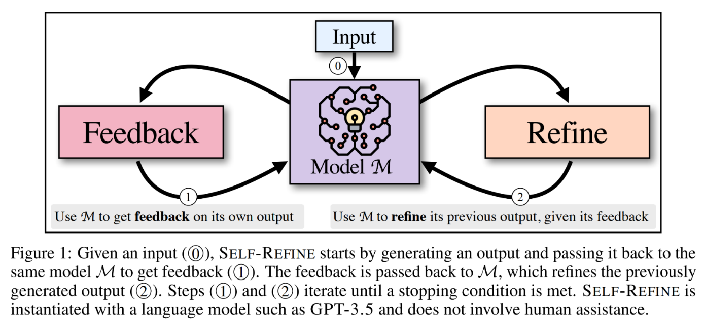
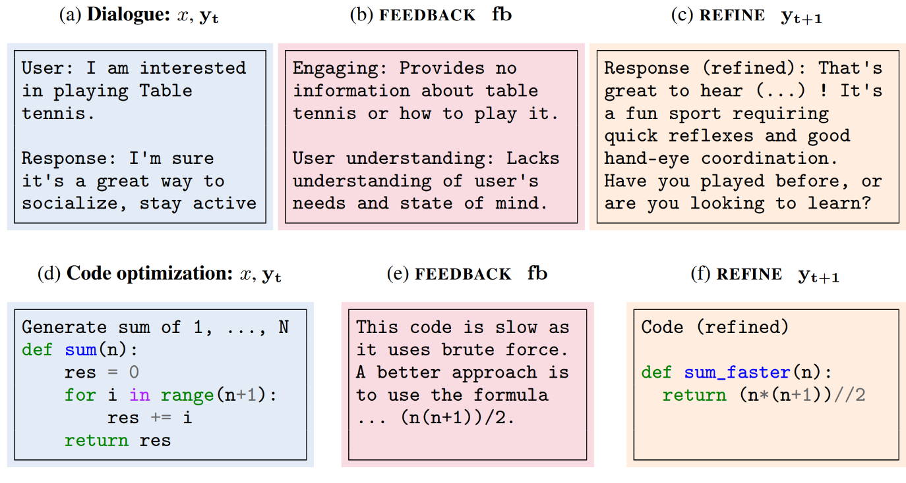
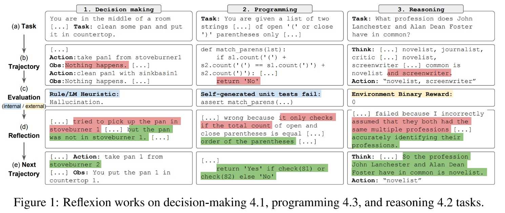
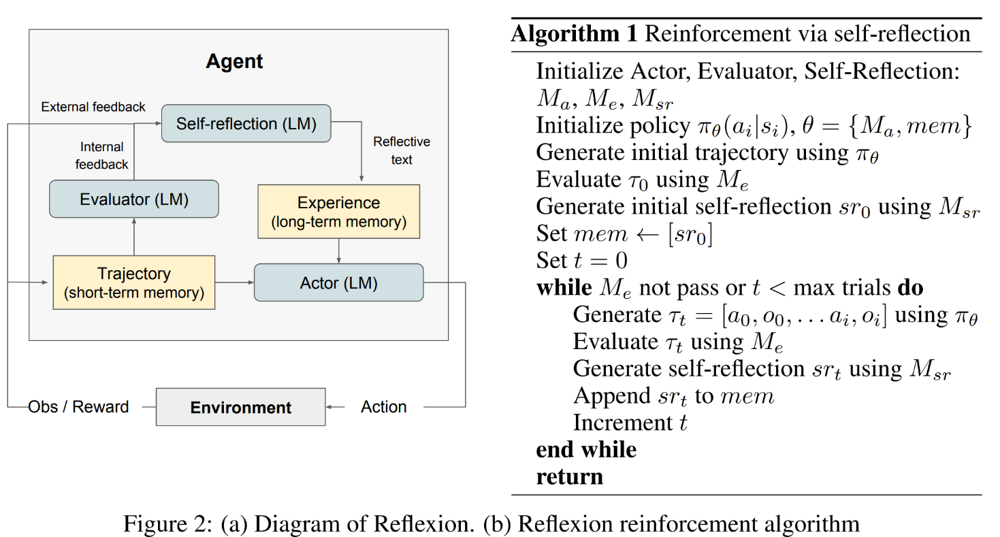
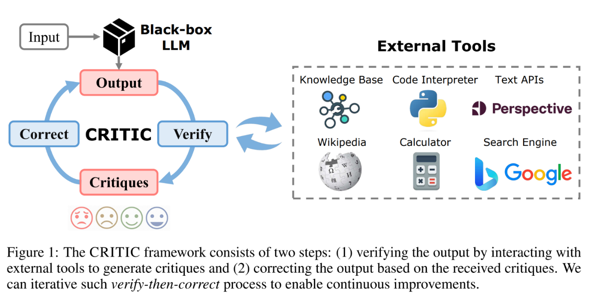
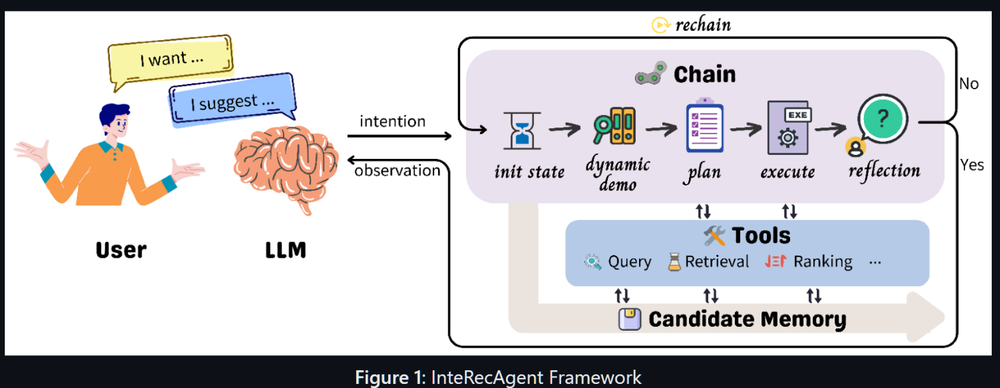
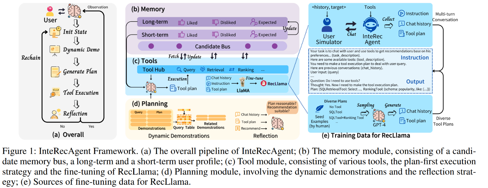
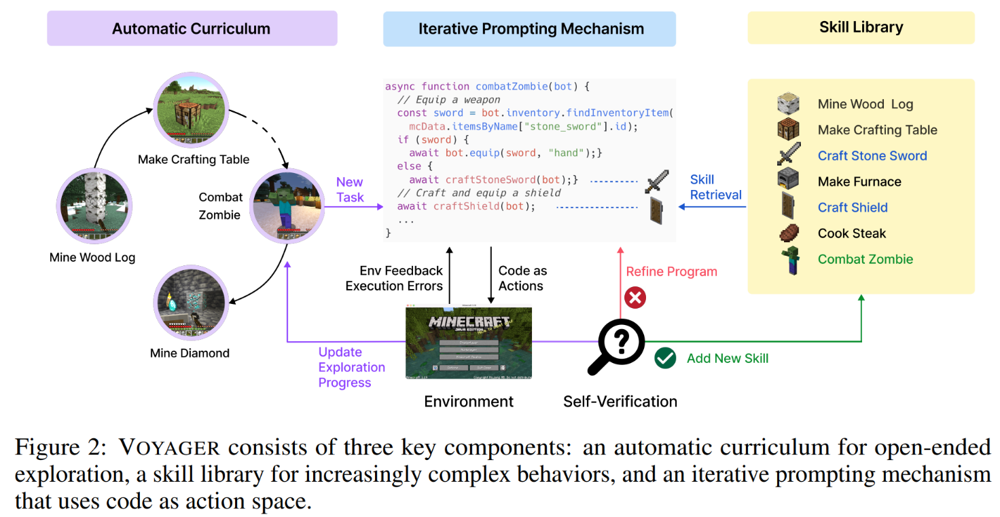
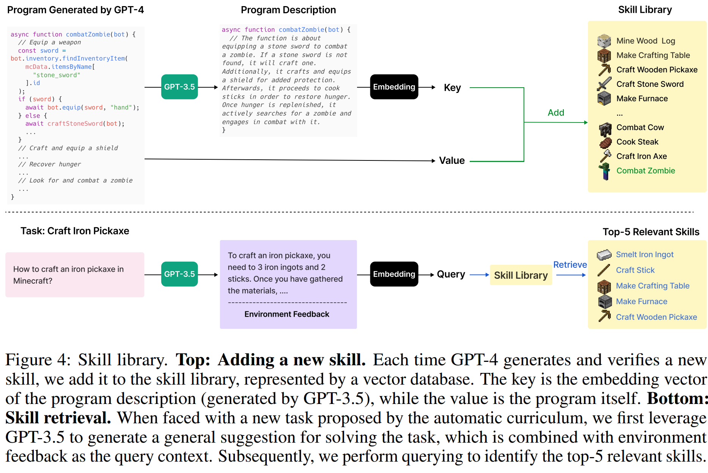
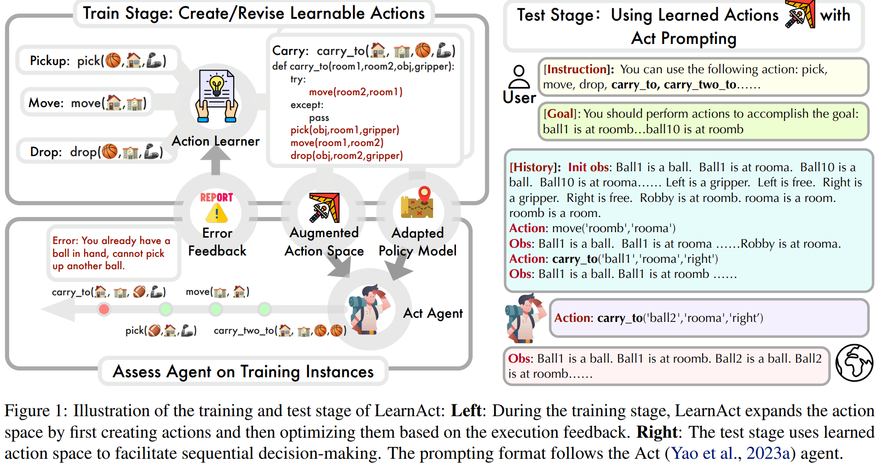

# Reflection and Refinement

Encourages LLM to reflect on failures and then refine the plan.

## Core Principles

### Theoretical Foundation

**Key Capabilities**:
- Reflection and refinement enhance fault tolerance and error correction in LLM-Agent planning
- Helps agents break out of "thought loops" caused by limited feedback
- Improves success rates especially for complex tasks

**Mechanism Design**:
- Self-reflective strategy parallels reinforcement learning principles
- Environmental feedback triggers policy updates through textual feedback
- Textual feedback serves as both long-term and short-term memory
- Updates occur through self-reflection rather than parameter modification

**Limitations**:
- Convergence lacks guaranteed proof
- Higher token consumption (approximately 2x compared to ReAct)
- Performance improvements come with increased computational costs

### Implementation Strategies

**Antecedent-Behavior-Consequence (ABC) Model**:
- Summarize experiences using ABC framework
- Track predictions versus actual outcomes
- Enable immediate feedback incorporation

**Multi-Layer History Processing**:
- Implement recursive history recapping at tree nodes
- Identify and connect similar behavioral patterns
- Analyze outcomes of parallel branches

**360-Degree Behavior Tracking**:
- Monitor when agents return to previously abandoned behaviors
- Create meta-layer filters to prevent repetitive cycles
- Track full behavioral loops for pattern recognition

**Ayoai Impact**: Reflection is crucial for adaptive agent behavior:
- Error correction without retraining
- Breaking out of behavioral loops
- Learning from consequences
- 360-degree behavior tracking
- Textual feedback as memory

## Self-refine

- Self-refine [Madaan et al., 2023] [https://arxiv.org/abs/2303.17651](https://arxiv.org/abs/2303.17651) (found from: Planning-of-LLM-Agents)

  - Abstract
    - Like humans, large language models (LLMs) do not always generate the best output on their first try. Motivated by how humans refine their written text, we introduce Self-Refine, an approach for improving initial outputs from LLMs through iterative feedback and refinement. The main idea is to generate an initial output using an LLMs; then, the same LLMs provides feedback for its output and uses it to refine itself, iteratively. Self-Refine does not require any supervised training data, additional training, or reinforcement learning, and instead uses a single LLM as the generator, refiner, and feedback provider. We evaluate Self-Refine across 7 diverse tasks, ranging from dialog response generation to mathematical reasoning, using state-of-the-art (GPT-3.5, ChatGPT, and GPT-4) LLMs. Across all evaluated tasks, outputs generated with Self-Refine are preferred by humans and automatic metrics over those generated with the same LLM using conventional one-step generation, improving by ~20% absolute on average in task performance. Our work demonstrates that even state-of-the-art LLMs like GPT-4 can be further improved at test time using our simple, standalone approach.

  - Descriptions from this planning survey:
    - Utilizes an iterative process of generation, feedback, and refinement. After each generation, LLM generates feedback for the plan, facilitating adjustments based on the feedback.

### Implementation Resources

**Code Repository**: [https://github.com/madaan/self-refine](https://github.com/madaan/self-refine)

**Ayoai Impact**: Self-refine enables iterative improvement:
- No additional training required
- 20% average performance improvement
- Single LLM for all roles
- Perfect for runtime behavior refinement

## Reflexion

- Reflexion [Shinn et al., 2023] [https://arxiv.org/abs/2303.11366](https://arxiv.org/abs/2303.11366) (found from: Planning-of-LLM-Agents)

  - Abstract
    - Large language models (LLMs) have been increasingly used to interact with external environments (e.g., games, compilers, APIs) as goal-driven agents. However, it remains challenging for these language agents to quickly and efficiently learn from trial-and-error as traditional reinforcement learning methods require extensive training samples and expensive model fine-tuning. We propose Reflexion, a novel framework to reinforce language agents not by updating weights, but instead through linguistic feedback. Concretely, Reflexion agents verbally reflect on task feedback signals, then maintain their own reflective text in an episodic memory buffer to induce better decision-making in subsequent trials. Reflexion is flexible enough to incorporate various types (scalar values or free-form language) and sources (external or internally simulated) of feedback signals, and obtains significant improvements over a baseline agent across diverse tasks (sequential decision-making, coding, language reasoning). For example, Reflexion achieves a 91% pass@1 accuracy on the HumanEval coding benchmark, surpassing the previous state-of-the-art GPT-4 that achieves 80%. We also conduct ablation and analysis studies using different feedback signals, feedback incorporation methods, and agent types, and provide insights into how they affect performance.

  - Descriptions from this planning survey:
    - Extends ReAct by incorporating an evaluator to assess trajectories. LLM generates self-reflections upon error detection, aiding in error correction.

### Implementation and Architecture

**Code Repository**: [https://github.com/noahshinn/reflexion](https://github.com/noahshinn/reflexion)

**Key Advantages over Traditional RL**:
1. Lightweight - no LLM fine-tuning required
2. Nuanced feedback through targeted action changes
3. Explicit and interpretable episodic memory
4. Clear action hints for future episodes

**Trade-offs**:
- Relies on LLM self-evaluation capabilities
- No formal convergence guarantees
- Performance scales with underlying LLM capabilities

**Ayoai Impact**: Reflexion is perfect for game agents:
- Linguistic feedback instead of weight updates
- Episodic memory buffer for experiences
- 91% vs 80% shows massive improvement
- Lightweight - no fine-tuning needed
- Interpretable memory for debugging

## CRITIC

- CRITIC [Gou et al., 2023] [https://arxiv.org/abs/2305.11738](https://arxiv.org/abs/2305.11738) (found from: Planning-of-LLM-Agents)

  - Abstract
    - Recent developments in large language models (LLMs) have been impressive. However, these models sometimes show inconsistencies and problematic behavior, such as hallucinating facts, generating flawed code, or creating offensive and toxic content. Unlike these models, humans typically utilize external tools to cross-check and refine their initial content, like using a search engine for fact-checking, or a code interpreter for debugging. Inspired by this observation, we introduce a framework called CRITIC that allows LLMs, which are essentially "black boxes" to validate and progressively amend their own outputs in a manner similar to human interaction with tools. More specifically, starting with an initial output, CRITIC interacts with appropriate tools to evaluate certain aspects of the text, and then revises the output based on the feedback obtained during this validation process. Comprehensive evaluations involving free-form question answering, mathematical program synthesis, and toxicity reduction demonstrate that CRITIC consistently enhances the performance of LLMs. Meanwhile, our research highlights the crucial importance of external feedback in promoting the ongoing self-improvement of LLMs.

  - Descriptions from this planning survey:
    - Uses external tools like Knowledge Bases and Search Engines to validate LLM-generated actions. It then leverages external knowledge for self-correction, significantly reducing factual errors.

### Validation Architecture

**Code Repository**: [https://github.com/microsoft/ProphetNet/tree/master/CRITIC](https://github.com/microsoft/ProphetNet/tree/master/CRITIC)

**Implementation Considerations**:
- Clean, modular codebase
- Potential for integration with Reflexion framework
- External tool dependency for validation

**Ayoai Impact**: CRITIC provides external validation:
- Tool-based verification of agent actions
- Could use game physics/rules as validator
- Reduces hallucinated behaviors
- Clean implementation available

## InteRecAgent

- InteRecAgent [Huang et al., 2023b] [https://arxiv.org/abs/2308.16505](https://arxiv.org/abs/2308.16505) (found from: Planning-of-LLM-Agents)

  - Abstract
    - Recommender models excel at providing domain-specific item recommendations by leveraging extensive user behavior data. Despite their ability to act as lightweight domain experts, they struggle to perform versatile tasks such as providing explanations and engaging in conversations. On the other hand, large language models (LLMs) represent a significant step towards artificial general intelligence, showcasing remarkable capabilities in instruction comprehension, commonsense reasoning, and human interaction. However, LLMs lack the knowledge of domain-specific item catalogs and behavioral patterns, particularly in areas that diverge from general world knowledge, such as online e-commerce. Finetuning LLMs for each domain is neither economic nor efficient. In this paper, we bridge the gap between recommender models and LLMs, combining their respective strengths to create a versatile and interactive recommender system. We introduce an efficient framework called \textbf{InteRecAgent}, which employs LLMs as the brain and recommender models as tools. We first outline a minimal set of essential tools required to transform LLMs into InteRecAgent. We then propose an efficient workflow within InteRecAgent for task execution, incorporating key components such as memory components, dynamic demonstration-augmented task planning, and reflection. InteRecAgent enables traditional recommender systems, such as those ID-based matrix factorization models, to become interactive systems with a natural language interface through the integration of LLMs. Experimental results on several public datasets show that InteRecAgent achieves satisfying performance as a conversational recommender system, outperforming general-purpose LLMs. The source code of InteRecAgent is released at [this https URL](https://aka.ms/recagent).

  - Descriptions from this planning survey:
    - Employs a mechanism called ReChain for self-correction. An LLM is used to evaluate the response and tool-using plan generated by the interactive recommendation agent, summarize feedback on errors, and decide whether to restart planning.

### Framework Architecture

**Code Repository**: [https://github.com/microsoft/RecAI](https://github.com/microsoft/RecAI)

**System Design**:
- LLMs function as the central brain
- Domain-specific models serve as specialized tools
- Natural language interface for all interactions
- Dynamic tool selection based on conversation context

**Tool Orchestration**:
- Casual conversation handled by LLM directly
- Domain-specific tasks trigger tool chains
- Response generation based on tool execution results
- Tool composition critical for performance

**Ayoai Impact**: InteRecAgent shows LLM-as-brain pattern:
- LLMs orchestrate specialized tools
- ReChain mechanism for self-correction
- Aligns with Ayoai's perception verticles
- Natural language interface for complex systems

## LEMA

- LEMA [An et al., 2023] [https://arxiv.org/abs/2310.20689](https://arxiv.org/abs/2310.20689) (found from: Planning-of-LLM-Agents)

  - Abstract
    - Large language models (LLMs) recently exhibited remarkable reasoning capabilities on solving math problems. To further improve their reasoning capabilities, this work explores whether LLMs can LEarn from MistAkes (LEMA), akin to the human learning process. Consider a human student who failed to solve a math problem, he will learn from what mistake he has made and how to correct it. Mimicking this error-driven learning process, LEMA incorporates mistake-correction data pairs during fine-tuning LLMs. Specifically, we first collect inaccurate reasoning paths from various LLMs, and then employ GPT-4 as a "corrector" to identify the mistake step, explain the reason for the mistake, correct the mistake and generate the final answer. In addition, we apply a correction-centric evolution strategy that effectively expands the question set for generating correction data. Experiments across various LLMs and reasoning tasks show that \textsc{LeMa} consistently improves CoT-alone fine-tuning. Our further analysis sheds light on the non-homogeneous effectiveness between CoT data and correction data, and the contribution from different correction information. These results suggest a significant potential for LLMs to improve through learning from their mistakes. Our code and models are publicly available at [this https URL](https://github.com/microsoft/LEMA).

  - Descriptions from this planning survey:
    - Gathers mistaken planning samples first and employs more powerful GPT-4 for correction. Those corrected samples are then used to fine-tune the LLM-Agent, resulting in significant performance improvements across various scales of the LLaMA model.

### Implementation Details

**Code Repository**: [https://github.com/microsoft/LEMA](https://github.com/microsoft/LEMA)

**Key Features**:
- Comprehensive prompt templates
- Requires fine-tuned models for operation
- Limited applicability without model training

**Ayoai Impact**: LEMA demonstrates learning from mistakes:
- Error-driven learning like humans
- GPT-4 as corrector for mistakes
- Could collect failed NPC behaviors for improvement
- Requires fine-tuning (may not be practical)

## Voyager

- Voyager [Wang et al., 2023] [https://arxiv.org/abs/2305.16291](https://arxiv.org/abs/2305.16291) (found from twitter)

  - Abstract
    - We introduce Voyager, the first LLM-powered embodied lifelong learning agent in Minecraft that continuously explores the world, acquires diverse skills, and makes novel discoveries without human intervention. Voyager consists of three key components: 1) an automatic curriculum that maximizes exploration, 2) an ever-growing skill library of executable code for storing and retrieving complex behaviors, and 3) a new iterative prompting mechanism that incorporates environment feedback, execution errors, and self-verification for program improvement. Voyager interacts with GPT-4 via blackbox queries, which bypasses the need for model parameter fine-tuning. The skills developed by Voyager are temporally extended, interpretable, and compositional, which compounds the agent's abilities rapidly and alleviates catastrophic forgetting. Empirically, Voyager shows strong in-context lifelong learning capability and exhibits exceptional proficiency in playing Minecraft. It obtains 3.3x more unique items, travels 2.3x longer distances, and unlocks key tech tree milestones up to 15.3x faster than prior SOTA. Voyager is able to utilize the learned skill library in a new Minecraft world to solve novel tasks from scratch, while other techniques struggle to generalize. We open-source our full codebase and prompts at [this https URL](https://voyager.minedojo.org/).

  - Description
    - Voyager consists of three key components: 1) an automatic curriculum that maximizes exploration, 2) an ever-growing skill library of executable code for storing and retrieving complex behaviors, and 3) a new iterative prompting mechanism that incorporates environment feedback, execution errors, and self-verification for program improvement.

### Implementation Architecture

**Code Repository**: [https://github.com/MineDojo/Voyager](https://github.com/MineDojo/Voyager)

**Additional Resources**:
- [Developer presentation](https://twitter.com/DrJimFan/status/1749484835369050392?s=19)
- [Chroma vector database for memory](https://twitter.com/jasonjoyride/status/1748793393214640453?s=19)

**Prompt Engineering Structure**:

1. **Behavioral Directives**:
   - Goal: "Discover as many diverse things as possible"
   - Constraint: "Next task should match current resources and skills"

2. **State Representation**:
   - **Inventory**: Item dictionary with counts
   - **Equipment**: Equipped armor and weapons
   - **Environment**: 32-block radius perception
   - **Biome**: Current environmental type
   - **Vitals**: Health, hunger, position (x,y,z)
   - **Memory**: Previously seen blocks and entities
   - **Storage**: Chest locations and contents

3. **Task History**:
   - Completed tasks
   - Failed attempts
   - Progress indicators

4. **Reasoning Process**:
   - Chain-of-thought prompting
   - Progress assessment before task suggestion
   - GPT-3.5 for cost-effective context generation

**Ayoai Impact**: Voyager is the gold standard for game agents:
- Lifelong learning without fine-tuning
- Skill library (maps to behavior trees)
- Automatic curriculum generation
- 3.3x-15.3x performance improvements
- Perfect model for Roblox agents
- Excellent prompt engineering examples

## Action Learning

- New new!! Empowering Large Language Model Agents through Action Learning.. New [https://arxiv.org/abs/2402.15809](https://arxiv.org/abs/2402.15809)

  - Abstract
    - Large Language Model (LLM) Agents have recently garnered increasing interest yet they are limited in their ability to learn from trial and error, a key element of intelligent behavior. In this work, we argue that the capacity to learn new actions from experience is fundamental to the advancement of learning in LLM agents. While humans naturally expand their action spaces and develop skills through experiential learning, LLM agents typically operate within fixed action spaces, limiting their potential for growth. To address these challenges, our study explores open-action learning for language agents. We introduce a framework LearnAct with an iterative learning strategy to create and improve actions in the form of Python functions. In each iteration, LLM revises and updates the currently available actions based on the errors identified in unsuccessful training tasks, thereby enhancing action effectiveness. Our experimental evaluations across Robotic Planning and Alfworld environments reveal that after learning on a few training task instances, our approach to open-action learning markedly improves agent performance for the type of task (by 32 percent in AlfWorld compared to ReAct+Reflexion, for instance) highlighting the importance of experiential action learning in the development of more intelligent LLM agents.

### System Overview

**Ayoai Impact**: Action learning expands capabilities:
- Agents learn new actions from experience
- 32% improvement over ReAct+Reflexion
- Python functions as actions (translatable to Lua)
- Open action spaces for growth

## Additional Research

### Generative Expressive Behaviors
- Generative Expressive Robot Behaviors using Large Language Models - [https://arxiv.org/abs/2401.14673](https://arxiv.org/abs/2401.14673)
  - Expressive behaviors for communication
  - Chain-of-thought for motion generation
  - Perfect for NPC animations/emotes

### ArCHer
- ArCHer: Training Language Model Agents via Hierarchical Multi-Turn RL [https://arxiv.org/abs/2402.19446](https://arxiv.org/abs/2402.19446)
  - Hierarchical RL for multi-turn interactions
  - 100x sample efficiency improvement
  - Critical for dialogue-heavy NPCs

### KnowAgent
- KnowAgent: Knowledge-Augmented Planning for LLM-Based Agents [https://arxiv.org/abs/2403.03101](https://arxiv.org/abs/2403.03101)
  - Has code!!! [https://github.com/zjunlp/KnowAgent](https://github.com/zjunlp/KnowAgent)
  - Action knowledge base
  - Mitigates planning hallucinations
  - Excellent prompts for implementation

## Summary for Ayoai Implementation

Reflection and refinement research suggests:

1. **Core Mechanisms**
   - Self-refine: Iterative improvement
   - Reflexion: Linguistic feedback
   - CRITIC: External validation
   - Voyager: Skill library growth

2. **Memory Patterns**
   - Episodic buffers for experiences
   - Error-driven learning
   - 360-degree behavior tracking
   - Skill composition

3. **Implementation Strategy**
   - Start with Reflexion for lightweight reflection
   - Add Voyager-style skill library
   - Use CRITIC pattern for physics validation
   - Track behavioral loops

This enables Ayoai agents to:
- Learn from mistakes without retraining
- Break out of behavioral loops
- Develop new skills over time
- Maintain interpretable memory
- Achieve 20-90% performance improvements