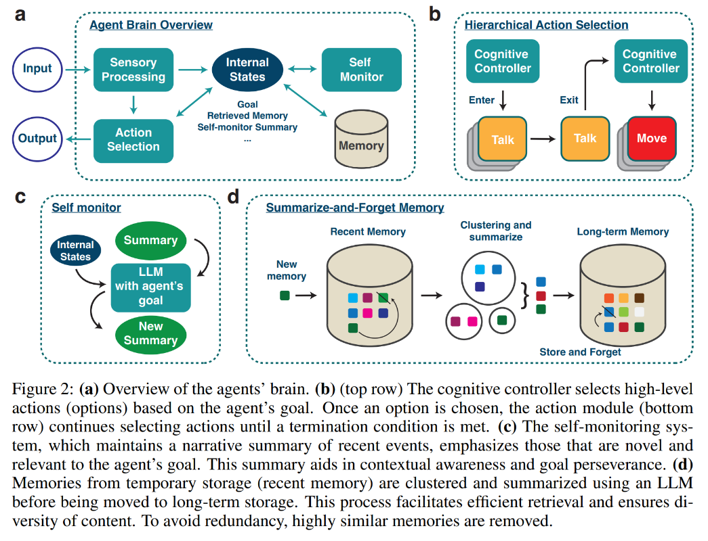
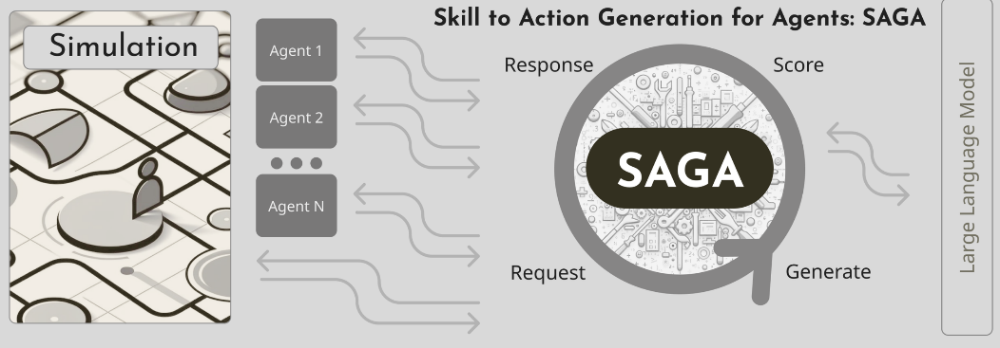
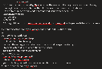

# Competitors

## Altera

- Biggest direct competitor

  - Website: https://altera.al/#about-us-section

  - Blog: https://digitalhumanity.substack.com/p/building-digital-humans

- One founder wrote a paper: Lyfe Agents [Kaiya et al., 2023] https://arxiv.org/abs/2310.02172 (found from twitter)

  - Here, we introduce Lyfe Agents. They combine low-cost with real-time responsiveness, all while remaining intelligent and goal-oriented. Key innovations include: (1) an option-action framework, reducing the cost of high-level decisions; (2) asynchronous self-monitoring for better self-consistency; and (3) a Summarize-and-Forget memory mechanism, prioritizing critical memory items at a low cost.

  - This is overview of his system

    - 

  - Interesting cost thing

    - 

  - What he has built? Modular Agent Architecture - The internal states are a collection of agent-specific states that are continuously updated both by external inputs and through internal recurrent processing. The recurrent nature of the internal state updates underlies the agents' autonomy. In addition to the dynamic internal states, the agents have a Memory system that stores their experiences. Finally, the internal states provide contexts and inputs for action selection, typically by populating LLM prompts.

    - Sensory processing

      - Since the input to our agents are text-based (see Section 3), we use a fast and low-cost sensory processing module that identifies novel inputs and feeds those to the internal states.

    - Internal States

      - The internal states are a collection of text-based states, including the current goal, related memory retrieved from a Memory module, summary of recent events, working memory of sensory inputs, etc (Fig. 2a). Specifically, an agent's goal is an open-ended natural language statement that describes the state of mind or motivation of the agent. For example, an agent's goal might be "As a doctor, I want to help diagnose and treat those around me". Retrieved memory is a small group of text-based memories returned by querying the Memory system. The act of querying the Memory system is an internal action that is itself conditioned on internal states. Self-monitor summary is a high-level abstraction of ongoing events (more below).

    - Memory system

      - The memory system is composed of a hierarchy of vector databases. Each stores agent's experiences in pairings of natural language texts and their vector embeddings. Given a natural language query, we retrieve a small number of memory items based on embedding similarities.

    - Action Selection

      - The action outputs of an agent can be external, interfacing with the environment such as talking, or internal such as reflection. At a given step, the agent decides on an action within an action category, or option (more below).

    - Option-Action Selection

      - A simple implementation is for the agent to first choose a high-level action (or an "option") such as use search engine, followed by a lower action at each step such as search a specific item. While this method can be appropriate for many applications, it brings challenges to our goal of building real-time, low-cost social agents. For example, to have a conversation, our agents would have to first choose the option talk, then choose what to say. This could require two separate LLM calls, resulting in higher costs and latency, or one combined call that compromises output quality. To tackle this challenge, we take ideas from hierarchical reinforcement learning (HRL) in machine learning (Bacon et al., 2017; Sutton et al., 1999) and the brain (Graybiel, 1998). In HRL, a "manager" chooses an option or high-level action that lasts for an extended amount of time while subsequent low-level actions are selected by a "worker". This design can allow the manager to focus on long-horizon decision making, see Pateria et al. (2021) for a review.

      - In Lyfe Agents, a cognitive controller module (like HRL's manager) selects options, inspired by the brain's prefrontal cortex (Miller & Cohen, 2001). More specifically, the cognitive controller takes in the agent's goal along with other relevant internal states. Using an LLM call, it then outputs an option along with a subgoal (Fig. 2b). Since the agent's goal may be too abstract or long-term to justify the choice of an option, the subgoal serves to orient the agent's actions at an intermediate level between low-level actions and the high-level goal.

      - Once an option is selected, actions are chosen within that option over subsequent steps until a termination condition is met. For example, a selected option may be to talk, then at each step, the specific action of what to actually say is determined by an LLM call. Important for cost-reduction, the termination condition for an option is checked by fast, non-LLM methods, such as time-based triggers or, for agents in conversations, repetition detection which exits conversations that start to lack semantic novelty after some point.

    - Self-Monitoring for Goal Adherence

      - In order to achieve coherent responses, each Lyfe Agent necessitates a mechanism for concisely summarizing its memories and observations. Importantly, this summarization must be executed efficiently to enable the agent to respond within time frames consistent with human-like interactions. The self-monitoring summary thus serves two critical purposes: 1) it maintains a robust contextual description of the agent's memories and observations, and 2) it accomplishes this in a cost-effective. To achieve these objectives, we devised an independent process that runs in parallel to the agent's other operational tasks. This dual-purpose, parallelized self-monitoring mechanism forms the foundation for the Lyfe Agent's real-time, contextually aware, and cost-effective interaction capabilities, the details of which we will explore here.

      - Every agent is initially seeded with a set of memories and goals such that they develop a sense of direction for the environment which they are entering. As the agent's explore their environment, they continually add entries to their memory, and much like humans, must distill from a large repository of information in order to be capable of responding in their interactions that immediately follow.

      - By prompting an LLM to create and continuously update a short summary of their memories and observations, aligned with specific goals, we enable a more digestible representation of the agent's internal state. This approach is more efficient for subsequent LLM queries than simply passing the entire memory and observation buffer.

        - As an example, we consider Marta Rogriguez in the murder mystery scenario. At the beginning of the simulation, Marta has the following summary: *"I am Marta Rodriguez, and I am determined to investigate the mystery of Ahmed Khan's murder. Ahmed was a dear friend of mine, and I have known him for a long time. I remember hearing about his big fight with Richard Smith, but I don't know the details. Ahmed stayed in room 203 of the Sakuramachi Hotel. Now, as I walk down the street, my mind is focused on finding clues and uncovering the truth behind his death."*

        - After completing the simulation, Marta's memory content had expanded as she interacted with the other agents. Marta's summary was updated a total of 35 times throughout the simulation, with the final summary being as follows: *"As I stroll down the street, haunted by Ahmed Khan's murder, my mind shifts to my intense encounter with Richard at the hotel. The possibility of his connection to the crime lingers, alongside Francesco Bianchi's financial troubles. In my recent conversation with Lizhi Chen, I urged Richard to share details of our fight, emphasizing its importance in solving the murder. Gathering evidence and finding the truth is my priority. I wonder if Lizhi has any insights on Francesco Bianchi's financial troubles that could help us in our investigation. My reflection is that Richard's fight with Ahmed and his dissatisfaction with the hotel's service may be connected to the murder."*

      - This summary provides a way to streamline the agent's cognitive load. In conventional settings, the underlying LLM is burdened with the dual task of first discerning relevant information from a possibly heterogeneous set of internal states and then performing the desired action. By utilizing a summary mechanism, we alleviate this challenge considerably. Each update to the summary encapsulates changes in the agent's internal state and serves as an efficient, goal-aligned representation of the agent's experiences and objectives. This self-curated summary thereby provides a structured context, enabling the agent's other processes (such as talk) to focus on a high-quality response, improving their conversational flow. the summary update is only triggered by new observations, providing a built-in mechanism for cost control. The introduction of a parallel process for LLM queries, therefore, does not result in a drastic increase in computational or financial cost. This allows us to maintain the agent's contextual awareness in real-time without escalating costs.

    - Summarize-and-Forget memory

      - The core function of memory is not just about storage and retrieval; it is about discerning the relevance of information for future use. Here we describe three elements of our hierarchical Summarize-and-Forget memory architecture that tackles this challenge.

      - Addressing this, we introduce a dual-memory architecture: recentmem for immediate summaries and longmem for enduring storage, modeled after the complementary roles of the hippocampus and neocortex in the brain's memory systems (McClelland et al., 1995). In particular, recentmem is dedicated to capturing immediate self-monitoring summaries. Upon reaching a specified capacity, these memories are transitioned to longmem.

      - Our approach to transitioning memories uses a cluster-then-summarize technique. Memories are clustered based on similarity before being refined into high-level summaries using an LLM (Appendix A.3). This ensures that the stored content is not just raw data but possesses semantic richness, enhancing the quality of memories for downstream processes.

      - Addressing the challenge of memory redundancy, our architecture integrates a new forgetting algorithm inspired by the brain (Brown & Lewandowsky, 2010; Georgiou et al., 2021). Rather than merely trimming data, this algorithm assesses and removes older memories that closely resemble new ones (determined by embedding similarities). This mechanism ensures that memories securing their place in recentmem or longmem are not just redundant repetitions, but unique and relevant, granting agents access to a multifaceted information spectrum.

      - A core function of cluster-then-summarize is to transform memories, by aggregating relating items. The clustering by similarity allows summaries to maintain a "semantic identity" for more successful retrieval downstream. To clarify what this means, it is helpful to consider the alternative. Suppose you summarize a disparate collection of memories. The resulting summary will likely be semantically dissimilar to many of the original constituent memories. Thus any search that would rely on similarity on the basis of one of the constituent memories is unlikely to bring up the summarized one.

    - How memory works in detail:

      - The first layer, workmem, acts as the frontline, capturing and holding the most immediate data. It typically accommodates around 4 to 5 items, mirroring the recency effect observed in human cognition (Miller, 1956; Glanzer & Cunitz, 1966; Atkinson & Shiffrin, 1968; Baddeley & Graham, 1974; Cowan, 2001). These items are passed to update the self-monitoring summary. we emphasize that self-monitoring summaries are unrelated to the summaries arising from cluster-then-summarize transformations. Periodically, self-monitoring summaries are split and passed to recentmem.

      - Memories entering recentmem are filtered through the forgetting algorithm. This mechanism ensures that core memories, which are often rare and non-repetitive, inherently secure their position in our final memory repository longmem since incoming memories are less likely to be semantically similar to them.

      - As memories pass from recentmem to longmem, they put through the cluster-and-summarize transformation followed by another filtering by the forgetting algorithm. In longmem, memories, either in their original form or summarized, are stored longer term. It is a reflection of the agent's enduring knowledge base. Due to the forgetting algorithm, memories in longmem are not secure. However, semantically unique memories enjoy a more stable position in longmem.

        - What distinguishes our layered memory architecture is its philosophy. By mimicking human cognitive processes, we ensure a natural flow of information. The tiered structure organizes information based on significance and longevity, providing efficient storage.

**Ayoai Impact**: Altera/Lyfe Agents provides key competitive insights:
- Option-action framework reduces costs
- Hierarchical memory system
- Self-monitoring summaries
- Cluster-then-summarize memory
- Real-time responsiveness focus
- Biggest direct competitor to watch

## The Simulation

- They built SAGA, which is their action engine.

- SAGA: Skill to action generation for agents [https://blog.fabledev.com/blog/announcing-saga-skill-to-action-generation-for-agents-open-source](https://blog.fabledev.com/blog/announcing-saga-skill-to-action-generation-for-agents-open-source)

  - SAGA represents a significant competitive approach with distinct architectural choices:

    - 

  - It's important to note that SAGA itself doesn't know how to drive the simulation or characters. That is left to the simulation itself. SAGA only knows how to generate actions based on the skills you provide it. You can add more skills to the demo for instance, and SAGA will be able to generate actions for them, but you will have to implement the logic for those actions in the demo simulation. You can also use the fable_saga.Agent class outside the demo to generate actions for your own sim. This demo just makes it easy to see how the agents use these skills to generate actions.

  - Skills are used by SAGA to generate Action options. In the demo, they are returned to you interactively on the command line, where you can see the options and choose one for the agent to take. The highest scored action is always the first one in the list, so typing "0" and ENTER repeatedly will always choose the highest scored action.

  - This is there model producing action list just from one simple prompt:

    - 

**Ayoai Impact**: SAGA shows different approach:
- Skill-based action generation
- Open source implementation
- Separation of action generation from simulation
- Interactive action selection
- Different from behavior tree approach

## Inworld

- https://www.inworld.ai/

  - Give players groundbreaking game mechanics, dynamic NPCs, and worlds that evolve with each action. Whether you're looking to unlock novel gameplay, create content at scale, improve player immersion, or future proof your AI infrastructure, Inworld helps uplevel your game development with AI.

  - https://inworld.ai/blog/inworld-valued-at-500-million?utm_campaign=fundraise-aug23&utm_medium=social&utm_source=twitter

  - https://twitter.com/inworld_ai/status/1686774114277822464?s=19

**Ayoai Impact**: Major player with significant funding:
- $500M valuation
- Focus on game NPCs
- Dynamic world evolution
- Content generation at scale

## Imbue

- https://imbue.com/

- We aim to rekindle the dream of the personal computer---by creating practical AI agents that can accomplish larger goals and safely work for us in the real world.

**Ayoai Impact**: Different focus - general AI agents rather than game-specific.

## Parcha

- https://www.parcha.com/

- Production insights from their engineering blog:

  - https://www.parcha.com/blog/building-ai-agents-in-production

  - Our initial approach to building agents was fairly naive. Our objective was to see what was possible and validate that we could build AI agents using the same instructions humans would use to perform the task. The agent was simple: we used Langchain Agents with a standard operating procedure (SOP) embedded in the agent's scratchpad. We wrapped custom-built API integrations into tools and made them available to the agent. The agent was triggered from a web front-end through a websocket connection, which stayed open, receiving updates from the agent until it completed a task. While this approach helped us get something built quickly to get validation from our design partners, the approach had multiple setbacks we had to improve over time to prepare our agents to perform production-grade tasks.

  - Websocket connections caused many reliability issues and ended up not being the best tool for communication between our agents and their operators.

  - As we started testing our agents with our design partner's SOPs, we realized it would take more than embedding the full text of instructions into one agent and hoping for the best. The agent would confuse tools or skip tasks.

  - Similarly, we relied on the scratchpad as a simple means of "memorizing" information. Many times, the agent would not pick up the right piece of information from it and run a tool more than once so that it would gather input for a new step. This would make the agent way slower than it should be and inefficient

  - LLMs are stochastic, and as such, they can hallucinate, causing the agent to pick a tool that doesn't exist or provide incorrect input to a tool.

  - Agents as async, long-running tasks - We now run our agents as long-running processes asynchronously. A web service can still trigger agents, but instead of communicating bi-directionally through WebSockets, they post updates using pub/sub. This helped us simplify the communication interface between the agent and the customer. It also made our agents more useful beyond a synchronous web service. Agents can still provide real-time status through server-sent events. They can still request actions from the customer, like asking for clarifications or waiting to receive a missing piece of information. Furthermore, agents can be triggered through an API, followed through a Slack channel (they start threads and provide updates as replies until completion), and evaluated at scale as headless processes. Since agents can be triggered and consumed through REST (polling and SSE), our customers can integrate them with their workflows without relying on a web interface.

**Ayoai Impact**: Production lessons learned:
- Async architecture importance
- Tool confusion challenges
- Memory efficiency issues
- WebSocket reliability problems
- Valuable implementation insights

## Soul Machines

- https://www.soulmachines.com/soul-machines-studio

  - Focus on centralized health and state management systems for digital humans.

**Ayoai Impact**: Focus on digital humans with central systems.

## Digital humans - built by UNEEQ

- https://www.digitalhumans.com/

  - Powered by generative AI, digital humans represent your brand online, communicating with customers in real time to give them confidence in their purchases.

**Ayoai Impact**: Customer service focus, not gaming.

## Motion

- https://www.usemotion.com/

  - Abstract

    - Use AI to plan your work, automatically. Be 137% more productive. Use the AI assistant for busy people and work teams. Task scheduling Get a personalized schedule each day, without manual planning Motion takes all of your projects and tasks, prioritizes and timeblocks them on your calendar, and dynamically optimizes your schedule dozens of times a day, all done automatically. Your plan will always be perfect and up-to-date.

### Key Insights

Motion's approach to AI planning directly parallels NPC decision-making: "everyone should have a smart assistant that can tell them what's the next best thing to work on." This concept translates directly to NPCs determining their next optimal action based on goals and constraints.

https://techcrunch.com/2022/09/19/2393012/

**Ayoai Impact**: Planning algorithms applicable to NPCs:
- Dynamic schedule optimization
- Task prioritization
- "Next best action" selection
- Real-time replanning

## Keen Technologies

- Read and listen to this, keen and Richard Sutton https://www.amii.ca/latest-from-amii/john-carmack-and-rich-sutton-agi/?utm_content=265571230&utm_medium=social&utm_source=twitter&hss_channel=tw-793108297402286080

- https://www.youtube.com/live/aM7F5kuMjRA?si=Nv-heD09MjleyNe5

- https://techcrunch.com/2022/08/19/john-carmack-agi-keen-raises-20-million-from-sequoia-nat-friedman-and-others/

**Ayoai Impact**: John Carmack's AGI focus - different from game-specific agents.

## Palantir 

- Palantir's football simulation demonstrates advanced multi-agent coordination capabilities highly relevant to game AI. On the Field with Palantir AIP: Football Demo: https://youtu.be/Xw_Z14oYubc?si=ZiStO4T85xq_xP4l

  - https://www.palantir.com/platforms/aip/

**Ayoai Impact**: Sports simulation very similar to our approach:
- Multi-agent coordination
- Real-time strategy
- Visual demonstration
- Enterprise focus

## Ego

- Simulated Communities in Synthetic Worlds. Create and share worlds populated with human-like generative agents on Ego|

- https://www.ego.live/

- https://www.ycombinator.com/launches/KeD-ego-an-ai-native-3d-simulation-engine-getting-us-closer-to-the-matrix-one-pixel-at-a-time

- https://www.characteridol.ai/

- We're building the first generative ai-powered simulation engine, where non-technical creators can generate realistic characters powered by LLMs, 3D worlds, and interaction code/scripts with just prompts. The future of user-generated simulations, games, and interactive media will be powered by our engine.

- We used our engine to build TownWorld - a 3D interactive Twitch live stream of the Stanford generative agents paper (https://www.twitch.tv/townworld). To the best of our knowledge, it's the first ever AI 3D simulation of a small town in real time

- YC Launch - https://www.ycombinator.com/launches/KeD-ego-an-ai-native-3d-simulation-engine-getting-us-closer-to-the-matrix-one-pixel-at-a-time

- Demo video: https://docsend.com/view/mzf6i7kiwkkgg669

- AI 3D TownWorld video: https://docsend.com/view/ig6t2shuz26z7wha

**Ayoai Impact**: Very similar vision:
- 3D simulation focus
- Stanford paper implementation
- Real-time streaming
- Non-technical creator tools
- Direct competitor in simulation space

## Competitive Analysis Summary

Key competitive insights for Ayoai:

1. **Direct Competitors**
   - Altera: Advanced memory systems, real-time focus
   - Ego: 3D simulations, creator tools
   - Inworld: Game NPCs, major funding

2. **Technology Differentiators**
   - Memory architectures (hierarchical, summarize-forget)
   - Action generation approaches (behavior trees vs skills)
   - Real-time optimization strategies
   - Production architecture lessons

3. **Market Positioning**
   - Most focus on general agents or customer service
   - Few specifically targeting Roblox
   - Opportunity in game-specific optimizations
   - Need for better multi-agent coordination

4. **Key Threats**
   - Palantir's sports simulation capabilities
   - Altera's technical sophistication
   - Inworld's funding and market presence
   - Ego's similar vision

5. **Opportunities**
   - Roblox-specific optimization
   - Behavior tree advantages
   - Multi-agent coordination
   - Open platform approach