# General Agents

We eventually we need a section on agents

## More Agents Is All You Need

- More Agents Is All You Need https://arxiv.org/abs/2402.05120

  - Abstract

    - We find that, simply via a sampling-and-voting method, the performance of large language models (LLMs) scales with the number of agents instantiated. Also, this method is orthogonal to existing complicated methods to further enhance LLMs, while the degree of enhancement is correlated to the task difficulty. We conduct comprehensive experiments on a wide range of LLM benchmarks to verify the presence of our finding, and to study the properties that can facilitate its occurrence. Our code is publicly available at: https://anonymous.4open.science/r/more_agent_is_all_you_need

  - Zak Thoughts

    - Has code!!

    - 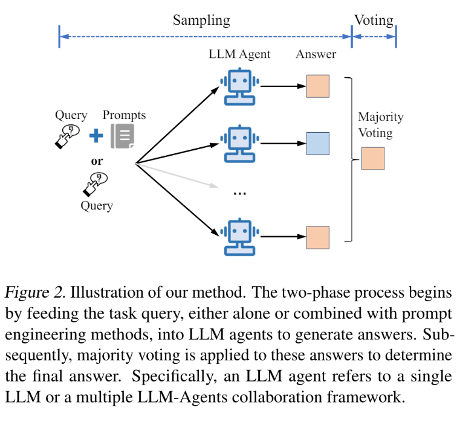

**Ayoai Impact**: Multi-agent voting improves performance:
- Simple sampling-and-voting
- Scales with agent count
- Orthogonal to other methods
- Could enhance NPC group decisions

## Agent AI

- Agent AI: Surveying the Horizons of Multimodal Interaction https://arxiv.org/abs/2401.03568

  - Abstract

    - Multi-modal AI systems will likely become a ubiquitous presence in our everyday lives. A promising approach to making these systems more interactive is to embody them as agents within physical and virtual environments. At present, systems leverage existing foundation models as the basic building blocks for the creation of embodied agents. Embedding agents within such environments facilitates the ability of models to process and interpret visual and contextual data, which is critical for the creation of more sophisticated and context-aware AI systems. For example, a system that can perceive user actions, human behavior, environmental objects, audio expressions, and the collective sentiment of a scene can be used to inform and direct agent responses within the given environment. To accelerate research on agent-based multimodal intelligence, we define "Agent AI" as a class of interactive systems that can perceive visual stimuli, language inputs, and other environmentally-grounded data, and can produce meaningful embodied actions. In particular, we explore systems that aim to improve agents based on next-embodied action prediction by incorporating external knowledge, multi-sensory inputs, and human feedback. We argue that by developing agentic AI systems in grounded environments, one can also mitigate the hallucinations of large foundation models and their tendency to generate environmentally incorrect outputs. The emerging field of Agent AI subsumes the broader embodied and agentic aspects of multimodal interactions. Beyond agents acting and interacting in the physical world, we envision a future where people can easily create any virtual reality or simulated scene and interact with agents embodied within the virtual environment.

  - Zak Thoughts

    - This is actually a survey. No code here. It's huge, but repetitive to what I already have here.

    - 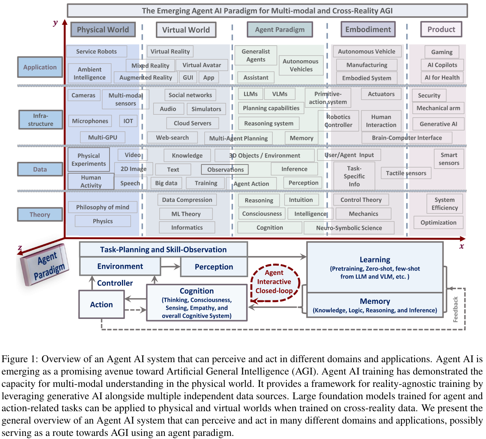

    - 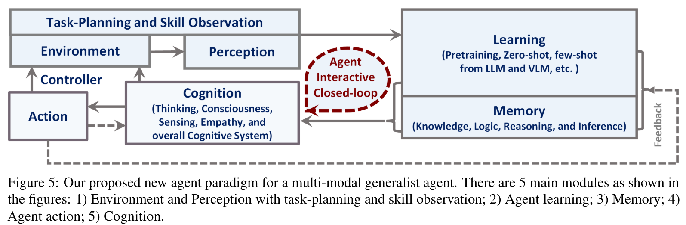

    - 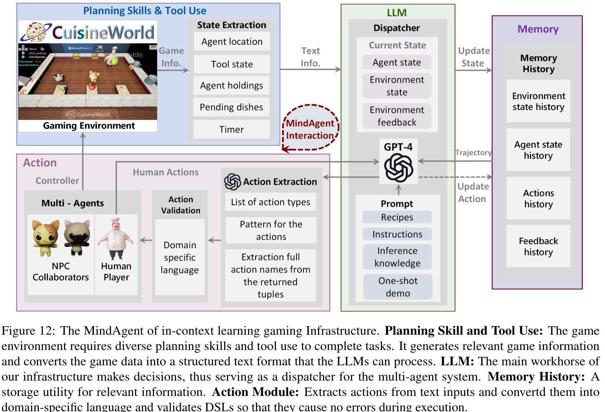

**Ayoai Impact**: Multimodal agent framework:
- Visual + language + environmental inputs
- Embodied action generation
- Grounding reduces hallucinations
- Perfect for game environments

## Based Autonomous Agents

- Survey on Large Language Model based Autonomous Agents https://arxiv.org/abs/2308.11432

  - Abstract

    - Autonomous agents have long been a prominent research focus in both academic and industry communities. Previous research in this field often focuses on training agents with limited knowledge within isolated environments, which diverges significantly from human learning processes, and thus makes the agents hard to achieve human-like decisions. Recently, through the acquisition of vast amounts of web knowledge, large language models (LLMs) have demonstrated remarkable potential in achieving human-level intelligence. This has sparked an upsurge in studies investigating LLM-based autonomous agents. In this paper, we present a comprehensive survey of these studies, delivering a systematic review of the field of LLM-based autonomous agents from a holistic perspective. More specifically, we first discuss the construction of LLM-based autonomous agents, for which we propose a unified framework that encompasses a majority of the previous work. Then, we present a comprehensive overview of the diverse applications of LLM-based autonomous agents in the fields of social science, natural science, and engineering. Finally, we delve into the evaluation strategies commonly used for LLM-based autonomous agents. Based on the previous studies, we also present several challenges and future directions in this field. To keep track of this field and continuously update our survey, we maintain a repository of relevant references at this https URL.

  - Zak Thoughts

    - Another survey.

    - Wait wait -- they maintain a full list of all agents here: https://github.com/Paitesanshi/LLM-Agent-Survey. Wow, so every agent in the world they are tracking and stating of capabilities. MMMMM yum.

    - Has code thought! https://github.com/Paitesanshi/LLM-Agent-Survey

    - 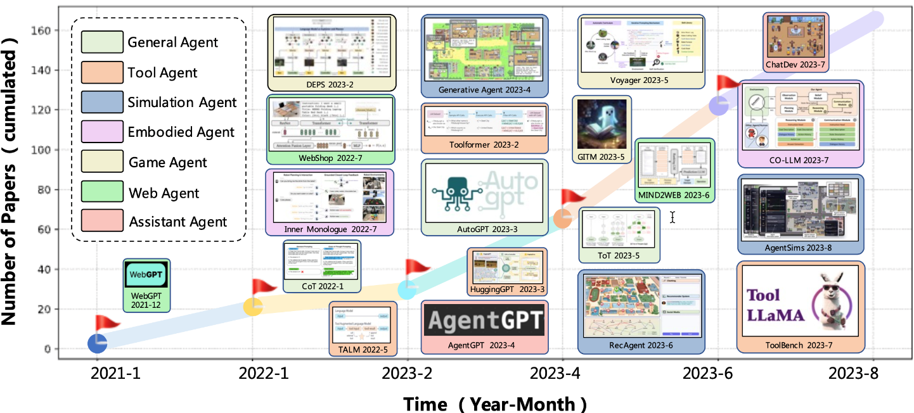

    - 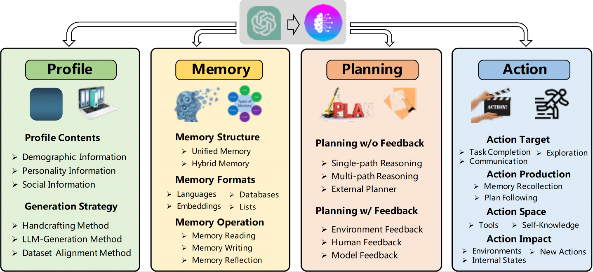

    - 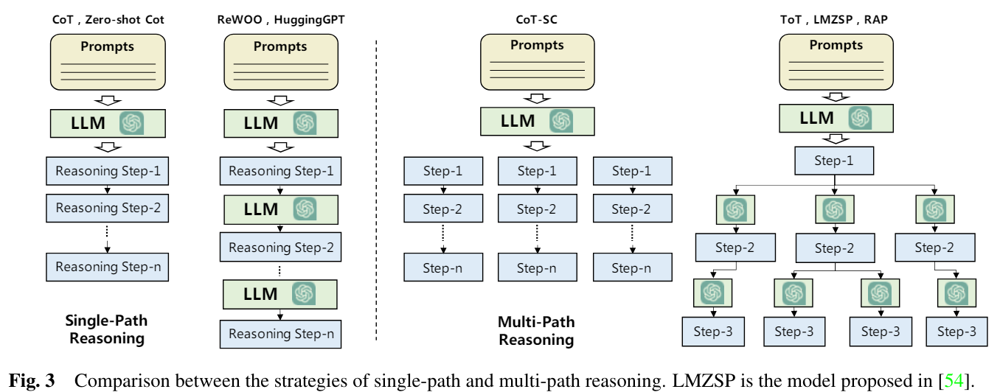

    - 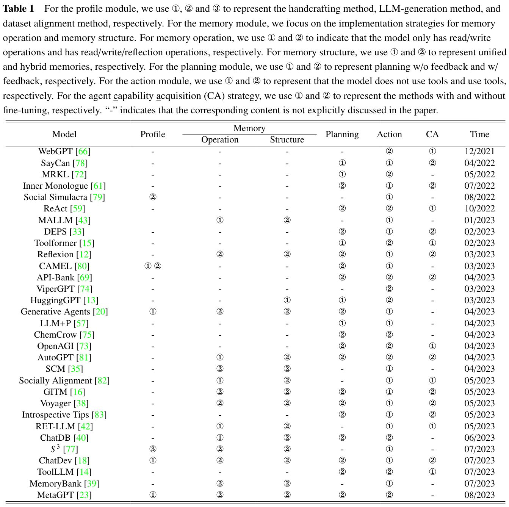

    - 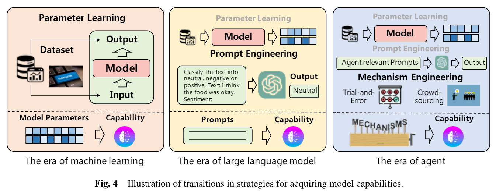

    - 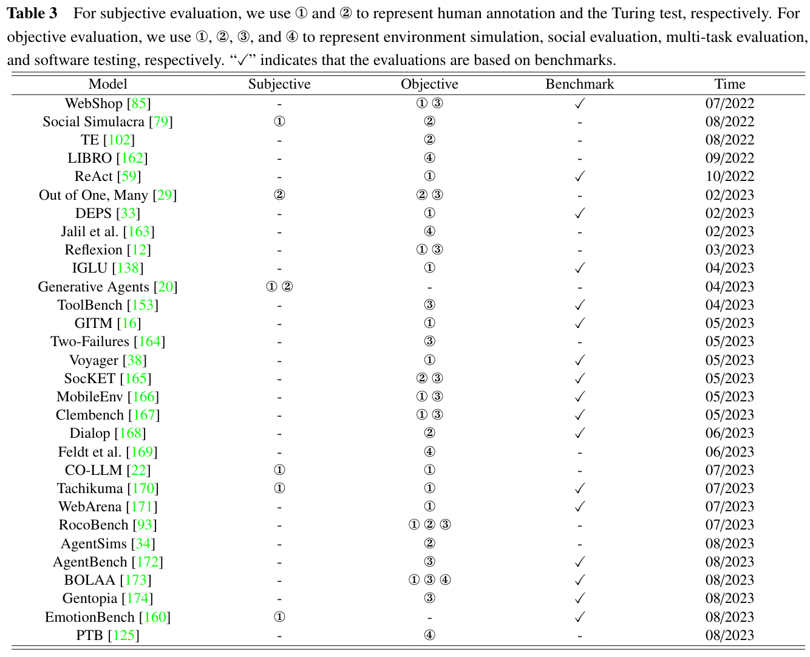

**Ayoai Impact**: Comprehensive agent survey with:
- Unified agent framework
- Complete agent repository
- Growth trend analysis
- Application categorization
- Critical resource for tracking field

## Model-Based Game Agents

- Survey on Large Language Model-Based Game Agents https://arxiv.org/abs/2404.02039

  - Abstract

    - The development of game agents holds a critical role in advancing towards Artificial General Intelligence (AGI). The progress of LLMs and their multimodal counterparts (MLLMs) offers an unprecedented opportunity to evolve and empower game agents with human-like decision-making capabilities in complex computer game environments. This paper provides a comprehensive overview of LLM-based game agents from a holistic viewpoint. First, we introduce the conceptual architecture of LLM-based game agents, centered around six essential functional components: perception, memory, thinking, role-playing, action, and learning. Second, we survey existing representative LLM-based game agents documented in the literature with respect to methodologies and adaptation agility across six genres of games, including adventure, communication, competition, cooperation, simulation, and crafting & exploration games. Finally, we present an outlook of future research and development directions in this burgeoning field. A curated list of relevant papers is maintained and made accessible at: [this https URL](https://github.com/git-disl/awesome-LLM-game-agent-papers).

  - Zak Thoughts

    - Also another list, huh, I wonder what is better maintained: https://github.com/git-disl/awesome-LLM-game-agent-papers

    - 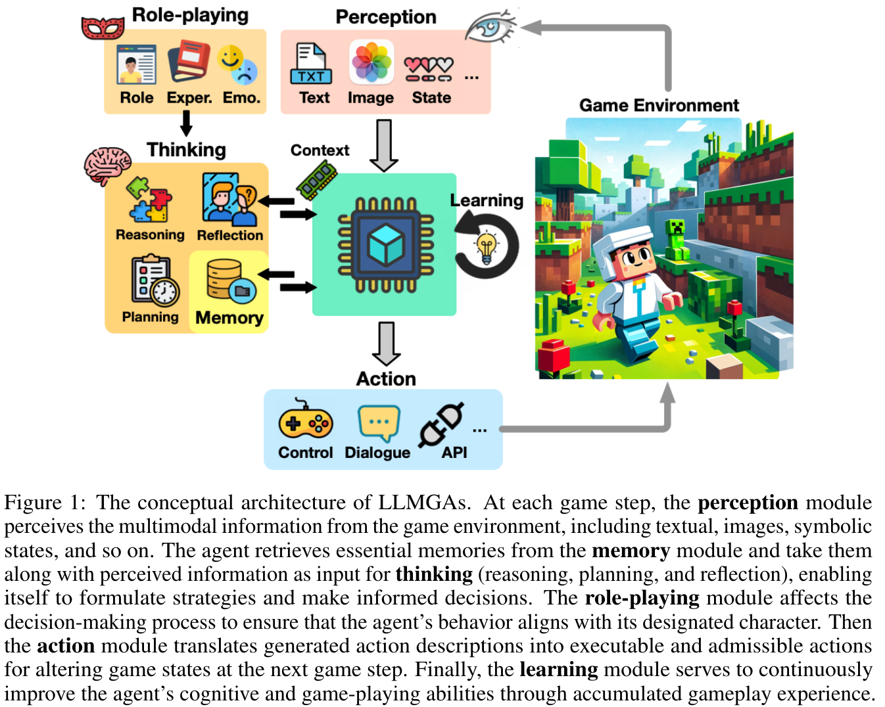

    - 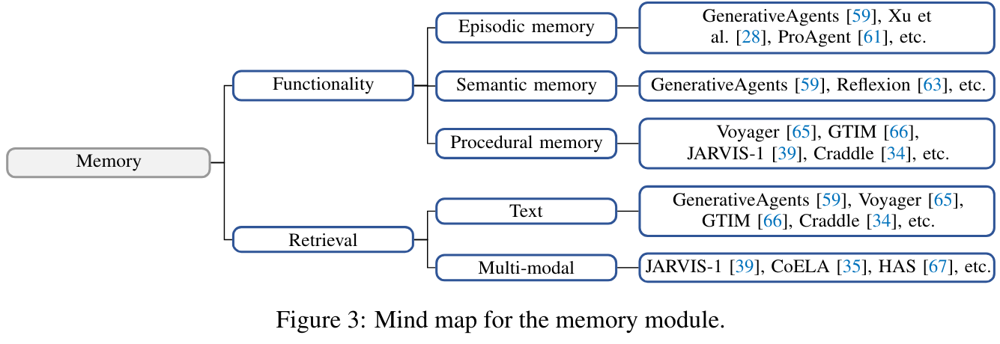

    - 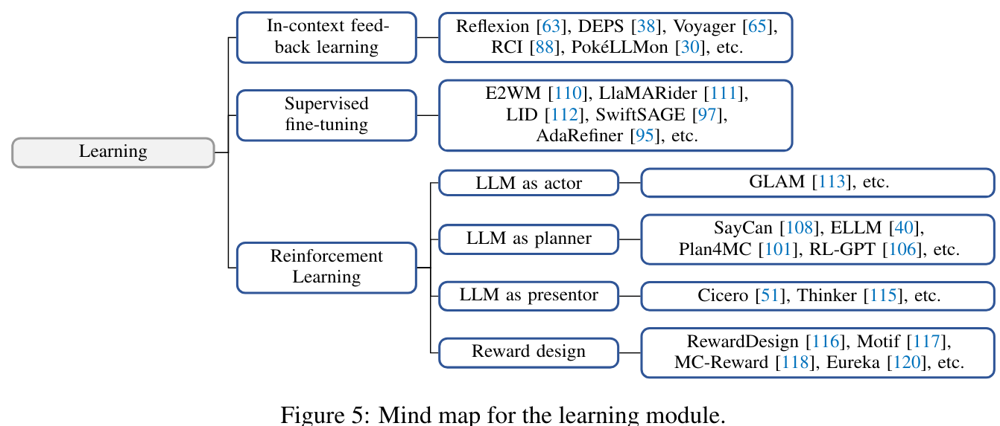

**Ayoai Impact**: Game-specific agent architecture:
- 6 functional components
- Game genre categorization
- Memory architectures
- Learning mechanisms
- Direct relevance to Ayoai

## Mixture-of-Agents

- Mixture-of-Agents Enhances Large Language Model Capabilities https://arxiv.org/abs/2406.04692

  - Abstract

    - Recent advances in large language models (LLMs) demonstrate substantial capabilities in natural language understanding and generation tasks. With the growing number of LLMs, how to harness the collective expertise of multiple LLMs is an exciting open direction. Toward this goal, we propose a new approach that leverages the collective strengths of multiple LLMs through a Mixture-of-Agents (MoA) methodology. In our approach, we construct a layered MoA architecture wherein each layer comprises multiple LLM agents. Each agent takes all the outputs from agents in the previous layer as auxiliary information in generating its response. MoA models achieves state-of-art performance on AlpacaEval 2.0, MT-Bench and FLASK, surpassing GPT-4 Omni. For example, our MoA using only open-source LLMs is the leader of AlpacaEval 2.0 by a substantial gap, achieving a score of 65.1% compared to 57.5% by GPT-4 Omni.

  - Zak thoughts

    - Seems short

    - 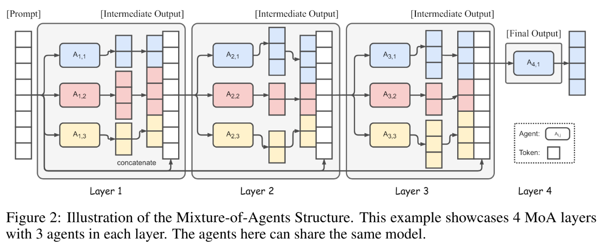

**Ayoai Impact**: Layered agent architecture:
- Multiple LLMs per layer
- Collective intelligence
- Outperforms single models
- Could enhance NPC diversity

## The Rise and Potential

- The Rise and Potential of Large Language Model Based Agents: A Survey https://arxiv.org/abs/2309.07864

  - Abstract

    - For a long time, humanity has pursued artificial intelligence (AI) equivalent to or surpassing the human level, with AI agents considered a promising vehicle for this pursuit. AI agents are artificial entities that sense their environment, make decisions, and take actions. Many efforts have been made to develop intelligent agents, but they mainly focus on advancement in algorithms or training strategies to enhance specific capabilities or performance on particular tasks. Actually, what the community lacks is a general and powerful model to serve as a starting point for designing AI agents that can adapt to diverse scenarios. Due to the versatile capabilities they demonstrate, large language models (LLMs) are regarded as potential sparks for Artificial General Intelligence (AGI), offering hope for building general AI agents. Many researchers have leveraged LLMs as the foundation to build AI agents and have achieved significant progress. In this paper, we perform a comprehensive survey on LLM-based agents. We start by tracing the concept of agents from its philosophical origins to its development in AI, and explain why LLMs are suitable foundations for agents. Building upon this, we present a general framework for LLM-based agents, comprising three main components: brain, perception, and action, and the framework can be tailored for different applications. Subsequently, we explore the extensive applications of LLM-based agents in three aspects: single-agent scenarios, multi-agent scenarios, and human-agent cooperation. Following this, we delve into agent societies, exploring the behavior and personality of LLM-based agents, the social phenomena that emerge from an agent society, and the insights they offer for human society. Finally, we discuss several key topics and open problems within the field. A repository for the related papers at this https URL.

  - Zak thoughts

    - Website here: https://github.com/WooooDyy/LLM-Agent-Paper-List

    - 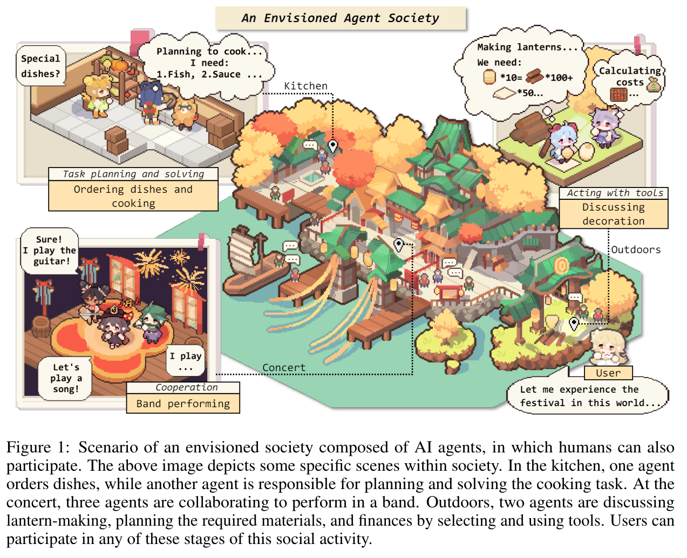

    - 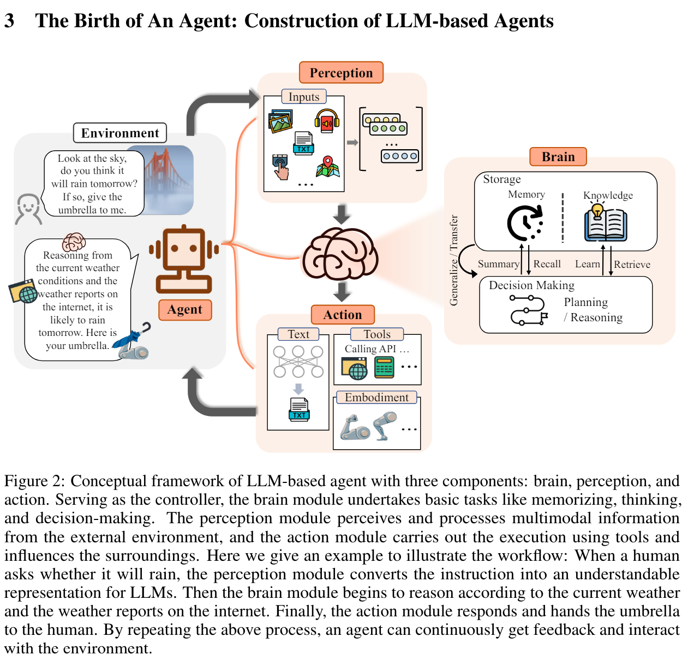

    - 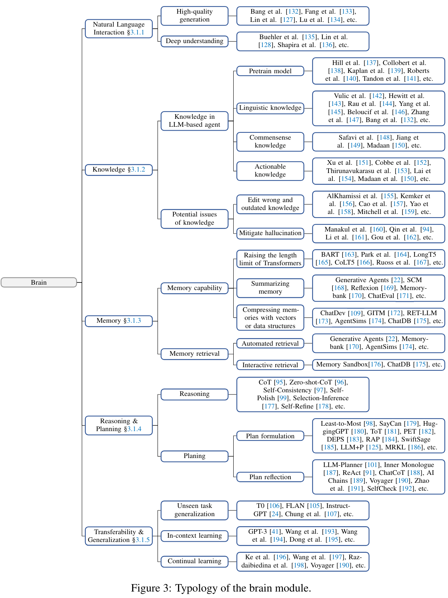

    - 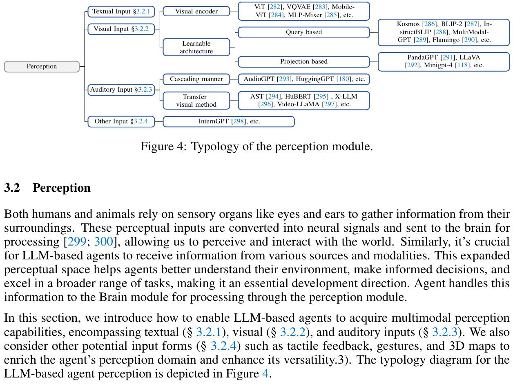

    - 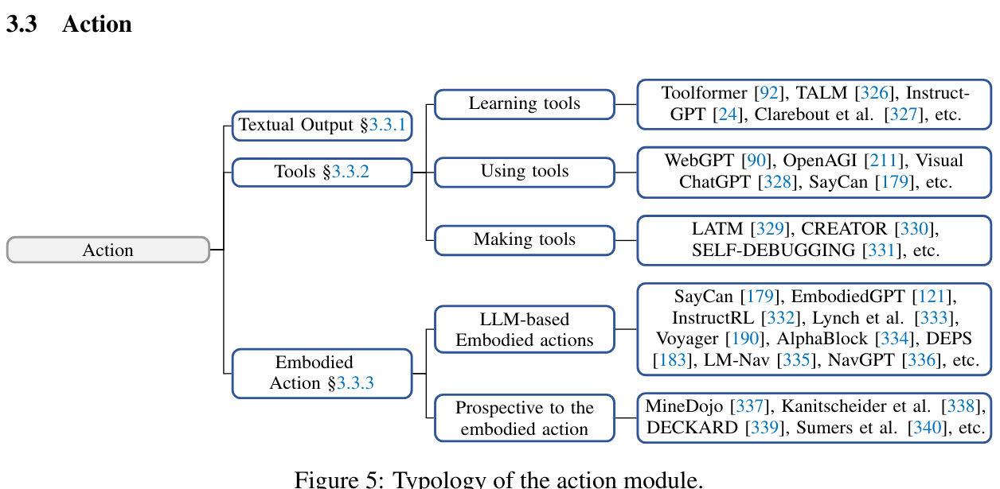

    - 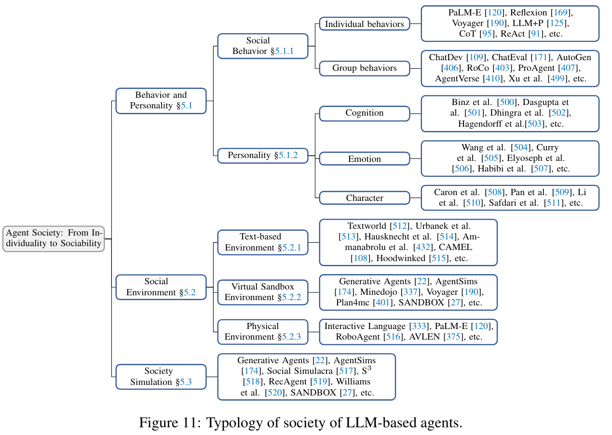

    - 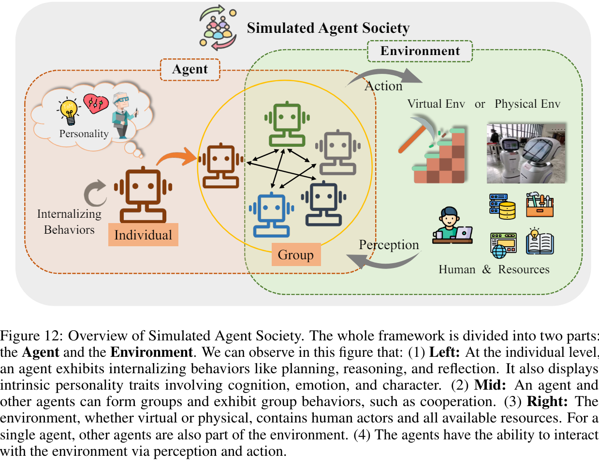

**Ayoai Impact**: Philosophical foundation for agents:
- Brain-perception-action framework
- Agent societies and emergence
- Multi-agent scenarios
- Human-agent cooperation patterns

## LLM Powered Autonomous Agents

- The Rise and Potential of Large Language Model Based Agents: A Survey https://arxiv.org/abs/2309.07864

  - Abstract

    - Planning

      - Subgoal and decomposition: The agent breaks down large tasks into smaller, manageable subgoals, enabling efficient handling of complex tasks.

      - Reflection and refinement: The agent can do self-criticism and self-reflection over past actions, learn from mistakes and refine them for future steps, thereby improving the quality of final results.

    - Memory

      - Short-term memory: I would consider all the in-context learning (See Prompt Engineering) as utilizing short-term memory of the model to learn.

      - Long-term memory: This provides the agent with the capability to retain and recall (infinite) information over extended periods, often by leveraging an external vector store and fast retrieval.

    - Tool use

      - The agent learns to call external APIs for extra information that is missing from the model weights (often hard to change after pre-training), including current information, code execution capability, access to proprietary information sources and more.

    - 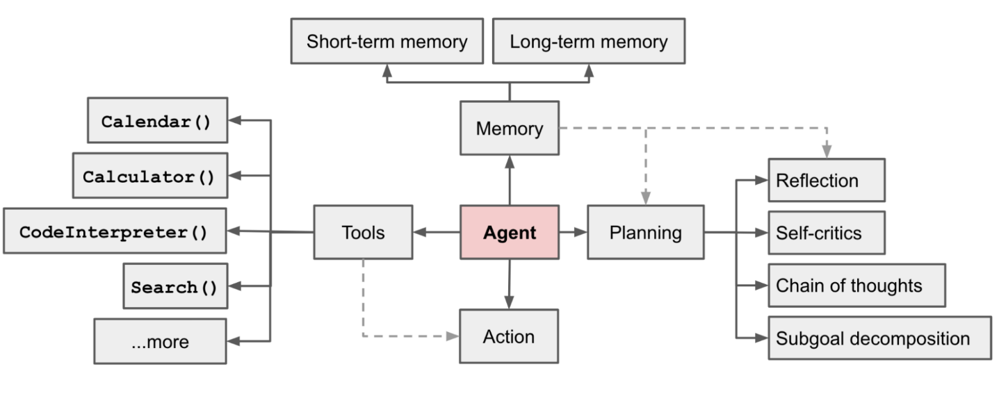

  - Zak thoughts

    - Cool writeup! Not a paper, but a website, huh. . .

    - 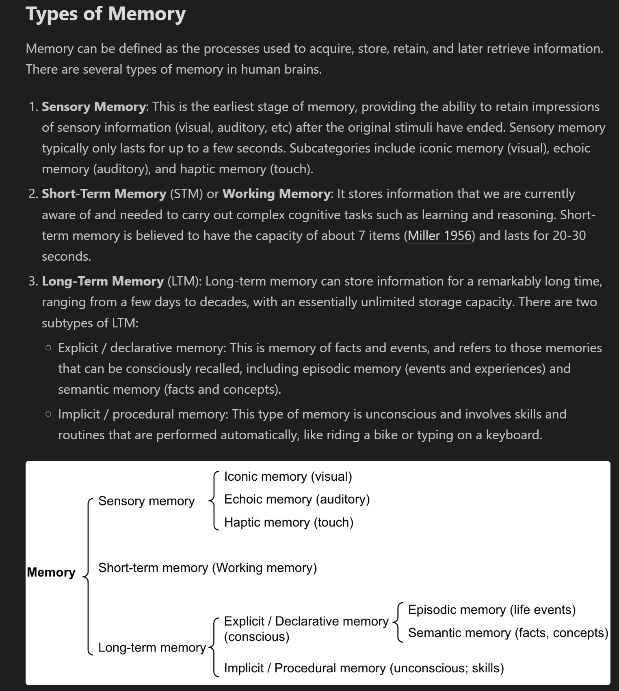

    - 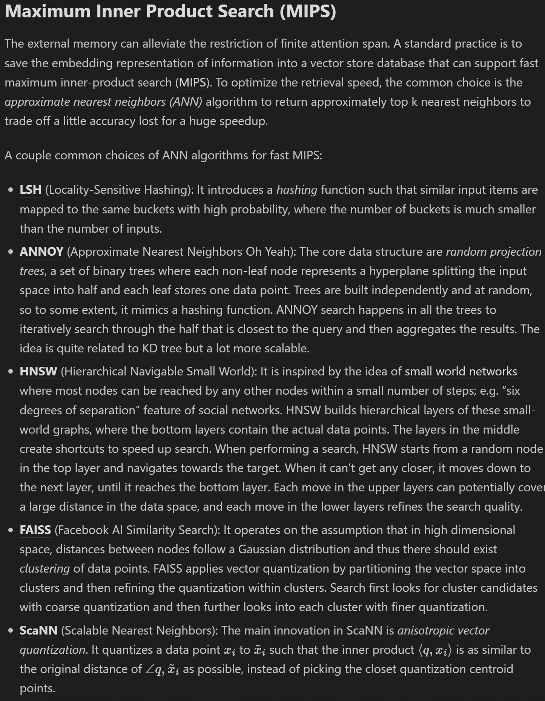

    - 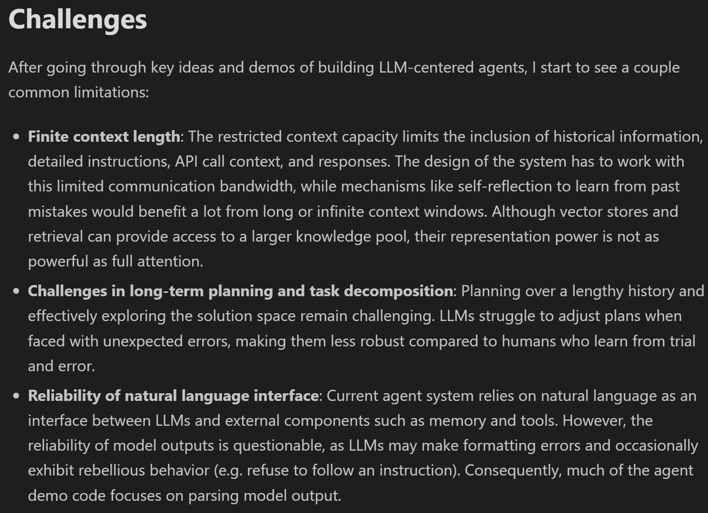

**Ayoai Impact**: Core agent capabilities:
- Planning with decomposition
- Reflection and refinement
- Short/long-term memory
- Tool use for external info
- Foundation for Ayoai agents

## Get usage
Try npx ccusag3@latest? To get claude code usage?

## What are these flows I should think about?
https://x.com/ryancarson/status/1934346688753492283?s=19

## Open Source Agents to check out?
- `OpenHands CLI`
  - docs: https://docs.all-hands.dev/usage/how-to/cli-mode#cli
  - blog: https://www.all-hands.dev/blog/the-openhands-cli-ai-powered-development-in-your-terminal
- `Goose` - open source form Jack - has windows app now.  
	- docs: https://block.github.io/goose/docs/getting-started/installation/
	
## Takes on Background Agents
- "hot take on background agents: - - Great for monitoring PRs and GitHub issues but I don’t want to build features with them. - - I kinda enjoy pairing up with Claude and building something cool"

## Key Insights for Ayoai

From general agent research:

1. **Agent Architectures**
   - Brain-perception-action framework
   - Layered multi-agent systems
   - Functional component design
   - Emergence from agent societies

2. **Performance Enhancements**
   - Multi-agent voting
   - Mixture of experts
   - Collective intelligence
   - Grounding in environments

3. **Game-Specific Considerations**
   - 6 functional components
   - Genre-specific adaptations
   - Memory architectures
   - Learning mechanisms

4. **Resources**
   - Multiple agent survey repositories
   - Comprehensive paper lists
   - Implementation examples
   - Growth trend tracking

These general agent frameworks provide the theoretical foundation and practical patterns for implementing sophisticated NPCs in the Ayoai platform.