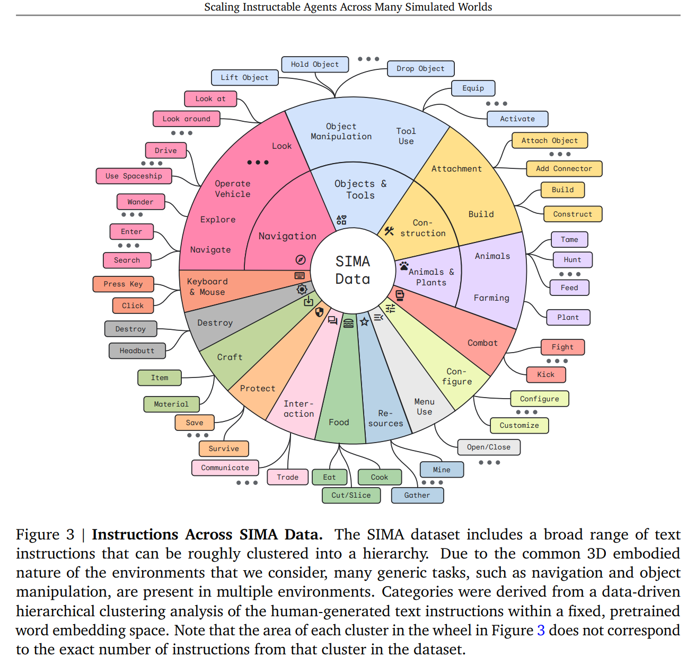
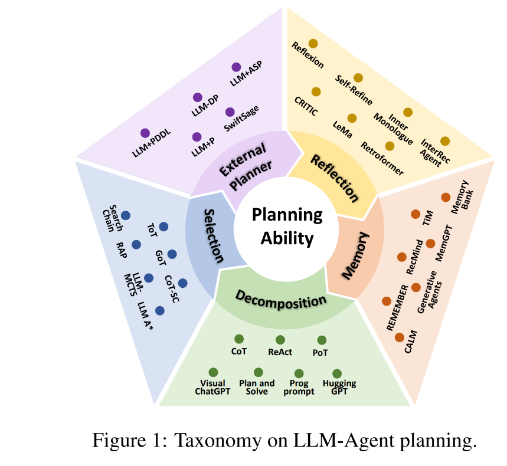
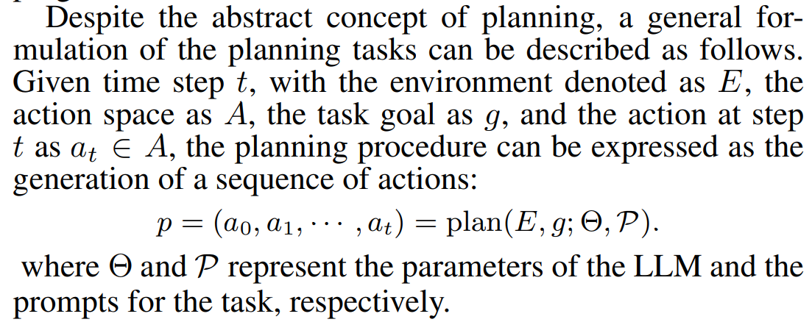
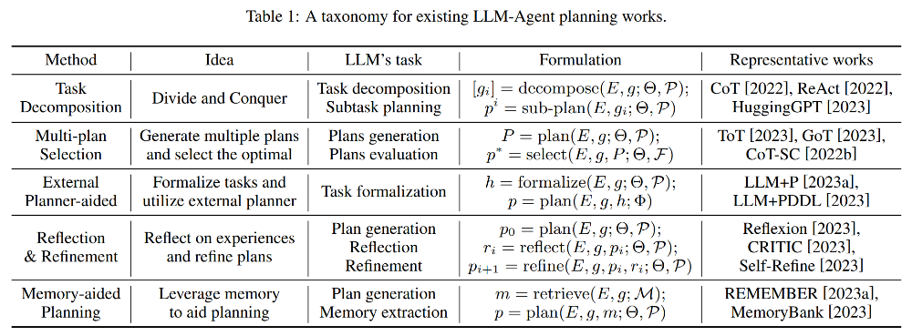
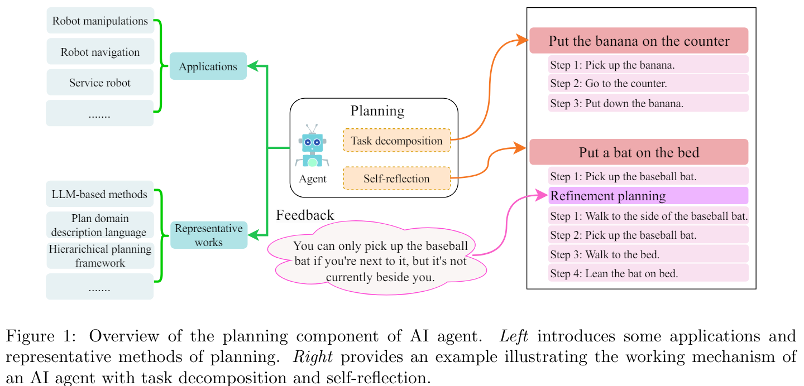
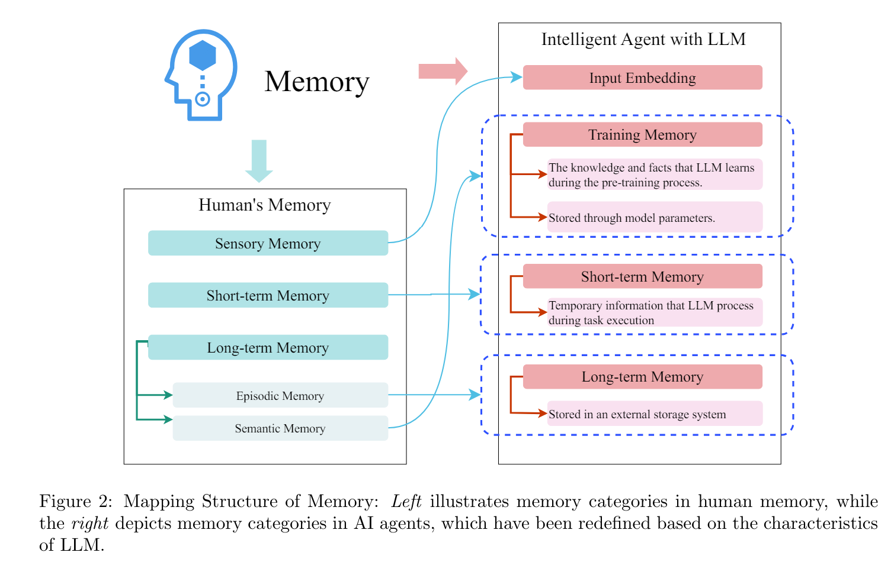

# Surveys Reviewed

This section documents key survey papers analyzed for the Ayoai research, focusing on their unique contributions rather than the individual papers they reference.

## Goal-oriented LLM Prompting Survey

**Paper**: Towards Goal-oriented Large Language Model Prompting: A Survey
- Link: https://arxiv.org/abs/2401.14043v1

**Assessment**: Limited novel insights beyond previously reviewed surveys on prompting techniques.

**Ayoai Impact**: Validated existing goal-oriented prompting approaches without introducing new methodologies.

## Scalable Instructable Multiworld Agent (SIMA)

**Source**: DeepMind's SIMA - Generalist AI Agent for 3D Virtual Environments
- Link: https://deepmind.google/discover/blog/sima-generalist-ai-agent-for-3d-virtual-environments/

**Key Contributions**:
- Comprehensive action taxonomy for 3D environments
- Multi-game generalization framework
- Visual demonstration of action categories

**Ayoai Impact**: SIMA provides crucial insights for Ayoai:
- Well-structured action categorization system
- Cross-game generalization strategies
- Visual action selection models
- Direct applicability to Roblox action design

## Large Language Models and Games Survey

**Paper**: Large Language Models and Games: A Survey and Roadmap
- Link: https://arxiv.org/abs/2402.18659

**Abstract**: Recent years have seen an explosive increase in research on large language models (LLMs), and accompanying public engagement on the topic. While starting as a niche area within natural language processing, LLMs have shown remarkable potential across a broad range of applications and domains, including games. This paper surveys the current state of the art across the various applications of LLMs in and for games, and identifies the different roles LLMs can take within a game. Importantly, we discuss underexplored areas and promising directions for future uses of LLMs in games and we reconcile the potential and limitations of LLMs within the games domain. As the first comprehensive survey and roadmap at the intersection of LLMs and games, we are hopeful that this paper will serve as the basis for groundbreaking research and innovation in this exciting new field.

**Assessment**: Comprehensive coverage of LLMs in gaming contexts with thorough analysis of current applications.

**Ayoai Impact**: Validates Ayoai's approach while highlighting known limitations in game-specific LLM applications.

## Understanding the Planning of LLM Agents

**Paper**: Understanding the planning of LLM agents: A survey
- Link: https://arxiv.org/abs/2402.02716

**Critical Contribution**: Essential framework for organizing research structure, providing comprehensive taxonomies and methodologies.

**Key Frameworks**:

1. **Planning Taxonomy**:
   

2. **Agent Processing Cycle**:
   - Perceiving the environment
   - Planning actions
   - Executing behaviors
   

3. **Comprehensive Taxonomy Chart**:
   

**Ayoai Impact**: Essential foundation providing:
- Clear taxonomical structure for planning approaches
- Perception → Planning → Execution framework
- Organizational structure for research categorization
- Baseline for comparing planning methodologies

## In-depth Survey of LLM-based AI Agents

**Paper**: An In-depth Survey of Large Language Model-based Artificial Intelligence Agents
- Link: https://arxiv.org/abs/2309.14365

**Abstract**: Due to the powerful capabilities demonstrated by large language model (LLM), there has been a recent surge in efforts to integrate them with AI agents to enhance their performance. In this paper, we have explored the core differences and characteristics between LLM-based AI agents and traditional AI agents. Specifically, we first compare the fundamental characteristics of these two types of agents, clarifying the significant advantages of LLM-based agents in handling natural language, knowledge storage, and reasoning capabilities. Subsequently, we conducted an in-depth analysis of the key components of AI agents, including planning, memory, and tool use. Particularly, for the crucial component of memory, this paper introduced an innovative classification scheme, not only departing from traditional classification methods but also providing a fresh perspective on the design of an AI agent's memory system. We firmly believe that in-depth research and understanding of these core components will lay a solid foundation for the future advancement of AI agent technology. At the end of the paper, we provide directional suggestions for further research in this field, with the hope of offering valuable insights to scholars and researchers in the field.

**Notable Visual Contributions**:

1. **Agent Architecture Overview**:
   

2. **Memory System Classification**:
   

**Ayoai Impact**: Provides valuable insights into:
- Novel memory classification approaches
- Component-based agent architecture
- Visual frameworks for system design
- Fresh perspectives on traditional classifications

## Synthesis for Ayoai

### Key Insights from Survey Analysis

1. **Planning Frameworks**
   - Multiple taxonomies available with trade-offs
   - Perception → Planning → Execution as core cycle
   - Need for real-time adaptations in gaming

2. **Memory Architectures**
   - Various classification schemes exist
   - Hierarchical structures prove most effective
   - Integration with planning systems critical

3. **Game-Specific Requirements**
   - Action taxonomies must be comprehensive (SIMA example)
   - Real-time performance constraints
   - Cross-game generalization potential

4. **Research Gaps Identified**
   - Real-time planning optimization for games
   - Efficient multi-agent coordination
   - Memory systems scaled for gaming
   - Game-specific architectural patterns

### Strategic Value

These surveys collectively provide:
- Theoretical foundations for Ayoai's approach
- Validated architectural patterns
- Identification of optimization opportunities
- Clear differentiation points from existing solutions

The synthesis of these surveys forms the academic foundation for Ayoai's technical approach, ensuring alignment with cutting-edge research while identifying specific areas for innovation in game-based AI agents.