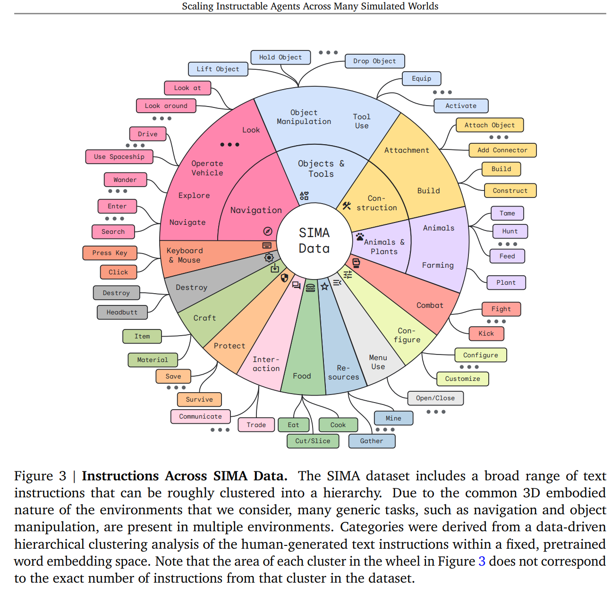
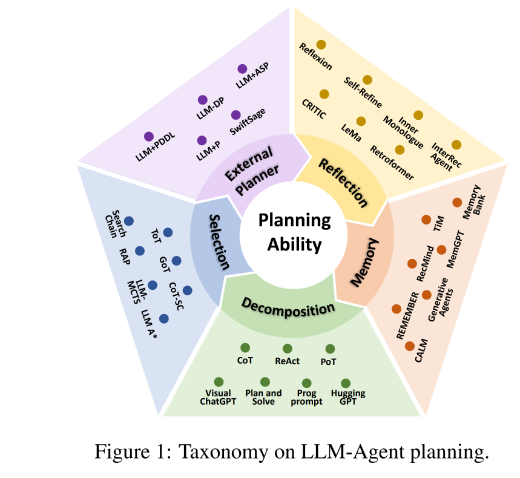
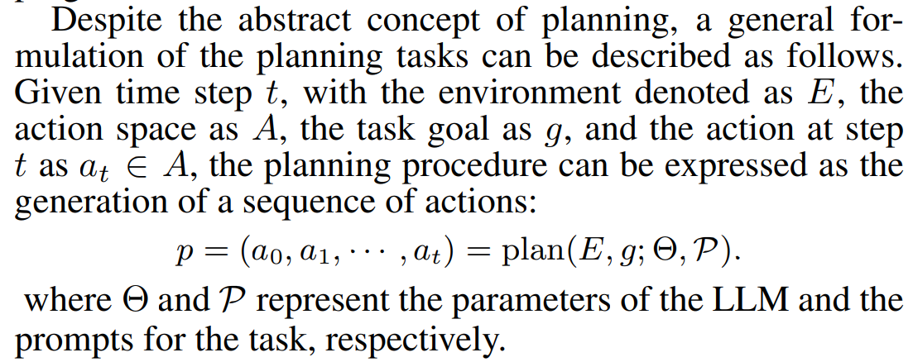
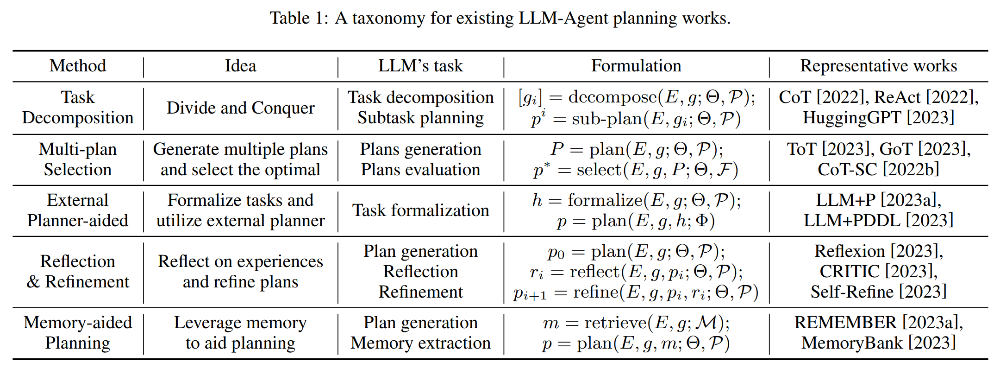
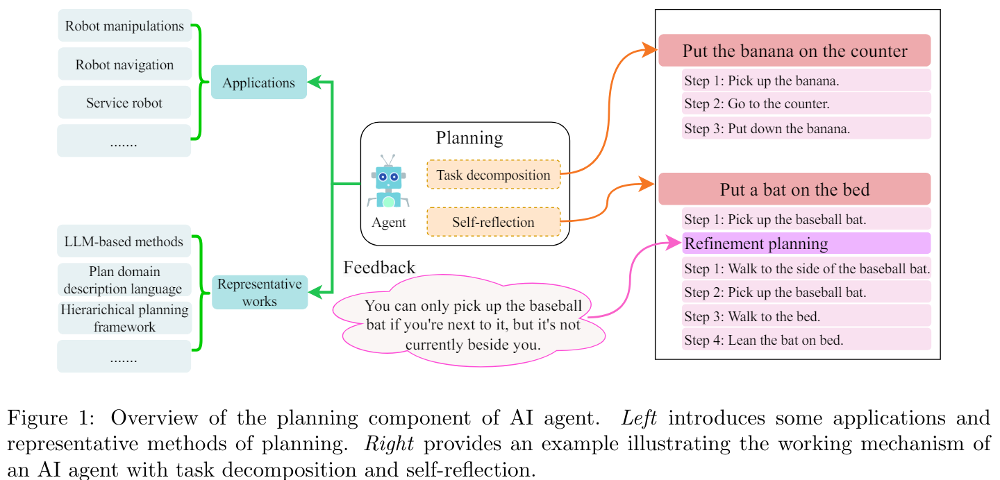

# Surveys Reviewed

I already read these surveys and put the papers the survey payer mentions in the notes below. This section will give notes on the survey itself, but not the papers the survey mentioned.

## Goal-oriented LLM Prompting Survey

- Towards Goal-oriented Large Language Model Prompting: A Survey [https://arxiv.org/abs/2401.14043v1](https://arxiv.org/abs/2401.14043v1)

  - Interesting survey paper, but redundant and did not add much over the one I already deep dived in.

**Ayoai Impact**: Limited new insights beyond other surveys reviewed.

## Scalable Instructable Multiworld Agent (SIMA)

- Interesting world model here from deep mind, wow. . .Scalable Instructable Multiworld Agent (SIMA) https://deepmind.google/discover/blog/sima-generalist-ai-agent-for-3d-virtual-environments/

  - Cool actions, I need some of these.

    - 

**Ayoai Impact**: SIMA's action taxonomy provides:
- Comprehensive action categories
- Multi-game generalization
- Visual action selection model
- Perfect reference for Roblox actions

## LLMs And Games

- Large Language Models and Games: A Survey and Roadmap https://arxiv.org/abs/2402.18659

  - Abstract

    - Recent years have seen an explosive increase in research on large language models (LLMs), and accompanying public engagement on the topic. While starting as a niche area within natural language processing, LLMs have shown remarkable potential across a broad range of applications and domains, including games. This paper surveys the current state of the art across the various applications of LLMs in and for games, and identifies the different roles LLMs can take within a game. Importantly, we discuss underexplored areas and promising directions for future uses of LLMs in games and we reconcile the potential and limitations of LLMs within the games domain. As the first comprehensive survey and roadmap at the intersection of LLMs and games, we are hopeful that this paper will serve as the basis for groundbreaking research and innovation in this exciting new field.

  - Zak Thoughts

    - I read it deep, I like his papers. Nothing new really I didn't already know though.

**Ayoai Impact**: Comprehensive games survey but limited new insights for our specific use case.

## Understanding the planning of LLM agents

- The best summary/survey paper recently that got me started with 80% of this: Understanding the planning of LLM agents: A survey ([https://arxiv.org/abs/2402.02716](https://arxiv.org/abs/2402.02716))

  - The current taxonomy for planning in llms according to this paper:

    - 

  - The level above planning? Perceiving the environment, planning, and executing actions. Planning,

    - as one of the most critical capabilities for agents....

    - 

  - Taxonomy chart summarized. . .

    - 

**Ayoai Impact**: This survey provided the foundation:
- Clear planning taxonomy
- Perception → Planning → Execution cycle
- Framework for organizing research
- 80% of initial research direction

## Agents Survey

- An In-depth Survey of Large Language Model-based Artificial Intelligence Agents https://arxiv.org/abs/2309.14365

  - I did not read this with fine tooth comb, but it looks redundant with other surveys I reviews, except for the cool summaries they put together below.

  - Abstract:

    - Due to the powerful capabilities demonstrated by large language model (LLM), there has been a recent surge in efforts to integrate them with AI agents to enhance their performance. In this paper, we have explored the core differences and characteristics between LLM-based AI agents and traditional AI agents. Specifically, we first compare the fundamental characteristics of these two types of agents, clarifying the significant advantages of LLM-based agents in handling natural language, knowledge storage, and reasoning capabilities. Subsequently, we conducted an in-depth analysis of the key components of AI agents, including planning, memory, and tool use. Particularly, for the crucial component of memory, this paper introduced an innovative classification scheme, not only departing from traditional classification methods but also providing a fresh perspective on the design of an AI agent's memory system. We firmly believe that in-depth research and understanding of these core components will lay a solid foundation for the future advancement of AI agent technology. At the end of the paper, we provide directional suggestions for further research in this field, with the hope of offering valuable insights to scholars and researchers in the field.

  - Zak thoughts

    - 

    - 

**Ayoai Impact**: Valuable visual summaries of:
- Agent component architecture
- Memory system classifications
- Fresh perspective on memory design
- Core component analysis

## Key Takeaways for Ayoai

From all surveys reviewed:

1. **Planning Taxonomy**
   - Perception → Planning → Execution
   - Multiple planning strategies available
   - Trade-offs between approaches

2. **Memory Systems**
   - Various classification schemes
   - Importance of hierarchical memory
   - Integration with planning

3. **Game-Specific Insights**
   - Action taxonomies (SIMA)
   - LLM limitations in games
   - Need for real-time performance

4. **Research Gaps**
   - Real-time planning in games
   - Multi-agent coordination
   - Efficient memory systems
   - Game-specific architectures

These surveys provide the theoretical foundation for Ayoai's approach, highlighting both opportunities and challenges in building LLM-based game agents.