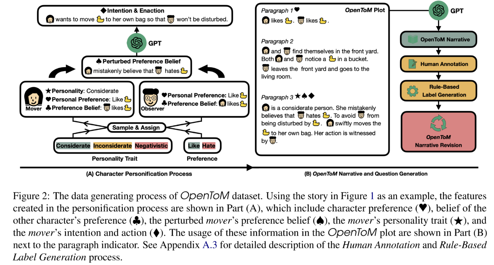
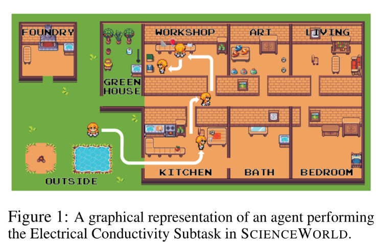
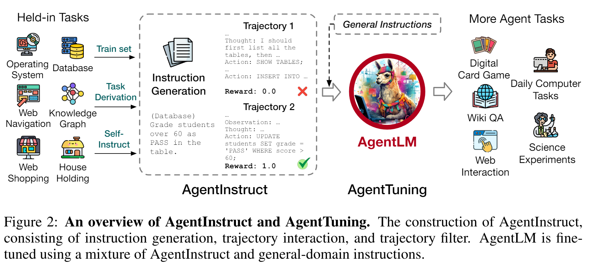
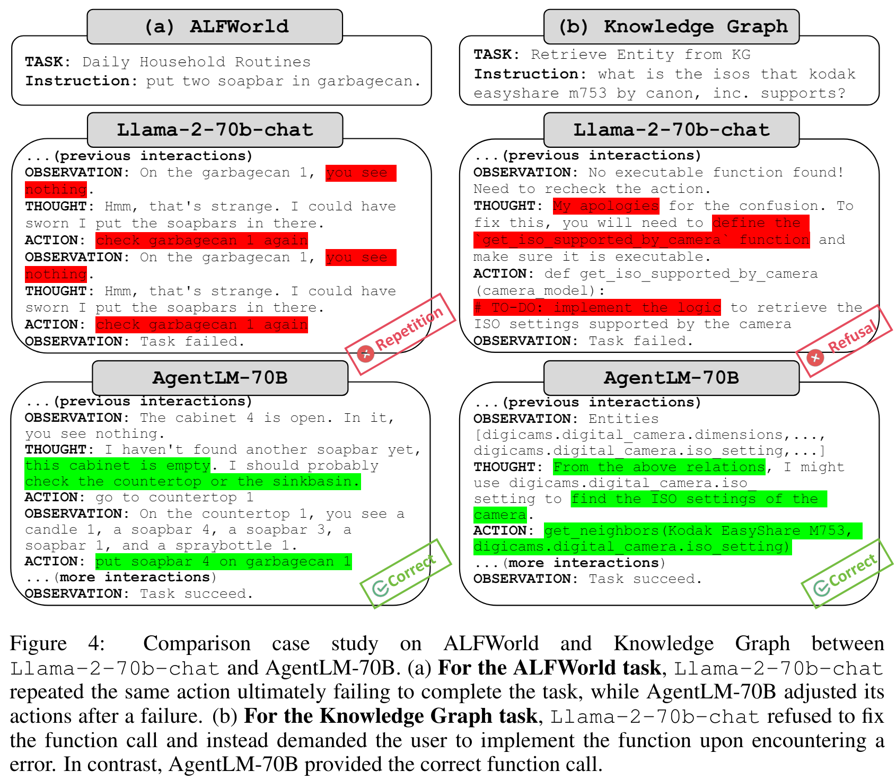
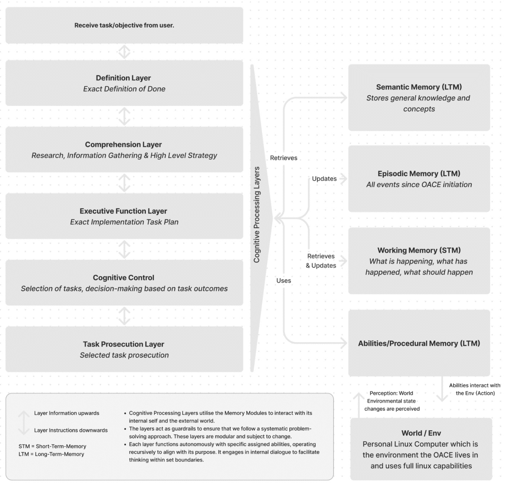
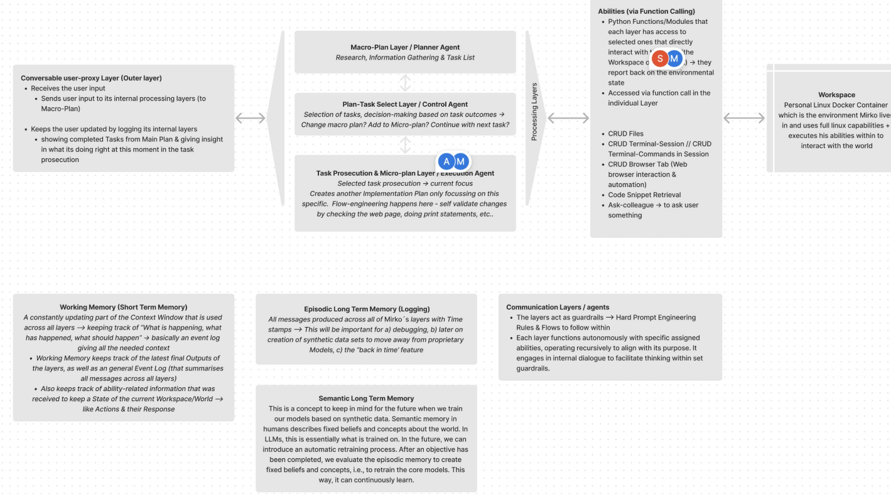
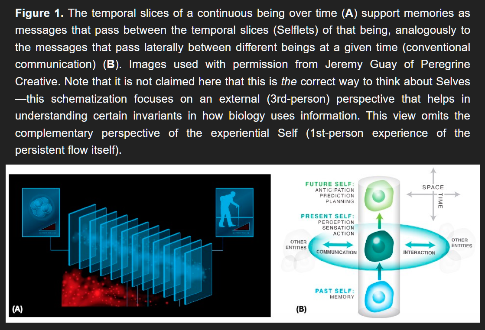
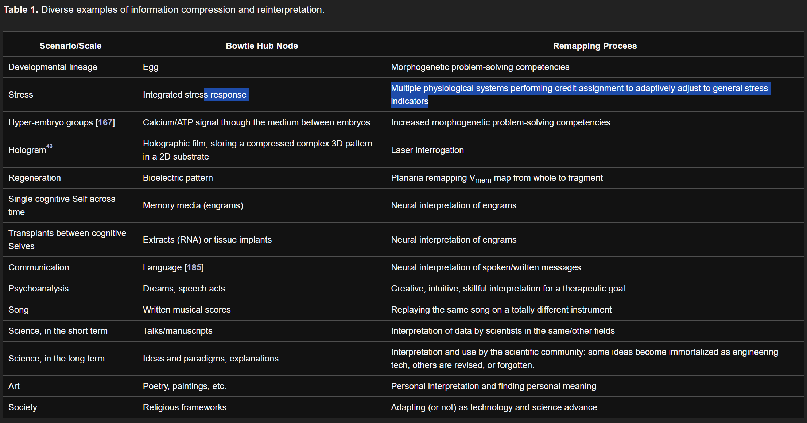

# Memory Systems Overview

This document provides an overview of memory architectures and approaches for autonomous agents, including both short-term and long-term memory systems.

## No Servers Backend Maintenance

What are things I can and should be doing for these NPCs while there are no roblox worlds going on?

### Overall Notes

- We should also have a default list of things to do when model takes too long. Model should know what to ignore and not ignore. And in down time, when the character is in a slow state of mind that does not require extra action from API, the model should be consuming info each step and checking, but if good to continue (fyi, each heart rate should be able to decide whether to continue or not (needs a flag that says not continued), then it should be forward thinking. It should have a the past to reference and go one cycle at a time ahead. I need to make time bitemporal in this map!!!! That way we can progress time and not break anything, and the model can go back in time to change it, or go back to old npc settings.

- These are the recursive loops into the lifing polls and such that each character will have. And we can look into the future on some of these to see if bad things happen. there needs to be a finalinc and personal and other social score that the algo can check easily if the moves made bad affects or not in the future.

- The forward thinking thing, like you have to simulate the world before you. Well, you can only do that on reality while you're not busy with things.

  - And like think ahead and hit the plan down. And know when you're plan is all jacked, that assumption you made changes the plan. How do you know each time?

  - Like, I wanted to simulate forward with the carat 4 game to see what would happen, but I didn't have to do that. Hmm, so you can only forward think fur certain things.

**Ayoai Impact**: This section suggests valuable offline processing opportunities:
- Memory consolidation during downtime (like sleep in humans)
- Forward simulation of plans when agents are idle
- Bitemporal design allows rewinding and exploring alternative histories
- Offline processing could reduce real-time computational load
- Premium tiers could offer more sophisticated offline processing

### Backend Activities
- Refine Memory
- Build more behavior
- Plan more goals

## Social Memory

What about remembering other things? We need an actor per relationship?

### Overall Notes

- Will need a network of npc, and who knows who, etc. Right, how are we handling that?

- Do I care about what the npc looks like?! Well actually I do. I would like to know certain statistics, but would not be needed. Like what if it had wings? Or did not have ears, I don't know. Ohh, or was a blonde hair...

### OpenToM 

- OpenToM: A Comprehensive Benchmark for Evaluating Theory-of-Mind Reasoning Capabilities of Large Language Models [https://arxiv.org/abs/2402.06044](https://arxiv.org/abs/2402.06044)

  - Abstract
    - Neural Theory-of-Mind (N-ToM), machine's ability to understand and keep track of the mental states of others, is pivotal in developing socially intelligent agents. However, prevalent N-ToM benchmarks have several shortcomings, including the presence of ambiguous and artificial narratives, absence of personality traits and preferences, a lack of questions addressing characters' psychological mental states, and limited diversity in the questions posed. In response to these issues, we construct OpenToM, a new benchmark for assessing N-ToM with (1) longer and clearer narrative stories, (2) characters with explicit personality traits, (3) actions that are triggered by character intentions, and (4) questions designed to challenge LLMs' capabilities of modeling characters' mental states of both the physical and psychological world. Using OpenToM, we reveal that state-of-the-art LLMs thrive at modeling certain aspects of mental states in the physical world but fall short when tracking characters' mental states in the psychological world.

  - Zak Thoughts?
    - Not sure I get it. . .
    - I do not really get, but I did not spend too much time. This is impressive, but it is too deep and specific. I can do that same later and in a different way.
    - It is interesting to note though - there may be some tie in here to my behavior tree where more than one npc can be controlled by one tree at a time. And those can run in parallel. For each relationship, and tree that is running, this narrative could be going on in the background? Hmmmm. It is just integration into personality, is all right? I think I already have this handled?
    - 

**Ayoai Impact**: Theory of Mind is crucial for believable social interactions:
- Agents need to model what other agents know/believe
- Relationships require tracking shared history
- Could implement as parallel "relationship trees" between agents
- Essential for coordinated multi-agent behaviors

## Embodied Memory 

Embodied memory involves finetuning the LLM with the agent's historical experiential samples, embedding memories into the model parameters. Usually the experiential samples are collected from the agents's interactions with environment, which may consist of commonsense knowledge about the environment, task-related priors, and successful or failed experiences. While the cost of training a language model with more than billions of parameters is huge, parameter-efficient fine-tuning (PEFT) techniques are leveraged to reduce cost and speed up by training a small part of parameters only, such as LoRA, QLoRA, P-tuning, et al.

### Overall Notes

- Random Notes
  - How to use something you've learned about a character in the past. So you don't just remember behaviors, you also have to remember whom they came from. So world events should also learned what caused if possible. Like Tommy was the one who punched Jack. But who was the one that caused a tornado. Mother nature?

  - What is memorizing a procedure? I think that is, based on past events, including things found when exploring around (what were those actions again?), this set of actions summed to be the best option.

  - Each npc should have their own history. I could get creative with the key of the history tree to always look at the npc first? Ugh, maybe make it less efficient in long run than having separate? So save they retrieve their or memory from the world history. Hmmmm

- Ingest history, sell history. Have history portable. . . .
  - Have history impact the core of who someone is. History can adjust LifingPolls and/or activities that make up those LifingPolls. We can sell or trade LifingPolls?! They are portable and can be inserted into npcs . . .

**Ayoai Impact**: The concept of portable, tradeable memories/experiences is revolutionary:
- Players could purchase "memory packs" for their NPCs
- Agents learn from collective experiences across games
- Creates a marketplace for agent experiences
- Memories shape personality (affecting LifingPolls)

### TDT

- TDT [Wang et al., 2022a] [https://arxiv.org/abs/2203.07540](https://arxiv.org/abs/2203.07540) (found from: Planning-of-LLM-Agents)

  - Abstract
    - ?

  - Descriptions from this planning survey:
    - Uses collected Markov decision process data to fine-tune Text Decision Transformer (TDT). It achieves better success rates on more challenging ScienceWorld [Wang et al., 2022a] tasks.

  - Zak thoughts
    - Finetune involved here.
    - 

### AgentTuning

- AgentTuning [Zeng et al., 2023] [https://arxiv.org/abs/2310.12823](https://arxiv.org/abs/2310.12823) (found from: Planning-of-LLM-Agents)

  - Abstract
    - ?

  - Descriptions from this planning survey:
    - Organizes plan trajectories from various tasks into a dialogue form to finetune the LLaMA model, showing significant improvements in performance on unseen planning tasks.

  - Zak thoughts
    - Finetune involved here.
    - 
    - 

### Twitter Notes

- Cool thread here with these notes <https://x.com/jerryjliu0/status/1797437892455022695?s=19>:

  - one
    - 1. ID-based fact extraction loop from sub statements.
    - 2. Prevent hallucination via programmatic check of sub statements being present in source data.
    - 3. `missing_facts` array at end until array is empty.
    - 4. Markdown format to balance density vs. hallucination risk of more structured format
    - 5. Thematic tags for each fact for lookup (from 2nd pass: observation -> CoT -> 3 potential conclusions -> return ID: [tag1, tag2, ...]
    - My approach keeps getting better and while having 1/10th of RAG exponentially compounding points of failure. Prompt length bigger. LLM cheaper. RAG plz stop cold calling me, I don't buy complexity.

  - Two
    - Our strategy depends on the lifespan of the memories. For short-term (e.g., one conversation), we summarize previous messages on-the-fly. For long-term (e.g., between conversations), we store core information in databases that the LLM retrieves via tools.

  - Three
    - - summarize main points
    - - topic that points to external memory ex-context window for specific details (i.e. ID that points to a larger query, think like giving your LLM an index card in a library)
    - oooh interesting, i like the idea. so you store a set of pointers that allow LLMs to access even more information?
    - almost like the memory dynamically returns a set of tools for the LLM to go and look up even more info

  - four
    - - organize topics on a hub and spoke graph w an "agenda" in the middle
    - - give topic nodes q&a pairs with "field names" for key point summarization
    - - function calling to switch nodes -> changes active prompt
    - - context only holds: summarized points, current node prompt, and possibly an index of other nodes available (if you want to also support edges between nodes)

  - five <https://twitter.com/KevinAFischer/status/1772525861968977977?s=19>
    - I can't get this idea out of my head
    - I keep seeing people wanting to construct memory systems from either:
    - (1) feed forward rag type systems
    - (2) fine tuned systems
    - What if these two pieces are supposed to be combined similar to our own memories?
    - Imagine a hybrid system which denotes memories and events during the day, and fine tunes those into parameter weights at night 🤯

  - Six
    - Four layers of memory for AI agents (WIP):
      - Log memory: raw log data of everything they do
      - Raw memory: chat logs, docs, web scrapes, etc
      - Structured memory: objects, people, relationships, etc
      - Contextual memory: user info, recent memory, world events, etc

    - "Principles Memory" layer: This layer would capture the core principles and values that guide the AI's decision-making process. It could be described as the ethical compass or the fundamental beliefs system that the AI uses to prioritize its actions and responses, ensuring alignment with ethical standards and user expectations. This might not only add depth to the AI's understanding but also ensures consistency in behavior across different scenarios, especially in cases where the AI has to make complex decisions that involve ethical considerations.

    - Meta-memory: Information about the agent's own memory systems, such as what it knows or doesn't know.

    - Collaborative memory: Information received from other agents or humans to enable knowledge sharing in multi-agent systems.

    - Love meta-memory, going to use that. I think collaborative (for me) can be mixed in under meta (capability) and log/raw (data received).

    - 

    - 

**Ayoai Impact**: These Twitter insights provide practical memory architecture patterns:
- Multi-layered memory system (log → raw → structured → contextual)
- Hybrid RAG + fine-tuning approach (day/night cycle)
- Memory as dynamic tool generation
- Hub-and-spoke organization for topic management

### Working memory

- Working memory performance is tied to stimulus complexity <https://www.nature.com/articles/s42003-023-05486-7>

  - Abstract
    - Working memory is the cognitive capability to maintain and process information over short periods. Behavioral and computational studies have shown that visual information is associated with working memory performance. However, the underlying neural correlates remain unknown. To identify how visual information affects working memory performance, we conducted behavioral experiments in pigeons (Columba livia) and single unit recordings in the avian prefrontal analog, the nidopallium caudolaterale (NCL). Complex pictures featuring luminance, spatial and color information, were associated with higher working memory performance compared to uniform gray pictures in conjunction with distinct neural coding patterns. For complex pictures, we found a multiplexed neuronal code displaying visual and value-related features that switched to a representation of the upcoming choice during a delay period. When processing gray stimuli, NCL neurons did not multiplex and exclusively represented the choice already during stimulus presentation and throughout the delay period. The prolonged representation possibly resulted in a decay of the memory trace ultimately leading to a decrease in performance. In conclusion, we found that high stimulus complexity is associated with neuronal multiplexing of the working memory representation possibly allowing a facilitated read-out of the neural code resulting in enhancement of working memory performance.

  - Zak thoughts
    - Cool, I could figure this out in my code and use these as memories to save more readily or something? "we found that high stimulus complexity is associated with neuronal multiplexing of the working memory representation"

**Ayoai Impact**: This neuroscience finding suggests optimization strategies:
- Complex, rich memories are easier to recall than simple ones
- Multiplexed encoding (multiple features) improves retention
- Could prioritize saving vivid, multi-sensory experiences
- Aligns with human memory patterns (we remember dramatic events better)

### Computational Boundary of a "Self"

- Self-Improvising Memory: A Perspective on Memories as Agential, Dynamically Reinterpreting Cognitive Glue <https://www.mdpi.com/1099-4300/26/6/481>

  - Abstract
    - Many studies on memory emphasize the material substrate and mechanisms by which data can be stored and reliably read out. Here, I focus on complementary aspects: the need for agents to dynamically reinterpret and modify memories to suit their ever-changing selves and environment. Using examples from developmental biology, evolution, and synthetic bioengineering, in addition to neuroscience, I propose that a perspective on memory as preserving salience, not fidelity, is applicable to many phenomena on scales from cells to societies. Continuous commitment to creative, adaptive confabulation, from the molecular to the behavioral levels, is the answer to the persistence paradox as it applies to individuals and whole lineages. I also speculate that a substrate-independent, processual view of life and mind suggests that memories, as patterns in the excitable medium of cognitive systems, could be seen as active agents in the sense-making process. I explore a view of life as a diverse set of embodied perspectives---nested agents who interpret each other's and their own past messages and actions as best as they can (polycomputation). This synthesis suggests unifying symmetries across scales and disciplines, which is of relevance to research programs in Diverse Intelligence and the engineering of novel embodied minds.

  - Zak Thoughts
    - "The material present in the form of memory traces being subjected from time to time to a rearrangement in accordance with fresh circumstances---to a re-transcription." Sigmund Freud writing to Wilhelm Fliess on 2 November 1896

      - Confabulation is a kind of cognitive plasticity that emphasizes the present, the future, and the gestalt over the literal past---it occurs when a mind actively modifies and fits its beliefs to a current context, altering and reinterpreting memory data as needed to preserve various psychological elements in the story that it tells to others and to itself.

    - 

    - "No man ever steps in the same river twice. For it's not the same river and he's not the same man." Heraclitus

    - 

**Ayoai Impact**: This philosophical perspective on memory is profound for agent design:
- Memories should be dynamic, not static records
- Agents reinterpret past experiences based on current context
- "Confabulation" creates narrative coherence, not factual accuracy
- Memories evolve as the agent's personality develops
- This creates more human-like, believable agents who grow and change