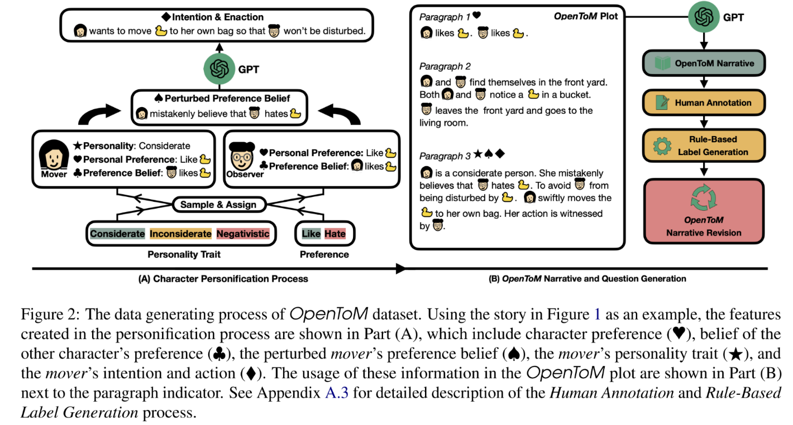
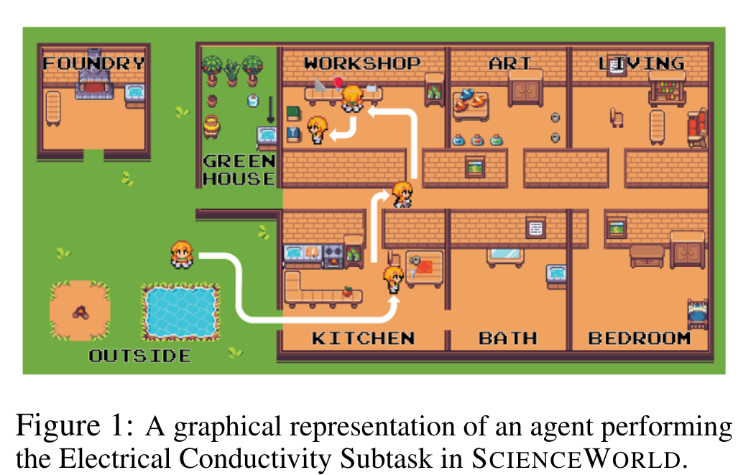
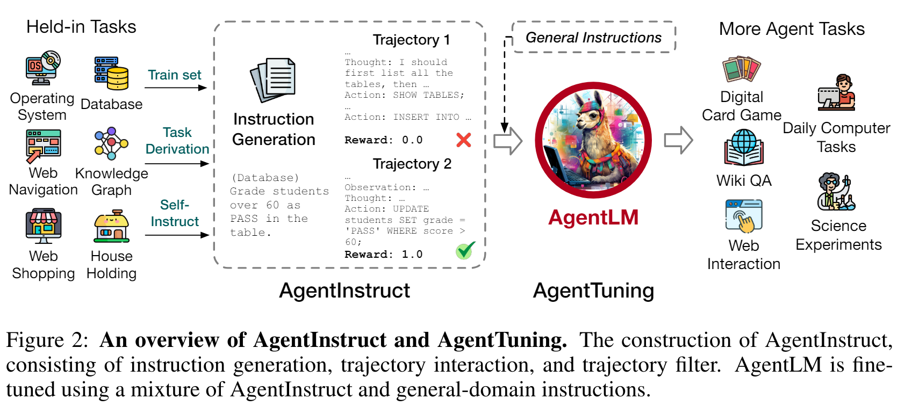
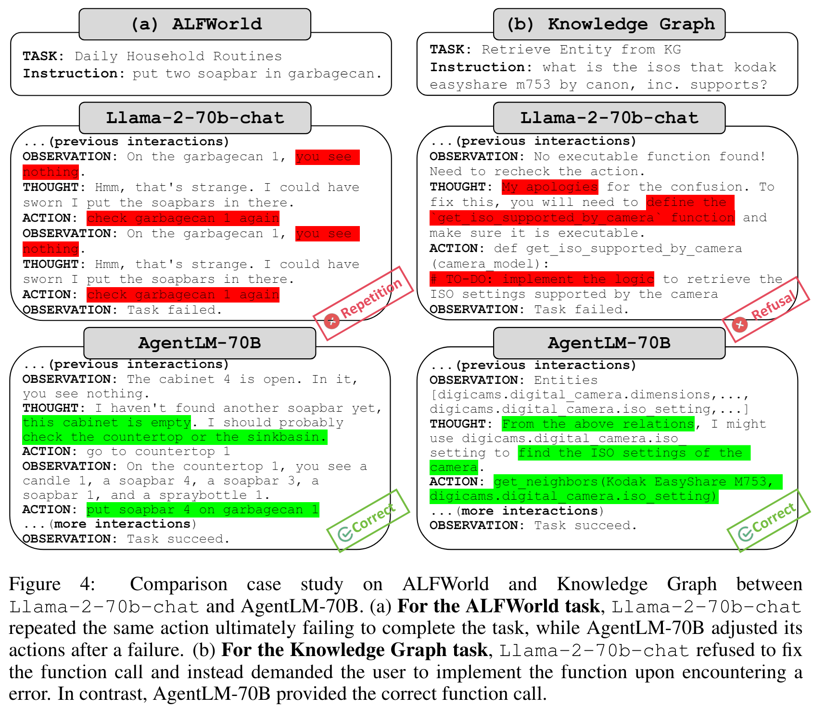
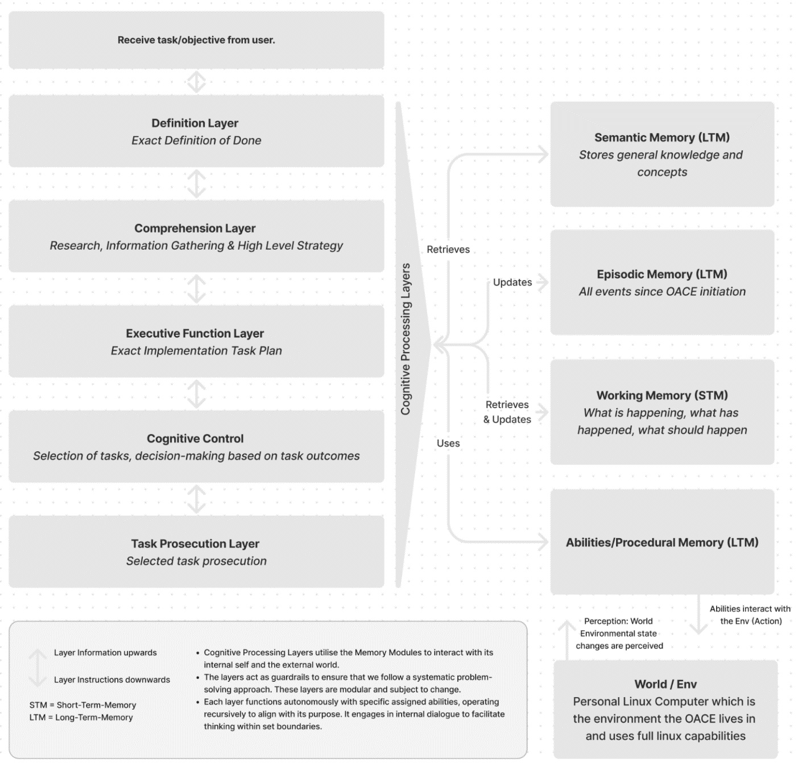
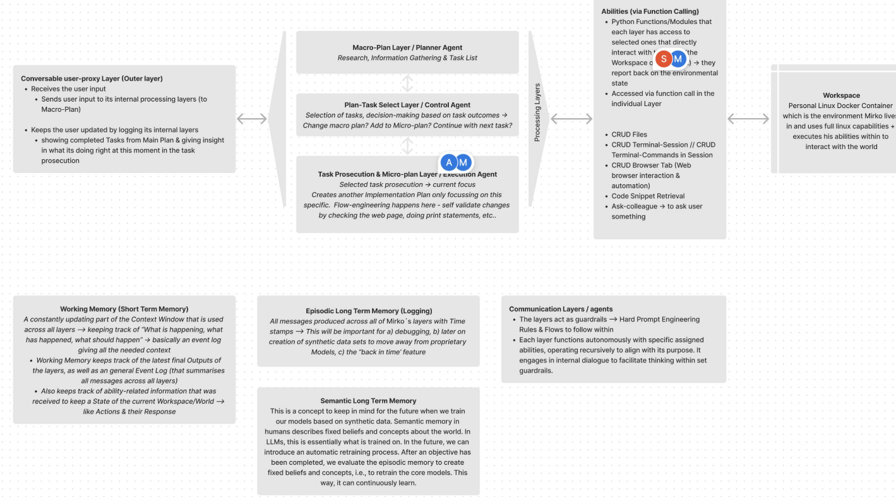
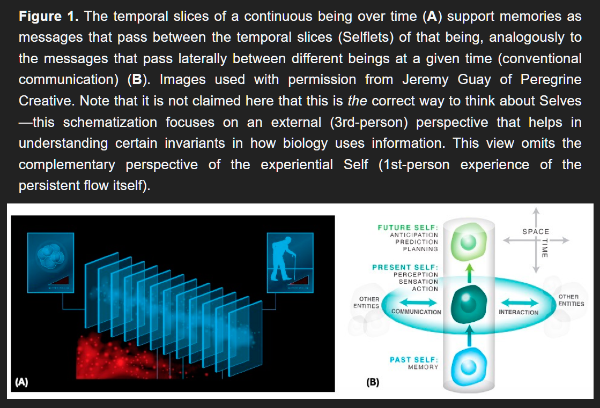
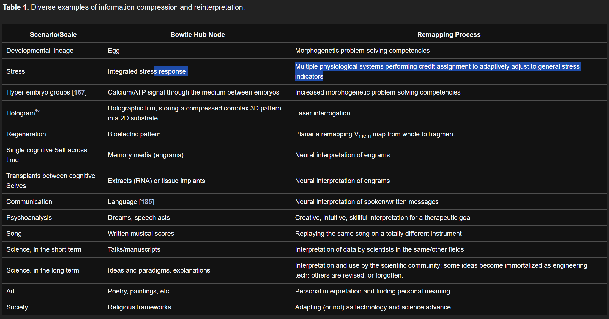

# Memory Systems Overview

This document provides an overview of memory architectures and approaches for autonomous agents, including both short-term and long-term memory systems.

## Offline Processing and Memory Maintenance

### Core Concept

When agents are not actively engaged in gameplay, backend systems can perform essential cognitive maintenance and optimization tasks.

### Key Processing Activities

**Memory Consolidation**:
- Process recent experiences into long-term memory
- Identify patterns and extract learnings
- Update belief systems based on accumulated evidence

**Forward Simulation**:
- Plan future actions based on current goals
- Simulate potential outcomes of different strategies
- Pre-compute responses to likely scenarios

**Temporal Architecture**:
- **Bitemporal Design**: Maintain both "valid time" and "transaction time"
- **Rewind Capability**: Explore alternative histories and decisions
- **Progressive Time**: Advance agent state during offline periods
- **Checkpoint System**: Save and restore agent states

### Decision Framework

**Continuation Logic**:
- Each processing cycle evaluates whether to continue or pause
- Priority system determines what to process when resources are limited
- Scoring mechanisms (financial, personal, social) guide decision-making

**Ayoai Impact**: 
- **Performance Optimization**: Reduce real-time computational load by pre-processing
- **Richer Behaviors**: Agents that "think" during downtime feel more alive
- **Tiered Services**: Premium agents get more sophisticated offline processing
- **Emergent Planning**: Forward simulation creates surprising strategic behaviors

### Backend Processing Pipeline

1. **Memory Refinement**: Consolidate experiences, compress redundant data, strengthen important memories
2. **Behavior Generation**: Create new behavioral patterns based on learned experiences
3. **Goal Planning**: Develop long-term objectives and sub-goal hierarchies

## Social Memory Architecture

### Relationship Networks

Social memory requires sophisticated tracking of interpersonal relationships and shared experiences.

**Core Components**:
- **Relationship Graphs**: Network representation of who knows whom
- **Shared Memories**: Events experienced together by multiple agents
- **Social Attributes**: Track relevant characteristics (appearance, role, history)
- **Perception Filters**: Physical attributes affect social interactions (e.g., recognizing someone by their wings or hair color)

### OpenToM 

- OpenToM: A Comprehensive Benchmark for Evaluating Theory-of-Mind Reasoning Capabilities of Large Language Models [https://arxiv.org/abs/2402.06044](https://arxiv.org/abs/2402.06044)

  - Abstract
    - Neural Theory-of-Mind (N-ToM), machine's ability to understand and keep track of the mental states of others, is pivotal in developing socially intelligent agents. However, prevalent N-ToM benchmarks have several shortcomings, including the presence of ambiguous and artificial narratives, absence of personality traits and preferences, a lack of questions addressing characters' psychological mental states, and limited diversity in the questions posed. In response to these issues, we construct OpenToM, a new benchmark for assessing N-ToM with (1) longer and clearer narrative stories, (2) characters with explicit personality traits, (3) actions that are triggered by character intentions, and (4) questions designed to challenge LLMs' capabilities of modeling characters' mental states of both the physical and psychological world. Using OpenToM, we reveal that state-of-the-art LLMs thrive at modeling certain aspects of mental states in the physical world but fall short when tracking characters' mental states in the psychological world.

  - **Implementation Insights**:
    - Theory of Mind capabilities enable agents to model other agents' mental states
    - Parallel "relationship trees" could run alongside main behavior trees
    - Each relationship maintains its own narrative and shared history
    - Integrates with personality system for context-aware interactions
    - 

**Ayoai Impact**: Theory of Mind is crucial for believable social interactions:
- Agents need to model what other agents know/believe
- Relationships require tracking shared history
- Could implement as parallel "relationship trees" between agents
- Essential for coordinated multi-agent behaviors

## Embodied Memory 

Embodied memory involves finetuning the LLM with the agent's historical experiential samples, embedding memories into the model parameters. Usually the experiential samples are collected from the agents's interactions with environment, which may consist of commonsense knowledge about the environment, task-related priors, and successful or failed experiences. While the cost of training a language model with more than billions of parameters is huge, parameter-efficient fine-tuning (PEFT) techniques are leveraged to reduce cost and speed up by training a small part of parameters only, such as LoRA, QLoRA, P-tuning, et al.

### Memory Attribution and Portability

**Attribution System**:
- Track source of learned behaviors (who performed the action)
- Distinguish agent-caused vs environmental events
- Maintain causal chains for complex event sequences

**Procedural Memory**:
- Memorized procedures emerge from successful action sequences
- Pattern recognition identifies optimal strategies
- Exploration outcomes contribute to procedural knowledge

**Memory Architecture Considerations**:
- Individual agent histories vs shared world history
- Efficient retrieval through agent-centric indexing
- Balance between storage efficiency and access speed

**Memory as Commodity**:
- **Portable Experiences**: Package and transfer memories between agents
- **Experience Marketplace**: Buy/sell/trade memory packs
- **Personality Shaping**: Memories dynamically adjust LifingPolls
- **Identity Evolution**: Core personality traits shaped by accumulated history

**Ayoai Impact**: The concept of portable, tradeable memories/experiences is revolutionary:
- Players could purchase "memory packs" for their NPCs
- Agents learn from collective experiences across games
- Creates a marketplace for agent experiences
- Memories shape personality (affecting LifingPolls)

### TDT

- TDT [Wang et al., 2022a] [https://arxiv.org/abs/2203.07540](https://arxiv.org/abs/2203.07540) (found from: Planning-of-LLM-Agents)

  - Abstract
    - ?

  - Descriptions from this planning survey:
    - Uses collected Markov decision process data to fine-tune Text Decision Transformer (TDT). It achieves better success rates on more challenging ScienceWorld [Wang et al., 2022a] tasks.

  - **Key Insight**: Fine-tuning on collected MDP data improves task performance
    - 

### AgentTuning

- AgentTuning [Zeng et al., 2023] [https://arxiv.org/abs/2310.12823](https://arxiv.org/abs/2310.12823) (found from: Planning-of-LLM-Agents)

  - Abstract
    - ?

  - Descriptions from this planning survey:
    - Organizes plan trajectories from various tasks into a dialogue form to finetune the LLaMA model, showing significant improvements in performance on unseen planning tasks.

  - **Key Insight**: Dialogue-format plan trajectories enable effective transfer learning
    - 
    - 

### Practical Memory Architecture Patterns

**Thread: Memory System Design** (<https://x.com/jerryjliu0/status/1797437892455022695?s=19>)

**1. Fact Extraction Architecture**:
- ID-based fact extraction with validation loops
- Programmatic hallucination prevention through source verification
- Iterative `missing_facts` processing until complete
- Markdown format balances information density with accuracy
- Thematic tagging system for efficient retrieval (observation → CoT → conclusions → tags)
- Simplified approach reduces RAG complexity while improving reliability

**2. Temporal Memory Strategies**:
- **Short-term**: On-the-fly summarization during conversations
- **Long-term**: Database storage with tool-based retrieval

**3. Pointer-Based Memory**:
- Memory returns pointers to detailed information
- Dynamic tool generation for deep memory access
- Index card metaphor - lightweight references to heavy data

**4. Hub-and-Spoke Architecture**:
- Central "agenda" node with topic spokes
- Q&A pairs at nodes for summarization
- Function calling enables node switching
- Minimal context maintains efficiency

**5. Hybrid RAG-Finetuning Approach** ([Kevin Fischer](https://twitter.com/KevinAFischer/status/1772525861968977977?s=19)):
- Day: Collect experiences via RAG systems
- Night: Fine-tune experiences into model parameters
- Mimics human memory consolidation during sleep

**6. Four-Layer Memory Model**:
1. **Log Memory**: Raw event data
2. **Raw Memory**: Unprocessed interactions and content
3. **Structured Memory**: Organized entities and relationships
4. **Contextual Memory**: Current state and recent events

**Additional Layers**:
- **Principles Memory**: Core values and ethical guidelines
- **Meta-Memory**: Self-awareness of knowledge limits
- **Collaborative Memory**: Shared knowledge from other agents

**Ayoai Impact**: These Twitter insights provide practical memory architecture patterns:
- Multi-layered memory system (log → raw → structured → contextual)
- Hybrid RAG + fine-tuning approach (day/night cycle)
- Memory as dynamic tool generation
- Hub-and-spoke organization for topic management

### Working memory

- Working memory performance is tied to stimulus complexity <https://www.nature.com/articles/s42003-023-05486-7>

  - Abstract
    - Working memory is the cognitive capability to maintain and process information over short periods. Behavioral and computational studies have shown that visual information is associated with working memory performance. However, the underlying neural correlates remain unknown. To identify how visual information affects working memory performance, we conducted behavioral experiments in pigeons (Columba livia) and single unit recordings in the avian prefrontal analog, the nidopallium caudolaterale (NCL). Complex pictures featuring luminance, spatial and color information, were associated with higher working memory performance compared to uniform gray pictures in conjunction with distinct neural coding patterns. For complex pictures, we found a multiplexed neuronal code displaying visual and value-related features that switched to a representation of the upcoming choice during a delay period. When processing gray stimuli, NCL neurons did not multiplex and exclusively represented the choice already during stimulus presentation and throughout the delay period. The prolonged representation possibly resulted in a decay of the memory trace ultimately leading to a decrease in performance. In conclusion, we found that high stimulus complexity is associated with neuronal multiplexing of the working memory representation possibly allowing a facilitated read-out of the neural code resulting in enhancement of working memory performance.

  - **Implementation Insight**: High stimulus complexity enhances memory retention through neuronal multiplexing. This suggests prioritizing rich, multi-feature experiences for long-term storage.

**Ayoai Impact**: This neuroscience finding suggests optimization strategies:
- Complex, rich memories are easier to recall than simple ones
- Multiplexed encoding (multiple features) improves retention
- Could prioritize saving vivid, multi-sensory experiences
- Aligns with human memory patterns (we remember dramatic events better)

### Computational Boundary of a "Self"

- Self-Improvising Memory: A Perspective on Memories as Agential, Dynamically Reinterpreting Cognitive Glue <https://www.mdpi.com/1099-4300/26/6/481>

  - Abstract
    - Many studies on memory emphasize the material substrate and mechanisms by which data can be stored and reliably read out. Here, I focus on complementary aspects: the need for agents to dynamically reinterpret and modify memories to suit their ever-changing selves and environment. Using examples from developmental biology, evolution, and synthetic bioengineering, in addition to neuroscience, I propose that a perspective on memory as preserving salience, not fidelity, is applicable to many phenomena on scales from cells to societies. Continuous commitment to creative, adaptive confabulation, from the molecular to the behavioral levels, is the answer to the persistence paradox as it applies to individuals and whole lineages. I also speculate that a substrate-independent, processual view of life and mind suggests that memories, as patterns in the excitable medium of cognitive systems, could be seen as active agents in the sense-making process. I explore a view of life as a diverse set of embodied perspectives---nested agents who interpret each other's and their own past messages and actions as best as they can (polycomputation). This synthesis suggests unifying symmetries across scales and disciplines, which is of relevance to research programs in Diverse Intelligence and the engineering of novel embodied minds.

### Dynamic Memory Reinterpretation

**Core Philosophy** (Freud to Fliess, 1896):
"Memory traces undergo rearrangement in accordance with fresh circumstances—a re-transcription."

**Confabulation as Feature**:
- Cognitive plasticity prioritizes coherent narrative over literal accuracy
- Memories actively modified to fit current context
- Preserves psychological continuity over factual fidelity
- Creates believable, evolving agent personalities

**Heraclitus Principle**:
"No man ever steps in the same river twice. For it's not the same river and he's not the same man."
- Both agent and memories evolve continuously
- Past experiences reinterpreted through current lens

**Ayoai Impact**: This philosophical perspective on memory is profound for agent design:
- Memories should be dynamic, not static records
- Agents reinterpret past experiences based on current context
- "Confabulation" creates narrative coherence, not factual accuracy
- Memories evolve as the agent's personality develops
- This creates more human-like, believable agents who grow and change