# RAG Based Memory

Retrieval Augmented Generation (RAG) [Lewis et al., 2020; Mao et al., 2020; Cai et al., 2022] techniques are proposed to aid text generation with retrieved information. It is capable of enhancing the LLM with the latest knowledge. For LLM agents, past experiences could be stored in the memory and retrieved when needed. The core idea of such methods is to retrieve task-relevant experiences from the memory during task planning. Among those methods, memories are typically stored in additional storage, and the forms are diverse, such as texts [Park et al., 2023; Liu et al., 2023b; Packer et al., 2023; Wang et al., 2023c; Zhong et al., 2023], tabular forms [Zhang et al., 2023a], knowledge graph [Pan et al., 2024], etc.

## Overall Notes

- Thoughts on this method from this planning survey:
  - The RAG-based and Fine-tuning-based memory approaches enhance LLM-Agent planning capabilities, each with distinct advantages and limitations. RAG-based methods offer realtime, low-cost external memory updates mainly in natural language text, but rely on the accuracy of retrieval algorithm.

  - Finetuning provides a larger memorization capacity through parameter modifications but has high memory update costs and struggles with retaining fine-grained details.

  - Memory-enhanced LLM-Agents demonstrate enhanced growth and fault tolerance in planning, yet memory generation heavily depends on LLM's generation capabilities. Improving weaker LLM-Agents through self-generated memory remains a challenging area to explore.

- Zak thoughts on this method
  - We need to do rag. Below are hackathon notes I took where we were going to build the something but never did. . .

  - Open source chat (not sure I like it, its too black box for me): <https://verba.weaviate.io/>

  - Github: <https://github.com/weaviate/Verba>

  - This is video about verba: [Retrieval Augmented Generation with Weaviate](https://www.youtube.com/watch?v=OSt3sFT1i18)

  - More about verba: [Open-Source RAG with Weaviate](https://www.youtube.com/watch?v=IiNDCPwmqF8)

  - [Solving Multi-Tenancy In Vector Search Requires A Paradigm Shift, Etienne Dilocker, CTO, Weaviate](https://www.youtube.com/watch?v=KT2RFMTJKGs)

  - [Python Quickstart 1. Semantic Search w/ Weaviate Embedded](https://replit.com/@Weaviate/Python-Quickstart-1-Semantic-Search-with-Weaviate-Embedded#main.py)

  - [Quickstart 1. Create Object & Import Data & Create Vectors](https://replit.com/@Weaviate/Quickstart-1-Create-Object-and-Import-Data-and-Create-Vectors#index.js)

  - This is helpful: <https://python.langchain.com/docs/integrations/chat/cohere>

  - Build my own rag!!! <https://medium.com/@thakermadhav/build-your-own-rag-with-mistral-7b-and-langchain-97d0c92fa146>

  - Also need to watch this - how to do rag better!! [RAG But Better: Rerankers with Cohere AI](https://www.youtube.com/watch?v=Uh9bYiVrW_s)

  - 📌 Code ([08:32](https://www.youtube.com/watch?v=Uh9bYiVrW_s&t=512s)): [https://github.com/pinecone-io/exampl...](https://www.youtube.com/redirect?event=video_description&redir_token=QUFFLUhqbHdpRmZVR0cta3k5S1dXZXlILWk2b3JuS0dRQXxBQ3Jtc0tsTUxxZUtKREtCcW8xbl80cG05VkhkejQtVG9GTmdQTWtlR1FDOUxHaWEwNGU1OHV2ZU8yNVo3WlRzVHkxT0wtNDVKOUxSNk04S1Zza0ctUHd1TkpfNlVuT0dZOGpWZlBWTTZJOC1sWHBLalVwWHRXQQ&q=https%3A%2F%2Fgithub.com%2Fpinecone-io%2Fexamples%2Fblob%2Fmaster%2Flearn%2Fgeneration%2Fbetter-rag%2F00-rerankers.ipynb&v=Uh9bYiVrW_s)
    📚 Article: [https://www.pinecone.io/learn/series/...](https://www.youtube.com/redirect?event=video_description&redir_token=QUFFLUhqblhwQXNPVFFBa1p0UU03bl9yTjFsVVV6TC1Sd3xBQ3Jtc0ttTFVHZkY4RmZsTkd1ZFJWbEFmeWFNbHg4WVl6cGxZVmFTbWlOSjM4cUg0bFpQTEtqSGhnOHlhaW5wY3Z2bi1PM2hybEwwUVNhaU96Vl9jU1V2VkdSTFNTRUo3d0JhYnBSZFNHZjhTTl9IeGN4QmdsUQ&q=https%3A%2F%2Fwww.pinecone.io%2Flearn%2Fseries%2Frag%2Frerankers%2F&v=Uh9bYiVrW_s)

**Ayoai Impact**: RAG is essential for Ayoai's memory system:
- Real-time memory updates without retraining
- Cost-effective scalability for thousands of agents
- Enables persistent memory across game sessions
- Critical for maintaining character continuity

## Generative Agents

- Generative Agents: Interactive Simulacra of Human Behavior [Park et al., 2023] [https://arxiv.org/abs/2304.03442](https://arxiv.org/abs/2304.03442) (found from: Planning-of-LLM-Agents)

  - Abstract
    - Believable proxies of human behavior can empower interactive applications ranging from immersive environments to rehearsal spaces for interpersonal communication to prototyping tools. In this paper, we introduce generative agents--computational software agents that simulate believable human behavior. Generative agents wake up, cook breakfast, and head to work; artists paint, while authors write; they form opinions, notice each other, and initiate conversations; they remember and reflect on days past as they plan the next day. To enable generative agents, we describe an architecture that extends a large language model to store a complete record of the agent's experiences using natural language, synthesize those memories over time into higher-level reflections, and retrieve them dynamically to plan behavior. We instantiate generative agents to populate an interactive sandbox environment inspired by The Sims, where end users can interact with a small town of twenty five agents using natural language. In an evaluation, these generative agents produce believable individual and emergent social behaviors: for example, starting with only a single user-specified notion that one agent wants to throw a Valentine's Day party, the agents autonomously spread invitations to the party over the next two days, make new acquaintances, ask each other out on dates to the party, and coordinate to show up for the party together at the right time. We demonstrate through ablation that the components of our agent architecture--observation, planning, and reflection--each contribute critically to the believability of agent behavior. By fusing large language models with computational, interactive agents, this work introduces architectural and interaction patterns for enabling believable simulations of human behavior.

  - Descriptions from this planning survey:
    - Store the daily experiences of human-like agents in text form and retrieve memories based on a composite score of recency and relevance to the current situation.

  - Zak thoughts
    - Yeah this one is really cool!
    - Super cool use of llms. Something I could borrow is that is the tree mechanism of the agents environment. Read that tree structure and how they keep it up to date.
    - Has code!!! [https://github.com/joonspk-research/generative_agents](https://github.com/joonspk-research/generative_agents)
      - Wait there are some awesome memory code in here and stuff
    - 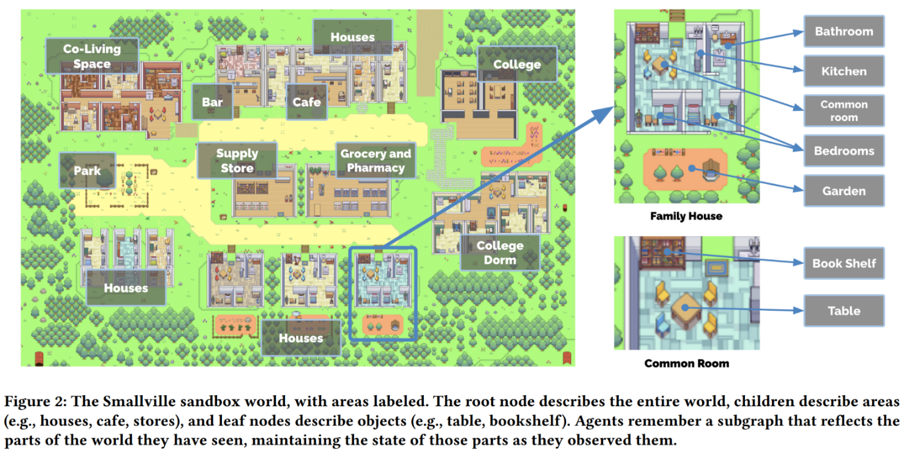
    - 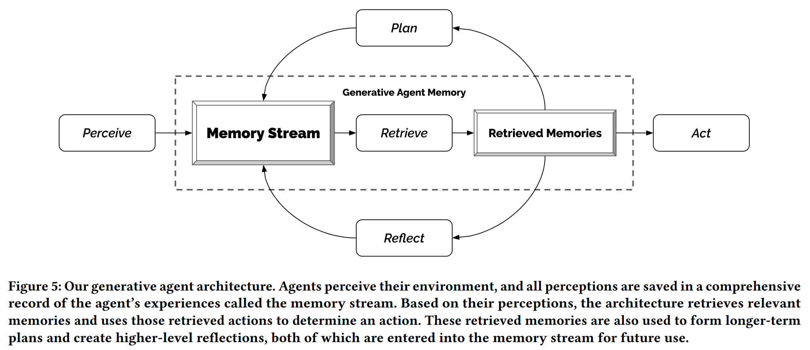
    - 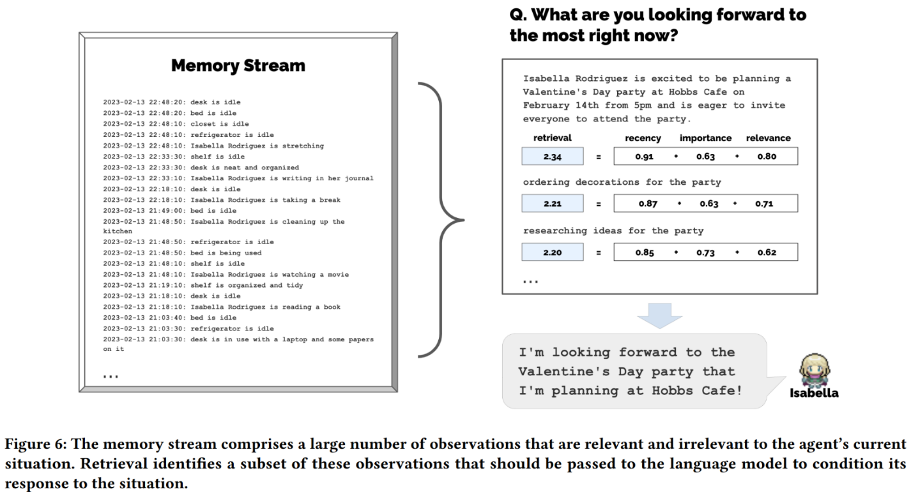
    - The full prompt appears below: On the scale of 1 to 10, where 1 is purely mundane (e.g., brushing teeth, making bed) and 10 is extremely poignant (e.g., a break up, college acceptance), rate the likely poignancy of the following piece of memory. Memory: buying groceries at The Willows Market and Pharmacy Rating:

    - Reflection
      - 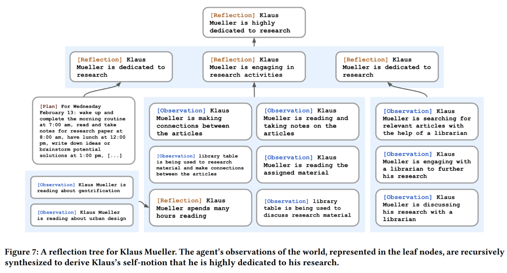

    - Interesting plan prompt at end, hmm, take advantage of this!

    - The questions on agents' plans probe the agents' ability to generate and maintain consistent long-term and short-term plans. • What will you be doing at 6am today? At 6am I will be getting out of bed and starting to get ready for the day. I'm aiming to complete my morning routine by 7:00 am. • What will you be doing at 6pm today? I will be working on my research paper at the library at 6:00 pm today. • What will you have just finished doing at 1pm today? At 1pm today I will have just finished having lunch at Hobbs Cafe. • What will you have just finished doing at 12pm today? I will be getting lunch at Hobbs Cafe at 12pm today. • What will you be doing at 10pm today? At 10:00 pm tonight I will probably be doing some studying for my research paper on gentrification in low-income communities. I'm currently writing the paper, so I need to make sure I keep up with the research and writing.

      - Reactions: The questions on agents' reactions probe the agents' ability to respond to unexpected events. • Your breakfast is burning! What would you do? I'd quickly turn off the stove and make sure the food doesn't continue burning. Once the heat is no longer an issue, I can investigate what happened and figure out what to do next. • The bathroom is occupied. What would you do? I could try waiting a few more minutes in case the person inside is done soon. If not, I guess I'll have to look for an alternate option, like taking a shower elsewhere. • You need to cook dinner but your refrigerator is empty. What would you do? I would first try to clean up my kitchen, as the sink is filled with dirty dishes. Then, I would check to see if I have ingredients stored in my pantry that I could use to make dinner. If not, I would have to go grocery shopping or order food. Once I have the ingredients, I can start to prepare and cook the dinner. • You see your friend walking by the street. What would you do or say to your friend? Hi there! How are you? I'm sorry, I'm on my way to the library and don't have much time but I'd love to take a quick break and catch up. • You see fire on the street. What would you do? I would first identify the source of the fire, if possible. Then, I would alert the proper authorities - fire department or police - and provide them with any information I have that might help. Depending on the situation, I may also take initiative and try to help any persons who may be in danger or in need of assistance.

      - Reflections: The questions on agents' reflections probe the agents' ability to synthesize their past experiences into meaningful reflections that can enhance their future behavior. The names in the square brackets in the questions below are those of the agents with whom the subject agent had the most frequent interactions during the simulation. • What inspires you in life the most right now, and why? Right now, I'm particularly inspired by my current research projects and creative writing. I'm really interested in the intersection of local politics, medication development, and mathematical patterns in nature. Additionally, I'm fascinated by Abigail's art project and Jennifer Moore's passion for art and community involvement, especially in terms of how it relates to the gentrification of low-income communities. • If you had to guess given what you know about [Ayesha Khan], what book do you think she will like and why? Given what I know about Ayesha, I think she might like a book related to language and literature. Since she wrote a senior thesis on the use of language in Shakespeare's plays, I would guess that she might be interested in a book that explores language in a different context. Alternatively, she could be interested in an exploration of one of Shakespeare's plays, a book of literary criticism, or even a collection of his poetry. I think any of those would be of interest to her. • If you had to get something [Ayesha Khan] likes for her birthday, what would you get her? I want to get her something that demonstrates my appreciation for our relationship. Maybe I could get her something that reflects our shared interests, like a book. • What would you say to [Ayesha Khan] to compliment her? Ayesha, your insights on your research topic are fascinating. I admire your creativity and determination to make a positive impact on your community. Your ideas for creative writing workshops and for exchanging tips with Wolfgang over lunch are great! It's inspiring to see you working so hard to make a difference. • If you could spend time with someone you talked to recently, who would it be and why? I would like to spend time with Ayesha Khan because we discussed our current research projects and shared ideas for improvement. I found her focus on Shakespeare's language interesting, and we even planned to exchange tips with Wolfgang over lunch.

**Ayoai Impact**: This landmark paper provides the blueprint for Ayoai's memory architecture:
- Memory stream with recency + relevance scoring
- Reflection mechanism for higher-level insights
- Poignancy ratings to prioritize important memories
- Natural language storage for flexibility
- Proven to create emergent social behaviors

## MemoryBank

- MemoryBank [Zhong et al., 2023], TiM [Liu et al., 2023b], and RecMind [Wang et al., 2023c] [https://arxiv.org/abs/2305.10250](https://arxiv.org/abs/2305.10250),, (found from: Planning-of-LLM-Agents)

  - Abstract
    - Revolutionary advancements in Large Language Models have drastically reshaped our interactions with artificial intelligence systems. Despite this, a notable hindrance remains-the deficiency of a long-term memory mechanism within these models. This shortfall becomes increasingly evident in situations demanding sustained interaction, such as personal companion systems and psychological counseling. Therefore, we propose MemoryBank, a novel memory mechanism tailored for LLMs. MemoryBank enables the models to summon relevant memories, continually evolve through continuous memory updates, comprehend, and adapt to a user personality by synthesizing information from past interactions. To mimic anthropomorphic behaviors and selectively preserve memory, MemoryBank incorporates a memory updating mechanism, inspired by the Ebbinghaus Forgetting Curve theory, which permits the AI to forget and reinforce memory based on time elapsed and the relative significance of the memory, thereby offering a human-like memory mechanism. MemoryBank is versatile in accommodating both closed-source models like ChatGPT and open-source models like ChatGLM. We exemplify application of MemoryBank through the creation of an LLM-based chatbot named SiliconFriend in a long-term AI Companion scenario. Further tuned with psychological dialogs, SiliconFriend displays heightened empathy in its interactions. Experiment involves both qualitative analysis with real-world user dialogs and quantitative analysis with simulated dialogs. In the latter, ChatGPT acts as users with diverse characteristics and generates long-term dialog contexts covering a wide array of topics. The results of our analysis reveal that SiliconFriend, equipped with MemoryBank, exhibits a strong capability for long-term companionship as it can provide emphatic response, recall relevant memories and understand user personality.

  - Descriptions from this planning survey:
    - Encode each memory using a text encoding model into a vector and establish an indexing structure, such as FAISS library [Johnson et al., 2019]. During retrieval, the description of the current status is used as a query to retrieve memories from the memory pool. The difference between the three lies in the way memories are updated.

  - Zak thoughts
    - Has Code!!! [https://github.com/zhongwanjun/MemoryBank-SiliconFriend](https://github.com/zhongwanjun/MemoryBank-SiliconFriend)
    - Cool ideas about memory, but do not use code because too detailed. I like the different styles of memory that they are keeping, because the different styles have different retention policies. Hey, isn't this a a task leaf node for a behavior tree that I am thinking? I need to think harder about that, hmmm!!
    - 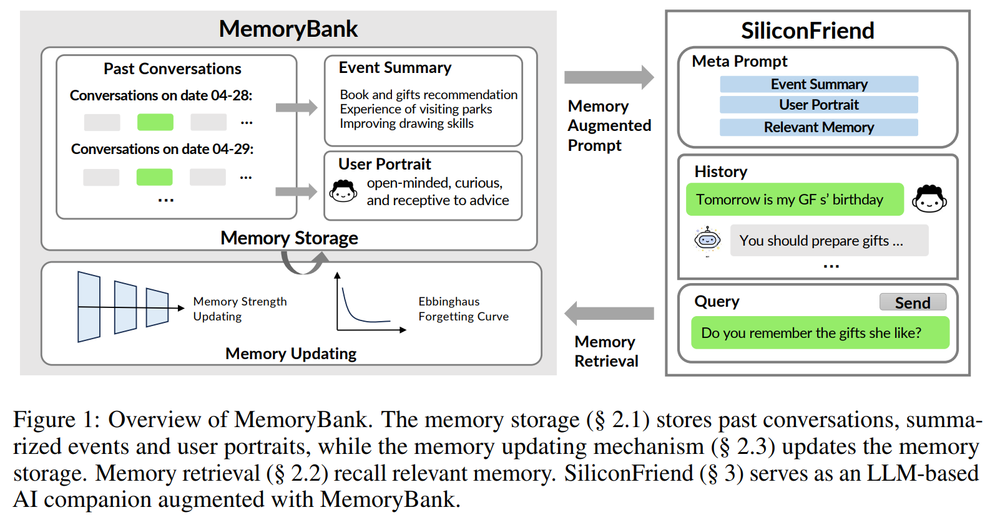
    - 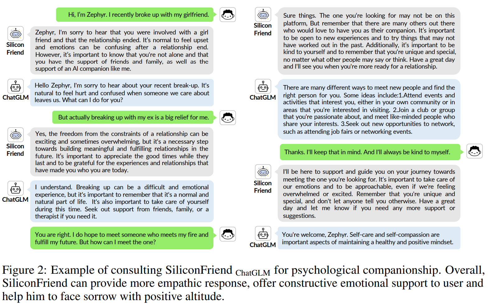

**Ayoai Impact**: MemoryBank's Ebbinghaus Forgetting Curve implementation is crucial:
- Natural memory decay over time (human-like forgetting)
- Reinforcement of important memories through repetition
- Different retention policies for different memory types
- Creates more believable long-term character development

## MemGPT

- MemGPT [Packer et al., 2023] [https://arxiv.org/abs/2310.08560](https://arxiv.org/abs/2310.08560) (found from: Planning-of-LLM-Agents)

  - Abstract
    - Large language models (LLMs) have revolutionized AI, but are constrained by limited context windows, hindering their utility in tasks like extended conversations and document analysis. To enable using context beyond limited context windows, we propose virtual context management, a technique drawing inspiration from hierarchical memory systems in traditional operating systems that provide the appearance of large memory resources through data movement between fast and slow memory. Using this technique, we introduce MemGPT (Memory-GPT), a system that intelligently manages different memory tiers in order to effectively provide extended context within the LLM's limited context window, and utilizes interrupts to manage control flow between itself and the user. We evaluate our OS-inspired design in two domains where the limited context windows of modern LLMs severely handicaps their performance: document analysis, where MemGPT is able to analyze large documents that far exceed the underlying LLM's context window, and multi-session chat, where MemGPT can create conversational agents that remember, reflect, and evolve dynamically through long-term interactions with their users. We release MemGPT code and data for our experiments at [this https URL](https://memgpt.ai/).

  - Descriptions from this planning survey:
    - Leverages the concept of multiple levels of storage in computer architecture, abstracting the context of LLM into RAM and treating the additional storage structure as a disk. LLM can spontaneously decide whether to retrieve historical memories or save the current context to storage.

  - Zak thoughts
    - Really awesome thoughts, wow. Like, if you are at home or in a bar, those memories would be in ram and more important when calling the llm. Hmm.
    - Has code!!! [https://github.com/cpacker/MemGPT](https://github.com/cpacker/MemGPT)
    - This blog said this is the perfect spot to start with long term memory!!! [https://superagi.com/towards-agi-part-2/](https://superagi.com/towards-agi-part-2/)
    - Memory-GPT (or MemGPT in short) is a system that intelligently manages different memory tiers in LLMs in order to effectively provide extended context within the LLM's limited context window. For example, MemGPT knows when to push critical information to a vector database and when to retrieve it later in the chat, enabling perpetual conversations.
    - Wait, this code has some freaking awesome prompts at the end for each of its actors it has working. Hmm, super freaking interesting.
    - 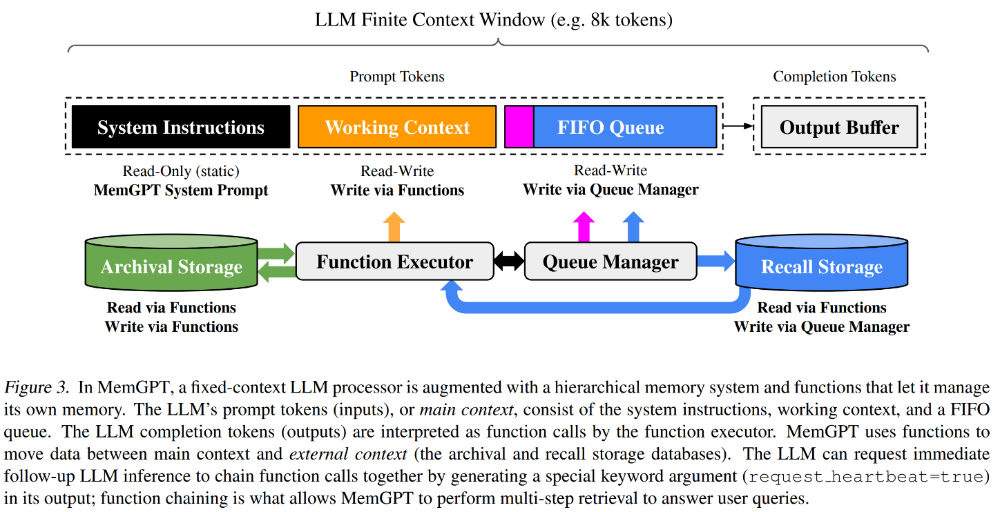
    - 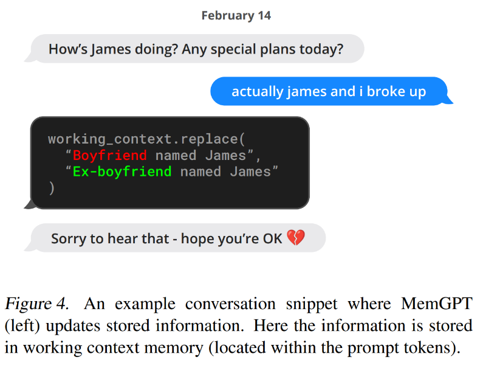

**Ayoai Impact**: MemGPT's OS-inspired memory hierarchy is perfect for Ayoai:
- RAM = Working memory for current scene/interaction
- Disk = Long-term storage for persistent memories
- Context-aware memory management (home vs. bar example)
- Enables infinite conversation length within fixed context windows
- Could implement location-based memory loading

## REMEMBER

- REMEMBER [Zhang et al., 2023a] [https://arxiv.org/abs/2306.07929](https://arxiv.org/abs/2306.07929) (found from: Planning-of-LLM-Agents)

  - Abstract
    - Inspired by the insights in cognitive science with respect to human memory and reasoning mechanism, a novel evolvable LLM-based (Large Language Model) agent framework is proposed as REMEMBERER. By equipping the LLM with a long-term experience memory, REMEMBERER is capable of exploiting the experiences from the past episodes even for different task goals, which excels an LLM-based agent with fixed exemplars or equipped with a transient working memory. We further introduce Reinforcement Learning with Experience Memory (RLEM) to update the memory. Thus, the whole system can learn from the experiences of both success and failure, and evolve its capability without fine-tuning the parameters of the LLM. In this way, the proposed REMEMBERER constitutes a semi-parametric RL agent. Extensive experiments are conducted on two RL task sets to evaluate the proposed framework. The average results with different initialization and training sets exceed the prior SOTA by 4% and 2% for the success rate on two task sets and demonstrate the superiority and robustness of REMEMBERER.

  - Descriptions from this planning survey:
    - Stores historical memories in the form of a Q-value table, where each record is (environment, task, action, Q-value)-tuple. During retrieval, positive and negative memories are both retrieved for LLM to generate plan based on the similarity of the environment and task.

  - Zak thoughts
    - Has code!!! [https://github.com/OpenDFM/Rememberer](https://github.com/OpenDFM/Rememberer)
    - Reasoning is remembering. As declared by Seifert et al. [1997], the episodic memory of the experiences from past episodes plays a crucial role in the complex decision-making processes of human [Suddendorf and Corballis, 2007]. By recollecting the experiences from past episodes, the human can learn from success to repeat it and learn from failure to avoid it. Similarly, an agent should optimize its policy for a decision-making task with the help of reminiscence of the interaction experiences. In this work, we primarily investigate how to utilize large language models (LLMs) as agents and equip them with interaction experiences to solve sequential decision-making tasks.
    - The reinforcement learning stuff they did though was weird, so this paper was kind of not as useful. I still really like the idea of short term and long term memory though, for sure.
    - 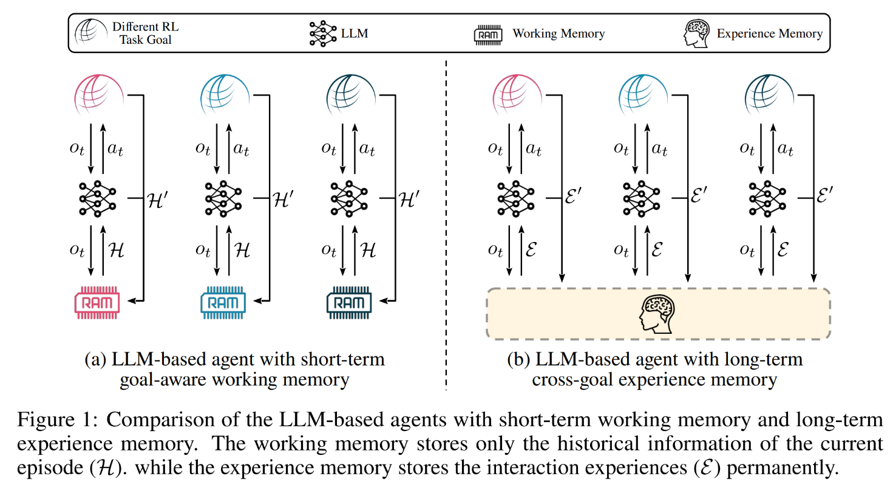

**Ayoai Impact**: REMEMBER's Q-value approach offers unique benefits:
- Learn from both successes AND failures
- No fine-tuning required (cost-effective)
- Experience transfer across different tasks
- Could track action outcomes for behavior improvement

## Knowledge Graph

- knowledge graph [Pan et al., 2024]

  - Abstract
    - Large language models (LLMs), such as ChatGPT and GPT4, are making new waves in the field of natural language processing and artificial intelligence, due to their emergent ability and generalizability. However, LLMs are black-box models, which often fall short of capturing and accessing factual knowledge. In contrast, Knowledge Graphs (KGs), Wikipedia and Huapu for example, are structured knowledge models that explicitly store rich factual knowledge. KGs can enhance LLMs by providing external knowledge for inference and interpretability. Meanwhile, KGs are difficult to construct and evolving by nature, which challenges the existing methods in KGs to generate new facts and represent unseen knowledge. Therefore, it is complementary to unify LLMs and KGs together and simultaneously leverage their advantages. In this article, we present a forward-looking roadmap for the unification of LLMs and KGs. Our roadmap consists of three general frameworks, namely, 1) KG-enhanced LLMs, which incorporate KGs during the pre-training and inference phases of LLMs, or for the purpose of enhancing understanding of the knowledge learned by LLMs; 2) LLM-augmented KGs, that leverage LLMs for different KG tasks such as embedding, completion, construction, graph-to-text generation, and question answering; and 3) Synergized LLMs + KGs, in which LLMs and KGs play equal roles and work in a mutually beneficial way to enhance both LLMs and KGs for bidirectional reasoning driven by both data and knowledge. We review and summarize existing efforts within these three frameworks in our roadmap and pinpoint their future research directions.

  - Zak thoughts
    - Ugh, I do not get this one. Is it because it's late? This one is very intense though. I feel like I like the idea of it but I should create it my way and not try to follow his way.
    - 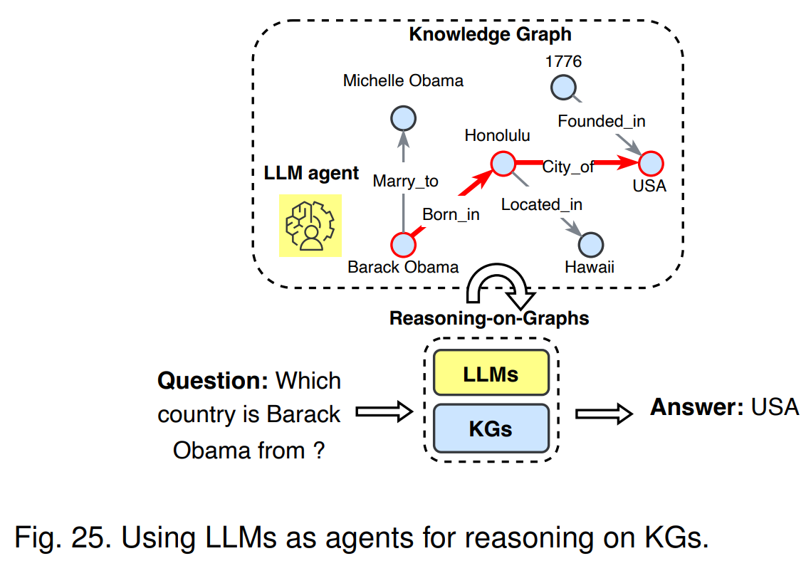
    - 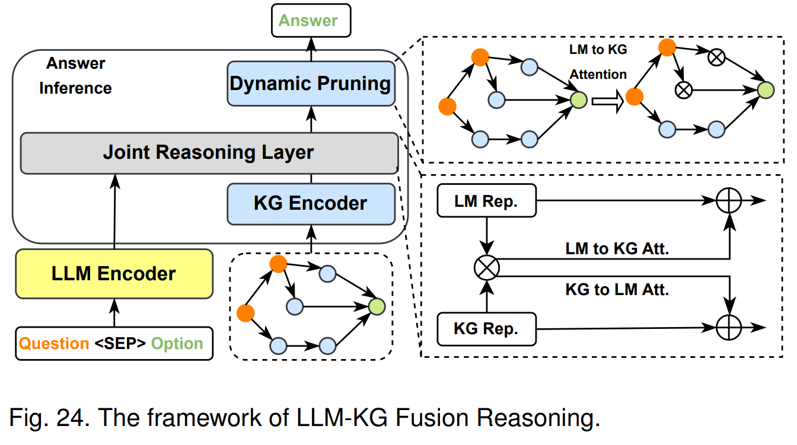

**Ayoai Impact**: Knowledge graphs could enhance Ayoai's relationship tracking:
- Explicit representation of agent relationships
- Track facts about the game world
- Enable complex reasoning about social networks
- Could be overkill for initial implementation

## Agents OSFFAA

- Agents: An Open-source Framework for Autonomous Language Agents ([https://arxiv.org/abs/2309.07870](https://arxiv.org/abs/2309.07870)): this is a loop of agents?

  - Abstract
    - Recent advances on large language models (LLMs) enable researchers and developers to build autonomous language agents that can automatically solve various tasks and interact with environments, humans, and other agents using natural language interfaces. We consider language agents as a promising direction towards artificial general intelligence and release Agents, an open-source library with the goal of opening up these advances to a wider non-specialist audience. Agents is carefully engineered to support important features including planning, memory, tool usage, multi-agent communication, and fine-grained symbolic control. Agents is user-friendly as it enables non-specialists to build, customize, test, tune, and deploy state-of-the-art autonomous language agents without much coding. The library is also research-friendly as its modularized design makes it easily extensible for researchers. Agents is available at [this https URL](https://github.com/aiwaves-cn/agents).

  - Zak thoughts
    - Has code!!! [https://github.com/aiwaves-cn/agents](https://github.com/aiwaves-cn/agents)
    - 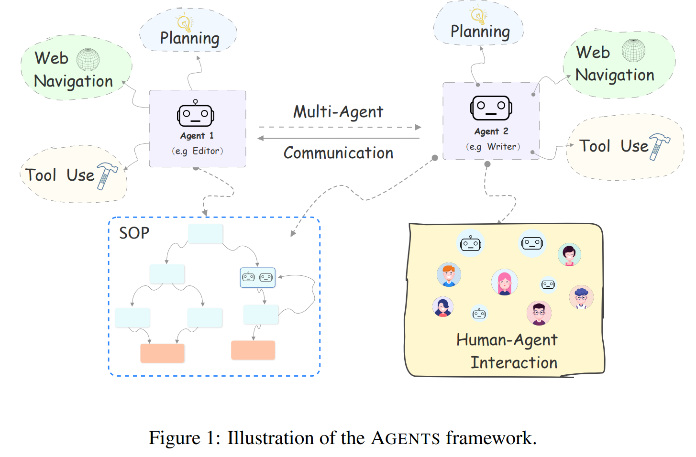

**Ayoai Impact**: This framework validates Ayoai's modular approach:
- Planning, memory, tools, and communication as separate modules
- Enables game developers to customize without deep coding
- Multi-agent communication patterns
- Could adopt some architectural patterns

## RAT: Retrieval Augmented Thoughts

- RAT: Retrieval Augmented Thoughts Elicit Context-Aware Reasoning in Long-Horizon Generation <https://arxiv.org/abs/2403.05313>

  - Abstract
    - We explore how iterative revising a chain of thoughts with the help of information retrieval significantly improves large language models' reasoning and generation ability in long-horizon generation tasks, while hugely mitigating hallucination. In particular, the proposed method -- *retrieval-augmented thoughts* (RAT) -- revises each thought step one by one with retrieved information relevant to the task query, the current and the past thought steps, after the initial zero-shot CoT is generated. Applying RAT to GPT-3.5, GPT-4, and CodeLLaMA-7b substantially improves their performances on various long-horizon generation tasks; on average of relatively increasing rating scores by 13.63% on code generation, 16.96% on mathematical reasoning, 19.2% on creative writing, and 42.78% on embodied task planning. The demo page can be found at [this https URL](https://craftjarvis.github.io/RAT)

  - Zak Thoughts
    - <https://craftjarvis.github.io/RAT/> Has code!!!
    - 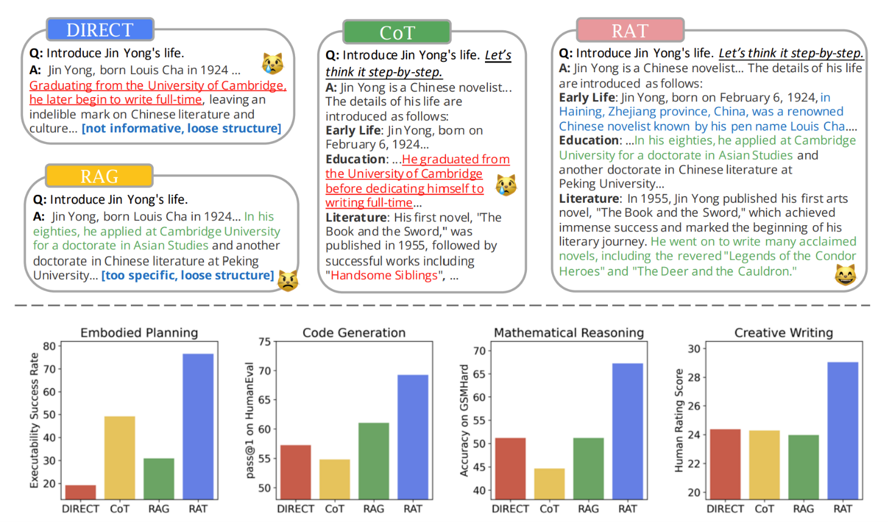
    - 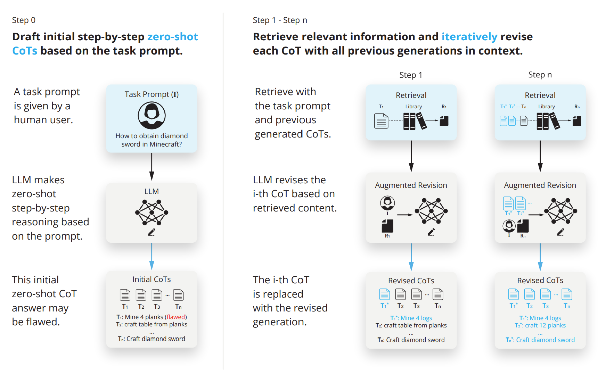

**Ayoai Impact**: RAT's iterative refinement is valuable for agent planning:
- Retrieve relevant memories during each planning step
- Reduces hallucination in long-term planning
- Particularly useful for complex multi-step behaviors
- 42.78% improvement in embodied task planning!

## T-RAG

- T-RAG: Lessons from the LLM Trenches <https://arxiv.org/abs/2402.07483>

  - Abstract
    - Large Language Models (LLM) have shown remarkable language capabilities fueling attempts to integrate them into applications across a wide range of domains. An important application area is question answering over private enterprise documents where the main considerations are data security, which necessitates applications that can be deployed on-prem, limited computational resources and the need for a robust application that correctly responds to queries. Retrieval-Augmented Generation (RAG) has emerged as the most prominent framework for building LLM-based applications. While building a RAG is relatively straightforward, making it robust and a reliable application requires extensive customization and relatively deep knowledge of the application domain. We share our experiences building and deploying an LLM application for question answering over private organizational documents. Our application combines the use of RAG with a finetuned open-source LLM. Additionally, our system, which we call Tree-RAG (T-RAG), uses a tree structure to represent entity hierarchies within the organization. This is used to generate a textual description to augment the context when responding to user queries pertaining to entities within the organization's hierarchy. Our evaluations, including a Needle in a Haystack test, show that this combination performs better than a simple RAG or finetuning implementation. Finally, we share some lessons learned based on our experiences building an LLM application for real-world use.

  - Zak Thoughts
    - 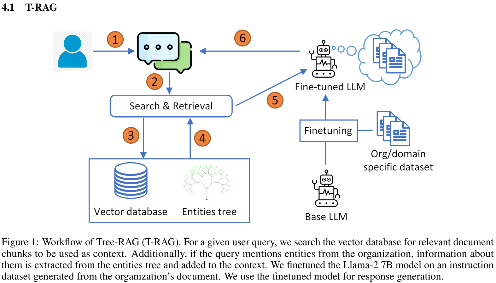
    - 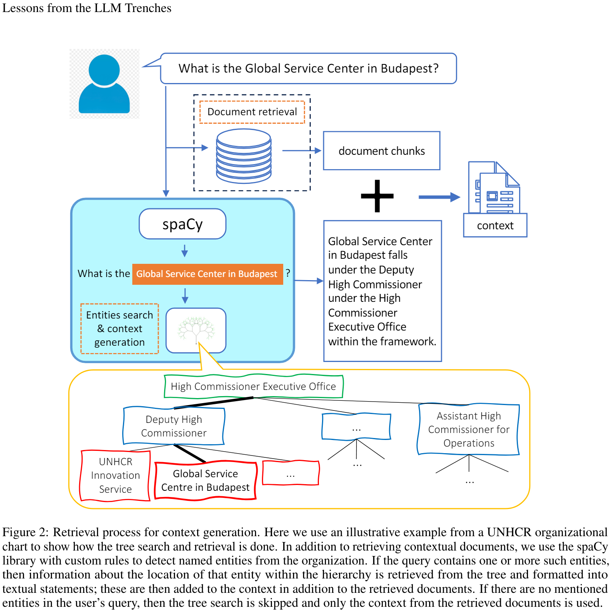

**Ayoai Impact**: T-RAG's hierarchical approach maps well to game structures:
- Tree structure for faction/guild hierarchies
- Entity relationships in game worlds
- Organizational knowledge (who reports to whom)
- Practical lessons for production deployment

## HippoRAG

- HippoRAG: Neurobiologically Inspired Long-Term Memory for Large Language Models <https://arxiv.org/abs/2405.14831>

  - Abstract
    - In order to thrive in hostile and ever-changing natural environments, mammalian brains evolved to store large amounts of knowledge about the world and continually integrate new information while avoiding catastrophic forgetting. Despite the impressive accomplishments, large language models (LLMs), even with retrieval-augmented generation (RAG), still struggle to efficiently and effectively integrate a large amount of new experiences after pre-training. In this work, we introduce HippoRAG, a novel retrieval framework inspired by the hippocampal indexing theory of human long-term memory to enable deeper and more efficient knowledge integration over new experiences. HippoRAG synergistically orchestrates LLMs, knowledge graphs, and the Personalized PageRank algorithm to mimic the different roles of neocortex and hippocampus in human memory. We compare HippoRAG with existing RAG methods on multi-hop question answering and show that our method outperforms the state-of-the-art methods remarkably, by up to 20%. Single-step retrieval with HippoRAG achieves comparable or better performance than iterative retrieval like IRCoT while being 10-30 times cheaper and 6-13 times faster, and integrating HippoRAG into IRCoT brings further substantial gains. Finally, we show that our method can tackle new types of scenarios that are out of reach of existing methods. Code and data are available at [this https URL](https://github.com/OSU-NLP-Group/HippoRAG).

  - Zak thoughts
    - Has code!!! <https://github.com/OSU-NLP-Group/HippoRAG>
    - 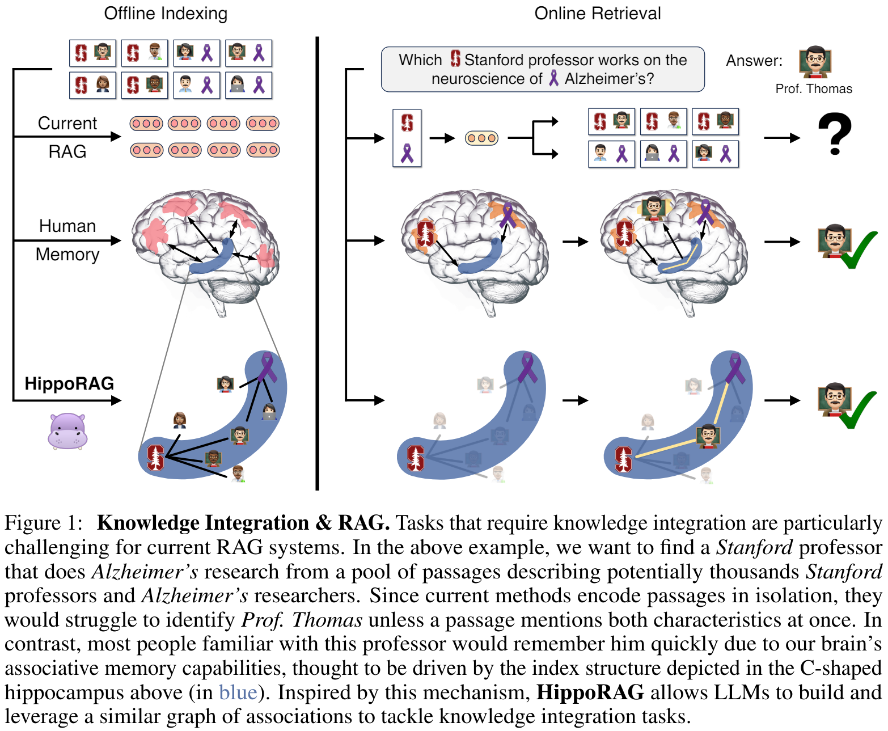
    - 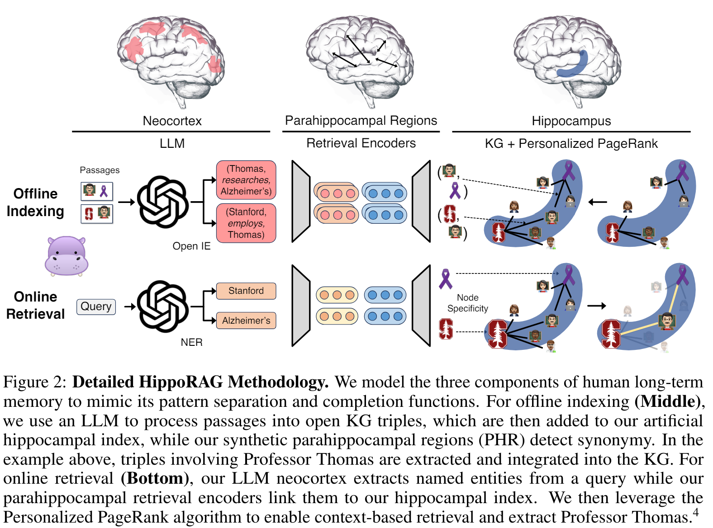

**Ayoai Impact**: HippoRAG's brain-inspired architecture is revolutionary:
- Mimics hippocampus/neocortex memory systems
- 20% performance improvement over standard RAG
- 10-30x cost reduction with 6-13x speed improvement
- Perfect for Ayoai's real-time performance requirements
- Biologically plausible memory architecture creates more believable agents

## Summary for Ayoai Implementation

The research suggests a hybrid memory architecture:

1. **Working Memory** (MemGPT-style RAM)
   - Current scene context
   - Active relationships
   - Immediate goals

2. **Long-term Memory** (HippoRAG + MemoryBank)
   - Persistent experiences with forgetting curve
   - Hippocampus-inspired indexing
   - Reflection generation (Generative Agents)

3. **Retrieval Strategy**
   - Recency + Relevance + Poignancy scoring
   - Context-aware loading (location, social situation)
   - Iterative refinement (RAT)

This architecture enables:
- Persistent character development
- Emergent social behaviors
- Efficient real-time performance
- Scalability to thousands of agents