# Multi-Plan Selection

Multi-Plan Generation involves generating a dozen paths of plans to comprise the candidate plan set. Lead the LLM to "think" more, generating various alternative plans for a task. Then a task-related search algorithm is employed to select one plan to execute.

## Overall Notes

- Thoughts on this method from this planning survey:
  - Even though LLM possesses strong reasoning abilities, a single plan generated by LLM is likely to be suboptimal or even infeasible. A more natural approach is multi-plan selection, comprising two major steps: multiplan generation and optimal plan selection.

  - The scalability of multi-plan selection is notably advantageous, providing a broader exploration of potential solutions in the expansive search space.

  - However, this advantage comes with inherent trade-offs. The increased computational, especially for models with large token counts or computations, pose practical challenges. This cost consideration becomes crucial, particularly in scenarios where resource constraints are a significant factor, such as the online service.

  - The stochastic nature of LLMs adds randomness to the selection, potentially affecting the consistency and reliability of the chosen plans.

  - Generating efficient plans is a crucial issue in planning. However, in existing LLM agents, planning is greedily based on generated plans from LLM output, without considering the efficiency of the generated plans. Therefore, future developments may require introducing additional efficiency evaluation modules to work in conjunction with LLM for more efficient plans.

- Zak thoughts on this method
  - See summary at top. In short, this is a must - and we must think big, like the graphs paper did.
  - The feedback messages should be provided under the annotation list of each action in the file {llm-model}_pddl_for_annotations.json.

- Make sure they follow the rules: For a prompt, tell them to make sure to follow the rules. there are different rules in different situations.

- I should have a loop that evaluates high value activities, and find which ones make the most impact, and see if position has nothing to do with it. Like, if I partition my history by location first and have that a binary tree, then by time being a bitemporal table of antecedents. Can search time faster if bitemporal? But then I'd also want to search by, given my current circumstances, what should I do?

- You need to know what type of "options" you have available at certain points in time... The Alberta article mentioned this. Like, we need to save the behavior trees to truly know.

- The policy depends on the state. For example, the policy of change light all is only available when light bulb is burnt out. Do the state representations are extremely important. Like, how is a st ye representation going to work like that?

- What is this "Calculating Actions Equivalence?" This is calculating when actions are equivalent or interchangeable. We should be doing that, no?

**Ayoai Impact**: Multi-plan selection is essential for robust agent behavior:
- Generate multiple behavior trees for each goal
- Evaluate plans based on efficiency, feasibility, and character personality
- State-dependent policy selection (actions available depend on game state)
- Save successful plans for future reuse
- Consider action equivalence for more flexible planning

## Self-consistency

- Self-consistency [Wang et al., 2022b] (1 of 2 mentions) [https://arxiv.org/abs/2203.11171](https://arxiv.org/abs/2203.11171) (found from: Planning-of-LLM-Agents)

  - Abstract:
    - Chain-of-thought prompting combined with pre-trained large language models has achieved encouraging results on complex reasoning tasks. In this paper, we propose a new decoding strategy, self-consistency, to replace the naive greedy decoding used in chain-of-thought prompting. It first samples a diverse set of reasoning paths instead of only taking the greedy one, and then selects the most consistent answer by marginalizing out the sampled reasoning paths. Self-consistency leverages the intuition that a complex reasoning problem typically admits multiple different ways of thinking leading to its unique correct answer. Our extensive empirical evaluation shows that self-consistency boosts the performance of chain-of-thought prompting with a striking margin on a range of popular arithmetic and commonsense reasoning benchmarks, including GSM8K (+17.9%), SVAMP (+11.0%), AQuA (+12.2%), StrategyQA (+6.4%) and ARC-challenge (+3.9%).

    - 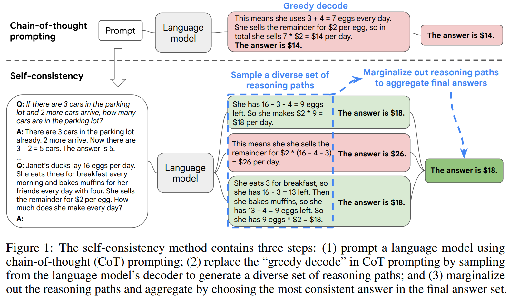

  - Descriptions from this planning survey:
    - Employs a simple intuition: the solutions for complex problems are rarely unique. In contrast to CoT, which generates a single path, Self-consistency obtains multiple distinct reasoning paths via sampling strategies embodied in the decoding process, such as temperature sampling, top-k sampling.
    - Applies the naive majority vote strategy, regarding the plan with the most votes as the optimal choice.

  - Zak thoughts
    - We need to do this 100%, but how can we two answers agree or contradict each other? Here is quote from paper:
      - "One should note that self-consistency can be applied only to problems where the final answer is from a fixed answer set, but in principle this approach can be extended to open-text generation problems if a good metric of consistency can be defined between multiple generations, e.g., whether two answers agree or contradict each other."
      - By "this" I mean, I think we should get an three different answers with different temperature settings of the llm (or even possibly slightly different prompts each time), And then pick the most consistent answer. We should even ask the llm to ask the most consistent, with certain weights and personalities from the npc.

**Ayoai Impact**: Self-consistency is crucial for reliable agent decisions:
- Generate multiple plans with different temperature settings
- Use LLM to evaluate consistency between plans
- Weight evaluations based on character personality
- Reduces erratic behavior from single-sample planning

## Tree-of-Thought

- Tree-of-Thought (ToT) [Yao et al., 2023] (1 of 2 mentions) [https://arxiv.org/abs/2305.10601](https://arxiv.org/abs/2305.10601) (found from: Planning-of-LLM-Agents)

  - Abstract
    - Language models are increasingly being deployed for general problem solving across a wide range of tasks, but are still confined to token-level, left-to-right decision-making processes during inference. This means they can fall short in tasks that require exploration, strategic lookahead, or where initial decisions play a pivotal role. To surmount these challenges, we introduce a new framework for language model inference, Tree of Thoughts (ToT), which generalizes over the popular Chain of Thought approach to prompting language models, and enables exploration over coherent units of text (thoughts) that serve as intermediate steps toward problem solving. ToT allows LMs to perform deliberate decision making by considering multiple different reasoning paths and self-evaluating choices to decide the next course of action, as well as looking ahead or backtracking when necessary to make global choices. Our experiments show that ToT significantly enhances language models' problem-solving abilities on three novel tasks requiring non-trivial planning or search: Game of 24, Creative Writing, and Mini Crosswords. For instance, in Game of 24, while GPT-4 with chain-of-thought prompting only solved 4% of tasks, our method achieved a success rate of 74%. Code repo with all prompts: [this https URL](https://github.com/princeton-nlp/tree-of-thought-llm).

  - Descriptions from this planning survey:
    - Proposes two strategies to generate plans (i.e. thoughts): sample and propose. The sample strategy is consistent with Self-consistency, where LLM would sample multiple plans in decoding process. The propose strategy explicitly instructs the LLM to generate various plans via few-shot examples in prompts.
    - Supports tree search algorithms, such as conventional BFS and DFS. When selecting a node for expansion, it uses LLM to evaluate multiple actions and chooses the optimal one.

  - Zak thoughts
    - Has code!! [https://github.com/princeton-nlp/tree-of-thought-llm](https://github.com/princeton-nlp/tree-of-thought-llm)
      - Code is to a library that needs to be installed, which I do not like, or do I care? Not sure yet.
      - The idea:
        - 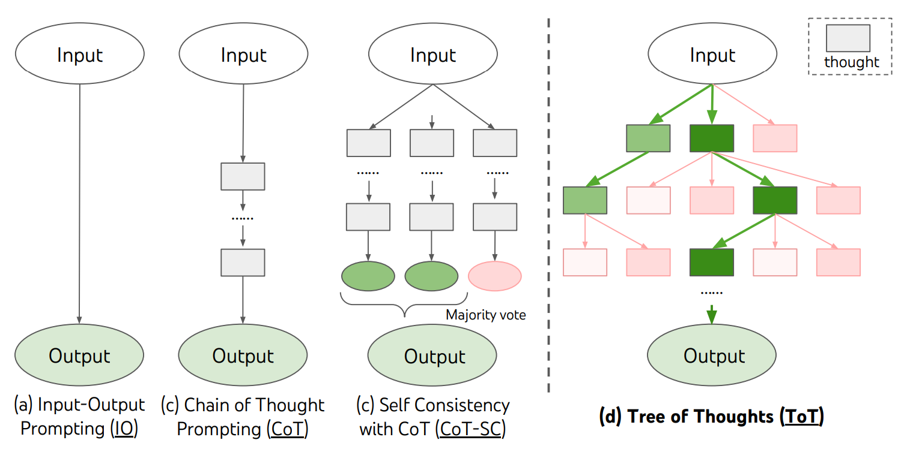

    - Great quote on why trees are awesome:
      - "Research on human problem-solving suggests that people search through a combinatorial problemspace -- a tree where the nodes represent partial solutions, and the branches correspond to operators that modify them [21, 22]. Which branch to take is determined by heuristics that help to navigate the problem-space and guide the problem-solver towards a solution. This perspective highlights two key shortcomings of existing approaches that use LMs to solve general problems: 1) Locally, they do not explore different continuations within a thought process -- the branches of the tree. 2) Globally, they do not incorporate any type of planning, lookahead, or backtracking to help evaluate these different options -- the kind of heuristic-guided search that seems characteristic of human problem-solving."

    - Definition of ToT
      - "ToT frames any problem as a search over a tree, where each node is a state s = [x, z1···i ] representing a partial solution with the input and the sequence of thoughts so far. A specific instantiation of ToT involves answering four questions: 1. How to decompose the intermediate process into thought steps; 2. How to generate potential thoughts from each state; 3. How to heuristically evaluate states; 4. What search algorithm to use."

      - 1. Thought decomposition. While CoT samples thoughts coherently without explicit decomposition, ToT leverages problem properties to design and decompose intermediate thought steps. As Table 1 shows, depending on different problems, a thought could be a couple of words (Crosswords), a line of equation (Game of 24), or a whole paragraph of writing plan (Creative Writing). In general, a thought should be "small" enough so that LMs can generate promising and diverse samples (e.g. generating a whole book is usually too "big" to be coherent), yet "big" enough so that LMs can evaluate its prospect toward problem solving (e.g. generating one token is usually too "small" to evaluate).

      - 2. Thought generator G(pθ, s, k). Given a tree state s = [x, z1···i ], we consider two strategies to generate k candidates for the next thought step: (a) Sample i.i.d. thoughts from a CoT prompt (Creative Writing, Figure 4) ... (b) Propose thoughts sequentially using a "propose prompt" (Game of 24, Figure 2; Crosswords, Figure 6): [z (1) , · · · , z(k) ] ∼ p propose θ (z (1···k) i+1 | s). This works better when the thought space is more constrained (e.g. each thought is just a word or a line), so proposing different thoughts in the same context avoids duplication.

      - 3. State evaluator V (pθ, S). Given a frontier of different states, the state evaluator evaluates the progress they make towards solving the problem, serving as a heuristic for the search algorithm to determine which states to keep exploring and in which order. While heuristics are a standard approach to solving search problems, they are typically either programmed (e.g. DeepBlue [3]) or learned (e.g. AlphaGo [29]). We propose a third alternative, by using the LM to deliberately reason about states. When applicable, such a deliberate heuristic can be more flexible than programmed rules, and more sample-efficient than learned models. Similar to the thought generator, we consider two strategies to evaluate states either independently or together: (a) Value each state independently... (b) Vote across states: V (pθ, S)(s) = 1[s = s * ], where a "good" state s * ∼ p vote θ (s * |S) is voted out based on deliberately comparing different states in S in a vote prompt. When problem success is harder to directly value (e.g. passage coherency), it is natural to to instead compare different partial solutions and vote for the most promising one. This is similar in spirit to a "step-wise" self-consistency strategy, i.e. cast "which state to explore" as a multi-choice QA, and use LM samples to vote for it.

      - 4. Search algorithm. Finally, within the ToT framework, one can plug and play different search algorithms depending on the tree structure. We explore two relatively simple search algorithms and leave more advanced ones (e.g. A* [11], MCTS [2]) for future work: (a) Breadth-first search (BFS) (Algorithm 1) maintains a set of the b most promising states per step. This is used for Game of 24 and Creative Writing where the tree depth is limit (T ≤ 3), and initial thought steps can be evaluated and pruned to a small set (b ≤ 5). (b) Depth-first search (DFS) (Algorithm 2) explores the most promising state first, until the final output is reached (t > T), or the state evaluator deems it impossible to solve the problem from the current s (V (pθ, {s})(s) ≤ vth for a value threshold vth). In the latter case, the subtree from s is pruned to trade exploration for exploitation. In both cases, DFS backtracks to the parent state of s to continue exploration.

      - Great examples:
        - 
        - 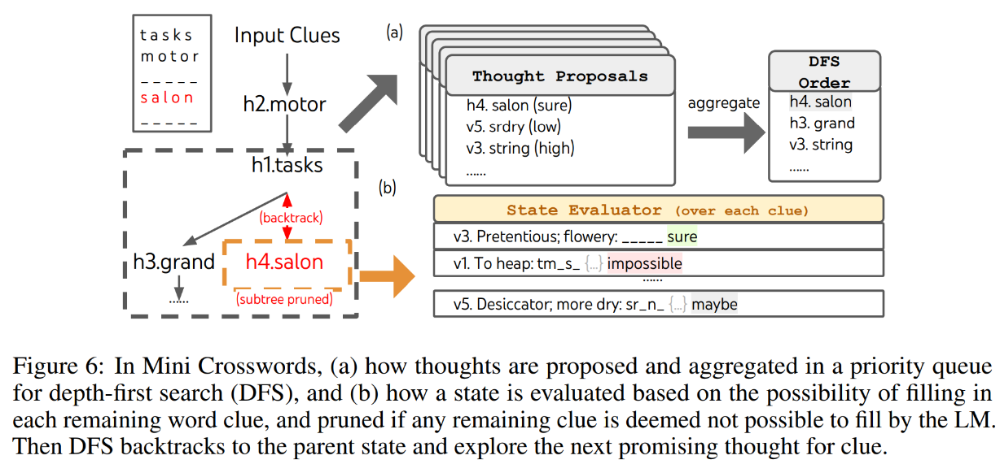

**Ayoai Impact**: ToT provides a complete framework for agent planning:
- Thought decomposition maps to behavior tree node design
- State evaluation using LLMs for flexibility
- BFS/DFS search strategies for different planning scenarios
- Backtracking capability for failed plans
- The 74% vs 4% improvement shows the power of structured search

## Graph-of-Thought

- Graph-of-Thought (GoT) [Besta et al., 2023] [https://arxiv.org/abs/2308.09687](https://arxiv.org/abs/2308.09687) (found from: Planning-of-LLM-Agents)

  - Abstract
    - We introduce Graph of Thoughts (GoT): a framework that advances prompting capabilities in large language models (LLMs) beyond those offered by paradigms such as Chain-of-Thought or Tree of Thoughts (ToT). The key idea and primary advantage of GoT is the ability to model the information generated by an LLM as an arbitrary graph, where units of information ("LLM thoughts") are vertices, and edges correspond to dependencies between these vertices. This approach enables combining arbitrary LLM thoughts into synergistic outcomes, distilling the essence of whole networks of thoughts, or enhancing thoughts using feedback loops. We illustrate that GoT offers advantages over state of the art on different tasks, for example increasing the quality of sorting by 62% over ToT, while simultaneously reducing costs by >31%. We ensure that GoT is extensible with new thought transformations and thus can be used to spearhead new prompting schemes. This work brings the LLM reasoning closer to human thinking or brain mechanisms such as recurrence, both of which form complex networks.

  - Descriptions from this planning survey:
    - Extends ToT by adding transformations of thoughts, which supports arbitrary thoughts aggregation.

  - Zak thoughts
    - I like how these guys laid this out. I also liked how the authors of that planning paper represented these in order.
    - Great graphs:
    - 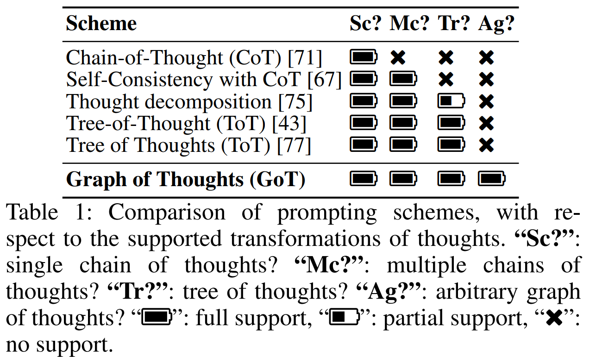
    - 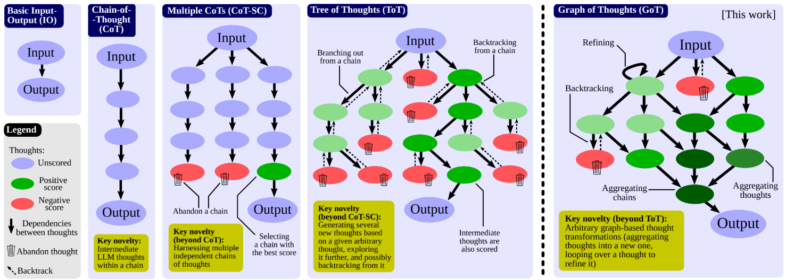
    - Wow this is a great graph. Look at the api for parser - I like how they have those different tasks. These would be the task leaf nodes that I like
    - 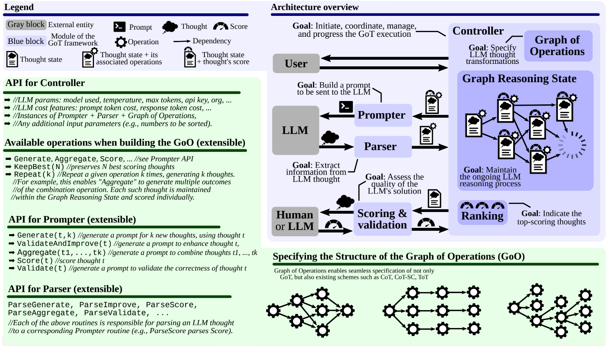
    - Cool prompting strategies:
    - 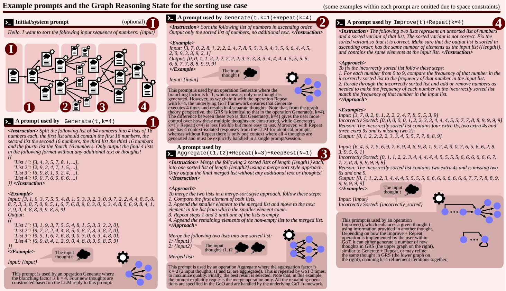

**Ayoai Impact**: GoT's graph structure is revolutionary for complex agent reasoning:
- Allows merging multiple reasoning paths (not just trees)
- Feedback loops enable iterative improvement
- 62% quality improvement with 31% cost reduction
- Maps well to multi-agent coordination scenarios
- Thought transformations could enable personality-specific reasoning

## LLM-MCTS

- LLM-MCTS [Zhao et al., 2023b] (1 of 2 mentions) [https://arxiv.org/abs/2305.14078](https://arxiv.org/abs/2305.14078) (found from: Planning-of-LLM-Agents)

  - Abstract
    - Large-scale task planning is a major challenge. Recent work exploits large language models (LLMs) directly as a policy and shows surprisingly interesting results. This paper shows that LLMs provide a commonsense model of the world in addition to a policy that acts on it. The world model and the policy can be combined in a search algorithm, such as Monte Carlo Tree Search (MCTS), to scale up task planning. In our new LLM-MCTS algorithm, the LLM-induced world model provides a commonsense prior belief for MCTS to achieve effective reasoning; the LLM-induced policy acts as a heuristic to guide the search, vastly improving search efficiency. Experiments show that LLM-MCTS outperforms both MCTS alone and policies induced by LLMs (GPT2 and GPT3.5) by a wide margin, for complex, novel tasks. Further experiments and analyses on multiple tasks -- multiplication, multi-hop travel planning, object rearrangement -- suggest minimum description length (MDL) as a general guiding principle: if the description length of the world model is substantially smaller than that of the policy, using LLM as a world model for model-based planning is likely better than using LLM solely as a policy.

  - Descriptions from this planning survey:
    - Leverages LLM as the heuristic policy function for the Monte Carlo Tree Search (MCTS), where multiple potential actions are obtained by multiple calls.
    - Specifically, MCTS builds a reasoning tree iteratively, where each node represents a state, and each edge represents an action and the transition from the current state to the next state after applying the action (Figure 1).
    - Also employ a tree structure to assist in multi-plan search. Unlike ToT, they employ the Monte Carlo Tree Search (MCTS) algorithm for search.

  - Zak thoughts
    - Underlying idea:
      - "Their underlying idea is simple: treat the LLM as a policy and query it directly for the next actions, given the history of past actions and observations. We call this strategy L-Policy, which exploits LLMs' vast commonsense knowledge to circumvent the challenge of searching a very large space."
      - "Alternatively, we may use LLMs' knowledge to build a world model and apply a planning algorithm to the model. The world model may contain, e.g., a belief over the target object's location, which biases the search and drastically improves search efficiency. We call this strategy L-Model. L-Model's performance depends on two critical preconditions: the accuracy of the world model and the efficiency of the planning algorithm. The former is a question of sample complexity for learning, and the latter is that of computational complexity."
      - This paper presents LLM-MCTS (shown in Fig 1):
        - 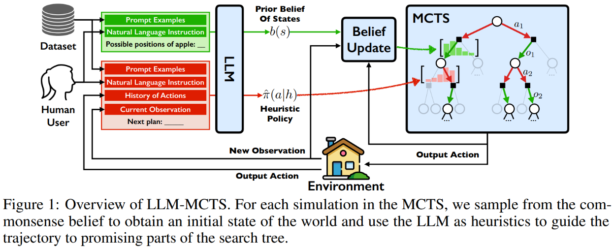

    - Good result summary: this was my hypothesis when I gave it the world model before asking for which task.
      - F1. L-Model performs poorly. There are two possible reasons. One is model inaccuracy. The other is huge search space size, beyond the reach of even the state-of-the-art MCTS algorithm. Further experiments indicate that search space size is the main cause. F2. L-Policy performs reasonably with both GPT2 and GPT3.5, but the performance degrades quickly for novel, complex tasks. This generally corroborates with earlier results [22, 18, 2, 19]. F3. LLM-MCTS outperforms L-Model. This clearly shows the benefit of using the LLM as a heuristic policy to guide the search. F4. LLM-MCTS outperforms L-Policy, especially for novel, complex tasks. LLM-MCTS basically combines L-Model and L-Policy. Since the L-Model performs very poorly on its own, why does the combination outperform L-Policy? One explanation is that search space size is the main cause of L-Model's poor performance. The LLM-induced world model is sufficiently accurate, and tree search with this world model, when limited to the neighbourhood of the LLM-induced policy, provides the improved performance over L-Policy.

    - Has code!! [https://github.com/1989Ryan/llm-mcts](https://github.com/1989Ryan/llm-mcts)
    - Awesome prompts:
      - 
      - 
      - 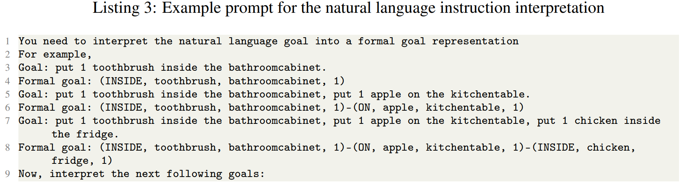

**Ayoai Impact**: LLM-MCTS is perfect for Ayoai's game agent planning:
- Combines world model (game state) with policy (agent behavior)
- MCTS provides principled exploration/exploitation tradeoff
- Outperforms both pure model and pure policy approaches
- Scales well to complex, novel tasks (like emergent gameplay)
- The MDL principle helps decide when to use planning vs reactive behavior

## Integration with Ayoai Platform

Multi-plan selection research suggests a sophisticated planning architecture:

1. **Plan Generation**
   - Self-consistency: Multiple samples with different temperatures
   - ToT: Structured decomposition with evaluation
   - GoT: Graph-based reasoning with feedback loops

2. **Search Algorithms**
   - BFS for shallow, broad exploration
   - DFS for deep, focused search
   - MCTS for balanced exploration/exploitation

3. **Evaluation Methods**
   - LLM-based state evaluation
   - Voting across candidate plans
   - Personality-weighted preferences

4. **Implementation Strategy**
   - Start with self-consistency for robustness
   - Add ToT for complex multi-step planning
   - Integrate MCTS for real-time decision making
   - Use GoT for multi-agent coordination

This enables Ayoai agents to:
- Generate diverse, creative solutions
- Adapt to novel situations
- Learn from successful plans
- Coordinate complex multi-agent behaviors
- Maintain character consistency while exploring options

## RAP: Reasoning via Planning

- RAP: Reasoning via Planning [Hao et al., 2023b] [https://arxiv.org/abs/2305.14992](https://arxiv.org/abs/2305.14992) (found from: Planning-of-LLM-Agents)

  - Abstract
    - Despite the many recent achievements in developing general large language models (LLMs), LLMs often fall short when it comes to tasks that require deliberate planning and multi-step reasoning. The deficiency stems from the key fact that LLMs lack an internal world model to predict the world state (e.g., environment status, intermediate variable values) and simulate long-term outcomes of actions. This prevents LLMs from performing deliberate planning akin to human brains, which involves exploring alternative reasoning paths, anticipating future states and rewards, and iteratively refining existing reasoning steps. To overcome the limitations, we propose a new LLM reasoning framework, Reasoning via Planning (RAP). RAP repurposes the LLM as both a world model and a reasoning agent, and incorporates a principled planning algorithm (based on Monto Carlo Tree Search) for strategic exploration in the vast reasoning space. During reasoning, the LLM (as agent) incrementally builds a reasoning tree under the guidance of the LLM (as world model) and task-specific rewards, and obtains a high-reward reasoning path efficiently with a proper balance between exploration vs. exploitation. We apply RAP to a variety of challenging reasoning problems including plan generation, math reasoning, and logical inference. Empirical results on these tasks demonstrate the superiority of RAP over various strong baselines, including CoT and least-to-most prompting with self-consistency. RAP on LLAMA-33B surpasses CoT on GPT-4 with 33% relative improvement in a plan generation setting.

  - Descriptions from this planning survey:
    - Leverages LLM as the heuristic policy function for the Monte Carlo Tree Search (MCTS), where multiple potential actions are obtained by multiple calls.
    - Also employ a tree structure to assist in multi-plan search. Unlike ToT, they employ the Monte Carlo Tree Search (MCTS) algorithm for search.

  - Zak thoughts
    - 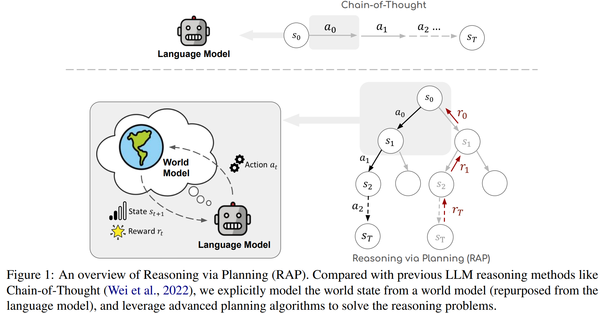
    - 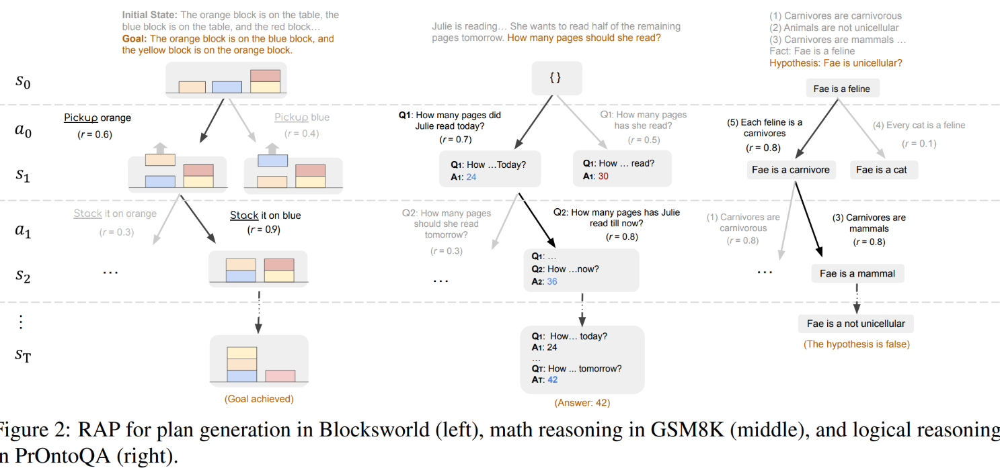
    - Strategies
      - Self-evaluation by the LLM. It's sometimes easier to recognize the errors in reasoning than avoid generating them in advance. Thus, it's beneficial to allow the LLM to criticize itself with the question "Is this reasoning step correct?", and use the next-word probability of the token "Yes" as a reward. The reward evaluates LLM's own estimation of the correctness of reasoning. Note that the specific problems for self-evaluation can be different depending on the tasks.
      - Task-specific heuristics. RAP also allows us to flexibly plug in other task-specific heuristics into the reward function. For example, in plan generation for Blocksworld, we compare the predicted current state of blocks with the goal to calculate a reward (Section 4.1). The reward encourages the plan of movements to actively pace towards the target.
      - Expansion. This phase expands the tree by adding new child nodes to the leaf node selected above. Given the state of the leaf node, we use the LLM (as agent) to sample d possible actions (e.g., subquestions in math reasoning), and then use the LLM (as world model) to predict the respective next state, resulting in d child nodes. Note that if the leaf node selected above is a terminal node (the end of a reasoning chain) already, we will skip expansion and jump to back-propagation.
    - Dang, ok, I need to read this in depth later, it details how the search algorithm of the tree will go. I need to review this before I finalize my tree. Look at back propagation to go back up the tree?
      - 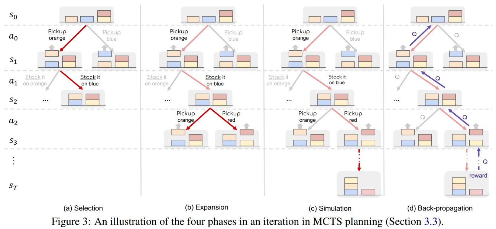
    - Back-propagation. Once we reach a terminal state in the above phases, we obtain a reasoning path from the root node to the terminal node. We now back-propagate the rewards on the path to update the Q value of each state-action pair along the path. Specifically, we update Q(s, a) by aggregating the rewards in all future steps of node s.
    - Once a predetermined number of MCTS iterations is reached, we terminate the algorithm and select the final reasoning trace from the constructed tree for evaluation. There are various ways for the selection. One is to start from the root node and iteratively choose the action with the highest Q value until reaching a terminal. Also, one can directly select the path from the iterations that yielded the highest reward, or opt to choose the leaf node (and the respective root-to-leaf path) that has been visited the most. In practice, we observed that the second strategy often yields the best results.
    - Specifically, we draw multiple sample answers from the world model, and use the proportion of the most frequent answer as the confidence. Higher confidence indicates that the state prediction is more consistent with the world knowledge of LLMs (Hao et al., 2023b), which typically leads to a more reliable reasoning step
      - 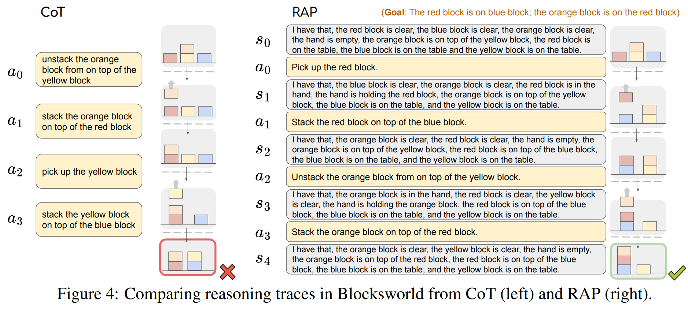

**Ayoai Impact**: RAP's dual-role LLM approach is groundbreaking:
- LLM as both world model AND reasoning agent
- Task-specific reward functions for goal-oriented planning
- Self-evaluation capability for quality control
- 33% improvement over GPT-4 CoT shows massive potential
- Back-propagation enables learning from exploration

## LLM A*

- LLM A* [Xiao and Wang, 2023] [https://arxiv.org/abs/2312.01797](https://arxiv.org/abs/2312.01797) (found from: Planning-of-LLM-Agents)

  - Abstract
    - This research focuses on how Large Language Models (LLMs) can help with path planning for mobile embodied agents such as robots, in a human-in-the-loop and interactive manner. A novel framework named LLM A*, aims to leverage the commonsense of LLMs, and the utility-optimal A* is proposed to facilitate few-shot near-optimal path planning. Prompts are used to 1) provide LLMs with essential information like environment, cost, heuristics, etc.; 2) communicate human feedback to LLMs on intermediate planning results. This makes the whole path planning process a 'white box' and human feedback guides LLM A* to converge quickly compared to other data-driven methods such as reinforcement learning-based (RL) path planning. In addition, it makes code-free path planning practical, henceforth promoting the inclusiveness of artificial intelligence techniques. Comparative analysis against A* and RL shows that LLM A* is more efficient in terms of search space and achieves an on-a-par path with A* and a better path than RL. The interactive nature of LLM A* also makes it a promising tool for deployment in collaborative human-robot tasks.

  - Descriptions from this planning survey:
    - Optimal Plan Selection = To select the optimal plan among the candidate plans, diverse strategies are adopted as heuristic search algorithms.
    - Utilizes the classic A* algorithm from artificial intelligence to assist LLM in search. The Chebyshev distance from the current position to the target position serves as the heuristic cost function for selecting the optimal path.

  - Zak thoughts
    - Had interesting prompting but nothing really for me to use.
      - 

**Ayoai Impact**: LLM A* demonstrates pathfinding integration:
- A* provides optimal path guarantees
- Human-in-the-loop for interactive refinement
- Could be used for Roblox navigation planning
- White-box approach enables debugging

## RankPrompt

- RankPrompt: Step-by-Step Comparisons Make Language Models Better Reasoners https://arxiv.org/abs/2403.12373

  - Abstract
    - Large Language Models (LLMs) have achieved impressive performance across various reasoning tasks. However, even state-of-the-art LLMs such as ChatGPT are prone to logical errors during their reasoning processes. Existing solutions, such as deploying task-specific verifiers or voting over multiple reasoning paths, either require extensive human annotations or fail in scenarios with inconsistent responses. To address these challenges, we introduce RankPrompt, a new prompting method that enables LLMs to self-rank their responses without additional resources. RankPrompt breaks down the ranking problem into a series of comparisons among diverse responses, leveraging the inherent capabilities of LLMs to generate chains of comparison as contextual exemplars. Our experiments across 11 arithmetic and commonsense reasoning tasks show that RankPrompt significantly enhances the reasoning performance of ChatGPT and GPT-4, with improvements of up to 13%. Moreover, RankPrompt excels in LLM-based automatic evaluations for open-ended tasks, aligning with human judgments 74% of the time in the AlpacaEval dataset. It also exhibits robustness to variations in response order and consistency. Collectively, our results validate RankPrompt as an effective method for eliciting high-quality feedback from language models.

  - Zak Thoughts
    - No code, just a cool prompt strategy.
    - 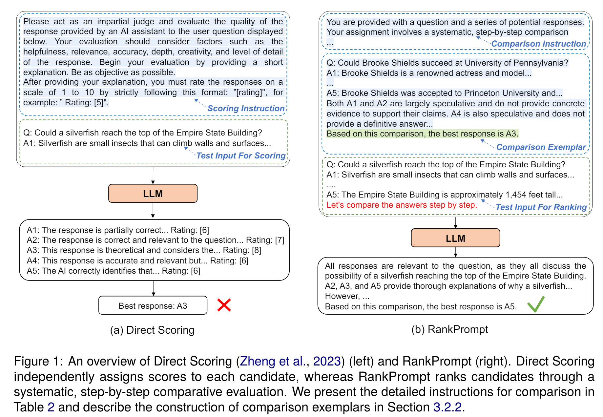
    - 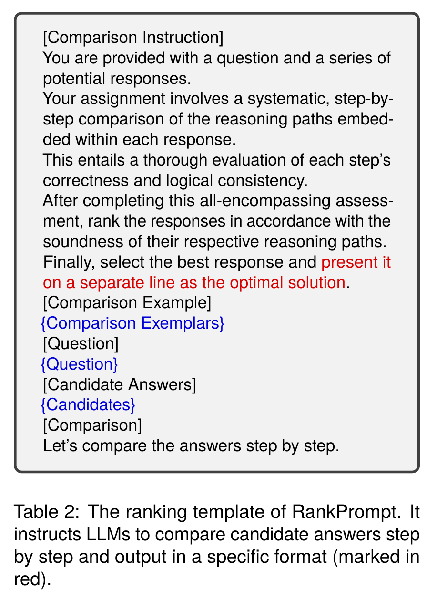

**Ayoai Impact**: RankPrompt offers self-evaluation without extra resources:
- Agents can rank their own plan quality
- 13% performance improvement
- No additional training or annotations needed
- Perfect for selecting between multiple behavior tree options

## MacGyver

- MacGyver: Are Large Language Models Creative Problem Solvers? <https://arxiv.org/abs/2311.09682>

  - Abstract
    - We explore the creative problem-solving capabilities of modern LLMs in a novel constrained setting. To this end, we create MACGYVER, an automatically generated dataset consisting of over 1,600 real-world problems deliberately designed to trigger innovative usage of objects and necessitate out-of-the-box thinking. We then present our collection to both LLMs and humans to compare and contrast their problem-solving abilities. MACGYVER is challenging for both groups, but in unique and complementary ways. For instance, humans excel in tasks they are familiar with but struggle with domain-specific knowledge, leading to a higher variance. In contrast, LLMs, exposed to a variety of specialized knowledge, attempt broader problems but fail by proposing physically-infeasible actions. Finally, we provide a detailed error analysis of LLMs, and demonstrate the potential of enhancing their problem-solving ability with novel prompting techniques such as iterative step-wise reflection and divergent-convergent thinking. This work (1) introduces a fresh arena for intelligent agents focusing on intricate aspects of physical reasoning, planning, and unconventional thinking, which supplements the existing spectrum of machine intelligence; and (2) provides insight into the constrained problem-solving capabilities of both humans and AI.

  - Zak thoughts
    - Cool but maybe a nice to have?
    - 
    - 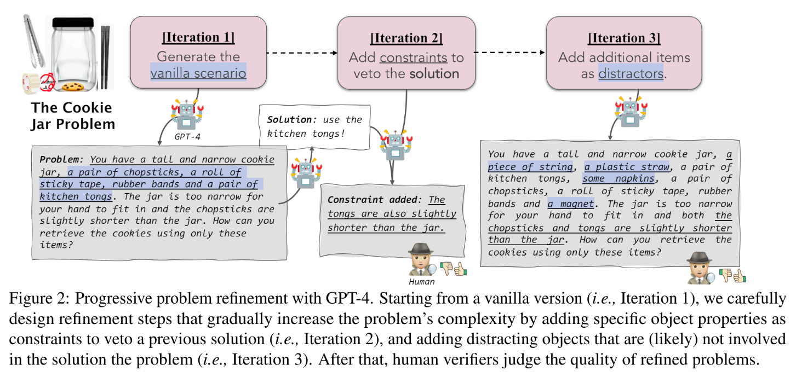
    - 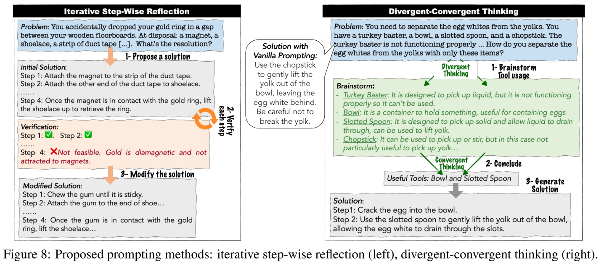

**Ayoai Impact**: MacGyver reveals creative problem-solving challenges:
- Tests unconventional object usage (important for sandbox games)
- Shows LLM limitations with physical feasibility
- Divergent-convergent thinking could enhance agent creativity
- Helps identify when agents propose impossible actions

## Violation of Expectation

- Violation of Expectation via Metacognitive Prompting Reduces Theory of Mind Prediction Error in Large Language Models <https://arxiv.org/abs/2310.06983>

  - Abstract
    - Recent research shows that Large Language Models (LLMs) exhibit a compelling level of proficiency in Theory of Mind (ToM) tasks. This ability to impute unobservable mental states to others is vital to human social cognition and may prove equally important in principal-agent relations between individual humans and Artificial Intelligences (AIs). In this paper, we explore how a mechanism studied in developmental psychology known as Violation of Expectation (VoE) can be implemented to reduce errors in LLM prediction about users by leveraging emergent ToM affordances. And we introduce a \textit{metacognitive prompting} framework to apply VoE in the context of an AI tutor. By storing and retrieving facts derived in cases where LLM expectation about the user was violated, we find that LLMs are able to learn about users in ways that echo theories of human learning. Finally, we discuss latent hazards and augmentative opportunities associated with modeling user psychology and propose ways to mitigate risk along with possible directions for future inquiry.

  - Zak Thoughts
    - I really like the idea of seeing if there was a violation in expectation on how the behavior tree did. Like, where do we get the expectation from though? Maybe LifingPolls?
    - 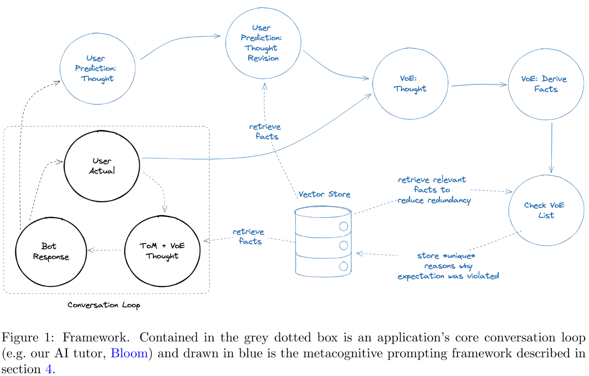

**Ayoai Impact**: VoE is crucial for adaptive agent behavior:
- Agents can learn when their predictions about players fail
- Store violations as learning experiences
- Improves Theory of Mind capabilities
- Could use LifingPolls for baseline expectations
- Enables agents to adapt to individual player behaviors

## Pairwise Better Than Score

- Instead of using a score, asking the llm to choose is better. <https://x.com/hwchase17/status/1796269356625875049?s=19>
  - 

**Ayoai Impact**: Simple but effective insight:
- Use pairwise comparisons instead of absolute scoring
- More reliable plan selection
- Aligns with RankPrompt findings

## Goal Misgeneralization

- Goal Misgeneralization: Why Correct Specifications Aren't Enough For Correct Goals <https://arxiv.org/abs/2210.01790>

  - Abstract
    - The field of AI alignment is concerned with AI systems that pursue unintended goals. One commonly studied mechanism by which an unintended goal might arise is specification gaming, in which the designer-provided specification is flawed in a way that the designers did not foresee. However, an AI system may pursue an undesired goal even when the specification is correct, in the case of goal misgeneralization. Goal misgeneralization is a specific form of robustness failure for learning algorithms in which the learned program competently pursues an undesired goal that leads to good performance in training situations but bad performance in novel test situations. We demonstrate that goal misgeneralization can occur in practical systems by providing several examples in deep learning systems across a variety of domains. Extrapolating forward to more capable systems, we provide hypotheticals that illustrate how goal misgeneralization could lead to catastrophic risk. We suggest several research directions that could reduce the risk of goal misgeneralization for future systems.

  - Zak Thoughts
    - 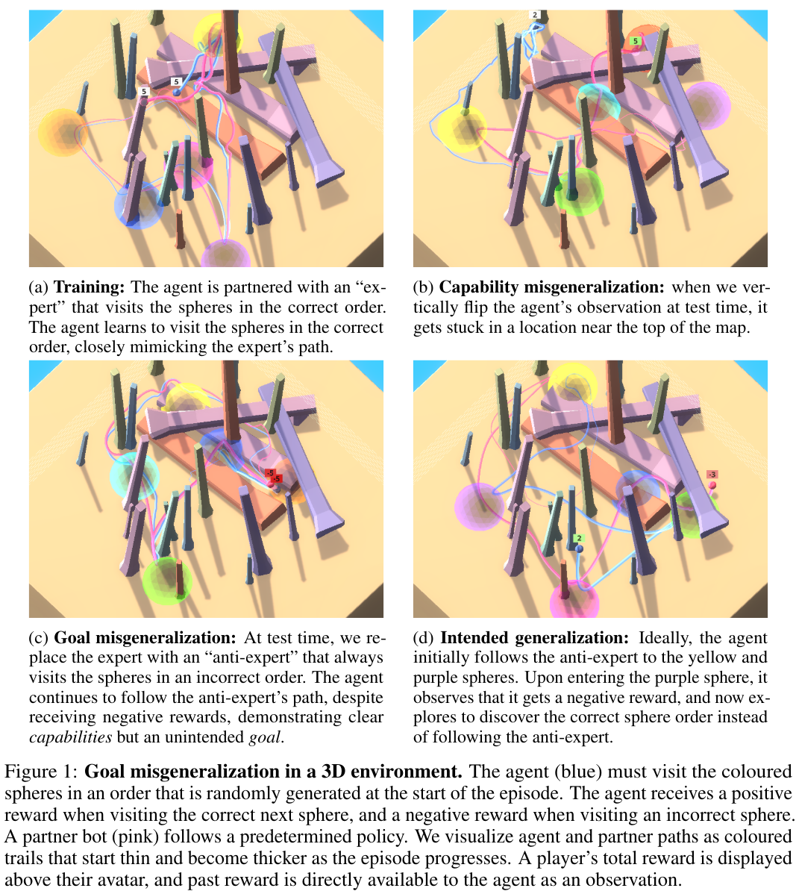

**Ayoai Impact**: Critical safety consideration for game agents:
- Agents might pursue unintended goals that seem correct
- Important for preventing exploitative behavior
- Need robust goal specification in behavior trees
- Regular monitoring for emergent undesired behaviors

## Devil's Advocate

- Devil's Advocate: Anticipatory Reflection for LLM Agents <https://arxiv.org/abs/2405.16334>

  - Abstract
    - In this work, we introduce a novel approach that equips LLM agents with introspection, enhancing consistency and adaptability in solving complex tasks. Our approach prompts LLM agents to decompose a given task into manageable subtasks (i.e., to make a plan), and to continuously introspect upon the suitability and results of their actions. We implement a three-fold introspective intervention: 1) anticipatory reflection on potential failures and alternative remedy before action execution, 2) post-action alignment with subtask objectives and backtracking with remedy to ensure utmost effort in plan execution, and 3) comprehensive review upon plan completion for future strategy refinement. By deploying and experimenting with this methodology - a zero-shot approach - within WebArena for practical tasks in web environments, our agent demonstrates superior performance over existing zero-shot methods. The experimental results suggest that our introspection-driven approach not only enhances the agent's ability to navigate unanticipated challenges through a robust mechanism of plan execution, but also improves efficiency by reducing the number of trials and plan revisions needed to achieve a task.

  - Zak thoughts
    - Cool!
    - 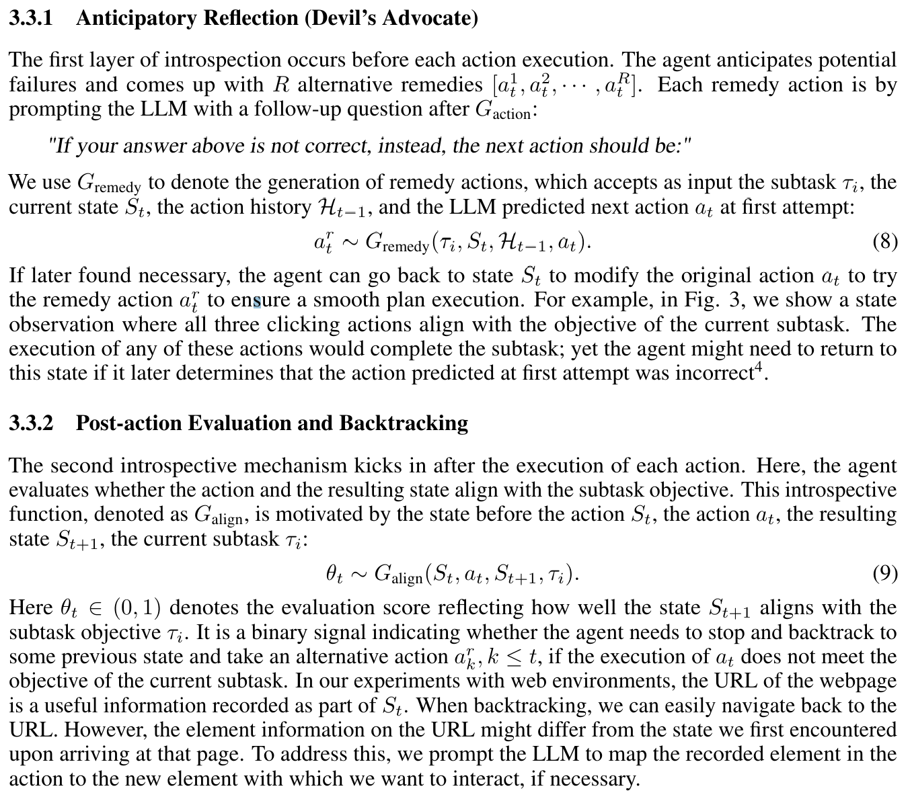

**Ayoai Impact**: Three-fold introspection is perfect for robust agents:
- Anticipatory reflection before actions (prevent failures)
- Post-action alignment checks (ensure goals met)
- Comprehensive review for learning
- Reduces trial-and-error iterations
- Could integrate with behavior tree execution monitoring

## Additional Considerations

### Concise Chain of Thought
- The Benefits of a Concise Chain of Thought on Problem-Solving in Large Language Models <https://arxiv.org/abs/2401.05618>
  - 48.70% response length reduction with negligible performance impact
  - Important for real-time game performance

### OMNI-EPIC
- OMNI-EPIC: Open-endedness via Models of human Notions of Interestingness with Environments Programmed in Code <https://arxiv.org/abs/2405.15568>
  - Has code!!! <https://omni-epic.vercel.app/>
  - Uses previous behaviors as stepping stones for elaboration
  - Generates learnable and interesting environments
  - Perfect for creating varied NPC behaviors

### Intelligent Go-Explore
- Intelligent Go-Explore: Standing on the Shoulders of Giant Foundation Models <https://arxiv.org/abs/2405.15143>
  - Has website with code: <https://www.conglu.co.uk/intelligentgoexplore/>
  - Leverages FM ability to judge interestingness
  - Captures serendipity on the fly
  - 100% success rate 70.8% faster than baselines