# Planner-Aided Planning

Employ an external planner to elevate the planning procedure, while the LLM mainly plays the role in formalizing the tasks. Challenges arise when confronted with environments featuring intricate constraints, such as mathematical problem-solving or generating admissible actions.

## Overall Notes

- Thoughts on this method from this planning survey:
  - To address challenges, several methods integrate LLMs with external planners. Such methods can be categorized into symbolic planners and neural planners based on the introduced planners.
    - Most of them are symbolic planners in this section, and they are marked.
    - Defined as: Symbolic Planner - Have served as a fundamental component in the fields of automated planning for several decades. These approaches, based on well-established symbolic formalized models, such as PDDL models [Aeronautiques et al., 1998; Haslum et al., 2019], employ symbolic reasoning to identify optimal paths from initial states to desired goal states.

  - For those strategies that leverage an additional planner for assistance, LLM primarily plays a supportive role. Its main functions involve parsing textual feedback and providing additional reasoning information to assist in planning, particularly when addressing complex problems.

  - Specifically, the enhancement of LLM's capabilities in code generation empowers the potential to deal with more general tasks for symbolic artificial intelligence. Actually, a significant drawback of traditional symbolic AI systems lies in the complexity and heavy reliance on human experts in constructing symbolic models, while LLM accelerates this process, facilitating faster and more optimal establishment of symbolic models.

  - The combination of statistical AI with LLM is poised to become a major trend in the future development of artificial intelligence.

  - LLM, being fundamentally based on statistical learning, optimizes the probability of the next word through massive data. Compared to symbolic artificial intelligence, this approach struggles to obey complex constraints, especially when dealing with less common constraints encountered during LLM training. Consequently, plans generated by LLM may lack feasibility without considering adequate preconditions. Connecting LLM with symbolic planning models without altering LLM itself is a promising future direction.

- Zak thoughts on this method
  - I need a antecedent engine. In this engine, there could be a randomness engine introducing a weather event and lowering health, something like that. They go from outside to inside. We need these intrinsic motivation bars.

  - Pddl f4actile. Planner that turns into behavior tree. For example, go to dance together . . . Dancing is only part of it. How is that going to work? It must be generative. . .

  - Soon need to finalize actions on roblox so I can perfect that pddl action domain thing. Post of these actions are going to be memory retrieval and stuff.

  - I think I just use my intuition on this area. I will be doing some of this naturally. Still some interesting quotes in this section.

  - False, there are two things in here I really like initially. SwiftSage, and the pddl one.

  - When doing this with lllms, I should have one summarize why. Like, why that goal, what do you like about it. What will it hurt if you do not do it.

  - Public action vs private action and action reason . . . And other information.

  - PDDL or BTs? Behavior Trees (BTs) and Planning Domain Definition Language (PDDL) are both tools used in artificial intelligence and robotics for planning and decision-making, but they have different structures and use cases:

    - Behavior Trees (BTs):
      - Use Cases: BTs are commonly used in game development and robotics for managing complex behaviors in dynamic environments. They are particularly well-suited for real-time decision-making and can be easily updated and debugged due to their modular nature.
      - Flexibility and Modularity: Behavior Trees allow for easy modification and testing of individual components. They can adapt well to changes in the environment and are straightforward for developers to understand and implement.
      - Real-time Performance: Designed for real-time systems, BTs are particularly effective in scenarios where decisions need to be made quickly and efficiently.

    - Planning Domain Definition Language (PDDL):
      - Structure: PDDL is a formal language used to define the components of planning problems in terms of objects, states, actions, and goals. It separates the domain description (which defines the actions and predicates) from the problem description (which defines the specific objects, initial state, and goal).
      - Use Cases: PDDL is used in automated planning and scheduling applications. It is ideal for situations where a sequence of actions needs to be planned out in advance to achieve a specific goal, such as logistics, workflow management, and AI research.
      - Expressiveness and Generality: PDDL allows for the expression of complex planning problems and supports various types of planning, including temporal and hierarchical planning.
      - Planning Efficiency: Solutions in PDDL are generated through offline planning, which can involve significant computational resources but results in a comprehensive plan that guides the agent towards the goal.

  - Yes, one can translate a pddl output into a behavior tree, asking llm to do the translation. Hmmm. Here is a prompt:
    - Given the below domain and problem pddl files, can you make me a behavior tree? Domain pddl file: (define (domain letseat) (:requirements :typing) (:types location locatable - object bot cupcake - locatable robot - bot ) (:predicates (on ?obj - locatable ?loc - location) (holding ?arm - locatable ?cupcake - locatable) (arm-empty) (path ?location1 - location ?location2 - location) ) (:action pick-up :parameters (?arm - bot ?cupcake - locatable ?loc - location) :precondition (and (on ?arm ?loc) (on ?cupcake ?loc) (arm-empty) ) :effect (and (not (on ?cupcake ?loc)) (holding ?arm ?cupcake) (not (arm-empty)) ) ) (:action drop :parameters (?arm - bot ?cupcake - locatable ?loc - location) :precondition (and (on ?arm ?loc) (holding ?arm ?cupcake) ) :effect (and (on ?cupcake ?loc) (arm-empty) (not (holding ?arm ?cupcake)) ) ) (:action move :parameters (?arm - bot ?from - location ?to - location) :precondition (and (on ?arm ?from) (path ?from ?to) ) :effect (and (not (on ?arm ?from)) (on ?arm ?to) ) ) ) Here is the problem pddl file: (define (problem letseat-simple) (:domain letseat) (:objects arm - robot cupcake - cupcake table - location plate - location ) (:init (on arm table) (on cupcake table) (arm-empty) (path table plate) ) (:goal (on cupcake plate) ) )

  - This is interesting about planning: [https://arxiv.org/abs/1804.08229](https://arxiv.org/abs/1804.08229) and when to choose what?
    - Difference between ASP and PDDL??

  - PDDL (Planning Domain Definition Language)
    - Good thing to read and find out: <http://pddl4j.imag.fr/pddl_tutorial.html#defining-the-problem>
    - All of this though has nothing to do with the planner, and everything to do with getting into common format for planners!. Once we have it in this format, we can plan off of it.
    - Objects: Things in the world that interest us.
    - Predicates: Properties of objects that we are interested in; can be true or false.
    - Initial state: The state of the world that we start in.
    - Goal specification: Things that we want to be true.
    - Actions/Operators: Ways of changing the state of the world.

    - Example domain file
      - (define (domain logistics)
      - (:requirements :strips :typing)
      - (:types city place physobj - object
        package vehicle - physobj
        truck airplane - vehicle
        airport location - place
        )
      - (:predicates (in-city ?loc - place ?city - city)
                     (at ?obj - physobj ?loc - place)
                     (in ?pkg - package ?veh - vehicle))
      - (:action load-truck
        :parameters (?pkg - package ?truck - truck ?loc - place)
        :precondition (and (at ?truck ?loc) (at ?pkg ?loc))
        :effect (and (not (at ?pkg ?loc)) (in ?pkg ?truck))
        )
      - (:action load-airplane
        :parameters (?pkg - package ?airplane - airplane ?loc - place)
        :precondition (and (at ?pkg ?loc) (at ?airplane ?loc))
        :effect (and (not (at ?pkg ?loc)) (in ?pkg ?airplane))
        )
      - (:action unload-truck
        :parameters (?pkg - package ?truck - truck ?loc - place)
        :precondition (and (at ?truck ?loc) (in ?pkg ?truck))
        :effect (and (not (in ?pkg ?truck)) (at ?pkg ?loc))
        )
      - (:action unload-airplane
        :parameters (?pkg - package ?airplane - airplane ?loc - place)
        :precondition (and (in ?pkg ?airplane) (at ?airplane ?loc))
        :effect (and (not (in ?pkg ?airplane)) (at ?pkg ?loc))
        )
      - (:action fly-airplane
        :parameters (?airplane - airplane ?loc-from - airport ?loc-to - airport)
        :precondition (at ?airplane ?loc-from)
        :effect (and (not (at ?airplane ?loc-from)) (at ?airplane ?loc-to))
        )
      - (:action drive-truck
        :parameters (?truck - truck ?loc-from - place ?loc-to - place ?city - city)
        :precondition (and (at ?truck ?loc-from) (in-city ?loc-from ?city) (in-city ?loc-to ?city))
        :effect (and (not (at ?truck ?loc-from)) (at ?truck ?loc-to))
        )
        )

    - Example problem file:
      - (define (problem pb_logistics)
        (:domain logistics)
      - (:objects
        plane - airplane
        truck - truck
        cdg lhr - airport
        south north - location
        paris london - city
        p1 p2 - package)
      - (:init (in-city cdg paris)
        (in-city lhr london)
        (in-city north paris)
        (in-city south paris)
        (at plane lhr)
        (at truck cdg)
        (at p1 lhr)
        (at p2 lhr)
        )
      - (:goal (and (at p1 north) (at p2 south)))
        )

  - GOAP (Goal-Oriented Action Planning)
    - Maybe this one? <https://gamedevelopment.tutsplus.com/tutorials/goal-oriented-action-planning-for-a-smarter-ai--cms-20793>
    - Read this article: [https://medium.com/@vedantchaudhari/goal-oriented-action-planning-34035ed40d0b](https://medium.com/@vedantchaudhari/goal-oriented-action-planning-34035ed40d0b)
    - This is what implements A*. We want python here, no?
    - Maybe this code?
      - <https://github.com/bitcraft/pygoap/tree/master/pygoap>
      - <https://github.com/agoose77/GOAP>

  - There is also an HTN?
    - This looks kinda like a behavior tree though? This is for task decompision.
    - What is the difference between an HTN and GOAP?
    - Wow, ok, this guy is doing task deompension here, and then I can tie this ito goap maybbe? Maybe this is what I want here? [https://github.com/DaemonIB/GPT-HTN-Planner](https://github.com/DaemonIB/GPT-HTN-Planner)
      - The thing that is drawing me here is his task decomposition logic.
      - cd /Users/Zachary/OneDrive/Zak/SmartNPCs/"Python Projects"/"Planning Playing"/Zak_Planner_main
      - python src/prompt_evolver.py
      - python src/htn_planner.py
      - python src/main.py
      - pip install --upgrade network
      - pip install --upgrade numpy
      - Empty wrapper that is trash. Trash can. Integer
      - Put empty wrapper trash in the trash can.
      - Two plates on counter.
        - Ham in between bread. Bread on plate. Plate and bread on table.
    - So the "is replan required" is the trigger to go deeper recursive or not. If the original thing was a fine plan, then this will go no deeper. Hmm, I think I like that, I am getting warm and fuzzies.
    - HOW TO GET THIS PLANNER MORE CONTEXT. PDDL I think is the way. We just need this thing pumping out plans, that's all. Lol
    - It looks like a node with sub tasks, so a basic tree. For the A* stuff an external library was used though, which I do not think I like.
    - One challenge here though is that I needed to stop using the library guidance. Also, their prompts are not that good so I need to make them better.

  - Get things into PDDL - how ot build domain file. . .
    - Main paper I liked and that had code: [https://arxiv.org/pdf/2305.14909.pdf](https://arxiv.org/pdf/2305.14909.pdf)
      - <https://github.com/GuanSuns/LLMs-World-Models-for-Planning>
      - Leveraging Pre-trained Large Language Models to Construct and Utilize World Models for Model-based Task Planning
    - Seems to be main one:
      - cd /Users/Zachary/OneDrive/Zak/SmartNPCs/"Python Projects"/"Planning Playing"/LLMs-World-Models-for-Planning-main-zak1
    - python construct_action_models.py
    - python correct_action_models.py
    - python experiments/example_task_reader.py
    - Wow wow wow - no code lol :(
      - I thought this was only a domain file builder.
      - Yeah, we still need to worry about our problem file :(
      - However, omg!!! Ok so they have this experimental feature that trys to build the "instructions" and the object lists and the states, and those are inputs into a problem file. So I think that is what they tried to do next. Yeah, I need that problem file. . .
      - They said this about problem files: The code for converting a list of object states into a PDDL problem file is not included here. In our experiment, we simply hard coded a script to prepare PDDL problem files based on a manually-defined mapping between object states here and predicates generated by GPT-4. This process could be automated with language models.

  - How to build a problem file?!
    - How do you create problem files? Is there something I am missing?
    - Does this one create problem files?
    - The very first one listed does generate problem files!!
      - <https://arxiv.org/abs/2304.11477>. LLM+P
      - Has code here!!! <https://github.com/Cranial-XIX/llm-pddl/blob/main/main.py>
    - Here is more pddl code from 2 years ago that looks kind of interesting: [https://github.com/Learning-and-Intelligent-Systems/llm4pddl](https://github.com/Learning-and-Intelligent-Systems/llm4pddl). It has many different types of planners in there that they experimented with. Hmm. No problem file either?
    - Omg I want to look at this one now!! It also has code and also tries to build a problem file?
      - <https://github.com/zharry29/proc2pddl>
      - Proc2pddl - this is in the open domain thing they talked about. . . [https://arxiv.org/abs/2403.00092v1](https://arxiv.org/abs/2403.00092v1)
      - It referenced this pddl parser which looks cool! [https://github.com/pucrs-automated-planning/pddl-parser/tree/master/pddl_parser](https://github.com/pucrs-automated-planning/pddl-parser/tree/master/pddl_parser)
      - Ugh, they are not producing a problem file either!!! Why?
    - Hmmm, so the last one had some experiment that started building it. I need to finish that?
      This research paper may have the abiltity to create problem files
      - Paper: LLM+P: Empowering Large Language Models with Optimal Planning Proficiency <https://arxiv.org/abs/2304.11477>
      - Has code: [https://github.com/Cranial-XIX/llm-pddl](https://github.com/Cranial-XIX/llm-pddl)
      - Ok there is decent code here but I got to pull it out and it will take time. [https://github.com/Cranial-XIX/llm-pddl/blob/main/main.py](https://github.com/Cranial-XIX/llm-pddl/blob/main/main.py)

  - Agent lite - the idea of a manager of agents
    - <https://github.com/SalesforceAIResearch/AgentLite>
    - I think this is the framework I need to be running multiple things at once and the hierachial nature of the manager is exactly what I was after.

  - How do I fit all of these into my 5 things I have in todoist:
    - Seeds to figure out what type of domain file I need
    - Pddl domain file
    - Pddl problem file
    - Based on domain and problem files - plan and output behavior trees
    - Perfect the behavior trees and send.

  - Behavior tree
  - What are the others?
  - See my Antecedent Map ideas page for more ideast too

  - Other Notes:
    - So the pddl seems like it should stick to higher level tasks for me. Think like, a daily planner. Go to park. Cook dinner. Something like that? Then maybe goap is in the middle? Then behavior tree is at bottom. Like behavior tree are timings like, move left, move right. Etc.
      - But can't pddl high level tasks be translated to a behavior tree? Nah but why? We just leave in pddl formate on server until the end. Then the key will be to behavior trees on roblox.
      - Wait ok, so the downfall of pddl is that it only describes the domain and problem. The output of the planning phase can be anything we want. So the input is pddl. The output is behavior tree!!!!
      - Wait ok, so the downfall of pddl is that it only describes the domain and problem. The output of the planning phase can be anything we want. So the input is pddl. The output is behavior tree!!!!
      - All the good questions in swiftsage I can still do all in pddl format. That format helps give me fast parsing ability.
      - The pddl would have to know every action that the behavior tree knows and more. Because the pddl would want to know the nodes of the tree to output. Therefore, the pddl generator dictates what task leaf nodes for the behavior tree?

**Ayoai Impact**: PDDL provides a formal foundation for agent planning:
- Domain files define available actions and preconditions
- Problem files specify initial state and goals
- Can translate PDDL plans to behavior trees
- Supports hierarchical planning (HTN)
- External planners guarantee correct plans
- LLMs can generate PDDL from natural language

## LLM+P

- LLM+P [Liu et al., 2023a] [https://arxiv.org/abs/2304.11477](https://arxiv.org/abs/2304.11477) (found from: Planning-of-LLM-Agents)

  - Abstract
    - Large language models (LLMs) have demonstrated remarkable zero-shot generalization abilities: state-of-the-art chatbots can provide plausible answers to many common questions that arise in daily life. However, so far, LLMs cannot reliably solve long-horizon planning problems. By contrast, classical planners, once a problem is given in a formatted way, can use efficient search algorithms to quickly identify correct, or even optimal, plans. In an effort to get the best of both worlds, this paper introduces LLM+P, the first framework that incorporates the strengths of classical planners into LLMs. LLM+P takes in a natural language description of a planning problem, then returns a correct (or optimal) plan for solving that problem in natural language. LLM+P does so by first converting the language description into a file written in the planning domain definition language (PDDL), then leveraging classical planners to quickly find a solution, and then translating the found solution back into natural language. Along with LLM+P, we define a diverse set of different benchmark problems taken from common planning scenarios. Via a comprehensive set of experiments on these benchmark problems, we find that LLM+P is able to provide optimal solutions for most problems, while LLMs fail to provide even feasible plans for most problems. The code and results are publicly available at [this https URL](https://github.com/Cranial-XIX/llm-pddl.git).

  - Descriptions from this planning survey:
    - Leveraging the semantic understanding and coding capabilities of LLM, the authors organize problems into textual language prompts inputted to LLM. This prompts LLM to organize the actions within the environment and specified tasks into the format of the PDDL language. Subsequently, after obtaining a formalized description, the authors employ the Fast-Downward 1 solver for the planning process.
    - symbolic planner

  - Zak thoughts
    - Has code!!! Looks like an install. [https://github.com/Cranial-XIX/llm-pddl/tree/main](https://github.com/Cranial-XIX/llm-pddl/tree/main)
    - Good but, meh, nothing to really add.
    - No wait - this one creates problem files!! This is the one I need. If I an can create these problem files, I can start planning. Hmm.

**Ayoai Impact**: LLM+P demonstrates the power of hybrid approaches:
- Natural language to PDDL translation
- Optimal planning guarantees
- Creates both domain AND problem files
- Code available for implementation
- Bridges gap between LLM flexibility and planner correctness

## LLM-DP

- LLM+P, LLM-DP [Dagan et al., 2023] [https://arxiv.org/abs/2308.06391](https://arxiv.org/abs/2308.06391) (found from: Planning-of-LLM-Agents)

  - Abstract
    - While Large Language Models (LLMs) can solve many NLP tasks in zero-shot settings, applications involving embodied agents remain problematic. In particular, complex plans that require multi-step reasoning become difficult and too costly as the context window grows. Planning requires understanding the likely effects of one's actions and identifying whether the current environment satisfies the goal state. While symbolic planners find optimal solutions quickly, they require a complete and accurate representation of the planning problem, severely limiting their use in practical scenarios. In contrast, modern LLMs cope with noisy observations and high levels of uncertainty when reasoning about a task. Our work presents LLM Dynamic Planner (LLM-DP): a neuro-symbolic framework where an LLM works hand-in-hand with a traditional planner to solve an embodied task. Given action-descriptions, LLM-DP solves Alfworld faster and more efficiently than a naive LLM ReAct baseline.

  - Descriptions from this planning survey:
    - Specifically designed for dynamic interactive environments. Upon receiving feedback from the environment, LLM processes the information, formalizes it into PDDL language, and then employs a BFS [Lipovetzky et al., 2014] solver to generate a plan.
    - symbolic planner

  - Zak thoughts
    - No code though -- hmm
    - Wow, ok this one is cool - it introduces an "action selector?" Hmmm: The Action Selector (AS) module decides the agent's immediate next action. It takes the planner's output, a set of plans, and selects an action from them. In our Alfworld experiments, the Action Selector simply selects the shortest plan returned. If no valid plans are returned, all sampled states were satisfying goal states, there is a mistake with the constructed domain/problem files, or the planner has failed to find a path to the goal. In the first case, we re-sample random world states and re-run the planners once.
    - 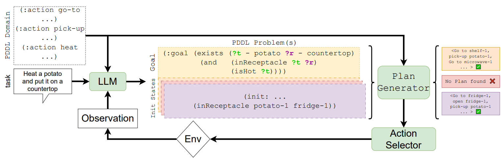
    - Sample prompt:
      - 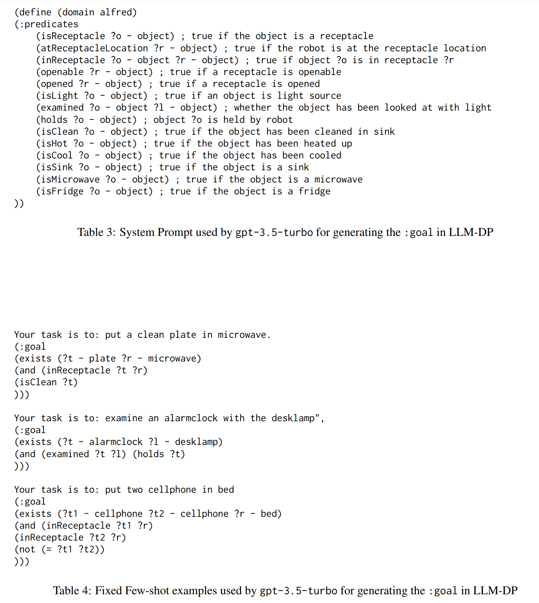

**Ayoai Impact**: LLM-DP shows dynamic replanning capabilities:
- Handles dynamic environments (critical for games)
- Action selector module for plan execution
- Fallback strategies when plans fail
- BFS solver for efficient search
- Neuro-symbolic approach combines best of both worlds

## LLM+PDDL

- LLM+PDDL [Guan et al., 2023] [https://arxiv.org/abs/2305.14909](https://arxiv.org/abs/2305.14909) (found from: Planning-of-LLM-Agents)

  - Abstract
    - There is a growing interest in applying pre-trained large language models (LLMs) to planning problems. However, methods that use LLMs directly as planners are currently impractical due to several factors, including limited correctness of plans, strong reliance on feedback from interactions with simulators or even the actual environment, and the inefficiency in utilizing human feedback. In this work, we introduce a novel alternative paradigm that constructs an explicit world (domain) model in planning domain definition language (PDDL) and then uses it to plan with sound domain-independent planners. To address the fact that LLMs may not generate a fully functional PDDL model initially, we employ LLMs as an interface between PDDL and sources of corrective feedback, such as PDDL validators and humans. For users who lack a background in PDDL, we show that LLMs can translate PDDL into natural language and effectively encode corrective feedback back to the underlying domain model. Our framework not only enjoys the correctness guarantee offered by the external planners but also reduces human involvement by allowing users to correct domain models at the beginning, rather than inspecting and correcting (through interactive prompting) every generated plan as in previous work. On two IPC domains and a Household domain that is more complicated than commonly used benchmarks such as ALFWorld, we demonstrate that GPT-4 can be leveraged to produce high-quality PDDL models for over 40 actions, and the corrected PDDL models are then used to successfully solve 48 challenging planning tasks. Resources, including the source code, are released at: [this https URL](https://guansuns.github.io/pages/llm-dm).

  - Descriptions from this planning survey:
    - Also utilizes the PDDL language to formalize the task, incorporating an additional step for manual verification to check for potential issues in the PDDL model generated by LLM. During the planning process, the authors propose using the plan generated by LLM as an initial heuristic solution to accelerate the search process of local search planners, such as LPG [Gerevini and Serina, 2002].
    - symbolic planner

  - Zak thoughts
    - Has code!!! [https://github.com/GuanSuns/LLMs-World-Models-for-Planning](https://github.com/GuanSuns/LLMs-World-Models-for-Planning)
      - Wow, hold on, this does not appear to be an install and simple ready to go. Hmm, do I want to get side tracked with this?!
    - They have some aweseom prompts in there. This one may be the one?!!?(LLM+PDDL [Guan et al., 2023])? Meaning, I have been looking for a planning framework to integrate, and this one looks freaking awesome and out of the box? Should I deep dive on this?
    - Wait ok ok, this thing is awesome. I need to review this one deeper I think!
    - Tell me more about this:
      - LLM modulo planner backprompted by VAL using LLM-acquired PDDL model. As outlined in Sec. 1, we can also use the extracted PDDL as a symbolic simulator or human proxy to provide corrective feedback based on validation information to an LLM planner. With this setup, the planner can iteratively refine the plans through re-prompting [42 [https://openreview.net/pdf?id=cMDMRBe1TKs](https://openreview.net/pdf?id=cMDMRBe1TKs)].
      - On the other hand, for the approach that utilizes PDDL models to validate LLM plans (i.e., LLM modulo planner back-prompted by VAL using LLMacquired domain model), we employ the state-of-the-art algorithm ReAct [60] with GPT-4 as the underlying LLM planner. However, we made two modifications to the prompt design. Firstly, we provide a detailed description of all actions in natural language, including parameters, preconditions, and effects. These descriptions are obtained by using another LLM to translate the generated PDDL domain model into natural language.
      - Furthermore, also in the Household domain, we observe that classical planners occasionally generate physically plausible but unconventional actions, such as placing a knife on a toaster when the knife is not being used. In contrast, the LLM planner rarely exhibits such actions, suggesting that LLMs possess knowledge of implicit human preferences. It would be meaningful to explore methods that more effectively combine the strengths of LLM planners and the correctness guarantee provided by symbolic domain models, particularly in determining which information from LLM plans should be preserved.
    - I do not have to use pddl, but I can use their design? Then if so maybe I am not tied to this design? OR maybe it is the exact language I was looking for?!
      - 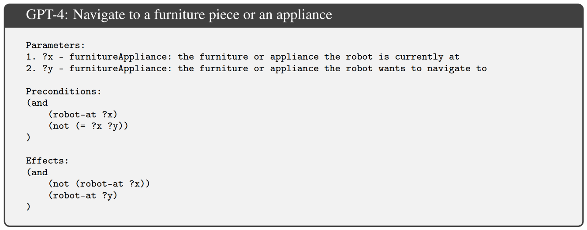
    - Overview:
      - 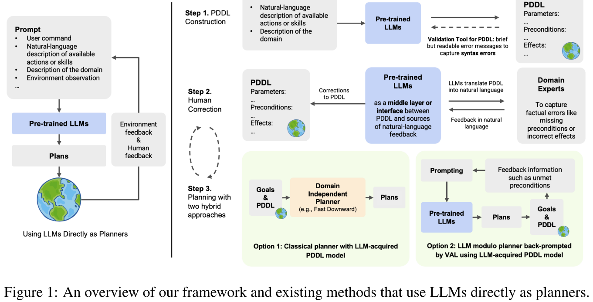

**Ayoai Impact**: LLM+PDDL provides comprehensive planning framework:
- Human feedback integration for model correction
- PDDL validation ensures correctness
- Handles complex domains (40+ actions)
- LLMs understand implicit human preferences
- Combines planner correctness with LLM common sense
- Perfect for building Ayoai's planning architecture

## Generalized Planning in PDDL

- Generalized Planning in PDDL Domains with Pretrained Large Language Models [https://arxiv.org/abs/2305.11014v2](https://arxiv.org/abs/2305.11014v2)

  - Abstract:
    - Recent work has considered whether large language models (LLMs) can function as planners: given a task, generate a plan. We investigate whether LLMs can serve as generalized planners: given a domain and training tasks, generate a program that efficiently produces plans for other tasks in the domain. In particular, we consider PDDL domains and use GPT-4 to synthesize Python programs. We also consider (1) Chain-of-Thought (CoT) summarization, where the LLM is prompted to summarize the domain and propose a strategy in words before synthesizing the program; and (2) automated debugging, where the program is validated with respect to the training tasks, and in case of errors, the LLM is re-prompted with four types of feedback. We evaluate this approach in seven PDDL domains and compare it to four ablations and four baselines. Overall, we find that GPT-4 is a surprisingly powerful generalized planner. We also conclude that automated debugging is very important, that CoT summarization has non-uniform impact, that GPT-4 is far superior to GPT-3.5, and that just two training tasks are often sufficient for strong generalization.

  - Zak Thoughts
    - Has code!!! [https://github.com/tomsilver/llm-genplan/tree/master](https://github.com/tomsilver/llm-genplan/tree/master)
    - symbolic planner
    - It outputs python which is interesting but not something I need. This is also just a planner - it does not create domain or problem files.
    - Wow - this is a llm planner - they did it and it looks decent. They used pddl format for sure. Why not use it?
    - 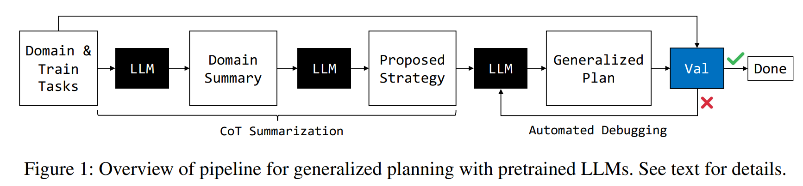

**Ayoai Impact**: Shows LLMs as generalized planners:
- GPT-4 can generate planning programs
- Automated debugging improves reliability
- Only 2 training tasks needed for generalization
- Python output could be adapted to Lua for Roblox
- Chain-of-Thought improves planning strategy

## Human-Level Forecasting

- Approaching Human-Level Forecasting with Language Models [https://arxiv.org/abs/2402.18563](https://arxiv.org/abs/2402.18563)

  - Abstract
    - Forecasting future events is important for policy and decision making. In this work, we study whether language models (LMs) can forecast at the level of competitive human forecasters. Towards this goal, we develop a retrieval-augmented LM system designed to automatically search for relevant information, generate forecasts, and aggregate predictions. To facilitate our study, we collect a large dataset of questions from competitive forecasting platforms. Under a test set published after the knowledge cut-offs of our LMs, we evaluate the end-to-end performance of our system against the aggregates of human forecasts. On average, the system nears the crowd aggregate of competitive forecasters, and in some settings surpasses it. Our work suggests that using LMs to forecast the future could provide accurate predictions at scale and help to inform institutional decision making.

  - Zak Thoughts
    - No code?
    - symbolic planner
    - OMG, there are some awesome prompts I want to use in this paper, on each step they gave the prmpts, so we know all the things they wanted each actor to do. Hell yeah!!
    - 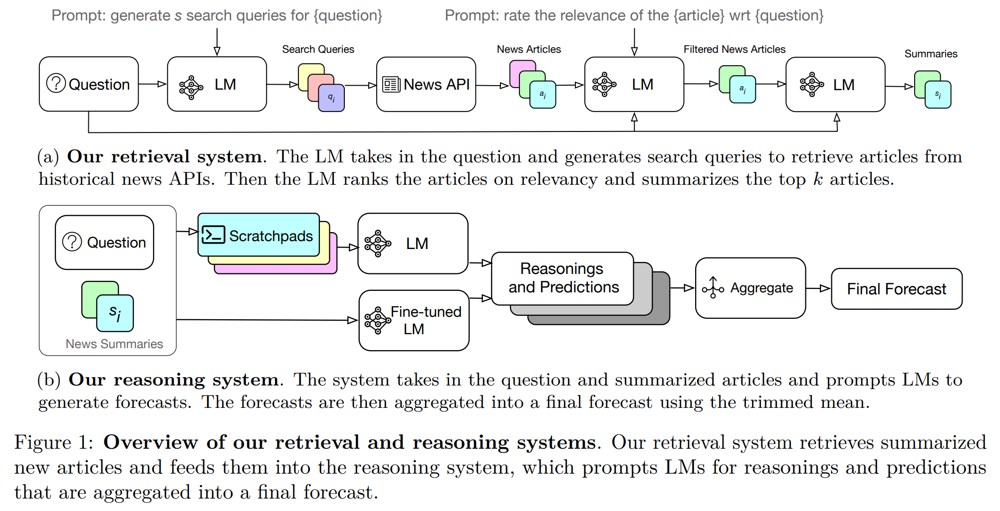
    - 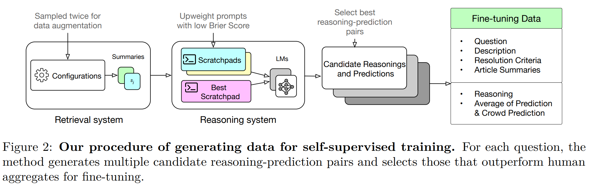
    - 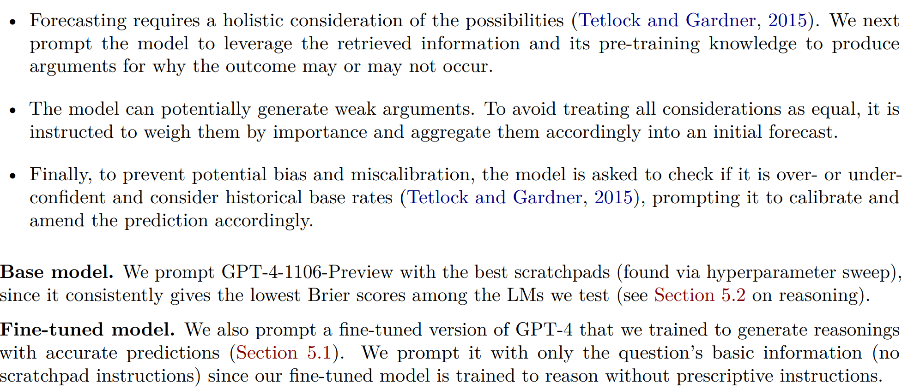

**Ayoai Impact**: Forecasting capabilities for predictive agents:
- Agents can predict player behavior
- Retrieval-augmented approach for context
- Matches human-level forecasting
- Useful for strategic NPC planning
- Great prompt examples for implementation

## LLM-Planner

- LLM-Planner: Few-Shot Grounded Planning for Embodied Agents with Large Language Models [https://arxiv.org/abs/2212.04088](https://arxiv.org/abs/2212.04088)

  - Abstract
    - This study focuses on embodied agents that can follow natural language instructions to complete complex tasks in a visually-perceived environment. Existing methods rely on a large amount of (instruction, gold trajectory) pairs to learn a good policy. The high data cost and poor sample efficiency prevents the development of versatile agents that are capable of many tasks and can learn new tasks quickly. In this work, we propose a novel method, LLM-Planner, that harnesses the power of large language models (LLMs) such as GPT-3 to do few-shot planning for embodied agents. We further propose a simple but effective way to enhance LLMs with physical grounding to generate plans that are grounded in the current environment. Experiments on the ALFRED dataset show that our method can achieve very competitive few-shot performance, even outperforming several recent baselines that are trained using the full training data despite using less than 0.5% of paired training data. Existing methods can barely complete any task successfully under the same few-shot setting. Our work opens the door for developing versatile and sample-efficient embodied agents that can quickly learn many tasks.

  - Zak Thoughts
    - No code?
    - symbolic planner
    - Same as others, double check their prompts maybe.
    - 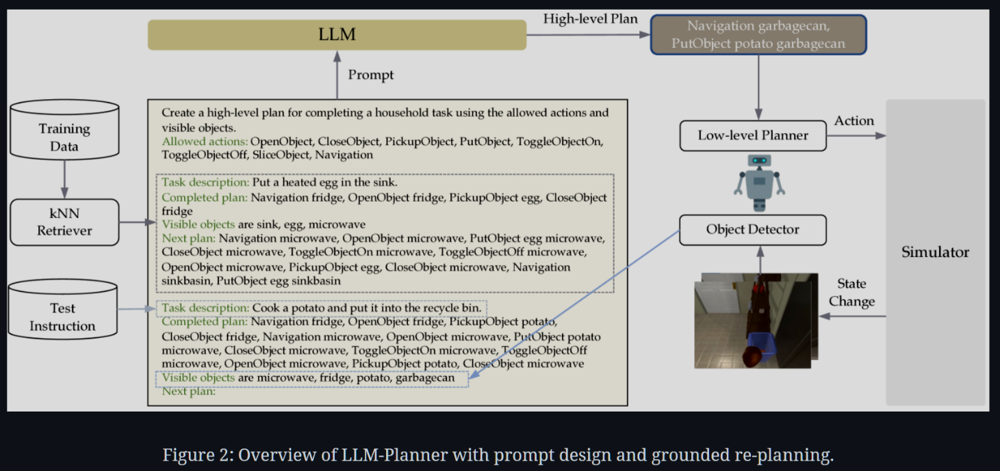

**Ayoai Impact**: LLM-Planner demonstrates few-shot learning capabilities:
- Less than 0.5% training data needed
- Physical grounding for environment awareness
- Opens door for versatile agents
- Perfect for rapidly adding new behaviors to Ayoai

## Goal-Directed Dialogue via RL

- Zero-Shot Goal-Directed Dialogue via RL on Imagined Conversations [https://arxiv.org/abs/2311.05584](https://arxiv.org/abs/2311.05584)

  - Abstract
    - Large language models (LLMs) have emerged as powerful and general solutions to many natural language tasks. However, many of the most important applications of language generation are interactive, where an agent has to talk to a person to reach a desired outcome. For example, a teacher might try to understand their student's current comprehension level to tailor their instruction accordingly, and a travel agent might ask questions of their customer to understand their preferences in order to recommend activities they might enjoy. LLMs trained with supervised fine-tuning or "single-step" RL, as with standard RLHF, might struggle which tasks that require such goal-directed behavior, since they are not trained to optimize for overall conversational outcomes after multiple turns of interaction. In this work, we explore a new method for adapting LLMs with RL for such goal-directed dialogue. Our key insight is that, though LLMs might not effectively solve goal-directed dialogue tasks out of the box, they can provide useful data for solving such tasks by simulating suboptimal but human-like behaviors. Given a textual description of a goal-directed dialogue task, we leverage LLMs to sample diverse synthetic rollouts of hypothetical in-domain human-human interactions. Our algorithm then utilizes this dataset with offline reinforcement learning to train an interactive conversational agent that can optimize goal-directed objectives over multiple turns. In effect, the LLM produces examples of possible interactions, and RL then processes these examples to learn to perform more optimal interactions. Empirically, we show that our proposed approach achieves state-of-the-art performance in various goal-directed dialogue tasks that include teaching and preference elicitation.

  - Zak thoughts
    - No code?
    - symbolic planner
    - Good idea about the imagination step, hmm.
    - 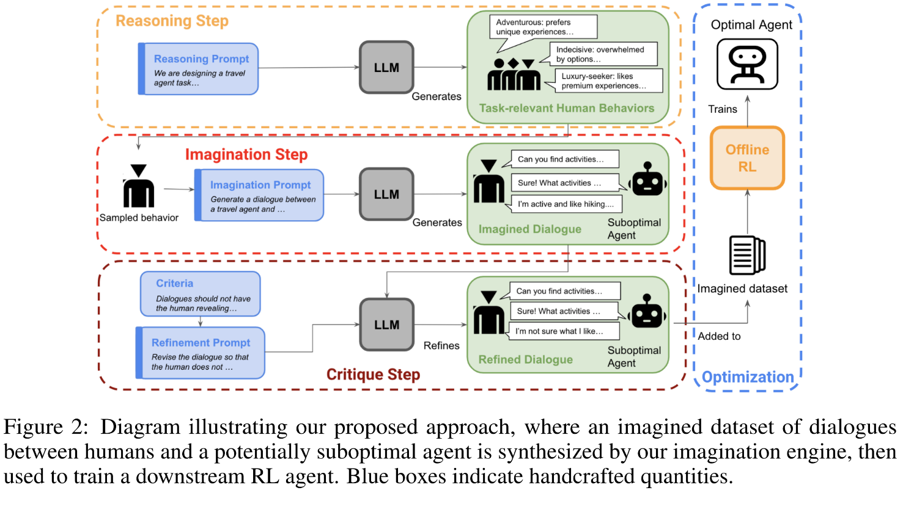

**Ayoai Impact**: Goal-directed dialogue is essential for NPC interactions:
- Multi-turn conversation optimization
- Imagined conversations for training data
- Perfect for NPCs with specific goals (shopkeeper, quest-giver)
- RL on synthetic data reduces real player testing needs

## LLM+ASP

- LLM+ASP [Yang et al., 2023b] [https://arxiv.org/abs/2307.07696](https://arxiv.org/abs/2307.07696) (found from: Planning-of-LLM-Agents)

  - Abstract
    - While large language models (LLMs), such as GPT-3, appear to be robust and general, their reasoning ability is not at a level to compete with the best models trained for specific natural language reasoning problems. In this study, we observe that a large language model can serve as a highly effective few-shot semantic parser. It can convert natural language sentences into a logical form that serves as input for answer set programs, a logic-based declarative knowledge representation formalism. The combination results in a robust and general system that can handle multiple question-answering tasks without requiring retraining for each new task. It only needs a few examples to guide the LLM's adaptation to a specific task, along with reusable ASP knowledge modules that can be applied to multiple tasks. We demonstrate that this method achieves state-of-the-art performance on several NLP benchmarks, including bAbI, StepGame, CLUTRR, and gSCAN. Additionally, it successfully tackles robot planning tasks that an LLM alone fails to solve.

  - Descriptions from this planning survey:
    - Transforms problems described in natural language by LLM into atomic facts, converting tasks into ASP problems. Subsequently, the ASP solver CLINGO is utilized to generate plans.
    - symbolic planner

  - Zak thoughts
    - Has code!! [https://github.com/azreasoners/LLM-ASP](https://github.com/azreasoners/LLM-ASP)
    - Overview: We refer to our framework as [LLM]+ASP where [LLM] denotes a large pre-trained network such as GPT-3, which we use as a semantic parser to generate input to the ASP reasoner. Specifically, we assume data instances of the form ⟨S, q, a⟩, where S is a context story in natural language, q is a natural language query associated with S, and a is the answer. We use an LLM to convert a problem description (that is, context S and query q) into atomic facts, which are then fed into the ASP solver along with background knowledge encoded as ASP rules. The output of the ASP solver is interpreted as the prediction for the given data instance.
    - 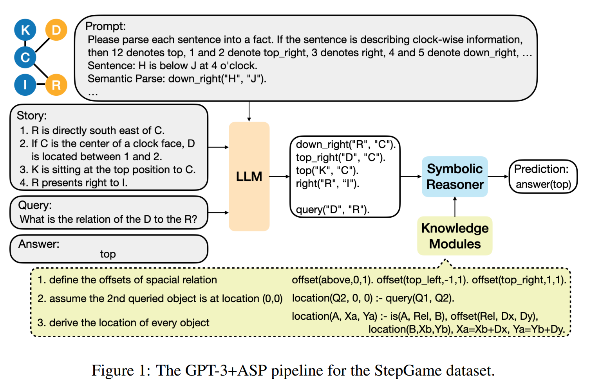
    - 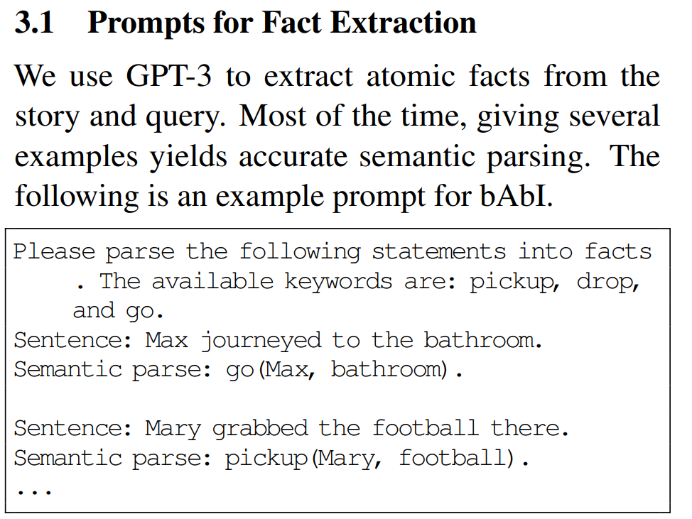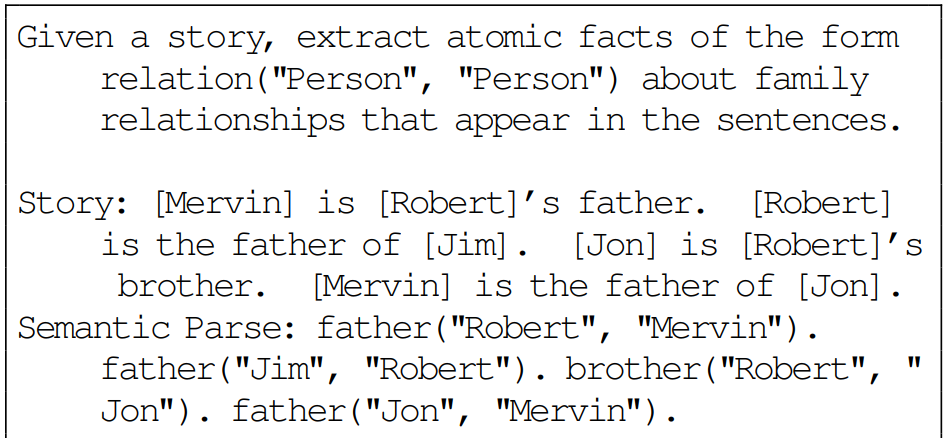

**Ayoai Impact**: ASP provides another formal reasoning approach:
- Answer Set Programming for logical reasoning
- Reusable knowledge modules
- Few-shot adaptation to new tasks
- Alternative to PDDL for certain problem types

## Option Critic Architecture

- Option Critic Architecture (found from: Lyfe Agents [Kaiya et al., 2023]) : [https://ojs.aaai.org/index.php/AAAI/article/view/10916](https://ojs.aaai.org/index.php/AAAI/article/view/10916)

  - Abstract
    - To tackle this challenge, we take ideas from hierarchical reinforcement learning (HRL) in machine learning (Bacon et al., 2017; Sutton et al., 1999) and the brain (Graybiel, 1998). In HRL, a "manager" chooses an option or high-level action that lasts for an extended amount of time while subsequent low-level actions are selected by a "worker". This design can allow the manager to focus on long-horizon decision making, see Pateria et al. (2021) for a review. [https://dl.acm.org/doi/10.1145/3453160]. This leads to many, but perhapes this most interesting: Deep Hierarchical Approach to Lifelong Learning in Minecraft. [https://arxiv.org/abs/1604.07255](https://arxiv.org/abs/1604.07255). We propose a lifelong learning system that has the ability to reuse and transfer knowledge from one task to another while efficiently retaining the previously learned knowledge-base. Knowledge is transferred by learning reusable skills to solve tasks in Minecraft, a popular video game which is an unsolved and high-dimensional lifelong learning problem. These reusable skills, which we refer to as Deep Skill Networks, are then incorporated into our novel Hierarchical Deep Reinforcement Learning Network (H-DRLN) architecture using two techniques: (1) a deep skill array and (2) skill distillation, our novel variation of policy distillation (Rusu et. al. 2015) for learning skills.

  - Zak thoughts
    - These seem old and redundant with other tree stuff, it was what my competitor altera mentioned in his research paper.

**Ayoai Impact**: Hierarchical RL aligns with Ayoai's architecture:
- Manager/worker separation (like perception verticles)
- Reusable skills (behavior tree nodes)
- Lifelong learning capabilities
- Proven in Minecraft (similar to Roblox)

## PROC2PDDL

- PROC2PDDL: Open-Domain Planning Representations from Texts [https://arxiv.org/abs/2403.00092v1](https://arxiv.org/abs/2403.00092v1)

  - Abstract
    - Planning in a text-based environment continues to be a major challenge for AI systems. Recent approaches have used language models to predict a planning domain definition (e.g., PDDL) but have only been evaluated in closed-domain simulated environments. To address this, we present Proc2PDDL , the first dataset containing open-domain procedural texts paired with expert-annotated PDDL representations. Using this dataset, we evaluate state-of-the-art models on defining the preconditions and effects of actions. We show that Proc2PDDL is highly challenging, with GPT-3.5's success rate close to 0% and GPT-4's around 35%. Our analysis shows both syntactic and semantic errors, indicating LMs' deficiency in both generating domain-specific prgorams and reasoning about events. We hope this analysis and dataset helps future progress towards integrating the best of LMs and formal planning.

  - Zak thoughts
    - Has code!!! [https://github.com/zharry29/proc2pddl](https://github.com/zharry29/proc2pddl)
    - What is difference between closed-domain and open-domain simulated environments?! I am definitely going for open domain, but making a manager make it seem more closed to the this system, right?
    - Yikes: We show that Proc2PDDL is highly challenging, with GPT-3.5's success rate close to 0% and GPT-4's around 35%.
    - 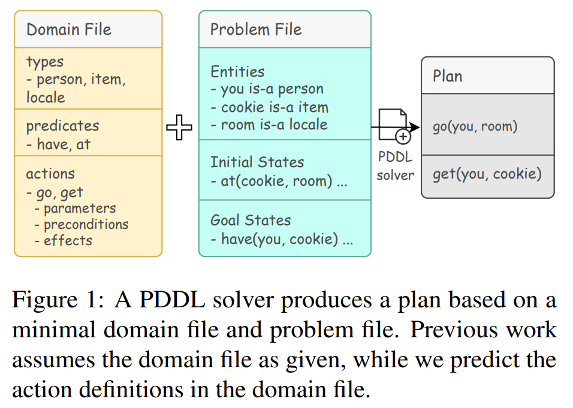
    - 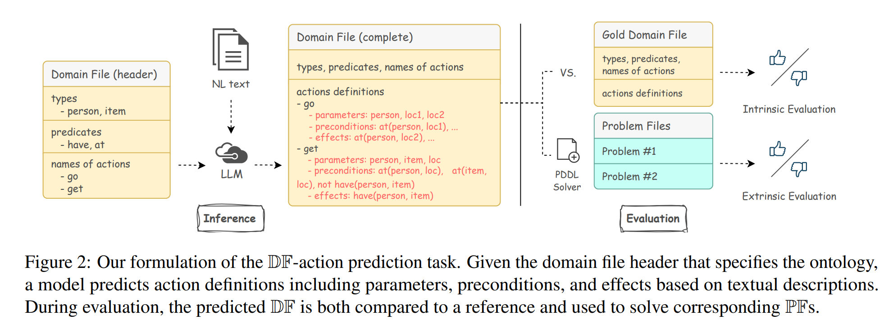

**Ayoai Impact**: PROC2PDDL reveals current limitations:
- Open-domain planning is still challenging
- Low success rates indicate need for hybrid approaches
- Dataset available for training/testing
- Ayoai's controlled domain may perform better

## CALM

- CALM [Yao et al., 2020a] (1 of 2 mentions) [https://arxiv.org/abs/2010.02903](https://arxiv.org/abs/2010.02903) (found from: Planning-of-LLM-Agents)

  - Abstract
    - Text-based games present a unique challenge for autonomous agents to operate in natural language and handle enormous action spaces. In this paper, we propose the Contextual Action Language Model (CALM) to generate a compact set of action candidates at each game state. Our key insight is to train language models on human gameplay, where people demonstrate linguistic priors and a general game sense for promising actions conditioned on game history. We combine CALM with a reinforcement learning agent which re-ranks the generated action candidates to maximize in-game rewards. We evaluate our approach using the Jericho benchmark, on games unseen by CALM during training. Our method obtains a 69% relative improvement in average game score over the previous state-of-the-art model. Surprisingly, on half of these games, CALM is competitive with or better than other models that have access to ground truth admissible actions. Code and data are available at [this https URL](https://github.com/princeton-nlp/calm-textgame).

  - Descriptions from this planning survey:
    - Proposed an early approach that combines a language model with an RL-based neural planner. One language model processes textual environmental information, generating a set of candidate actions as priors based on the environmental information. A DRRN policy network is then employed to re-rank these candidate actions, ultimately selecting the optimal action.
    - Neural Planner - Neural planners are deep models trained on collected planning data with reinforcement learning or imitation learning techniques, showing effective planning abilities within the specific domain. For instance, DRRN [He et al., 2015] models the planning process as a Markov Decision Process through reinforcement learning, training a policy network to obtain a deep decision model. Decision Transformer (DT) [Chen et al., 2021a] empowers a transformer model to clone human decision-making behavior with planning data. However, when faced with complex and less frequently encountered problems, where training data is scarce, these small models tend to perform poorly due to insufficient generalization ability. Therefore, several works explore combining an LLM with a light-weight neural planner, to further enhance the planning capabilities.
    - Utilizes ground-truth action trajectories collected from the text-world environment to finetune GPT-2 using next token prediction task, enabling it to memorize planning-related information and generalize well on planning tasks
    - Also was labeled as this section which is below: Embodied memory involves finetuning the LLM with the agent's historical experiential samples, embedding memories into the model parameters. Usually the experiential samples are collected from the agents's interactions with environment, which may consist of commonsense knowledge about the environment, task-related priors, and successful or failed experiences. While the cost of training a language model with more than billions of parameters is huge, parameter-efficient fine-tuning (PEFT) techniques are leveraged to reduce cost and speed up by training a small part of parameters only, such as LoRA, QLoRA, P-tuning, et al.

  - Zak thoughts
    - Has code!!! [https://github.com/princeton-nlp/calm-textgame](https://github.com/princeton-nlp/calm-textgame)
    - Meh - from 2020, old language, not for me I don't think.

**Ayoai Impact**: CALM shows early neural planning approach:
- Combines LM with RL for action selection
- 69% improvement over baselines
- Shows value of human gameplay data
- Could use player data to improve NPCs

## SwiftSage

- SwiftSage [Lin et al., 2023] [https://arxiv.org/abs/2305.17390](https://arxiv.org/abs/2305.17390) (found from: Planning-of-LLM-Agents)

  - Abstract
    - We introduce SwiftSage, a novel agent framework inspired by the dual-process theory of human cognition, designed to excel in action planning for complex interactive reasoning tasks. SwiftSage integrates the strengths of behavior cloning and prompting large language models (LLMs) to enhance task completion performance. The framework comprises two primary modules: the Swift module, representing fast and intuitive thinking, and the Sage module, emulating deliberate thought processes. The Swift module is a small encoder-decoder LM fine-tuned on the oracle agent's action trajectories, while the Sage module employs LLMs such as GPT-4 for subgoal planning and grounding. We develop a heuristic method to harmoniously integrate the two modules, resulting in a more efficient and robust problem-solving process. In 30 tasks from the ScienceWorld benchmark, SwiftSage significantly outperforms other methods such as SayCan, ReAct, and Reflexion, demonstrating its effectiveness in solving complex interactive tasks.

  - Descriptions from this planning survey:
    - Leverages the dual-process theory from cognitive psychology, dividing the planning process into slow thinking and fast thinking. The slow-thinking process involves complex reasoning and rational deliberation while fast-thinking resembles an instinctive response developed through long-term training. The authors utilize a DT model, trained through imitation learning, as the fast-thinking model for rapid plan generation. When errors occur during plan execution, indicating a more complex problem, the agent switches to the slow-thinking process, where LLM engages in reasoning and planning based on the current state. This combination of fast and slow thinking has proven to be highly effective in terms of efficiency.
    - Neural Planner - Neural planners are deep models trained on collected planning data with reinforcement learning or imitation learning techniques, showing effective planning abilities within the specific domain. For instance, DRRN [He et al., 2015] models the planning process as a Markov Decision Process through reinforcement learning, training a policy network to obtain a deep decision model. Decision Transformer (DT) [Chen et al., 2021a] empowers a transformer model to clone human decision-making behavior with planning data. However, when faced with complex and less frequently encountered problems, where training data is scarce, these small models tend to perform poorly due to insufficient generalization ability. Therefore, several works explore combining an LLM with a light-weight neural planner, to further enhance the planning capabilities.

  - Zak thoughts
    - Overview
      - Inspired by the dual process theory [39, 16], we propose a novel framework that enables agents to closely emulate how humans solve complex, open-world tasks. The dual-process theory posits that human cognition is composed of two distinct systems: System 1, characterized by rapid, intuitive, and automatic thinking; and System 2, which entails methodical, analytical, and deliberate thought processes. System 1 is reminiscent of seq2seq methods, which learn through imitation of oracle agents and primarily operate utilizing shallow action patterns. Conversely, System 2 bears resemblance to LLMs that excel in applying commonsense knowledge, engaging in step-by-step reasoning, devising subgoal strategies, and exercising self-reflection. Thus, our proposed method, SWIFTSAGE, is designed to enable both fast and slow thinking in complex interactive reasoning tasks. It effectively integrates the strengths of behavior cloning (representing System 1) and prompting LLMs (emulating System 2), resulting in significant enhancements in task completion performance and efficiency.
      - Specifically, SWIFTSAGE consists of two primary modules: the SWIFT module and the SAGE module. The SWIFT module is a small encoder-decoder LM, fine-tuned on a T5-large (770m) checkpoint using the searched oracle trajectories of training tasks. It encodes short-term memory components, such as previous actions, observations, visited locations, as well as the current environment state. Then, it decodes the next individual action. This module simulates the fast, intuitive thinking characteristic of System 1. The SAGE module, representing the deliberate thinking of System 2, utilizes LLMs, such as GPT-4, and is structured around two prompting stages: planning and grounding. In the planning stage, we prompt LLMs to locate necessary items, plan and track subgoals, as well as detect and fix potential exceptions and mistakes. In the grounding stage, we focus on utilizing LLMs to transform the output subgoals derived from the planning stage into a sequence of actions by demonstrating potential action templates. Unlike prior methods, where LLMs only generate the next immediate action, our procedures engage in longer-term action planning. To harmoniously integrate the SWIFT and SAGE modules, we developed a heuristic algorithm that determines when to (de)activate the SAGE module and how to combine the outputs effectively with an action buffer mechanism.
      - 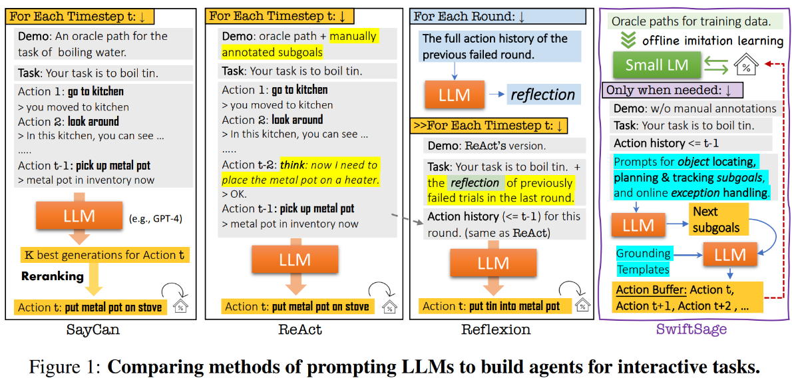
      - 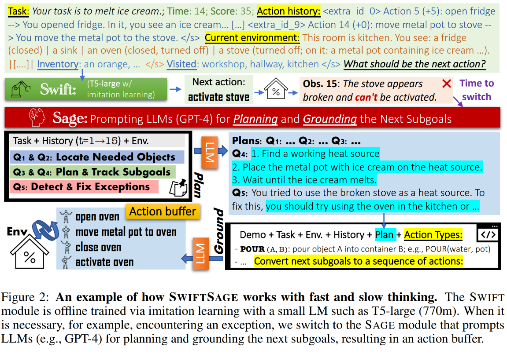
    - Awesome task decomposition. . . Grounding stage. While the answers to Q1-Q5 provide valuable guidance for agents, they are not directly executable. Converting plans into valid actions that can be accepted by the environment remains a challenge. We then incorporate the LLM's outputs from the planning stage as part of the input for the grounding stage. Furthermore, we provide the recent action history of the past 10 time steps as context. Finally, we prompt LLMs to concentrate on the next subgoal and convert it into a list of actions (rather than a single action) to accomplish the next subgoal. Our formatting instructions enable the straightforward splitting and conversion of output actions from LLMs in the grounding stage back to their original action representations. We denote this list of actions generated by LLMs as the action buffer: B = {Aˆ t, Aˆ t+1, . . . }. One can opt to use only answers to Q4 and Q5 to reduce computational costs. Our small-scale ablation study indicates that incorporating answers to Q1-Q3 in the grounding stage proves beneficial, yielding a gain of about 2 points for short tasks on average
      - 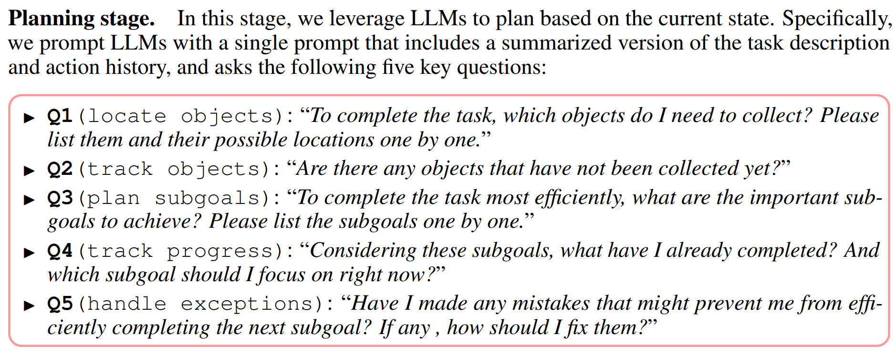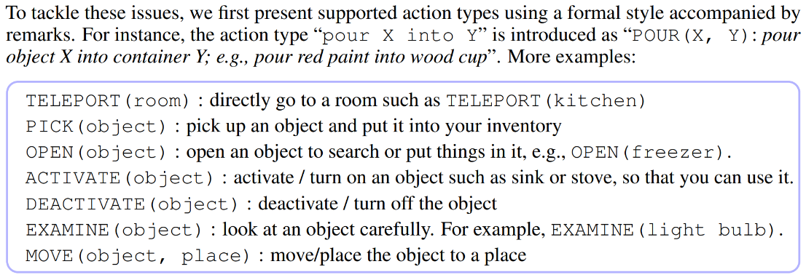
    - Interesting note on memory I like:
      - Memory augmentation. Since the agent can only perceive objects in its current environment location, objects from previously visited locations are not displayed unless a prior 'look around' action has been executed. To augment memory for LLMs during planning and grounding, we also present the objects observed in previously visited locations. Additionally, we include the agent's location during each action in the action history, e.g., "pick up metal pot [location: kitchen]," to facilitate spatial reasoning for LLMs.
    - Interesting note on error handling:
      - It should be noted that despite explicitly instructing the LLM to only utilize permitted action types, it may occasionally generate actions of disallowed types that cannot be parsed. These invalid actions will be disregarded in the action buffer, and if necessary, the system will revert to the SWIFT mode.
    - Has code!!! [https://swiftsage.github.io/](https://swiftsage.github.io/)
    - OMG, there is an awesome prompt in there:

**Ayoai Impact**: SwiftSage's dual-process theory is revolutionary for Ayoai:
- System 1 (Swift): Reactive behaviors, combat reflexes
- System 2 (Sage): Strategic planning, puzzle solving
- Action buffer for multi-step execution
- Memory augmentation for spatial reasoning
- Perfect model for Ayoai's behavior tree architecture
- Grounding stage converts plans to executable actions

## Self Rewarding

- What is this new paper, is a self rewarding llm thing? I need to look into that. [https://arxiv.org/abs/2401.10020](https://arxiv.org/abs/2401.10020)

  - Abstract
    - We posit that to achieve superhuman agents, future models require superhuman feedback in order to provide an adequate training signal. Current approaches commonly train reward models from human preferences, which may then be bottlenecked by human performance level, and secondly these separate frozen reward models cannot then learn to improve during LLM training. In this work, we study Self-Rewarding Language Models, where the language model itself is used via LLM-as-a-Judge prompting to provide its own rewards during training. We show that during Iterative DPO training that not only does instruction following ability improve, but also the ability to provide high-quality rewards to itself. Fine-tuning Llama 2 70B on three iterations of our approach yields a model that outperforms many existing systems on the AlpacaEval 2.0 leaderboard, including Claude 2, Gemini Pro, and GPT-4 0613. While there is much left still to explore, this work opens the door to the possibility of models that can continually improve in both axes.

  - Zak thoughts
    - No code
    - Overview
      - 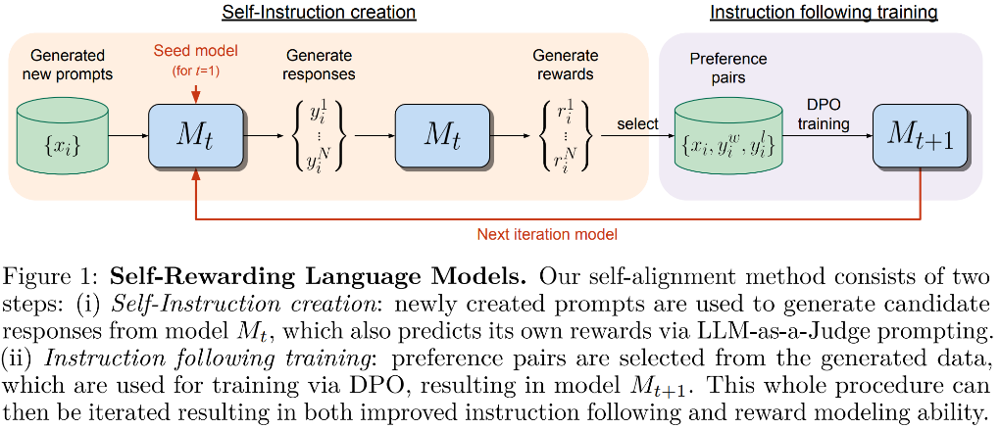
    - Damn, looks expensive but super cool. . . This is the reward system, wow super easy

**Ayoai Impact**: Self-rewarding opens continuous improvement:
- Agents can evaluate their own performance
- No human bottleneck for feedback
- Continuous improvement without retraining
- Could enable agents to learn from player interactions
- Self-improving NPCs become more engaging over time

## Summary for Ayoai Implementation

The research on planner-aided approaches suggests a hybrid architecture:

1. **Planning Languages**
   - PDDL for formal problem specification
   - Domain files define available actions
   - Problem files specify states and goals
   - LLMs translate natural language to PDDL

2. **Planning Algorithms**
   - Classical planners (Fast-Downward, LPG)
   - GOAP for real-time replanning
   - HTN for hierarchical decomposition
   - A* for pathfinding

3. **Integration Strategy**
   - LLMs generate PDDL from game context
   - External planners ensure correctness
   - Plans translated to behavior trees
   - Dynamic replanning for changing environments

4. **Key Benefits**
   - Guaranteed correct plans
   - Handles complex constraints
   - Scales to many actions
   - Combines with LLM common sense

This enables Ayoai to:
- Generate provably correct agent behaviors
- Handle complex multi-step goals
- Adapt to dynamic game environments
- Scale to sophisticated planning problems
- Maintain both correctness and naturalness