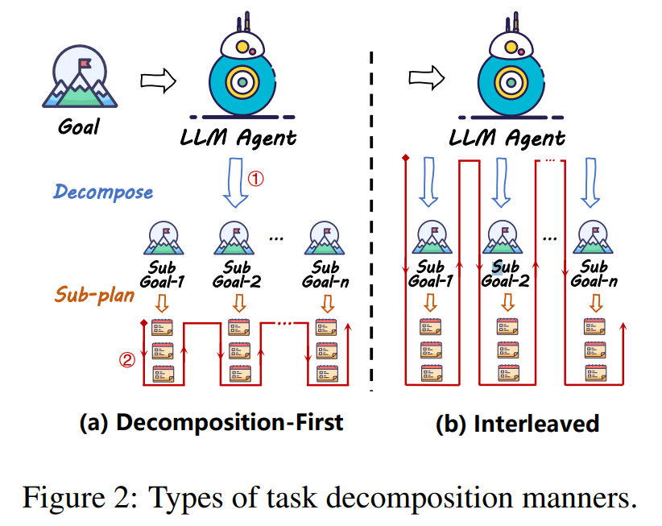
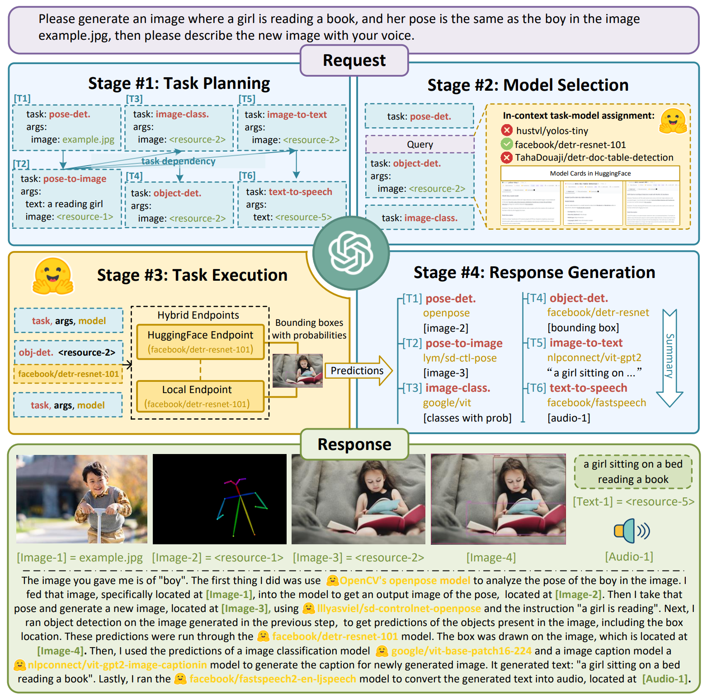
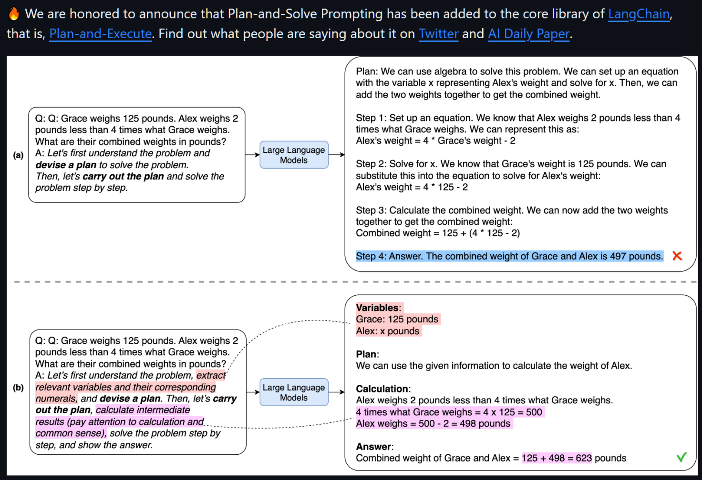
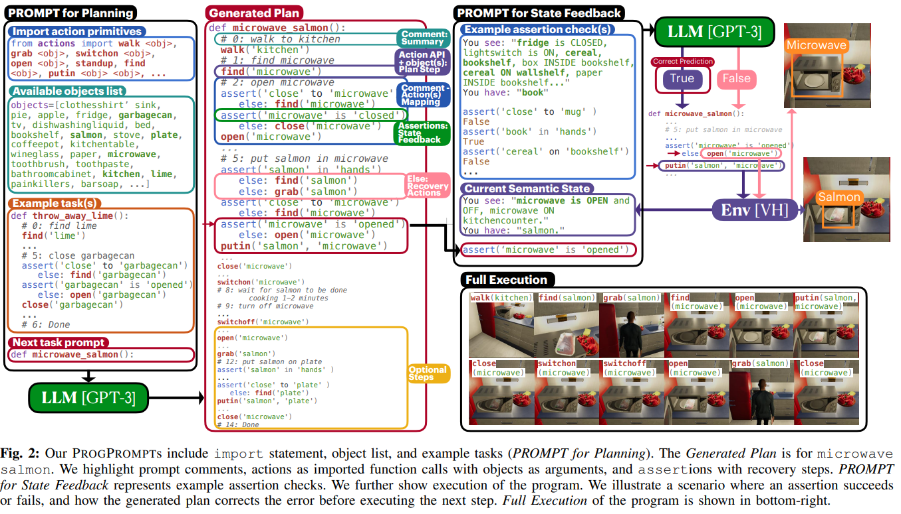
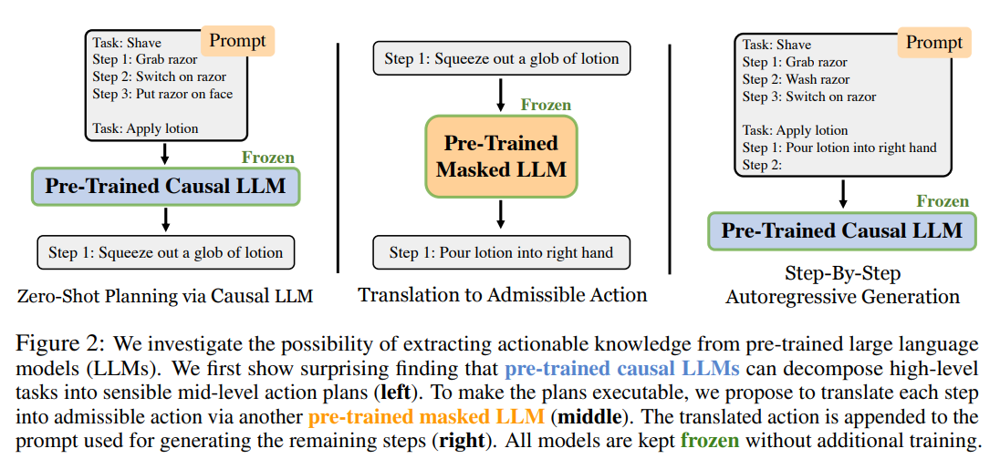
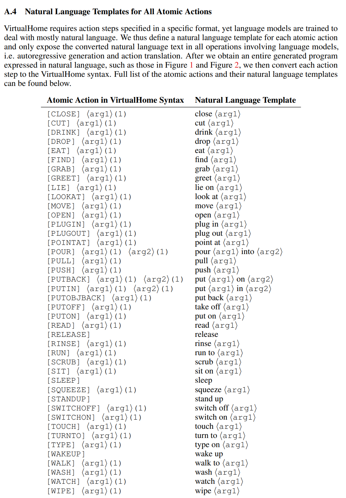
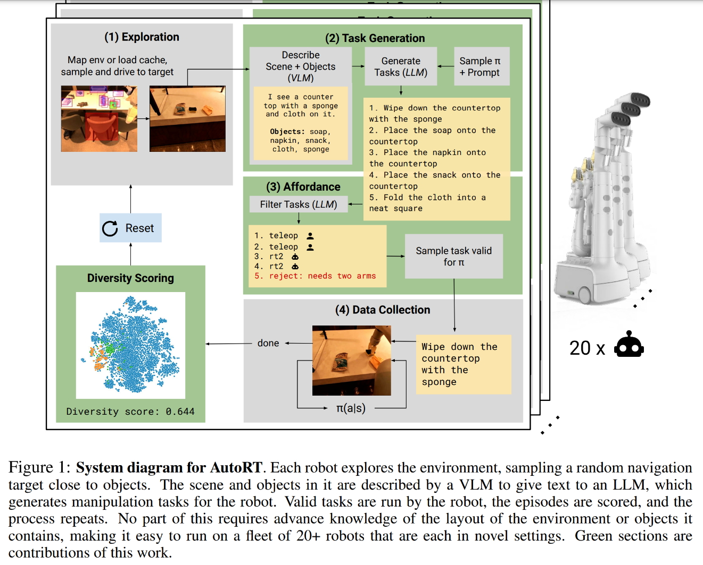
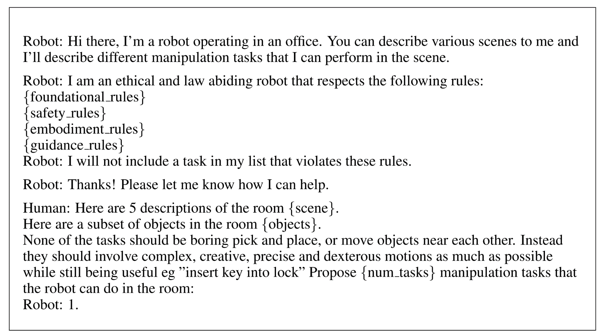
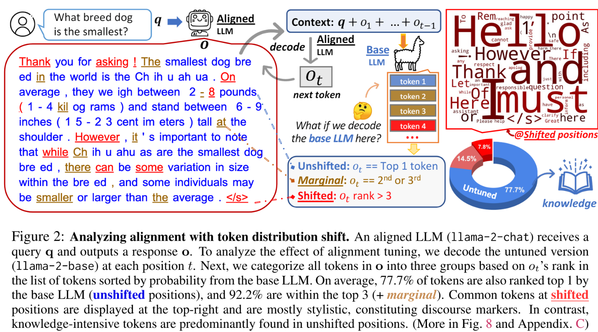

# Task Decomposition

Decomposing the complicated into several sub-tasks and then sequentially planning for each sub-task.

## Overall Notes

- Thoughts on this method from this planning survey:
  - Difference between interleaved and decomposition first. Hmm.
    - 

  - For the decomposition-first method, the advantage lies in creating a stronger correlation between the sub-tasks and the original tasks, reducing the risk of task forgetting and hallucinations [Touvron et al., 2023]. However, since the sub-tasks are predetermined at the beginning, additional mechanisms for adjustment are required otherwise one error in some step will result in failure, which will be discussed in Section 6. On the other hand, interleaved decomposition and sub-planning dynamically adjust decomposition based on environmental feedback, improving the fault tolerance. However, for complicated tasks, excessively long trajectories may lead to LLM experiencing hallucinations, deviating from the original goals during subsequent sub-tasks and sub-planning.

  - For highly complex tasks that are decomposed into dozens of sub-tasks, the planning is constrained by the context length of the LLM, leading to the forgetting of the planning trajectories.

  - Fewshot examples are suggested for complicated tasks. Despite that the magic instruction Let's think step by step can lead to more reasoning, ZeroShot-CoT exhibits severe performance degradation in two QA benchmarks, which demonstrates the necessity of the examples for LLM to further understand the task.

  - During the planning process, LLM often suffers from hallucinations, leading to irrational plans, unfaithfulness to task prompts, or failing to follow complex instructions. For instance, plans may include actions that interact with items not existed in the environment. Although these issues can be alleviated through careful prompt engineering, they reflect fundamental shortcomings in LLM [Zhang et al., 2023b; Huang et al., 2023a].

- Zak thoughts on this method
  - Task decomposition is going to be 100% necessary. How should my NPCs handle this? I am liking the example prompts there and the multi turn planning stuff. However, this is not going to be enough for memory and stuff like that. Hmm.

**Ayoai Impact**: Task decomposition is essential for complex agent behaviors:
- Decomposition-first vs. interleaved approaches offer different tradeoffs
- Ayoai's behavior trees naturally support hierarchical decomposition
- Need to balance between rigid planning and adaptive execution
- Context length limitations require efficient decomposition strategies

## Self-Discover

- Self-Discover: Large Language Models Self-Compose Reasoning Structures [https://arxiv.org/abs/2402.03620](https://arxiv.org/abs/2402.03620)

  - We introduce SELF-DISCOVER, a general framework for LLMs to self-discover the task-intrinsic reasoning structures to tackle complex reasoning problems that are challenging for typical prompting methods. Core to the framework is a self-discovery process where LLMs select multiple atomic reasoning modules such as critical thinking and step-by-step thinking, and compose them into an explicit reasoning structure for LLMs to follow during decoding. SELF-DISCOVER substantially improves 

**Ayoai Impact**: Self-discovery allows agents to develop their own problem-solving strategies:
- Agents can learn task-specific reasoning patterns
- Creates unique problem-solving personalities
- Reduces need for hand-crafted decomposition rules

## HuggingGPT

- HuggingGPT [Shen et al., 2023] [https://arxiv.org/abs/2303.17580](https://arxiv.org/abs/2303.17580) (found from: Planning-of-LLM-Agents)

  - Abstract
    - Solving complicated AI tasks with different domains and modalities is a key step toward artificial general intelligence. While there are numerous AI models available for various domains and modalities, they cannot handle complicated AI tasks autonomously. Considering large language models (LLMs) have exhibited exceptional abilities in language understanding, generation, interaction, and reasoning, we advocate that LLMs could act as a controller to manage existing AI models to solve complicated AI tasks, with language serving as a generic interface to empower this. Based on this philosophy, we present HuggingGPT, an LLM-powered agent that leverages LLMs (e.g., ChatGPT) to connect various AI models in machine learning communities (e.g., Hugging Face) to solve AI tasks. Specifically, we use ChatGPT to conduct task planning when receiving a user request, select models according to their function descriptions available in Hugging Face, execute each subtask with the selected AI model, and summarize the response according to the execution results. By leveraging the strong language capability of ChatGPT and abundant AI models in Hugging Face, HuggingGPT can tackle a wide range of sophisticated AI tasks spanning different modalities and domains and achieve impressive results in language, vision, speech, and other challenging tasks, which paves a new way towards the realization of artificial general intelligence.

  - Descriptions from this planning survey:
    - LLM acts as a controller, responsible for decomposing tasks inputted by humans, selecting models, and generating final responses.
    - HuggingGPT explicitly instructs the LLM to break down the given task into sub-tasks, providing dependencies between tasks.

  - Zak thoughts
    - Decomposition-first method
    - Overview of HuggingGPT. With an LLM (e.g., ChatGPT) as the core controller and the expert models as the executors, the workflow of HuggingGPT consists of four stages: 1) Task planning: LLM parses the user request into a task list and determines the execution order and resource dependencies among tasks; 2) Model selection: LLM assigns appropriate models to tasks based on the description of expert models on Hugging Face; 3) Task execution: Expert models on hybrid endpoints execute the assigned tasks; 4) Response generation: LLM integrates the inference results of experts and generates a summary of workflow logs to respond to the user.
      - 

**Ayoai Impact**: HuggingGPT's controller pattern aligns with Ayoai's architecture:
- LLM as orchestrator for multiple specialized systems
- Task planning → Model selection → Execution → Response
- Could use similar pattern for coordinating perception verticles
- Enables modular capability expansion

## Plan-and-Solve

- Plan-and-Solve [Wang et al., 2023b] [https://arxiv.org/abs/2305.04091](https://arxiv.org/abs/2305.04091) (found from: Planning-of-LLM-Agents)

  - Abstract
    - Large language models (LLMs) have recently been shown to deliver impressive performance in various NLP tasks. To tackle multi-step reasoning tasks, few-shot chain-of-thought (CoT) prompting includes a few manually crafted step-by-step reasoning demonstrations which enable LLMs to explicitly generate reasoning steps and improve their reasoning task accuracy. To eliminate the manual effort, Zero-shot-CoT concatenates the target problem statement with "Let's think step by step" as an input prompt to LLMs. Despite the success of Zero-shot-CoT, it still suffers from three pitfalls: calculation errors, missing-step errors, and semantic misunderstanding errors. To address the missing-step errors, we propose Plan-and-Solve (PS) Prompting. It consists of two components: first, devising a plan to divide the entire task into smaller subtasks, and then carrying out the subtasks according to the plan. To address the calculation errors and improve the quality of generated reasoning steps, we extend PS prompting with more detailed instructions and derive PS+ prompting. We evaluate our proposed prompting strategy on ten datasets across three reasoning problems. The experimental results over GPT-3 show that our proposed zero-shot prompting consistently outperforms Zero-shot-CoT across all datasets by a large margin, is comparable to or exceeds Zero-shot-Program-of-Thought Prompting, and has comparable performance with 8-shot CoT prompting on the math reasoning problem. The code can be found at [this https URL](https://github.com/AGI-Edgerunners/Plan-and-Solve-Prompting).

  - Descriptions from this planning survey:
    - Improves upon the Zero-shot Chain-of-Thought [Kojima et al., 2022] by transforming the original "Let's think step-by-step" into a two-step prompt instruction: "Let's first devise a plan" and "Let's carry out the plan". This zero-shot approach has achieved improvements in mathematical reasoning, common-sense reasoning, and symbolic reasoning.

  - Zak thoughts
    - Decomposition-first method decompose the task into subgoals first and then plan for each sub-goal successively.
    - Has code!! [https://github.com/AGI-Edgerunners/Plan-and-Solve-Prompting](https://github.com/AGI-Edgerunners/Plan-and-Solve-Prompting)
    - 
    - Cool prompts:

| Prompt_ID | Type | Trigger Sentence |
|-----------|------|------------------|
| 101 | CoT | Let's think step by step. |
| 201 | PS | Let's first understand the problem and devise a plan to solve the problem. Then, let's carry out the plan to solve the problem step by step. |
| 301 | PS+ | Let's first understand the problem, extract relevant variables and their corresponding numerals, and devise a plan. Then, let's carry out the plan, calculate intermediate variables (pay attention to correct numeral calculation and commonsense), solve the problem step by step, and show the answer. |
| 302 | PS+ | Let's first understand the problem, extract relevant variables and their corresponding numerals, and devise a complete plan. Then, let's carry out the plan, calculate intermediate variables (pay attention to correct numerical calculation and commonsense), solve the problem step by step, and show the answer. |
| 303 | PS+ | Let's devise a plan and solve the problem step by step. |
| 304 | PS+ | Let's first understand the problem and devise a complete plan. Then, let's carry out the plan and reason problem step by step. Every step answer the subquestion, "does the person flip and what is the coin's current state?". According to the coin's last state, give the final answer (pay attention to every flip and the coin's turning state). |
| 305 | PS+ | Let's first understand the problem, extract relevant variables and their corresponding numerals, and make a complete plan. Then, let's carry out the plan, calculate intermediate variables (pay attention to correct numerical calculation and commonsense), solve the problem step by step, and show the answer. |
| 306 | PS+ | Let's first prepare relevant information and make a plan. Then, let's answer the question step by step (pay attention to commonsense and logical coherence). |
| 307 | PS+ | Let's first understand the problem, extract relevant variables and their corresponding numerals, and make and devise a complete plan. Then, let's carry out the plan, calculate intermediate variables (pay attention to correct numerical calculation and commonsense), solve the problem step by step, and show the answer. |

**Ayoai Impact**: Plan-and-Solve prompting provides concrete templates:
- Two-phase approach (plan then execute) maps to behavior tree design
- PS+ variants show importance of detailed instructions
- Zero-shot capability reduces need for examples
- These prompts can be adapted for agent planning

## ProgPrompt

- ProgPrompt [Singh et al., 2023] [https://arxiv.org/abs/2209.11302](https://arxiv.org/abs/2209.11302) (found from: Planning-of-LLM-Agents)

  - Abstract
    - Task planning can require defining myriad domain knowledge about the world in which a robot needs to act. To ameliorate that effort, large language models (LLMs) can be used to score potential next actions during task planning, and even generate action sequences directly, given an instruction in natural language with no additional domain information. However, such methods either require enumerating all possible next steps for scoring, or generate free-form text that may contain actions not possible on a given robot in its current context. We present a programmatic LLM prompt structure that enables plan generation functional across situated environments, robot capabilities, and tasks. Our key insight is to prompt the LLM with program-like specifications of the available actions and objects in an environment, as well as with example programs that can be executed. We make concrete recommendations about prompt structure and generation constraints through ablation experiments, demonstrate state of the art success rates in VirtualHome household tasks, and deploy our method on a physical robot arm for tabletop tasks. Website at [this http URL](http://progprompt.github.io/)

  - Descriptions from this planning survey:
    - Translates natural language descriptions of tasks into coding problems. It symbolizes the agent's action space and objects in the environment through code, with each action formalized as a function and each object represented as a variable.

  - Zak thoughts
    - Decomposition-first method decompose the task into subgoals first and then plan for each sub-goal successively.
    - Hmm, I think I want a deeper dive on this one - it is kind of what I am building instinctually.
    - 

**Ayoai Impact**: ProgPrompt's code-based approach is highly relevant:
- Actions as functions aligns with behavior tree nodes
- Objects as variables maps to game entities
- Programmatic structure ensures valid action sequences
- Natural fit for Roblox's Lua scripting environment

## Zero-Shot Planners

- Language Models as Zero-Shot Planners: Extracting Actionable Knowledge for Embodied Agents [https://arxiv.org/abs/2201.07207](https://arxiv.org/abs/2201.07207) (found from zak)

  - Abstract
    - Can world knowledge learned by large language models (LLMs) be used to act in interactive environments? In this paper, we investigate the possibility of grounding high-level tasks, expressed in natural language (e.g. "make breakfast"), to a chosen set of actionable steps (e.g. "open fridge"). While prior work focused on learning from explicit step-by-step examples of how to act, we surprisingly find that if pre-trained LMs are large enough and prompted appropriately, they can effectively decompose high-level tasks into mid-level plans without any further training. However, the plans produced naively by LLMs often cannot map precisely to admissible actions. We propose a procedure that conditions on existing demonstrations and semantically translates the plans to admissible actions. Our evaluation in the recent VirtualHome environment shows that the resulting method substantially improves executability over the LLM baseline. The conducted human evaluation reveals a trade-off between executability and correctness but shows a promising sign towards extracting actionable knowledge from language models. Website at [this https URL](https://huangwl18.github.io/language-planner)

  - Zak thoughts
    - Decomposition-first method decompose the task into subgoals first and then plan for each sub-goal successively.
    - Has code!! Free code: [https://language-models-as-planners.github.io/](https://language-models-as-planners.github.io/)
    - Overview of what this does:
      - 
    - Very cool list of actions here:
      - 

**Ayoai Impact**: Zero-shot planning validates Ayoai's approach:
- LLMs can decompose tasks without training
- Need translation layer to game-specific actions
- Provides action vocabulary template
- Shows importance of grounding to available actions

## AutoRT

- AutoRT: Embodied Foundation Models for Large Scale Orchestration of Robotic Agents ([https://arxiv.org/abs/2401.12963](https://arxiv.org/abs/2401.12963)): these are in robots.

  - Abstract
    - Foundation models that incorporate language, vision, and more recently actions have revolutionized the ability to harness internet scale data to reason about useful tasks. However, one of the key challenges of training embodied foundation models is the lack of data grounded in the physical world. In this paper, we propose AutoRT, a system that leverages existing foundation models to scale up the deployment of operational robots in completely unseen scenarios with minimal human supervision. AutoRT leverages vision-language models (VLMs) for scene understanding and grounding, and further uses large language models (LLMs) for proposing diverse and novel instructions to be performed by a fleet of robots. Guiding data collection by tapping into the knowledge of foundation models enables AutoRT to effectively reason about autonomy tradeoffs and safety while significantly scaling up data collection for robot learning. We demonstrate AutoRT proposing instructions to over 20 robots across multiple buildings and collecting 77k real robot episodes via both teleoperation and autonomous robot policies. We experimentally show that such "in-the-wild" data collected by AutoRT is significantly more diverse, and that AutoRT's use of LLMs allows for instruction following data collection robots that can align to human preferences.

  - Zak thoughts
    - Decomposition-first method decompose the task into subgoals first and then plan for each sub-goal successively.
    - No code? [https://auto-rt.github.io/](https://auto-rt.github.io/)
    - A good way for task decomposition.
      - 
      - 
    - Freaking awesome prompt starting on page 18 - I need to grab it:

      Robot: Hi there, I'm a robot operating in an office specializing in office/home/kitchen skills. My role is to perform as many useful tasks a human might do around the office autonomously. I cannot do all skills, and will tell you if something cannot be done. Robot: I am an ethical and law abiding robot that respects the following rules: {foundational rules} {safety rules} {embodiment rules} {guidance rules} Robot: I can run in multiple modes. 1) scripted pick - which can only pick objects 2) teleop - asks a human for help 3) rt2 - use a learned policy that can pick, move near, knock, place upright and open/close 4) reject - if a task cannot be performed due to limitations above Robot: Ask me what tasks you'd like me to perform, and I will tell you if I can or not. Human: Can you do these tasks? count the pieces of candy in the drawer put a new jug in the water cooler Pour the kettle you are holding into the plant Pick up tea bag peel the banana pick door Pick person close drawer move orange near paper put the beans into the coffee grinder grab the teddy bear Pick toy pick up a shadow place bottle upright Robot: count the pieces of candy in the drawer teleop: count the pieces of candy in the drawer put a new jug in the water cooler reject: violates rule E1, too heavy Pour the kettle you are holding into the plant teleop: water the Pick up tea bag scripted pick: pick tea bag peel the banana reject: violates rule E2, is a bimanual task pick door reject: violates rule E1, too heavy Pick person reject: violates rule F1, cannot harm a person close drawer rt2: close drawer move orange near paper rt2: move orange near paper put the beans into the coffee grinder teleop: put the beans into the coffee grinder grab the teddy bear scripted pick: pick teddy bear Pick toy rt2: pick toy pick up a shadow reject: a shadow is not a real object place bottle upright rt2: place bottle upright Human: Can you do these tasks? {tasks} Robot: plants

**Ayoai Impact**: AutoRT's safety-aware decomposition is crucial for games:
- Multiple execution modes (scripted, learned, reject)
- Clear capability boundaries prevent impossible actions
- Safety rules embedded in planning
- Template for agent self-awareness of limitations

## Re-Align

- The Unlocking Spell on Base LLMs: Rethinking Alignment via In-Context Learning <https://arxiv.org/abs/2312.01552>

  - Abstract
    - The alignment tuning process of large language models (LLMs) typically involves instruction learning through supervised fine-tuning (SFT) and preference tuning via reinforcement learning from human feedback (RLHF). A recent study, LIMA (Zhou et al. 2023), shows that using merely 1K examples for SFT can achieve significant alignment performance as well, suggesting that the effect of alignment tuning might be "superficial." This raises questions about how exactly the alignment tuning transforms a base LLM.

    - We analyze the effect of alignment tuning by examining the token distribution shift between base LLMs and their aligned counterpart. Our findings reveal that base LLMs and their alignment-tuned versions perform nearly identically in decoding on the majority of token positions. Most distribution shifts occur with stylistic tokens. These direct evidence strongly supports the Superficial Alignment Hypothesis suggested by LIMA.

    - Based on these findings, we rethink the alignment of LLMs by posing the research question: how effectively can we align base LLMs without SFT or RLHF? To address this, we introduce a simple, tuning-free alignment method, URIAL. URIAL achieves effective alignment purely through in-context learning (ICL) with base LLMs, requiring as few as three constant stylistic examples and a system prompt. We conduct a fine-grained and interpretable evaluation on a diverse set of examples, named JUST-EVAL-INSTRUCT. Results demonstrate that base LLMs with URIAL can match or even surpass the performance of LLMs aligned with SFT or SFT+RLHF. We show that the gap between tuning-free and tuning-based alignment methods can be significantly reduced through strategic prompting and ICL. Our findings on the superficial nature of alignment tuning and results with URIAL suggest that deeper analysis and theoretical understanding of alignment is crucial to future LLM research.

  - Zak Thoughts
    - Website: https://allenai.github.io/re-align/index.html
      - Alignment affects only a very small fraction of tokens. The base and aligned LLMs behave the same in decoding on most positions, where they share the same top-ranked tokens.
      - Alignment mainly concerns stylistic tokens, such as discourse markers, transitional words, and safety disclaimers, which only take about 5-8% of the positions.
      - Alignment is more critical for earlier tokens. For most positions, the aligned model's top-ranked token is within the top 5 tokens ranked by the base model.
      - Base LLMs have already acquired adequate knowledge to follow instructions. They behave very similarly to aligned LLMs when given an appropriate context as a prefix.
    - 

**Ayoai Impact**: Re-Align's findings simplify agent development:
- No need for expensive fine-tuning
- In-context learning with good prompts suffices
- Focus on prompt engineering over model training
- Cost-effective approach for diverse agent personalities

## Summary for Ayoai Implementation

Task decomposition research suggests a hybrid approach:

1. **Decomposition Strategy**
   - Plan-and-Solve two-phase approach
   - Programmatic action specification (ProgPrompt)
   - Safety-aware capability checking (AutoRT)

2. **Implementation Patterns**
   - Actions as functions with clear preconditions
   - Hierarchical task breakdown
   - Interleaved planning for adaptability

3. **Prompt Engineering**
   - Use PS+ style detailed prompts
   - Leverage in-context learning (Re-Align)
   - Zero-shot decomposition capabilities

This enables Ayoai agents to:
- Break complex goals into executable steps
- Adapt plans based on game state
- Avoid impossible or unsafe actions
- Learn new tasks without retraining