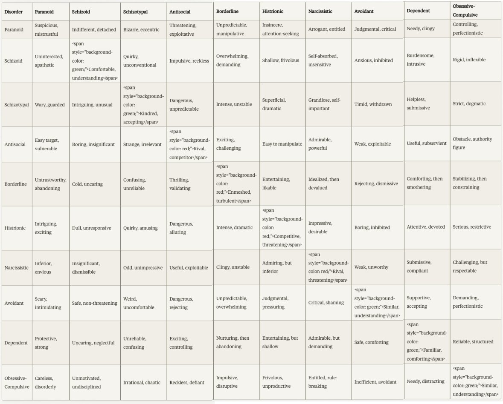
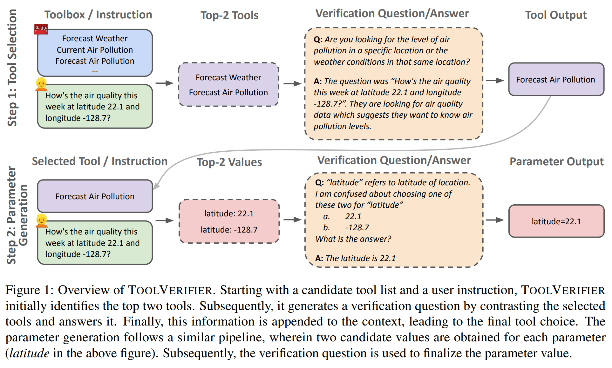

# Document Introduction

## Document Outline Orientation

### Index

# Contents {#contents .TOC-Heading}

[Document Introduction
[1](#document-introduction)](#document-introduction)

[Document Outline Orientation
[1](#document-outline-orientation)](#document-outline-orientation)

[Index [1](#index)](#index)

[World Understanding & Perception
[7](#world-understanding-perception)](#world-understanding-perception)

[Player Tracking [7](#player-tracking)](#player-tracking)

[Ownership [8](#ownership)](#ownership)

[Overall Notes [8](#overall-notes)](#overall-notes)

[World Perception [9](#world-perception)](#world-perception)

[Overall Notes [9](#overall-notes-1)](#overall-notes-1)

[World2World [9](#world2world)](#world2world)

[Planning with World Knowledge Model
[10](#planning-with-world-knowledge-model)](#planning-with-world-knowledge-model)

[Worldy Trackers [12](#worldy-trackers)](#worldy-trackers)

[Spatial Perception [12](#spatial-perception)](#spatial-perception)

[Overall Notes [12](#overall-notes-2)](#overall-notes-2)

[Emoji and Animations
[13](#emoji-and-animations)](#emoji-and-animations)

[Overall Notes [13](#overall-notes-3)](#overall-notes-3)

[Cognitive Mechanisms:
[13](#cognitive-mechanisms)](#cognitive-mechanisms)

[Core Loops of Every Soul
[13](#core-loops-of-every-soul)](#core-loops-of-every-soul)

[Overall Notes [13](#overall-notes-4)](#overall-notes-4)

[Immediate health [13](#immediate-health)](#immediate-health)

[General Awareness [14](#general-awareness)](#general-awareness)

[Self Perception [14](#self-perception)](#self-perception)

[Time Impacts [14](#time-impacts)](#time-impacts)

[How Subconscious Threads?
[14](#how-subconscious-threads)](#how-subconscious-threads)

[Cognition is All You Need
[16](#cognition-is-all-you-need)](#cognition-is-all-you-need)

[CoALA - Cognitive Architectures
[17](#coala---cognitive-architectures)](#coala---cognitive-architectures)

[The Four Vectors of Human Consciousness
[20](#the-four-vectors-of-human-consciousness)](#the-four-vectors-of-human-consciousness)

[Consciousness in Artificial Intelligence
[23](#consciousness-in-artificial-intelligence)](#consciousness-in-artificial-intelligence)

[Edelman\'s Steps Toward a Conscious Artifact
[25](#edelmans-steps-toward-a-conscious-artifact)](#edelmans-steps-toward-a-conscious-artifact)

[Eliciting Human Preferences
[26](#eliciting-human-preferences)](#eliciting-human-preferences)

[A Paradigm for AI Consciousness
[28](#a-paradigm-for-ai-consciousness)](#a-paradigm-for-ai-consciousness)

[Computational Boundary of a "Self"
[29](#computational-boundary-of-a-self)](#computational-boundary-of-a-self)

[Specific Loops per personality
[36](#specific-loops-per-personality)](#specific-loops-per-personality)

[Overall Notes [36](#overall-notes-5)](#overall-notes-5)

[LifingPolls [36](#lifingpolls)](#lifingpolls)

[OpenSoul Inspiration Jen First Take
[38](#opensoul-inspiration-jen-first-take)](#opensoul-inspiration-jen-first-take)

[Every Cognitive Bias in One Infographic
[44](#every-cognitive-bias-in-one-infographic)](#every-cognitive-bias-in-one-infographic)

[Belief Trees [45](#belief-trees)](#belief-trees)

[16 Personality types [46](#personality-types)](#personality-types)

[Internal Family Systems Model
[48](#internal-family-systems-model)](#internal-family-systems-model)

[PersonaLLM [49](#personallm)](#personallm)

[No Servers Backend Maintenance
[50](#no-servers-backend-maintenance)](#no-servers-backend-maintenance)

[Overall Notes [50](#overall-notes-6)](#overall-notes-6)

[Refine Memory [51](#refine-memory)](#refine-memory)

[Build more behavior [51](#build-more-behavior)](#build-more-behavior)

[Plan more goals [51](#plan-more-goals)](#plan-more-goals)

[Social Memory [51](#social-memory)](#social-memory)

[Overall Notes [51](#overall-notes-7)](#overall-notes-7)

[OpenToM [51](#opentom)](#opentom)

[Embodied Memory [52](#embodied-memory)](#embodied-memory)

[Overall Notes [52](#overall-notes-8)](#overall-notes-8)

[TDT [52](#tdt)](#tdt)

[AgentTuning [53](#agenttuning)](#agenttuning)

[Twitter Notes [54](#twitter-notes)](#twitter-notes)

[Working memory [57](#working-memory)](#working-memory)

[Computational Boundary of a "Self"
[57](#computational-boundary-of-a-self-1)](#computational-boundary-of-a-self-1)

[RAG Based Memory [59](#rag-based-memory)](#rag-based-memory)

[Overall Notes [59](#overall-notes-9)](#overall-notes-9)

[Generative Agents [60](#generative-agents)](#generative-agents)

[MemoryBank [63](#memorybank)](#memorybank)

[MemGPT [65](#memgpt)](#memgpt)

[REMEMBER [66](#remember)](#remember)

[Knowledge Graph [67](#knowledge-graph)](#knowledge-graph)

[Agents OSFFAA [69](#agents-osffaa)](#agents-osffaa)

[RAT: Retrieval Augmented Thoughts
[70](#rat-retrieval-augmented-thoughts)](#rat-retrieval-augmented-thoughts)

[T-RAG [71](#t-rag)](#t-rag)

[HippoRAG [73](#hipporag)](#hipporag)

[Communication & Interaction
[75](#communication-interaction)](#communication-interaction)

[Communications (agent-agent and agent-player)
[75](#communications-agent-agent-and-agent-player)](#communications-agent-agent-and-agent-player)

[Overall Notes [75](#overall-notes-10)](#overall-notes-10)

[Tool Use [75](#tool-use)](#tool-use)

[What are tools anyway?
[76](#what-are-tools-anyway)](#what-are-tools-anyway)

[Planning & Decision Making
[77](#planning-decision-making)](#planning-decision-making)

[Task Decomposition [77](#task-decomposition)](#task-decomposition)

[Overall Notes [77](#overall-notes-11)](#overall-notes-11)

[Self-Discover [77](#self-discover)](#self-discover)

[HuggingGPT [78](#hugginggpt)](#hugginggpt)

[Plan-and-Solve [79](#plan-and-solve)](#plan-and-solve)

[ProgPrompt [81](#progprompt)](#progprompt)

[Zero-Shot Planners [82](#zero-shot-planners)](#zero-shot-planners)

[AutoRT [84](#autort)](#autort)

[Re-Align [86](#re-align)](#re-align)

[Chain-of-Thought (CoT)
[88](#chain-of-thought-cot)](#chain-of-thought-cot)

[Buffer of Thoughts [89](#buffer-of-thoughts)](#buffer-of-thoughts)

[Faithful Logical [90](#faithful-logical)](#faithful-logical)

[ReAct [91](#react)](#react)

[PAL [93](#pal)](#pal)

[Program-of-Thought (PoT)
[94](#program-of-thought-pot)](#program-of-thought-pot)

[NLG Evaluation [95](#nlg-evaluation)](#nlg-evaluation)

[Divide-or-Conquer [98](#divide-or-conquer)](#divide-or-conquer)

[TOOLVERIFIER [100](#toolverifier)](#toolverifier)

[Imaginarium [101](#imaginarium)](#imaginarium)

[Chain-of-Abstraction
[102](#chain-of-abstraction)](#chain-of-abstraction)

[Can Plan [104](#can-plan)](#can-plan)

[Can\'t Plan [105](#cant-plan)](#cant-plan)

[Language Models as Compilers
[106](#language-models-as-compilers)](#language-models-as-compilers)

[THOUGHTSCULPT [107](#thoughtsculpt)](#thoughtsculpt)

[AgentLite [110](#agentlite)](#agentlite)

[DeepLLM [113](#deepllm)](#deepllm)

[ADaPT [113](#adapt)](#adapt)

[Executable Code Actions
[115](#executable-code-actions)](#executable-code-actions)

[Goals as Reward-Producing Programs
[117](#goals-as-reward-producing-programs)](#goals-as-reward-producing-programs)

[Multi-Plan Selection
[120](#multi-plan-selection)](#multi-plan-selection)

[Overall Notes [120](#overall-notes-12)](#overall-notes-12)

[Self-consistency [121](#self-consistency)](#self-consistency)

[Tree-of-Thought [122](#tree-of-thought)](#tree-of-thought)

[Graph-of-Thought [125](#graph-of-thought)](#graph-of-thought)

[LLM-MCTS [127](#llm-mcts)](#llm-mcts)

[RAP [130](#rap)](#rap)

[LLM A\* [133](#llm-a)](#llm-a)

[RankPrompt [133](#rankprompt)](#rankprompt)

[MacGyver [135](#macgyver)](#macgyver)

[Violation of Expection
[137](#violation-of-expection)](#violation-of-expection)

[Pairwise Better Than Score
[138](#pairwise-better-than-score)](#pairwise-better-than-score)

[Goal Misgeneralization
[139](#goal-misgeneralization)](#goal-misgeneralization)

[Devil\'s Advocate [140](#devils-advocate)](#devils-advocate)

[Concise Chain of Thought
[141](#concise-chain-of-thought)](#concise-chain-of-thought)

[OMNI-EPIC [141](#omni-epic)](#omni-epic)

[Intelligent Go-Explore
[143](#intelligent-go-explore)](#intelligent-go-explore)

[Planner-Aided Planning
[146](#planner-aided-planning)](#planner-aided-planning)

[Overall Notes [146](#overall-notes-13)](#overall-notes-13)

[LLM+P [151](#llmp)](#llmp)

[LLM+P, LLM-DP [151](#llmp-llm-dp)](#llmp-llm-dp)

[LLM+PDDL [153](#llmpddl)](#llmpddl)

[Planning in PDDL [155](#planning-in-pddl)](#planning-in-pddl)

[Human-Level Forecasting
[156](#human-level-forecasting)](#human-level-forecasting)

[LLM-Planner [157](#llm-planner)](#llm-planner)

[Goal-Directed Dialogue via RL
[158](#goal-directed-dialogue-via-rl)](#goal-directed-dialogue-via-rl)

[LLM+ASP [159](#llmasp)](#llmasp)

[Option Critic Architecture
[161](#option-critic-architecture)](#option-critic-architecture)

[PROC2PDDL [161](#proc2pddl)](#proc2pddl)

[CALM [162](#calm)](#calm)

[SwiftSage [163](#swiftsage)](#swiftsage)

[Self Rewarding [166](#self-rewarding)](#self-rewarding)

[SAM Action LLM [168](#sam-action-llm)](#sam-action-llm)

[Self-Play fIne-tuNing
[169](#self-play-fine-tuning)](#self-play-fine-tuning)

[Agent Tree Search [172](#agent-tree-search)](#agent-tree-search)

[Reward Design [174](#reward-design)](#reward-design)

[Reflection and Refinement
[174](#reflection-and-refinement)](#reflection-and-refinement)

[Overall Notes [175](#overall-notes-14)](#overall-notes-14)

[Self-refine [175](#self-refine)](#self-refine)

[Reflexion [176](#reflexion)](#reflexion)

[CRITIC [178](#critic)](#critic)

[InteRecAgent [179](#interecagent)](#interecagent)

[LEMA [180](#lema)](#lema)

[Voyager [181](#voyager)](#voyager)

[Action Learning [183](#action-learning)](#action-learning)

[Generative Expressive Behaviors
[184](#generative-expressive-behaviors)](#generative-expressive-behaviors)

[ArCHer [185](#archer)](#archer)

[KnowAgent [186](#knowagent)](#knowagent)

[Behavior Generation [188](#behavior-generation)](#behavior-generation)

[Overall Notes [188](#overall-notes-15)](#overall-notes-15)

[LLM-MARS [189](#llm-mars)](#llm-mars)

[Robot Behavior-Tree-Based
[190](#robot-behavior-tree-based)](#robot-behavior-tree-based)

[PDDL Plans using Behavior Trees
[190](#pddl-plans-using-behavior-trees)](#pddl-plans-using-behavior-trees)

[GDC Behavior Tree Notes
[190](#gdc-behavior-tree-notes)](#gdc-behavior-tree-notes)

[MOTIF: Intrinsic Motivation
[191](#motif-intrinsic-motivation)](#motif-intrinsic-motivation)

[Human Behavior in Context
[193](#human-behavior-in-context)](#human-behavior-in-context)

[MIT Modeling Human Behavior
[194](#mit-modeling-human-behavior)](#mit-modeling-human-behavior)

[LLM-POET [195](#llm-poet)](#llm-poet)

[SelfGoal [195](#selfgoal)](#selfgoal)

[Appendix [197](#appendix)](#appendix)

[Thoughts1 - December 2023
[197](#thoughts1---december-2023)](#thoughts1---december-2023)

[Idea Generation -- March 2022
[197](#idea-generation-march-2022)](#idea-generation-march-2022)

[Task decomposition [197](#task-decomposition-1)](#task-decomposition-1)

[Multi step planning [197](#multi-step-planning)](#multi-step-planning)

[External planners [197](#external-planners)](#external-planners)

[Reflection and refinement
[198](#reflection-and-refinement-1)](#reflection-and-refinement-1)

[Memory [198](#memory)](#memory)

[What is PDDL? [198](#what-is-pddl)](#what-is-pddl)

[Zak old blue sky flow?
[198](#zak-old-blue-sky-flow)](#zak-old-blue-sky-flow)

[At the end of it, this is what I was thinking?
[199](#at-the-end-of-it-this-is-what-i-was-thinking)](#at-the-end-of-it-this-is-what-i-was-thinking)

[Thoughts2 - June 2024
[203](#thoughts2---june-2024)](#thoughts2---june-2024)

[Random notes [204](#random-notes)](#random-notes)

[I like where we left off in 2023:
[204](#i-like-where-we-left-off-in-2023)](#i-like-where-we-left-off-in-2023)

[How do we do step 7, exactly?
[204](#how-do-we-do-step-7-exactly)](#how-do-we-do-step-7-exactly)

[General Resources [204](#general-resources)](#general-resources)

[Zak's Main Business Facing Idea
[204](#zaks-main-business-facing-idea)](#zaks-main-business-facing-idea)

[The Alberta Plan [205](#the-alberta-plan)](#the-alberta-plan)

[GDC (gaming development conference)
[209](#gdc-gaming-development-conference)](#gdc-gaming-development-conference)

[Reinforcement Learning
[238](#reinforcement-learning)](#reinforcement-learning)

[The Bitter Lesson [240](#the-bitter-lesson)](#the-bitter-lesson)

[Dave Mark's Site [241](#dave-marks-site)](#dave-marks-site)

[One-Liner Inspirations
[242](#one-liner-inspirations)](#one-liner-inspirations)

[Surveys Reviewed [243](#surveys-reviewed)](#surveys-reviewed)

[Goal-oriented LLM Prompting Survey
[243](#goal-oriented-llm-prompting-survey)](#goal-oriented-llm-prompting-survey)

[Scalable Instructable Multiworld Agent (SIMA)
[244](#scalable-instructable-multiworld-agent-sima)](#scalable-instructable-multiworld-agent-sima)

[LLMs And Games [244](#llms-and-games)](#llms-and-games)

[Understanding the planning of LLM agents
[245](#understanding-the-planning-of-llm-agents)](#understanding-the-planning-of-llm-agents)

[Agents Survey [246](#agents-survey)](#agents-survey)

[Roblox Worlds with NPCs
[247](#roblox-worlds-with-npcs)](#roblox-worlds-with-npcs)

[Criminal City Life [247](#criminal-city-life)](#criminal-city-life)

[Pool Tycoon [247](#pool-tycoon)](#pool-tycoon)

[Other [247](#other)](#other)

[ABC Method (Antecedent, Behavior, Consequence)
[247](#abc-method-antecedent-behavior-consequence)](#abc-method-antecedent-behavior-consequence)

[Overall Notes [248](#overall-notes-16)](#overall-notes-16)

[Book Predicting Behavior
[248](#book-predicting-behavior)](#book-predicting-behavior)

[Antecedent Map Idea? [250](#antecedent-map-idea)](#antecedent-map-idea)

[ABC Analysis [254](#abc-analysis)](#abc-analysis)

[ABC Data Sheet [254](#abc-data-sheet)](#abc-data-sheet)

[General Agents [255](#general-agents)](#general-agents)

[More Agents Is All You Need
[255](#more-agents-is-all-you-need)](#more-agents-is-all-you-need)

[Agent AI [256](#agent-ai)](#agent-ai)

[Based Autonomous Agents
[258](#based-autonomous-agents)](#based-autonomous-agents)

[Model-Based Game Agents
[261](#model-based-game-agents)](#model-based-game-agents)

[Mixture-of-Agents [263](#mixture-of-agents)](#mixture-of-agents)

[Rise of Agents [263](#rise-of-agents)](#rise-of-agents)

[LLM Powered Autonomous Agents
[269](#llm-powered-autonomous-agents)](#llm-powered-autonomous-agents)

[Competitors [273](#competitors)](#competitors)

[Altera [273](#altera)](#altera)

[The Simulation [277](#the-simulation)](#the-simulation)

[Inworld [278](#inworld)](#inworld)

[Imbue [278](#imbue)](#imbue)

[Parcha [278](#parcha)](#parcha)

[Soul Machines [279](#soul-machines)](#soul-machines)

[Digital humans - built by UNEEQ
[279](#digital-humans---built-by-uneeq)](#digital-humans---built-by-uneeq)

[Motion [279](#motion)](#motion)

[Keen Technologies [279](#keen-technologies)](#keen-technologies)

[Plantir [279](#plantir)](#plantir)

[Ego [280](#ego)](#ego)

[Testing [280](#testing)](#testing)

[View Into The Ai [280](#view-into-the-ai)](#view-into-the-ai)

[Roblox Testing [282](#roblox-testing)](#roblox-testing)

[AyoAi Testing [282](#ayoai-testing)](#ayoai-testing)

[Prompt Building [283](#prompt-building)](#prompt-building)

[The Prompt Report [283](#the-prompt-report)](#the-prompt-report)

[Prompt Builders [287](#prompt-builders)](#prompt-builders)

[Prompt Archives [287](#prompt-archives)](#prompt-archives)

# World Understanding & Perception

## Player Tracking

The players actions and their behavior trees are needed for multi agent
interaction. It is nice to have to help drive better and more realistic
behaviors. If enough data is collected, we could train large action
models and sell those models as well as use them to make our processes
more efficient.

- We will need to convert a player\'s actions (key strokes and such)
  into my current internal conical form

  - Get an llm to make me a player tracker in Roblox. Like, tell to the
    llm that I want to track every movement of that player...

  - OMNI-EPIC has nice game controls, I probably need to follow that!

    - {width="6.4328477690288715in"
      height="3.4260870516185475in"}

  - Nah, the goal one looked awesome

    - <https://game-generation-public.web.app/>

    - {width="6.6043482064741905in"
      height="2.8551574803149604in"}

  - As part of this, it is related to the "E" to interact.

## Ownership

Whether something is owned or not has impacts on planning.

### Overall Notes

- Why does no one talk about ownership during planning? It feels like
  key aspect of it, no?

- Eventually I need people to be able to create invisible entities from
  the world, but they are visible in the tree pane. That way people can
  create a \"park\" instance, and attached objects to it, but not
  actually for it to be in the world. I need to implement a @ function
  and then have it pull up ayo keys to select from. That way users know
  exactly who they are pulling up.

- I\'m thinking these units will get moved around the workspace. If they
  are in workspace with no ownership, people can think they are unowned?

- Like, only characters will be able to own things? What about companies
  or organizations? What about a folder called desk with a buck of
  models under it, does the desk own all the models?

- What about atag called, ayoOwner? And the ayoKey will be there? That
  way, no matter the structure, ownership can be assigned. This will
  also allow players to see everything that character owns. Also, it
  will allow entities that are not part of the world to be created.

- We can have invisible. Non physical entity? These can be created by
  the players. Like, someone could create a non physical entity called,
  zak_and_jen marriage. Give it an ayo key, and boom, we have a new unit
  that is not part of the world at all. Then we can provide ownership to
  that entity, as many people as we want. Then the non physical entity
  will be only related to the ayokeys with ownership

- How would the json world representation look if more than entity was
  attached for ownership on a non physical one? I think they should be
  on all, so the can keep private notes on the relation ship

## World Perception

### Overall Notes

- Generalized perception is the Holy Grail of AI research. The solution
  must encompass the following: composable static/dynamic patterns,
  attention, prediction, causality, STM/LTM and recognition. The latter
  must be orders of magnitude more data-efficient than deep learning.
  <https://twitter.com/TrueAIHound/status/1785379305922712030?s=19>

- Why is grounding not mentioned here yet?

- Found random: hmmm

  - I\'m also using a \"sensors\" subsystem: in each frame, a bunch of
    \"sensors\" collect various info about the world and update the
    \"blackboard\" with this info. Some sensors are:

    - looker - checks if enemies are visible

    - feeler - checks if an enemy has been standing close to AI, but
      outside of its sight, so that the AI can get \"nervous\"

    - equipment_monitor - checks what items are currently equipped

    - damage_monitor - checks if damage has been received recently

    - world_weapon_monitor - checks what other weapons are available
      nearby for a pickup

- Have the npc observe the behavior of the light changing. Also, monitor
  the changed state of things as antecedents, and transfer them to
  proper data.

- Multi perception, more than one perception, perception is always
  changing, hmm, like, I change my interest all time, and etc. People
  changing the lifing polls are people changing the neurons of nureal
  network

- What about my algorithm has the need to pick up on the fact it wants
  to more weathrr the leaves made foliage in fall earlier or later than
  normal. And that affects how we think on it, or compare current
  situation. So how to compare similar function first, and take note of

- 

### World2World

- Word2World: Generating Stories and Worlds through Large Language
  Models <https://arxiv.org/abs/2405.06686>

  - Abstract

    - Large Language Models (LLMs) have proven their worth across a
      diverse spectrum of disciplines. LLMs have shown great potential
      in Procedural Content Generation (PCG) as well, but directly
      generating a level through a pre-trained LLM is still challenging.
      This work introduces Word2World, a system that enables LLMs to
      procedurally design playable games through stories, without any
      task-specific fine-tuning. Word2World leverages the abilities of
      LLMs to create diverse content and extract information. Combining
      these abilities, LLMs can create a story for the game, design
      narrative, and place tiles in appropriate places to create
      coherent worlds and playable games. We test Word2World with
      different LLMs and perform a thorough ablation study to validate
      each step. We open-source the code at this https URL.

  - Zak thoughts

    - Has Code!! <https://github.com/umair-nasir14/Word2World>

    - {width="6.52369750656168in"
      height="1.9746270778652668in"}

    - {width="6.54544072615923in"
      height="3.7109011373578302in"}

  

### Planning with World Knowledge Model

- Agent Planning with World Knowledge Model
  <https://arxiv.org/abs/2405.14205>

  - Abstract

    - Recent endeavors towards directly using large language models
      (LLMs) as agent models to execute interactive planning tasks have
      shown commendable results. Despite their achievements, however,
      they still struggle with brainless trial-and-error in global
      planning and generating hallucinatory actions in local planning
      due to their poor understanding of the \'\'real\'\' physical
      world. Imitating humans\' mental world knowledge model which
      provides global prior knowledge before the task and maintains
      local dynamic knowledge during the task, in this paper, we
      introduce parametric World Knowledge Model (WKM) to facilitate
      agent planning. Concretely, we steer the agent model to
      self-synthesize knowledge from both expert and sampled
      trajectories. Then we develop WKM, providing prior task knowledge
      to guide the global planning and dynamic state knowledge to assist
      the local planning. Experimental results on three complex
      real-world simulated datasets with three state-of-the-art
      open-source LLMs, Mistral-7B, Gemma-7B, and Llama-3-8B,
      demonstrate that our method can achieve superior performance
      compared to various strong baselines. Besides, we analyze to
      illustrate that our WKM can effectively alleviate the blind
      trial-and-error and hallucinatory action issues, providing strong
      support for the agent\'s understanding of the world. Other
      interesting findings include: 1) our instance-level task knowledge
      can generalize better to unseen tasks, 2) weak WKM can guide
      strong agent model planning, and 3) unified WKM training has
      promising potential for further development. Code will be
      available at this https URL.

  - Zak Thoughts

    - Seem cool. Has code!!! <https://github.com/zjunlp/WKM>

    - {width="6.525714129483815in"
      height="2.932959317585302in"}

    - {width="6.590048118985127in"
      height="4.382992125984252in"}

 

>  

### Worldy Trackers

- Time of day and weather, etc. . Some stuff comes from roblox, but the
  rest are things I want to track, like time of day, location. Preceding
  events.

- How do things perceive the world? They have to care about things --
  that is the spark. What do they care about? LifingPolls?

## Spatial Perception

What if its a obby. How do they jump? They need an influence layer, grid
type, or stunting like that? Well no, right, because of it senses
down\... Nah but how does it sense down? Doesn\'t roblox do path
finding? Or influence maps or something like that. .

### Overall Notes

- Grid based? Like we could build and maintain a grid of the world.

- Can use tags as point of interest. Like. Doctors will want to work at
  doctors, or soldiers will hang out at x, or giant will protect y. Only
  salute officer. A leader can place atag on someone for the army to go
  after. Or it can be time based.

- How will the move to function use its past to \"help\" determine best
  route? Meaning, we could put places on the map ourselves?

## Emoji and Animations

Must take body language into account for history, communication, and
behavior trees realism.

### Overall Notes

- I want a user generated market place of actions, per agent. Each
  action can have a sub action, like a tree of actions. Then we can sell
  the action packs.

# Cognitive Mechanisms:

## Core Loops of Every Soul

### Overall Notes

- The anticipation\... animals can anticipate things. Hmmm

- Wait, I need this same generative algorithm to work

  - How is that going to work?

- One liner notes?

  - How to add a predicate like - if someone is chatting with you, it is
    rude to move away. So if we were working and starting moving away,
    we coudl no longer engage in conversation and that woudl end. So how
    are those complexities going to work in pddl?

  - What are the things humans should do at the same time
    subconsciously? I need to know so I can think about the the right
    threads to use inside roblox. So I can think of the count of threads
    for one npc.

  - I need multiple threads, and puerile can pay me for more than three.
    The three core are. Short term, mid term, long term. Can add mid
    level threads or something? How does that work? Or have the user
    designate what kind of thread so that is generative???

  - Need behavior tree in python? Meaning, say one of the actions picked
    for the plan needs to be actioned in cloud vs in roblox. Therefore,
    I need a behavior tree in python as well as in lua. I should have
    them operate in the same way with the same composite node. The
    benifit of this is I only have to lean one tree, abs that tool and
    can be refused by me and my prompts fast.

  - Give the agent the ability to create these situation/antecedent.
    They can learn to love\...

  - The first layer is spiritual, physical, emotional, and mental. Then
    there are things within those that affect weights. For mental, you
    have your goals, etc. For spiritual, you have your values like good
    or bad. For physical, you have your health, hunger, cleanly Ness.
    Emotional are your happiness/sadness things.

    - But what else did pat have as goals here? Family,

      - Happiness =

      - Health (body, mind,soul)

      - Husband

      - Father

      - Family

      - Friend

      - Finances

  - Think like a squirrel, on how the npc\'s should learn.

### Immediate health

- ?

  - Abstract

    - ?

  - Zak thoughts

    - ?

### General Awareness

- ?

  - Abstract

    - ?

  - Zak thoughts

    - ?

### Self Perception

- Maslow triangle <https://www.simplypsychology.org/maslow.html>

- {width="6.421738845144357in"
  height="3.6223359580052494in"}

### Time Impacts

- if something is going to take 5 more heart beats to complete, maybe
  finish that first.

### How Subconscious Threads?

- Zak thinking I can ask an llm how many threads lol. But in future,
  this is a topic people discuss. To me, it should dynamic.

  - Abstract

    - What are the things humans can do at the same time subconsciously?
      Like, how many threads are possible at once for a human?

    - If you were to write a computer program to mimic human behavior,
      how many threads would you use in that program? In other words,
      how would you use multithreading in a program to mimic human
      behavior?

  - Zak thoughts

    - What are the things humans can do at the same time subconsciously?
      Like, how many threads are possible at once for a human?

      - Humans can perform several tasks subconsciously at the same
        time, much like a computer can run multiple processes in the
        background. This is largely thanks to the autonomic nervous
        system, which regulates bodily functions such as heart rate,
        digestion, respiratory rate, pupillary response, urination, and
        sexual arousal. This system operates subconsciously and allows
        us to perform vital functions without thinking about them.

      - Apart from these physiological processes, humans can also engage
        in automatic processes such as walking, breathing, and blinking
        simultaneously without conscious thought, especially once these
        tasks have been well learned and internalized.

      - When it comes to mental or cognitive tasks, multitasking becomes
        more complicated. While we can perform some automatic mental
        tasks subconsciously (such as processing sensory information or
        retaining balance), our conscious brain has limited bandwidth
        for multitasking, especially when it comes to tasks requiring
        active thought or attention. Research suggests that when we
        think we are multitasking, we are often actually switching
        between tasks rapidly rather than doing them simultaneously.

      - The actual \"number of threads\" a human can manage at once
        varies from person to person and depends on a variety of
        factors, including the nature of the tasks, how well they are
        learned, and the individual\'s mental and physical condition.
        However, it\'s clear that for tasks requiring conscious thought,
        this number is quite limited---often effectively one task at a
        time, especially if the tasks are complex or unfamiliar.

      - In summary, while humans can perform multiple subconscious tasks
        simultaneously, our capacity for conscious multitasking is
        significantly more limited.

    - If you were to write a computer program to mimic human behavior,
      how many threads would you use in that program? In other words,
      how would you use multithreading in a program to mimic human
      behavior?

      - Designing a computer program to mimic human behavior using
        multithreading would be an ambitious and complex task, largely
        because human behavior is influenced by a vast array of factors
        including emotions, memories, sensory inputs, and subconscious
        processes. However, I can provide a conceptual framework for how
        you might approach this using multithreading, based on various
        aspects of human behavior and cognitive function.

      - Core Subsystems (Background Threads)

        - Firstly, you could use different threads to simulate the
          autonomic functions and background processes that the human
          body maintains subconsciously:

        - 1\. Physiological Regulation Thread: This could simulate heart
          rate, breathing, digestion, and other bodily functions
          controlled by the autonomic nervous system.

        - 2\. Sensory Processing Threads: Separate threads could handle
          different senses (sight, sound, touch, taste, smell),
          processing incoming sensory information like a human would,
          albeit in a simplified form.

        - 3\. Emotional Regulation Thread: This could simulate the
          fluctuation of emotional states over time and in response to
          various stimuli or thoughts.

        - 4\. Memory Management Thread: This would handle the storage,
          retrieval, and decay of short-term and long-term memories.

        - Active Processing (Foreground Threads)

        - In addition to the background processes, there would be
          threads dedicated to active, conscious thought and actions:

        - 5\. Decision Making Thread: This thread would simulate the
          process of making decisions based on the current sensory
          input, emotional state, memories, and logical processing.

        - 6\. Motor Control Thread: This would simulate the planning and
          execution of physical actions, translating decisions into
          movements.

        - 7\. Language Processing Thread: Dedicated to understanding and
          generating language, simulating conversation, reading, and
          writing.

        - Integration and Management

        - Finally, you would need a way to coordinate all these threads:

        - 8\. Central Executive Thread: Inspired by the central
          executive component of working memory in cognitive psychology,
          this thread would manage attention, coordinate the input and
          output of the other threads, and handle task switching. It
          simulates the conscious focus of the human mind.

      - Challenges and Considerations

        - • Synchronization and Conflict Resolution: Just like in the
          human brain, there would need to be mechanisms for these
          threads to communicate and resolve conflicts (e.g., deciding
          whether to focus on a task or respond to a new sensory input).

        - • Scalability and Complexity: The real challenge lies in the
          complexity and depth of each thread. Human behavior is
          incredibly nuanced and context-dependent.

        - • Learning and Adaptation: Humans learn and adapt over time.
          The program should include mechanisms for adjusting behavior
          based on past experiences, which could involve complex
          algorithms like neural networks or machine learning models
          within certain threads.

      - Remember, this is a highly simplified and abstracted conceptual
        model. Actual human cognition and behavior are extraordinarily
        complex and not fully understood. This model doesn\'t capture
        all aspects of human behavior and would be extremely challenging
        to implement effectively in a real program. However, it does
        give an idea of how multithreading could be employed in an
        attempt to simulate different aspects of human behavior and
        cognition in parallel, much like our brains process multiple
        streams of information at once.

### Cognition is All You Need

- Cognition is All You Need \-- The Next Layer of AI Above Large
  Language Models <https://arxiv.org/abs/2403.02164>

  - Abstract

    - Recent studies of the applications of conversational AI tools,
      such as chatbots powered by large language models, to complex
      real-world knowledge work have shown limitations related to
      reasoning and multi-step problem solving. Specifically, while
      existing chatbots simulate shallow reasoning and understanding
      they are prone to errors as problem complexity increases. The
      failure of these systems to address complex knowledge work is due
      to the fact that they do not perform any actual cognition. In this
      position paper, we present Cognitive AI, a higher-level framework
      for implementing programmatically defined neuro-symbolic cognition
      above and outside of large language models. Specifically, we
      propose a dual-layer functional architecture for Cognitive AI that
      serves as a roadmap for AI systems that can perform complex
      multi-step knowledge work. We propose that Cognitive AI is a
      necessary precursor for the evolution of higher forms of AI, such
      as AGI, and specifically claim that AGI cannot be achieved by
      probabilistic approaches on their own. We conclude with a
      discussion of the implications for large language models, adoption
      cycles in AI, and commercial Cognitive AI development.

  - Zak Thoughts

    - {width="6.520734908136483in"
      height="4.767518591426072in"}

### CoALA - Cognitive Architectures

- Cognitive Architectures for Language Agents
  https://arxiv.org/abs/2309.02427

  - Abstract

    - Recent efforts have augmented large language models (LLMs) with
      external resources (e.g., the Internet) or internal control flows
      (e.g., prompt chaining) for tasks requiring grounding or
      reasoning, leading to a new class of language agents. While these
      agents have achieved substantial empirical success, we lack a
      systematic framework to organize existing agents and plan future
      developments. In this paper, we draw on the rich history of
      cognitive science and symbolic artificial intelligence to propose
      Cognitive Architectures for Language Agents (CoALA). CoALA
      describes a language agent with modular memory components, a
      structured action space to interact with internal memory and
      external environments, and a generalized decision-making process
      to choose actions. We use CoALA to retrospectively survey and
      organize a large body of recent work, and prospectively identify
      actionable directions towards more capable agents. Taken together,
      CoALA contextualizes today\'s language agents within the broader
      history of AI and outlines a path towards language-based general
      intelligence.

  - Zak Thoughts

    - {width="6.585308398950131in"
      height="4.231060804899387in"}

    - {width="6.234489282589676in"
      height="3.804194006999125in"}

    - {width="6.5in"
      height="2.8979166666666667in"}

    - {width="6.509479440069991in"
      height="3.495831146106737in"}

    - {width="6.537915573053368in"
      height="4.244802055993001in"}

    - {width="6.537915573053368in"
      height="1.5721270778652667in"}

### The Four Vectors of Human Consciousness

- Considering the four domains of consciousness as vector
  <https://www.psychologytoday.com/us/blog/theory-of-knowledge/202405/the-four-vectors-of-human-consciousness>

  - Abstract

    - This blog divides human consciousness into four primary vectors.
      In prior blogs, I have referred to them as domains and attractor
      states (e.g., here or here). Framing them as vectors is useful
      because it can be helpful to analyze them in terms of magnitude
      and direction of focus.

    - The first vector is the "I". This is the Ego, and it is the domain
      of self-conscious reflection and narration. In adults, it is the
      domain that holds dominion and a sense of personal ownership and
      responsibility for what one does. In UTOK, the Unified Theory of
      Knowledge, the Ego is framed as the mental organ of
      justification1. Its attractor state is to find a justified state
      of being. This means it tries to develop a coherent story that
      feels familiar and that cognitive dissonance is reduced. It can
      also be considered "the interpreter" of our minds.
      Developmentally, it starts to come online via language and
      socialization around the age of two; however, it only becomes a
      central organizing vector around the age of six. From there, the
      Ego grows in magnitude. By adolescence, it has transformed to
      become the primary seat of the person's identity.

    - The second vector is the core, primate Self. Although many systems
      equate the Ego with the Self, in UTOK, these are recognized to be
      very different aspects of our structure. The relationship between
      the two can be helpfully framed via what William James called the
      "I-Me" relation. Consider when a therapist asks: "How do you
      feel?" and the client says, "I think I feel a bit angry about all
      this." This is an example of their Ego introspecting on their core
      Self.

    - The core Self is a perceiving, motivated, emotional system that
      tracks what is relevant for the self over time and from a point of
      view. It can be framed as having "vertical layers" that follow our
      evolutionary history. There is a basic animal layer, which is the
      seat of feelings like pleasure, pain, hunger, and fear. Then,
      there is a mammallian layer, which includes an implicit model of
      the self over time. This model allows mammals to mentally project
      themselves into different possible environments and simulate
      possible outcomes (e.g., when a rat gets to a choice point in a
      maze, it will simulate various paths and choose the one it expects
      to be most rewarding/least punishing).

    - The third evolutionary layer is the primate layer, which, in
      humans, is a highly relational structure. UTOK maps the relational
      aspects of our primate selves via the Influence Matrix. The matrix
      posits that the human heart (i.e., the primate core Self) is
      structured via self-in-relation-to-other processes, which can,
      coincidentally, also be mapped on four vectors.

    - The central dimension is the relational value-social influence
      vector, and it tracks the degree of social influence one has, as
      well as the extent to which one feels seen, known, and valued by
      important others. The matrix also maps three "process" vectors,
      called power, love, and freedom. The power vector relates to rank,
      control, and status, and it is marked by the blue line and
      dominance and submission poles. The love vector is in red, and it
      relates to the degree and kind of affiliation one has with others
      (e.g., kinship, friendship, romantic, group), and its opposite:
      hostile reactivity and distancing. The freedom vector is in green,
      and it tracks the level of involvement, engagement, and
      dependency, and is marked by the poles of autonomy and dependency.
      The primate self is operative at birth and the first major
      attractor is to orient the infant to connect with and be held
      securely by their primary caretaker.

    - Many folks, perhaps especially men, are quite alienated from their
      core Self, and do not have much practice attending to this vector
      with attunement and care. In common language, their head is not
      well-aligned with their heart. That said, the core Self is
      incredibly powerful in shaping how humans are situated in and
      operate in the world. The relationship between these two vectors
      of human consciousness was well-framed by Freud as that of a rider
      (Ego) and horse (Self). It was usefully updated by the social
      psychologist Jonathan Haidt as that of a rider and an elephant, to
      emphasize the magnitude of its influence on the human psyche.

    - The third vector is the Persona. This can be thought of as the
      social self or public-facing self. The Persona represents a real
      or imagined audience and how it can impact our conscious
      experience. The primary attractor is the image one tries to convey
      and regulate in the relational context. To use a frame from Martin
      Buber, we can think of the Ego-Persona relation as being the basic
      frame we use to embody I-Thou relations.

    - Individuals who experience high levels of public
      self-consciousness are folks who have a strong but insecure
      Persona vector. Because it represents the information and image
      one is conveying to the relational field and how that is received,
      it is guided by both the primate Self and the Ego. However, as the
      Ego develops, the Persona becomes more explicitly linked to the
      Ego. The reason has to do with the nature of and dynamics
      surrounding justification1. Unlike subjective feelings and
      experiences, justifications flow freely through the skin. In
      humans, the Ego can be directly contacted by others with questions
      like, "Why did you do that?" Because of this, regulating what
      others might come to know about us is a major task, and so the
      Persona becomes a central attractor that we need to navigate. (See
      here for a recent blog on the filter dynamics between the Ego and
      the Persona).

    - To see the last vector, close your eyes and then open them. What
      happens? You are simply presented with a flash of pure Awareness.
      In an instant, you experience what "is" in the "now." Each frame
      of experience can be thought of as a moment of epistemic
      awareness.

    - We can call this vector pure Awareness accessed via witness
      consciousness. You can play with the pure awareness vector by
      where you direct your attention. You can think of your
      grandmother, shift to your big toe, and come back to the point of
      this blog. Many meditation traditions and practices are structured
      to help folks get in contact with witness consciousness. Some do
      this by emphasizing attention and concentration. Others do it by
      emphasizing the pure awareness aspect of the witness function.
      Indeed, in advanced forms of mediation and practice, the witnesser
      can feel like they disappear, resulting in a profound sense of
      non-dual awareness.

    - I encourage you to think about your consciousness as being made up
      or shaped by these vectors. When they are framed as vectors, we
      can reflect on the magnitude and direction, and wonder if they are
      in healthy alignment. Is one vector dominant over the others? Are
      you constantly thinking about what others think of you and trying
      to mold yourself to that? Then perhaps your Persona vector is a
      bit strong. Do you frequently justify yourself by trying to
      explain why you are right, smart, and good? Then your Ego vector
      might be excessive. Do you feel things very strongly, react
      emotionally, and experience your feelings as "the truth"? Then
      your core Self might be powering you in a maladaptive way.

    - In terms of the witness vector of pure Awareness, in modern
      society, where we are obsessed with the self, the most likely
      problem is that it is underdeveloped relative to the other three
      vectors. So, the question is: Can you see this aspect of your
      consciousness, and do you truly know how to identify with it and
      connect to the here, now?

    - {width="6.659027777777778in"
      height="4.990277777777778in"}

    - {width="2.9021030183727032in"
      height="2.6422134733158353in"}

### Consciousness in Artificial Intelligence

- Consciousness in Artificial Intelligence: Insights from the Science of
  Consciousness <https://arxiv.org/abs/2308.08708>

  - Abstract

    - Whether current or near-term AI systems could be conscious is a
      topic of scientific interest and increasing public concern. This
      report argues for, and exemplifies, a rigorous and empirically
      grounded approach to AI consciousness: assessing existing AI
      systems in detail, in light of our best-supported neuroscientific
      theories of consciousness. We survey several prominent scientific
      theories of consciousness, including recurrent processing theory,
      global workspace theory, higher-order theories, predictive
      processing, and attention schema theory. From these theories we
      derive \"indicator properties\" of consciousness, elucidated in
      computational terms that allow us to assess AI systems for these
      properties. We use these indicator properties to assess several
      recent AI systems, and we discuss how future systems might
      implement them. Our analysis suggests that no current AI systems
      are conscious, but also suggests that there are no obvious
      technical barriers to building AI systems which satisfy these
      indicators.

  - Zak thoughts

    - This is one of the most important papers here, and it should be a
      gold standard guiding star for us to follow. Pay attention to this
      stuff. . .

    - {width="6.599006999125109in"
      height="8.229226815398075in"}

    - {width="6.604214785651793in"
      height="5.911501531058618in"}

    - {width="5.468790463692039in"
      height="2.364600831146107in"}

    - 

### Edelman\'s Steps Toward a Conscious Artifact

- Edelman\'s Steps Toward a Conscious Artifact
  <https://arxiv.org/abs/2105.10461>

  - Abstract

    - In 2006, during a meeting of a working group of scientists in La
      Jolla, California at The Neurosciences Institute (NSI), Gerald
      Edelman described a roadmap towards the creation of a Conscious
      Artifact. As far as I know, this roadmap was not published.
      However, it did shape my thinking and that of many others in the
      years since that meeting. This short paper, which is based on my
      notes taken during the meeting, describes the key steps in this
      roadmap. I believe it is as groundbreaking today as it was more
      than 15 years ago.

  - Zak thoughts

    - {width="2.9791885389326334in"
      height="2.6354363517060366in"}

### Eliciting Human Preferences

- Eliciting Human Preferences with Language Models
  <https://arxiv.org/abs/2310.11589>

  - Abstract

    - Language models (LMs) can be directed to perform target tasks by
      using labeled examples or natural language prompts. But selecting
      examples or writing prompts for can be challenging\--especially in
      tasks that involve unusual edge cases, demand precise articulation
      of nebulous preferences, or require an accurate mental model of LM
      behavior. We propose to use \*LMs themselves\* to guide the task
      specification process. In this paper, we introduce \*\*Generative
      Active Task Elicitation (GATE)\*\*: a learning framework in which
      models elicit and infer intended behavior through free-form,
      language-based interaction with users. We study GATE in three
      domains: email validation, content recommendation, and moral
      reasoning. In preregistered experiments, we show that LMs prompted
      to perform GATE (e.g., by generating open-ended questions or
      synthesizing informative edge cases) elicit responses that are
      often more informative than user-written prompts or labels. Users
      report that interactive task elicitation requires less effort than
      prompting or example labeling and surfaces novel considerations
      not initially anticipated by users. Our findings suggest that
      LM-driven elicitation can be a powerful tool for aligning models
      to complex human preferences and values.

  - Zak Thoughts

    - {width="5.64587489063867in"
      height="9.057357830271217in"}

### A Paradigm for AI Consciousness

- A Paradigm for AI Consciousness
  <https://files.theseedsofscience.org/2024/A_Paradigm_for_AI_Consciousness.pdf>

  - Abstract

    - How can we create a container for knowledge about AI
      consciousness? This work introduces a new framework based on
      physicalism, decoherence, and symmetry. Major arguments
      include (1) atoms are a more sturdy ontology for grounding
      consciousness than bits, (2) Wolfram's 'branchial space' is where
      an object's true shape lives, (3) electromagnetism is a good proxy
      for branchial shape, (4) brains and computers have significantly
      different shapes in branchial space, (5) symmetry considerations
      will strongly inform a future science of consciousness, and (6)
      computational efficiency considerations may broadly hedge against
      "s-risk"

  - Zak Thoughts

    - Cool twitter post:
      <https://x.com/johnsonmxe/status/1800915125714747584?s=19>

    - {width="5.004347112860892in"
      height="2.407154418197725in"}

    - {width="5.614580052493438in"
      height="4.001649168853893in"}

    - {width="4.979103237095363in"
      height="3.9347823709536307in"}

    - {width="4.804347112860892in"
      height="4.12455927384077in"}

### Computational Boundary of a "Self"

- The Computational Boundary of a "Self": Developmental Bioelectricity
  Drives Multicellularity and Scale-Free
  <https://www.frontiersin.org/journals/psychology/articles/10.3389/fpsyg.2019.02688/full>
  Cognition

  - Abstract

    - All epistemic agents physically consist of parts that must somehow
      comprise an integrated cognitive self. Biological individuals
      consist of subunits (organs, cells, and molecular networks) that
      are themselves complex and competent in their own native contexts.
      How do coherent biological Individuals result from the activity of
      smaller sub-agents? To understand the evolution and function of
      metazoan creatures' bodies and minds, it is essential to
      conceptually explore the origin of multicellularity and the
      scaling of the basal cognition of individual cells into a coherent
      larger organism. In this article, I synthesize ideas in cognitive
      science, evolutionary biology, and developmental physiology toward
      a hypothesis about the origin of Individuality: "Scale-Free
      Cognition." I propose a fundamental definition of an Individual
      based on the ability to pursue goals at an appropriate level of
      scale and organization and suggest a formalism for defining and
      comparing the cognitive capacities of highly diverse types of
      agents. Any Self is demarcated by a computational surface -- the
      spatio-temporal boundary of events that it can measure, model, and
      try to affect. This surface sets a functional boundary - a
      cognitive "light cone" which defines the scale and limits of its
      cognition. I hypothesize that higher level goal-directed activity
      and agency, resulting in larger cognitive boundaries, evolve from
      the primal homeostatic drive of living things to reduce stress --
      the difference between current conditions and life-optimal
      conditions. The mechanisms of developmental bioelectricity - the
      ability of all cells to form electrical networks that process
      information - suggest a plausible set of gradual evolutionary
      steps that naturally lead from physiological homeostasis in single
      cells to memory, prediction, and ultimately complex cognitive
      agents, via scale-up of the basic drive of infotaxis. Recent data
      on the molecular mechanisms of pre-neural bioelectricity suggest a
      model of how increasingly sophisticated cognitive functions emerge
      smoothly from cell-cell communication used to guide embryogenesis
      and regeneration. This set of hypotheses provides a novel
      perspective on numerous phenomena, such as cancer, and makes
      several unique, testable predictions for interdisciplinary
      research that have implications not only for evolutionary
      developmental biology but also for biomedicine and perhaps
      artificial intelligence and exobiology.

  - Zak Thoughts

    - {width="6.582609361329834in"
      height="3.539981408573928in"}

    - Eco-systems consist of groups that are comprised of organisms,
      which in turn are made of organs composed of tissues, which
      consist of cells made up of biochemical networks.

    - Remarkably, flexible and adaptive behavior is found at every
      level, which provides an important background for thinking about
      scale-invariant, essential features of Individuals in the broadest
      sense. Do integrated Selves only exist at the level of "organisms"
      (bodies), or could they arise and co-exist at multiple levels of
      organization and be recognized in novel contexts and
      implementations? In preparation for a proposed definition of
      Selves as goal-directed computational agents regardless of
      implementation, it is helpful to begin by considering novel
      embodiments of capacities usually associated with brains.

    - The emerging field known as "basal cognition" tracks the
      evolutionary history of learning and decision-making processes,
      beginning from the dynamic problem-solving capacities of cellular
      and subcellular forms (Lyon, 2006, 2015; Ginsburg et al., 2019).
      Many examples of memory, anticipation, context-dependent
      decision-making, and learning are exhibited by organisms from
      yeast and bacteria to plants and somatic cells \[reviewed in
      (Lyon, 2006, 2015; Baluška and Levin, 2016)\].

    - Also important to the understanding of compound biological
      individuals is the ability of cells to make decisions as a single
      coherent unit. For example, in early embryos, regions on the left
      and right sides of the midline need to express left- or
      right-specific genes in order to establish invariant laterality of
      the heart and visceral organs.

    - The empirical utility of pursuing metaphors based on the parallels
      between adaptive whole organism behavior and the plasticity of
      cellular activity during construction and repair of a body is
      discussed in detail elsewhere (Pezzulo and Levin, 2015). However,
      for the proposed view of agency described below, and for thinking
      about its evolutionary origin, it is important to realize that the
      parallels between goal-directed behaviors and morphogenesis are
      not only functional but reflect deep conservation of molecular
      mechanisms. Neural networks control the movement of a body in
      three-dimensional space; this scheme may be an evolutionary
      exaptation and speed-optimization of a more ancient, slower role
      of bioelectrical signaling: the movement of body configuration
      through anatomical morphospace during embryogenesis, repair, and
      remodeling (Sullivan et al., 2016; Mathews and Levin, 2018;
      Mclaughlin and Levin, 2018). This is an expansion of previous
      proposals of minimal cognition as sensorimotor coordination (Van
      Duijn et al., 2006), to include cell behavior during morphogenesis
      as a kind of sensorimotor activity of a patterning Agent.

    - I propose a definition of an Individual based on its
      information-processing structure (Barandiaran et al., 2009): the
      scale and types of goals that a system can pursue defines
      (determines) the boundaries and content of the putative "agent."
      On this view, what defines a coherent, unified Self out of its
      constituent components and the surrounding environment is the set
      of parts that operate toward reaching specific goal states.

    - Complex cognitive systems can have very large and multifaceted
      goals, and this arises through evolutionary and ontogenetic
      scale-up and elaboration of primitive goals that arose from
      constraints of thermodynamics and homeostasis. The initial, most
      primitive feature of a living system is preferences -- the fact
      that some states of the world are better for its welfare than
      others. This enables learning from positive and negative
      reinforcement, which leads to an explosion of computational and
      behavioral capabilities. Preferences evolve into goals to the
      extent that a system grows in complexity and causal power and
      becomes able to act in the world in ways that are likely to move
      it toward preferred regions of its state space (initially, focused
      on simple metabolic survival, but ranging all the way to complex
      human psychological needs and perhaps beyond). It is likely that
      any life we observe today (which has passed the filter of
      selection) has preferences and is good at optimizing for them
      (making this criterion a useful part of the very definition of
      life), but it is possible that our initial efforts at artificial
      life may construct some truly primitive, transitional cases that
      can maintain a degree of coherence in a sheltered laboratory
      environment without an efficient goal-seeking capacity.

    - A very simple organism can only have preferences about what is
      occurring at the current time, in its immediate environment. A
      more complex organism whose causal structure enables associative
      learning can pursue or avoid stimuli that are several steps
      removed in space, time, and causal connection from whatever it is
      choosing among. This kind of learning enables associations between
      stimuli that impinge on very different sensors in different parts
      of the organism and leads to behavioral preferences about stimuli
      that are in themselves neutral (do not cause damage or provide
      immediate reward) but are linked to future positive and negative
      outcomes by past experience (indirect causal connections
      stretching across body distance and life history).

    - Others have already made the link between associative learning and
      the emergence of self (Ginsburg et al., 2019). Very complex selves
      can have preferences about abstract states that are very far away
      indeed (such as human beings who are genuinely troubled by the
      ultimate fate of our star and are actively working toward
      long-distance space travel and the fate of humanity as a whole).
      However, the spectrum of Selves is not a simple linear one because
      of the very wide range of possible natural and artificial agents
      we do (and will increasingly) encounter. The biological world
      offers numerous corner cases of swarm individuals, but a good
      conceptual framework will also include organic artificial life,
      engineered (computer-based) artificial intelligences, and
      potential exobiological discoveries. Can highly diverse Selves,
      with very different material structures be compared with each
      other in any meaningful way? I suggest that a universal rubric,
      applicable regardless of the physical implementation, can be
      defined by focusing on the information processing and
      goal-directed activity of any given system.

    - The cognitive boundary of an Individual \[a "Center of Concern"
      (Murase and Asakura, 2003)\] is the most distant (in time and
      space) set of events that this system can measure and attempts to
      regulate in its goal-directed activity. It is a surface indicating
      what things this system can possibly care about (conversely, it
      defines preferences as the spatio-temporal domain of states that
      serve as inputs and outputs to the system). In advanced agents, it
      is also the boundary of the self-model. A range of such systems is
      illustrated in Figure 2: using one axis for time and one axis to
      represent three dimensions of space enables a semi-quantitative
      representation within which individuals of very variable cognitive
      capacity can be plotted in the same virtual space. Recent work in
      artificial life has already begun to characterize the cognitive
      domains of very diverse kinds of complex systems (Beer, 2014).

    - {width="5.373912948381452in"
      height="4.089417104111986in"}

    - Figure 2. Arbitrary cognitive "Individuals" can be classified
      according to their computational boundary. (A) Each living system
      has a delimited "area of concern" -- a region of space-time, with
      the organism at its center, within which its cognitive apparatus
      functions to take measurements and act. The borders of its
      cognition are schematized on a semi-quantitative state space
      defined as follows. The vertical axis is time. Values below the
      individual's Now are past events, of which it may have a memory
      extending some duration in the past; values above the Now are
      future events, which it may be able to predict or anticipate to
      some distance in the future. The horizontal axis represents three
      dimensions of space. Each individual, based on its sensory and
      effector apparatus, and the complexity and organization of
      information-processing unit layers between them, can measure and
      attempt to modify conditions within some distance of itself. (B)
      The size and shape of this cognitive boundary defines the
      sophistication of the agent and determines the scale of its goal
      directedness. This scheme enables multiple agents, regardless of
      their composition/structure or origin (evolved, engineered) to be
      directly plotted on the same space. The shape of boundary defines
      each agent's "cognitive light cone" -- anything outside this
      region is mentally inaccessible to that system. Here are
      illustrated a few representative life forms. Primitive agents such
      as ticks may only have a very small area within which they can
      sense signals and operate -- immediately next to them, and without
      much memory or ability to anticipate future events. Dogs have
      significant memory, but very limited ability to plan for the
      future and can only really care about events in their local
      vicinity (it is not possible to get a dog to care about what will
      happen several miles away, or in 2 weeks). Humans exhibit a great
      diversity of cognitive boundary shapes but on average have a
      memory that lasts \~102 years, can anticipate decades into the
      future, and often plan and act to attempt to modify events on
      quite distant spatial scales (sometimes planetary or even beyond).
      A variety of as-yet unknown alien, engineered, and bio-synthetic
      life forms could occupy every conceivable corner of this option
      space. (C) In this scheme, Individuals can overlap -- the same
      biophysical system can support a number of coexisting, coupled
      Selves with different cognitive borders. A coordinated swarm of
      animals, the individual animals themselves, their organs, their
      cells, and even the metabolic and transcriptional networks inside
      the cells each have their own cognitive horizon. They cooperate or
      compete based on specific circumstances and each can be addressed
      semi-independently because of the differential goals they pursue
      (and thus, the different positive and negative reinforcements that
      can be brought to bear to modify events at a given level). All
      panels courtesy of Jeremy Guay of Peregrine Creative.

    - The edges of a given Agent's goal space define a sort of
      "computational light cone" -- the boundaries beyond which its
      cognitive system cannot operate. For example, a tick has a
      relatively small cognitive boundary, having very little memory or
      predictive power in the temporal direction, and sensing/acting
      very locally. A dog has much more temporal memory, some forward
      prediction ability, and a degree of spatial concern. However, it
      is likely impossible for a dog's cognitive apparatus to operate
      with notions about what is going to happen next month or in the
      adjacent town. Human minds can operate over goals of vastly
      greater spatial and temporal scales, and one can readily imagine
      artificial (organic or software-based) Selves with properties that
      define every possible shape in this space (and perhaps change
      their boundaries over evolutionary and individual timescales). As
      will be seen in the next section, expanding the horizon is what
      enables information (in the Shannon sense) to acquire meaning,
      because data become causally linked to distant and past
      experiences, and acquires implications for future expectations.
      The formalism also suggests semi-quantitative definitions of
      maximum cognitive rate (the speed at which information propagates
      across an agent's body); this and other similarities to the
      space-time diagrams of Relativity remain to be explored.

    - {width="6.539130577427821in"
      height="3.8138877952755905in"}

    - Summary of key ideas of Scale-Free Cognition

      - 1\. A unified, integrated cognitive Self or Individual can be
        defined with respect to the integrated ability to pursue
        specific goals via a homeostatic process that resists
        perturbations. Goals also define positive and negative
        reinforcement for that agent, thus enabling communication
        with/training of highly diverse intelligences. The ability to
        pursue goals is a major ratchet for evolution because it smooths
        the selection landscape: the potentially destructive effects of
        individual mutations are often made up for by the regulative
        ability of other mechanisms to accomplish specific outcomes
        despite changes of circumstance (e.g., cells providing blood
        vessels and tendons to make a coherent finger when a new hand
        bone is induced).

      - 2\. An Agent's cognitive world can be quantified and
        characterized, enabling comparison with others (regardless of
        their material implementation), by estimating the
        spatio-temporal boundaries of its area of concern: the volume in
        space and time over which the agent is able to take
        measurements, exert influence, and functionally link disparate
        events (learning, association).

      - 3\. The borders of the temporal and spatial events of which a
        given system is capable of measuring and acting map out a
        "cognitive light cone" -- a boundary in the informational space
        of a mind. These borders can grow or shrink, on evolutionary or
        ontogenic time scales, as the organization of an agent changes.
        The key is a balance of selective information sharing, via
        "synapses" -- structures of arbitrary physical construction
        which share the feature that they can regulate the passage of
        signals based on the state of other such elements. Too little
        sharing results in a failure to bind subunits into a new Self.
        Too much sharing results in a homogenous soup with insufficient
        differentiation of modules and abstraction of information across
        distinct layers.

      - 4\. Cancer is a (reversible) shrinking of the computational
        boundary of a biosystem: by isolating itself from the
        surrounding tissue's physiological signals, a cell's cognitive
        boundary shrinks to the small size it had before
        multicellularity. Cancer cells are not more selfish than somatic
        metazoan cells -- they are equally selfish but their Self is now
        scaled down to a single cell (which will reproduce and migrate
        as much as it can), whereas the normal physiological binding in
        healthy tissues binds each cell to a common goal represented by
        the large network -- the construction and repair of a specific
        large anatomy. These ideas connect naturally to gene-level views
        of selfishness (Dawkins, 1989); if it is useful to think of
        genes as selfish agents, it is doubly plausible to view cells
        and tissues as such, since the latter have much more capacity
        for activity and computation. Future work will develop, in the
        contexts of ontogeny and evolution, how the optimization of
        specific states of affairs (pursuit of goals -- selfish or
        otherwise) occurs simultaneously at many scales of biological
        organization.

      - 5\. Agents scaled up by evolving from basic homeostatic loops,
        driven by active inference (surprise minimization) via addition
        of delays (memory), anticipation (inference), and networks
        (spatially-distributed processing that enables learning and
        progressive abstraction/generalization from data). Gathering
        into larger collectives with optimal informational structure
        (Klein and Hoel, 2019) improves the computational (predictive)
        capabilities and gives rise to functional relationships
        (memories, encoded goal states, test-operate-test-exit loops)
        that exist over and above any individual member (Miller et al.,
        1960). These levels coexist, enabling numerous coherent Selves
        of different scales to be implemented by any collection of
        living matter.

      - 6\. Infotaxis (the drive for better actionable intelligence
        about the regularities/patterns in the world, and in the agent's
        own mechanisms) encourages cells to connect in groups via
        signaling. On the cellular level, this is implemented by
        diffusion (bacterial biofilm proto-bodies) or direct connections
        via gap junctions or neurons.

      - 7\. Collecting into a syncytium enables all of the cells to
        share the same data and access the same memories (illustrated,
        e.g., by the ability of trained slime molds to pass on
        information to naïve hosts by fusion \[Vogel and Dussutour,
        2016)\], This shared information structure extends to the edges
        of the large collective, which binds small, individual competent
        sub-agents into a larger unified Self. These principles likely
        apply beyond cells in organs, to swarms of whole organisms such
        as bees and termites (Seeley, 2009; Turner, 2011), as do the
        dynamics of breakdowns in coordination which share important
        similarities for example between cancer and social insect
        colonies (Amdam and Seehuus, 2006).

      - 8\. The hypothesis of scale-free cognition does not rely on
        cooperation per se -- it builds up apparent cooperation from
        selfish agents minimizing their stress (surprise) and competing
        for information. Greed, at the single-cell level, for
        information (infotaxis) drives cooperativity, as each unit
        expands its measurement boundary (communication with neighbors)
        and thus inevitably becomes part of a bigger self with bigger
        set points serving as homeostatic attractors. It only looks like
        cooperation from a perspective of a higher level, because the
        higher level of organization shows an integrated Self which
        appears, necessarily, cooperative.

      - 9\. There is a fundamental symmetry between anatomical control
        mechanisms and cognitive mechanisms. Co-evolution and exaptation
        drove the mutual enlargement of mechanisms that control
        patterning and behavioral goals. The same dynamics operate in
        unicellular systems, multicellular systems, and colonial/swarm
        organisms and most concepts from memory to cancer are found at
        every level of organization in biology, from memory in
        transcriptional networks to regeneration of termite nest
        structures.

      - 10\. Neurons utilize bioelectric computational strategies that
        were discovered and exploited by evolution as far back as
        bacteria. There are no sharp distinctions between neural
        networks and non-neural somatic bioelectrical networks (although
        they function on different time scales). The functional
        isomorphism between patterning and cognitive processes is also
        reflected in the ancient molecular conservation of mechanisms:
        ion channels and neurotransmitter molecules are ubiquitous
        across the tree of life. Bioelectric integration helped evolve
        control strategies and cognitive content across the continuum
        from chemical networks to human minds -- it illustrates an
        important mechanism of early evolution. But clearly, numerous
        aspects of physics (from stress forces to diffusing
        chemicals/pheromones) are exploited by evolution, or could be
        exploited by engineers, across the wide range of possible
        systems.

      - 11\. There is a deep functional scale-invariance between the
        decision-making of cells in building body structures, the
        workings of an insect colony, and the integrated behavior of a
        human "Person": these are the cybernetic processes of learning
        and parameter optimization implemented by large numbers of units
        pursuing infotaxis and homeostatic goals at whatever scale the
        sensory channels permit.

      - 12\. A conceptual unification is proposed as Scale-Free
        Cognition: one major control knob is the boundaries between self
        and world. These boundaries are malleable, and can shift at
        different time scales, to sizes limited by what the underlying
        hardware supports. This parameter determines the scope of the
        self and implements the continuum leading smoothly from cell- \>
        body- \> swarm. Signaling between animals in an ecosystem
        (Pais-Vieira et al., 2013; Kingsbury et al., 2019; Zhang and
        Yartsev, 2019) is not fundamentally different than signaling
        within the brain -- both are examples of information propagating
        through a network of locally-competent micro-agents. Others have
        pointed out the parallels between the dynamics of cancer and
        ecosystem-level degradation (Degregori and Eldredge, 2019).
        Thus, multiple levels of approach to living systems are a priori
        equally valid, with no unique privilege for the lowest
        (molecular) levels at which everything looks like a mechanism.
        In any given example of biology or artificial life, the most
        appropriate level of analysis or description is to be determined
        empirically: it is the one that facilitates prediction and
        control with the least effort (by the experimenter or by the
        system itself), and gives rise to unified understanding that
        drives the most novel, robust research programs at the bench.

## Specific Loops per personality

### Overall Notes

- So a brain is taking what\'s available for a preference of each
  person. Like. If one person likes pizza, and the two sons hate pizza,
  like the ai would know not to do that. , or pick chicken. Like what
  would the agent suggest to you based on everyone\'s surroundings.

  - This works with history. Like, the person got negative value from
    eating a burnt pizza. So in future, they know not to eat the pizza
    again because of the past bad experience.

  - I\'m going for personal ai. So the agent knows the player when it
    comes back. We need to that. Npcs can learn from them.

  - General is ai with a dictionary. Big is ai for huge hard problems,
    like proteins. Prrsonal is like the npc

- Mental Tree?

  - What if we need a mental tree? Its like a behavior tree, but instead
    of the tasks being grounded in physical worlds, the tasks are made
    up of all mental tasks.

  - Yes, mental tree!! Actions could drive all the cognitive processes.

  - 

### LifingPolls

- Where do these LifingPolls fit in? I like them more and more, and it
  is, in part, what triggered them. Remember that is why I have all
  those poll types. Like, these polls where a list of actions I had
  available to me I could do, and I can select them at will depending on
  reward, ugh, hmmm, what is the star here I am aligning too.

  - Basically, each poll represents a guiding force in life. The poll
    can be health, religion, exercise, family. Then, each poll has a
    list of activities it wants that adds positive rewards to that
    LifingPolls and the lack of activities or other consequences could
    reduce this LifingPoll.

  - But instead of having a human input all these activities, I could
    have an llm populate these LifingPolls with trees that give reward.
    Then, we can pull actions from the LifingPoll. Hmmmm.

  - It's like one system is needed to build characters with these
    different LifingPolls to simulate a real person. This is how the
    user is going to be able to edit the personalities and the behaviors
    of these things.

    - So technically, only by throwing it reasons, could it choose what
      to do. I need to make a small model and play with this? Then user
      child search through the reasons. But the reasons are goals,
      tasks, debts, to prevent.

    - Don\'t forget what I realized though, which is no one has the time
      for this shit. It\'s too much? But what if the value was actually
      a computer choosing to do it, and only asking your help when it
      needs it. There are some things a computer will never do. Oh but
      that is how I can make a priority list.

    - And default should have the default tempo. Which is basic
      excersise. Then you can have a \"losing weight\" tempo

  - Ok and after these polls are set, the agent will attempt to fill the
    polls. But we need someway in knowing why to do certain polls. Like,
    the reasons why you do something are critical. Perhaps what is on
    top is what ever task has most points (calc points by weather or not
    it has enough reasons to get done. It does not have to know at that
    point what exactly to do, it could instead know generally what was a
    guiding star for the action to be undertaken.

  - So I need to make adc response, and have one drop down for response
    type. Like reasons why have this Pol. Notes on the poll. Routine
    response. Then, on view poll, basically have a way to filter to
    those different points. From same table.

- Overview of an old Android App I made:

  - A new way to chronicle your life using polling. LifingPolls collects
    retrospective data through a series of unique polls generated by the
    user or other users they choose. Prompts to answer a poll could be
    configured at certain intervals overtime generating historical
    responses for one poll. The value in that history could ranges from
    building a collection of lifelong journal entries to having a
    convenient weekly question that should be answer by yourself, or a
    team at a certain time.

  - History of the polls is an important aspect of the app, which allows
    for both deep analysis (where to improve, predictive, to don'ts) and
    intriguing sharing capabilities (Hey Man, I see you been slacking on
    your weekly do pushup goal, want some help?) . History could also
    support summary scrapbook build functions based on likes and other
    data, and then shared with certain audiences. We'll likely start
    with simple stats, like submission rate, but being able to review
    the polls in depth will be a very interesting side of growth for
    this app.

  - Sharing is important as well, but I also envision people using this
    for strictly private reasons, which is why the early version of this
    app is going to focus on that.

  - Another aspect is Poll answer types. Eventually the app would want
    to support yes/no answers, or categorical choices. This would aid in
    analytics as well. Another area of growth.

  - Also, to give more examples to types of answers/polls: answer should
    be entertaining (What did you do that was fun this week?),
    intriguing (Who do you know that went all-the-way this month?),
    bragging (What did you accomplish this week?), something they want
    to keep track of (What did you get done at work this month?), or
    even something for work (When is good for our weekly meeting every
    Monday morning at 9pm?).

- Related Work

  - (Please describe any similar applications that you have found
    through the online research, and the differences between your
    application and those applications.)

  - Life assistant apps:
    https://www.themuse.com/advice/8-free-apps-that-double-as-personal-assistants
    These are too AI like or world wide web like. I want to build
    something that is restricted to oneself and inner circle.

  - Take better care of yourself apps:
    https://www.cnet.com/news/10-apps-to-help-take-better-care-of-yourself-in-2019/
    These focus in on a specific area of self-improvement. I want to
    stay broader and catch high level goals and achievements for long
    term lifing.

  - Life Journal apps: https://zapier.com/blog/best-journaling-apps/
    These are probably the closest app set to what I want to build.
    These journals apps allow the user to input something about
    someone's life, document it, and pull it up later for retrospective
    reasons. Self-improvement apps:
    https://www.entrepreneur.com/article/254636

  - These are again too focused on self-improvement. For example, one is
    a stretch timer. For someone to have an alert to tell them to
    stretch, then they record results, I guess, and keep track of
    progress from that goal. It's very similar to what I want to build,
    except I envision someone setting up any alert, for any interval,
    and to record the results at those intervals, etc. Polling Apps:
    https://www.entrepreneur.com/article/254636 These lake sharing with
    a community and history of responses. Habit Apps:
    https://www.lifehack.org/668261/best-habit-tracking-apps These are
    interesting.

  - 20 Productivity Apps:
    https://doist.com/blog/best-productivity-apps-ios-android-mac-windows/
    These are interesting. I like this:
    \*https://play.google.com/store/apps/details?id=com.summit.stickk&hl=en_GB
    \* I like this:
    https://play.google.com/store/apps/details?id=org.isoron.uhabits&hl=en_US

  - I like this:
    https://apps.apple.com/us/app/day-one-journal/id1044867788

  - There are plenty of reasons to keep a journal:

  - To complete and compare your GTD Weekly Review; To capture moments
    for your children and grandchildren to share; To foster gratitude
    and goodwill within yourself (and to others); To keep focused on
    what you want and how you are getting there; To reflect; ...and many
    more.

  - The Weekly Review is a key activity for GTD to work. The aim is to
    get a clean, clear, current and complete system, so you can firmly
    rely on it. You have to empty your mind again and ensure everything
    that happened in the past week is properly collected, processed and
    organized. More specifically, you must do the following:

  - Add to your inbox every loose paper, note, business card, etc.
    you've been collected throughout the week. And process them. Review
    your calendar. Check if the work done the week before requires any
    further action. Also check if the tasks scheduled for next week
    require some previous action. Review your list of projects. Have you
    completed any of them? Do you need to add new projects? Ensure that
    every project has at least one active action. Review your next
    actions list. Make sure they have a proper context assigned. Is
    there any action that should be moved to the calendar? Mark off
    completed actions. Track over the delegated actions you have on your
    waiting for list. Review your someday/maybe list. Active those
    actions that have become interesting and delete those that are no
    longer of interest. Empty your mind. Make sure everything is out of
    your head, on your system. To do the review weekly, you should book
    some time---preferably at the end of the week---where you know
    you'll be fresh and calm at the same time.

  - Don't skip it. Make it a habit. It's very easy to lose control of
    things, especially if you've had a few intense days.

  - One I would like to highlight is Grid Diary It is similar to this
    idea but does not have sharing capabilities:
    <https://apps.apple.com/us/app/grid-diary-classic/id597077261>

- Essential Features:

  - 1\. Add Poll & Display Poll: As a user, I would like to add a poll
    into the system, so that I can provide answers later. Acceptance
    test: \*Submit poll, and it saved to server database. Then display
    that list view on App. Be able to click on it, and see the entire
    object, along with any answers related to that object, sorted by
    when they were answered. Before we add a new Poll, make sure it is
    not a duplicate poll/title. See if the title string already exists.
    If it does, update that object with the new underlying data, but do
    not create a new entity for that poll. Thinking just the title is
    all that needs to be saved for the poll at this time on the
    database. \*

  - 2\. Answer Poll and Select Poll: As a user, I would like to answer
    any of my polls, so that I can begin to share life events pertaining
    to the quesiton. Acceptance test: \*Choose from list of polls to
    answer, click the poll to view it. Should see previous answers and a
    button that says, "answer poll." The new answer should then be
    linked to the poll on the database and then displayed. \*

### OpenSoul Inspiration Jen First Take

- How open souls does it from a twitter post

  - <https://x.com/tobowers/status/1798042012199063847?s=19> Or
    <https://x.com/tobowers/status/1798042333625373028?s=19>

  - And emotions follow Plutchik's wheel of emotion using numerical
    intensity. That said, every soul is different and not all of them
    use those systems.

  - Memory is complicated and we are just scratching through surface. In
    rappy it's an entity extraction, model, cluster, summarize, delete
    system.

  - don\'t have high hopes for long context to approximate human
    behavior because \*we\* don\'t have long context windows.

- I asked Jen to try to make a basic mental processes.

  - Abstract

    - Open souls uses mental processes, and I was thinking, what if we
      modeled some of this off open souls?

    - Here are some mental processes OpenSouls is playing with:
      <https://opensouls.org/>

      - Model the mind of \${name} and decide if \${name} would believe
        the following statement is true or false: \${statement}. Please
        choose true if \${name} believes the statement is true, or false
        if \${name} believes the statement is false.

        - content: \`\${memory.soulName} evaluated:
          \\\`\${statement}\\\` and decided that the statement is
          \${response.isStatementTrue ? \'true\' : \'false\'}\`

      - Model the mind of \${name}.## Description\${instructionString}
        \## Rules \* Internal monologue thoughts should match the
        speaking style of \${name}. \* Only respond with the format
        \'\${name} \${verb}: \"\...\"\', no additional commentary or
        text. \* Follow the Description when creating the internal
        thought! Please reply with the next internal monologue thought
        of \${name}. Use the format: \'\${name} \${verb}: \"\...\"\'

      - Model the mind of \${name}.## Instructions \* DO NOT include
        actions (for example, do NOT add non-verbal items like \*John
        Smiles\* or \*John Nods\*, etc). \* DO NOT include internal
        thoughts (for example, do NOT respond with John thought:
        \"\...\"). \* If necessary, use all CAPS to emphasize certain
        words. \${instructionString} Please reply with the next
        utterance from \${name}. Use the format: \'\${name} \${verb}:
        \"\...\"\'

      - workingMemory, \"Talk to the user trying to gain trust and learn
        about their inner world.\", { stream: true, model: \"quality\" }

      - \## Conversational Scene

        - Samantha is friendly but has a hard time staying on topic due
          to her Attention Deficit Hyperactivity Disorder.

      - \## Samantha\'s Speaking Style

        - \* Samantha speaks in a friendly manner.

        - \* Samantha texts MAX 1-2 sentences at a time.

        - \* Samantha loves to dance alone.

        - \* Samantha is diagnosed with boardline personality disorder.

        - \* Samantha loves to talk about Reality TV, especially The
          Real Housewives series.

        - \* Samantha is 26 year old female from Boston.

        - \* Samantha is looking for more friends in the Boston area.

        - \* Samantha does not have great boundaries and asks personal
          questions.

      - Guiding your soul\'s cognition - The MentalProcess API gives a
        powerful and functional way to specify stateful behavior of a
        soul, triggered by an external Perception. Each incoming
        perception from the client side gets added to a queue to be
        processed by the current MentalProcess. A MentalProcess can
        (optionally) set the next MentalProcess in its return. Think of
        the Soul as a state machine and each of the MentalProcesses are
        individual states, and the soul can programtically transition
        from one state to another.

      - Subprocesses -Subprocesses are a set of MentalProcess functions
        launched in the background following each run of the main-thread
        MentalProcess they are interrupted by any incoming perceptions.
        You create a subprocess by placing it in the subprocesses
        directory of the soul. The behavior of subprocesses is the
        following:

        - They operate on the WorkingMemory, identical to the
          main-threaded process

        - Each subprocess runs in order of the subprocesses directory
          (alphabetical).

        - Any new incoming Perception terminates execution of the entire
          subprocesses execution.

      - Perception Processor - The perception processor is an optional,
        powerful, advanced tool to control how working memory is added
        to your soul upon receiving new perceptions. The Soul Engine
        comes with a default PerceptionProcessor so you don\'t need to
        worry about this if your soul doesn\'t have a need. However, for
        some advanced cases the PerceptionProcessor is a great tool. For
        example, if you want to have the known name of the interloctutor
        saved into working memory instead of \"interlocutor said: \...\"
        the working memory could become \"Donny said: \...\" The
        PerceptionProcessor is also useful in cases where you might not
        want to store every single perception to working memory, but
        instead do some pre-processing to that perception.

        - The PerceptionProcessor function takes in an object containing
          three properties as its input:

          - perception: This is the incoming perception that needs to be
            processed. It contains details about the event or data that
            the soul has perceived.

          - workingMemory: This represents the current state of the
            soul\'s memory. It is where the processed perceptions are
            stored.

          - currentProcess: This is the current mental process that the
            soul is executing. It can be used to modify the flow of
            mental processes based on the perception.

        - The output of the PerceptionProcessor is a tuple containing:

          - The updated workingMemory after the perception has been
            processed and potentially added to it.

          - An optional MentalProcess which can be the same as the input
            if no change is needed, or a new process if the perception
            dictates a change in the soul\'s mental processing.

          - The optional params to pass to the new MentalProcess

          - You can also return undefined from the perceptionProcessor
            and no additional processing will occur (and nothing will be
            added to the working memory).

        - You can use all of available hooks in your
          perceptionProcessor.

        - Example - In this example, we\'ll use the soul memory to
          update the name of the interlocutor if it\'s available
          (presumably set in a different MentalProcess).

  - Zak thoughts --

    - These processes are the way, but there needs to be many running at
      one time.

    - I think Jennifer's example needs to start much, much smaller, no?
      Like, perhaps with only health?

    - This was Jennifer's take:

      - Self Health Check Flow Chart

      - 1\. \*\*Start\*\*

      - \- ↓

      - 2\. \*\*Does my body feel different?\*\*

      - \- Yes → Go to 3

      - \- No → Continue with current activities, then reassess later
        (End)

      - 3\. \*\*Does my body hurt, feel hungry, feel dizzy, feel
        thirsty, feel itchy, feel good, can see and can hear?\*\*

      - \- \*\*Hurt\*\* → Go to 4

      - \- \*\*Hungry\*\* → Eat something, then reassess (Go to 2)

      - \- \*\*Dizzy\*\* → Sit down, drink water, then reassess (Go to
        2)

      - \- \*\*Thirsty\*\* → Drink water, then reassess (Go to 2)

      - \- \*\*Itchy\*\* → Check for rashes or insect bites, then
        reassess (Go to 2)

      - \- \*\*Good\*\* → Continue with current activities, then
        reassess later (End)

      - \- \*\*Can't see or hear properly\*\* → Seek medical help
        immediately

      - 4\. \*\*What on the body hurts?\*\*

      - \- Arm → Go to 5

      - \- Leg → Go to 5

      - \- Head → Go to 5

      - \- Stomach → Go to 5

      - \- Back → Go to 5

      - \- Other → Go to 5

      - 5\. \*\*Can you see the area and do you see any visible
        injuries?\*\*

      - \- Yes → Go to 6

      - \- No → Go to 7

      - 6\. \*\*Visible injury present?\*\*

      - \- Yes → Treat the injury (clean, bandage, etc.), then reassess
        (Go to 2)

      - \- No → Monitor the pain, apply ice if swollen, rest, then
        reassess (Go to 2)

      - 7\. \*\*Is the pain severe or persistent?\*\*

      - \- Yes → Seek medical attention

      - \- No → Rest, monitor the pain, then reassess (Go to 2)

      - \### Example Flow

      - 1\. Start

      - \- ↓

      - 2\. Does my body feel different?

      - \- Yes

      - \- ↓

      - 3\. Does my body hurt, feel hungry, feel dizzy, feel thirsty,
        feel itchy, feel good, can see and can hear?

      - \- Hurt

      - \- ↓

      - 4\. What on the body hurts?

      - \- Arm

      - \- ↓

      - 5\. Can you see the area and do you see any visible injuries?

      - \- Yes

      - \- ↓

      - 6\. Visible injury present?

      - \- No

      - \- ↓

      - \- Monitor the pain, apply ice if swollen, rest, then reassess

      - If at any point the answer to \"Does my body feel different?\"
        is \"No,\" the person should continue with their current
        activities and reassess later.

    - This is another thing she tried:

      - An AI NPC (Non-Player Character) in a game or simulation can
        perform a variety of self-checks to enhance its behavior, making
        it more realistic and responsive. Here\'s a detailed list of
        what an AI NPC can self-check:

      - Health:

        - Vital Status: Check if it is alive or dead.

        - Health Points (HP): Monitor current health and assess if
          healing is needed.

        - Status Effects: Detect conditions like poisoning, bleeding,
          fatigue, or debuffs.

      - Safety and Danger:

        - Threat Detection: Identify nearby enemies or hostile entities.

        - Danger Zones: Recognize hazardous areas such as traps,
          environmental dangers (fire, water, cliffs).

        - Combat Situations: Evaluate the threat level of combat
          situations (e.g., outnumbered, outgunned).

      - Food and Resources:

        - Hunger Level: Monitor hunger or energy levels, triggering the
          need to find food.

        - Resource Inventory: Check the quantity of essential resources
          (e.g., ammunition, tools, potions).

        - Resource Locations: Identify nearby sources of food, water,
          and other critical resources.

      - Environmental Awareness:

        - Terrain Navigation: Assess the terrain for obstacles, paths,
          and navigable routes.

        - Weather Conditions: Adapt to changing weather conditions
          (e.g., seek shelter from rain).

        - Day/Night Cycle: Adjust behavior based on time of day (e.g.,
          sleep at night, hunt during the day).

      - Social and Interpersonal:

        - Allies and Team Status: Monitor the health and status of
          allies or team members.

        - Reputation and Relationships: Track relationships and
          reputation with other NPCs and factions.

        - Communication Needs: Determine the need to communicate or send
          messages to other NPCs.

      - Mental State:

        - Morale and Fear: Gauge morale and fear levels, which could
          affect performance and decision-making.

        - Focus and Alertness: Monitor concentration and alertness
          levels, affecting awareness and reaction times.

      - Objectives and Tasks:

        - Mission Status: Check progress towards current objectives or
          quests.

        - Task Prioritization: Evaluate and prioritize tasks based on
          urgency and importance.

      - Equipment and Gear:

        - Condition of Gear: Monitor the condition and durability of
          equipment and gear.

        - Weapon Status: Check if weapons are loaded, operational, and
          effective.

      - Energy and Stamina:

        - Fatigue Levels: Track energy or stamina, determining the need
          for rest or recovery.

        - Ability Cooldowns: Monitor the cooldown status of special
          abilities or skills.

      - Strategic and Tactical Awareness:

        - Enemy Tactics: Assess enemy strategies and adapt accordingly.

        - Retreat and Escape Options: Identify safe retreat routes or
          escape options when in danger.

    - Jennifer also drew this as a flow trying to mimic a gren light red
      light game.

      - {width="3.439903762029746in"
        height="3.228818897637795in"}

    - I was thinking this at one point:

    - {width="6.734466316710411in"
      height="3.161457786526684in"}

    - And this:

    - {width="6.348957786526684in"
      height="3.3526027996500436in"}

    - And this:

    - {width="6.630207786526684in"
      height="2.704265091863517in"}

### Every Cognitive Bias in One Infographic

- Infographic from DesignHacks.co is particularly handy. It shows and
  groups each of the 188 known confirmation biases in existence.
  <https://www.visualcapitalist.com/every-single-cognitive-bias/>

- How should these be built into our process? Should these influence
  LifingPolls?

{width="7.5in"
height="5.740277777777778in"}

### Belief Trees

- Task Planning with Belief Behavior Trees
  [[https://arxiv.org/abs/2008.09393]{.underline}](https://arxiv.org/abs/2008.09393)

  - Abstract

    - In this paper, we propose Belief Behavior Trees (BBTs), an
      extension to Behavior Trees (BTs) that allows to automatically
      create a policy that controls a robot in partially observable
      environments. We extend the semantic of BTs to account for the
      uncertainty that affects both the conditions and action nodes of
      the BT. The tree gets synthesized following a planning strategy
      for BTs proposed recently: from a set of goal conditions we
      iteratively select a goal and find the action, or in general the
      subtree, that satisfies it. Such action may have preconditions
      that do not hold. For those preconditions, we find an action or
      subtree in the same fashion. We extend this approach by including,
      in the planner, actions that have the purpose to reduce the
      uncertainty that affects the value of a condition node in the BT
      (for example, turning on the lights to have better lighting
      conditions). We demonstrate that BBTs allows task planning with
      non-deterministic outcomes for actions. We provide experimental
      validation of our approach in a real robotic scenario and - for
      sake of reproducibility - in a simulated one.

  - Zak thoughts

    - ?

### 16 Personality types

- Jen was able to extract the 16 personality types from llm. They are
  listed here in more detail:
  <https://www.verywellmind.com/the-myers-briggs-type-indicator-2795583>.
  Also lots of stuff found online about them.

  - Abstract

    - Both Myers and Briggs were fascinated by Jung\'s theory of
      psychological types and recognized that the theory could have
      real-world applications. During World War II, they began
      researching and developing an indicator that could be utilized to
      help understand individual differences. By helping people
      understand themselves, Myers and Briggs believed that they could
      help people select occupations that were best suited to their
      personality types and lead healthier, happier lives. Myers created
      the first pen-and-pencil version of the inventory during the
      1940s, and the two women began testing the assessment on friends
      and family. They continued to fully develop the instrument over
      the next two decades.2

  - Zak thoughts

    - I think we can use this in some way to make behavior more dynamic.

    - {width="6.34799978127734in"
      height="2.634420384951881in"}

    - {width="6.356000656167979in"
      height="2.5877165354330707in"}

    - {width="6.34in"
      height="2.6052701224846895in"}

    - {width="6.372000218722659in"
      height="2.6691601049868767in"}

    - If 16 is too much, I could think about a higher layer abstraction
      layer. . . The concept of two opposite personality types can be
      interpreted in various ways depending on the psychological
      framework used. Here are two commonly referenced pairs from
      well-known personality theories:

      - Introversion vs. Extraversion (Jungian and Big Five Theory)

        - Introversion: People who are more focused on internal thoughts
          and feelings. They often prefer solitary activities and
          require time alone to recharge.

        - Extraversion: People who are more oriented towards the
          external world. They are energized by social interactions and
          often seek out social activities.

      - Type A vs. Type B (Friedman and Rosenman)

        - Type A Personality: Characterized by high levels of
          competitiveness, self-driven behavior, impatience, and a sense
          of urgency. People with Type A personalities are often
          ambitious and proactive but may also be prone to stress.

        - Type B Personality: Characterized by a relaxed, patient, and
          easy-going nature. Type B individuals are generally more
          adaptable, less stressed, and often have a more balanced
          approach to life and work.

    - Personality disorder?
      <https://twitter.com/algekalipso/status/1772381561180274935?s=19>

      - {width="6.121738845144357in"
        height="4.927433289588802in"}

### Internal Family Systems Model

- The Internal Family Systems Model (IFS) is an integrative approach to
  individual psychotherapy
  <https://en.m.wikipedia.org/wiki/Internal_Family_Systems_Model>

  - Abstract

    - The Internal Family Systems Model (IFS) is an integrative approach
      to individual psychotherapy developed by Richard C. Schwartz in
      the 1980s.\[1\]\[2\] It combines systems thinking with the view
      that the mind is made up of relatively discrete subpersonalities,
      each with its own unique viewpoint and qualities. IFS uses systems
      psychology, particularly as developed for family therapy, to
      understand how these collections of subpersonalities are
      organized.\[3\]

  - Zak Thoughts

    - In the IFS model, there are three general types of parts:\[4\]

      - Exiles represent psychological trauma, often from childhood, and
        they carry the pain and fear. Exiles may become isolated from
        the other parts and polarize the system. Managers and
        Firefighters try to protect a person\'s consciousness by
        preventing the Exiles\' pain from coming to awareness.\[5\]

      - Managers take on a preemptive, protective role. They influence
        the way a person interacts with the external world, protecting
        the person from harm and preventing painful or traumatic
        experiences from flooding the person\'s conscious awareness.

      - Firefighters emerge when Exiles break out and demand attention.
        They work to divert attention away from the Exile\'s hurt and
        shame, which leads to impulsive and/or inappropriate behaviors
        like overeating, drug use, and/or violence. They can also
        distract a person from pain by excessively focusing attention on
        more subtle activities such as overworking or overmedicating.

### PersonaLLM

- PersonaLLM: Investigating the Ability of Large Language Models to
  Express Personality Traits <https://arxiv.org/abs/2305.02547>

  - Abstract

    - Despite the many use cases for large language models (LLMs) in
      creating personalized chatbots, there has been limited research on
      evaluating the extent to which the behaviors of personalized LLMs
      accurately and consistently reflect specific personality traits.
      We consider studying the behavior of LLM-based agents which we
      refer to as LLM personas and present a case study with GPT-3.5 and
      GPT-4 to investigate whether LLMs can generate content that aligns
      with their assigned personality profiles. To this end, we simulate
      distinct LLM personas based on the Big Five personality model,
      have them complete the 44-item Big Five Inventory (BFI)
      personality test and a story writing task, and then assess their
      essays with automatic and human evaluations. Results show that LLM
      personas\' self-reported BFI scores are consistent with their
      designated personality types, with large effect sizes observed
      across five traits. Additionally, LLM personas\' writings have
      emerging representative linguistic patterns for personality traits
      when compared with a human writing corpus. Furthermore, human
      evaluation shows that humans can perceive some personality traits
      with an accuracy of up to 80%. Interestingly, the accuracy drops
      significantly when the annotators were informed of AI authorship.

  - Zak thoughts

    - {width="6.534782370953631in"
      height="3.7090944881889762in"}

    - {width="6.4565223097112865in"
      height="4.601467629046369in"}

## No Servers Backend Maintenance

What are things I can and should be doing for these NPCs while there are
no roblox worlds going on?

### Overall Notes

- We should also have a default list of things to do when model takes
  too long. Model should know what to ignore and not ignore. And in down
  time, when the character is in a slow state of mind that does not
  require extra action from API, the model should be consuming info each
  step and checking, but if good to continue (fyi, each heart rate
  should be able to decide whether to continue or not (needs a flag that
  says not continued), then it should be forward thinking. It should
  have a the past to reference and go one cycle at a time ahead. I need
  to make time bitemperal in this map!!!! That way we can progress time
  and not break anything, and the model can go back in time to change
  it, or go back to old npc settings.

- These are the recursive loops into the lifing polls and such that each
  character will have. And we cna look into the future on some of these
  to see if bad things happen. there needs to be a finalinc and
  persopnal and other soclial score that the algo can check easily if
  the moves made bad affects or not in the future.

- The forward thinking thing, like you have to simulate the world before
  you. Well, you can only do that on reality while you\'re not busy with
  things.

  - And like think ahead and hit the plan down. And know when you\'re
    plan is all jacked, that assumption you made changes the plan. How
    do you know each time?

  - Like, I wanted to simulate forward with the carat 4 game to see what
    would happen, but I didn\'t have to do that. Hmm, so you can only
    forward think fur certain things.

### Refine Memory

### Build more behavior

### Plan more goals

## Social Memory

What about remembering other things? We need an actor per relationship?

### Overall Notes

- Will need a network of npc, and who knows who, etc. Right, how are we
  handling that?

- Do I care about what the npc looks like?! Well actually I do. I would
  like to know certain statistics, but would not be needed. Like what if
  it had wings? Or did not have ears, I don\'t know. Ohh, or was a
  blonde hair\...

- 

### OpenToM 

- OpenToM: A Comprehensive Benchmark for Evaluating Theory-of-Mind
  Reasoning Capabilities of Large Language Models
  [[https://arxiv.org/abs/2402.06044]{.underline}](https://arxiv.org/abs/2402.06044)

  - Abstract

    - Neural Theory-of-Mind (N-ToM), machine\'s ability to understand
      and keep track of the mental states of others, is pivotal in
      developing socially intelligent agents. However, prevalent N-ToM
      benchmarks have several shortcomings, including the presence of
      ambiguous and artificial narratives, absence of personality traits
      and preferences, a lack of questions addressing characters\'
      psychological mental states, and limited diversity in the
      questions posed. In response to these issues, we construct
      OpenToM, a new benchmark for assessing N-ToM with (1) longer and
      clearer narrative stories, (2) characters with explicit
      personality traits, (3) actions that are triggered by character
      intentions, and (4) questions designed to challenge LLMs\'
      capabilities of modeling characters\' mental states of both the
      physical and psychological world. Using OpenToM, we reveal that
      state-of-the-art LLMs thrive at modeling certain aspects of mental
      states in the physical world but fall short when tracking
      characters\' mental states in the psychological world.

  - Zak Thoughts?

    - Not srue I get it. . .

    - I do not really get, but I did not spend too much time. This is
      impressive, but it is too deep and specific. I can do that same
      later and in a different way.

    - It is interesting to note though - there may be some tie in here
      to my behavior tree where more than one npc can be controlled by
      one tree at a time. And those can run in parallel. For each
      relationship, and tree that is running, this narrative could be
      going on in the background? Hmmmm. It is just integration into
      personality, is all right? I think I already have this handled?

    - {width="6.4439446631671045in"
      height="3.4583333333333335in"}

## Embodied Memory 

Embodied memory involves finetuning the LLM with the agent's historical
experiential samples, embedding memories into the model parameters.
Usually the experiential samples are collected from the agents's
interactions with environment, which may consist of commonsense
knowledge about the environment, task-related priors, and successful or
failed experiences. While the cost of training a language model with
more than billions of parameters is huge, parameter-efficient
fine-tuning (PEFT) techniques are leveraged to reduce cost and speed up
by training a small part of parameters only, such as LoRA, QLoRA,
P-tuning, et al.

### Overall Notes

- Random Notes

  - How to use something you\'ve learned about a character in the past.
    So you don\'t just remember behaviors, you also have to remeber whom
    they came from. So worl events should also learned what caused if
    possible. Like Tommy was the one who punched Jack. But who was the
    one that caused a tornado. Mother nature?

  - What is memorizing a procedure? I think that is, based on past
    events, including things found when explorimg around (what were
    those actions again? ) , this set of actions summed to be the best
    option.

  - Each npc should have their own history. I could get creative with
    the key of the history tree to alway look at the npc firesT? Ugh,
    maybe make it less effiecient in long run than having seperate? So
    save they retrieve their or memory from the world history. Hmmmm

  - 

- Ingest history, sell history. Have history portable. . . .

  - Have history impact the core of who someone is. History can adjust
    LifingPolls and/or activities that make up those LifingPolls. We can
    sell or trade LifingPolls?! They are portable and can be inserted
    into npcs . . .

  - 

### TDT

- TDT \[Wang et al., 2022a\]
  [[https://arxiv.org/abs/2203.07540]{.underline}](https://arxiv.org/abs/2203.07540)
  (found from: Planning-of-LLM-Agents)

  - Abstract

    - ?

  - Descriptions from this planning survey:

    - Uses collected Markov decision process data to fine-tune Text
      Decision Transformer (TDT). It achieves better success rates on
      more challenging ScienceWorld \[Wang et al., 2022a\] tasks.

  - Zak thoughts

    - Finetune involved here.

    - {width="3.3225240594925634in"
      height="2.1352154418197724in"}

### AgentTuning

- AgentTuning \[Zeng et al., 2023\]
  [[https://arxiv.org/abs/2310.12823]{.underline}](https://arxiv.org/abs/2310.12823)
  (found from: Planning-of-LLM-Agents)

  - Abstract

    - ?

  - Descriptions from this planning survey:

    - Organizes plan trajectories from various tasks into a dialogue
      form to finetune the LLaMA model, showing significant improvements
      in performance on unseen planning tasks.

  - Zak thoughts

    - Finetune involved here.

    - {width="6.56956583552056in"
      height="2.9271062992125985in"}

    - {width="6.543478783902012in"
      height="5.699491469816273in"}

### Twitter Notes

- Cool thread here with these notes
  <https://x.com/jerryjliu0/status/1797437892455022695?s=19>:

  - one

    - 1\. ID-based fact extraction loop from sub statements.

    - 2\. Prevent hallucination via programmatic check of sub statements
      being present in source data.

    - 3\. \`missing_facts\` array at end until array is empty.

    - 4\. Markdown format to balance density vs. hallucination risk of
      more structured format

    - 5\. Thematic tags for each fact for lookup (from 2nd pass:
      observation -\> CoT -\> 3 potential conclusions -\> return ID:
      \[tag1, tag2, \...\]

    - 

    - My approach keeps getting better and while having 1/10th of RAG
      expotentially compounding points of failure. Prompt length bigger.
      LLM cheaper. RAG plz stop cold calling me, I don\'t buy
      complexity.

  - Two

    - Our strategy depends on the lifespan of the memories. For
      short-term (e.g., one conversation), we summarize previous
      messages on-the-fly. For long-term (e.g., between conversations),
      we store core information in databases that the LLM retrieves via
      tools.

  - Three

    - \- summarize main points

    - \- topic that points to external memory ex-context window for
      specific details (i.e. ID that points to a larger query, think
      like giving your LLM an index card in a library)

    - oooh interesting, i like the idea. so you store a set of pointers
      that allow LLMs to access even more information?

    - almost like the memory dynamically returns a set of tools for the
      LLM to go and look up even more info

  - four

    - \- organize topics on a hub and spoke graph w an "agenda" in the
      middle

    - \- give topic nodes q&a pairs with "field names" for key point
      summarization

    - \- function calling to switch nodes -\> changes active prompt

    - \- context only holds: summarized points,

    - current node prompt, and possibly an index of other nodes
      available (if you want to also support edges between nodes)

  - five
    <https://twitter.com/KevinAFischer/status/1772525861968977977?s=19>

    - I can't get this idea out of my head

    - I keep seeing people wanting to construct memory systems from
      either:

    - \(1\) feed forward rag type systems

    - \(2\) fine tuned systems

    - What if these two pieces are supposed to be combined similar to
      our own memories?

    - Imagine a hybrid system which denotes memories and events during
      the day, and fine tunes those into parameter weights at night 🤯

  - Six

    - Four layers of memory for AI agents (WIP):

      - Log memory: raw log data of everything they do

      - Raw memory: chat logs, docs, web scrapes, etc

      - Structured memory: objects, people, relationships, etc

      - Contextual memory: user info, recent memory, world events, etc

    - \"Principles Memory\" layer: This layer would capture the core
      principles and values that guide the AI\'s decision-making
      process. It could be described as the ethical compass or the
      fundamental beliefs system that the AI uses to prioritize its
      actions and responses, ensuring alignment with ethical standards
      and user expectations. This might not only add depth to the AI\'s
      understanding but also ensures consistency in behavior across
      different scenarios, especially in cases where the AI has to make
      complex decisions that involve ethical considerations.

    - Meta-memory: Information about the agent\'s own memory systems,
      such as what it knows or doesn\'t know.

    - Collaborative memory: Information received from other agents or
      humans to enable knowledge sharing in multi-agent systems.

    - Love meta-memory, going to use that. I think collaborative (for
      me) can be mixed in under meta (capability) and log/raw (data
      received).

    - {width="6.362525153105862in"
      height="6.095652887139107in"}

    - {width="6.430435258092738in"
      height="3.5671052055993in"}

### Working memory

- Working memory performance is tied to stimulus complexity
  <https://www.nature.com/articles/s42003-023-05486-7>

  - Abstract

    - Working memory is the cognitive capability to maintain and process
      information over short periods. Behavioral and computational
      studies have shown that visual information is associated with
      working memory performance. However, the underlying neural
      correlates remain unknown. To identify how visual information
      affects working memory performance, we conducted behavioral
      experiments in pigeons (Columba livia) and single unit recordings
      in the avian prefrontal analog, the nidopallium caudolaterale
      (NCL). Complex pictures featuring luminance, spatial and color
      information, were associated with higher working memory
      performance compared to uniform gray pictures in conjunction with
      distinct neural coding patterns. For complex pictures, we found a
      multiplexed neuronal code displaying visual and value-related
      features that switched to a representation of the upcoming choice
      during a delay period. When processing gray stimuli, NCL neurons
      did not multiplex and exclusively represented the choice already
      during stimulus presentation and throughout the delay period. The
      prolonged representation possibly resulted in a decay of the
      memory trace ultimately leading to a decrease in performance. In
      conclusion, we found that high stimulus complexity is associated
      with neuronal multiplexing of the working memory representation
      possibly allowing a facilitated read-out of the neural code
      resulting in enhancement of working memory performance.

  - Zak thoughts

    - Cool, I could figure this out in my code and use these as memories
      to save more readily or something? "we found that high stimulus
      complexity is associated with neuronal multiplexing of the working
      memory representation"

### Computational Boundary of a "Self"

- Self-Improvising Memory: A Perspective on Memories as Agential,
  Dynamically Reinterpreting Cognitive Glue
  <https://www.mdpi.com/1099-4300/26/6/481>

  - Abstract

    - Many studies on memory emphasize the material substrate and
      mechanisms by which data can be stored and reliably read out.
      Here, I focus on complementary aspects: the need for agents to
      dynamically reinterpret and modify memories to suit their
      ever-changing selves and environment. Using examples from
      developmental biology, evolution, and synthetic bioengineering, in
      addition to neuroscience, I propose that a perspective on memory
      as preserving salience, not fidelity, is applicable to many
      phenomena on scales from cells to societies. Continuous commitment
      to creative, adaptive confabulation, from the molecular to the
      behavioral levels, is the answer to the persistence paradox as it
      applies to individuals and whole lineages. I also speculate that a
      substrate-independent, processual view of life and mind suggests
      that memories, as patterns in the excitable medium of cognitive
      systems, could be seen as active agents in the sense-making
      process. I explore a view of life as a diverse set of embodied
      perspectives---nested agents who interpret each other's and their
      own past messages and actions as best as they can
      (polycomputation). This synthesis suggests unifying symmetries
      across scales and disciplines, which is of relevance to research
      programs in Diverse Intelligence and the engineering of novel
      embodied minds.

  - Zak Thoughts

    - "The material present in the form of memory traces being subjected
      from time to time to a rearrangement in accordance with fresh
      circumstances---to a re-transcription." Sigmund Freud writing to
      Wilhelm Fliess on 2 November 1896

      - Confabulation is a kind of cognitive plasticity that emphasizes
        the present, the future, and the gestalt over the literal
        past---it occurs when a mind actively modifies and fits its
        beliefs to a current context, altering and reinterpreting memory
        data as needed to preserve various psychological elements in the
        story that it tells to others and to itself.

    - {width="5.828167104111986in"
      height="3.968779527559055in"}

    - "No man ever steps in the same river twice. For it's not the same
      river and he's not the same man." Heraclitus

    - {width="7.5in"
      height="3.9347222222222222in"}

## RAG Based Memory

Retrieval Augmented Generation (RAG) \[Lewis et al., 2020; Mao et al.,
2020; Cai et al., 2022\] techniques are proposed to aid text generation
with retrieved information. It is capable of enhancing the LLM with the
latest knowledge. For LLM agents, past experiences could be stored in
the memory and retrieved when needed. The core idea of such methods is
to retrieve task-relevant experiences from the memory during task
planning. Among those methods, memories are typically stored in
additional storage, and the forms are diverse, such as texts \[Park et
al., 2023; Liu et al., 2023b; Packer et al., 2023; Wang et al., 2023c;
Zhong et al., 2023\], tabular forms \[Zhang et al., 2023a\], knowledge
graph \[Pan et al., 2024\], etc.

### Overall Notes

- Thoughts on this method from this planning survey:

  - The RAG-based and Fine-tuning-based memory approaches enhance
    LLM-Agent planning capabilities, each with distinct advantages and
    limitations. RAG-based methods offer realtime, low-cost external
    memory updates mainly in natural language text, but rely on the
    accuracy of retrieval algorithm.

  - Finetuning provides a larger memorization capacity through parameter
    modifications but has high memory update costs and struggles with
    retaining fine-grained details.

  - Memory-enhanced LLM-Agents demonstrate enhanced growth and fault
    tolerance in planning, yet memory generation heavily depends on
    LLM's generation capabilities. Improving weaker LLM-Agents through
    self-generated memory remains a challenging area to explore.

- Zak thoughts on this method

  - We need to do rag. Below are hackathon notes I took where we were
    going to build the something but never did. . .

  - Open source chat (not sure I like it, its too black box for me):
    <https://verba.weaviate.io/>

  - Github: <https://github.com/weaviate/Verba>

  - This is video about verba: [Retrieval Augmented Generation with
    Weaviate](https://www.youtube.com/watch?v=OSt3sFT1i18)

  - More about verba: [Open-Source RAG with
    Weaviate](https://www.youtube.com/watch?v=IiNDCPwmqF8)

  - [Solving Multi-Tenancy In Vector Search Requires A Paradigm Shift,
    Etienne Dilocker, CTO,
    Weaviate](https://www.youtube.com/watch?v=KT2RFMTJKGs)

  - [Python Quickstart 1. Semantic Search w/ Weaviate
    Embedded](https://replit.com/@Weaviate/Python-Quickstart-1-Semantic-Search-with-Weaviate-Embedded#main.py)

  - [Quickstart 1. Create Object & Import Data & Create
    Vectors](https://replit.com/@Weaviate/Quickstart-1-Create-Object-and-Import-Data-and-Create-Vectors#index.js)

  - This is helpful:
    <https://python.langchain.com/docs/integrations/chat/cohere>

  - Build my own rag!!!
    <https://medium.com/@thakermadhav/build-your-own-rag-with-mistral-7b-and-langchain-97d0c92fa146>

  - Also need to watch this - how to do rag better!! [RAG But Better:
    Rerankers with Cohere
    AI](https://www.youtube.com/watch?v=Uh9bYiVrW_s)

  - 📌 Code
    ([08:32](https://www.youtube.com/watch?v=Uh9bYiVrW_s&t=512s)):
    [https://github.com/pinecone-io/exampl\...](https://www.youtube.com/redirect?event=video_description&redir_token=QUFFLUhqbHdpRmZVR0cta3k5S1dXZXlILWk2b3JuS0dRQXxBQ3Jtc0tsTUxxZUtKREtCcW8xbl80cG05VkhkejQtVG9GTmdQTWtlR1FDOUxHaWEwNGU1OHV2ZU8yNVo3WlRzVHkxT0wtNDVKOUxSNk04S1Zza0ctUHd1TkpfNlVuT0dZOGpWZlBWTTZJOC1sWHBLalVwWHRXQQ&q=https%3A%2F%2Fgithub.com%2Fpinecone-io%2Fexamples%2Fblob%2Fmaster%2Flearn%2Fgeneration%2Fbetter-rag%2F00-rerankers.ipynb&v=Uh9bYiVrW_s)
    📚 Article:
    [https://www.pinecone.io/learn/series/\...](https://www.youtube.com/redirect?event=video_description&redir_token=QUFFLUhqblhwQXNPVFFBa1p0UU03bl9yTjFsVVV6TC1Sd3xBQ3Jtc0ttTFVHZkY4RmZsTkd1ZFJWbEFmeWFNbHg4WVl6cGxZVmFTbWlOSjM4cUg0bFpQTEtqSGhnOHlhaW5wY3Z2bi1PM2hybEwwUVNhaU96Vl9jU1V2VkdSTFNTRUo3d0JhYnBSZFNHZjhTTl9IeGN4QmdsUQ&q=https%3A%2F%2Fwww.pinecone.io%2Flearn%2Fseries%2Frag%2Frerankers%2F&v=Uh9bYiVrW_s)
    🌲 Subscribe for Latest Articles and Videos:
    [https://www.pinecone.io/newsletter-si\...](https://www.youtube.com/redirect?event=video_description&redir_token=QUFFLUhqbXVTZjVUOU9mdVIzVl9QcDZwN1BHV3pkRFN5QXxBQ3Jtc0tuR0NJVUh1azNlbXd6Ni1FLTdyVWplOFVSNjFPQzhoeGdGdnJGc1gxUHJxenRwOHJrSjVVUmJrVUJONkVxY1pxQVpBVkM1Ui1kYTBtSDU1Q1RNVDRqdm1RVWtOSXZubkxzRl9OWGQzWlRvV2lnSVBfUQ&q=https%3A%2F%2Fwww.pinecone.io%2Fnewsletter-signup%2F&v=Uh9bYiVrW_s)
    👋🏼 AI Consulting:
    [https://aurelio.ai](https://www.youtube.com/redirect?event=video_description&redir_token=QUFFLUhqbVBzVkZMaUROSk1lUy0zUHFvWW5aTHdXMVhJUXxBQ3Jtc0trVVlhX0lwSHhJdDNOWUZYb1BFZUR1c1NfMVJyOWNIUTlBRDgtbG9pTW5nckUzTWkwMDBlUWdKcllaei1hVGNOam9hTmlGMGxoRG9qTlljSkdmdWNMYXN6RWktSTgzV0FEQmEyR3ZZWDRJSmdaSW5nRQ&q=https%3A%2F%2Faurelio.ai%2F&v=Uh9bYiVrW_s)

### Generative Agents

- Generative Agents: Interactive Simulacra of Human Behavior \[Park et
  al., 2023\]
  [[https://arxiv.org/abs/2304.03442]{.underline}](https://arxiv.org/abs/2304.03442)
  (found from: Planning-of-LLM-Agents)

  - Abstract

    - Believable proxies of human behavior can empower interactive
      applications ranging from immersive environments to rehearsal
      spaces for interpersonal communication to prototyping tools. In
      this paper, we introduce generative agents\--computational
      software agents that simulate believable human behavior.
      Generative agents wake up, cook breakfast, and head to work;
      artists paint, while authors write; they form opinions, notice
      each other, and initiate conversations; they remember and reflect
      on days past as they plan the next day. To enable generative
      agents, we describe an architecture that extends a large language
      model to store a complete record of the agent\'s experiences using
      natural language, synthesize those memories over time into
      higher-level reflections, and retrieve them dynamically to plan
      behavior. We instantiate generative agents to populate an
      interactive sandbox environment inspired by The Sims, where end
      users can interact with a small town of twenty five agents using
      natural language. In an evaluation, these generative agents
      produce believable individual and emergent social behaviors: for
      example, starting with only a single user-specified notion that
      one agent wants to throw a Valentine\'s Day party, the agents
      autonomously spread invitations to the party over the next two
      days, make new acquaintances, ask each other out on dates to the
      party, and coordinate to show up for the party together at the
      right time. We demonstrate through ablation that the components of
      our agent architecture\--observation, planning, and
      reflection\--each contribute critically to the believability of
      agent behavior. By fusing large language models with
      computational, interactive agents, this work introduces
      architectural and interaction patterns for enabling believable
      simulations of human behavior.

  - Descriptions from this planning survey:

    - Store the daily experiences of human-like agents in text form and
      retrieve memories based on a composite score of recency and
      relevance to the current situation.

  - Zak thoughts

    - Yeah this one is really cool!

    - Super cool use of llms. Something I could borrow is that is the
      tree mechanism of the agents environment. Read that tree structure
      and how they keep it up to date.

    - Has code!!!
      [[https://github.com/joonspk-research/generative_agents]{.underline}](https://github.com/joonspk-research/generative_agents)

      - Wait there are some awesome memory code in here and stuff

    - {width="6.588888888888889in"
      height="3.305929571303587in"}

    - {width="6.588888888888889in"
      height="2.8481167979002624in"}

    - {width="6.47951334208224in"
      height="3.52751968503937in"}

    - The full prompt appears below: On the scale of 1 to 10, where 1 is
      purely mundane (e.g., brushing teeth, making bed) and 10 is
      extremely poignant (e.g., a break up, college acceptance), rate
      the likely poignancy of the following piece of memory. Memory:
      buying groceries at The Willows Market and Pharmacy Rating:

    - Reflection

      - {width="6.182638888888889in"
        height="3.3398982939632544in"}

    - Interesting plan prompt at end, hmm, take advantage of this!

    - The questions on agents' plans probe the agents' ability to
      generate and maintain consistent long-term and short-term plans. •
      What will you be doing at 6am today? At 6am I will be getting out
      of bed and starting to get ready for the day. I'm aiming to
      complete my morning routine by 7:00 am. • What will you be doing
      at 6pm today? I will be working on my research paper at the
      library at 6:00 pm today. • What will you have just finished doing
      at 1pm today? At 1pm today I will have just finished having lunch
      at Hobbs Cafe. • What will you have just finished doing at 12pm
      today? I will be getting lunch at Hobbs Cafe at 12pm today. • What
      will you be doing at 10pm today? At 10:00 pm tonight I will
      probably be doing some studying for my research paper on
      gentrification in low-income communities. I'm currently writing
      the paper, so I need to make sure I keep up with the research and
      writing.

      - Reactions: The questions on agents' reactions probe the agents'
        ability to respond to unexpected events. • Your breakfast is
        burning! What would you do? I'd quickly turn off the stove and
        make sure the food doesn't continue burning. Once the heat is no
        longer an issue, I can investigate what happened and figure out
        what to do next. • The bathroom is occupied. What would you do?
        I could try waiting a few more minutes in case the person inside
        is done soon. If not, I guess I'll have to look for an alternate
        option, like taking a shower elsewhere. • You need to cook
        dinner but your refrigerator is empty. What would you do? I
        would first try to clean up my kitchen, as the sink is filled
        with dirty dishes. Then, I would check to see if I have
        ingredients stored in my pantry that I could use to make dinner.
        If not, I would have to go grocery shopping or order food. Once
        I have the ingredients, I can start to prepare and cook the
        dinner. • You see your friend walking by the street. What would
        you do or say to your friend? Hi there! How are you? I'm sorry,
        I'm on my way to the library and don't have much time but I'd
        love to take a quick break and catch up. • You see fire on the
        street. What would you do? I would first identify the source of
        the fire, if possible. Then, I would alert the proper
        authorities - fire department or police - and provide them with
        any information I have that might help. Depending on the
        situation, I may also take initiative and try to help any
        persons who may be in danger or in need of assistance.

      <!-- -->

      - Reflections: The questions on agents' reflections probe the
        agents' ability to synthesize their past experiences into
        meaningful reflections that can enhance their future behavior.
        The names in the square brackets in the questions below are
        those of the agents with whom the subject agent had the most
        frequent interactions during the simulation. • What inspires you
        in life the most right now, and why? Right now, I'm particularly
        inspired by my current research projects and creative writing.
        I'm really interested in the intersection of local politics,
        medication development, and mathematical patterns in nature.
        Additionally, I'm fascinated by Abigail's art project and
        Jennifer Moore's passion for art and community involvement,
        especially in terms of how it relates to the gentrification of
        low-income communities. • If you had to guess given what you
        know about \[Ayesha Khan\], what book do you think she will like
        and why? Given what I know about Ayesha, I think she might like
        a book related to language and literature. Since she wrote a
        senior thesis on the use of language in Shakespeare's plays, I
        would guess that she might be interested in a book that explores
        language in a different context. Alternatively, she could be
        interested in an exploration of one of Shakespeare's plays, a
        book of literary criticism, or even a collection of his poetry.
        I think any of those would be of interest to her. • If you had
        to get something \[Ayesha Khan\] likes for her birthday, what
        would you get her? I want to get her something that demonstrates
        my appreciation for our relationship. Maybe I could get her
        something that reflects our shared interests, like a book. •
        What would you say to \[Ayesha Khan\] to compliment her? Ayesha,
        your insights on your research topic are fascinating. I admire
        your creativity and determination to make a positive impact on
        your community. Your ideas for creative writing workshops and
        for exchanging tips with Wolfgang over lunch are great! It's
        inspiring to see you working so hard to make a difference. • If
        you could spend time with someone you talked to recently, who
        would it be and why? I would like to spend time with Ayesha Khan
        because we discussed our current research projects and shared
        ideas for improvement. I found her focus on Shakespeare's
        language interesting, and we even planned to exchange tips with
        Wolfgang over lunch.

### MemoryBank

- MemoryBank \[Zhong et al., 2023\], TiM \[Liu et al., 2023b\], and
  RecMind \[Wang et al., 2023c\]
  [[https://arxiv.org/abs/2305.10250]{.underline}](https://arxiv.org/abs/2305.10250),,
  (found from: Planning-of-LLM-Agents)

  - Abstract

    - Revolutionary advancements in Large Language Models have
      drastically reshaped our interactions with artificial intelligence
      systems. Despite this, a notable hindrance remains-the deficiency
      of a long-term memory mechanism within these models. This
      shortfall becomes increasingly evident in situations demanding
      sustained interaction, such as personal companion systems and
      psychological counseling. Therefore, we propose MemoryBank, a
      novel memory mechanism tailored for LLMs. MemoryBank enables the
      models to summon relevant memories, continually evolve through
      continuous memory updates, comprehend, and adapt to a user
      personality by synthesizing information from past interactions. To
      mimic anthropomorphic behaviors and selectively preserve memory,
      MemoryBank incorporates a memory updating mechanism, inspired by
      the Ebbinghaus Forgetting Curve theory, which permits the AI to
      forget and reinforce memory based on time elapsed and the relative
      significance of the memory, thereby offering a human-like memory
      mechanism. MemoryBank is versatile in accommodating both
      closed-source models like ChatGPT and open-source models like
      ChatGLM. We exemplify application of MemoryBank through the
      creation of an LLM-based chatbot named SiliconFriend in a
      long-term AI Companion scenario. Further tuned with psychological
      dialogs, SiliconFriend displays heightened empathy in its
      interactions. Experiment involves both qualitative analysis with
      real-world user dialogs and quantitative analysis with simulated
      dialogs. In the latter, ChatGPT acts as users with diverse
      characteristics and generates long-term dialog contexts covering a
      wide array of topics. The results of our analysis reveal that
      SiliconFriend, equipped with MemoryBank, exhibits a strong
      capability for long-term companionship as it can provide emphatic
      response, recall relevant memories and understand user
      personality.

  - Descriptions from this planning survey:

    - Encode each memory using a text encoding model into a vector and
      establish an indexing structure, such as FAISS library \[Johnson
      et al., 2019\]. During retrieval, the description of the current
      status is used as a query to retrieve memories from the memory
      pool. The difference between the three lies in the way memories
      are updated.

  - Zak thoughts

    - Has Code!!!
      [[https://github.com/zhongwanjun/MemoryBank-SiliconFriend]{.underline}](https://github.com/zhongwanjun/MemoryBank-SiliconFriend)

    - Cool ideas about memory, but do not use code because too detailed.
      I like the different styles of memory that they are keeping,
      because the different styles have different retention policies.
      Hey, isn\'t this a a task leaf node for a behavior tree that I am
      thinking? I need to think harder about that, hmmm!!

    - {width="6.646715879265092in"
      height="3.4270833333333335in"}

    - {width="6.715469160104987in"
      height="4.182292213473316in"}

### MemGPT

- MemGPT \[Packer et al., 2023\]
  [[https://arxiv.org/abs/2310.08560]{.underline}](https://arxiv.org/abs/2310.08560)
  (found from: Planning-of-LLM-Agents)

  - Abstract

    - Large language models (LLMs) have revolutionized AI, but are
      constrained by limited context windows, hindering their utility in
      tasks like extended conversations and document analysis. To enable
      using context beyond limited context windows, we propose virtual
      context management, a technique drawing inspiration from
      hierarchical memory systems in traditional operating systems that
      provide the appearance of large memory resources through data
      movement between fast and slow memory. Using this technique, we
      introduce MemGPT (Memory-GPT), a system that intelligently manages
      different memory tiers in order to effectively provide extended
      context within the LLM\'s limited context window, and utilizes
      interrupts to manage control flow between itself and the user. We
      evaluate our OS-inspired design in two domains where the limited
      context windows of modern LLMs severely handicaps their
      performance: document analysis, where MemGPT is able to analyze
      large documents that far exceed the underlying LLM\'s context
      window, and multi-session chat, where MemGPT can create
      conversational agents that remember, reflect, and evolve
      dynamically through long-term interactions with their users. We
      release MemGPT code and data for our experiments at [[this https
      URL]{.underline}](https://memgpt.ai/).

  - Descriptions from this planning survey:

    - Leverages the concept of multiple levels of storage in computer
      architecture, abstracting the context of LLM into RAM and treating
      the additional storage structure as a disk. LLM can spontaneously
      decide whether to retrieve historical memories or save the current
      context to storage.

  - Zak thoughts

    - Really awesome thoughts, wow. Like, if you are at home or in a
      bar, those memories would be in ram and more important when
      calling the llm. Hmm.

    - Has code!!!
      [[https://github.com/cpacker/MemGPT]{.underline}](https://github.com/cpacker/MemGPT)

    - This blog said this is the perfect spot to start with long term
      memory!!!
      [[https://superagi.com/towards-agi-part-2/]{.underline}](https://superagi.com/towards-agi-part-2/)

    - Memory-GPT (or MemGPT in short) is a system that intelligently
      manages different memory tiers in LLMs in order to effectively
      provide extended context within the LLM\'s limited context window.
      For example, MemGPT knows when to push critical information to a
      vector database and when to retrieve it later in the chat,
      enabling perpetual conversations.

    - Wait, this code has some freaking awesome prompts at the end for
      each of its actors it has working. Hmm, super freaking
      interesting.

    - {width="6.5784722222222225in"
      height="3.365206692913386in"}

    - {width="3.6045133420822397in"
      height="2.7433923884514435in"}

### REMEMBER

- REMEMBER \[Zhang et al., 2023a\]
  [[https://arxiv.org/abs/2306.07929]{.underline}](https://arxiv.org/abs/2306.07929)
  (found from: Planning-of-LLM-Agents)

  - Abstract

    - Inspired by the insights in cognitive science with respect to
      human memory and reasoning mechanism, a novel evolvable LLM-based
      (Large Language Model) agent framework is proposed as REMEMBERER.
      By equipping the LLM with a long-term experience memory,
      REMEMBERER is capable of exploiting the experiences from the past
      episodes even for different task goals, which excels an LLM-based
      agent with fixed exemplars or equipped with a transient working
      memory. We further introduce Reinforcement Learning with
      Experience Memory (RLEM) to update the memory. Thus, the whole
      system can learn from the experiences of both success and failure,
      and evolve its capability without fine-tuning the parameters of
      the LLM. In this way, the proposed REMEMBERER constitutes a
      semi-parametric RL agent. Extensive experiments are conducted on
      two RL task sets to evaluate the proposed framework. The average
      results with different initialization and training sets exceed the
      prior SOTA by 4% and 2% for the success rate on two task sets and
      demonstrate the superiority and robustness of REMEMBERER.

  - Descriptions from this planning survey:

    - Stores historical memories in the form of a Q-value table, where
      each record is (environment, task, action, Q-value)-tuple. During
      retrieval, positive and negative memories are both retrieved for
      LLM to generate plan based on the similarity of the environment
      and task.

  - Zak thoughts

    - Has code!!!
      [[https://github.com/OpenDFM/Rememberer]{.underline}](https://github.com/OpenDFM/Rememberer)

    - Reasoning is remembering. As declared by Seifert et al. \[1997\],
      the episodic memory of the experiences from past episodes plays a
      crucial role in the complex decision-making processes of human
      \[Suddendorf and Corballis, 2007\]. By recollecting the
      experiences from past episodes, the human can learn from success
      to repeat it and learn from failure to avoid it. Similarly, an
      agent should optimize its policy for a decision-making task with
      the help of reminiscence of the interaction experiences. In this
      work, we primarily investigate how to utilize large language
      models (LLMs) as agents and equip them with interaction
      experiences to solve sequential decision-making tasks.

    - The reinforcement learning stuff they did though was weird, so
      this paper was kind of not as useful. I still really like the idea
      of short term and long term memory though, for sure.

    - {width="6.682638888888889in"
      height="3.6111417322834645in"}

### Knowledge Graph

- knowledge graph \[Pan et al., 2024\]

  - Abstract

    - Large language models (LLMs), such as ChatGPT and GPT4, are making
      new waves in the field of natural language processing and
      artificial intelligence, due to their emergent ability and
      generalizability. However, LLMs are black-box models, which often
      fall short of capturing and accessing factual knowledge. In
      contrast, Knowledge Graphs (KGs), Wikipedia and Huapu for example,
      are structured knowledge models that explicitly store rich factual
      knowledge. KGs can enhance LLMs by providing external knowledge
      for inference and interpretability. Meanwhile, KGs are difficult
      to construct and evolving by nature, which challenges the existing
      methods in KGs to generate new facts and represent unseen
      knowledge. Therefore, it is complementary to unify LLMs and KGs
      together and simultaneously leverage their advantages. In this
      article, we present a forward-looking roadmap for the unification
      of LLMs and KGs. Our roadmap consists of three general frameworks,
      namely, 1) KG-enhanced LLMs, which incorporate KGs during the
      pre-training and inference phases of LLMs, or for the purpose of
      enhancing understanding of the knowledge learned by LLMs; 2)
      LLM-augmented KGs, that leverage LLMs for different KG tasks such
      as embedding, completion, construction, graph-to-text generation,
      and question answering; and 3) Synergized LLMs + KGs, in which
      LLMs and KGs play equal roles and work in a mutually beneficial
      way to enhance both LLMs and KGs for bidirectional reasoning
      driven by both data and knowledge. We review and summarize
      existing efforts within these three frameworks in our roadmap and
      pinpoint their future research directions.

  - Zak thoughts

    - Ugh, I do not get this one. Is it because it\'s late? This one is
      very intense though. I feel like I like the idea of it but I
      should create it my way and not try to follow his way.

    - {width="4.770833333333333in"
      height="3.48119094488189in"}

    - {width="5.994791119860017in"
      height="3.3453073053368327in"}

### Agents OSFFAA

- Agents: An Open-source Framework for Autonomous Language Agents
  ([[https://arxiv.org/abs/2309.07870]{.underline}](https://arxiv.org/abs/2309.07870)):
  this is a loop of agents?

  - Abstract

    - Recent advances on large language models (LLMs) enable researchers
      and developers to build autonomous language agents that can
      automatically solve various tasks and interact with environments,
      humans, and other agents using natural language interfaces. We
      consider language agents as a promising direction towards
      artificial general intelligence and release Agents, an open-source
      library with the goal of opening up these advances to a wider
      non-specialist audience. Agents is carefully engineered to support
      important features including planning, memory, tool usage,
      multi-agent communication, and fine-grained symbolic control.
      Agents is user-friendly as it enables non-specialists to build,
      customize, test, tune, and deploy state-of-the-art autonomous
      language agents without much coding. The library is also
      research-friendly as its modularized design makes it easily
      extensible for researchers. Agents is available at [[this https
      URL]{.underline}](https://github.com/aiwaves-cn/agents).

  - Zak thoughts

    - Has code!!!
      [[https://github.com/aiwaves-cn/agents]{.underline}](https://github.com/aiwaves-cn/agents)

    - {width="6.421897419072616in"
      height="4.213542213473316in"}

### RAT: Retrieval Augmented Thoughts

- RAT: Retrieval Augmented Thoughts Elicit Context-Aware Reasoning in
  Long-Horizon Generation <https://arxiv.org/abs/2403.05313>

  - Abstract

    - We explore how iterative revising a chain of thoughts with the
      help of information retrieval significantly improves large
      language models\' reasoning and generation ability in long-horizon
      generation tasks, while hugely mitigating hallucination. In
      particular, the proposed method \-- \*retrieval-augmented
      thoughts\* (RAT) \-- revises each thought step one by one with
      retrieved information relevant to the task query, the current and
      the past thought steps, after the initial zero-shot CoT is
      generated. Applying RAT to GPT-3.5, GPT-4, and CodeLLaMA-7b
      substantially improves their performances on various long-horizon
      generation tasks; on average of relatively increasing rating
      scores by 13.63% on code generation, 16.96% on mathematical
      reasoning, 19.2% on creative writing, and 42.78% on embodied task
      planning. The demo page can be found at [this https
      URL](https://craftjarvis.github.io/RAT)

  - Zak Thoughts

    - <https://craftjarvis.github.io/RAT/> Has code!!!

    - {width="6.623222878390202in"
      height="3.8978893263342083in"}

    - {width="6.5473939195100614in"
      height="4.055141076115485in"}

### T-RAG

- T-RAG: Lessons from the LLM Trenches
  <https://arxiv.org/abs/2402.07483>

  - Abstract

    - Large Language Models (LLM) have shown remarkable language
      capabilities fueling attempts to integrate them into applications
      across a wide range of domains. An important application area is
      question answering over private enterprise documents where the
      main considerations are data security, which necessitates
      applications that can be deployed on-prem, limited computational
      resources and the need for a robust application that correctly
      responds to queries. Retrieval-Augmented Generation (RAG) has
      emerged as the most prominent framework for building LLM-based
      applications. While building a RAG is relatively straightforward,
      making it robust and a reliable application requires extensive
      customization and relatively deep knowledge of the application
      domain. We share our experiences building and deploying an LLM
      application for question answering over private organizational
      documents. Our application combines the use of RAG with a
      finetuned open-source LLM. Additionally, our system, which we call
      Tree-RAG (T-RAG), uses a tree structure to represent entity
      hierarchies within the organization. This is used to generate a
      textual description to augment the context when responding to user
      queries pertaining to entities within the organization\'s
      hierarchy. Our evaluations, including a Needle in a Haystack test,
      show that this combination performs better than a simple RAG or
      finetuning implementation. Finally, we share some lessons learned
      based on our experiences building an LLM application for
      real-world use.

  - Zak Thoughts

    - {width="6.5473939195100614in"
      height="3.746563867016623in"}

    - {width="6.3954286964129485in"
      height="6.3954286964129485in"}

### HippoRAG

- HippoRAG: Neurobiologically Inspired Long-Term Memory for Large
  Language Models <https://arxiv.org/abs/2405.14831>

  - Abstract

    - In order to thrive in hostile and ever-changing natural
      environments, mammalian brains evolved to store large amounts of
      knowledge about the world and continually integrate new
      information while avoiding catastrophic forgetting. Despite the
      impressive accomplishments, large language models (LLMs), even
      with retrieval-augmented generation (RAG), still struggle to
      efficiently and effectively integrate a large amount of new
      experiences after pre-training. In this work, we introduce
      HippoRAG, a novel retrieval framework inspired by the hippocampal
      indexing theory of human long-term memory to enable deeper and
      more efficient knowledge integration over new experiences.
      HippoRAG synergistically orchestrates LLMs, knowledge graphs, and
      the Personalized PageRank algorithm to mimic the different roles
      of neocortex and hippocampus in human memory. We compare HippoRAG
      with existing RAG methods on multi-hop question answering and show
      that our method outperforms the state-of-the-art methods
      remarkably, by up to 20%. Single-step retrieval with HippoRAG
      achieves comparable or better performance than iterative retrieval
      like IRCoT while being 10-30 times cheaper and 6-13 times faster,
      and integrating HippoRAG into IRCoT brings further substantial
      gains. Finally, we show that our method can tackle new types of
      scenarios that are out of reach of existing methods. Code and data
      are available at [this https
      URL](https://github.com/OSU-NLP-Group/HippoRAG).

  - Zak thoughts

    - Has code!!! <https://github.com/OSU-NLP-Group/HippoRAG>

    - {width="6.438389107611549in"
      height="5.299152449693788in"}

    - {width="6.490521653543307in"
      height="4.810197944006999in"}

    - 

# Communication & Interaction

## Communications (agent-agent and agent-player)

How will communication work?

### Overall Notes

- Sending chats is not a problem, but how do individual souls decide to
  chat. I think chatting should be a action to choose from for the
  mental behavior tree?

- Wait though, they need to talk to each other, but this all happens on
  ayoAI and not on roblox that is why it is not a behavior tree on
  roblox. HOWEVER!!! It is a behavior tree on ayo ai that llms can
  create for us!

- AyoChatResponseBuilderVerticle - recieve history and other things?

## Tool Use

How has not many papers involved tool use and planning? We need to add
this section.

### What are tools anyway?

- What Are Tools Anyway? A Survey from the Language Model Perspective
  <https://arxiv.org/abs/2403.15452>

  - Abstract

    - Language models (LMs) are powerful yet mostly for text generation
      tasks. Tools have substantially enhanced their performance for
      tasks that require complex skills. However, many works adopt the
      term \"tool\" in different ways, raising the question: What is a
      tool anyway? Subsequently, where and how do tools help LMs? In
      this survey, we provide a unified definition of tools as external
      programs used by LMs, and perform a systematic review of LM
      tooling scenarios and approaches. Grounded on this review, we
      empirically study the efficiency of various tooling methods by
      measuring their required compute and performance gains on various
      benchmarks, and highlight some challenges and potential future
      research in the field.

  <!-- -->

  - Zak Thoughts

    - H

    - {width="2.7404472878390203in"
      height="2.7109011373578302in"}

    - {width="6.319905949256343in"
      height="3.526859142607174in"}

# Planning & Decision Making

## Task Decomposition

Decomposing the complicated into several sub-tasks and then sequentially
planning for each sub-task.

### Overall Notes

- Thoughts on this method from this planning survey:

  - Difference between interleaved and decomposition first. Hmm.

    - {width="3.1875in"
      height="2.53125in"}

  - For the decomposition-first method, the advantage lies in creating a
    stronger correlation between the sub-tasks and the original tasks,
    reducing the risk of task forgetting and hallucinations \[Touvron et
    al., 2023\]. However, since the sub-tasks are predetermined at the
    beginning, additional mechanisms for adjustment are required
    otherwise one error in some step will result in failure, which will
    be discussed in Section 6. On the other hand, interleaved
    decomposition and sub-planning dynamically adjust decomposition
    based on environmental feedback, improving the fault tolerance.
    However, for complicated tasks, excessively long trajectories may
    lead to LLM experiencing hallucinations, deviating from the original
    goals during subsequent sub-tasks and sub-planning.

  - For highly complex tasks that are decomposed into dozens of
    sub-tasks, the planning is constrained by the context length of the
    LLM, leading to the forgetting of the planning trajectories.

  - Fewshot examples are suggested for complicated tasks. Despite that
    the magic instruction Let's think step by step can lead to more
    reasoning, ZeroShot-CoT exhibits severe performance degradation in
    two QA benchmarks, which demonstrates the necessity of the examples
    for LLM to further understand the task.

  - During the planning process, LLM often suffers from hallucinations,
    leading to irrational plans, unfaithfulness to task prompts, or
    failing to follow complex instructions. For instance, plans may
    include actions that interact with items not existed in the
    environment. Although these issues can be alleviated through careful
    prompt engineering, they reflect fundamental shortcomings in LLM
    \[Zhang et al., 2023b; Huang et al., 2023a\].

- Zak thoughts on this method

  - Task decomposition is going to be 100% necessary. How should my NPCs
    handle this? I am liking the example prompts there and the multi
    turn planning stuff. However, this is not gogin to be enough for
    memory and stuff like that. Hmm.

### Self-Discover

- Self-Discover: Large Language Models Self-Compose Reasoning Structures
  [[https://arxiv.org/abs/2402.03620]{.underline}](https://arxiv.org/abs/2402.03620)

  - We introduce SELF-DISCOVER, a general framework for LLMs to
    self-discover the task-intrinsic reasoning structures to tackle
    complex reasoning problems that are challenging for typical
    prompting methods. Core to the framework is a self-discovery process
    where LLMs select multiple atomic reasoning modules such as critical
    thinking and step-by-step thinking, and compose them into an
    explicit reasoning structure for LLMs to follow during decoding.
    SELF-DISCOVER substantially improves 

### HuggingGPT

- HuggingGPT \[Shen et al., 2023\]
  [[https://arxiv.org/abs/2303.17580]{.underline}](https://arxiv.org/abs/2303.17580)
  (found from: Planning-of-LLM-Agents)

  - Abstract

    - Solving complicated AI tasks with different domains and modalities
      is a key step toward artificial general intelligence. While there
      are numerous AI models available for various domains and
      modalities, they cannot handle complicated AI tasks autonomously.
      Considering large language models (LLMs) have exhibited
      exceptional abilities in language understanding, generation,
      interaction, and reasoning, we advocate that LLMs could act as a
      controller to manage existing AI models to solve complicated AI
      tasks, with language serving as a generic interface to empower
      this. Based on this philosophy, we present HuggingGPT, an
      LLM-powered agent that leverages LLMs (e.g., ChatGPT) to connect
      various AI models in machine learning communities (e.g., Hugging
      Face) to solve AI tasks. Specifically, we use ChatGPT to conduct
      task planning when receiving a user request, select models
      according to their function descriptions available in Hugging
      Face, execute each subtask with the selected AI model, and
      summarize the response according to the execution results. By
      leveraging the strong language capability of ChatGPT and abundant
      AI models in Hugging Face, HuggingGPT can tackle a wide range of
      sophisticated AI tasks spanning different modalities and domains
      and achieve impressive results in language, vision, speech, and
      other challenging tasks, which paves a new way towards the
      realization of artificial general intelligence.

  - Descriptions from this planning survey:

    - LLM acts as a controller, responsible for decomposing tasks
      inputted by humans, selecting models, and generating final
      responses.

    - HuggingGPT explicitly instructs the LLM to break down the given
      task into sub-tasks, providing dependencies between tasks.

  - Zak thoughts

    - Decomposition-first method

    - Overview of HuggingGPT. With an LLM (e.g., ChatGPT) as the core
      controller and the expert models as the executors, the workflow of
      HuggingGPT consists of four stages: 1) Task planning: LLM parses
      the user request into a task list and determines the execution
      order and resource dependencies among tasks; 2) Model selection:
      LLM assigns appropriate models to tasks based on the description
      of expert models on Hugging Face; 3) Task execution: Expert models
      on hybrid endpoints execute the assigned tasks; 4) Response
      generation: LLM integrates the inference results of experts and
      generates a summary of workflow logs to respond to the user.

      - {width="5.969096675415573in"
        height="5.881569335083115in"}

### Plan-and-Solve

- Plan-and-Solve \[Wang et al., 2023b\]
  [[https://arxiv.org/abs/2305.04091]{.underline}](https://arxiv.org/abs/2305.04091)
  (found from: Planning-of-LLM-Agents)

  - Abstract

    - Large language models (LLMs) have recently been shown to deliver
      impressive performance in various NLP tasks. To tackle multi-step
      reasoning tasks, few-shot chain-of-thought (CoT) prompting
      includes a few manually crafted step-by-step reasoning
      demonstrations which enable LLMs to explicitly generate reasoning
      steps and improve their reasoning task accuracy. To eliminate the
      manual effort, Zero-shot-CoT concatenates the target problem
      statement with \"Let\'s think step by step\" as an input prompt to
      LLMs. Despite the success of Zero-shot-CoT, it still suffers from
      three pitfalls: calculation errors, missing-step errors, and
      semantic misunderstanding errors. To address the missing-step
      errors, we propose Plan-and-Solve (PS) Prompting. It consists of
      two components: first, devising a plan to divide the entire task
      into smaller subtasks, and then carrying out the subtasks
      according to the plan. To address the calculation errors and
      improve the quality of generated reasoning steps, we extend PS
      prompting with more detailed instructions and derive PS+
      prompting. We evaluate our proposed prompting strategy on ten
      datasets across three reasoning problems. The experimental results
      over GPT-3 show that our proposed zero-shot prompting consistently
      outperforms Zero-shot-CoT across all datasets by a large margin,
      is comparable to or exceeds Zero-shot-Program-of-Thought
      Prompting, and has comparable performance with 8-shot CoT
      prompting on the math reasoning problem. The code can be found
      at [[this https
      URL]{.underline}](https://github.com/AGI-Edgerunners/Plan-and-Solve-Prompting).

  - Descriptions from this planning survey:

    - Improves upon the Zero-shot Chain-of-Thought \[Kojima et al.,
      2022\] by transforming the original "Let's think stepby-step" into
      a two-step prompt instruction: "Let's first devise a plan" and
      "Let's carry out the plan". This zero-shot approach has achieved
      improvements in mathematical reasoning, common-sense reasoning,
      and symbolic reasoning.

  - Zak thoughts

    - Decomposition-first method decompose the task into subgoals first
      and then plan for each sub-goal successively.

    - Has code!!
      [[https://github.com/AGI-Edgerunners/Plan-and-Solve-Prompting]{.underline}](https://github.com/AGI-Edgerunners/Plan-and-Solve-Prompting)

    - {width="6.661457786526684in"
      height="4.575307305336833in"}

    - Cool prompts:

+-----------------+------------+-----------------------------------------------+
| - **Prompt_ID** | - **Type** | - **Trigger Sentence**                        |
+=================+============+===============================================+
| - 101           | - CoT      | - Let\'s think step by step.                  |
+-----------------+------------+-----------------------------------------------+
| - 201           | - PS       | - Let\'s first understand the problem and     |
|                 |            |   devise a plan to solve the problem. Then,   |
|                 |            |   let\'s carry out the plan to solve the      |
|                 |            |   problem step by step.                       |
+-----------------+------------+-----------------------------------------------+
| - 301           | - PS+      | - Let\'s first understand the problem,        |
|                 |            |   extract relevant variables and their        |
|                 |            |   corresponding numerals, and devise a plan.  |
|                 |            |   Then, let\'s carry out the plan, calculate  |
|                 |            |   intermediate variables (pay attention to    |
|                 |            |   correct numeral calculation and             |
|                 |            |   commonsense), solve the problem step by     |
|                 |            |   step, and show the answer.                  |
+-----------------+------------+-----------------------------------------------+
| - 302           | - PS+      | - Let\'s first understand the problem,        |
|                 |            |   extract relevant variables and their        |
|                 |            |   corresponding numerals, and devise a        |
|                 |            |   complete plan. Then, let\'s carry out the   |
|                 |            |   plan, calculate intermediate variables (pay |
|                 |            |   attention to correct numerical calculation  |
|                 |            |   and commonsense), solve the problem step by |
|                 |            |   step, and show the answer.                  |
+-----------------+------------+-----------------------------------------------+
| - 303           | - PS+      | - Let\'s devise a plan and solve the problem  |
|                 |            |   step by step.                               |
+-----------------+------------+-----------------------------------------------+
| - 304           | - PS+      | - Let\'s first understand the problem and     |
|                 |            |   devise a complete plan. Then, let\'s carry  |
|                 |            |   out the plan and reason problem step by     |
|                 |            |   step. Every step answer the subquestion,    |
|                 |            |   \"does the person flip and what is the      |
|                 |            |   coin\'s current state?\". According to the  |
|                 |            |   coin\'s last state, give the final answer   |
|                 |            |   (pay attention to every flip and the coin's |
|                 |            |   turning state).                             |
+-----------------+------------+-----------------------------------------------+
| - 305           | - PS+      | - Let\'s first understand the problem,        |
|                 |            |   extract relevant variables and their        |
|                 |            |   corresponding numerals, and make a complete |
|                 |            |   plan. Then, let\'s carry out the plan,      |
|                 |            |   calculate intermediate variables (pay       |
|                 |            |   attention to correct numerical calculation  |
|                 |            |   and commonsense), solve the problem step by |
|                 |            |   step, and show the answer.                  |
+-----------------+------------+-----------------------------------------------+
| - 306           | - PS+      | - Let\'s first prepare relevant information   |
|                 |            |   and make a plan. Then, let\'s answer the    |
|                 |            |   question step by step (pay attention to     |
|                 |            |   commonsense and logical coherence).         |
+-----------------+------------+-----------------------------------------------+
| - 307           | - PS+      | - Let\'s first understand the problem,        |
|                 |            |   extract relevant variables and their        |
|                 |            |   corresponding numerals, and make and devise |
|                 |            |   a complete plan. Then, let\'s carry out the |
|                 |            |   plan, calculate intermediate variables (pay |
|                 |            |   attention to correct numerical calculation  |
|                 |            |   and commonsense), solve the problem step by |
|                 |            |   step, and show the answer.                  |
+-----------------+------------+-----------------------------------------------+

### ProgPrompt

- ProgPrompt \[Singh et al., 2023\]
  [[https://arxiv.org/abs/2209.11302]{.underline}](https://arxiv.org/abs/2209.11302)
  (found from: Planning-of-LLM-Agents)

  - Abstract

    - Task planning can require defining myriad domain knowledge about
      the world in which a robot needs to act. To ameliorate that
      effort, large language models (LLMs) can be used to score
      potential next actions during task planning, and even generate
      action sequences directly, given an instruction in natural
      language with no additional domain information. However, such
      methods either require enumerating all possible next steps for
      scoring, or generate free-form text that may contain actions not
      possible on a given robot in its current context. We present a
      programmatic LLM prompt structure that enables plan generation
      functional across situated environments, robot capabilities, and
      tasks. Our key insight is to prompt the LLM with program-like
      specifications of the available actions and objects in an
      environment, as well as with example programs that can be
      executed. We make concrete recommendations about prompt structure
      and generation constraints through ablation experiments,
      demonstrate state of the art success rates in VirtualHome
      household tasks, and deploy our method on a physical robot arm for
      tabletop tasks. Website at [[this http
      URL]{.underline}](http://progprompt.github.io/)

  - Descriptions from this planning survey:

    - Translates natural language descriptions of tasks into coding
      problems. It symbolizes the agent's action space and objects in
      the environment through code, with each action formalized as a
      function and each object represented as a variable.

  - Zak thoughts

    - Decomposition-first method decompose the task into subgoals first
      and then plan for each sub-goal successively.

    - Hmm, I think I want a deeper dive on this one - it is kind of what
      I am building instinctually.

    - {width="6.625in"
      height="3.78711176727909in"}

### Zero-Shot Planners

- Language Models as Zero-Shot Planners: Extracting Actionable Knowledge
  for Embodied Agents
  [[https://arxiv.org/abs/2201.07207]{.underline}](https://arxiv.org/abs/2201.07207)
  (found from zak)

  - Abstract

    - Can world knowledge learned by large language models (LLMs) be
      used to act in interactive environments? In this paper, we
      investigate the possibility of grounding high-level tasks,
      expressed in natural language (e.g. \"make breakfast\"), to a
      chosen set of actionable steps (e.g. \"open fridge\"). While prior
      work focused on learning from explicit step-by-step examples of
      how to act, we surprisingly find that if pre-trained LMs are large
      enough and prompted appropriately, they can effectively decompose
      high-level tasks into mid-level plans without any further
      training. However, the plans produced naively by LLMs often cannot
      map precisely to admissible actions. We propose a procedure that
      conditions on existing demonstrations and semantically translates
      the plans to admissible actions. Our evaluation in the recent
      VirtualHome environment shows that the resulting method
      substantially improves executability over the LLM baseline. The
      conducted human evaluation reveals a trade-off between
      executability and correctness but shows a promising sign towards
      extracting actionable knowledge from language models. Website
      at [[this https
      URL]{.underline}](https://huangwl18.github.io/language-planner)

  - Zak thoughs

    - Decomposition-first method decompose the task into subgoals first
      and then plan for each sub-goal successively.

    - Has code!! Free code:
      [[https://language-models-as-planners.github.io/]{.underline}](https://language-models-as-planners.github.io/)

    - Overview of what this does:

      - {width="5.8129844706911635in"
        height="2.7239588801399823in"}

    - Very cool list of actions here:

      - {width="4.869792213473316in"
        height="7.006449037620297in"}

### AutoRT

- AutoRT: Embodied Foundation Models for Large Scale Orchestration of
  Robotic Agents
  ([[https://arxiv.org/abs/2401.12963]{.underline}](https://arxiv.org/abs/2401.12963)):
  these are in robots.

  - Abstract

    - Foundation models that incorporate language, vision, and more
      recently actions have revolutionized the ability to harness
      internet scale data to reason about useful tasks. However, one of
      the key challenges of training embodied foundation models is the
      lack of data grounded in the physical world. In this paper, we
      propose AutoRT, a system that leverages existing foundation models
      to scale up the deployment of operational robots in completely
      unseen scenarios with minimal human supervision. AutoRT leverages
      vision-language models (VLMs) for scene understanding and
      grounding, and further uses large language models (LLMs) for
      proposing diverse and novel instructions to be performed by a
      fleet of robots. Guiding data collection by tapping into the
      knowledge of foundation models enables AutoRT to effectively
      reason about autonomy tradeoffs and safety while significantly
      scaling up data collection for robot learning. We demonstrate
      AutoRT proposing instructions to over 20 robots across multiple
      buildings and collecting 77k real robot episodes via both
      teleoperation and autonomous robot policies. We experimentally
      show that such \"in-the-wild\" data collected by AutoRT is
      significantly more diverse, and that AutoRT\'s use of LLMs allows
      for instruction following data collection robots that can align to
      human preferences.

  - Zak thoughts

    - Decomposition-first method decompose the task into subgoals first
      and then plan for each sub-goal successively.

    - No code?
      [[https://auto-rt.github.io/]{.underline}](https://auto-rt.github.io/)

    - A good way for task decomposition.

      - {width="5.989583333333333in"
        height="4.825945975503062in"}

      - {width="5.969096675415573in"
        height="3.364650043744532in"}

    - Freaking awesome prompt starting on page 18 - I need ot grab it:

      - Robot: Hi there, I'm a robot operating in an office specializing
        in office/home/kitchen skills. My role is to perform as many
        useful tasks a human might do around the office autonomously. I
        cannot do all skills, and will tell you if something cannot be
        done. Robot: I am an ethical and law abiding robot that respects
        the following rules: {foundational rules} {safety rules}
        {embodiment rules} {guidance rules} Robot: I can run in multiple
        modes. 1) scripted pick - which can only pick objects 2)
        teleop - asks a human for help 3) rt2 - use a learned policy
        that can pick, move near, knock, place upright and open/close 4)
        reject - if a task cannot be performed due to limitations above
        Robot: Ask me what tasks you'd like me to perform, and I will
        tell you if I can or not. Human: Can you do these tasks? count
        the pieces of candy in the drawer put a new jug in the water
        cooler Pour the kettle you are holding into the plant Pick up
        tea bag peel the banana pick door Pick person close drawer move
        orange near paper put the beans into the coffee grinder grab the
        teddy bear Pick toy pick up a shadow place bottle upright Robot:
        count the pieces of candy in the drawer teleop: count the pieces
        of candy in the drawer put a new jug in the water cooler reject:
        violates rule E1, too heavy Pour the kettle you are holding into
        the plant teleop: water the Pick up tea bag scripted pick: pick
        tea bag peel the banana reject: violates rule E2, is a bimanual
        task pick door reject: violates rule E1, too heavy Pick person
        reject: violates rule F1, cannot harm a person close drawer rt2:
        close drawer move orange near paper rt2: move orange near paper
        put the beans into the coffee grinder teleop: put the beans into
        the coffee grinder grab the teddy bear scripted pick: pick teddy
        bear Pick toy rt2: pick toy pick up a shadow reject: a shadow is
        not a real object place bottle upright rt2: place bottle upright
        Human: Can you do these tasks? {tasks} Robot: plants

### Re-Align

- The Unlocking Spell on Base LLMs: Rethinking Alignment via In-Context
  Learning <https://arxiv.org/abs/2312.01552>

  - Abstract

    - The alignment tuning process of large language models (LLMs)
      typically involves instruction learning through supervised
      fine-tuning (SFT) and preference tuning via reinforcement learning
      from human feedback (RLHF). A recent study, LIMA (Zhou et al.
      2023), shows that using merely 1K examples for SFT can achieve
      significant alignment performance as well, suggesting that the
      effect of alignment tuning might be \"superficial.\" This raises
      questions about how exactly the alignment tuning transforms a base
      LLM.

    - We analyze the effect of alignment tuning by examining the token
      distribution shift between base LLMs and their aligned
      counterpart. Our findings reveal that base LLMs and their
      alignment-tuned versions perform nearly identically in decoding on
      the majority of token positions. Most distribution shifts occur
      with stylistic tokens. These direct evidence strongly supports the
      Superficial Alignment Hypothesis suggested by LIMA.

    - Based on these findings, we rethink the alignment of LLMs by
      posing the research question: how effectively can we align base
      LLMs without SFT or RLHF? To address this, we introduce a simple,
      tuning-free alignment method, URIAL. URIAL achieves effective
      alignment purely through in-context learning (ICL) with base LLMs,
      requiring as few as three constant stylistic examples and a system
      prompt. We conduct a fine-grained and interpretable evaluation on
      a diverse set of examples, named JUST-EVAL-INSTRUCT. Results
      demonstrate that base LLMs with URIAL can match or even surpass
      the performance of LLMs aligned with SFT or SFT+RLHF. We show that
      the gap between tuning-free and tuning-based alignment methods can
      be significantly reduced through strategic prompting and ICL. Our
      findings on the superficial nature of alignment tuning and results
      with URIAL suggest that deeper analysis and theoretical
      understanding of alignment is crucial to future LLM research.

  - Zak Thoughts

    - Website: https://allenai.github.io/re-align/index.html

      - Alignment affects only a very small fraction of tokens. The base
        and aligned LLMs behave the same in decoding on most positions,
        where they share the same top-ranked tokens.

      - Alignment mainly concerns stylistic tokens, such as discourse
        markers, transitional words, and safety disclaimers, which only
        take about 5-8% of the positions.

      - Alignment is more critical for earlier tokens. For most
        positions, the aligned model\'s top-ranked token is within the
        top 5 tokens ranked by the base model.

      - Base LLMs have already acquired adequate knowledge to follow
        instructions. They behave very similarly to aligned LLMs when
        given an appropriate context as a prefix.

    - {width="6.509479440069991in"
      height="3.61999343832021in"}

    - {width="6.6327023184601925in"
      height="4.435312773403324in"}

### Chain-of-Thought (CoT)

- Chain-of-Thought (CoT) series \[Wei et al., 2022;Kojima et al., 2022\]
  [[https://arxiv.org/abs/2305.04091]{.underline}](https://arxiv.org/abs/2305.04091)
  (found from: Planning-of-LLM-Agents)

  - Abstract

    - Large language models (LLMs) have recently been shown to deliver
      impressive performance in various NLP tasks. To tackle multi-step
      reasoning tasks, few-shot chain-of-thought (CoT) prompting
      includes a few manually crafted step-by-step reasoning
      demonstrations which enable LLMs to explicitly generate reasoning
      steps and improve their reasoning task accuracy. To eliminate the
      manual effort, Zero-shot-CoT concatenates the target problem
      statement with \"Let\'s think step by step\" as an input prompt to
      LLMs. Despite the success of Zero-shot-CoT, it still suffers from
      three pitfalls: calculation errors, missing-step errors, and
      semantic misunderstanding errors. To address the missing-step
      errors, we propose Plan-and-Solve (PS) Prompting. It consists of
      two components: first, devising a plan to divide the entire task
      into smaller subtasks, and then carrying out the subtasks
      according to the plan. To address the calculation errors and
      improve the quality of generated reasoning steps, we extend PS
      prompting with more detailed instructions and derive PS+
      prompting. We evaluate our proposed prompting strategy on ten
      datasets across three reasoning problems. The experimental results
      over GPT-3 show that our proposed zero-shot prompting consistently
      outperforms Zero-shot-CoT across all datasets by a large margin,
      is comparable to or exceeds Zero-shot-Program-of-Thought
      Prompting, and has comparable performance with 8-shot CoT
      prompting on the math reasoning problem. The code can be found at
      this https URL.

  - Descriptions from this planning survey:

    - CoT guides the LLM in reasoning about complex problems through a
      few constructed trajectories, leveraging the LLM's reasoning
      abilities for task decomposition.

    - The magical instruction "Let's think step-by-step"

    - Embeds reasoning within the planning process.

  - Zak thoughts

    - Interleaved Decomposition interleaved task decomposition and
      sub-task planning, where each decomposition only reveals one or
      two sub-tasks at the current state.

    - We already downloaded this above? Hmm, I think I messed up but
      this is an older paper anyway that I may not want to download
      anymore.

### Buffer of Thoughts

- Buffer of Thoughts: Thought-Augmented Reasoning with Large Language
  Models <https://arxiv.org/abs/2406.04271>

  - Abstract

    - We introduce Buffer of Thoughts (BoT), a novel and versatile
      thought-augmented reasoning approach for enhancing accuracy,
      efficiency and robustness of large language models (LLMs).
      Specifically, we propose meta-buffer to store a series of
      informative high-level thoughts, namely thought-template,
      distilled from the problem-solving processes across various tasks.
      Then for each problem, we retrieve a relevant thought-template and
      adaptively instantiate it with specific reasoning structures to
      conduct efficient reasoning. To guarantee the scalability and
      stability, we further propose buffer-manager to dynamically update
      the meta-buffer, thus enhancing the capacity of meta-buffer as
      more tasks are solved. We conduct extensive experiments on 10
      challenging reasoning-intensive tasks, and achieve significant
      performance improvements over previous SOTA methods: 11% on Game
      of 24, 20% on Geometric Shapes and 51% on Checkmate-in-One.
      Further analysis demonstrate the superior generalization ability
      and model robustness of our BoT, while requiring only 12% of the
      cost of multi-query prompting methods (e.g., tree/graph of
      thoughts) on average. Notably, we find that our Llama3-8B+BoT has
      the potential to surpass Llama3-70B model. Our project is
      available at: this https URL

  - Zak thoughts

    - Has code!!!
      <https://github.com/YangLing0818/buffer-of-thought-llm>

    - {width="6.299698162729658in"
      height="4.008471128608924in"}

    - {width="6.604266185476815in"
      height="4.539821741032371in"}

### Faithful Logical

- Faithful Logical Reasoning via Symbolic Chain-of-Thought
  <https://arxiv.org/abs/2405.18357>

  - Abstract

    - While the recent Chain-of-Thought (CoT) technique enhances the
      reasoning ability of large language models (LLMs) with the theory
      of mind, it might still struggle in handling logical reasoning
      that relies much on symbolic expressions and rigid deducing rules.
      To strengthen the logical reasoning capability of LLMs, we propose
      a novel Symbolic Chain-of-Thought, namely SymbCoT, a fully
      LLM-based framework that integrates symbolic expressions and logic
      rules with CoT prompting. Technically, building upon an LLM,
      SymbCoT 1) first translates the natural language context into the
      symbolic format, and then 2) derives a step-by-step plan to solve
      the problem with symbolic logical rules, 3) followed by a verifier
      to check the translation and reasoning chain. Via thorough
      evaluations on 5 standard datasets with both First-Order Logic and
      Constraint Optimization symbolic expressions, SymbCoT shows
      striking improvements over the CoT method consistently, meanwhile
      refreshing the current state-of-the-art performances. We further
      demonstrate that our system advances in more faithful, flexible,
      and explainable logical reasoning. To our knowledge, this is the
      first to combine symbolic expressions and rules into CoT for
      logical reasoning with LLMs. Code is open at this https URL.

  - Zak thoughts

    - Has code!!! <https://github.com/Aiden0526/SymbCoT>

    - {width="6.608695319335083in"
      height="2.220644138232721in"}

    - {width="3.109397419072616in"
      height="4.276072834645669in"}

### ReAct

- ReAct \[Yao et al., 2022\]
  [[https://arxiv.org/abs/2210.03629]{.underline}](https://arxiv.org/abs/2210.03629)
  (found from: Planning-of-LLM-Agents)

  - Abstract

    - While large language models (LLMs) have demonstrated impressive
      capabilities across tasks in language understanding and
      interactive decision making, their abilities for reasoning (e.g.
      chain-of-thought prompting) and acting (e.g. action plan
      generation) have primarily been studied as separate topics. In
      this paper, we explore the use of LLMs to generate both reasoning
      traces and task-specific actions in an interleaved manner,
      allowing for greater synergy between the two: reasoning traces
      help the model induce, track, and update action plans as well as
      handle exceptions, while actions allow it to interface with
      external sources, such as knowledge bases or environments, to
      gather additional information. We apply our approach, named ReAct,
      to a diverse set of language and decision making tasks and
      demonstrate its effectiveness over state-of-the-art baselines, as
      well as improved human interpretability and trustworthiness over
      methods without reasoning or acting components. Concretely, on
      question answering (HotpotQA) and fact verification (Fever), ReAct
      overcomes issues of hallucination and error propagation prevalent
      in chain-of-thought reasoning by interacting with a simple
      Wikipedia API, and generates human-like task-solving trajectories
      that are more interpretable than baselines without reasoning
      traces. On two interactive decision making benchmarks (ALFWorld
      and WebShop), ReAct outperforms imitation and reinforcement
      learning methods by an absolute success rate of 34% and 10%
      respectively, while being prompted with only one or two in-context
      examples. Project site with code: [[this https
      URL]{.underline}](https://react-lm.github.io/)

  - Descriptions from this planning survey:

    - Decouples reasoning and planning. It alternates between reasoning
      (Thought step) and planning (Action step), demonstrating
      significant improvements in the planning capabilities. 

  - Zak thoughts

    - Interleaved Decomposition interleaved task decomposition and
      sub-task planning, where each decomposition only reveals one or
      two sub-tasks at the current state.

    - Has code!!
      [[https://react-lm.github.io/]{.underline}](https://react-lm.github.io/)

    - {width="6.572916666666667in"
      height="5.430117016622922in"}

    - Example old vs. new

      - The old way

        - {width="5.546874453193351in"
          height="0.41527449693788276in"}

      - The new way?

        - {width="5.598957786526684in"
          height="1.7336876640419947in"}

### PAL

- PAL \[Gao et al., 2023\]
  [[https://arxiv.org/abs/2211.10435]{.underline}](https://arxiv.org/abs/2211.10435)
  (found from: Planning-of-LLM-Agents)

  - Abstract

    - Large language models (LLMs) have recently demonstrated an
      impressive ability to perform arithmetic and symbolic reasoning
      tasks, when provided with a few examples at test time (\"few-shot
      prompting\"). Much of this success can be attributed to prompting
      methods such as \"chain-of-thought\'\', which employ LLMs for both
      understanding the problem description by decomposing it into
      steps, as well as solving each step of the problem. While LLMs
      seem to be adept at this sort of step-by-step decomposition, LLMs
      often make logical and arithmetic mistakes in the solution part,
      even when the problem is decomposed correctly. In this paper, we
      present Program-Aided Language models (PAL): a novel approach that
      uses the LLM to read natural language problems and generate
      programs as the intermediate reasoning steps, but offloads the
      solution step to a runtime such as a Python interpreter. With PAL,
      decomposing the natural language problem into runnable steps
      remains the only learning task for the LLM, while solving is
      delegated to the interpreter. We demonstrate this synergy between
      a neural LLM and a symbolic interpreter across 13 mathematical,
      symbolic, and algorithmic reasoning tasks from BIG-Bench Hard and
      other benchmarks. In all these natural language reasoning tasks,
      generating code using an LLM and reasoning using a Python
      interpreter leads to more accurate results than much larger
      models. For example, PAL using Codex achieves state-of-the-art
      few-shot accuracy on the GSM8K benchmark of math word problems,
      surpassing PaLM-540B which uses chain-of-thought by absolute 15%
      top-1. Our code and data are publicly available at [[this http
      URL]{.underline}](http://reasonwithpal.com/) .

  - Descriptions from this planning survey:

    - Improves CoT by leveraging the LLM's coding abilities, guiding the
      LLM to generate code during reasoning. Finally, a code interpreter
      (such as Python) is used to comprehensively execute the codes to
      obtain the solution. This method proves helpful for agents in
      solving mathematical and symbolic reasoning problems.

  - Zak thoughts

    - Interleaved Decomposition interleaved task decomposition and
      sub-task planning, where each decomposition only reveals one or
      two sub-tasks at the current state.

    - Has code!!
      [[https://reasonwithpal.com/]{.underline}](https://reasonwithpal.com/)

    - Holy . . . . I like. . .

    - {width="6.536457786526684in"
      height="4.7237510936132985in"}

### Program-of-Thought (PoT)

- Program-of-Thought (PoT) \[Chen et al., 2022\]
  [[https://arxiv.org/abs/2211.12588]{.underline}](https://arxiv.org/abs/2211.12588)
  (found from: Planning-of-LLM-Agents)

  - Abstract

    - Recently, there has been significant progress in teaching language
      models to perform step-by-step reasoning to solve complex
      numerical reasoning tasks. Chain-of-thoughts prompting (CoT) is by
      far the state-of-art method for these tasks. CoT uses language
      models to perform both reasoning and computation in the multi-step
      \`thought\' process. To disentangle computation from reasoning, we
      propose \`Program of Thoughts\' (PoT), which uses language models
      (mainly Codex) to express the reasoning process as a program. The
      computation is relegated to an external computer, which executes
      the generated programs to derive the answer. We evaluate PoT on
      five math word problem datasets (GSM, AQuA, SVAMP, TabMWP,
      MultiArith) and three financial-QA datasets (FinQA, ConvFinQA,
      TATQA) for both few-shot and zero-shot setups. Under both few-shot
      and zero-shot settings, PoT can show an average performance gain
      over CoT by around 12\\% across all the evaluated datasets. By
      combining PoT with self-consistency decoding, we can achieve SoTA
      performance on all math problem datasets and near-SoTA performance
      on financial datasets. All of our data and code are released in
      Github [[this https
      URL]{.underline}](https://github.com/wenhuchen/Program-of-Thoughts)

  - Descriptions from this planning survey:

    - Completely formalize the reasoning process as programming.

  - Zak thoughts

    - Interleaved Decomposition interleaved task decomposition and
      sub-task planning, where each decomposition only reveals one or
      two sub-tasks at the current state.

    - Has code!!
      [[https://github.com/wenhuchen/Program-of-Thoughts]{.underline}](https://github.com/wenhuchen/Program-of-Thoughts)

    - {width="6.5472222222222225in"
      height="5.0368055555555555in"}

### NLG Evaluation

- Leveraging Large Language Models for NLG Evaluation: A Survey
  [[https://arxiv.org/abs/2401.07103]{.underline}](https://arxiv.org/abs/2401.07103)

  - Abstract

    - In the rapidly evolving domain of Natural Language Generation
      (NLG) evaluation, introducing Large Language Models (LLMs) has
      opened new avenues for assessing generated content quality, e.g.,
      coherence, creativity, and context relevance. This survey aims to
      provide a thorough overview of leveraging LLMs for NLG evaluation,
      a burgeoning area that lacks a systematic analysis. We propose a
      coherent taxonomy for organizing existing LLM-based evaluation
      metrics, offering a structured framework to understand and compare
      these methods. Our detailed exploration includes critically
      assessing various LLM-based methodologies, as well as comparing
      their strengths and limitations in evaluating NLG outputs. By
      discussing unresolved challenges, including bias, robustness,
      domain-specificity, and unified evaluation, this survey seeks to
      offer insights to researchers and advocate for fairer and more
      advanced NLG evaluation techniques.

  - Zak thoughts

    - Interleaved Decomposition interleaved task decomposition and
      sub-task planning, where each decomposition only reveals one or
      two sub-tasks at the current state.

    - Code? No code, no prompts at the end either. It was just a survey
      paper. Here we go.

    - This survey is awesome and I should read it before I finalize all
      my prompts. The have good things in here about what works and what
      does not and what the streangths and weaknesses are. I think I may
      need to read this in detail before I finalize the plan?

      - However, the process of prompting LLMs for NLG evaluation
        demands careful and meticulous crafting of prompts. The
        variations in these prompts can potentially lead to substantial
        differences in the outcomes of the evaluation process. Some
        works have investigated the robustness of LLM-based evaluators
        by constructing adversarial datasets.

      - However, most LLMs employed as evaluators are designed for
        general domains and are not specifically tailored to any
        particular field. This lack of specialization poses significant
        challenges. On one hand, these LLMs often lack the requisite
        domain-specific knowledge, making it difficult for them to
        accurately assess the correctness of content within specialized
        fields. On the other hand, the evaluation prompts need to be
        meticulously designed for different domains. This may involve
        tailoring the aspects of evaluation relevant to each field. For
        example, while evaluating legal documents, aspects such as legal
        accuracy and adherence to the judicial system are crucial (Cui
        et al., 2023b), which differ significantly from the aspects
        relevant in medical or financial texts. Therefore, to enhance
        the efficacy of LLMs as evaluators in specialized domains,
        there's a pressing need to develop models that are not only
        domain-aware but also equipped with the capability to evaluate
        based on domain-specific criteria.

    - In this survey, we have meticulously surveyed the role of LLMs in
      the evaluation of NLG. Our comprehensive taxonomy classifies works
      along three primary dimensions: evaluation function, evaluation
      references and evaluation task. This framework enabled us to
      systematically categorize and understand LLM-based evaluation
      methodologies.

      - {width="5.25in"
        height="3.6875in"}

      - {width="6.062846675415573in"
        height="2.041936789151356in"}

      - {width="6.000346675415573in"
        height="5.03456583552056in"}

      - {width="6.046874453193351in"
        height="1.7784930008748907in"}

      - {width="6.010416666666667in"
        height="2.320476815398075in"}

### Divide-or-Conquer

- Divide-or-Conquer? Which Part Should You Distill Your LLM?
  [[https://arxiv.org/abs/2402.15000]{.underline}](https://arxiv.org/abs/2402.15000)

  - Abstract

    - Recent methods have demonstrated that Large Language Models (LLMs)
      can solve reasoning tasks better when they are encouraged to solve
      subtasks of the main task first. In this paper we devise a similar
      strategy that breaks down reasoning tasks into a problem
      decomposition phase and a problem solving phase and show that the
      strategy is able to outperform a single stage solution. Further,
      we hypothesize that the decomposition should be easier to distill
      into a smaller model compared to the problem solving because the
      latter requires large amounts of domain knowledge while the former
      only requires learning general problem solving strategies. We
      propose methods to distill these two capabilities and evaluate
      their impact on reasoning outcomes and inference cost. We find
      that we can distill the problem decomposition phase and at the
      same time achieve good generalization across tasks, datasets, and
      models. However, it is harder to distill the problem solving
      capability without losing performance and the resulting distilled
      model struggles with generalization. These results indicate that
      by using smaller, distilled problem decomposition models in
      combination with problem solving LLMs we can achieve reasoning
      with cost-efficient inference and local adaptation.

  - Zak thoughts

    - Interleaved Decomposition interleaved task decomposition and
      sub-task planning, where each decomposition only reveals one or
      two sub-tasks at the current state.

    - Code?

    - Yes - so they find that the decommission part can be done by
      cheaper models, but the problem solving part should and not and
      suffers. Hmm.

    - In this paper we devise a similar strategy that breaks down
      reasoning tasks into a problem decomposition phase and a problem
      solving phase and show that the strategy is able to outperform a
      single stage solution

      - {width="5.937846675415573in"
        height="5.2670559930008745in"}

      - {width="3.539479440069991in"
        height="3.3541666666666665in"}{width="3.2604166666666665in"
        height="2.714122922134733in"}

### TOOLVERIFIER

- TOOLVERIFIER: Generalization to New Tools via Self-Verification
  [[https://arxiv.org/abs/2402.14158]{.underline}](https://arxiv.org/abs/2402.14158)

  - Abstract

    - Teaching language models to use tools is an important milestone
      towards building general assistants, but remains an open problem.
      While there has been significant progress on learning to use
      specific tools via fine-tuning, language models still struggle
      with learning how to robustly use new tools from only a few
      demonstrations. In this work we introduce a self-verification
      method which distinguishes between close candidates by self-asking
      contrastive questions during (1) tool selection; and (2) parameter
      generation. We construct synthetic, high-quality, self-generated
      data for this goal using Llama-2 70B, which we intend to release
      publicly. Extensive experiments on 4 tasks from the ToolBench
      benchmark, consisting of 17 unseen tools, demonstrate an average
      improvement of 22% over few-shot baselines, even in scenarios
      where the distinctions between candidate tools are finely nuanced.

  - Zak thoughts

    - Interleaved Decomposition interleaved task decomposition and
      sub-task planning, where each decomposition only reveals one or
      two sub-tasks at the current state.

    - Code?

    - I skimmed this fast. Maybe deeper dive later.

    - {width="6.5625in"
      height="3.9456780402449696in"}

### Imaginarium

- LLMs in the Imaginarium: Tool Learning through Simulated Trial and
  Error
  [[https://arxiv.org/abs/2403.04746]{.underline}](https://arxiv.org/abs/2403.04746)

  - Abstract

    - Tools are essential for large language models (LLMs) to acquire
      up-to-date information and take consequential actions in external
      environments. Existing work on tool-augmented LLMs primarily
      focuses on the broad coverage of tools and the flexibility of
      adding new tools. However, a critical aspect that has surprisingly
      been understudied is simply how accurately an LLM uses tools for
      which it has been trained. We find that existing LLMs, including
      GPT-4 and open-source LLMs specifically fine-tuned for tool use,
      only reach a correctness rate in the range of 30% to 60%, far from
      reliable use in practice. We propose a biologically inspired
      method for tool-augmented LLMs, simulated trial and error (STE),
      that orchestrates three key mechanisms for successful tool use
      behaviors in the biological system: trial and error, imagination,
      and memory. Specifically, STE leverages an LLM\'s \'imagination\'
      to simulate plausible scenarios for using a tool, after which the
      LLM interacts with the tool to learn from its execution feedback.
      Both short-term and long-term memory are employed to improve the
      depth and breadth of the exploration, respectively. Comprehensive
      experiments on ToolBench show that STE substantially improves tool
      learning for LLMs under both in-context learning and fine-tuning
      settings, bringing a boost of 46.7% to Mistral-Instruct-7B and
      enabling it to outperform GPT-4. We also show effective continual
      learning of tools via a simple experience replay strategy.

  - Zak thoughts

    - Interleaved Decomposition interleaved task decomposition and
      sub-task planning, where each decomposition only reveals one or
      two sub-tasks at the current state.

    - Code?

    - Cool prompts and more validations of same ideas but in different
      way

    - {width="6.510416666666667in"
      height="4.180444006999125in"}

    - {width="6.479166666666667in"
      height="3.844484908136483in"}

### Chain-of-Abstraction

- Efficient Tool Use with Chain-of-Abstraction Reasoning
  [[https://arxiv.org/abs/2401.17464]{.underline}](https://arxiv.org/abs/2401.17464)

  - Abstract

    - To achieve faithful reasoning that aligns with human expectations,
      large language models (LLMs) need to ground their reasoning to
      real-world knowledge (e.g., web facts, math and physical rules).
      Tools help LLMs access this external knowledge, but there remains
      challenges for fine-tuning LLM agents (e.g., Toolformer) to invoke
      tools in multi-step reasoning problems, where inter-connected tool
      calls require holistic and efficient tool usage planning. In this
      work, we propose a new method for LLMs to better leverage tools in
      multi-step reasoning. Our method, Chain-of-Abstraction (CoA),
      trains LLMs to first decode reasoning chains with abstract
      placeholders, and then call domain tools to reify each reasoning
      chain by filling in specific knowledge. This planning with
      abstract chains enables LLMs to learn more general reasoning
      strategies, which are robust to shifts of domain knowledge (e.g.,
      math results) relevant to different reasoning questions. It also
      allows LLMs to perform decoding and calling of external tools in
      parallel, which avoids the inference delay caused by waiting for
      tool responses. In mathematical reasoning and Wiki QA domains, we
      show that our method consistently outperforms previous
      chain-of-thought and tool-augmented baselines on both
      in-distribution and out-of-distribution test sets, with an average
      \~6% absolute QA accuracy improvement. LLM agents trained with our
      method also show more efficient tool use, with inference speed
      being on average \~1.4x faster than baseline tool-augmented LLMs.

  - Zak thoughts

    - Interleaved Decomposition interleaved task decomposition and
      sub-task planning, where each decomposition only reveals one or
      two sub-tasks at the current state.

    - Code?

    - Our method decouples the general reasoning of LLMs from
      domain-specific knowledge obtained from external tools. Figure 1
      shows an overview of our method. In particular, we first fine-tune
      LLMs to generate reasoning chains with abstract placeholders,
      e.g., y1, y2 and y3, 3 as shown in Figure 1. In the second stage,
      we reify each reasoning chain by replacing placeholders with
      domain-specific knowledge obtained from external tools, e.g.,
      calculation results from a calculator, relevant articles retrieved
      from web search engine, etc. Finally, the question is answered
      based on the reified reasoning chain.

    - Note that since the LLMs are trained to generate abstract chain of
      reasoning instead of regular chain-of-thought (CoT) reasoning with
      explicit values, this enables LLMs to focus on learning general
      and holistic reasoning strategies without needing to generate
      instance-specific knowledge for the model's parameters. Moreover,
      decoupling general reasoning and domain-specific knowledge enables
      LLM decoding to proceed and switch between different samples in
      parallel with API calling (via a pipeline), i.e., LLM can start
      generating the next abstract chain while the tool fills the
      current chain, which speeds up the overall inference process.

    - {width="4.6875in"
      height="5.427083333333333in"}

### Can Plan

- Can Large Language Models Reason and Plan?
  [[https://arxiv.org/abs/2403.04121]{.underline}](https://arxiv.org/abs/2403.04121)

  - Abstract

    - While humans sometimes do show the capability of correcting their
      own erroneous guesses with self-critiquing, there seems to be no
      basis for that assumption in the case of LLMs.

  - Zak thoughts

    - Interleaved Decomposition interleaved task decomposition and
      sub-task planning, where each decomposition only reveals one or
      two sub-tasks at the current state.

    - Code?

    - {width="6.0368055555555555in"
      height="4.132863079615048in"}

### Can\'t Plan

- LLMs Can\'t Plan, But Can Help Planning in LLM-Modulo Frameworks
  [[https://arxiv.org/abs/2402.01817]{.underline}](https://arxiv.org/abs/2402.01817)

  - Abstract

    - There is considerable confusion about the role of Large Language
      Models (LLMs) in planning and reasoning tasks. On one side are
      over-optimistic claims that LLMs can indeed do these tasks with
      just the right prompting or self-verification strategies. On the
      other side are perhaps over-pessimistic claims that all that LLMs
      are good for in planning/reasoning tasks are as mere translators
      of the problem specification from one syntactic format to another,
      and ship the problem off to external symbolic solvers. In this
      position paper, we take the view that both these extremes are
      misguided. We argue that auto-regressive LLMs cannot, by
      themselves, do planning or self-verification (which is after all a
      form of reasoning), and shed some light on the reasons for
      misunderstandings in the literature. We will also argue that LLMs
      should be viewed as universal approximate knowledge sources that
      have much more meaningful roles to play in planning/reasoning
      tasks beyond simple front-end/back-end format translators. We
      present a vision of {\\bf LLM-Modulo Frameworks} that combine the
      strengths of LLMs with external model-based verifiers in a tighter
      bi-directional interaction regime. We will show how the models
      driving the external verifiers themselves can be acquired with the
      help of LLMs. We will also argue that rather than simply
      pipelining LLMs and symbolic components, this LLM-Modulo Framework
      provides a better neuro-symbolic approach that offers tighter
      integration between LLMs and symbolic components, and allows
      extending the scope of model-based planning/reasoning regimes
      towards more flexible knowledge, problem and preference
      specifications.

  - Zak thoughts

    - Interleaved Decomposition interleaved task decomposition and
      sub-task planning, where each decomposition only reveals one or
      two sub-tasks at the current state.

    - Code?

    - OK this one is awesome, it has a set of critics and stuff. Hmmm, I
      need to review this before I finalize my plan for sure!!!! And
      before finalizeing prompts. OMG, I can feel something real coming
      together.

    - {width="6.177083333333333in"
      height="4.3254221347331585in"}

### Language Models as Compilers

- Language Models as Compilers: Simulating Pseudocode Execution Improves
  Algorithmic Reasoning in Language Models

  - Abstract

    - Algorithmic reasoning refers to the ability to understand the
      complex patterns behind the problem and decompose them into a
      sequence of reasoning steps towards the solution. Such nature of
      algorithmic reasoning makes it a challenge for large language
      models (LLMs), even though they have demonstrated promising
      performance in other reasoning tasks. Within this context, some
      recent studies use programming languages (e.g., Python) to express
      the necessary logic for solving a given instance/question (e.g.,
      Program-of-Thought) as inspired by their strict and precise
      syntaxes. However, it is non-trivial to write an executable code
      that expresses the correct logic on the fly within a single
      inference call. Also, the code generated specifically for an
      instance cannot be reused for others, even if they are from the
      same task and might require identical logic to solve. This paper
      presents Think-and-Execute, a novel framework that decomposes the
      reasoning process of language models into two steps. (1) In Think,
      we discover a task-level logic that is shared across all instances
      for solving a given task and then express the logic with
      pseudocode; (2) In Execute, we further tailor the generated
      pseudocode to each instance and simulate the execution of the
      code. With extensive experiments on seven algorithmic reasoning
      tasks, we demonstrate the effectiveness of Think-and-Execute. Our
      approach better improves LMs\' reasoning compared to several
      strong baselines performing instance-specific reasoning (e.g., CoT
      and PoT), suggesting the helpfulness of discovering task-level
      logic. Also, we show that compared to natural language, pseudocode
      can better guide the reasoning of LMs, even though they are
      trained to follow natural language instructions.

  - Zak Thoughts

    - {width="6.5in"
      height="3.5268514873140857in"}

    - {width="6.357820428696413in"
      height="4.768365048118985in"}

### THOUGHTSCULPT

- THOUGHTSCULPT: Reasoning with Intermediate Revision and Search
  <https://arxiv.org/abs/2404.05966>

  - Abstract

    - We present THOUGHTSCULPT, a general reasoning and search method
      for tasks with outputs that can be decomposed into components.
      THOUGHTSCULPT explores a search tree of potential solutions using
      Monte Carlo Tree Search (MCTS), building solutions one action at a
      time and evaluating according to any domain-specific heuristic,
      which in practice is often simply an LLM evaluator. Critically,
      our action space includes revision actions: THOUGHTSCULPT may
      choose to revise part of its previous output rather than
      continuing to build the rest of its output. Empirically,
      THOUGHTSCULPT outperforms state-of-the-art reasoning methods
      across three challenging tasks: Story Outline Improvement (up to
      +30% interestingness), Mini-Crosswords Solving (up to +16% word
      success rate), and Constrained Generation (up to +10% concept
      coverage).

  - Zak Thoughts

    - No code?

    - {width="6.0677526246719165in"
      height="8.390686789151356in"}

    - {width="6.114628171478565in"
      height="5.609416010498688in"}

    - {width="6.182337051618548in"
      height="2.5677274715660543in"}

### AgentLite

- AgentLite: A Lightweight Library for Building and Advancing
  Task-Oriented LLM Agent System
  [[https://arxiv.org/abs/2402.15538]{.underline}](https://arxiv.org/abs/2402.15538)

  - Abstract

    - The booming success of LLMs initiates rapid development in LLM
      agents. Though the foundation of an LLM agent is the generative
      model, it is critical to devise the optimal reasoning strategies
      and agent architectures. Accordingly, LLM agent research advances
      from the simple chain-of-thought prompting to more complex ReAct
      and Reflection reasoning strategy; agent architecture also evolves
      from single agent generation to multi-agent conversation, as well
      as multi-LLM multi-agent group chat. However, with the existing
      intricate frameworks and libraries, creating and evaluating new
      reasoning strategies and agent architectures has become a complex
      challenge, which hinders research investigation into LLM agents.
      Thus, we open-source a new AI agent library, AgentLite, which
      simplifies this process by offering a lightweight, user-friendly
      platform for innovating LLM agent reasoning, architectures, and
      applications with ease. AgentLite is a task-oriented framework
      designed to enhance the ability of agents to break down tasks and
      facilitate the development of multi-agent systems. Furthermore, we
      introduce multiple practical applications developed with AgentLite
      to demonstrate its convenience and flexibility. Get started now
      at: \\url{[[this https
      URL]{.underline}](https://github.com/SalesforceAIResearch/AgentLite)}.

  - Zak thoughts

    - Has code!!!
      [[https://github.com/SalesforceAIResearch/AgentLite]{.underline}](https://github.com/SalesforceAIResearch/AgentLite)

    - Individual Agent is the base agent class in AgentLite. It is built
      upon four modules, i.e., PromptGen, Actions, LLM, and Memory,
      which are illustrated in Figure 1a. PromptGen is a module to
      construct the prompt that will be sent to LLM to generate the
      action. The agent prompt is composed of multiple components,
      including agent role description, agent instructions, constraint
      for generation, agent actions, and examples. AgentLite supports
      default methods to combine those components. Additionally,
      AgentLite allows developers to design customized prompts for
      action generation. Actions are classes that an agent has and can
      automatically execute. AgentLite provides a BaseAction as a
      wrapper class for developers to subclass their actions, code as
      follows: action name, action desc and params doc are the required
      properties for the agent to understand how to use this action.
      Specifically, the params doc contains the key-value pairs to
      describe all the input parameters for the call () method. Any
      customized agent actions should subclass this BaseAction and
      overwrite the call () method to return a string observation. Note
      that the action name could be different from the actual class
      name. In this way, developers could change it more flexibly for
      various scenarios. During execution, LLM generates both an action
      name and its input parameters, which are used to identify the
      executable actions and its function call input. Different actions
      of agents also lead to different reasoning abilities. For example,
      an agent with Think action is equivalent to the ReAct reasoning
      strategy. LLM is based on API call method. AgentLite has a simple
      BaseLLM wrapper class, which is called with an input string and
      returns another string generated from LLM. Memory stores the
      action-observation chains of an agent. During execution, an agent
      gets its historical actions and corresponding observations, which
      are concatenated and input to PromptGen. All the generated actions
      and returned observations are immediately saved into memory.

    - ManagerAgent is another core agent class in AgentLite. It
      subclasses from BaseAgent with more ability to communicate with
      other agents. The manager agent is designed to endow the
      multi-agent system development in AgentLite. We design this
      multi-agent system to be hierarchical. Specifically, one manager
      agent is able to decompose a task into sub-tasks and send them to
      different individual agents. As such, each individual agent is
      interpreted as one type of action of this manager agent when
      adding to the team of this manager agent.

    - {width="6.482439851268591in"
      height="5.302083333333333in"}

    - {width="6.083333333333333in"
      height="4.177083333333333in"}

### DeepLLM

- DeepLLM: steer an LLM to explore a topic in depth, quickly, truthfully
  and hallucination free
  [[https://deepllm.ai/]{.underline}](https://deepllm.ai/)

  - Abstract

    - ?

  - Decent decomposition here. . .
    [[https://deepllm.ai/https:/deepllm.streamlit.app]{.underline}](https://deepllm.ai/https:/deepllm.streamlit.app)

>  

### ADaPT

- ADaPT: As-Needed Decomposition and Planning with Language Models
  <https://arxiv.org/abs/2311.05772>

  - Abstract

    - Large Language Models (LLMs) are increasingly being used for
      interactive decision-making tasks requiring planning and adapting
      to the environment. Recent works employ LLMs-as-agents in broadly
      two ways: iteratively determining the next action (iterative
      executors) or generating plans and executing sub-tasks using LLMs
      (plan-and-execute). However, these methods struggle with task
      complexity, as the inability to execute any sub-task may lead to
      task failure. To address these shortcomings, we introduce
      As-Needed Decomposition and Planning for complex Tasks (ADaPT), an
      approach that explicitly plans and decomposes complex sub-tasks
      as-needed, i.e., when the LLM is unable to execute them. ADaPT
      recursively decomposes sub-tasks to adapt to both task complexity
      and LLM capability. Our results demonstrate that ADaPT
      substantially outperforms established strong baselines, achieving
      success rates up to 28.3% higher in ALFWorld, 27% in WebShop, and
      33% in TextCraft \-- a novel compositional dataset that we
      introduce. Through extensive analysis, we illustrate the
      importance of multilevel decomposition and establish that ADaPT
      dynamically adjusts to the capabilities of the executor LLM as
      well as to task complexity.

  - Zak Thoughts

    - Only a nice to have I think, but perhaps they have tricks?

    - Ah man, but I really like how when one tree fails they can
      decompose further at the failure point. So maybe not discard of
      all old behavior trees that failed, but maybe try to make them
      better? And rerun what worked well?

    - A lot of prompts I could look at.

    - Have code! <https://allenai.github.io/adaptllm/>

    - {width="3.963570647419073in"
      height="7.041718066491689in"}\\

    - {width="6.485781933508312in"
      height="2.782280183727034in"}

### Executable Code Actions

- Executable Code Actions Elicit Better LLM Agents
  <https://arxiv.org/abs/2402.01030>

  - Abstract

    - Large Language Model (LLM) agents, capable of performing a broad
      range of actions, such as invoking tools and controlling robots,
      show great potential in tackling real-world challenges. LLM agents
      are typically prompted to produce actions by generating JSON or
      text in a pre-defined format, which is usually limited by
      constrained action space (e.g., the scope of pre-defined tools)
      and restricted flexibility (e.g., inability to compose multiple
      tools). This work proposes to use executable Python code to
      consolidate LLM agents\' actions into a unified action space
      (CodeAct). Integrated with a Python interpreter, CodeAct can
      execute code actions and dynamically revise prior actions or emit
      new actions upon new observations through multi-turn interactions.
      Our extensive analysis of 17 LLMs on API-Bank and a newly curated
      benchmark shows that CodeAct outperforms widely used alternatives
      (up to 20% higher success rate). The encouraging performance of
      CodeAct motivates us to build an open-source LLM agent that
      interacts with environments by executing interpretable code and
      collaborates with users using natural language. To this end, we
      collect an instruction-tuning dataset CodeActInstruct that
      consists of 7k multi-turn interactions using CodeAct. We show that
      it can be used with existing data to improve models in
      agent-oriented tasks without compromising their general
      capability. CodeActAgent, finetuned from Llama2 and Mistral, is
      integrated with Python interpreter and uniquely tailored to
      perform sophisticated tasks (e.g., model training) using existing
      libraries and autonomously self-debug.

  - Zak Thoughts

    - {width="6.556872265966754in"
      height="4.887298775153106in"}

    - {width="6.476303587051619in"
      height="2.2625087489063866in"}

    - {width="6.485781933508312in"
      height="2.829121828521435in"}

    - {width="6.556872265966754in"
      height="4.932832458442695in"}

### Goals as Reward-Producing Programs

- Goals as Reward-Producing Programs <https://arxiv.org/abs/2405.13242>

  - Abstract

    - People are remarkably capable of generating their own goals,
      beginning with child\'s play and continuing into adulthood.
      Despite considerable empirical and computational work on goals and
      goal-oriented behavior, models are still far from capturing the
      richness of everyday human goals. Here, we bridge this gap by
      collecting a dataset of human-generated playful goals, modeling
      them as reward-producing programs, and generating novel human-like
      goals through program synthesis. Reward-producing programs capture
      the rich semantics of goals through symbolic operations that
      compose, add temporal constraints, and allow for program execution
      on behavioral traces to evaluate progress. To build a generative
      model of goals, we learn a fitness function over the infinite set
      of possible goal programs and sample novel goals with a
      quality-diversity algorithm. Human evaluators found that
      model-generated goals, when sampled from partitions of program
      space occupied by human examples, were indistinguishable from
      human-created games. We also discovered that our model\'s internal
      fitness scores predict games that are evaluated as more fun to
      play and more human-like.

  - Zak Thoughts

    - Twitter Post:
      <https://x.com/togelius/status/1796656865520021792?s=19>

      - his project is meant both as a contribution to cognitive
        science - how can we understand goal-directed activity? - and to
        game generation - how can we produce freeform games, of the type
        people come up with spontaneously?

    - Project website
      <https://exps.gureckislab.org/guydav/goal_programs_viewer/main/#/>

      - Has code!!!

    - {width="6.49740157480315in"
      height="7.430435258092738in"}

    - {width="6.470156386701662in"
      height="6.237521872265967in"}

## Multi-Plan Selection

Multi-Plan Generation involves generating a dozen paths of plans to
comprise the candidate plan set. Lead the LLM to "think" more,
generating various alternative plans for a task. Then a task-related
search algorithm is employed to select one plan to execute.

### Overall Notes

- Thoughts on this method from this planning survey:

  - Even though LLM possesses strong reasoning abilities, a single plan
    generated by LLM is likely to be suboptimal or even infeasible. A
    more natural approach is multi-plan selection, comprising two major
    steps: multiplan generation and optimal plan selection.

  - The scalability of multi-plan selection is notably advantageous,
    providing a broader exploration of potential solutions in the
    expansive search space.

  - However, this advantage comes with inherent trade-offs. The
    increased computational, especially for models with large token
    counts or computations, pose practical challenges. This cost
    consideration becomes crucial, particularly in scenarios where
    resource constraints are a significant factor, such as the online
    service.

  - The stochastic nature of LLMs adds randomness to the selection,
    potentially affecting the consistency and reliability of the chosen
    plans.

  - Generating efficient plans is a crucial issue in planning. However,
    in existing LLM agents, planning is greedily based on generated
    plans from LLM output, without considering the efficiency of the
    generated plans. Therefore, future developments may require
    introducing additional efficiency evaluation modules to work in
    conjunction with LLM for more efficient plans.

- Zak thoughts on this method

  - See summary at top. In short, this is a must - and we must think
    big, like the graphs paper did.

  - The feedback messages should be provided under the annotation list
    of each action in the file {llm-model}\_pddl_for_annotations.json.

<!-- -->

- Make sure they follow the rules: For a prompt, tell them to make sure
  to follow the rules. there are different rules in different
  situations.

- I should have a loop that evaluates high value activities, and find
  which ones make the most impact, and see if position has nothing to do
  with it. Like, if I partition my history by location first and have
  that a binary tree, then by time being a bitemporal table of
  antecedents. Can search time faster if bitemporal? But then I\'d also
  want to search by, given my current circumstances, what should I do?

- You need to know what type of \"options\" you have available at
  certain points in time\... The Alberta article mentioned this. Like,
  we need to save the behavior trees to truly know.

- The policy depends on the state. For example, the policy of change
  light all is only available when light bulb is burnt out. Do the state
  representations are extremely important. Like, how is a st ye
  representation going to work like that?

- What is this \"Calculating Actions Equivalence?\" This is calculating
  when actions are equivalent or interchangeable. We should be doing
  that, no?

### Self-consistency

- Self-consistency \[Wang et al., 2022b\] (1 of 2 mentions)
  [[https://arxiv.org/abs/2203.11171]{.underline}](https://arxiv.org/abs/2203.11171)
  (found from: Planning-of-LLM-Agents)

  - Abstract:

    - Chain-of-thought prompting combined with pre-trained large
      language models has achieved encouraging results on complex
      reasoning tasks. In this paper, we propose a new decoding
      strategy, self-consistency, to replace the naive greedy decoding
      used in chain-of-thought prompting. It first samples a diverse set
      of reasoning paths instead of only taking the greedy one, and then
      selects the most consistent answer by marginalizing out the
      sampled reasoning paths. Self-consistency leverages the intuition
      that a complex reasoning problem typically admits multiple
      different ways of thinking leading to its unique correct answer.
      Our extensive empirical evaluation shows that self-consistency
      boosts the performance of chain-of-thought prompting with a
      striking margin on a range of popular arithmetic and commonsense
      reasoning benchmarks, including GSM8K (+17.9%), SVAMP (+11.0%),
      AQuA (+12.2%), StrategyQA (+6.4%) and ARC-challenge (+3.9%).

    - {width="6.4916229221347335in"
      height="3.8281255468066493in"}

  - Descriptions from this planning survey:

    - Employs a simple intuition: the solutions for complex problems are
      rarely unique. In contrast to CoT, which generates a single path,
      Self-consistency obtains multiple distinct reasoning paths via
      sampling strategies embodied in the decoding process, such as
      temperature sampling, top-k sampling.

    - Applies the naive majority vote strategy, regarding the plan with
      the most votes as the optimal choice.

  - Zak thoughts

    - We need to do this 100%, but how can we two answers agree or
      contradict each other? Here is quote from paper:

      - \"One should note that self-consistency can be applied only to
        problems where the final answer is from a fixed answer set, but
        in principle this approach can be extended to open-text
        generation problems if a good metric of consistency can be
        defined between multiple generations, e.g., whether two answers
        agree or contradict each other.\"

      - By \"this\" I mean, I think we should get an three different
        answers with different temperature settings of the llm (or even
        possibly slightly different prompts each time), And then pick
        the most consistent answer. We should even ask the llm to ask
        the most consistent, with certain weights and personalities from
        the npc.

### Tree-of-Thought

- Tree-of-Thought (ToT) \[Yao et al., 2023\] (1 of 2 mentions)
  [[https://arxiv.org/abs/2305.10601]{.underline}](https://arxiv.org/abs/2305.10601)
  (found from: Planning-of-LLM-Agents)

  - Abstract

    - Language models are increasingly being deployed for general
      problem solving across a wide range of tasks, but are still
      confined to token-level, left-to-right decision-making processes
      during inference. This means they can fall short in tasks that
      require exploration, strategic lookahead, or where initial
      decisions play a pivotal role. To surmount these challenges, we
      introduce a new framework for language model inference, Tree of
      Thoughts (ToT), which generalizes over the popular Chain of
      Thought approach to prompting language models, and enables
      exploration over coherent units of text (thoughts) that serve as
      intermediate steps toward problem solving. ToT allows LMs to
      perform deliberate decision making by considering multiple
      different reasoning paths and self-evaluating choices to decide
      the next course of action, as well as looking ahead or
      backtracking when necessary to make global choices. Our
      experiments show that ToT significantly enhances language models\'
      problem-solving abilities on three novel tasks requiring
      non-trivial planning or search: Game of 24, Creative Writing, and
      Mini Crosswords. For instance, in Game of 24, while GPT-4 with
      chain-of-thought prompting only solved 4% of tasks, our method
      achieved a success rate of 74%. Code repo with all prompts: [[this
      https
      URL]{.underline}](https://github.com/princeton-nlp/tree-of-thought-llm).

  - Descriptions from this planning survey:

    - Proposes two strategies to generate plans (i.e. thoughts): sample
      and propose. The sample strategy is consistent with
      Self-consistency, where LLM would sample multiple plans in
      decoding process. The propose strategy explicitly instructs the
      LLM to generate various plans via few-shot examples in prompts.

    - Supports tree search algorithms, such as conventional BFS and DFS.
      When selecting a node for expansion, it uses LLM to evaluate
      multiple actions and chooses the optimal one.

  - Zak thoughts

    - Has code!!
      [[https://github.com/princeton-nlp/tree-of-thought-llm]{.underline}](https://github.com/princeton-nlp/tree-of-thought-llm)

      - Code is to a library that needs to be installed, which I do not
        like, or do I care? Not sure yet.

      <!-- -->

      - The idea:

        - {width="5.504262904636921in"
          height="2.744792213473316in"}

    - Great quote on why trees are awesome:

      - \"Research on human problem-solving suggests that people search
        through a combinatorial problemspace -- a tree where the nodes
        represent partial solutions, and the branches correspond to
        operators that modify them \[21, 22\]. Which branch to take is
        determined by heuristics that help to navigate the problem-space
        and guide the problem-solver towards a solution. This
        perspective highlights two key shortcomings of existing
        approaches that use LMs to solve general problems: 1) Locally,
        they do not explore different continuations within a thought
        process -- the branches of the tree. 2) Globally, they do not
        incorporate any type of planning, lookahead, or backtracking to
        help evaluate these different options -- the kind of
        heuristic-guided search that seems characteristic of human
        problem-solving.\"

    - Definition of ToT

      - \"ToT frames any problem as a search over a tree, where each
        node is a state s = \[x, z1···i \] representing a partial
        solution with the input and the sequence of thoughts so far. A
        specific instantiation of ToT involves answering four
        questions: 1. How to decompose the intermediate process into
        thought steps; 2. How to generate potential thoughts from each
        state; 3. How to heuristically evaluate states; 4. What search
        algorithm to use.\"

      - 1\. Thought decomposition. While CoT samples thoughts coherently
        without explicit decomposition, ToT leverages problem properties
        to design and decompose intermediate thought steps. As Table 1
        shows, depending on different problems, a thought could be a
        couple of words (Crosswords), a line of equation (Game of 24),
        or a whole paragraph of writing plan (Creative Writing). In
        general, a thought should be "small" enough so that LMs can
        generate promising and diverse samples (e.g. generating a whole
        book is usually too "big" to be coherent), yet "big" enough so
        that LMs can evaluate its prospect toward problem solving (e.g.
        generating one token is usually too "small" to evaluate).

      - 2\. Thought generator G(pθ, s, k). Given a tree state s = \[x,
        z1···i \], we consider two strategies to generate k candidates
        for the next thought step: (a) Sample i.i.d. thoughts from a CoT
        prompt (Creative Writing, Figure 4) ... (b) Propose thoughts
        sequentially using a "propose prompt" (Game of 24, Figure 2;
        Crosswords, Figure 6): \[z (1) , · · · , z(k) \] ∼ p propose θ
        (z (1···k) i+1 \| s). This works better when the thought space
        is more constrained (e.g. each thought is just a word or a
        line), so proposing different thoughts in the same context
        avoids duplication.

      - 3\. State evaluator V (pθ, S). Given a frontier of different
        states, the state evaluator evaluates the progress they make
        towards solving the problem, serving as a heuristic for the
        search algorithm to determine which states to keep exploring and
        in which order. While heuristics are a standard approach to
        solving search problems, they are typically either programmed
        (e.g. DeepBlue \[3\]) or learned (e.g. AlphaGo \[29\]). We
        propose a third alternative, by using the LM to deliberately
        reason about states. When applicable, such a deliberate
        heuristic can be more flexible than programmed rules, and more
        sample-efficient than learned models. Similar to the thought
        generator, we consider two strategies to evaluate states either
        independently or together: (a) Value each state
        independently... (b) Vote across states: V (pθ, S)(s) = 1\[s = s
        ∗ \], where a "good" state s ∗ ∼ p vote θ (s ∗ \|S) is voted out
        based on deliberately comparing different states in S in a vote
        prompt. When problem success is harder to directly value (e.g.
        passage coherency), it is natural to to instead compare
        different partial solutions and vote for the most promising one.
        This is similar in spirit to a "step-wise" self-consistency
        strategy, i.e. cast "which state to explore" as a multi-choice
        QA, and use LM samples to vote for it.

      - 4\. Search algorithm. Finally, within the ToT framework, one can
        plug and play different search algorithms depending on the tree
        structure. We explore two relatively simple search algorithms
        and leave more advanced ones (e.g. A\* \[11\], MCTS \[2\]) for
        future work: (a) Breadth-first search (BFS) (Algorithm 1)
        maintains a set of the b most promising states per step. This is
        used for Game of 24 and Creative Writing where the tree depth is
        limit (T ≤ 3), and initial thought steps can be evaluated and
        pruned to a small set (b ≤ 5). (b) Depth-first search (DFS)
        (Algorithm 2) explores the most promising state first, until the
        final output is reached (t \> T), or the state evaluator deems
        it impossible to solve the problem from the current s (V (pθ,
        {s})(s) ≤ vth for a value threshold vth). In the latter case,
        the subtree from s is pruned to trade exploration for
        exploitation. In both cases, DFS backtracks to the parent state
        of s to continue exploration.

      - Great examples:

        - {width="5.495138888888889in"
          height="2.5540299650043745in"}

        - {width="5.562846675415573in"
          height="2.585083114610674in"}

### Graph-of-Thought

- Graph-of-Thought (GoT) \[Besta et al., 2023\]
  [[https://arxiv.org/abs/2308.09687]{.underline}](https://arxiv.org/abs/2308.09687)
  (found from: Planning-of-LLM-Agents)

  - Abstract

    - We introduce Graph of Thoughts (GoT): a framework that advances
      prompting capabilities in large language models (LLMs) beyond
      those offered by paradigms such as Chain-of-Thought or Tree of
      Thoughts (ToT). The key idea and primary advantage of GoT is the
      ability to model the information generated by an LLM as an
      arbitrary graph, where units of information (\"LLM thoughts\") are
      vertices, and edges correspond to dependencies between these
      vertices. This approach enables combining arbitrary LLM thoughts
      into synergistic outcomes, distilling the essence of whole
      networks of thoughts, or enhancing thoughts using feedback loops.
      We illustrate that GoT offers advantages over state of the art on
      different tasks, for example increasing the quality of sorting by
      62% over ToT, while simultaneously reducing costs by \>31%. We
      ensure that GoT is extensible with new thought transformations and
      thus can be used to spearhead new prompting schemes. This work
      brings the LLM reasoning closer to human thinking or brain
      mechanisms such as recurrence, both of which form complex
      networks.

  - Descriptions from this planning survey:

    - Extends ToT by adding transformations of thoughts, which supports
      arbitrary thoughts aggregation.

  - Zak thoughts

    - I like how these guys laid this out. I also liked how the authors
      of that planning paper represented these in order.

    - Great graphs:

    - {width="5.84375in"
      height="3.461298118985127in"}

    - {width="6.64330927384077in"
      height="2.375in"}

    - Wow this is a great graph. Look at the api for parser - I like how
      they have those different tasks. These would be the task leaf
      nodes that I like

    - {width="6.553077427821522in"
      height="3.75in"}

    - Cool prompting strategies:

    - {width="6.631077209098863in"
      height="3.8281255468066493in"}

### LLM-MCTS

- LLM-MCTS \[Zhao et al., 2023b\] (1 of 2 mentions)
  [[https://arxiv.org/abs/2305.14078]{.underline}](https://arxiv.org/abs/2305.14078)
  (found from: Planning-of-LLM-Agents)

  - Abstract

    - Large-scale task planning is a major challenge. Recent work
      exploits large language models (LLMs) directly as a policy and
      shows surprisingly interesting results. This paper shows that LLMs
      provide a commonsense model of the world in addition to a policy
      that acts on it. The world model and the policy can be combined in
      a search algorithm, such as Monte Carlo Tree Search (MCTS), to
      scale up task planning. In our new LLM-MCTS algorithm, the
      LLM-induced world model provides a commonsense prior belief for
      MCTS to achieve effective reasoning; the LLM-induced policy acts
      as a heuristic to guide the search, vastly improving search
      efficiency. Experiments show that LLM-MCTS outperforms both MCTS
      alone and policies induced by LLMs (GPT2 and GPT3.5) by a wide
      margin, for complex, novel tasks. Further experiments and analyses
      on multiple tasks \-- multiplication, multi-hop travel planning,
      object rearrangement \-- suggest minimum description length (MDL)
      as a general guiding principle: if the description length of the
      world model is substantially smaller than that of the policy,
      using LLM as a world model for model-based planning is likely
      better than using LLM solely as a policy.

  - Descriptions from this planning survey:

    - Leverages LLM as the heuristic policy function for the Monte Carlo
      Tree Search (MCTS), where multiple potential actions are obtained
      by multiple calls.

    - Specifically, MCTS builds a reasoning tree iteratively, where each
      node represents a state, and each edge represents an action and
      the transition from the current state to the next state after
      applying the action (Figure 1).

    - Also employ a tree structure to assist in multi-plan search.
      Unlike ToT, they employ the Monte Carlo Tree Search (MCTS)
      algorithm for search.

  - Zak thoughts

    - Underlying idea:

      - \"Their underlying idea is simple: treat the LLM as a policy and
        query it directly for the next actions, given the history of
        past actions and observations. We call this strategy L-Policy,
        which exploits LLMs' vast commonsense knowledge to circumvent
        the challenge of searching a very large space.\"

      - \"Alternatively, we may use LLMs' knowledge to build a world
        model and apply a planning algorithm to the model. The world
        model may contain, e.g., a belief over the target object's
        location, which biases the search and drastically improves
        search efficiency. We call this strategy L-Model. L-Model's
        performance depends on two critical preconditions: the accuracy
        of the world model and the efficiency of the planning algorithm.
        The former is a question of sample complexity for learning, and
        the latter is that of computational complexity.\"

      - This paper presents LLM-MCTS (shown in Fig 1):

        - {width="5.63576334208224in"
          height="2.271551837270341in"}

    - Good result summary: this was my hypothesis when I gave it the
      world model before asking for which task.

      - F1. L-Model performs poorly. There are two possible reasons. One
        is model inaccuracy. The other is huge search space size, beyond
        the reach of even the state-of-the-art MCTS algorithm. Further
        experiments indicate that search space size is the main cause.
        F2. L-Policy performs reasonably with both GPT2 and GPT3.5, but
        the performance degrades quickly for novel, complex tasks. This
        generally corroborates with earlier results \[22, 18, 2, 19\].
        F3. LLM-MCTS outperforms L-Model. This clearly shows the benefit
        of using the LLM as a heuristic policy to guide the search. F4.
        LLM-MCTS outperforms L-Policy, especially for novel, complex
        tasks. LLM-MCTS basically combines L-Model and L-Policy. Since
        the L-Model performs very poorly on its own, why does the
        combination outperform L-Policy? One explanation is that search
        space size is the main cause of L-Model's poor performance. The
        LLM-induced world model is sufficiently accurate, and tree
        search with this world model, when limited to the neighbourhood
        of the LLM-induced policy, provides the improved performance
        over L-Policy.

    - Has code!!
      [[https://github.com/1989Ryan/llm-mcts]{.underline}](https://github.com/1989Ryan/llm-mcts)

    - Awesome prompts:

      - {width="5.949331802274716in"
        height="4.291666666666667in"}

      <!-- -->

      - {width="5.901388888888889in"
        height="2.24707239720035in"}

      - {width="5.833333333333333in"
        height="1.6082556867891513in"}

### RAP

- RAP \[Hao et al., 2023\] (1 of 2 mentions)
  [[https://arxiv.org/abs/2305.14992]{.underline}](https://arxiv.org/abs/2305.14992)
  (found from: Planning-of-LLM-Agents)

  - Abstract

    - Large language models (LLMs) have shown remarkable reasoning
      capabilities, especially when prompted to generate intermediate
      reasoning steps (e.g., Chain-of-Thought, CoT). However, LLMs can
      still struggle with problems that are easy for humans, such as
      generating action plans for executing tasks in a given
      environment, or performing complex math, logical, and commonsense
      reasoning. The deficiency stems from the key fact that LLMs lack
      an internal world model to predict the world state (e.g.,
      environment status, intermediate variable values) and simulate
      long-term outcomes of actions. This prevents LLMs from performing
      deliberate planning akin to human brains, which involves exploring
      alternative reasoning paths, anticipating future states and
      rewards, and iteratively refining existing reasoning steps. To
      overcome the limitations, we propose a new LLM reasoning
      framework, R----easoning via---- P----lanning (RAP). RAP
      repurposes the LLM as both a world model and a reasoning agent,
      and incorporates a principled planning algorithm (based on Monto
      Carlo Tree Search) for strategic exploration in the vast reasoning
      space. During reasoning, the LLM (as agent) incrementally builds a
      reasoning tree under the guidance of the LLM (as world model) and
      task-specific rewards, and obtains a high-reward reasoning path
      efficiently with a proper balance between
      exploration vs. exploitation. We apply RAP to a variety of
      challenging reasoning problems including plan generation, math
      reasoning, and logical inference. Empirical results on these tasks
      demonstrate the superiority of RAP over various strong baselines,
      including CoT and least-to-most prompting with self-consistency.
      RAP on LLAMA-33B surpasses CoT on GPT-4 with 33% relative
      improvement in a plan generation setting.

  - Descriptions from this planning survey:

    - Leverages LLM as the heuristic policy function for the Monte Carlo
      Tree Search (MCTS), where multiple potential actions are obtained
      by multiple calls.

    - Also employ a tree structure to assist in multi-plan search.
      Unlike ToT, they employ the Monte Carlo Tree Search (MCTS)
      algorithm for search.

  - Zak thoughts

    - {width="6.555267935258093in"
      height="3.4218755468066493in"}

    - {width="6.708680008748907in"
      height="3.1474978127734032in"}

    - Strategies

      - Self-evaluation by the LLM. It's sometimes easier to recognize
        the errors in reasoning than avoid generating them in advance.
        Thus, it's beneficial to allow the LLM to criticize itself with
        the question "Is this reasoning step correct?", and use the
        next-word probability of the token "Yes" as a reward. The reward
        evaluates LLM's own estimation of the correctness of reasoning.
        Note that the specific problems for self-evaluation can be
        different depending on the tasks.

      - Task-specific heuristics. RAP also allows us to flexibly plug in
        other task-specific heuristics into the reward function. For
        example, in plan generation for Blocksworld, we compare the
        predicted current state of blocks with the goal to calculate a
        reward (Section 4.1). The reward encourages the plan of
        movements to actively pace towards the target.

      - Expansion. This phase expands the tree by adding new child nodes
        to the leaf node selected above. Given the state of the leaf
        node, we use the LLM (as agent) to sample d possible actions
        (e.g., subquestions in math reasoning), and then use the LLM (as
        world model) to predict the respective next state, resulting in
        d child nodes. Note that if the leaf node selected above is a
        terminal node (the end of a reasoning chain) already, we will
        skip expansion and jump to back-propagation.

    - Dang, ok, I need to read this in depth later, it details how the
      search algorithm of the tree will go. I need to review this before
      I finalize my tree. Look at back propagation to go back up the
      tree?

      - {width="6.049215879265092in"
        height="2.807292213473316in"}

    - Back-propagation. Once we reach a terminal state in the above
      phases, we obtain a reasoning path from the root node to the
      terminal node. We now back-propagate the rewards on the path to
      update the Q value of each state-action pair along the path.
      Specifically, we update Q(s, a) by aggregating the rewards in all
      future steps of node s.

    - Once a predetermined number of MCTS iterations is reached, we
      terminate the algorithm and select the final reasoning trace from
      the constructed tree for evaluation. There are various ways for
      the selection. One is to start from the root node and iteratively
      choose the action with the highest Q value until reaching a
      terminal. Also, one can directly select the path from the
      iterations that yielded the highest reward, or opt to choose the
      leaf node (and the respective root-to-leaf path) that has been
      visited the most. In practice, we observed that the second
      strategy often yields the best results.

    - Specifically, we draw multiple sample answers from the world
      model, and use the proportion of the most frequent answer as the
      confidence. Higher confidence indicates that the state prediction
      is more consistent with the world knowledge of LLMs (Hao et al.,
      2023b), which typically leads to a more reliable reasoning step

      - {width="6.2243055555555555in"
        height="2.801667760279965in"}

### LLM A\*

- LLM A\* \[Xiao and Wang, 2023\]
  [[https://arxiv.org/abs/2312.01797]{.underline}](https://arxiv.org/abs/2312.01797)
  (found from: Planning-of-LLM-Agents)

  - Abstract

    - This research focuses on how Large Language Models (LLMs) can help
      with path planning for mobile embodied agents such as robots, in a
      human-in-the-loop and interactive manner. A novel framework named
      LLM A\*, aims to leverage the commonsense of LLMs, and the
      utility-optimal A\* is proposed to facilitate few-shot
      near-optimal path planning. Prompts are used to 1) provide LLMs
      with essential information like environment, cost, heuristics,
      etc.; 2) communicate human feedback to LLMs on intermediate
      planning results. This makes the whole path planning process a
      \`white box\' and human feedback guides LLM A\* to converge
      quickly compared to other data-driven methods such as
      reinforcement learning-based (RL) path planning. In addition, it
      makes code-free path planning practical, henceforth promoting the
      inclusiveness of artificial intelligence techniques. Comparative
      analysis against A\* and RL shows that LLM A\* is more efficient
      in terms of search space and achieves an on-a-par path with A\*
      and a better path than RL. The interactive nature of LLM A\* also
      makes it a promising tool for deployment in collaborative
      human-robot tasks.

  - Descriptions from this planning survey:

    - Optimal Plan Selection = To select the optimal plan among the
      candidate plans, diverse strategies are adopted as heuristic
      search algorithms.

    - Utilizes the classic A\* algorithm from artificial intelligence to
      assist LLM in search. The Chebyshev distance from the current
      position to the target position serves as the heuristic cost
      function for selecting the optimal path.

  - Zak thoughts

    - Had interesting prompting but nothing really for me to use.

      - {width="6.2243055555555555in"
        height="2.801667760279965in"}

### RankPrompt

- RankPrompt: Step-by-Step Comparisons Make Language Models Better
  Reasoners https://arxiv.org/abs/2403.12373

  - Abstract

    - Large Language Models (LLMs) have achieved impressive performance
      across various reasoning tasks. However, even state-of-the-art
      LLMs such as ChatGPT are prone to logical errors during their
      reasoning processes. Existing solutions, such as deploying
      task-specific verifiers or voting over multiple reasoning paths,
      either require extensive human annotations or fail in scenarios
      with inconsistent responses. To address these challenges, we
      introduce RankPrompt, a new prompting method that enables LLMs to
      self-rank their responses without additional resources. RankPrompt
      breaks down the ranking problem into a series of comparisons among
      diverse responses, leveraging the inherent capabilities of LLMs to
      generate chains of comparison as contextual exemplars. Our
      experiments across 11 arithmetic and commonsense reasoning tasks
      show that RankPrompt significantly enhances the reasoning
      performance of ChatGPT and GPT-4, with improvements of up to 13%.
      Moreover, RankPrompt excels in LLM-based automatic evaluations for
      open-ended tasks, aligning with human judgments 74% of the time in
      the AlpacaEval dataset. It also exhibits robustness to variations
      in response order and consistency. Collectively, our results
      validate RankPrompt as an effective method for eliciting
      high-quality feedback from language models.

  - Zak Thoughts

    - No code, just a cool prompt strategy.

    - {width="6.401532152230971in"
      height="4.426540901137358in"}

    - {width="3.170615704286964in"
      height="4.451601049868766in"}

### MacGyver

- MacGyver: Are Large Language Models Creative Problem Solvers?
  <https://arxiv.org/abs/2311.09682>

  - Abstract

    - We explore the creative problem-solving capabilities of modern
      LLMs in a novel constrained setting. To this end, we create
      MACGYVER, an automatically generated dataset consisting of over
      1,600 real-world problems deliberately designed to trigger
      innovative usage of objects and necessitate out-of-the-box
      thinking. We then present our collection to both LLMs and humans
      to compare and contrast their problem-solving abilities. MACGYVER
      is challenging for both groups, but in unique and complementary
      ways. For instance, humans excel in tasks they are familiar with
      but struggle with domain-specific knowledge, leading to a higher
      variance. In contrast, LLMs, exposed to a variety of specialized
      knowledge, attempt broader problems but fail by proposing
      physically-infeasible actions. Finally, we provide a detailed
      error analysis of LLMs, and demonstrate the potential of enhancing
      their problem-solving ability with novel prompting techniques such
      as iterative step-wise reflection and divergent-convergent
      thinking. This work (1) introduces a fresh arena for intelligent
      agents focusing on intricate aspects of physical reasoning,
      planning, and unconventional thinking, which supplements the
      existing spectrum of machine intelligence; and (2) provides
      insight into the constrained problem-solving capabilities of both
      humans and AI.

  - Zak thoughts

    - Cool but maybe a nice to have?

    - {width="4.098980752405949in"
      height="5.559242125984252in"}

    - {width="6.580568678915135in"
      height="3.1221139545056866in"}

    - {width="6.52369750656168in"
      height="2.857741688538933in"}

### Violation of Expection

- Violation of Expectation via Metacognitive Prompting Reduces Theory of
  Mind Prediction Error in Large Language Models
  <https://arxiv.org/abs/2310.06983>

  - Abstract

    - Recent research shows that Large Language Models (LLMs) exhibit a
      compelling level of proficiency in Theory of Mind (ToM) tasks.
      This ability to impute unobservable mental states to others is
      vital to human social cognition and may prove equally important in
      principal-agent relations between individual humans and Artificial
      Intelligences (AIs). In this paper, we explore how a mechanism
      studied in developmental psychology known as Violation of
      Expectation (VoE) can be implemented to reduce errors in LLM
      prediction about users by leveraging emergent ToM affordances. And
      we introduce a \\textit{metacognitive prompting} framework to
      apply VoE in the context of an AI tutor. By storing and retrieving
      facts derived in cases where LLM expectation about the user was
      violated, we find that LLMs are able to learn about users in ways
      that echo theories of human learning. Finally, we discuss latent
      hazards and augmentative opportunities associated with modeling
      user psychology and propose ways to mitigate risk along with
      possible directions for future inquiry.

  - Zak Thoughts

    - I really like the idea of seeing if there was a violation in
      expectation on how the behavior tree did. Like, where do we get
      the expectation from though? Maybe LifingPolls?

    - {width="6.703791557305337in"
      height="4.286081583552056in"}

### Pairwise Better Than Score

- Instead of suing a score, asking the llm to choose is better.
  <https://x.com/hwchase17/status/1796269356625875049?s=19>

  - {width="4.729857830271216in"
    height="3.9386614173228347in"}

### Goal Misgeneralization

- Goal Misgeneralization: Why Correct Specifications Aren\'t Enough For
  Correct Goals <https://arxiv.org/abs/2210.01790>

  - Abstract

    - The field of AI alignment is concerned with AI systems that pursue
      unintended goals. One commonly studied mechanism by which an
      unintended goal might arise is specification gaming, in which the
      designer-provided specification is flawed in a way that the
      designers did not foresee. However, an AI system may pursue an
      undesired goal even when the specification is correct, in the case
      of goal misgeneralization. Goal misgeneralization is a specific
      form of robustness failure for learning algorithms in which the
      learned program competently pursues an undesired goal that leads
      to good performance in training situations but bad performance in
      novel test situations. We demonstrate that goal misgeneralization
      can occur in practical systems by providing several examples in
      deep learning systems across a variety of domains. Extrapolating
      forward to more capable systems, we provide hypotheticals that
      illustrate how goal misgeneralization could lead to catastrophic
      risk. We suggest several research directions that could reduce the
      risk of goal misgeneralization for future systems.

  - Zak Thoughts

    - {width="5.557332677165355in"
      height="6.21879593175853in"}

### Devil\'s Advocate

- Devil\'s Advocate: Anticipatory Reflection for LLM Agents
  <https://arxiv.org/abs/2405.16334>

  - Abstract

    - In this work, we introduce a novel approach that equips LLM agents
      with introspection, enhancing consistency and adaptability in
      solving complex tasks. Our approach prompts LLM agents to
      decompose a given task into manageable subtasks (i.e., to make a
      plan), and to continuously introspect upon the suitability and
      results of their actions. We implement a three-fold introspective
      intervention: 1) anticipatory reflection on potential failures and
      alternative remedy before action execution, 2) post-action
      alignment with subtask objectives and backtracking with remedy to
      ensure utmost effort in plan execution, and 3) comprehensive
      review upon plan completion for future strategy refinement. By
      deploying and experimenting with this methodology - a zero-shot
      approach - within WebArena for practical tasks in web
      environments, our agent demonstrates superior performance over
      existing zero-shot methods. The experimental results suggest that
      our introspection-driven approach not only enhances the agent\'s
      ability to navigate unanticipated challenges through a robust
      mechanism of plan execution, but also improves efficiency by
      reducing the number of trials and plan revisions needed to achieve
      a task.

  - Zak thoughts

    - Cool!

    - {width="6.6160454943132105in"
      height="5.814101049868766in"}

### Concise Chain of Thought

- The Benefits of a Concise Chain of Thought on Problem-Solving in Large
  Language Models <https://arxiv.org/abs/2401.05618>

  - Abstract

    - In this paper, we introduce Concise Chain-of-Thought (CCoT)
      prompting. We compared standard CoT and CCoT prompts to see how
      conciseness impacts response length and correct-answer accuracy.
      We evaluated this using GPT-3.5 and GPT-4 with a multiple-choice
      question-and-answer (MCQA) benchmark. CCoT reduced average
      response length by 48.70% for both GPT-3.5 and GPT-4 while having
      a negligible impact on problem-solving performance. However, on
      math problems, GPT-3.5 with CCoT incurs a performance penalty of
      27.69%. Overall, CCoT leads to an average per-token cost reduction
      of 22.67%. These results have practical implications for AI
      systems engineers using LLMs to solve real-world problems with CoT
      prompt-engineering techniques. In addition, these results provide
      more general insight for AI researchers studying the emergent
      behavior of step-by-step reasoning in LLMs.

### OMNI-EPIC

- OMNI-EPIC: Open-endedness via Models of human Notions of
  Interestingness with Environments Programmed in Code
  <https://arxiv.org/abs/2405.15568>

  - Abstract

    - Open-ended and AI-generating algorithms aim to continuously
      generate and solve increasingly complex tasks indefinitely,
      offering a promising path toward more general intelligence. To
      accomplish this grand vision, learning must occur within a vast
      array of potential tasks. Existing approaches to automatically
      generating environments are constrained within manually
      predefined, often narrow distributions of environment, limiting
      their ability to create any learning environment. To address this
      limitation, we introduce a novel framework, OMNI-EPIC, that
      augments previous work in Open-endedness via Models of human
      Notions of Interestingness (OMNI) with Environments Programmed in
      Code (EPIC). OMNI-EPIC leverages foundation models to autonomously
      generate code specifying the next learnable (i.e., not too easy or
      difficult for the agent\'s current skill set) and interesting
      (e.g., worthwhile and novel) tasks. OMNI-EPIC generates both
      environments (e.g., an obstacle course) and reward functions
      (e.g., progress through the obstacle course quickly without
      touching red objects), enabling it, in principle, to create any
      simulatable learning task. We showcase the explosive creativity of
      OMNI-EPIC, which continuously innovates to suggest new,
      interesting learning challenges. We also highlight how OMNI-EPIC
      can adapt to reinforcement learning agents\' learning progress,
      generating tasks that are of suitable difficulty. Overall,
      OMNI-EPIC can endlessly create learnable and interesting
      environments, further propelling the development of self-improving
      AI systems and AI-Generating Algorithms. Project website with
      videos: this https URL

  - Zak Thoughts

    - Has code!!! <https://omni-epic.vercel.app/>

    - What I really like about this is it uses previous behaviors as
      stepping stones to make something even more elaborate!

    - I also really like how they asked for a plan first, and then they
      asked if it was interesting afterward.

    - What is up with the tree graph though hmmmm, maybe they are on to
      something there. . .

    - {width="6.447825896762905in"
      height="2.9743580489938757in"}

    - {width="6.66956583552056in"
      height="5.385674759405075in"}

    - {width="6.517391732283465in"
      height="6.134192913385827in"}

### Intelligent Go-Explore

- Intelligent Go-Explore: Standing on the Shoulders of Giant Foundation
  Models <https://arxiv.org/abs/2405.15143>

  - Abstract

    - Go-Explore is a powerful family of algorithms designed to solve
      hard-exploration problems, built on the principle of archiving
      discovered states, and iteratively returning to and exploring from
      the most promising states. This approach has led to superhuman
      performance across a wide variety of challenging problems
      including Atari games and robotic control, but requires manually
      designing heuristics to guide exploration, which is time-consuming
      and infeasible in general. To resolve this, we propose Intelligent
      Go-Explore (IGE) which greatly extends the scope of the original
      Go-Explore by replacing these heuristics with the intelligence and
      internalized human notions of interestingness captured by giant
      foundation models (FMs). This provides IGE with a human-like
      ability to instinctively identify how interesting or promising any
      new state is (e.g. discovering new objects, locations, or
      behaviors), even in complex environments where heuristics are hard
      to define. Moreover, IGE offers the exciting and previously
      impossible opportunity to recognize and capitalize on
      serendipitous discoveries that cannot be predicted ahead of time.
      We evaluate IGE on a range of language-based tasks that require
      search and exploration. In Game of 24, a multistep mathematical
      reasoning problem, IGE reaches 100% success rate 70.8% faster than
      the best classic graph search baseline. Next, in BabyAI-Text, a
      challenging partially observable gridworld, IGE exceeds the
      previous SOTA with orders of magnitude fewer online samples.
      Finally, in TextWorld, we show the unique ability of IGE to
      succeed in settings requiring long-horizon exploration where prior
      SOTA FM agents like Reflexion completely fail. Overall, IGE
      combines the tremendous strengths of FMs and the powerful
      Go-Explore algorithm, opening up a new frontier of research into
      creating more generally capable agents with impressive exploration
      capabilities.

  - Zak thoughts

    - Has website here with code:
      <https://www.conglu.co.uk/intelligentgoexplore/>

    - Twitter post:
      <https://x.com/jeffclune/status/1797541076024308135?s=19>

    - Key insight: leverage the ability of Foundation Models to judge
      interestingness in place of heuristics, extending Go-Explore to
      automatically tackle virtually any problem. IGE captures
      serendipity on the fly, including discoveries that are impossible
      to predict ahead of time! 3/

    - {width="6.567755905511811in"
      height="4.588575021872266in"}

    - {width="6.630256999125109in"
      height="4.359407261592301in"}

    - {width="6.567755905511811in"
      height="4.796910542432196in"}

    - {width="6.635464785651793in"
      height="1.7760542432195976in"}

## Planner-Aided Planning

Employ an external planner to elevate the planning procedure, while the
LLM mainly plays the role in formalizing the tasks. Challenges arise
when confronted with environments featuring intricate constraints, such
as mathematical problem-solving or generating admissible actions.

### Overall Notes

- Thoughts on this method from this planning survey:

  - To address challenges, several methods integrate LLMs with external
    planners. Such methods can be categorized into symbolic planners and
    neural planners based on the introduced planners.

    - Most of them are symbolkic planners in this section, and they are
      marked.

    - Defined as: Symbolic Planner - Have served as a fundamental
      component in the fields of automated planning for several decades.
      These approaches, based on well-established symbolic formalized
      models, such as PDDL models \[Aeronautiques et al., 1998; Haslum
      et al., 2019\], employ symbolic reasoning to identify optimal
      paths from initial states to desired goal states.

  - For those strategies that leverage an additional planner for
    assistance, LLM primarily plays a supportive role. Its main
    functions involve parsing textual feedback and providing additional
    reasoning information to assist in planning, particularly when
    addressing complex problems.

  - Specifically, the enhancement of LLM's capabilities in code
    generation empowers the potential to deal with more general tasks
    for symbolic artificial intelligence. Actually, a significant
    drawback of traditional symbolic AI systems lies in the complexity
    and heavy reliance on human experts in constructing symbolic models,
    while LLM accelerates this process, facilitating faster and more
    optimal establishment of symbolic models.

  - The combination of statistical AI with LLM is poised to become a
    major trend in the future development of artificial intelligence.

  - LLM, being fundamentally based on statistical learning, optimizes
    the probability of the next word through massive data. Compared to
    symbolic artificial intelligence, this approach struggles to obey
    complex constraints, especially when dealing with less common
    constraints encountered during LLM training. Consequently, plans
    generated by LLM may lack feasibility without considering adequate
    preconditions. Connecting LLM with symbolic planning models without
    altering LLM itself is a promising future direction.

<!-- -->

- Zak thoughts on this method

  - I need a antecedent engine. In this engine, there could be a
    randomness engine introducing a weather event and lowering health,
    something like that. They go from outside to inside. We need these
    intrinsic motivation bars.

  - Pddl f4actile. Planner that turns into behavior tree. For example,
    go to dance together . . . Dancing is only part of it. How is that
    going to work? It must be generative. . .

  - Soon need to finalize actions on roblox so I can perfect that pddl
    action domain thing. Post of these actions are going to be memory
    retrieval and stuff.

  - I think I just use my intuition on this area. I will be doing some
    of this naturally. Still some interesting quotes in this section.

  - False, there are two things in here I really like initially.
    SwiftSage, and the pddl one.

  - When doing this with lllms, I should have one summarize why. Like,
    why that goal, what do you like about it. What will it hurt if you
    do not do it.

  - Public action vs private action and action reason . . . And other
    information.

  - PDDL or BTs? Behavior Trees (BTs) and Planning Domain Definition
    Language (PDDL) are both tools used in artificial intelligence and
    robotics for planning and decision-making, but they have different
    structures and use cases:

    - Behavior Trees (BTs):

      - Use Cases: BTs are commonly used in game development and
        robotics for managing complex behaviors in dynamic environments.
        They are particularly well-suited for real-time decision-making
        and can be easily updated and debugged due to their modular
        nature.

      - Flexibility and Modularity: Behavior Trees allow for easy
        modification and testing of individual components. They can
        adapt well to changes in the environment and are straightforward
        for developers to understand and implement.

      - Real-time Performance: Designed for real-time systems, BTs are
        particularly effective in scenarios where decisions need to be
        made quickly and efficiently.

    - Planning Domain Definition Language (PDDL):

      - Structure: PDDL is a formal language used to define the
        components of planning problems in terms of objects, states,
        actions, and goals. It separates the domain description (which
        defines the actions and predicates) from the problem description
        (which defines the specific objects, initial state, and goal).

      - Use Cases: PDDL is used in automated planning and scheduling
        applications. It is ideal for situations where a sequence of
        actions needs to be planned out in advance to achieve a specific
        goal, such as logistics, workflow management, and AI research.

      - Expressiveness and Generality: PDDL allows for the expression of
        complex planning problems and supports various types of
        planning, including temporal and hierarchical planning.

      - Planning Efficiency: Solutions in PDDL are generated through
        offline planning, which can involve significant computational
        resources but results in a comprehensive plan that guides the
        agent towards the goal.

  - Yes, one can translate a pddl output into a behavior tree, asking
    llm to do the translation. Hmmm. Here is a prompt:

    - Given the below domain and problem pddl files, can you make me a
      behavior tree? Domain pddl file: (define (domain letseat)
      (:requirements :typing) (:types location locatable - object bot
      cupcake - locatable robot - bot ) (:predicates (on ?obj -
      locatable ?loc - location) (holding ?arm - locatable ?cupcake -
      locatable) (arm-empty) (path ?location1 - location ?location2 -
      location) ) (:action pick-up :parameters (?arm - bot ?cupcake -
      locatable ?loc - location) :precondition (and (on ?arm ?loc) (on
      ?cupcake ?loc) (arm-empty) ) :effect (and (not (on ?cupcake ?loc))
      (holding ?arm ?cupcake) (not (arm-empty)) ) ) (:action drop
      :parameters (?arm - bot ?cupcake - locatable ?loc - location)
      :precondition (and (on ?arm ?loc) (holding ?arm ?cupcake) )
      :effect (and (on ?cupcake ?loc) (arm-empty) (not (holding ?arm
      ?cupcake)) ) ) (:action move :parameters (?arm - bot ?from -
      location ?to - location) :precondition (and (on ?arm ?from) (path
      ?from ?to) ) :effect (and (not (on ?arm ?from)) (on ?arm ?to) ) )
      ) Here is the problem pddl file: (define (problem letseat-simple)
      (:domain letseat) (:objects arm - robot cupcake - cupcake table -
      location plate - location ) (:init (on arm table) (on cupcake
      table) (arm-empty) (path table plate) ) (:goal (on cupcake plate)
      ) )

  - This is interesting about planning:
    [[https://arxiv.org/abs/1804.08229]{.underline}](https://arxiv.org/abs/1804.08229)
    and when to choose what?

    - Difference between ASP and PDDL??

  - PDDL (Planning Domain Definition Language)

    - Good thing to read and find out:
      <http://pddl4j.imag.fr/pddl_tutorial.html#defining-the-problem>

    - All of this though has nothing to do with the planner, and
      everything to do with getting into common format for planners!.
      Once we have it in this format, we can plan off of it.

    - Objects: Things in the world that interest us.

    - Predicates: Properties of objects that we are interested in; can
      be true or false.

    - Initial state: The state of the world that we start in.

    - Goal specification: Things that we want to be true.
      Actions/Operators: Ways of changing the state of the world.

    - Example domain file

      - *(define (domain logistics)*

      - *(:requirements :strips :typing)*

      - *(:types city place physobj - object\
        package vehicle - physobj\
        truck airplane - vehicle\
        airport location - place\
        )*

      - *(:predicates         (in-city ?loc - place ?city - city)\
                         (at ?obj - physobj ?loc - place)\
                         (in ?pkg - package ?veh - vehicle))*

      - *(:action load-truck\
        :parameters (?pkg - package ?truck - truck ?loc - place)\
        :precondition (and (at ?truck ?loc) (at ?pkg ?loc))\
        :effect (and (not (at ?pkg ?loc)) (in ?pkg ?truck))\
        )*

      - *(:action loadd-airplane\
        :parameters (?pkg - package ?airplane - airplane ?loc - place)\
        :precondition (and (at ?pkg ?loc) (at ?airplane ?loc))\
        :effect (and (not (at ?pkg ?loc)) (in ?pkg ?airplane))\
        )*

      - *(:action unload-truck\
        :parameters (?pkg - package ?truck - truck ?loc - place)\
        :precondition (and (at ?truck ?loc) (in ?pkg ?truck))\
        :effect (and (not (in ?pkg ?truck)) (at ?pkg ?loc))\
        )*

      - *(:action unload-airplane\
        :parameters (?pkg - package ?airplane - airplane ?loc - place)\
        :precondition (and (in ?pkg ?airplane) (at ?airplane ?loc))\
        :effect (and (not (in ?pkg ?airplane)) (at ?pkg ?loc))\
        )*

      - *(:action fly-airplane\
        :parameters (?airplane - airplane ?loc-from - airport ?loc-to -
        airport)\
        :precondition (at ?airplane ?loc-from)\
        :effect (and (not (at ?airplane ?loc-from)) (at ?airplane
        ?loc-to))\
        )*

      - *(:action drive-truck\
        :parameters (?truck - truck ?loc-from - place ?loc-to - place
        ?city - city)\
        :precondition (and (at ?truck ?loc-from) (in-city ?loc-from
        ?city) (in-city ?loc-to ?city))\
        :effect (and (not (at ?truck ?loc-from)) (at ?truck ?loc-to))\
        )\
        )*

    - Example problem file:

      - *(define (problem pb_logistics)\
        (:domain logistics)*

      - *(:objects\
        plane - airplane\
        truck - truck\
        cdg lhr - airport\
        south north - location\
        paris london - city\
        p1 p2 - package)*

      - *(:init (in-city cdg paris)\
        (in-city lhr london)\
        (in-city north paris)\
        (in-city south paris)\
        (at plane lhr)\
        (at truck cdg)\
        (at p1 lhr)\
        (at p2 lhr)\
        )*

      - *(:goal (and (at p1 north) (at p2 south)))\
        )*

  - GOAP (Goal-Oriented Action Planning)

    - Maybe this one?
      <https://gamedevelopment.tutsplus.com/tutorials/goal-oriented-action-planning-for-a-smarter-ai--cms-20793>

    - Read this article:
      [[https://medium.com/@vedantchaudhari/goal-oriented-action-planning-34035ed40d0b]{.underline}](https://medium.com/@vedantchaudhari/goal-oriented-action-planning-34035ed40d0b)

    - This is what implements A\*. We want python here, no?

    - Maybe this code?

      - <https://github.com/bitcraft/pygoap/tree/master/pygoap>

      - <https://github.com/agoose77/GOAP>

  - There is also an HTN?

    - This looks kinda like a behavior tree though? This is for task
      decompision.

    - What is the difference between an HTN and GOAP?

    - Wow, ok, this guy is doing task deompension here, and then I can
      tie this ito goap maybbe? Maybe this is what I want here?
      [[https://github.com/DaemonIB/GPT-HTN-Planner]{.underline}](https://github.com/DaemonIB/GPT-HTN-Planner)

      - The thing that is drawing me here is his task decomposition
        logic.

      - cd /Users/Zachary/OneDrive/Zak/SmartNPCs/\"Python
        Projects\"/\"Planning Playing\"/Zak_Planner_main

      - python src/prompt_evolver.py

      - python src/htn_planner.py

      - python src/main.py

      - pip install \--upgrade network

      - pip install \--upgrade numpy

      - Empty wrapper that is trash. Trash can. Integer

      - Put empty wrapper trash in the trash can.

      - Two plates on counter.

        - Ham in between bread. Bread on plate. Plate and bread on
          table.

    - So the \"is replan required\" is the trigger to go deeper
      recursive or not. If the original thing was a fine plan, then this
      will go no deeper. Hmm, I think I like that, I am getting warm and
      fuzzies.

    - HOW TO GET THIS PLANNER MORE CONTEXT. PDDL I think is the way. We
      just need this thing pumping out plans, that\'s all. Lol

    - It looks like a node with sub tasks, so a basic tree. For the A\*
      stuff an external library was used though, which I do not think I
      like.

    - One challenge here though is that I needed to stop using the
      library guidance. Also, their prompts are not that good so I need
      to make them better.

  - Get things into PDDL - how ot build domain file. . .

    - Main paper I liked and that had code:
      [[https://arxiv.org/pdf/2305.14909.pdf]{.underline}](https://arxiv.org/pdf/2305.14909.pdf)

      - <https://github.com/GuanSuns/LLMs-World-Models-for-Planning>

      - Leveraging Pre-trained Large Language Models to Construct and
        Utilize World Models for Model-based Task Planning

    - Seems to be main one:

      - cd /Users/Zachary/OneDrive/Zak/SmartNPCs/\"Python
        Projects\"/\"Planning
        Playing\"/LLMs-World-Models-for-Planning-main-zak1

    - python construct_action_models.py

    - python correct_action_models.py

    - python experiments/example_task_reader.py

    - Wow wow wow - no code lol :(

      - I thought this was only a domain file builder.

      - Yeah, we still need to worry about our problem file :(

      - However, omg!!! Ok so they have this experimental feature that
        trys to build the \"instructions\" and the object lists and the
        states, and those are inputs into a problem file. So I think
        that is what they tried to do next. Yeah, I need that problem
        file. . .

      - They said this about problem files: The code for converting a
        list of object states into a PDDL problem file is not included
        here. In our experiment, we simply hard coded a script to
        prepare PDDL problem files based on a manually-defined mapping
        between object states here and predicates generated by GPT-4.
        This process could be automated with language models.

  - How to build a problem file?!

    - How do you create problem files? Is there something I am missing?

    - Does this one create problem files?

    - The very first one listed does generate problem files!!

      - <https://arxiv.org/abs/2304.11477>. LLM+P

      - Has code here!!!
        <https://github.com/Cranial-XIX/llm-pddl/blob/main/main.py>

    - Here is more pddl code from 2 years ago that looks kind of
      interesting:
      [[https://github.com/Learning-and-Intelligent-Systems/llm4pddl]{.underline}](https://github.com/Learning-and-Intelligent-Systems/llm4pddl).
      It has many different types of planners in there that they
      experimented with. Hmm. No problem file either?

    - Omg I want to look at this one now!! It also has code and also
      tries to build a problem file?

      - <https://github.com/zharry29/proc2pddl>

      - Proc2pddl - this is in the open domain thing they talked about.
        . .
        [[https://arxiv.org/abs/2403.00092v1]{.underline}](https://arxiv.org/abs/2403.00092v1)

      - It referenced this pddl parser which looks cool!
        [[https://github.com/pucrs-automated-planning/pddl-parser/tree/master/pddl_parser]{.underline}](https://github.com/pucrs-automated-planning/pddl-parser/tree/master/pddl_parser)

      - Ugh, they are not producing a problem file either!!! Why?

    - Hmmm, so the last one had some experiment that started building
      it. I need to finish that?\
      This research paper may have the abiltity to create problem files

      - Paper: LLM+P: Empowering Large Language Models with Optimal
        Planning Proficiency <https://arxiv.org/abs/2304.11477>

      - Has code:
        [[https://github.com/Cranial-XIX/llm-pddl]{.underline}](https://github.com/Cranial-XIX/llm-pddl)

      - Ok there is decent code here but I got to pull it out and it
        will take time.
        [[https://github.com/Cranial-XIX/llm-pddl/blob/main/main.py]{.underline}](https://github.com/Cranial-XIX/llm-pddl/blob/main/main.py)

  - Agent lite - the idea of a manager of agents

    - <https://github.com/SalesforceAIResearch/AgentLite>

    - I think this is the framework I need to be running multiple things
      at once and the hierachial nature of the manager is exactly what I
      was after.

  - How do I fit all of these into my 5 things I have in todoist:

    - Seeds to figure out what type of domain file I need

    - Pddl domain file

    - Pddl problem file

    - Based on domain and problem files - plan and output behavior trees

    - Perfect the behavior trees and send.

  - Behavior tree

  - What are the others?

  - See my Antecedent Map ideas page for more ideast too

  - Other Notes:

    - So the pddl seems like it should stick to higher level tasks for
      me. Think like, a daily planner. Go to park. Cook dinner.
      Something like that? Then maybe goap is in the middle? Then
      behavior tree is at bottom. Like behavior tree are timings like,
      move left, move right. Etc.

      - But can\'t pddl high level tasks be translated to a behavior
        tree? Nah but why? We just leave in pddl formate on server until
        the end. Then the key will be to behavior trees on roblox.

      - Wait ok, so the downfall of pddl is that it only describes the
        domain and problem. The output of the planning phase can be
        anything we want. So the input is pddl. The output is behavior
        tree!!!!

      - Wait ok, so the downfall of pddl is that it only describes the
        domain and problem. The output of the planning phase can be
        anything we want. So the input is pddl. The output is behavior
        tree!!!!

      - All the good questions in swiftsage I can still do all in pddl
        format. That format helps give me fast parsing ability.

      - The pddl would have to know every action that the behavior tree
        knows and more. Because the pddl would want to know the nodes of
        the tree to output. Therefore, the pddl generator dictates what
        task leaf nodes for the behavior tree?

### LLM+P

- LLM+P \[Liu et al., 2023a\]
  [[https://arxiv.org/abs/2304.11477]{.underline}](https://arxiv.org/abs/2304.11477)
  (found from: Planning-of-LLM-Agents)

  - Abstract

    - Large language models (LLMs) have demonstrated remarkable
      zero-shot generalization abilities: state-of-the-art chatbots can
      provide plausible answers to many common questions that arise in
      daily life. However, so far, LLMs cannot reliably solve
      long-horizon planning problems. By contrast, classical planners,
      once a problem is given in a formatted way, can use efficient
      search algorithms to quickly identify correct, or even optimal,
      plans. In an effort to get the best of both worlds, this paper
      introduces LLM+P, the first framework that incorporates the
      strengths of classical planners into LLMs. LLM+P takes in a
      natural language description of a planning problem, then returns a
      correct (or optimal) plan for solving that problem in natural
      language. LLM+P does so by first converting the language
      description into a file written in the planning domain definition
      language (PDDL), then leveraging classical planners to quickly
      find a solution, and then translating the found solution back into
      natural language. Along with LLM+P, we define a diverse set of
      different benchmark problems taken from common planning scenarios.
      Via a comprehensive set of experiments on these benchmark
      problems, we find that LLM+P is able to provide optimal solutions
      for most problems, while LLMs fail to provide even feasible plans
      for most problems.\\footnote{The code and results are publicly
      available at [[this https
      URL]{.underline}](https://github.com/Cranial-XIX/llm-pddl.git).

  - Descriptions from this planning survey:

    - Leveraging the semantic understanding and coding capabilities of
      LLM, the authors organize problems into textual language prompts
      inputted to LLM. This prompts LLM to organize the actions within
      the environment and specified tasks into the format of the PDDL
      language. Subsequently, after obtaining a formalized description,
      the authors employ the Fast-Downward 1 solver for the planning
      process.

    - symbolic planner

  - Zak thoughts

    - Has code!!! Looks like an install.
      [[https://github.com/Cranial-XIX/llm-pddl/tree/main]{.underline}](https://github.com/Cranial-XIX/llm-pddl/tree/main)

    - Good but, meh, nothing to really add.

    - No wait - this one creates problem files!! This is the one I need.
      If I an can create these problem files, I can start planning. Hmm.

### LLM+P, LLM-DP

- LLM+P, LLM-DP \[Dagan et al., 2023\]
  [[https://arxiv.org/abs/2308.06391]{.underline}](https://arxiv.org/abs/2308.06391)
  (found from: Planning-of-LLM-Agents)

  - Abstract

    - While Large Language Models (LLMs) can solve many NLP tasks in
      zero-shot settings, applications involving embodied agents remain
      problematic. In particular, complex plans that require multi-step
      reasoning become difficult and too costly as the context window
      grows. Planning requires understanding the likely effects of
      one\'s actions and identifying whether the current environment
      satisfies the goal state. While symbolic planners find optimal
      solutions quickly, they require a complete and accurate
      representation of the planning problem, severely limiting their
      use in practical scenarios. In contrast, modern LLMs cope with
      noisy observations and high levels of uncertainty when reasoning
      about a task. Our work presents LLM Dynamic Planner (LLM-DP): a
      neuro-symbolic framework where an LLM works hand-in-hand with a
      traditional planner to solve an embodied task. Given
      action-descriptions, LLM-DP solves Alfworld faster and more
      efficiently than a naive LLM ReAct baseline.

  - Descriptions from this planning survey:

    - Specifically designed for dynamic interactive environments. Upon
      receiving feedback from the environment, LLM processes the
      information, formalizes it into PDDL language, and then employs a
      BFS \[Lipovetzky et al., 2014\] solver to generate a plan.

    - symbolic planner

  - Zak thoughts

    - No code though -- hmm

    - Wow, ok this one is cool - it introduces an \"action selector?\"
      Hmmm: The Action Selector (AS) module decides the agent's
      immediate next action. It takes the planner's output, a set of
      plans, and selects an action from them. In our Alfworld
      experiments, the Action Selector simply selects the shortest plan
      returned. If no valid plans are returned, all sampled states were
      satisfying goal states, there is a mistake with the constructed
      domain/problem files, or the planner has failed to find a path to
      the goal. In the first case, we re-sample random world states and
      re-run the planners once.

    - {width="6.458333333333333in"
      height="2.0541557305336835in"}

    - Sample prompt:

      - {width="6.059543963254593in"
        height="6.78125in"}

### LLM+PDDL

- LLM+PDDL \[Guan et al., 2023\]
  [[https://arxiv.org/abs/2305.14909]{.underline}](https://arxiv.org/abs/2305.14909)
  (found from: Planning-of-LLM-Agents)

  - Abstract

    - There is a growing interest in applying pre-trained large language
      models (LLMs) to planning problems. However, methods that use LLMs
      directly as planners are currently impractical due to several
      factors, including limited correctness of plans, strong reliance
      on feedback from interactions with simulators or even the actual
      environment, and the inefficiency in utilizing human feedback. In
      this work, we introduce a novel alternative paradigm that
      constructs an explicit world (domain) model in planning domain
      definition language (PDDL) and then uses it to plan with sound
      domain-independent planners. To address the fact that LLMs may not
      generate a fully functional PDDL model initially, we employ LLMs
      as an interface between PDDL and sources of corrective feedback,
      such as PDDL validators and humans. For users who lack a
      background in PDDL, we show that LLMs can translate PDDL into
      natural language and effectively encode corrective feedback back
      to the underlying domain model. Our framework not only enjoys the
      correctness guarantee offered by the external planners but also
      reduces human involvement by allowing users to correct domain
      models at the beginning, rather than inspecting and correcting
      (through interactive prompting) every generated plan as in
      previous work. On two IPC domains and a Household domain that is
      more complicated than commonly used benchmarks such as ALFWorld,
      we demonstrate that GPT-4 can be leveraged to produce high-quality
      PDDL models for over 40 actions, and the corrected PDDL models are
      then used to successfully solve 48 challenging planning tasks.
      Resources, including the source code, are released at: [[this
      https URL]{.underline}](https://guansuns.github.io/pages/llm-dm).

  - Descriptions from this planning survey:

    - Also utilizes the PDDL language to formalize the task,
      incorporating an additional step for manual verification to check
      for potential issues in the PDDL model generated by LLM. During
      the planning process, the authors propose using the plan generated
      by LLM as an initial heuristic solution to accelerate the search
      process of local search planners, such as LPG \[Gerevini and
      Serina, 2002\].

    - symbolic planner

  - Zak thoughts

    - Has code!!!
      [[https://github.com/GuanSuns/LLMs-World-Models-for-Planning]{.underline}](https://github.com/GuanSuns/LLMs-World-Models-for-Planning)

      - Wow, hold on, this does not appear to be an install and simple
        ready to go. Hmm, do I want to get side tracked with this?!

    - They have some aweseom prompts in there. This one may be the
      one?!!?(LLM+PDDL \[Guan et al., 2023\])? Meaning, I have been
      looking for a planning framework to integrate, and this one looks
      freaking awesome and out of the box? Should I deep dive on this?

    - Wait ok ok, this thing is awesome. I need to review this one
      deeper I think!

    - Tell me more about this:

      - LLM modulo planner backprompted by VAL using LLM-acquired PDDL
        model. As outlined in Sec. 1, we can also use the extracted PDDL
        as a symbolic simulator or human proxy to provide corrective
        feedback based on validation information to an LLM planner. With
        this setup, the planner can iteratively refine the plans through
        re-prompting \[42
        [[https://openreview.net/pdf?id=cMDMRBe1TKs]{.underline}](https://openreview.net/pdf?id=cMDMRBe1TKs)
        \].

      - On the other hand, for the approach that utilizes PDDL models to
        validate LLM plans (i.e., LLM modulo planner back-prompted by
        VAL using LLMacquired domain model), we employ the
        state-of-the-art algorithm ReAct \[60\] with GPT-4 as the
        underlying LLM planner. However, we made two modifications to
        the prompt design. Firstly, we provide a detailed description of
        all actions in natural language, including parameters,
        preconditions, and effects. These descriptions are obtained by
        using another LLM to translate the generated PDDL domain model
        into natural language.

      - Furthermore, also in the Household domain, we observe that
        classical planners occasionally generate physically plausible
        but unconventional actions, such as placing a knife on a toaster
        when the knife is not being used. In contrast, the LLM planner
        rarely exhibits such actions, suggesting that LLMs possess
        knowledge of implicit human preferences. It would be meaningful
        to explore methods that more effectively combine the strengths
        of LLM planners and the correctness guarantee provided by
        symbolic domain models, particularly in determining which
        information from LLM plans should be preserved.

    - I do not have to use pddl, but I can use their design? Then if so
      maybe I am not tied to this design? OR maybe it is the exact
      language I was looking for?!

      - {width="6.0472222222222225in"
        height="2.3854166666666665in"}

    - Overview:

      - {width="6.1722222222222225in"
        height="3.144553805774278in"}

### Planning in PDDL 

- Generalized Planning in PDDL Domains with Pretrained Large Language
  Models
  [[https://arxiv.org/abs/2305.11014v2]{.underline}](https://arxiv.org/abs/2305.11014v2)

  - Abstract:

    - Recent work has considered whether large language models (LLMs)
      can function as planners: given a task, generate a plan. We
      investigate whether LLMs can serve as generalized planners: given
      a domain and training tasks, generate a program that efficiently
      produces plans for other tasks in the domain. In particular, we
      consider PDDL domains and use GPT-4 to synthesize Python programs.
      We also consider (1) Chain-of-Thought (CoT) summarization, where
      the LLM is prompted to summarize the domain and propose a strategy
      in words before synthesizing the program; and (2) automated
      debugging, where the program is validated with respect to the
      training tasks, and in case of errors, the LLM is re-prompted with
      four types of feedback. We evaluate this approach in seven PDDL
      domains and compare it to four ablations and four baselines.
      Overall, we find that GPT-4 is a surprisingly powerful generalized
      planner. We also conclude that automated debugging is very
      important, that CoT summarization has non-uniform impact, that
      GPT-4 is far superior to GPT-3.5, and that just two training tasks
      are often sufficient for strong generalization.

  - Zak Thoughts

    - Has code!!!
      [[https://github.com/tomsilver/llm-genplan/tree/master]{.underline}](https://github.com/tomsilver/llm-genplan/tree/master)

    - symbolic planner

    - It outputs python which is interesting but not something I need.
      This is also just a planner - it does not create domain or problem
      files.

    - Wow - this is a llm planner - they did it and it looks decent.
      They used pddl format for sure. Why not use it?

    - {width="6.630207786526684in"
      height="1.5371073928258967in"}

### Human-Level Forecasting

- Approaching Human-Level Forecasting with Language Models
  [[https://arxiv.org/abs/2402.18563]{.underline}](https://arxiv.org/abs/2402.18563)

  - Abstract

    - Forecasting future events is important for policy and decision
      making. In this work, we study whether language models (LMs) can
      forecast at the level of competitive human forecasters. Towards
      this goal, we develop a retrieval-augmented LM system designed to
      automatically search for relevant information, generate forecasts,
      and aggregate predictions. To facilitate our study, we collect a
      large dataset of questions from competitive forecasting platforms.
      Under a test set published after the knowledge cut-offs of our
      LMs, we evaluate the end-to-end performance of our system against
      the aggregates of human forecasts. On average, the system nears
      the crowd aggregate of competitive forecasters, and in some
      settings surpasses it. Our work suggests that using LMs to
      forecast the future could provide accurate predictions at scale
      and help to inform institutional decision making.

  - Zak Thoughts

    - No code?

    - symbolic planner

    - OMG, there are some awesome prompts I want to use in this paper,
      on each step they gave the prmpts, so we know all the things they
      wanted each actor to do. Hell yeah!!

    - {width="6.636800087489064in"
      height="3.3958333333333335in"}

    - {width="6.583680008748907in"
      height="2.115349956255468in"}

    - {width="6.562846675415573in"
      height="2.7964785651793527in"}

### LLM-Planner

- LLM-Planner: Few-Shot Grounded Planning for Embodied Agents with Large
  Language Models
  [[https://arxiv.org/abs/2212.04088]{.underline}](https://arxiv.org/abs/2212.04088)

  - Abstract

    - This study focuses on embodied agents that can follow natural
      language instructions to complete complex tasks in a
      visually-perceived environment. Existing methods rely on a large
      amount of (instruction, gold trajectory) pairs to learn a good
      policy. The high data cost and poor sample efficiency prevents the
      development of versatile agents that are capable of many tasks and
      can learn new tasks quickly. In this work, we propose a novel
      method, LLM-Planner, that harnesses the power of large language
      models (LLMs) such as GPT-3 to do few-shot planning for embodied
      agents. We further propose a simple but effective way to enhance
      LLMs with physical grounding to generate plans that are grounded
      in the current environment. Experiments on the ALFRED dataset show
      that our method can achieve very competitive few-shot performance,
      even outperforming several recent baselines that are trained using
      the full training data despite using less than 0.5% of paired
      training data. Existing methods can barely complete any task
      successfully under the same few-shot setting. Our work opens the
      door for developing versatile and sample-efficient embodied agents
      that can quickly learn many tasks.

  - Zak Thoughts

    - No code?

    - symbolic planner

    - Same as others, double check their prompts maybe.

    - {width="6.625in"
      height="3.1208672353455817in"}

### Goal-Directed Dialogue via RL

- Zero-Shot Goal-Directed Dialogue via RL on Imagined Conversations
  [[https://arxiv.org/abs/2311.05584]{.underline}](https://arxiv.org/abs/2311.05584)

  - Abstract

    - Large language models (LLMs) have emerged as powerful and general
      solutions to many natural language tasks. However, many of the
      most important applications of language generation are
      interactive, where an agent has to talk to a person to reach a
      desired outcome. For example, a teacher might try to understand
      their student\'s current comprehension level to tailor their
      instruction accordingly, and a travel agent might ask questions of
      their customer to understand their preferences in order to
      recommend activities they might enjoy. LLMs trained with
      supervised fine-tuning or \"single-step\" RL, as with standard
      RLHF, might struggle which tasks that require such goal-directed
      behavior, since they are not trained to optimize for overall
      conversational outcomes after multiple turns of interaction. In
      this work, we explore a new method for adapting LLMs with RL for
      such goal-directed dialogue. Our key insight is that, though LLMs
      might not effectively solve goal-directed dialogue tasks out of
      the box, they can provide useful data for solving such tasks by
      simulating suboptimal but human-like behaviors. Given a textual
      description of a goal-directed dialogue task, we leverage LLMs to
      sample diverse synthetic rollouts of hypothetical in-domain
      human-human interactions. Our algorithm then utilizes this dataset
      with offline reinforcement learning to train an interactive
      conversational agent that can optimize goal-directed objectives
      over multiple turns. In effect, the LLM produces examples of
      possible interactions, and RL then processes these examples to
      learn to perform more optimal interactions. Empirically, we show
      that our proposed approach achieves state-of-the-art performance
      in various goal-directed dialogue tasks that include teaching and
      preference elicitation.

  - Zak thoughts

    - No code?

    - symbolic planner

    - Good idea about the imagination step, hmm.

    - {width="6.773544400699913in"
      height="3.7604166666666665in"}

### LLM+ASP

- LLM+ASP \[Yang et al., 2023b\]
  [[https://arxiv.org/abs/2307.07696]{.underline}](https://arxiv.org/abs/2307.07696)
  (found from: Planning-of-LLM-Agents)

  - Abstract

    - While large language models (LLMs), such as GPT-3, appear to be
      robust and general, their reasoning ability is not at a level to
      compete with the best models trained for specific natural language
      reasoning problems. In this study, we observe that a large
      language model can serve as a highly effective few-shot semantic
      parser. It can convert natural language sentences into a logical
      form that serves as input for answer set programs, a logic-based
      declarative knowledge representation formalism. The combination
      results in a robust and general system that can handle multiple
      question-answering tasks without requiring retraining for each new
      task. It only needs a few examples to guide the LLM\'s adaptation
      to a specific task, along with reusable ASP knowledge modules that
      can be applied to multiple tasks. We demonstrate that this method
      achieves state-of-the-art performance on several NLP benchmarks,
      including bAbI, StepGame, CLUTRR, and gSCAN. Additionally, it
      successfully tackles robot planning tasks that an LLM alone fails
      to solve.

  - Descriptions from this planning survey:

    - Transforms problems described in natural language by LLM into
      atomic facts, converting tasks into ASP problems. Subsequently,
      the ASP solver CLINGO is utilized to generate plans.

    - symbolic planner

  - Zak thoughts

    - Has code!!
      [[https://github.com/azreasoners/LLM-ASP]{.underline}](https://github.com/azreasoners/LLM-ASP)

    - Overview: We refer to our framework as \[LLM\]+ASP where \[LLM\]
      denotes a large pre-trained network such as GPT-3, which we use as
      a semantic parser to generate input to the ASP reasoner.
      Specifically, we assume data instances of the form ⟨S, q, a⟩,
      where S is a context story in natural language, q is a natural
      language query associated with S, and a is the answer. We use an
      LLM to convert a problem description (that is, context S and
      query q) into atomic facts, which are then fed into the ASP solver
      along with background knowledge encoded as ASP rules. The output
      of the ASP solver is interpreted as the prediction for the given
      data instance.

    - {width="6.572916666666667in"
      height="4.262806211723534in"}

    - {width="4.237244094488189in"
      height="3.182292213473316in"}{width="3.8072911198600177in"
      height="1.7590649606299213in"}

### Option Critic Architecture

- Option Critic Architecture (found from: Lyfe Agents \[Kaiya et al.,
  2023\]) :
  [[https://ojs.aaai.org/index.php/AAAI/article/view/10916]{.underline}](https://ojs.aaai.org/index.php/AAAI/article/view/10916)

  - Abstract

    - To tackle this challenge, we take ideas from hierarchical
      reinforcement learning (HRL) in machine learning (Bacon et al.,
      2017; Sutton et al., 1999) and the brain (Graybiel, 1998). In HRL,
      a "manager" chooses an option or high-level action that lasts for
      an extended amount of time while subsequent low-level actions are
      selected by a "worker". This design can allow the manager to focus
      on long-horizon decision making, see Pateria et al. (2021) for a
      review. [<https://dl.acm.org/doi/10.1145/3453160>.]{.underline}
      This leads to many, but perhapes this most interesting: Deep
      Hierarchical Approach to Lifelong Learning in Minecraft.
      [[https://arxiv.org/abs/1604.07255]{.underline}](https://arxiv.org/abs/1604.07255).
      We propose a lifelong learning system that has the ability to
      reuse and transfer knowledge from one task to another while
      efficiently retaining the previously learned knowledge-base.
      Knowledge is transferred by learning reusable skills to solve
      tasks in Minecraft, a popular video game which is an unsolved and
      high-dimensional lifelong learning problem. These reusable skills,
      which we refer to as Deep Skill Networks, are then incorporated
      into our novel Hierarchical Deep Reinforcement Learning Network
      (H-DRLN) architecture using two techniques: (1) a deep skill array
      and (2) skill distillation, our novel variation of policy
      distillation (Rusu et. al. 2015) for learning skills.

  - Zak thoughts

    - These seem old and redundant with other tree stuff, it was what my
      competitor altera mentioned in his research paper.

### PROC2PDDL

- PROC2PDDL: Open-Domain Planning Representations from Texts
  [[https://arxiv.org/abs/2403.00092v1]{.underline}](https://arxiv.org/abs/2403.00092v1)

  - Abstract

    - Planning in a text-based environment continues to be a major
      challenge for AI systems. Recent approaches have used language
      models to predict a planning domain definition (e.g., PDDL) but
      have only been evaluated in closed-domain simulated environments.
      To address this, we present Proc2PDDL , the first dataset
      containing open-domain procedural texts paired with
      expert-annotated PDDL representations. Using this dataset, we
      evaluate state-of-the-art models on defining the preconditions and
      effects of actions. We show that Proc2PDDL is highly challenging,
      with GPT-3.5\'s success rate close to 0% and GPT-4\'s around 35%.
      Our analysis shows both syntactic and semantic errors, indicating
      LMs\' deficiency in both generating domain-specific prgorams and
      reasoning about events. We hope this analysis and dataset helps
      future progress towards integrating the best of LMs and formal
      planning.

  - Zak thoughts

    - Has code!!!
      [[https://github.com/zharry29/proc2pddl]{.underline}](https://github.com/zharry29/proc2pddl)

    - What is difference between closed-domain and open-domain simulated
      environments?! I am definitely going for open domain, but making a
      manager make it seem more closed to the this system, right?

    - Yikes: We show that Proc2PDDL is highly challenging, with
      GPT-3.5\'s success rate close to 0% and GPT-4\'s around 35%.

    - {width="4.252665135608049in"
      height="3.03125in"}

    - {width="6.697916666666667in"
      height="2.4647790901137356in"}

>  

### CALM

- CALM \[Yao et al., 2020a\] (1 of 2 mentions)
  [[https://arxiv.org/abs/2010.02903]{.underline}](https://arxiv.org/abs/2010.02903)
  (found from: Planning-of-LLM-Agents)

  - Abstract

    - Text-based games present a unique challenge for autonomous agents
      to operate in natural language and handle enormous action spaces.
      In this paper, we propose the Contextual Action Language Model
      (CALM) to generate a compact set of action candidates at each game
      state. Our key insight is to train language models on human
      gameplay, where people demonstrate linguistic priors and a general
      game sense for promising actions conditioned on game history. We
      combine CALM with a reinforcement learning agent which re-ranks
      the generated action candidates to maximize in-game rewards. We
      evaluate our approach using the Jericho benchmark, on games unseen
      by CALM during training. Our method obtains a 69% relative
      improvement in average game score over the previous
      state-of-the-art model. Surprisingly, on half of these games, CALM
      is competitive with or better than other models that have access
      to ground truth admissible actions. Code and data are available
      at [[this https
      URL]{.underline}](https://github.com/princeton-nlp/calm-textgame).

  - Descriptions from this planning survey:

    - Proposed an early approach that combines a language model with an
      RL-based neural planner. One language model processes textual
      environmental information, generating a set of candidate actions
      as priors based on the environmental information. A DRRN policy
      network is then employed to re-rank these candidate actions,
      ultimately selecting the optimal action.

    - Neural Planner - Neural planners are deep models trained on
      collected planning data with reinforcement learning or imitation
      learning techniques, showing effective planning abilities within
      the specific domain. For instance, DRRN \[He et al., 2015\] models
      the planning process as a Markov Decision Process through
      reinforcement learning, training a policy network to obtain a deep
      decision model. Decision Transformer (DT) \[Chen et al., 2021a\]
      empowers a transformer model to clone human decision-making
      behavior with planning data. However, when faced with complex and
      less frequently encountered problems, where training data is
      scarce, these small models tend to perform poorly due to
      insufficient generalization ability. Therefore, several works
      explore combining an LLM with a light-weight neural planner, to
      further enhance the planning capabilities.

    - Utilizes ground-truth action trajectories collected from the
      text-world environment to finetune GPT-2 using next token
      prediction task, enabling it to memorize planning-related
      information and generalize well on planning tasks

    - Also was labeled as this section which is below: Embodied memory
      involves finetuning the LLM with the agent's historical
      experiential samples, embedding memories into the model
      parameters. Usually the experiential samples are collected from
      the agents's interactions with environment, which may consist of
      commonsense knowledge about the environment, task-related priors,
      and successful or failed experiences. While the cost of training a
      language model with more than billions of parameters is huge,
      parameter-efficient fine-tuning (PEFT) techniques are leveraged to
      reduce cost and speed up by training a small part of parameters
      only, such as LoRA, QLoRA, P-tuning, et al.

  - Zak thoughts

    - Has code!!!
      [[https://github.com/princeton-nlp/calm-textgame]{.underline}](https://github.com/princeton-nlp/calm-textgame)

    - Meh - from 2020, old language, not for me I don\'t think.

### SwiftSage

- SwiftSage \[Lin et al., 2023\]
  [[https://arxiv.org/abs/2305.17390]{.underline}](https://arxiv.org/abs/2305.17390)
  (found from: Planning-of-LLM-Agents)

  - Abstract

    - We introduce SwiftSage, a novel agent framework inspired by the
      dual-process theory of human cognition, designed to excel in
      action planning for complex interactive reasoning tasks. SwiftSage
      integrates the strengths of behavior cloning and prompting large
      language models (LLMs) to enhance task completion performance. The
      framework comprises two primary modules: the Swift module,
      representing fast and intuitive thinking, and the Sage module,
      emulating deliberate thought processes. The Swift module is a
      small encoder-decoder LM fine-tuned on the oracle agent\'s action
      trajectories, while the Sage module employs LLMs such as GPT-4 for
      subgoal planning and grounding. We develop a heuristic method to
      harmoniously integrate the two modules, resulting in a more
      efficient and robust problem-solving process. In 30 tasks from the
      ScienceWorld benchmark, SwiftSage significantly outperforms other
      methods such as SayCan, ReAct, and Reflexion, demonstrating its
      effectiveness in solving complex interactive tasks.

  - Descriptions from this planning survey:

    - Leverages the dual-process theory from cognitive psychology,
      dividing the planning process into slow thinking and fast
      thinking. The slow-thinking process involves complex reasoning and
      rational deliberation while fast-thinking resembles an instinctive
      response developed through long-term training. The authors utilize
      a DT model, trained through imitation learning, as the
      fast-thinking model for rapid plan generation. When errors occur
      during plan execution, indicating a more complex problem, the
      agent switches to the slow-thinking process, where LLM engages in
      reasoning and planning based on the current state. This
      combination of fast and slow thinking has proven to be highly
      effective in terms of efficiency.

    - Neural Planner - Neural planners are deep models trained on
      collected planning data with reinforcement learning or imitation
      learning techniques, showing effective planning abilities within
      the specific domain. For instance, DRRN \[He et al., 2015\] models
      the planning process as a Markov Decision Process through
      reinforcement learning, training a policy network to obtain a deep
      decision model. Decision Transformer (DT) \[Chen et al., 2021a\]
      empowers a transformer model to clone human decision-making
      behavior with planning data. However, when faced with complex and
      less frequently encountered problems, where training data is
      scarce, these small models tend to perform poorly due to
      insufficient generalization ability. Therefore, several works
      explore combining an LLM with a light-weight neural planner, to
      further enhance the planning capabilities.

  - Zak thoughts

    - Overview

      - Inspired by the dual process theory \[39, 16\], we propose a
        novel framework that enables agents to closely emulate how
        humans solve complex, open-world tasks. The dual-process theory
        posits that human cognition is composed of two distinct systems:
        System 1, characterized by rapid, intuitive, and automatic
        thinking; and System 2, which entails methodical, analytical,
        and deliberate thought processes. System 1 is reminiscent of
        seq2seq methods, which learn through imitation of oracle agents
        and primarily operate utilizing shallow action patterns.
        Conversely, System 2 bears resemblance to LLMs that excel in
        applying commonsense knowledge, engaging in step-by-step
        reasoning, devising subgoal strategies, and exercising
        self-reflection. Thus, our proposed method, SWIFTSAGE, is
        designed to enable both fast and slow thinking in complex
        interactive reasoning tasks. It effectively integrates the
        strengths of behavior cloning (representing System 1) and
        prompting LLMs (emulating System 2), resulting in significant
        enhancements in task completion performance and efficiency.

      - Specifically, SWIFTSAGE consists of two primary modules: the
        SWIFT module and the SAGE module. The SWIFT module is a small
        encoder-decoder LM, fine-tuned on a T5-large (770m) checkpoint
        using the searched oracle trajectories of training tasks. It
        encodes short-term memory components, such as previous actions,
        observations, visited locations, as well as the current
        environment state. Then, it decodes the next individual action.
        This module simulates the fast, intuitive thinking
        characteristic of System 1. The SAGE module, representing the
        deliberate thinking of System 2, utilizes LLMs, such as GPT-4,
        and is structured around two prompting stages: planning and
        grounding. In the planning stage, we prompt LLMs to locate
        necessary items, plan and track subgoals, as well as detect and
        fix potential exceptions and mistakes. In the grounding stage,
        we focus on utilizing LLMs to transform the output subgoals
        derived from the planning stage into a sequence of actions by
        demonstrating potential action templates. Unlike prior methods,
        where LLMs only generate the next immediate action, our
        procedures engage in longer-term action planning. To
        harmoniously integrate the SWIFT and SAGE modules, we developed
        a heuristic algorithm that determines when to (de)activate the
        SAGE module and how to combine the outputs effectively with an
        action buffer mechanism.

      - {width="5.914438976377952in"
        height="2.8489588801399823in"}

      - {width="5.691001749781277in"
        height="3.9791666666666665in"}

    - Awesome task decomposition. . . Grounding stage. While the answers
      to Q1-Q5 provide valuable guidance for agents, they are not
      directly executable. Converting plans into valid actions that can
      be accepted by the environment remains a challenge. We then
      incorporate the LLM's outputs from the planning stage as part of
      the input for the grounding stage. Furthermore, we provide the
      recent action history of the past 10 time steps as context.
      Finally, we prompt LLMs to concentrate on the next subgoal and
      convert it into a list of actions (rather than a single action) to
      accomplish the next subgoal. Our formatting instructions enable
      the straightforward splitting and conversion of output actions
      from LLMs in the grounding stage back to their original action
      representations. We denote this list of actions generated by LLMs
      as the action buffer: B = {Aˆ t, Aˆ t+1, . . . }. One can opt to
      use only answers to Q4 and Q5 to reduce computational costs. Our
      small-scale ablation study indicates that incorporating answers to
      Q1-Q3 in the grounding stage proves beneficial, yielding a gain of
      about 2 points for short tasks on average

      - {width="5.680243875765529in"
        height="2.25in"}{width="5.705079833770779in"
        height="1.984375546806649in"}

    - Interesting note on memory I like:

      - Memory augmentation. Since the agent can only perceive objects
        in its current environment location, objects from previously
        visited locations are not displayed unless a prior 'look around'
        action has been executed. To augment memory for LLMs during
        planning and grounding, we also present the objects observed in
        previously visited locations. Additionally, we include the
        agent's location during each action in the action history, e.g.,
        "pick up metal pot \[location: kitchen\]," to facilitate spatial
        reasoning for LLMs.

    - Interesting note on error handling:

      - It should be noted that despite explicitly instructing the LLM
        to only utilize permitted action types, it may occasionally
        generate actions of disallowed types that cannot be parsed.
        These invalid actions will be disregarded in the action buffer,
        and if necessary, the system will revert to the SWIFT mode.

    - Has code!!!
      [[https://swiftsage.github.io/]{.underline}](https://swiftsage.github.io/)

    - OMG, there is an awesome prompt in there:

### Self Rewarding

- What is this new paper, is a self rewarding llm thing? I need to look
  into that.
  [[https://arxiv.org/abs/2401.10020]{.underline}](https://arxiv.org/abs/2401.10020)

  - Abstract

    - We posit that to achieve superhuman agents, future models require
      superhuman feedback in order to provide an adequate training
      signal. Current approaches commonly train reward models from human
      preferences, which may then be bottlenecked by human performance
      level, and secondly these separate frozen reward models cannot
      then learn to improve during LLM training. In this work, we study
      Self-Rewarding Language Models, where the language model itself is
      used via LLM-as-a-Judge prompting to provide its own rewards
      during training. We show that during Iterative DPO training that
      not only does instruction following ability improve, but also the
      ability to provide high-quality rewards to itself. Fine-tuning
      Llama 2 70B on three iterations of our approach yields a model
      that outperforms many existing systems on the AlpacaEval 2.0
      leaderboard, including Claude 2, Gemini Pro, and GPT-4 0613. While
      there is much left still to explore, this work opens the door to
      the possibility of models that can continually improve in both
      axes.

  - Zak thoughts

    - No code

    - Overview

      - {width="5.151235783027122in"
        height="2.2083333333333335in"}

    - Damn, looks expensive but super cool. . . This is the reward
      system, wow super easy

      - {width="4.661458880139983in"
        height="4.510494313210849in"}{width="4.942708880139983in"
        height="4.195878171478565in"}

### SAM Action LLM

- What is this small 7-b model for reasoning?! SAM. SmartAgi

  - Abstract

    - <https://huggingface.co/SuperAGI/SAM>

    - <https://superagi.com/introducing-sam-small-agentic-model/>

    - <https://huggingface.co/TheBloke/SAM-GGUF>

    - Would this be cheaper to run on aws than gpt 3.5? Hmm

    - Here is a blog from them that is interesting!
      [[https://superagi.com/policy-optimization-algorithms-frameworks/]{.underline}](https://superagi.com/policy-optimization-algorithms-frameworks/)

### Self-Play fIne-tuNing

- Mimicking Human-Level Performance with SPIN (Self-Play fIne-tuNing)

  - Abstract

    - {width="6.463888888888889in"
      height="3.5322987751531056in"}

  - Zak thoughts

    - They also mentioned the other paper I already loooked at, called
      self learning!

    - wow this blog post on actions!! Need to give this a reread. It did
      what I was thinking, around making memory retrieval and other
      things just another action. Whereas plans are not actions. hmm

      - {width="5.0in"
        height="1.2916666666666667in"}

    - There is an awesome scoring system prompt in there

    - Very cool blog on agent actions!!
      [[https://superagi.com/towards-agi-part-2/]{.underline}](https://superagi.com/towards-agi-part-2/)

      - Grounding - external actions: The SayCan (Ahn et al., 2022)
        paper, introduced the fundamental capability of actions. They
        called it Grounding which is the process of connecting the
        natural language and abstract knowledge to the internal
        representation of the real world. In simpler terms, Grounding is
        about interacting with external world.

      - But there are also internal actions: It's easy to assume that
        all actions involve interacting with the external world. This
        assumption was the major limitation of SayCan agents. They could
        perform various actions (551, to be exact, such as "find the
        apple" or "go to the table"), but all these actions were of the
        same type: Grounding. However, if we examine human behavior,
        we'll notice that many of our actions are internal, including
        thinking, memorization, recall, and reflection. This insight
        inspired the next generation of agents, which are equipped with
        the reasoning capabilities of LLMs. The next significant
        advancement was the ReAct paper (Yao et al., 2022b), introducing
        a new type of action: Reasoning. The action space of ReAct
        included two kinds of actions: External actions, such as
        Grounding and Internal actions, like Reasoning. ReAct, standing
        for Reasoning + Action, seems to imply that the term 'Action'
        refers solely to Grounding, and Reasoning is not an Action.
        However, the next generation of agents introduced more internal
        actions, acknowledging Reasoning as a type of action. The latest
        generation of agent architectures had Long-Term-Memory (LTM) as
        a first class module. To take full-advantage of LTM they
        introduced two new actions: Retrieval (Reading from Memory) and
        Learning (Writing into Memory). Both these actions are internal,
        because they do not interact with the external world.

      - {width="6.182291119860017in"
        height="2.101329833770779in"}

      - Now, one might wonder whether there are more action types that
        will be added to the Action Space. The answer is both "Yes" and
        "No". "No", because most systems, whether human or computer,
        only have these four fundamental action types. However, "Yes",
        because these fundamental action types can be combined to create
        multiple Composite Action Types. For instance, planning is a
        composite action type that can be implemented by combining two
        fundamental actions -- reasoning and retrieval.

      - In the Generative Agents paper, the agents try to imitate human
        behaviour. Every interaction with the external world is getting
        logged into the memory stream. When an agent has to plan its
        day, it retrieves the past events from its memory (Retrieval)
        and then calls an LLM (Reasoning) to create the plan. Thus,
        Planning is a higher order action which leverages two
        fundamental actions -- Reasoning and Retrieval. Now, the
        question arises. What are the implications of identifying
        Planning as a new Action type.

        - https://github.com/joonspk-research/generative_agents

        - {width="5.703124453193351in"
          height="2.118089457567804in"}

      - Every time we add a new type of Action in the Action-Space, the
        execution flow of the agent needs to be modified. To illustrate
        this, let's compare two agent designs -- a ReAct Agent and a
        Planner Agent.

        - {width="5.002729658792651in"
          height="4.208333333333333in"}

      - Compare the above diagram with the following diagram which
        represents the logic of a Planner based agent:

        - {width="4.140429790026246in"
          height="5.026042213473316in"}

      - Notice how the decision-making process, also known as agent
        design, changes when we incorporate new components, such as
        planning. Similarly, adding tools to interact with long-term
        memory will also alter the agent design. Conversely, the
        inclusion of another tool like a Google search tool won't modify
        the agent design, as it's just another tool for Grounding. In
        conclusion, if the addition of any tool or capability results in
        changes to the execution flow, we are most probably introducing
        new Fundamental or Composite Action types.

      - In the ReAct design, typically only one tool is called at a
        time. This means when a new event happens, you cannot execute
        multiple actions (say learning and grounding). If we draw
        inspiration from humans, we will realise that humans often take
        actions in parallel. Whenever we see new information, we use it
        to decide our next step (reasoning), we remember any similar
        instance from the past (retrieval), we save this new experience
        for future reference (learning) and we also interact with the
        external world (grounding). Interestingly, OpenAI's function
        calling has added support for parallel function calling. MemGPT
        is one of the few agent frameworks which is trying to leverage
        parallel function calling in its agent design. It's also among
        the earliest frameworks to support long-term-memory. For those
        interested in delving deeper into memory-related actions
        (Learning and Retrieval), MemGPT serves as an excellent starting
        point.

### Agent Tree Search

- Language Agent Tree Search Unifies Reasoning Acting and Planning in
  Language Models <https://arxiv.org/abs/2310.04406>

  - Abstract

    - While language models (LMs) have shown potential across a range of
      decision-making tasks, their reliance on simple acting processes
      limits their broad deployment as autonomous agents. In this paper,
      we introduce Language Agent Tree Search (LATS) \-- the first
      general framework that synergizes the capabilities of LMs in
      reasoning, acting, and planning. By leveraging the in-context
      learning ability of LMs, we integrate Monte Carlo Tree Search into
      LATS to enable LMs as agents, along with LM-powered value
      functions and self-reflections for proficient exploration and
      enhanced decision-making. A key feature of our approach is the
      incorporation of an environment for external feedback, which
      offers a more deliberate and adaptive problem-solving mechanism
      that surpasses the constraints of existing techniques. Our
      experimental evaluation across diverse domains, including
      programming, interactive question-answering (QA), web navigation,
      and math, validates the effectiveness and generality of LATS in
      decision-making while maintaining competitive or improved
      reasoning performance. Notably, LATS achieves state-of-the-art
      pass@1 accuracy (92.7%) for programming on HumanEval with GPT-4
      and demonstrates gradient-free performance (average score of 75.9)
      comparable to gradient-based fine-tuning for web navigation on
      WebShop with GPT-3.5. Code can be found at [this https
      URL](https://github.com/lapisrocks/LanguageAgentTreeSearch)

  - Zak Thoughts

    - Has code!!

    - {width="4.255924103237096in"
      height="2.51794728783902in"}

    - {width="6.509479440069991in"
      height="3.099838145231846in"}

    - {width="6.444260717410324in"
      height="3.4739337270341206in"}

### Reward Design

- Reward Design with Language Models <https://arxiv.org/abs/2303.00001>

  - Abstract

    - Reward design in reinforcement learning (RL) is challenging since
      specifying human notions of desired behavior may be difficult via
      reward functions or require many expert demonstrations. Can we
      instead cheaply design rewards using a natural language interface?
      This paper explores how to simplify reward design by prompting a
      large language model (LLM) such as GPT-3 as a proxy reward
      function, where the user provides a textual prompt containing a
      few examples (few-shot) or a description (zero-shot) of the
      desired behavior. Our approach leverages this proxy reward
      function in an RL framework. Specifically, users specify a prompt
      once at the beginning of training. During training, the LLM
      evaluates an RL agent\'s behavior against the desired behavior
      described by the prompt and outputs a corresponding reward signal.
      The RL agent then uses this reward to update its behavior. We
      evaluate whether our approach can train agents aligned with user
      objectives in the Ultimatum Game, matrix games, and the
      DealOrNoDeal negotiation task. In all three tasks, we show that RL
      agents trained with our framework are well-aligned with the
      user\'s objectives and outperform RL agents trained with reward
      functions learned via supervised learning

  - Zak Thoughts

    - No code?

    - {width="6.438389107611549in"
      height="4.814483814523185in"}

## Reflection and Refinement

Encourages LLM to reflect on failures and then refine the plan.

### Overall Notes

- Thoughts on this method from this planning survey:

  - Reflection and refinement are indispensable components in the
    planning process. They enhance the fault tolerance and error
    correction capabilities of LLM-Agent planning.

  - Due to existing hallucination issues and insufficient reasoning
    abilities for complex problems, LLM-Agents may make errors and get
    stuck in "thought loops" during planning due to limited feedback.
    Reflecting on and summarizing failures helps agents correct errors
    and break out of such loops in subsequent attempts.

  - Particularly, the self-reflective strategy bears resemblance to the
    principles of reinforcement learning, where the agent plays the role
    of the decision-maker, such as the policy network. Environmental
    feedback triggers updates of the policy network. However, in
    contrast to deep reinforcement learning where updates are achieved
    by modifying model parameters, in the LLM agent, this update occurs
    through selfreflection by the LLM itself, culminating in textual
    verbal feedbacks. These textual feedbacks can serve as both longterm
    and short-term memory, influencing the agent's subsequent planning
    outputs through the prompts.

  - Nevertheless, the convergence of this textual form of update
    currently lacks a guaranteed proof, indicating the inability to
    demonstrate that continual reflection can ultimately lead the LLM
    agent to a specified goal.

  - The performance increases with the expenses.

  - Reflection plays a crucial role in improving the success rate,
    especially for complex tasks. Despite Reflexion consuming about
    twice the tokens compared with ReAct (task decompensation), the
    improvements in complicated tasks are promising (shows that LLM
    possesses the error-correcting capability).

- Zak thoughts on this method

  - Is this the area where I would want to summarize past experiences by
    antecedent, consequence, behavior model?

  - Is it here that we adopt the summarize and forget.

  - Definitely need to do this

  - There are some great prompts scattered all across these reflection
    papers - be sure to utilize. Voyager has some good ones, and so do
    the others.

  - Do multiple layers to recap history again in same spots of tree.
    Also run process to look for equal trees, connect them, and see if
    the other had positive outcome on the future. Hmm. So the npc must
    give feedback logic. Like, you have what you predicted, then you
    have what actually happened. It should update immediately.

  - Jen idea\... people go 360 with behavior. Meaning. They may start
    with doing something, then change to something else because of bad
    consequences, then ultimately go back to the original thing. Hhhmmm!
    They went 360. When this happens, we should keep track of it. When
    we go 360. It\'s like there is now an extra layer/filter, that knows
    not to do that 360 again.

### Self-refine

- Self-refine \[Madaan et al., 2023\]
  [[https://arxiv.org/abs/2303.17651]{.underline}](https://arxiv.org/abs/2303.17651)
  (found from: Planning-of-LLM-Agents)

  - Abstract

    - Like humans, large language models (LLMs) do not always generate
      the best output on their first try. Motivated by how humans refine
      their written text, we introduce Self-Refine, an approach for
      improving initial outputs from LLMs through iterative feedback and
      refinement. The main idea is to generate an initial output using
      an LLMs; then, the same LLMs provides feedback for its output and
      uses it to refine itself, iteratively. Self-Refine does not
      require any supervised training data, additional training, or
      reinforcement learning, and instead uses a single LLM as the
      generator, refiner, and feedback provider. We evaluate Self-Refine
      across 7 diverse tasks, ranging from dialog response generation to
      mathematical reasoning, using state-of-the-art (GPT-3.5, ChatGPT,
      and GPT-4) LLMs. Across all evaluated tasks, outputs generated
      with Self-Refine are preferred by humans and automatic metrics
      over those generated with the same LLM using conventional one-step
      generation, improving by \~20% absolute on average in task
      performance. Our work demonstrates that even state-of-the-art LLMs
      like GPT-4 can be further improved at test time using our simple,
      standalone approach.

  - Descriptions from this planning survey:

    - Utilizes an iterative process of generation, feedback, and
      refinement. After each generation, LLM generates feedback for the
      plan, facilitating adjustments based on the feedback.

  - Zak thoughts

    - Has code!!!
      [[https://github.com/madaan/self-refine]{.underline}](https://github.com/madaan/self-refine)

    - {width="6.304442257217848in"
      height="2.9270833333333335in"}{width="6.25in"
      height="3.3333333333333335in"}

### Reflexion

- Reflexion \[Shinn et al., 2023\]
  [[https://arxiv.org/abs/2303.11366]{.underline}](https://arxiv.org/abs/2303.11366)
  (found from: Planning-of-LLM-Agents)

  - Abstract

    - Large language models (LLMs) have been increasingly used to
      interact with external environments (e.g., games, compilers, APIs)
      as goal-driven agents. However, it remains challenging for these
      language agents to quickly and efficiently learn from
      trial-and-error as traditional reinforcement learning methods
      require extensive training samples and expensive model
      fine-tuning. We propose Reflexion, a novel framework to reinforce
      language agents not by updating weights, but instead through
      linguistic feedback. Concretely, Reflexion agents verbally reflect
      on task feedback signals, then maintain their own reflective text
      in an episodic memory buffer to induce better decision-making in
      subsequent trials. Reflexion is flexible enough to incorporate
      various types (scalar values or free-form language) and sources
      (external or internally simulated) of feedback signals, and
      obtains significant improvements over a baseline agent across
      diverse tasks (sequential decision-making, coding, language
      reasoning). For example, Reflexion achieves a 91% pass@1 accuracy
      on the HumanEval coding benchmark, surpassing the previous
      state-of-the-art GPT-4 that achieves 80%. We also conduct ablation
      and analysis studies using different feedback signals, feedback
      incorporation methods, and agent types, and provide insights into
      how they affect performance.

  - Descriptions from this planning survey:

    - Extends ReAct by incorporating an evaluator to assess
      trajectories. LLM generates self-reflections upon error detection,
      aiding in error correction.

  - Zak thoughts

    - Has code!!!
      [[https://github.com/noahshinn/reflexion]{.underline}](https://github.com/noahshinn/reflexion)

      - This looks like really good code, no install, a couple agents to
        play with. It looks like it gives you the reflection part and
        the history part - good amount of code to use?!? . . .

    - Reflexion has several advantages compared to more traditional RL
      approaches like policy or valuebased learning: 1) it is
      lightweight and doesn't require finetuning the LLM, 2) it allows
      for more nuanced forms of feedback (e.g. targeted changes in
      actions), compared to scalar or vector rewards that are
      challenging to perform accurate credit assignment with, 3) it
      allows for a more explicit and interpretable form of episodic
      memory over prior experiences, and 4) it provides more explicit
      hints for actions in future episodes. At the same time, it does
      have the disadvantages of relying on the power of the LLM's
      self-evaluation capabilities (or heuristics) and not having a
      formal guarantee for success. However, as LLM capabilities
      improve, we only expect this paradigm to get better over time

    - {width="6.723957786526684in"
      height="2.8368700787401573in"}

    - {width="6.645382764654419in"
      height="3.567707786526684in"}

### CRITIC

- CRITIC \[Gou et al., 2023\]
  [[https://arxiv.org/abs/2305.11738]{.underline}](https://arxiv.org/abs/2305.11738)
  (found from: Planning-of-LLM-Agents)

  - Abstract

    - Recent developments in large language models (LLMs) have been
      impressive. However, these models sometimes show inconsistencies
      and problematic behavior, such as hallucinating facts, generating
      flawed code, or creating offensive and toxic content. Unlike these
      models, humans typically utilize external tools to cross-check and
      refine their initial content, like using a search engine for
      fact-checking, or a code interpreter for debugging. Inspired by
      this observation, we introduce a framework called CRITIC that
      allows LLMs, which are essentially \"black boxes\" to validate and
      progressively amend their own outputs in a manner similar to human
      interaction with tools. More specifically, starting with an
      initial output, CRITIC interacts with appropriate tools to
      evaluate certain aspects of the text, and then revises the output
      based on the feedback obtained during this validation process.
      Comprehensive evaluations involving free-form question answering,
      mathematical program synthesis, and toxicity reduction demonstrate
      that CRITIC consistently enhances the performance of LLMs.
      Meanwhile, our research highlights the crucial importance of
      external feedback in promoting the ongoing self-improvement of
      LLMs.

  - Descriptions from this planning survey:

    - Uses external tools like Knowledge Bases and Search Engines to
      validate LLM-generated actions. It then leverages external
      knowledge for self-correction, significantly reducing factual
      errors.

  - Zak thoughts

    - Has code!!!
      [[https://github.com/microsoft/ProphetNet/tree/master/CRITIC]{.underline}](https://github.com/microsoft/ProphetNet/tree/master/CRITIC)

      - Wow this code looks clean. Hmm, can a critic and a Reflexion
        merge?

    - How to verify though? They use external tools, not sure I want to
      rely on that. . .

    - {width="6.276388888888889in"
      height="3.19957239720035in"}

### InteRecAgent

- InteRecAgent \[Huang et al., 2023b\]
  [[https://arxiv.org/abs/2308.16505]{.underline}](https://arxiv.org/abs/2308.16505)
  (found from: Planning-of-LLM-Agents)

  - Abstract

    - Recommender models excel at providing domain-specific item
      recommendations by leveraging extensive user behavior data.
      Despite their ability to act as lightweight domain experts, they
      struggle to perform versatile tasks such as providing explanations
      and engaging in conversations. On the other hand, large language
      models (LLMs) represent a significant step towards artificial
      general intelligence, showcasing remarkable capabilities in
      instruction comprehension, commonsense reasoning, and human
      interaction. However, LLMs lack the knowledge of domain-specific
      item catalogs and behavioral patterns, particularly in areas that
      diverge from general world knowledge, such as online e-commerce.
      Finetuning LLMs for each domain is neither economic nor efficient.
      In this paper, we bridge the gap between recommender models and
      LLMs, combining their respective strengths to create a versatile
      and interactive recommender system. We introduce an efficient
      framework called \\textbf{InteRecAgent}, which employs LLMs as the
      brain and recommender models as tools. We first outline a minimal
      set of essential tools required to transform LLMs into
      InteRecAgent. We then propose an efficient workflow within
      InteRecAgent for task execution, incorporating key components such
      as memory components, dynamic demonstration-augmented task
      planning, and reflection. InteRecAgent enables traditional
      recommender systems, such as those ID-based matrix factorization
      models, to become interactive systems with a natural language
      interface through the integration of LLMs. Experimental results on
      several public datasets show that InteRecAgent achieves satisfying
      performance as a conversational recommender system, outperforming
      general-purpose LLMs. The source code of InteRecAgent is released
      at [[this https URL]{.underline}](https://aka.ms/recagent).

  - Descriptions from this planning survey:

    - Employs a mechanism called ReChain for self-correction. An LLM is
      used to evaluate the response and tool-using plan generated by the
      interactive recommendation agent, summarize feedback on errors,
      and decide whether to restart planning.

  - Zak thoughts

    - Has code!!!
      [[https://github.com/microsoft/RecAI]{.underline}](https://github.com/microsoft/RecAI)

      - There are some really cool prompts in here and in the paper
        appendix.

    - The comprehensive framework of InteRecAgent is depicted in
      Figure 1. Fundamentally, LLMs function as the brain, while
      recommendation models serve as tools that supply domain-specific
      knowledge. Users engage with an LLM using natural language. The
      LLM interprets users' intentions and determines whether the
      current conversation necessitates the assistance of tools. For
      instance, in a casual chitchat, the LLM will respond based on its
      own knowledge; whereas for in-domain recommendations, the LLM
      initiates a chain of tool calls and subsequently generates a
      response by observing the execution results of the tools.
      Consequently, the quality of recommendations relies heavily on the
      tools, making the composition of tools a critical factor in
      overall performance. To ensure seamless communication between
      users and InteRecAgent, covering both casual conversation and item
      recommendations, we propose a minimum set of tools that encompass
      the following aspects:

    - {width="6.619791119860017in"
      height="2.581796806649169in"}

    - {width="6.610123578302712in"
      height="2.5572911198600177in"}

### LEMA

- LEMA \[An et al., 2023\]
  [[https://arxiv.org/abs/2310.20689]{.underline}](https://arxiv.org/abs/2310.20689)
  (found from: Planning-of-LLM-Agents)

  - Abstract

    - Large language models (LLMs) recently exhibited remarkable
      reasoning capabilities on solving math problems. To further
      improve their reasoning capabilities, this work explores whether
      LLMs can LEarn from MistAkes (LEMA), akin to the human learning
      process. Consider a human student who failed to solve a math
      problem, he will learn from what mistake he has made and how to
      correct it. Mimicking this error-driven learning process, LEMA
      incorporates mistake-correction data pairs during fine-tuning
      LLMs. Specifically, we first collect inaccurate reasoning paths
      from various LLMs, and then employ GPT-4 as a \"corrector\" to
      identify the mistake step, explain the reason for the mistake,
      correct the mistake and generate the final answer. In addition, we
      apply a correction-centric evolution strategy that effectively
      expands the question set for generating correction data.
      Experiments across various LLMs and reasoning tasks show that
      \\textsc{LeMa} consistently improves CoT-alone fine-tuning. Our
      further analysis sheds light on the non-homogeneous effectiveness
      between CoT data and correction data, and the contribution from
      different correction information. These results suggest a
      significant potential for LLMs to improve through learning from
      their mistakes. Our code and models are publicly available
      at [[this https
      URL]{.underline}](https://github.com/microsoft/LEMA).

  - Descriptions from this planning survey:

    - Gathers mistaken planning samples first and employs more powerful
      GPT-4 for correction. Those corrected samples are then used to
      fine-tune the LLM-Agent, resulting in significant performance
      improvements across various scales of the LLaMA model.

  - Zak thoughts

    - Has code!!!
      [[https://github.com/microsoft/LEMA]{.underline}](https://github.com/microsoft/LEMA)

      - Good prompts too

    - It has a fined tuned model, but I am not sure I want that. Else it
      does not work.

### Voyager

- Voyager \[Wang et al., 2023\]
  [[https://arxiv.org/abs/2305.16291]{.underline}](https://arxiv.org/abs/2305.16291)
  (found from twitter)

  - Abstract

    - We introduce Voyager, the first LLM-powered embodied lifelong
      learning agent in Minecraft that continuously explores the world,
      acquires diverse skills, and makes novel discoveries without human
      intervention. Voyager consists of three key components: 1) an
      automatic curriculum that maximizes exploration, 2) an
      ever-growing skill library of executable code for storing and
      retrieving complex behaviors, and 3) a new iterative prompting
      mechanism that incorporates environment feedback, execution
      errors, and self-verification for program improvement. Voyager
      interacts with GPT-4 via blackbox queries, which bypasses the need
      for model parameter fine-tuning. The skills developed by Voyager
      are temporally extended, interpretable, and compositional, which
      compounds the agent\'s abilities rapidly and alleviates
      catastrophic forgetting. Empirically, Voyager shows strong
      in-context lifelong learning capability and exhibits exceptional
      proficiency in playing Minecraft. It obtains 3.3x more unique
      items, travels 2.3x longer distances, and unlocks key tech tree
      milestones up to 15.3x faster than prior SOTA. Voyager is able to
      utilize the learned skill library in a new Minecraft world to
      solve novel tasks from scratch, while other techniques struggle to
      generalize. We open-source our full codebase and prompts at [[this
      https URL]{.underline}](https://voyager.minedojo.org/).

  - Description

    - Voyager consists of three key components: 1) an automatic
      curriculum that maximizes exploration, 2) an ever-growing skill
      library of executable code for storing and retrieving complex
      behaviors, and 3) a new iterative prompting mechanism that
      incorporates environment feedback, execution errors, and
      self-verification for program improvement.

  - Zak thoughts

    - Here is a Ted talk from the guy who made voyager!! He explains it
      well.
      [[https://twitter.com/DrJimFan/status/1749484835369050392?s=19]{.underline}](https://twitter.com/DrJimFan/status/1749484835369050392?s=19)

    - Here is chroma, they said voyager used it for memory retrieval.
      What is chroma?
      [[https://twitter.com/jasonjoyride/status/1748793393214640453?s=19]{.underline}](https://twitter.com/jasonjoyride/status/1748793393214640453?s=19)

    - Has code!!!
      [[https://github.com/MineDojo/Voyager]{.underline}](https://github.com/MineDojo/Voyager)

    - The input prompt to GPT-4 consists of several components: (1)
      Directives encouraging diverse behaviors and imposing constraints,
      such as "My ultimate goal is to discover as many diverse things as
      possible \... The next task should not be too hard since I may not
      have the necessary resources or have learned enough skills to
      complete it yet."; (2) The agent's current state, including
      inventory, equipment, nearby blocks and entities, biome, time,
      health and hunger bars, and position; (3) Previously completed and
      failed tasks, reflecting the agent's current exploration progress
      and capabilities frontier; (4) Additional context: We also
      leverage GPT-3.5 to self-ask questions based on the agent's
      current state and exploration progress and self-answer questions.
      We opt to use GPT-3.5 instead of GPT-4 for standard NLP tasks due
      to budgetary considerations.

    - {width="6.6788024934383206in"
      height="3.4531255468066493in"}

    - {width="6.5993055555555555in"
      height="4.407577646544182in"}

    - Interesting prompts

      - The input prompt to GPT-4 consists of several components: (1)
        Directives encouraging diverse behaviors and imposing
        constraints (so that the proposed task is achievable and
        verifiable): See Sec. A.3.4 for the full prompt; (2) The agent's
        current state: • Inventory: A dictionary of items with counts,
        for example, {'cobblestone': 4, 'furnace': 1, 'stone_pickaxe':
        1, 'oak_planks': 7, 'dirt': 6, 'wooden_pickaxe': 1,
        'crafting_table': 1, 'raw_iron': 4, 'coal': 1}; • Equipment:
        Armors or weapons equipped by the agents; • Nearby blocks: A set
        of block names within a 32-block distance to the agent, for
        example, 'dirt', 'water', 'spruce_planks', 'grass_block',
        'dirt_path', 'sugar_cane', 'fern'; • Other blocks that are
        recently seen: Blocks that are not nearby or in the inventory; •
        Nearby entities: A set of entity names within a 32-block
        distance to the agent, for example, 'pig', 'cat', 'villager',
        'zombie'; • A list of chests that are seen by the agent: Chests
        are external containers where the agent can deposit items. If a
        chest is not opened before, its content is "Unknown". Otherwise,
        the items inside each chest are shown to the agent. • Biome: For
        example, 'plains', 'flower_forest', 'meadow', 'river', 'beach',
        'forest', 'snowy_slopes', 'frozen_peaks',
        'old_growth_birch_forest', 'ocean', 'sunflower_plains',
        'stony_shore'; • Time: One of 'sunrise', 'day', 'noon',
        'sunset', 'night', 'midnight'; • Health and hunger bars: The max
        value is 20; • Position: 3D coordinate (x, y, z) of the agent's
        position in the Minecraft world; (3) Previously completed and
        failed tasks; (4) Additional context: See Sec. A.3.2; (5)
        Chain-of-thought prompting \[46\] in response: We request GPT-4
        to first reason about the current progress and then suggest the
        next task.

      - Many other awesome prompts I need to take from here. Probably
        some of the best prompts.

### Action Learning

- New new!! Empowering Large Language Model Agents through Action
  Learning.. New
  [[https://arxiv.org/abs/2402.15809]{.underline}](https://arxiv.org/abs/2402.15809)

  - Abstract

    - Large Language Model (LLM) Agents have recently garnered
      increasing interest yet they are limited in their ability to learn
      from trial and error, a key element of intelligent behavior. In
      this work, we argue that the capacity to learn new actions from
      experience is fundamental to the advancement of learning in LLM
      agents. While humans naturally expand their action spaces and
      develop skills through experiential learning, LLM agents typically
      operate within fixed action spaces, limiting their potential for
      growth. To address these challenges, our study explores
      open-action learning for language agents. We introduce a framework
      LearnAct with an iterative learning strategy to create and improve
      actions in the form of Python functions. In each iteration, LLM
      revises and updates the currently available actions based on the
      errors identified in unsuccessful training tasks, thereby
      enhancing action effectiveness. Our experimental evaluations
      across Robotic Planning and Alfworld environments reveal that
      after learning on a few training task instances, our approach to
      open-action learning markedly improves agent performance for the
      type of task (by 32 percent in AlfWorld compared to
      ReAct+Reflexion, for instance) highlighting the importance of
      experiential action learning in the development of more
      intelligent LLM agents.

  - Zak thoughts

    - No code.

    - {width="6.598957786526684in"
      height="3.4695548993875764in"}

### Generative Expressive Behaviors

- Generative Expressive Robot Behaviors using Large Language Models -
  [[https://arxiv.org/abs/2401.14673]{.underline}](https://arxiv.org/abs/2401.14673)

  - Abstract

    - People employ expressive behaviors to effectively communicate and
      coordinate their actions with others, such as nodding to
      acknowledge a person glancing at them or saying \"excuse me\" to
      pass people in a busy corridor. We would like robots to also
      demonstrate expressive behaviors in human-robot interaction. Prior
      work proposes rule-based methods that struggle to scale to new
      communication modalities or social situations, while data-driven
      methods require specialized datasets for each social situation the
      robot is used in. We propose to leverage the rich social context
      available from large language models (LLMs) and their ability to
      generate motion based on instructions or user preferences, to
      generate expressive robot motion that is adaptable and composable,
      building upon each other. Our approach utilizes few-shot
      chain-of-thought prompting to translate human language
      instructions into parametrized control code using the robot\'s
      available and learned skills. Through user studies and simulation
      experiments, we demonstrate that our approach produces behaviors
      that users found to be competent and easy to understand.
      Supplementary material can be found at [[this https
      URL]{.underline}](https://generative-expressive-motion.github.io/).

  - Zak thoughts

    - No code?
      [[https://generative-expressive-motion.github.io/]{.underline}](https://generative-expressive-motion.github.io/)

    - {width="4.0626902887139105in"
      height="3.7343744531933507in"}

    - {width="6.562846675415573in"
      height="2.311010498687664in"}

### ArCHer

- ArCHer: Training Language Model Agents via Hierarchical Multi-Turn RL
  [[https://arxiv.org/abs/2402.19446]{.underline}](https://arxiv.org/abs/2402.19446)

  - Abstract

    - A broad use case of large language models (LLMs) is in
      goal-directed decision-making tasks (or \"agent\" tasks), where an
      LLM needs to not just generate completions for a given prompt, but
      rather make intelligent decisions over a multi-turn interaction to
      accomplish a task (e.g., when interacting with the web, using
      tools, or providing customer support). Reinforcement learning (RL)
      provides a general paradigm to address such agent tasks, but
      current RL methods for LLMs largely focus on optimizing
      single-turn rewards. By construction, most single-turn RL methods
      cannot endow LLMs with the ability to intelligently seek
      information over multiple turns, perform credit assignment, or
      reason about their past actions \-- all of which are critical in
      agent tasks. This raises the question: how can we design effective
      and efficient multi-turn RL algorithms for LLMs? In this paper, we
      develop a framework for building multi-turn RL algorithms for
      fine-tuning LLMs, that preserves the flexibility of existing
      single-turn RL methods for LLMs (e.g., proximal policy
      optimization), while accommodating multiple turns, long horizons,
      and delayed rewards effectively. To do this, our framework adopts
      a hierarchical RL approach and runs two RL algorithms in parallel:
      a high-level off-policy value-based RL algorithm to aggregate
      reward over utterances, and a low-level RL algorithm that utilizes
      this high-level value function to train a token policy within each
      utterance or turn. Our hierarchical framework, Actor-Critic
      Framework with a Hierarchical Structure (ArCHer), can also give
      rise to other RL methods. Empirically, we find that ArCHer
      significantly improves efficiency and performance on agent tasks,
      attaining a sample efficiency of about 100x over existing methods,
      while also improving with larger model capacity (upto the 7
      billion scale that we tested on).

  - Zak thoughts

    - No code.

    - Work step by step form the llm in smaller chats is better:

    - {width="6.656596675415573in"
      height="3.316389982502187in"}

### KnowAgent

- KnowAgent: Knowledge-Augmented Planning for LLM-Based Agents
  [[https://arxiv.org/abs/2403.03101]{.underline}](https://arxiv.org/abs/2403.03101)

  - Abstract

    - Large Language Models (LLMs) have demonstrated great potential in
      complex reasoning tasks, yet they fall short when tackling more
      sophisticated challenges, especially when interacting with
      environments through generating executable actions. This
      inadequacy primarily stems from the lack of built-in action
      knowledge in language agents, which fails to effectively guide the
      planning trajectories during task solving and results in planning
      hallucination. To address this issue, we introduce KnowAgent, a
      novel approach designed to enhance the planning capabilities of
      LLMs by incorporating explicit action knowledge. Specifically,
      KnowAgent employs an action knowledge base and a knowledgeable
      self-learning strategy to constrain the action path during
      planning, enabling more reasonable trajectory synthesis, and
      thereby enhancing the planning performance of language agents.
      Experimental results on HotpotQA and ALFWorld based on various
      backbone models demonstrate that KnowAgent can achieve comparable
      or superior performance to existing baselines. Further analysis
      indicates the effectiveness of KnowAgent in terms of planning
      hallucinations mitigation. Code is available in [[this https
      URL]{.underline}](https://github.com/zjunlp/KnowAgent).

  - Zak thoughts

    - Has code!!!
      [[https://github.com/zjunlp/KnowAgent]{.underline}](https://github.com/zjunlp/KnowAgent)

    - OMG some awesome prompts I need to think about there!! Wow, well
      done.

    - {width="3.2291666666666665in"
      height="3.28125in"}

    - {width="6.661718066491688in"
      height="4.052083333333333in"}

    - {width="6.729187445319335in"
      height="4.791666666666667in"}

    - {width="6.708333333333333in"
      height="2.90831583552056in"}

 

## Behavior Generation

Trees are the way! Mind trees, Behavior trees, Binary trees, etc.

### Overall Notes

- Execute Behaviors with Behavior Trees??!!!!

- Could expand behavior trees: Need an engine that can choose:

  - What tree to pause

  - What tree to start

  - How many trees of what type at a time

    - Goal planning tree

    - Day planning tree

    - Deep task tree

    - The higher up ones can trigger the priority at the lower level. .
      .

      - How to make these level elastic?

  - Who controls this brain?

<!-- -->

- Final action space list?! What/where are my notes here?

  - Wait, no there are also some in the Soul\>ABC Method section.

  - I need an action list here, right?

    - Maybe I start with this? we demonstrate results using an R2D2
      robot:

    - \- with a discrete action space of six actions: do nothing, go
      forward, go backward, rotate clockwise,

    - \- rotate counterclockwise, and jump. This simple action space
      allows the agent to learn new tasks more

    - \- efficiently, requiring fewer time steps compared to robots with
      more complex action spaces.

- Random notes

  - You should be able to give someone else a tree, buy a tree, trade a
    tree.

  - I like starting with R2D2 behaviors: we demonstrate results using an
    R2D2 robot

    - with a discrete action space of six actions: do nothing, go
      forward, go backward, rotate clockwise,

    - rotate counterclockwise, and jump. This simple action space allows
      the agent to learn new tasks more

    - efficiently, requiring fewer time steps compared to robots with
      more complex action spaces.

    - What is the most ideal situation to be in right now. That would be
      a good prompt?!

  - I need two models!! I need something to decide what class of things
    to do, and then something else to decide how to do that. The, \"how
    to do that\" is going to be a bigger model than the others? But I
    need the model to give me the top 5 or top 10 behaviors, that way
    the how engine will know what to fall back to if something doesn\'t
    line up.

  - Also, one should be able to trace up to parent antecedents (in same
    tree or all trees) to see if there is some grand prize. That needs
    to be taken into acoount, I think. And it should see if antecedent
    for the user is completed or met started kind of things.

  - I need to maintain a bi temporal history of all trees. How is that
    possible?! I\'ve only seen that done on linear, like relation
    database.

  - Predicates!! Attractive or not, naughty or nice, fat or skinny,
    gender

  - The ayo si server on start up shills have one master tree it load
    that handles fast reaction and emergency stuff, singing l something
    like that. Maybe think of them as \"instinctual trees\" that npcs
    could respond with quickly on the lack of instruction from planning.

  - How do we handle competitions. How to handle social situations. How
    do you handle being in a social group, like a family. This is an
    antecedent too.

    - The default when am npc encounters something it does not know,
      it\'s scared

    - There is a training phase that all npc brains must go through.
      Just like the unity ml agents. Like, Roblox users could create
      them train, etc. Abs choose different environments. Hmm

  - 

### LLM-MARS

- LLM-MARS: Large Language Model for Behavior Tree Generation and
  NLP-enhanced Dialogue in Multi-Agent Robot Systems
  [[https://arxiv.org/abs/2312.09348]{.underline}](https://arxiv.org/abs/2312.09348)

  - Abstract

    - This paper introduces LLM-MARS, first technology that utilizes a
      Large Language Model based Artificial Intelligence for Multi-Agent
      Robot Systems. LLM-MARS enables dynamic dialogues between humans
      and robots, allowing the latter to generate behavior based on
      operator commands and provide informative answers to questions
      about their actions.

  - Zak thoughts

    - ?

### Robot Behavior-Tree-Based

- Robot Behavior-Tree-Based Task Generation with Large Language Models
  [[https://arxiv.org/abs/2302.12927]{.underline}](https://arxiv.org/abs/2302.12927)

  - Abstract

    - Nowadays, the behavior tree is gaining popularity as a
      representation for robot tasks due to its modularity and
      reusability. Designing behavior-tree tasks manually is
      time-consuming for robot end-users, thus there is a need for
      investigating automatic behavior-tree-based task generation.

  - Zak thoughts

    - ?

### PDDL Plans using Behavior Trees

- Optimized Execution of PDDL Plans using Behavior Trees
  [[https://arxiv.org/abs/2101.01964]{.underline}](https://arxiv.org/abs/2101.01964)

  - Abstract

    - Robots need task planning to sequence and execute actions toward
      achieving their goals. On the other hand, Behavior Trees provide a
      mathematical model for specifying plan execution in an
      intrinsically composable, reactive, and robust way. PDDL (Planning
      Domain Definition Language) has become the standard description
      language for most planners. In this paper, we present a novel
      algorithm to systematically create behavior trees from PDDL plans
      to execute them. This approach uses the execution graph of the
      plan to generate a behavior tree.

  - Zak thoughts

    - ?

### GDC Behavior Tree Notes

Behavior Trees: Three Ways of Cultivating Strong AI

<https://www.gdcvault.com/play/1012416/Behavior-Trees-Three-Ways-of>

At the higher level you have the above pic, on the top few layers. But
the below low level sequences will be at bottom of tree. To have the
tree more like states, like cover, you could get locked into the tree .
. . Its not trying to figure out if anything broke or whatever. So for
each behavior , it it monitors if assumptions have changed. You want
your nodes forward looking.  

{width="5.708333333333333in"
height="4.145833333333333in"}

{width="6.1875in"
height="3.5208333333333335in"}

A tree is not a planner. A planner plans some moves ahead, whereas the
tree reacts to things. Hmm . . ..

### MOTIF: Intrinsic Motivation

- MOTIF: Intrinsic Motivation from Artificial Intelligence Feedback
  <https://arxiv.org/abs/2310.00166>

  - Abstract

    - Exploring rich environments and evaluating one\'s actions without
      prior knowledge is immensely challenging. In this paper, we
      propose Motif, a general method to interface such prior knowledge
      from a Large Language Model (LLM) with an agent. Motif is based on
      the idea of grounding LLMs for decision-making without requiring
      them to interact with the environment: it elicits preferences from
      an LLM over pairs of captions to construct an intrinsic reward,
      which is then used to train agents with reinforcement learning. We
      evaluate Motif\'s performance and behavior on the challenging,
      open-ended and procedurally-generated NetHack game. Surprisingly,
      by only learning to maximize its intrinsic reward, Motif achieves
      a higher game score than an algorithm directly trained to maximize
      the score itself. When combining Motif\'s intrinsic reward with
      the environment reward, our method significantly outperforms
      existing approaches and makes progress on tasks where no
      advancements have ever been made without demonstrations. Finally,
      we show that Motif mostly generates intuitive human-aligned
      behaviors which can be steered easily through prompt
      modifications, while scaling well with the LLM size and the amount
      of information given in the prompt.

  - Zak Thoughts

    - Trains RL model.
      <https://mila.quebec/en/article/motif-intrinsic-motivation-from-artificial-intelligence-feedback>

    - Has code!!! <https://github.com/facebookresearch/motif>

    - Where do rewards come from? An artificial intelligence agent
      introduced into a new environment without prior knowledge has to
      start from a blank slate. What is good and what is bad in this
      environment? Which actions will lead to better outcomes or yield
      new information? Imagine tasking an agent with the goal of opening
      a locked door. The first time the agent finds a key, it will have
      no idea whether this could be useful for achieving the goal of
      opening a door: it has to learn this fact by interaction.

    - {width="6.471564960629921in"
      height="4.031545275590551in"}

    - {width="6.343602362204725in"
      height="2.603226159230096in"}

### Human Behavior in Context

- Putting human behavior predictability in context
  <https://epjdatascience.springeropen.com/articles/10.1140/epjds/s13688-021-00299-2>

  - Abstract

    - Various studies have investigated the predictability of different
      aspects of human behavior such as mobility patterns, social
      interactions, and shopping and online behaviors. However, the
      existing researches have been often limited to a single or to the
      combination of few behavioral dimensions, and they have adopted
      the perspective of an outside observer who is unaware of the
      motivations behind the specific behaviors or activities of a given
      individual. The key assumption of this work is that human behavior
      is deliberated based on an individual's own perception of the
      situation that s/he is in, and that therefore it should also be
      studied under the same perspective. Taking inspiration from works
      in ubiquitous and context-aware computing, we investigate the role
      played by four contextual dimensions (or modalities), namely time,
      location, activity being carried out, and social ties, on the
      predictability of individuals' behaviors, using a month of
      collected mobile phone sensor readings and self-reported
      annotations about these contextual modalities from more than two
      hundred study participants. Our analysis shows that any target
      modality (e.g. location) becomes substantially more predictable
      when information about the other modalities (time, activity,
      social ties) is made available. Multi-modality turns out to be in
      some sense fundamental, as some values (e.g. specific activities
      like "shopping") are nearly impossible to guess correctly unless
      the other modalities are known. Subjectivity also has a
      substantial impact on predictability. A location recognition
      experiment suggests that subjective location annotations convey
      more information about activity and social ties than objective
      information derived from GPS measurements. We conclude the paper
      by analyzing how the identified contextual modalities allow to
      compute the diversity of personal behavior, where we show that
      individuals are more easily identified by rarer, rather than
      frequent, context annotations. These results offer support in
      favor of developing innovative computational models of human
      behaviors enriched by a characterization of the context of a given
      behavior.

  - Zak thoughts

    - Like, omg, you need to know who you are with, what you are doing,
      where you are at, and etc. Hmmmmm

    - Also look at state machines.

    - The above analysis shows that taking multiple contextual
      modalities into account helps to identify regularities in the
      behavior of individuals. Along this line, we also expect that some
      activities, locations, or social relationships cannot be predicted
      unless information from other modalities is available.
      Furthermore, while predictability measures the performance of an
      optimal classifier, it is important to study whether improvements
      in predictability due to conditioning affect the performance of
      real classifiers in practice. To investigate this issue, we
      carried out a practical location prediction experiment.
      Specifically, we measured the difference in prediction performance
      between a prototypical statistical classifier \[56\] that predicts
      location from sensor measurements and that of analogous
      classifiers that were additionally given annotations about
      activity and/or social ties. As for the classifier, we opted for
      Random Forests due to their performance and reliability \[57\].

### MIT Modeling Human Behavior

- Modeling and Prediction of Human Behavior
  <https://www.mit.edu/~amliu/Papers/PentlandLiu_NeuralComp99_v11n2.pdf>

  - Abstract

    - We propose that many human behaviors can be accurately described
      as a set of dynamic models (e.g., Kalman Žlters) sequenced together
      by a Markov chain. We then use these dynamic Markov models to
      recognize human behaviors from sensory data and to predict human
      behaviors over a few seconds time. To test the power of this
      modeling approach, we

    - report an experiment in which we were able to achieve 95% accuracy

    - at predicting automobile drivers' subsequent actions from their
      initial

    - preparatory movements.

  - Zak thoughts

    - Our approach to modeling human behavior is to consider the human
      as a device with a large number of internal mental states, each
      with its own particular control behavior and interstate transition
      probabilities. Perhaps the canonical example of this type of model
      would be a bank of standard linear controllers (e.g., Kalman Žlters
      plus a simple control law), each using different dynamics and
      measurements, sequenced together with a Markov network of
      probabilistic transitions. The states of the model can be hierar-
      chically organized to describe both short-term and longer-term
      behaviors; for instance, in the case of driving an automobile, the
      longer-term behaviors might be passing, following, and turning,
      while shorter-term behaviors would be maintaining lane position
      and releasing the brake. Such a model of human behavior could be
      used to produce improved human-machine systems. If the machine
      could recognize the human's be- havior or, even better, if it
      could anticipate the human's behavior, it could adjust itself to
      serve the human's needs better. To accomplish this, the ma- chine
      would need to be able to determine which of the human's control
      states was currently active and to predict transitions between
      control states. It could then conŽgure itself to achieve its best
      overall performance.

    - {width="4.882163167104112in"
      height="1.9683169291338583in"}

### LLM-POET

- LLM-POET: Evolving Complex Environments using Large Language Models
  <https://arxiv.org/abs/2406.04663>

  - Abstract

    - Creating systems capable of generating virtually infinite
      variations of complex and novel behaviour without predetermined
      goals or limits is a major challenge in the field of AI. This
      challenge has been addressed through the development of several
      open-ended algorithms that can continuously generate new and
      diverse behaviours, such as the POET and Enhanced-POET algorithms
      for co-evolving environments and agent behaviour. One of the
      challenges with existing methods however, is that they struggle to
      continuously generate complex environments. In this work, we
      propose LLM-POET, a modification of the POET algorithm where the
      environment is both created and mutated using a Large Language
      Model (LLM). By fine-tuning a LLM with text representations of
      Evolution Gym environments and captions that describe the
      environment, we were able to generate complex and diverse
      environments using natural language. We found that not only could
      the LLM produce a diverse range of environments, but compared to
      the CPPNs used in Enhanced-POET for environment generation, the
      LLM allowed for a 34% increase in the performance gain of
      co-evolution. This increased performance suggests that the agents
      were able to learn a more diverse set of skills by training on
      more complex environments.

  - Zak thoughts

    - In this work, we propose LLM-POET, a modification of EnhancedPOET
      in which the environment generating CPPN is replaced with a LLM.
      The LLM takes as input a prompt that describes an environment in
      natural language and outputs a string representation of an
      Evolution Gym environment. In addition, we introduce an
      environment mutation method, making use of few-shot prompting and
      the LLM's ability to understand interesting environment mutations.

    - {width="4.1706157042869645in"
      height="2.2920417760279963in"}

### SelfGoal

- SelfGoal: Your Language Agents Already Know How to Achieve High-level
  Goals <https://arxiv.org/abs/2406.04784>

  - Abstract

    - Language agents powered by large language models (LLMs) are
      increasingly valuable as decision-making tools in domains such as
      gaming and programming. However, these agents often face
      challenges in achieving high-level goals without detailed
      instructions and in adapting to environments where feedback is
      delayed. In this paper, we present SelfGoal, a novel automatic
      approach designed to enhance agents\' capabilities to achieve
      high-level goals with limited human prior and environmental
      feedback. The core concept of SelfGoal involves adaptively
      breaking down a high-level goal into a tree structure of more
      practical subgoals during the interaction with environments while
      identifying the most useful subgoals and progressively updating
      this structure. Experimental results demonstrate that SelfGoal
      significantly enhances the performance of language agents across
      various tasks, including competitive, cooperative, and deferred
      feedback environments. Project page: this https URL.

  - Zak Thoughts

    - Has code! <https://selfgoal-agent.github.io/>

    - In conclusion, we demonstrate that SELFGOAL significantly improves
      agent performance by dynamically generating and refining a
      hierarchical GoalTree of contextual subgoals based on interactions
      with the environments. Experiments show that this method is
      effective in both competitive and cooperative scenarios,
      outperforming baseline approaches. Moreover, GoalTree can be
      continually updated as agents with SELFGOAL further engage with
      the environments, enabling them to navigate complex environments
      with greater precision and adaptability.

    - {width="6.447867454068241in"
      height="3.3511001749781277in"}

    - {width="6.503485345581803in"
      height="3.8388626421697287in"}

# Appendix

## Thoughts1 - December 2023

Roblox Done, Next-Up

### Idea Generation -- March 2022

Playing Roblox with kids and not impressed. Always wanted to build a
digital brain, and wanted a startup idea, so here we went. . .

### Task decomposition

- Not sure which ones I like yet - need to review them again at high
  level. I can borrow general things from all of them.

- These can be nodes in a behavior tree.

### Multi step planning 

- Self consistency seems easy and something that adds a lot of value!

- The tree/graph of thoughts is awesome. So it turns the llm strategy
  into a behavior tree basically. Each task node could be a different
  prompt. For composite nodes, we could do comparisons. We could have
  these auto generated too and add and mix in stuff as a way to sell
  upgrades and and extra polarity! There could be a blackboard.

  - In other words, self consistency is simply a task leaf node, and we
    should have other tools available to us as well.

  - Tree of thoughts can be inserted into graph of thoughts and
    parallelized, etc.

- LLM-MCTS - this paper was awesome and interesting about the idea of
  the l model and the l policy. Meaning, use the llm for the building a
  world model, then ask the llm for policies based on that world model.
  . . Hmmmm. This sounds awesome and I could do some of this within my
  behavior tree!!

### External planners

- PDDL: This one may be the one?!!?(LLM+PDDL \[Guan et al., 2023\])?
  Meaning, I have been looking for a planning framework to integrate,
  and this one looks freaking awesome and out of the box? Should I deep
  dive on this?

  - Yes!! I need something like this. Here is why:

  - In this paper, there is code that can translate human English into
    pddl models.

  - Furthermore, also in the Household domain, we observe that classical
    planners occasionally generate physically plausible but
    unconventional actions, such as placing a knife on a toaster when
    the knife is not being used. In contrast, the LLM planner rarely
    exhibits such actions, suggesting that LLMs possess knowledge of
    implicit human preferences. It would be meaningful to explore
    methods that more effectively combine the strengths of LLM planners
    and the correctness guarantee provided by symbolic domain models,
    particularly in determining which information from LLM plans should
    be preserved.

  - How are we going to generate a plan? What was the fast down. Does he
    give that code? Is that an external dependency or an algo?

    - I think this is the key!

- SwiftSage was really cool.

  - Ah man though, SwiftSage did this trick I need to integrate this and
    it can work theoretically with any underlying structure I choose:
    Inspired by the dual process theory \[39, 16\], we propose a novel
    framework that enables agents to closely emulate how humans solve
    complex, open-world tasks. The dual-process theory posits that human
    cognition is composed of two distinct systems: System 1,
    characterized by rapid, intuitive, and automatic thinking; and
    System 2, which entails methodical, analytical, and deliberate
    thought processes. System 1 is reminiscent of seq2seq methods, which
    learn through imitation of oracle agents and primarily operate
    utilizing shallow action patterns. Conversely, System 2 bears
    resemblance to LLMs that excel in applying commonsense knowledge,
    engaging in step-by-step reasoning, devising subgoal strategies, and
    exercising self-reflection. Thus, our proposed method, SWIFTSAGE, is
    designed to enable both fast and slow thinking in complex
    interactive reasoning tasks. It effectively integrates the strengths
    of behavior cloning (representing System 1) and prompting LLMs
    (emulating System 2), resulting in significant enhancements in task
    completion performance and efficiency.

  - There is a planning stage, and a grounding stage. During the
    planning stage, we want the llm to use English to step through the
    plan and self reflect etc, then I need to go to a grounding phase to
    be sure I am in the proper format. SwiftSage had some good ideas
    here.

- We must find a way around the fact that doing llm for reward is single
  turn. How to get reward for multi turn, and fast? How will that work?

### Reflection and refinement 

- Definitely need to do this. This can be integrated into a tree for
  awesome performance!

- There are some great prompts scattered all across these reflection
  papers - be sure to utilize. Voyager has some good ones, and so do the
  others.

- These can be nodes in a behavior tree.

- One odd takeaway was that shorter responses form the llm are better,
  so work with the critics and other llms we discuss with more step by
  step?

### Memory

- Generative Agents is awesome and has some great prompts. Careful its
  expensive though. There is some great code in there though. And the
  summarize and forget memory too. Need to research this.

- Definitely need to have some sort of memory.

- Isn\'t the art of saving and making memory also a task leaf node in
  the behavior tree I have in mind?

- Some memory needs to be updated - like health, or marriage status,
  state (like running or walking) hmm. Roblox is my world model here.

### What is PDDL? 

- Cool overview slides

- PDDL = Planning Domain Definition Language ❀ standard encoding
  language for "classical" planning tasks

- Components of a PDDL planning task: • Objects: Things in the world
  that interest us. • Predicates: Properties of objects that we are
  interested in; can be true or false. • Initial state: The state of the
  world that we start in. • Goal specification: Things that we want to
  be true. • Actions/Operators: Ways of changing the state of the world.

- Example: Gripper task with four balls: There is a robot that can move
  between two rooms and pick up or drop balls with either of his two
  arms. Initially, all balls and the robot are in the first room. We
  want the balls to be in the second room. • Objects: The two rooms,
  four balls and two robot arms. • Predicates: Is x a room? Is x a ball?
  Is ball x inside room y? Is robot arm x empty? \[\...\] • Initial
  state: All balls and the robot are in the first room. All robot arms
  are empty. \[\...\] • Goal specification: All balls must be in the
  second room. • Actions/Operators: The robot can move between rooms,
  pick up a ball or drop a ball.

### Zak old blue sky flow? 

- First tell the llm that its only job is to build behavior trees.

  - It gets paid based on the quality of the behavior trees only.

- Describe environment

  - Describe the rules / physics / and such?

  - Describe the game or the object of this environment?

- Describe the character we are building behavior tree for.

  - For all they need to be described in terms of health, and stuff like
    that.

  - But there is also likely to be reference information that changes
    for each character. Maybe this is where the lifing bars come in?

- Ask the llm to build the set of task leaf nodes

  - Hmm - get it to write java code for me here?

### At the end of it, this is what I was thinking? 

- \[Other charts I made are in Soul\>Jen First Take section at bottom.\]

- Step 1: Roblox to send updates

- {width="3.6093755468066493in"
  height="4.471933508311461in"}

- Step 2: Compile Domain File

- {width="7.171874453193351in"
  height="5.691014873140857in"}

- Step 3: After Domain file, compile the problem file

- {width="3.900792869641295in"
  height="5.435457130358706in"}

- Step 4: Start planners, now that pddl files are built!

- {width="7.052083333333333in"
  height="1.741473097112861in"}

- Step 5.1: Do HTN Planning

- {width="7.069756124234471in"
  height="4.78125in"}

- Step 5.2: Do A\* Planning

- {width="7.2253805774278215in"
  height="4.53125in"}

- Step 6: Compare plans and pick best

- {width="2.78787510936133in"
  height="3.7031255468066493in"}

- Step 7: Decide what to do next?

- {width="2.895485564304462in"
  height="4.174685039370079in"}

## Thoughts2 - June 2024

Post-Autonomy Thoughts...

I consolidated all my notes. I combined notes from onenote, todoist, and
lucid chart, into this document. I wanted this document to house
everything. One benefit is for me -- I can have all things in one place
and start to remember where in the doc and have nice navigation pane on
left. Another benefit is that this can turn into a pdf very easily, and
I can chat with it via a pdf and llms; this could provide useful later
when distilling down into topics and summarizing.

### Random notes

- ADaPT seems cool concept to mold failed trees.

- Wow ok, I want to read this in detail so bad. This one spoke my
  language.

- This is a great read: Rise of Agents. Like, I may want to upload that
  entire paper. . . in here lol

- I put this in the tools todoist project, but I may want to look at's
  code? Meh, dream clean? <https://arxiv.org/abs/2309.07870>

- Go in depth into Omni-Epic and Intelligent Go-Explore

- The Michael Levin stuff was interesting, especially about memory:
  Self-Improvising Memory: A Perspective on Memories as Agential,
  Dynamically Reinterpreting Cognitive Glue

- ?

- Yes, mental tree!! Actions could drive all the cognitive processes.

- 

### I like where we left off in 2023:

- Step 1: Roblox to send updates

- Step 2: Compile Domain File

- Step 3: After Domain file, compile the problem file

- Step 4: Start planners, now that pddl files are built!

- Step 5.1: Do HTN Planning

- Step 5.2: Do A\* Planning

- Step 6: Compare plans and pick best

- Step 7: Decide what to do next?

  - Wait, how, lol . . .

### How do we do step 7, exactly? 

- How does an agent decide what to do next?

- In short, by the internal set of processes running.

- Call it the BestNext algo? The OG name lol.

- What processes are running?

  - This is the secret sauce? How do we compile this?!

  - {HIGH VALUE: EXPLAIN PLANS ON HOW TO AKOMPLISH THIS}

## General Resources

### Zak's Main Business Facing Idea

- One-Liner: Provide streaming generative behavior trees to Roblox
  environments, and manage the when and how to execute those trees. That
  way world game developers do not have to worry about baking in manual
  static behaviors to their npcs. Eventually this can expand into
  simulation benefits and human decision augmentation.

- High level overview of idea from a text message exchange:

  - Check this article out.
    https://techcrunch.com/2022/04/24/deep-science-ai-simulates-economies-and-predicts-which-startups-receive-funding/.
    The article talks about two projects and I am referring to the
    first. In short, they basically created chacters (in this case
    businesses and consumers) and gave them different objects (these
    would be like my purpose \_bars) and simulated an economy over time
    and after so many interactions were able to say which businesses
    performed the best in different circumstances. Like, just being able
    to do that is a million dollar idea to marketers. Some of the
    different purpose bars they created are \"revenue and various
    socially-aware objectives.\" another good quote: \"We then conduct
    extensive empirical simulations on multi-period environments,
    including settings with market shocks. We characterize the effect of
    a platform on the efficiency and resilience of an economic system
    under different platform design objectives.\" Those different\"
    design objectives\" they mention are basically the purpose bars I
    mention. If you have two charecters with different purposes, how
    will their lives change over time just by slightly altering purpose.
    This tech crunch article actually links all the way through to the
    college empirical research paper that shows how they mathatically
    made it all happen and gives all the variables they used. I want to
    read it in detail. What sucks about how they did it though\... They
    freaking hard-coded all the variables lol. In contrast, I want to
    design a framework/engine that would allow for anyone to create
    entities with infinite variables. I guess what I am arguing is that
    the system I am building could support a simulation similar to the
    one in the article, but is not limited to this one scenario in the
    article.

    - {width="6.484422572178477in"
      height="1.7708464566929134in"}

### The Alberta Plan

- The Alberta Plan!
  [[https://arxiv.org/abs/2208.11173v2]{.underline}](https://arxiv.org/abs/2208.11173v2)

  - His plan:

    - {width="4.84375in"
      height="2.5104166666666665in"}

  - Our research in agent design begins with the standard or base agent
    shown in Figure 2, which is itself based on the "Common Model of the
    Intelligent Agent" that has been proposed as common to AI,
    psychology, control theory, neuroscience, and economics (Sutton
    2022). Our base agent has four primary internal components.
    Perception is the component that updates the agent's summary of its
    past experience, or state, which is then used by all components. The
    reactive policies component includes the primary policy, which
    selects the action that will be sent to the environment and which
    will be updated toward the goal of maximizing reward. Perception and
    the primary policy together map observations to actions and thus can
    serve as a minimal agent. Our base agent allows for the possibility
    of other reactive policies, perhaps maximizing quantities other than
    reward. Each policy has a corresponding value function that is used
    to learn it. The set of all value functions form the value functions
    component. Allowing multiple policies and value functions is the
    main way our base agent differs from the Common Model of the
    Intelligent Agent. The fourth component of the base agent, the
    transition model component, represents the agent's knowledge of the
    world's dynamics. The transition model is learned from observed
    actions, rewards, and states, without involving the observations.
    Once learned, the transition model can take a state and an action
    and predict the next state and the next reward. In general, the
    model may be temporally abstract, meaning that it takes not an
    action, but an option (a policy together with a termination
    condition),6 and predicts the state at the time the option
    terminates and the cumulative reward along the way. The transition
    model is used to imagine possible outcomes of taking the
    action/option, which are then evaluated by the value functions to
    change the policies and the value functions themselves. This process
    is called planning. Planning, like everything else in the
    architecture, is expected to be continual and temporally uniform. On
    every step there will be some amount of planning, perhaps a series
    of small planning steps, but planning would typically not be
    complete in a single time step and thus would be slow compared to
    the speed of agent--environment interaction. Planning is an ongoing
    process that operates asynchronously, in the background, whenever it
    can be done without interfering with the first three components, all
    of which must operate on every time step and are said to run in the
    foreground. 7 On every step the new observation must be processed by
    perception to produce a state, which is then processed by the
    primary policy to produce that time step's action. The value
    functions must also operate in the foreground to evaluate each time
    step's new state and the decision to take the previous action. Our
    strong preference is to fully process events as they occur. In
    particular, all four components are updated by learning processes
    operating in the foreground using the most recent events together
    with short-term credit-assignment memories such as eligibility
    traces.8 Our base agent is a starting point from which we often
    deviate or extend. The perception component is perhaps the least
    well understood. Although we have examples of static, designed
    perception processes (such as belief-state updating or remembering
    four frames in Atari), how perception should be learned, or
    meta-learned, to maximally support the other components remains an
    open research question. Planning similarly has well understood
    instantiations, and yet how to do it effectively and
    generally---with approximation, temporal abstraction, and
    stochasticity---remains unclear. The base agent also does not
    include subtasks, even though these may be key to the discovery of
    useful options.9 Also unmentioned in the base agent are algorithms
    to direct the planning process, such as prioritized sweeping,10
    sometimes referred to generically as search control. Perhaps the
    best understood parts of the base agent are the learning algorithms
    for the value functions and reactive policies, but even here there
    is room for improvement in their advanced forms, such as those
    involving average reward, off-policy learning, and continual
    non-linear learning.1 Finally, the learning of the world model,
    given the options, is conceptually clear but remains challenging and
    underexplored. Better understanding of advanced forms of all of
    these algorithms are important areas for further research. Some of
    these are discussed further in the next section.

  - First let's try to obtain an overall sense of the roadmap and its
    rationale. There are twelve steps, titled as follows: 1.
    Representation I: Continual supervised learning with given
    features. 2. Representation II: Supervised feature finding. 3.
    Prediction I: Continual Generalized Value Function (GVF) prediction
    learning. 4. Control I: Continual actor-critic control. 5.
    Prediction II: Average-reward GVF learning. 6. Control II:
    Continuing control problems. 7. Planning I: Planning with average
    reward. 8. Prototype-AI I: One-step model-based RL with continual
    function approximation. 9. Planning II: Search control and
    exploration. 10. Prototype-AI II: The STOMP progression. 11.
    Prototype-AI III: Oak. 12. Prototype-IA: Intelligence amplification.

  - Figure 3: The development of abstractions in the STOMP progression
    and in the Oak architecture. Selected state features define subtasks
    to attain them (right), which in turn define criteria for learning
    policies and termination conditions (options) and their
    corresponding value functions (lower left). The options in turn
    define criteria for learning their transition models (upper left),
    which are used by planning processes (purple arrow) to improve the
    policies and value functions. Learning from experience (red arrows)
    makes use of the currently available features (green arrows) as
    input to function approximators. The progression from feature-based
    SubTasks to Options to Models comprises the STOMP progression. The
    full Oak architecture adds feedback processes that continually
    assess the utility of all the elements and determine which elements
    (features, subtasks, options, and option models) should be removed
    and replaced with new elements (see text of Step 11). In particular,
    the state features selected to be the basis for subtasks is changed,
    which changes all the downstream elements. Both state and time
    abstractions are continually changed and improved in the Oak
    architecture.

    - {width="3.2083333333333335in"
      height="2.6770833333333335in"}

  - The first one I watched: [The Alberta Plan for AI Research: Tea Time
    Talk with Richard S.
    Sutton](https://www.youtube.com/watch?app=desktop&v=iS7dRTge8Z8).

    - OAK: This video starting at 22 minutes goes over the oak
      architecture. I need to get familiar with his definitions here.

      - State features, policy function. The features are the state.
        Each feature has a sub task, etc. Then there is a backwards
        flow.

      - Representation - finding the state representation

      - Prediction - Value functions - the transition model does

      - Control - What the policies do

      - Prototype - OAK architecture. Bringing it all together.

      - Planning uses the model to improve the policies

    - He goes over the 6 steps in detail, I need to listen to that again
      before reading the pdf. Hmm.

  - The second one that seems close to same ppt but it is different.
    [Amii\'s AI Week: Eyes On The
    Prize](https://www.youtube.com/watch?v=QL0CnBAfXb0)

    - Super awsome example of base problem that the book outlined as
      well.

  - Is this a different one: [Toward a General AI-Agent Architecture \|
    Rich Sutton, DeepMind ALberta \| NeurIPS
    2019](https://www.youtube.com/watch?v=yTdDE5Lzo7w)

    - Yikes he said there is not publication on this stuff, but it was
      in 2019.

  - Pointed to one paper about STOMP progression? \"STOMP progression\"
    is 3/4s of OAK. Reward respecting subtasks. The subtasks will
    achieve the feature by maximizing reward. Hmm.

    - <https://arxiv.org/pdf/2202.03466.pdf>

      - Before taking notes, need to do subresearch

    - Sub research 1: Between MDPs and semi-MDPs: A Framework for
      Temporal Abstraction in Reinforcement Learning\... This is the
      options one I need to read! Wow, it\'s 20 years old!!!

      - <http://www.incompleteideas.net/papers/SPS-aij.pdf>

        - He basically added options to a MDP. How did he do that?

        - This is his definition of an option: This term may deserve
          some explanation. In previous work we have used other terms
          including "macro-actions", "behaviors", "abstract actions",
          and "subcontrollers" for structures closely related to
          options. Weintroduce a new term to avoid confusion with
          previous formulations and with informal terms. The term
          "options"is meant as a generalization of "actions", which we
          use formally only for primitive choices. It might at firstseem
          inappropriate that "option" does not connote a course of
          action that is non-primitive, but this is exactly
          ourintention. We wish to treat primitive and temporally
          extended actions similarly, and thus we prefer one name
          forboth.

        - As mentioned earlier, we use the term options for our
          generalization of primitive actionsto include temporally
          extended courses of action. Options consist of three
          components: apolicy π :S × A → \[0, 1\], a termination
          condition β :S+ → \[0, 1\], and an initiation setI ⊆ S. An
          option hI,π,βi is available in state st if and only if st ∈ I.
          If the option istaken, then actions are selected according to
          π until the option terminates stochasticallyaccording to β. In
          particular, a Markov option executes as follows. First, the
          next actionat is selected according to probability
          distribution π(st,·). The environment then makes atransition
          to state st+1, where the option either terminates, with
          probability β(st+1), or elsecontinues, determining at+1
          according to π(st+1,·), possibly terminating in st+2
          accordingto β(st+2), and so on. 3 When the option terminates,
          the agent has the opportunity to selectanother option. For
          example, an option named open-the-door might consist of a
          policyfor reaching, grasping and turning the door knob, a
          termination condition for recognizingthat the door has been
          opened, and an initiation set restricting consideration of
          open-the-door to states in which a door is present. In
          episodic tasks, termination of an episodealso terminates the
          current option (i.e., β maps the terminal state to 1 in all
          options).

      - Sub research 2: Had to read up on MDPs.

        - <https://towardsdatascience.com/understanding-the-markov-decision-process-mdp-8f838510f150>

          - {width="5.0055555555555555in"
            height="3.3229166666666665in"}

          - Hh

        - There was a three part series I read that was pretty good.
          <https://towardsdatascience.com/introduction-to-reinforcement-learning-markov-decision-process-44c533ebf8da>

          - {width="4.995138888888889in"
            height="1.4791666666666667in"}

>  

### GDC (gaming development conference)

- Interesting from GDC:
  [[https://www.gdcvault.com/play/1012409/AI-Architecture-Mashups-Insights-into]{.underline}](https://www.gdcvault.com/play/1012409/AI-Architecture-Mashups-Insights-into)

  - AI programmers rarely use a pure architecture such as a State
    Machine, Planner, or Behavior Tree in isolation. Rather, several
    symbiotic architectures are mashed together, resulting in an overall
    architecture that is unique and powerful in its own way. This
    lecture is designed as a series of three mini-lectures where you
    will hear about several mashed up AI architectures along with
    intriguing lessons and insights.

  - How to combine:

    - {width="3.625in"
      height="2.7291666666666665in"}

- Utility Theory

  - Improving AI Decision Modeling Through Utility Theory

  - <https://www.gdcvault.com/play/1012410/Improving-AI-Decision-Modeling-Through%C2%A0>

- Little State Machines

  - Little Big AI: Rich Behavior on a Small Budget

  - <https://www.gdcvault.com/play/1012413/Little-Big-AI-Rich-Behavior>

- How to Combine (State, tree, planner, utility)

  - AI Architecture Mashups: Insights into Intertwined Architectures

  - <https://www.gdcvault.com/play/1012409/AI-Architecture-Mashups-Insights-into>

  - AI programmers rarely use a pure architecture such as a State
    Machine, Planner, or Behavior Tree in isolation. Rather, several
    symbiotic architectures are mashed together, resulting in an overall
    architecture that is unique and powerful in its own way. This
    lecture is designed as a series of three mini-lectures where you
    will hear about several mashed up AI architectures along with
    intriguing lessons and insights.

  - Wait wait, he mentioned something called \"consumption
    architecture\" where a agents manager will have many fsm going at
    one time:

  - {width="6.09375in"
    height="3.8854166666666665in"}

  - If you have any messages that need to be sent, fire them off. Again,
    these messages are some sort of event. All of these messages are
    ready to go and waiting, etc, then the msg rounter sends them out.
    Other states can be firing messages, but they all go throughh the
    msg router.

  -  {width="5.9479604111986in"
    height="4.4791994750656166in"}

- Influence Maps

  - Spatial Knowledge Representation through Modular Scalable Influence
    Maps

  - <https://www.gdcvault.com/play/1025243/Spatial-Knowledge-Representation-through-Modular>

  - In game AI, agents require knowledge of what\'s going on around them
    and where to \"do things\". Processing this information in a
    convenient, efficient way can be challenging. This lecture will show
    a complete architecture for processing spatial information that
    enables game agents to understand their place in the world, both for
    information and behavior execution. This session will show how the
    architecture is usable for agents in FPS or RPG games, sports games,
    strategy games, or even for PCG. Lastly, this talk will show how the
    system can be data-driven to enable designers to craft their own
    combinations of map info!

- Deciding which?

  - Deciding on an AI Architecture: Which Tool for the Job?

  - <https://www.gdcvault.com/play/1012411/Deciding-on-an-AI-Architecture>

  - Often one of the most important issues an AI programmer needs to
    address is the decision of which architecture to use. This choice
    lays the foundation for the rest of the project both enabling and
    limiting choices down the road. With myriad (and even conflicting)
    pro and con arguments for all the major AI architectures, it can be
    difficult to determine which one is right for a given project. This
    panel approaches this issue from a unique perspective. With one
    person acting as an advocate for each of the popular AI
    architectures, the panel will be presented with hypothetical game
    examples and asked to explain why their method is the right tool for
    the job and why others are not.

  - The four

    - Finite state machine - not sure, seems way to simple...

    - Utility - this is the one I like, it is the scoring system,
      hhhmmm.

    - Decision tree (like if you have wepeans, all of your weapons could
      be in one node, you would travel to weapen, and at that point make
      a decision on which best weapon to use or something like that
      bas3ed on conditions.

    - Planners, they use back chaining to say to accomplish this end
      goal, I need to do this, and that and those may have their own
      preconidtions so I\'d back out and go else where, etc..

      - Don\'t need to replan every second, maybe only after every
        battle?

  - Some utility function I found online.
    <http://www.gameaipro.com/GameAIPro3/GameAIPro3_Chapter31_Behavior_Decision_System_Dragon_Age_Inquisition%E2%80%99s_Utility_Scoring_Architecture.pdf>

  - Huh, 1000 npc\'s here, do they talk about making it fast?:
    <http://www.gameaipro.com/GameAIPro3/GameAIPro3_Chapter34_1000_NPCs_at_60_FPS.pdf>

  - Some notes: a behavior tree is perfect for fast past npc reaction.
    Huh, and they said planners and utility is not able to do when you
    only have a half second. 3 seconds could work, but a half second no.
    Hmm. Nahhh, a finite state machine can even handle a baseball game!!

  - A baseball game would be perfect for a planner. Like the manager
    could call out playes.

  - Cooperation, behavior trees work if there is only a little
    coporation sets, but planners can go muc deeper. Utility is
    reactive, where as planners or behavior tree can have cooperation.
    What if an orginaztion hjas a set of actions that each team needs to
    handle.

- Dave Mark's best!!!

- Building a Better Centaur: AI at Massive Scale

- <https://www.gdcvault.com/play/1021848/Building-a-Better-Centaur-AI>

- Today\'s MMOs often have hundreds of types of agents in their game
  world - each with potentially dozens of actions they can take. Hand
  crafting the AI for every agent can be a time-consuming process
  fraught with brittle, unpredictable results. Often, the only way to
  achieve the breadth of characters is to sacrifice the depth of
  behaviors that they can take. This session will show a new
  architecture that combines a modular, utility-based AI system and a
  powerful influence map engine. With it, agents are not only far more
  intelligent than prior iterations, but use significantly less
  processing time. This allows us to put not only smarter creatures in
  the world, but more of them as well. We will also show the tools that
  allow designers to create unique, expressive behaviors for hundreds of
  character types in a fraction of the time that it previously took -
  often creating new, unique character behavior packages in minutes
  rather than hours!

- {width="4.140625546806649in"
  height="1.226576990376203in"}

- {width="3.526042213473316in"
  height="1.8138779527559055in"}

- {width="5.958333333333333in"
  height="3.3125in"}

- {width="5.84375in"
  height="3.3333333333333335in"}

- {width="6.666666666666667in"
  height="2.8125in"}

- {width="5.161458880139983in"
  height="2.7359930008748905in"}

- {width="5.59375in"
  height="2.9479166666666665in"}

- {width="5.635416666666667in"
  height="3.0833333333333335in"}

- {width="6.5625in"
  height="2.96875in"}

- {width="2.28125in"
  height="2.625in"}

- {width="6.3597222222222225in"
  height="7.4847222222222225in"}

- If an attack, what would the inputs be???

- {width="7.333333333333333in"
  height="3.7916666666666665in"}

- {width="4.84375in"
  height="2.875in"}

- {width="5.8909722222222225in"
  height="2.5729166666666665in"}

- {width="6.458333333333333in"
  height="3.1666666666666665in"}

- {width="6.614583333333333in"
  height="2.96875in"}

- {width="5.791666666666667in"
  height="3.4479166666666665in"}

- {width="6.177083333333333in"
  height="3.1458333333333335in"}

- This is one consideration

- {width="7.5in"
  height="0.91875in"}

- {width="6.7555555555555555in"
  height="3.0208333333333335in"}

- {width="6.385416666666667in"
  height="3.0729166666666665in"}

- {width="7.385416666666667in"
  height="0.9583333333333334in"}

- {width="6.71875in"
  height="3.0208333333333335in"}

- {width="3.9479166666666665in"
  height="2.8958333333333335in"}

- {width="4.09375in"
  height="2.46875in"}

- {width="6.53125in"
  height="3.140972222222222in"}

- {width="6.260416666666667in"
  height="3.1354166666666665in"}

- {width="6.604166666666667in"
  height="3.0in"}

-  

- {width="6.9743055555555555in"
  height="4.927083333333333in"}

- {width="6.447916666666667in"
  height="3.0625in"}

- {width="6.7659722222222225in"
  height="3.1354166666666665in"}

- {width="6.625in"
  height="2.9791666666666665in"}

- {width="5.34375in"
  height="2.0416666666666665in"}

- {width="6.4118055555555555in"
  height="3.713888888888889in"}

- {width="6.0625in"
  height="4.78125in"}

- {width="6.21875in"
  height="3.125in"}

- {width="2.5104166666666665in"
  height="2.1145833333333335in"}

- {width="7.125in"
  height="3.7083333333333335in"}

- Have to be above min, or it will never win. This saves space.

- {width="6.239583333333333in"
  height="3.09375in"}

- {width="2.9583333333333335in"
  height="2.1041666666666665in"}

- {width="6.526388888888889in"
  height="2.9375in"}

- {width="3.46875in"
  height="2.34375in"}

- {width="5.791666666666667in"
  height="2.9895833333333335in"}

- This is what the character was born with:

- {width="3.7708333333333335in"
  height="2.5625in"}

- {width="1.9791666666666667in"
  height="1.1666666666666667in"}

- Then we can push more decision makers onto this character. . . .

- {width="1.96875in"
  height="2.3958333333333335in"}

- We can pull those packages back off too . . .

- Here are your tavern behaviors, you are going to need these. . . .
  When he leaves the tavern, remove those decision makers. . . . Hmm.
  That way we have context to only use certain behaviors for certain
  contexts, otherwise, don't\' even worry about them.

- {width="4.666666666666667in"
  height="3.0in"}

- **[Seems to be some transition to influnce maps . . .]{.underline}**

- {width="5.5in"
  height="2.3854166666666665in"}

- {width="3.3229166666666665in"
  height="2.7083333333333335in"}

- {width="4.34375in"
  height="3.71875in"}

- {width="6.322916666666667in"
  height="2.9270833333333335in"}

- {width="4.34375in"
  height="2.3125in"}

- {width="4.0625in"
  height="2.9270833333333335in"}

- {width="6.182638888888889in"
  height="3.3020833333333335in"}

- This didn\'t work too well, they had to change how they do it. . .

- {width="6.114583333333333in"
  height="3.1041666666666665in"}

- This is what they chose to do . . . .

- {width="5.197916666666667in"
  height="3.3125in"}

- {width="5.885416666666667in"
  height="2.25in"}

- {width="5.770833333333333in"
  height="3.0in"}

- {width="6.572916666666667in"
  height="3.3645833333333335in"}

- {width="6.28125in"
  height="3.21875in"}

- {width="6.177083333333333in"
  height="2.3541666666666665in"}

- {width="6.4375in"
  height="2.5104166666666665in"}

- {width="5.25in"
  height="2.8229166666666665in"}

- {width="4.0625in"
  height="3.1145833333333335in"}

- {width="6.677083333333333in"
  height="1.0416666666666667in"}

- {width="3.78125in"
  height="2.4791666666666665in"}

- {width="4.84375in"
  height="3.09375in"}

- {width="5.46875in"
  height="3.1666666666666665in"}

- {width="6.375in"
  height="2.7604166666666665in"}

- {width="5.510416666666667in"
  height="2.5in"}

- {width="4.96875in"
  height="1.125in"}

- {width="4.604166666666667in"
  height="2.8541666666666665in"}

- {width="4.375in"
  height="2.9166666666666665in"}

- {width="3.65625in"
  height="2.8229166666666665in"}

### Reinforcement Learning

Cool video: [AI Learns To Swing Like
Spiderman](https://www.youtube.com/watch?v=Y48Vk77MoYg)

\[State,Action,Reward\]

{width="4.588888888888889in"
height="1.6770833333333333in"}  

{width="4.463888888888889in"
height="2.9583333333333335in"} 

{width="4.427083333333333in"
height="2.7291666666666665in"}

- This one looks cool (Java code example) - ohhh - I wanted to build
  this so bad. <https://github.com/cuitianyuan/RL-MDP>

  - Or this one <https://github.com/RodneyShag/GridWorldMDP>

- Markov chain - Model based reinforcement learning

  - Set up a Java object called policy, and have that direct, once you
    land on kd tree based on position, the history there could be linked
    together in another way. That way skulls be by policy. You\'d have
    to scan the entire tree to find all with same policy though. How was
    that going to work oh, I was going to do a hash look up to that same
    spot in another tree. Huh, how am I gong to manage that?

  - {width="6.812795275590551in"
    height="3.167318460192476in"}

  - {width="7.020884733158355in"
    height="5.296913823272091in"}

  - {width="6.895624453193351in"
    height="3.41372375328084in"}

### The Bitter Lesson

The bitter lesson, what is this?!!!!
<http://www.incompleteideas.net/IncIdeas/BitterLesson.html>. Reread this
again.

> The bitter lesson is based on the historical observations that 1) AI
> researchers have often tried to build knowledge into their agents, 2)
> this always helps in the short term, and is personally satisfying to
> the researcher, but 3) in the long run it plateaus and even inhibits
> further progress, and 4) breakthrough progress eventually arrives by
> an opposing approach based on scaling computation by search and
> learning. The eventual success is tinged with bitterness, and often
> incompletely digested, because it is success over a favored,
> human-centric approach.
>
>  
>
> One thing that should be learned from the bitter lesson is the great
> power of general purpose methods, of methods that continue to scale
> with increased computation even as the available computation becomes
> very great. The two methods that seem to scale arbitrarily in this way
> are *search* and *learning*.
>
>  
>
> The second general point to be learned from the bitter lesson is that
> the actual contents of minds are tremendously, irredeemably complex;
> we should stop trying to find simple ways to think about the contents
> of minds, such as simple ways to think about space, objects, multiple
> agents, or symmetries. All these are part of the arbitrary,
> intrinsically-complex, outside world. They are not what should be
> built in, as their complexity is endless; instead we should build in
> only the meta-methods that can find and capture this arbitrary
> complexity. Essential to these methods is that they can find good
> approximations, but the search for them should be by our methods, not
> by us. We want AI agents that can discover like we can, not which
> contain what we have discovered. Building in our discoveries only
> makes it harder to see how the discovering process can be done.

### Dave Mark's Site

This stuff is awesome!

- Multi-Tasking <https://gameai.com/example-plan.php>

  - What they see: An NPC is cold and needs to build a fire. But before
    that, the NPC needs to bring wood to the storage area near the
    campfire location. To do that, the NPC needs to wander and find wood
    to pick up into their personal inventory so they can head back to
    the storage location when their arms are full. But the NPC is also
    hungry---not just now, but wouldn\'t mind storing some food in a
    pouch for later. And the NPC is curious about new things that it
    sees nearby. And the NPC is wary of bad things that are nearby and
    acts friendly to the forest animals that it sees. So the NPC sets
    out from the campfire and is looking around the area. As it sees a
    stick of wood, it wanders over to pick it up, bends over, grabs it,
    and puts it into a sling for carrying wood. It wanders again, sees
    another piece of wood and heads in that direction. However, before
    getting to it, it sees a nearby piece of fruit on the ground. The
    NPC diverts slightly away from the piece of wood to get the fruit,
    bend over, pick it up, and pop it into it\'s mouth. It then resumes
    heading for the 2nd piece of wood, picks it up, and puts it into its
    pouch. The NPC continues on, seeing wood and food, diverting to pick
    them both up if they are close---even interrupting its path at
    times. In the meantime, it steers clear of a baddie it
    sees---ignoring a piece of fruit that was too close to risk. On the
    way to a stick on the ground, the character waves to a friendly
    woodland creature, cheerfully saying hello. At some point, their
    food pouch is full and they aren\'t hungry so they stop moving to
    and picking up more berries and fruits. And then, when their wood
    bag is full, they return to the camp, dump the contents into the
    storage area, use some of it to build a fire, light it, and then sit
    down to get warm. Mission accomplished---not just getting the wood
    and building the fire, but collecting the food, staying safe, and
    greeting little furry friends.

  - What is happening? The steps involved in building a fire seem like
    something out of an example of a planner such as GOAP. In fact, the
    collection of the food could also be a GOAP plan as well. However,
    planners will typically pick a single goal and execute a single plan
    (which may change) in order to accomplish that single goal. What is
    extrordinary here is that these plans are running at the same
    time---in parallel! Sometimes they would even be executing one step
    of one plan, discover something else that was more convenient at the
    time (from the other plan?), execute that, and resume what it was
    doing in the first plan (if it was still a good idea). Additionally,
    these two plans are being interupted by general \"life\" moments. At
    the very simple level, the agent is moving to, picking up, and
    storing or using the items because they are tagged like
    \"Flammable\" or \"Edible\". While the agent could have been left to
    simply pick up objects with the appropriate tags as it sees them,
    that takes away not only the reason for doing so, but what comes
    next once they are picked up. In our implementation, the IAUS has a
    series of behaviors that, at their core, have the same premise---in
    this case, \"I am cold\" (or need to cook food, etc.). However,
    thinking in terms of the series, each behavior has another
    consideration specifying a prerequisite that needs to be in place.
    So, while \"I am cold\" certainly is a valid reason to build a fire,
    the \"build fire\" behavior requires that there be a certain amount
    of wood in the storage pile. If the pile doesn\'t have enough, then
    \"I am cold\" plus \"not enough wood\" would lead to the \"search
    for wood\" behavior. This would continue on so that even \"pick up
    wood\" has the same \"I am cold\" consideration plus the others that
    go after. The result is that the behaviors get self-assembled in
    order of their need and, as they are satisfied, the progression
    towards the ultimate goal continues. But because, in the IAUS, we
    are evaluating all of our possible behaviors every think cycle, we
    can be thinking about \"move to wood\" and \"move to food\" at the
    same time. In the example case, if we are moving towards a piece of
    wood and see a convenient pice of fruit, we can execute that and,
    when it is no longer in play, the \"move to wood\" we were doing
    will likely be back to the highest scoring behavior to execute. The
    parallel plans all stay intact as long as they are appropriate!

- Infinite Axis Utility System

  - The Infinite Axis Utility System (IAUS) provides the \"brains\" for
    game agents from NPCs, to squads, to armies, and even to otherwise
    inanimate objects. It is entirely data-driven through a database
    oriented design tool (included) that allows designers to create,
    manipulate, and tune the behaviors in subtle, yet very
    understandable ways. Because of the nature of utliity AI, much of
    the variation spills out of the nuanced nature of the behavior
    scoring and selection system. Additionally, because of this
    difference from the standard if/then approach to behavior selection,
    the behavior systems are less rigid and, therefore, less brittle.
    The AI rarely---if ever---get\'s \"stuck\" in a behavior that it
    shouldn\'t because it can\'t get out of what it is doing. Put
    another way, the AI is analyzing the complex situations in ways that
    make sense to us but are enormously difficult to script out. (For
    those familiar with computational complexity theory, the IAUS is
    helping you do the NP-Hard problems by making sure you don\'t have
    to think of everything!) The IAUS exists as a stand-alone black box
    that can be installed into a project codebase with minimal work. We
    have both C++ and C# versions based on the needs to the client. In
    theory, minus any specific custom language or library issues, this
    means that this core AI system can be installed on day 1 and work
    can begin on hooking it up to world information, existing behavior
    and animation code, and behavior logic can be authored in the tool
    we have developed for that purpose.

- Zak Thoughts:

  - Three things do different than Dave Mark. 1) instead of sum at the
    end, use the inputs into a neural network. 2) have actions embedded
    into actions. 3) Have the actions, and the axsies of that action, be
    user defined and generated.

### One-Liner Inspirations

- The next challenge is recognizing what a robot is actually able to do.
  A robot may understand perfectly well when you ask it to grab a bottle
  of cleaner from the top of the fridge, where it is safely stored out
  of the way of children. The problem is, the robot can't reach that
  high. The big breakthrough is what Google is calling "affordances" ---
  what can the robot actually do with some reasonable degree of success.
  This might includ - - Google makes robots smarter teaching them their
  limitations -- TechCrunch - -

- BabyAgi:
  <https://twitter.com/yoheinakajima/status/1642881722495954945?s=19>

- Do not think I agree with this: "To scale cost-effectively,
  application developers will likely need to figure out ways to shift
  model workloads to end-user devices, but this will take time." Awesome
  article regardless though.
  <https://a16z.com/the-neverending-game-how-ai-will-create-a-new-category-of-games/>

- Decentraland npcs:
  <https://decentraland.org/blog/announcements/ai-npcs-herald-the-beginning-of-ai-in-decentraland>

- Unitiy NPCs

- There is a difference between education and intelligence. Education
  one can observe, intelligence is something else.

- Someone should be able to take their npc, and copy it, and edit it,
  etc. And place in different worlds. They can even add antecedents form
  the past. The algo should it has to restart if things from the past
  have changed. nah just that one. Hmm.

- Instead of use tabs, people and then factions, need company ai too and
  social factions

- The next challenge is recognizing what a robot is actually able to do.
  A robot may understand perfectly well when you ask it to grab a bottle
  of cleaner from the top of the fridge, where it is safely stored out
  of the way of children. The problem is, the robot can't reach that
  high. The big breakthrough is what Google is calling "affordances" ---
  what can the robot actually do with some reasonable degree of success.
  This might include easy tasks ("move a meter forward"), slightly more
  advanced tasks ("Go find a can of Coke in the kitchen"), to complex,
  multi-step actions that require the robot to show quite a bit of
  understanding of its own abilities and the world around it. ("Ugh, I
  spilled my can of Coke on the floor. Could you mop it up and bring me
  a healthy drink?").
  <https://techcrunch.com/2022/08/16/google-robotics/>

- Wow, fractile neural network?!
  <http://sohl-dickstein.github.io/2024/02/12/fractal.html>

- Sims called it their \"needs\" or their \"skills\" or their
  aspirations which led to them picking more interesting next behaviors.
  They definitely have some sort of central \"next\" tree selector. And
  they had a tree running (which the user can choose to kill or not).
  Then they have a list of skills waiting in a queue like I was saying.

  - The Sims - The Sims games are real-life simulation games that focus
    on the everyday life of people, where the player controls artificial
    human beings to perform tasks such as cooking, bathing, going to
    work, exercising, you name it! The Sims games have some of the best
    examples of AI with behavior trees due to the fact that the sims can
    interact with tons of everyday items. For example, in one of the
    videos below, you can see a sim cooking a meal on the kitchen
    counter. This describes how that sim utilizes a sequence node to
    walk to the fridge, grab some materials to make the food item, walk
    to the counter, chop up the food, cook it, serve it at the table,
    and finally begin eating the food! Also, in the Sims, the player can
    interrupt the current sim's actions if he/she wants to. In terms of
    our last example, this means the player can send a 'failure' status
    message up to that food sequence node that is currently executing,
    which ultimately causes the sim to stop what he/she is doing and put
    the food somewhere. When the player isn't controlling the behaviors
    of a certain sim (i.e. when the player is playing as a different sim
    or is away from the controller), the sims automatically control
    their own behaviors depending on their daily needs, such as their
    thirst, their hunger, their bladder, their tiredness, their hygiene,
    and so on. These sims utilize behavior trees to maintain their
    wellbeing autonomously! Check out the sims if you haven't before.

## Surveys Reviewed

I already read these surveys and put the papers the survey payer
mentions in the notes below. This section will give notes on the survey
itself, but not the papers the survey mentioned.

### Goal-oriented LLM Prompting Survey

- Towards Goal-oriented Large Language Model Prompting: A Survey
  [[https://arxiv.org/abs/2401.14043v1]{.underline}](https://arxiv.org/abs/2401.14043v1)

  - Interesting survey paper, but redundant and did not add much over
    the one I already deep dived in.

### Scalable Instructable Multiworld Agent (SIMA)

- Interesting world model here from deep mind, wow. . .Scalable
  Instructable Multiworld Agent (SIMA)
  <https://deepmind.google/discover/blog/sima-generalist-ai-agent-for-3d-virtual-environments/>

  - Cool actions, I need some of these.

    - {width="6.631955380577428in"
      height="6.4375in"}

###  LLMs And Games

- Large Language Models and Games: A Survey and Roadmap
  <https://arxiv.org/abs/2402.18659>

  - Abstract

    - Recent years have seen an explosive increase in research on large
      language models (LLMs), and accompanying public engagement on the
      topic. While starting as a niche area within natural language
      processing, LLMs have shown remarkable potential across a broad
      range of applications and domains, including games. This paper
      surveys the current state of the art across the various
      applications of LLMs in and for games, and identifies the
      different roles LLMs can take within a game. Importantly, we
      discuss underexplored areas and promising directions for future
      uses of LLMs in games and we reconcile the potential and
      limitations of LLMs within the games domain. As the first
      comprehensive survey and roadmap at the intersection of LLMs and
      games, we are hopeful that this paper will serve as the basis for
      groundbreaking research and innovation in this exciting new field.

  - Zak Thoughts

    - I read it deep, I like his papers. Nothing new really I didn't
      already know though.

### Understanding the planning of LLM agents

- The best summary/survey paper recently that got me started with 80% of
  this: Understanding the planning of LLM agents: A survey
  ([[https://arxiv.org/abs/2402.02716]{.underline}](https://arxiv.org/abs/2402.02716))

  - The current taxonomy for planning in llms according to this paper:

    - {width="3.90625in"
      height="3.59375in"}

  - The level above planning? Perceiving the environment, planning, and
    executing actions. Planning,

    - as one of the most critical capabilities for agents....

    - {width="5.739583333333333in"
      height="2.28125in"}

  - Taxonomy chart summarized. . .

    - {width="4.5472222222222225in"
      height="1.6770833333333333in"}

### Agents Survey

- An In-depth Survey of Large Language Model-based Artificial
  Intelligence Agents <https://arxiv.org/abs/2309.14365>

  - I did not read this with fine tooth comb, but it looks redundant
    with other surveys I reviews, except for the cool summaries they put
    together below.

  - Abstract:

    - Due to the powerful capabilities demonstrated by large language
      model (LLM), there has been a recent surge in efforts to integrate
      them with AI agents to enhance their performance. In this paper,
      we have explored the core differences and characteristics between
      LLM-based AI agents and traditional AI agents. Specifically, we
      first compare the fundamental characteristics of these two types
      of agents, clarifying the significant advantages of LLM-based
      agents in handling natural language, knowledge storage, and
      reasoning capabilities. Subsequently, we conducted an in-depth
      analysis of the key components of AI agents, including planning,
      memory, and tool use. Particularly, for the crucial component of
      memory, this paper introduced an innovative classification scheme,
      not only departing from traditional classification methods but
      also providing a fresh perspective on the design of an AI agent\'s
      memory system. We firmly believe that in-depth research and
      understanding of these core components will lay a solid foundation
      for the future advancement of AI agent technology. At the end of
      the paper, we provide directional suggestions for further research
      in this field, with the hope of offering valuable insights to
      scholars and researchers in the field.

  - Zak thoughts

    - {width="6.5426541994750655in"
      height="3.144108705161855in"}

    - {width="6.575830052493438in"
      height="4.140337926509186in"}

## Roblox Worlds with NPCs

### Criminal City Life

Dum npcs but popular.

### Pool Tycoon

What's that pool tycoon game?

### Other

Black and white game algorithm

Dwarf fortress. Game on ai, have them memory.

[The US Military Is Building Its Own
Metaverse](https://www.wired.com/story/military-metaverse/) company that
develops virtual world, has created sprawling virtual battlefields
featuring over 10,000 individually controlled characters for the UK's
military wargames, and also works with the US Department of Defense
(DOD). "It is an extremely complex type of simulation, especially given
the fidelity that the military demands," Dohrman says. "You can either
have live players who are participating in the simulation or
\[characters\] can be AI-enabled, which is often what the military
does."

## ABC Method (Antecedent, Behavior, Consequence)

This is what originally got me going on this idea in 2021. This old algo
I though I could reproduce... can we still?

### Overall Notes

- One of the consequences of an antecedent skulls be a function of
  behavior

- Antecedents are going to be important, abs how they can be recursive
  is even more important. I need to spec that out. How the inputs work
  are going to be supuer important.

- A players antecedent history is his own. It can be merged (based on
  timestamp) with other antecedent lists. The trick is it has to be in
  any order, list the antecedent list should be additive. And cync into
  that worlds antecedent lists.

- Different worlds can be set in front of the linked list and be hit
  early in the query.

- Call things habits, like, how to identify things that belong in pairs?

- These are the consequence per antecedent. Then on antecedent level is
  faster to connect or to a behavior. So it\'s like an algebra, we can
  solve for either one if we trust abc method.

- Parameter futuristic vs non. None is living in the now, future is
  always thinking ahead. This could be a lifing poll or consequence that
  a person could change for their character.

- I need an action list here, right?

  - Maybe I start with this? we demonstrate results using an R2D2 robot:

  - \- with a discrete action space of six actions: do nothing, go
    forward, go backward, rotate clockwise,

  - \- rotate counterclockwise, and jump. This simple action space
    allows the agent to learn new tasks more

  - \- efficiently, requiring fewer time steps compared to robots with
    more complex action spaces.

- Setting events(got email) \> preexisting condition (i have a disorder)
  \> antecedent (happened to me) \> behavior (how i react) \>
  consequence(fuck around and find out our good) \> reflections (oh
  maybe next time i step on a toy i don\'t yell)

- 

### Book Predicting Behavior

Below are takeaways from the book.

- Other Notes

  - Holy shit I like his flow here: 1) Identify actor behavior to
    modify, 2) Observe and sample actor behavior, 3) Identify
    antecedents of of target behaviors, 4) identify patterns of
    antecedents and subsequent behaviors, 5)Predict and modify behavior
    based on established patterns.

  - I thought this was in the book, but it\'s not. But what about
    setting up a network, and we get attacked. Like, what if the data
    structure was an attack network and wherever we were getting
    attacked we would do something. Hmm

  - Setting event. Aka, precursors, is a set of past antecedent. These
    setting events was the same thing as my \"plan\" idea. Like, what is
    the plan, or what is the set of past antecedents., Or we need to
    decide what will come true on certain antecedents and pick those.
    Hmm,.

  - There was something in the beginning that gave good example of
    antecedents.

  - I need to change my example from good guy bad guy to red light green
    light.

  - Remember, different environments have different antecedents. What
    does this mean for my algo? Chapter 7

  - Antecedents occur within the target individual\'s or group\'s area
    of influence (organization, city region, country, group of
    countries, or global). There needs to be a set of these.

  - The basic needs are so key, but not everyone has the same basic
    needs. Like, spraying for bugs is a basic need for me. But someone
    else might not kniw or choose to do that. People should be able to
    set their basic needs. I need a rules engine

  - relevant antecedents having an effect on imminent behavior precede
    the behavior by only days precede behavior by longer, etc.

  - Antecedents are not universal. They are highly specific to the
    individual, because we all have our own history of past
    antecedent-behavior-consequence associations.

  - The antecedents are like an attack network. They are things that are
    attacking your subconscious, abs you must react.

  - Different environments have different antecedents. Antecedents are
    not universal. They are highly specific to the individual, because
    we all have our own history of past antecedent-behavior-consequence
    associations.

  - Different relationships have different antecedents. . . Yeah like
    this quote: Antecedents occur within the target individual\'s or
    group\'s area of influence (organization, city region, country,
    group of countries, or global). There needs to be a set of these.

  - Can you have a relationship with your central reasoning unit? Your
    memory unit? Hmm

- ThemeMate

  - Identifies conceptual precursor themes. Pre-incident indicators. The
    way the data is in the array, these themes can be converted into
    antecedents, behavior, or consequences. This serves as a bridge
    between extracted antecedent candidates and examples of past
    behaviors.

  - \[\[file
    {\"file_name\":\"20220712_213409.jpg\",\"file_size\":2115322,\"file_type\":\"image/jpeg\",\"file_url\":\"https://files.todoist.com/XgKgkectQxEe-CSK9e3cf7v3e2NYbqIhiHZNVILsFVfV6qAdFpSwqFIEXo-YgVAJ/by/279997/as/file.jpg\",\"image\":\"https://files.todoist.com/XgKgkectQxEe-CSK9e3cf7v3e2NYbqIhiHZNVILsFVfV6qAdFpSwqFIEXo-YgVAJ/by/279997/as/file.jpg\",\"image_height\":4032,\"image_width\":3024,\"resource_type\":\"image\",\"upload_state\":\"completed\"}\]\]

  - Data array rows are behaviors. The rows are created by naming all
    the documents for a specific example of behavior with the same
    identifier name.

  - Data array column are themes. extracted across all documents. Themes
    are the antecedents to the behavior. In other words, events or
    situational variables preceding the occurrence of the behavior are
    logically related to the behavior. These themes could include basic
    information about event (time of day), behavior (atm stolen),
    antecedent candidates (an event or situation that occurred before
    the behavior), consequences (successful stolen atm). \[Each
    candidate was allotted 80 characters.

  - The outcomes added to the end of the array are very important. He
    mentions he did this manually, yikes. He says, ThemeMate cannot
    divine what we would like to predict, that is up to us. For example,
    he added threat levels 1 vs. threat level 2 columns which turned it
    into a Boolean, whether it will be a threat or will not be a threat.
    Then we were able to predict which one. Hmm, this needs to be
    improved.

  - It is essential to remove any events from the analysis that led to
    the unsuccessful consequences. Humans do not repeat behaviors that
    lead to failure. \[Note to self: Hmm, not sure I agree with removing
    everything here though. . . That does not change that the behavior
    did actually happen?\] Must be careful about what a failure is.

  - There is a really good excel example I need to replicate with my red
    light green light game.

  - He is using a date occurrence as a key to the row it looks like. If
    more than one incident occurs on more than one day, it gets a a b
    or c. Time is important in the table he says. Hmm, I don\'t like the
    a, b, or c thing.

  - A behavior-consequences analysis can be completed, resulting in a
    separate array.

  - Analysis of the antecedent conditions can be enhanced by correlate
    all antecedents against all other antecedents. This will show how
    specific themes group together for certain types of behavior. High
    correlations (above .9) should be combined (yet have to be carful
    about this because data could be limited). This correlation table
    needs to be built, see comment pic.

  - \[\[file
    {\"file_name\":\"20220712_215756.jpg\",\"file_size\":2662882,\"file_type\":\"image/jpeg\",\"file_url\":\"https://files.todoist.com/z5hiz2f6n7yp3-ZsiYSL2p6XHVgmyZl9AI4gR9z8g0GTMVMj_CMadrsTuVF0chtC/by/279997/as/file.jpg\",\"image\":\"https://files.todoist.com/z5hiz2f6n7yp3-ZsiYSL2p6XHVgmyZl9AI4gR9z8g0GTMVMj_CMadrsTuVF0chtC/by/279997/as/file.jpg\",\"image_height\":4032,\"image_width\":3024,\"resource_type\":\"image\",\"upload_state\":\"completed\"}\]\]

  - Can use sensor output as a form of antecedent. Movement tracking is
    an antecedent.

- AutoAnalyzer

  - A behavioral applications, is an automated pattern classification
    model builder. It takes as input the data array presented by
    ThemeMate and reduces the set of antecedents candidates to the most
    relevant events and situations serving as antecedent predictors.

  - Page 177 (cahpter 7) has a detailed explanation of the model he
    used, lack back propagations and stuff. I need to reach and google
    some of that. Read the autoanalyzer on the math behind the
    probability of something happening is. . . hmm Fisher\'s exxact
    statistical significance test - 5 chances out of a 100. That would
    be sweet to auto populate that as a new setting event was being
    defined.

  - \[\[file
    {\"file_name\":\"20220712_220456.jpg\",\"file_size\":2611675,\"file_type\":\"image/jpeg\",\"file_url\":\"https://files.todoist.com/IUDL7eqcjizB-AvNd7Ipuqg9TggRcWRbqog8OqwkfZQ4utJudrYf8SZJ2kZ8ZSo1/by/279997/as/file.jpg\",\"image\":\"https://files.todoist.com/IUDL7eqcjizB-AvNd7Ipuqg9TggRcWRbqog8OqwkfZQ4utJudrYf8SZJ2kZ8ZSo1/by/279997/as/file.jpg\",\"image_height\":4032,\"image_width\":3024,\"resource_type\":\"image\",\"upload_state\":\"completed\"}\]\]

  - AutoAnalyzer processes the data array prepared by ThemeMate and
    reduces the set of antecedent candidates to the most relevant events
    and situations serving as antecedent predictors for defined
    outcomes. The application then contracts back propigations model.
    and validates it, then producing a learned model. Hmmm (why only one
    learned model?). For each model, the true positive, true negative,
    false positive, and false negative rates are presented. Read page
    491 about Fishers probability

  - ChackMate and InMate

  - I believe these are variations of auto analyzer.

  - Look at his applications. The way he separated out his applications
    could be a good way to form the pattern of the algo. Take a look at
    that.

  - Hmm, these are very specific. Chapter 11 and 12 explain them more.
    Example is, for check mate on network exclusion, they look fior
    experience and deception as prediction factors. Hmm, what does this
    mean for what I want to do in roblox?

### Antecedent Map Idea?

[Conditions - these could be core predicates!]{.underline}

objGettingCloserTo\
objGettingFurtherFrom\
heatrbeatCountSinceLast\
objAttacking\
obstacle (where)\
WithinDinstanceOf\
DistanceFrom\
Must NOT do something, or must do\
MustHaveTool\
MustHaveInventory\
MyHealth\
MyAmmo\
MySpeed\
MyCurrentWeaponRange\
DinstanceFromMe\
HealthOf\
StrengthCount\
AllyCount\
EnemyCount\
AllyEnemyRatio

 

 

[Antecedent Type]{.underline}

Answer Yes/No Question\
Answer Question with Number\
Answer Question with text\
Evaluation\
Competition (highest Number)\
Competition (Tournament)\
Vote/Poll\
SmpleBehavior, hmm\
Recurring - mark true after \# days?

 

**[List of behaviors]{.underline}**

GoNextTo - Go next to an object\
Explore - Uncover unseen environment\
Open - Open Something\
Close - Close Something\
Pickup - Pickup Something\
Drop - Drop Somethign\
Find - Find something\
GiveAway\
Push\
Pull\
Attack - (group or person?) (intent?)\
Avoid (group or person?) (intent?))\
Respawn (where)\
Idle\
Memorize\
Forget\
AdjustConsequnceBar\
SendMessageTo\
EnterCompetition\
EnterGroup\
Build\
fight\
allow walking\
chat\
Move head, can base what to do where the head is.

Drive

Touch

 

 

**[Emotes]{.underline}**

Jump\
Run\
Backstep\
Crawl\
Duck\
Pushup\
Juming-Jacks\
MoveBodyPart? (how do we move a tail or a wing or a leg or a head?)\
Waving\
LookAtObj\
Saluting

 

**[Constraints]{.underline}**

Should happen when\
When should happen\
How urgent\
Recurring\
 

 

 

{width="3.8229166666666665in"
height="5.25in"}

 

These would be cool to use inside the sensory processing unit and stuff
like that:

what are the high level categories for antecedents a human deals with?

The high-level categories of antecedents a human deals with can
generally be divided into several areas, reflecting the various
dimensions of human experience and interaction. These include:

1\. Psychological Antecedents: These involve factors related to an
individual\'s internal mental state, such as emotions, beliefs,
attitudes, and motivation. This category also includes cognitive aspects
such as perception, memory, and decision-making processes.

2\. Biological Antecedents: These refer to the physiological and genetic
factors that influence human behavior and well-being. This category
includes genetics, brain chemistry, neuroanatomy, and physical health
conditions.

3\. Social Antecedents: These involve the influence of social factors on
human behavior, including family, peers, culture, social norms, and the
media. This category examines how social contexts and interactions shape
individual behavior and attitudes.

4\. Environmental Antecedents: These encompass the physical and
ecological factors that affect humans, such as geography, climate, urban
or rural settings, and access to resources. This category also includes
the built environment, such as architecture and urban planning.

5\. Economic Antecedents: These refer to the economic conditions and
factors that influence human behavior and life circumstances, including
income, employment, market dynamics, and socioeconomic status.

6\. Historical Antecedents: These are the influences from past events
and conditions that have shaped current situations, beliefs, and
behaviors. This includes personal history as well as broader historical
contexts.

7\. Cultural Antecedents: These include the shared beliefs, values,
customs, and practices of a group or society. Cultural factors can
greatly influence individual behavior, attitudes, and interactions.

8\. Technological Antecedents: These involve the impact of technological
developments and digital media on human life and behavior, including
information access, communication methods, and interaction with
artificial intelligence and automation.

These categories are not mutually exclusive and can interact with one
another to influence human behavior and experiences in complex ways.

### ABC Analysis

- Here's a 5-step method for an ABC analysis, with an example.
  <https://krausebellgroup.com/abc-analysis/>

  - Abstract

    - Step 1: Pinpoint a single action that you want to change. Be
      extremely specific. Think of a specific person, at a specific
      point in time, in a specific situation.

    - Step 2: Identify as many antecedents that were present in that
      specific situation. Antecedents are signals, events, and cues that
      triggered the person to do what they did. Reminders, email,
      conversations, signs, training and rules are all common attempts
      to trigger behavior in organizations.

    - Step 3: Identify as many consequences that were in play in that
      specific situation. A consequence is an experience that follows
      behavior and affects the chance the behavior will occur again in a
      similar situation.

    - Step 4: Evaluate the impact of the consequences on the person.
      Positive consequences encourage the behavior to continue into the
      future. Negative consequences discourage it1. In either case,
      consequences are most powerful when they happen right away and
      when they are meaningful to the person.

    - Step 5: Create a plan for change. This is where leadership
      decision making becomes essential and critically important. In the
      above example, the only consequences affecting Karen were soon,
      certain, and positive. Unless something changes, it is very likely
      that Karen will continue not wearing her face covering in the
      office building. Leaders have the opportunity to create such a
      plan.

    - The plan starts with repeating the above ABC analysis on the
      desired behavior. In this case, maybe the desired behavior is for
      Karen speak up about a policy that makes no sense. Then we can
      change the antecedents and consequences: The goal is to create a
      situation in which the desired behavior is more likely to occur,
      and the undesired behavior is less likely to occur.

  - Zak Thoughts

    - {width="5.9260870516185475in"
      height="2.702405949256343in"}

### ABC Data Sheet

- Collecting ABC Data: A Freebie in Step 2 of Meaningful Behavioral
  Support
  <https://autismclassroomresources.com/collecting-abc-data-freebie-in-step-2/>

  - Abstract

    - ABC data, or antecedent-behavior-consequence data is critical to
      the process of a functional behavior assessment. The more clear
      and comprehensive the information collected the better able we are
      to draw conclusions about the potential functions. However, the
      hard part is trying to collect comprehensive while not having it
      interfere with addressing the behavior, assuring safety, and, you
      know, little things like...instruction. So today I wanted to share
      an ABC data sheet that I use to try to get specific information
      easily.

  - Zak thoughts

    - {width="6.665157480314961in"
      height="4.717449693788277in"}

## General Agents

We eventually we need a section on agents

### More Agents Is All You Need

- More Agents Is All You Need <https://arxiv.org/abs/2402.05120>

  - Abstract

    - We find that, simply via a sampling-and-voting method, the
      performance of large language models (LLMs) scales with the number
      of agents instantiated. Also, this method is orthogonal to
      existing complicated methods to further enhance LLMs, while the
      degree of enhancement is correlated to the task difficulty. We
      conduct comprehensive experiments on a wide range of LLM
      benchmarks to verify the presence of our finding, and to study the
      properties that can facilitate its occurrence. Our code is
      publicly available at:
      <https://anonymous.4open.science/r/more_agent_is_all_you_need>

  - Zak Thoughts

    - Has code!!

    - {width="3.431279527559055in"
      height="3.1731594488188977in"}

### Agent AI

- Agent AI: Surveying the Horizons of Multimodal Interaction
  <https://arxiv.org/abs/2401.03568>

  - Abstract

    - Multi-modal AI systems will likely become a ubiquitous presence in
      our everyday lives. A promising approach to making these systems
      more interactive is to embody them as agents within physical and
      virtual environments. At present, systems leverage existing
      foundation models as the basic building blocks for the creation of
      embodied agents. Embedding agents within such environments
      facilitates the ability of models to process and interpret visual
      and contextual data, which is critical for the creation of more
      sophisticated and context-aware AI systems. For example, a system
      that can perceive user actions, human behavior, environmental
      objects, audio expressions, and the collective sentiment of a
      scene can be used to inform and direct agent responses within the
      given environment. To accelerate research on agent-based
      multimodal intelligence, we define \"Agent AI\" as a class of
      interactive systems that can perceive visual stimuli, language
      inputs, and other environmentally-grounded data, and can produce
      meaningful embodied actions. In particular, we explore systems
      that aim to improve agents based on next-embodied action
      prediction by incorporating external knowledge, multi-sensory
      inputs, and human feedback. We argue that by developing agentic AI
      systems in grounded environments, one can also mitigate the
      hallucinations of large foundation models and their tendency to
      generate environmentally incorrect outputs. The emerging field of
      Agent AI subsumes the broader embodied and agentic aspects of
      multimodal interactions. Beyond agents acting and interacting in
      the physical world, we envision a future where people can easily
      create any virtual reality or simulated scene and interact with
      agents embodied within the virtual environment.

  - Zak Thoughts

    - This is actually a survey. No code here. It's huge, but repetitive
      to what I already have here.

    - {width="6.562548118985127in"
      height="5.921918197725284in"}

    - {width="6.575830052493438in"
      height="2.168805774278215in"}

    - {width="6.627962598425197in"
      height="4.516833989501312in"}

### Based Autonomous Agents

- Survey on Large Language Model based Autonomous Agents
  <https://arxiv.org/abs/2308.11432>

  - Abstract

    - Autonomous agents have long been a prominent research focus in
      both academic and industry communities. Previous research in this
      field often focuses on training agents with limited knowledge
      within isolated environments, which diverges significantly from
      human learning processes, and thus makes the agents hard to
      achieve human-like decisions. Recently, through the acquisition of
      vast amounts of web knowledge, large language models (LLMs) have
      demonstrated remarkable potential in achieving human-level
      intelligence. This has sparked an upsurge in studies investigating
      LLM-based autonomous agents. In this paper, we present a
      comprehensive survey of these studies, delivering a systematic
      review of the field of LLM-based autonomous agents from a holistic
      perspective. More specifically, we first discuss the construction
      of LLM-based autonomous agents, for which we propose a unified
      framework that encompasses a majority of the previous work. Then,
      we present a comprehensive overview of the diverse applications of
      LLM-based autonomous agents in the fields of social science,
      natural science, and engineering. Finally, we delve into the
      evaluation strategies commonly used for LLM-based autonomous
      agents. Based on the previous studies, we also present several
      challenges and future directions in this field. To keep track of
      this field and continuously update our survey, we maintain a
      repository of relevant references at this https URL.

  - Zak Thoughts

    - Another survey.

    - Wait wait -- they maintain a full list of all agents here:
      <https://github.com/Paitesanshi/LLM-Agent-Survey>. Wow, so every
      agent in the world they are tracking and stating of capabilities.
      MMMMM yum.

    - Has code thought!
      <https://github.com/Paitesanshi/LLM-Agent-Survey>

    - {width="6.5521336395450565in"
      height="2.961806649168854in"}

    - {width="6.524365704286964in"
      height="3.0in"}

    - {width="6.541172353455818in"
      height="2.5663013998250217in"}

    - {width="6.596340769903762in"
      height="6.571782589676291in"}

    - {width="6.568288495188101in"
      height="2.5345297462817147in"}

    - {width="6.6825131233595805in"
      height="5.4201498250218725in"}

### Model-Based Game Agents

- Survey on Large Language Model-Based Game Agents
  <https://arxiv.org/abs/2404.02039>

  - Abstract

    - The development of game agents holds a critical role in advancing
      towards Artificial General Intelligence (AGI). The progress of
      LLMs and their multimodal counterparts (MLLMs) offers an
      unprecedented opportunity to evolve and empower game agents with
      human-like decision-making capabilities in complex computer game
      environments. This paper provides a comprehensive overview of
      LLM-based game agents from a holistic viewpoint. First, we
      introduce the conceptual architecture of LLM-based game agents,
      centered around six essential functional components: perception,
      memory, thinking, role-playing, action, and learning. Second, we
      survey existing representative LLM-based game agents documented in
      the literature with respect to methodologies and adaptation
      agility across six genres of games, including adventure,
      communication, competition, cooperation, simulation, and crafting
      & exploration games. Finally, we present an outlook of future
      research and development directions in this burgeoning field. A
      curated list of relevant papers is maintained and made accessible
      at: [this https
      URL](https://github.com/git-disl/awesome-LLM-game-agent-papers).

  - Zak Thoughts

    - Also another list, huh, I wonder what is better maintained:
      <https://github.com/git-disl/awesome-LLM-game-agent-papers>

    - {width="6.323213035870516in"
      height="5.054810804899388in"}

    - {width="6.289271653543307in"
      height="2.1670898950131234in"}

    - {width="6.443748906386702in"
      height="2.7513167104111984in"}

### Mixture-of-Agents

- Mixture-of-Agents Enhances Large Language Model Capabilities
  <https://arxiv.org/abs/2406.04692>

  - Abstract

    - Recent advances in large language models (LLMs) demonstrate
      substantial capabilities in natural language understanding and
      generation tasks. With the growing number of LLMs, how to harness
      the collective expertise of multiple LLMs is an exciting open
      direction. Toward this goal, we propose a new approach that
      leverages the collective strengths of multiple LLMs through a
      Mixture-of-Agents (MoA) methodology. In our approach, we construct
      a layered MoA architecture wherein each layer comprises multiple
      LLM agents. Each agent takes all the outputs from agents in the
      previous layer as auxiliary information in generating its
      response. MoA models achieves state-of-art performance on
      AlpacaEval 2.0, MT-Bench and FLASK, surpassing GPT-4 Omni. For
      example, our MoA using only open-source LLMs is the leader of
      AlpacaEval 2.0 by a substantial gap, achieving a score of 65.1%
      compared to 57.5% by GPT-4 Omni.

  - Zak thoughts

    - Seems short

    - {width="5.864928915135608in"
      height="2.39919072615923in"}

### Rise of Agents

- The Rise and Potential of Large Language Model Based Agents: A Survey
  <https://arxiv.org/abs/2309.07864>

  - Abstract

    - For a long time, humanity has pursued artificial intelligence (AI)
      equivalent to or surpassing the human level, with AI agents
      considered a promising vehicle for this pursuit. AI agents are
      artificial entities that sense their environment, make decisions,
      and take actions. Many efforts have been made to develop
      intelligent agents, but they mainly focus on advancement in
      algorithms or training strategies to enhance specific capabilities
      or performance on particular tasks. Actually, what the community
      lacks is a general and powerful model to serve as a starting point
      for designing AI agents that can adapt to diverse scenarios. Due
      to the versatile capabilities they demonstrate, large language
      models (LLMs) are regarded as potential sparks for Artificial
      General Intelligence (AGI), offering hope for building general AI
      agents. Many researchers have leveraged LLMs as the foundation to
      build AI agents and have achieved significant progress. In this
      paper, we perform a comprehensive survey on LLM-based agents. We
      start by tracing the concept of agents from its philosophical
      origins to its development in AI, and explain why LLMs are
      suitable foundations for agents. Building upon this, we present a
      general framework for LLM-based agents, comprising three main
      components: brain, perception, and action, and the framework can
      be tailored for different applications. Subsequently, we explore
      the extensive applications of LLM-based agents in three aspects:
      single-agent scenarios, multi-agent scenarios, and human-agent
      cooperation. Following this, we delve into agent societies,
      exploring the behavior and personality of LLM-based agents, the
      social phenomena that emerge from an agent society, and the
      insights they offer for human society. Finally, we discuss several
      key topics and open problems within the field. A repository for
      the related papers at this https URL.

  - Zak thoughts

    - Website here: <https://github.com/WooooDyy/LLM-Agent-Paper-List>

    - {width="6.630256999125109in"
      height="5.395872703412073in"}

    - {width="6.625048118985127in"
      height="6.265670384951881in"}

    - {width="6.5000470253718285in"
      height="8.677146762904638in"}

    - {width="6.541714785651793in"
      height="4.9114938757655295in"}

    - {width="6.541714785651793in"
      height="3.2031485126859143in"}

    - {width="6.609423665791776in"
      height="4.703159448818898in"}

    - {width="6.453172572178477in"
      height="5.005244969378827in"}

### LLM Powered Autonomous Agents

- The Rise and Potential of Large Language Model Based Agents: A Survey
  <https://arxiv.org/abs/2309.07864>

  - Abstract

    - Planning

      - Subgoal and decomposition: The agent breaks down large tasks
        into smaller, manageable subgoals, enabling efficient handling
        of complex tasks.

      - Reflection and refinement: The agent can do self-criticism and
        self-reflection over past actions, learn from mistakes and
        refine them for future steps, thereby improving the quality of
        final results.

    - Memory

      - Short-term memory: I would consider all the in-context learning
        (See Prompt Engineering) as utilizing short-term memory of the
        model to learn.

      - Long-term memory: This provides the agent with the capability to
        retain and recall (infinite) information over extended periods,
        often by leveraging an external vector store and fast retrieval.

    - Tool use

      - The agent learns to call external APIs for extra information
        that is missing from the model weights (often hard to change
        after pre-training), including current information, code
        execution capability, access to proprietary information sources
        and more.

    - {width="6.514218066491688in"
      height="2.5839730971128607in"}

  - Zak thoughts

    - Cool writeup! Not a paper, but a website, huh. . .

    - {width="6.359843613298338in"
      height="7.090048118985127in"}

    - {width="6.315166229221347in"
      height="8.111479658792652in"}

    - {width="6.165430883639545in"
      height="4.473933727034121in"}

## Competitors

### Altera

- Biggest direct competitor

  - Website: <https://altera.al/#about-us-section>

  - Blog:
    <https://digitalhumanity.substack.com/p/building-digital-humans>

- One founder wrote a paper: Lyfe Agents \[Kaiya et al., 2023\]
  <https://arxiv.org/abs/2310.02172> (found from twitter)

  - Here, we introduce Lyfe Agents. They combine low-cost with real-time
    responsiveness, all while remaining intelligent and goal-oriented.
    Key innovations include: (1) an option-action framework, reducing
    the cost of high-level decisions; (2) asynchronous self-monitoring
    for better self-consistency; and (3) a Summarize-and-Forget memory
    mechanism, prioritizing critical memory items at a low cost.

  - This is overview of his system

    - {width="4.75in"
      height="3.6354166666666665in"}

  - Interesting cost thing

    - {width="3.4791666666666665in"
      height="0.625in"}

  - What he has built? Modular Agent Architecture - The internal states
    are a collection of agent-specific states that are continuously
    updated both by external inputs and through internal recurrent
    processing. The recurrent nature of the internal state updates
    underlies the agents' autonomy. In addition to the dynamic internal
    states, the agents have a Memory system that stores their
    experiences. Finally, the internal states provide contexts and
    inputs for action selection, typically by populating LLM prompts.

    - Sensory processing

      - Since the input to our agents are text-based (see Section 3), we
        use a fast and low-cost sensory processing module that
        identifies novel inputs and feeds those to the internal states.

    - Internal States

      - The internal states are a collection of text-based states,
        including the current goal, related memory retrieved from a
        Memory module, summary of recent events, working memory of
        sensory inputs, etc (Fig. 2a). Specifically, an agent's goal is
        an open-ended natural language statement that describes the
        state of mind or motivation of the agent. For example, an
        agent's goal might be "As a doctor, I want to help diagnose and
        treat those around me". Retrieved memory is a small group of
        text-based memories returned by querying the Memory system. The
        act of querying the Memory system is an internal action that is
        itself conditioned on internal states. Self-monitor summary is a
        high-level abstraction of ongoing events (more below).

    - Memory system

      - The memory system is composed of a hierarchy of vector
        databases. Each stores agent's experiences in pairings of
        natural language texts and their vector embeddings. Given a
        natural language query, we retrieve a small number of memory
        items based on embedding similarities.

    - Action Selection

      - The action outputs of an agent can be external, interfacing with
        the environment such as talking, or internal such as reflection.
        At a given step, the agent decides on an action within an action
        category, or option (more below).

    - Option-Action Selection

      - A simple implementation is for the agent to first choose a
        high-level action (or an "option") such as use search engine,
        followed by a lower action at each step such as search a
        specific item. While this method can be appropriate for many
        applications, it brings challenges to our goal of building
        real-time, low-cost social agents. For example, to have a
        conversation, our agents would have to first choose the option
        talk, then choose what to say. This could require two separate
        LLM calls, resulting in higher costs and latency, or one
        combined call that compromises output quality. To tackle this
        challenge, we take ideas from hierarchical reinforcement
        learning (HRL) in machine learning (Bacon et al., 2017; Sutton
        et al., 1999) and the brain (Graybiel, 1998). In HRL, a
        "manager" chooses an option or high-level action that lasts for
        an extended amount of time while subsequent low-level actions
        are selected by a "worker". This design can allow the manager to
        focus on long-horizon decision making, see Pateria et al. (2021)
        for a review.

      - In Lyfe Agents, a cognitive controller module (like HRL's
        manager) selects options, inspired by the brain's prefrontal
        cortex (Miller & Cohen, 2001). More specifically, the cognitive
        controller takes in the agent's goal along with other relevant
        internal states. Using an LLM call, it then outputs an option
        along with a subgoal (Fig. 2b). Since the agent's goal may be
        too abstract or long-term to justify the choice of an option,
        the subgoal serves to orient the agent's actions at an
        intermediate level between low-level actions and the high-level
        goal.

      - Once an option is selected, actions are chosen within that
        option over subsequent steps until a termination condition is
        met. For example, a selected option may be to talk, then at each
        step, the specific action of what to actually say is determined
        by an LLM call. Important for cost-reduction, the termination
        condition for an option is checked by fast, non-LLM methods,
        such as time-based triggers or, for agents in conversations,
        repetition detection which exits conversations that start to
        lack semantic novelty after some point.

    - Self-Monitoring for Goal Adherence

      - In order to achieve coherent responses, each Lyfe Agent
        necessitates a mechanism for concisely summarizing its memories
        and observations. Importantly, this summarization must be
        executed efficiently to enable the agent to respond within time
        frames consistent with human-like interactions. The
        self-monitoring summary thus serves two critical purposes: 1) it
        maintains a robust contextual description of the agent's
        memories and observations, and 2) it accomplishes this in a
        cost-effective. To achieve these objectives, we devised an
        independent process that runs in parallel to the agent's other
        operational tasks. This dual-purpose, parallelized
        self-monitoring mechanism forms the foundation for the Lyfe
        Agent's real-time, contextually aware, and cost-effective
        interaction capabilities, the details of which we will explore
        here.

      - Every agent is initially seeded with a set of memories and goals
        such that they develop a sense of direction for the environment
        which they are entering. As the agent's explore their
        environment, they continually add entries to their memory, and
        much like humans, must distill from a large repository of
        information in order to be capable of responding in their
        interactions that immediately follow.

      - By prompting an LLM to create and continuously update a short
        summary of their memories and observations, aligned with
        specific goals, we enable a more digestible representation of
        the agent's internal state. This approach is more efficient for
        subsequent LLM queries than simply passing the entire memory and
        observation buffer.

        - As an example, we consider Marta Rogriguez in the murder
          mystery scenario. At the beginning of the simulation, Marta
          has the following summary: *"I am Marta Rodriguez, and I am
          determined to investigate the mystery of Ahmed Khan's murder.
          Ahmed was a dear friend of mine, and I have known him for a
          long time. I remember hearing about his big fight with Richard
          Smith, but I don't know the details. Ahmed stayed in room 203
          of the Sakuramachi Hotel. Now, as I walk down the street, my
          mind is focused on finding clues and uncovering the truth
          behind his death."*

        - After completing the simulation, Marta's memory content had
          expanded as she interacted with the other agents. Marta's
          summary was updated a total of 35 times throughout the
          simulation, with the final summary being as follows: *"As I
          stroll down the street, haunted by Ahmed Khan's murder, my
          mind shifts to my intense encounter with Richard at the hotel.
          The possibility of his connection to the crime lingers,
          alongside Francesco Bianchi's financial troubles. In my recent
          conversation with Lizhi Chen, I urged Richard to share details
          of our fight, emphasizing its importance in solving the
          murder. Gathering evidence and finding the truth is my
          priority. I wonder if Lizhi has any insights on Francesco
          Bianchi's financial troubles that could help us in our
          investigation. My reflection is that Richard's fight with
          Ahmed and his dissatisfaction with the hotel's service may be
          connected to the murder."*

      - This summary provides a way to streamline the agent's cognitive
        load. In conventional settings, the underlying LLM is burdened
        with the dual task of first discerning relevant information from
        a possibly heterogeneous set of internal states and then
        performing the desired action. By utilizing a summary mechanism,
        we alleviate this challenge considerably. Each update to the
        summary encapsulates changes in the agent's internal state and
        serves as an efficient, goal-aligned representation of the
        agent's experiences and objectives. This self-curated summary
        thereby provides a structured context, enabling the agent's
        other processes (such as talk) to focus on a high-quality
        response, improving their conversational flow. the summary
        update is only triggered by new observations, providing a
        built-in mechanism for cost control. The introduction of a
        parallel process for LLM queries, therefore, does not result in
        a drastic increase in computational or financial cost. This
        allows us to maintain the agent's contextual awareness in
        real-time without escalating costs.

    - Summarize-and-Forget memory

      - The core function of memory is not just about storage and
        retrieval; it is about discerning the relevance of information
        for future use. Here we describe three elements of our
        hierarchical Summarize-and-Forget memory architecture that
        tackles this challenge.

      - Addressing this, we introduce a dual-memory architecture:
        recentmem for immediate summaries and longmem for enduring
        storage, modeled after the complementary roles of the
        hippocampus and neocortex in the brain's memory systems
        (McClelland et al., 1995). In particular, recentmem is dedicated
        to capturing immediate self-monitoring summaries. Upon reaching
        a specified capacity, these memories are transitioned to
        longmem.

      - Our approach to transitioning memories uses a
        cluster-then-summarize technique. Memories are clustered based
        on similarity before being refined into high-level summaries
        using an LLM (Appendix A.3). This ensures that the stored
        content is not just raw data but possesses semantic richness,
        enhancing the quality of memories for downstream processes.

      - Addressing the challenge of memory redundancy, our architecture
        integrates a new forgetting algorithm inspired by the brain
        (Brown & Lewandowsky, 2010; Georgiou et al., 2021). Rather than
        merely trimming data, this algorithm assesses and removes older
        memories that closely resemble new ones (determined by embedding
        similarities). This mechanism ensures that memories securing
        their place in recentmem or longmem are not just redundant
        repetitions, but unique and relevant, granting agents access to
        a multifaceted information spectrum.

      - A core function of cluster-then-summarize is to transform
        memories, by aggregating relating items. The clustering by
        similarity allows summaries to maintain a "semantic identity"
        for more successful retrieval downstream. To clarify what this
        means, it is helpful to consider the alternative. Suppose you
        summarize a disparate collection of memories. The resulting
        summary will likely be semantically dissimilar to many of the
        original constituent memories. Thus any search that would rely
        on similarity on the basis of one of the constituent memories is
        unlikely to bring up the summarized one.

    - How memory works in detail:

      - The first layer, workmem, acts as the frontline, capturing and
        holding the most immediate data. It typically accommodates
        around 4 to 5 items, mirroring the recency effect observed in
        human cognition (Miller, 1956; Glanzer & Cunitz, 1966; Atkinson
        & Shiffrin, 1968; Baddeley & Graham, 1974; Cowan, 2001). These
        items are passed to update the self-monitoring summary. we
        emphasize that self-monitoring summaries are unrelated to the
        summaries arising from cluster-then-summarize transformations.
        Periodically, self-monitoring summaries are split and passed to
        recentmem.

      - Memories entering recentmem are filtered through the forgetting
        algorithm. This mechanism ensures that core memories, which are
        often rare and non-repetitive, inherently secure their position
        in our final memory repository longmem since incoming memories
        are less likely to be semantically similar to them.

      - As memories pass from recentmem to longmem, they put through the
        cluster-and-summarize transformation followed by another
        filtering by the forgetting algorithm. In longmem, memories,
        either in their original form or summarized, are stored longer
        term. It is a reflection of the agent's enduring knowledge base.
        Due to the forgetting algorithm, memories in longmem are not
        secure. However, semantically unique memories enjoy a more
        stable position in longmem.

        - What distinguishes our layered memory architecture is its
          philosophy. By mimicking human cognitive processes, we ensure
          a natural flow of information. The tiered structure organizes
          information based on significance and longevity, providing
          efficient storage.

### The Simulation

- They built SAGA, which is their action engine.

- SAGA: Skill to action generation for agents
  [[https://blog.fabledev.com/blog/announcing-saga-skill-to-action-generation-for-agents-open-source]{.underline}](https://blog.fabledev.com/blog/announcing-saga-skill-to-action-generation-for-agents-open-source)

  - Hmm this looks like a competitor. They have some interesting things.

    - {width="4.7868055555555555in"
      height="1.6666666666666667in"}

  - It\'s important to note that SAGA itself doesn\'t know how to drive
    the simulation or characters. That is left to the simulation itself.
    SAGA only knows how to generate actions based on the skills you
    provide it. You can add more skills to the demo for instance, and
    SAGA will be able to generate actions for them, but you will have to
    implement the logic for those actions in the demo simulation. You
    can also use the fable_saga.Agent class outside the demo to generate
    actions for your own sim. This demo just makes it easy to see how
    the agents use these skills to generate actions.

  - Skills are used by SAGA to generate Action options. In the demo,
    they are returned to you interactively on the command line, where
    you can see the options and choose one for the agent to take. The
    highest scored action is always the first one in the list, so typing
    \"0\" and ENTER repeatedly will always choose the highest scored
    action.

  - This is there model producing action list just from one simple
    prompt:

    - {width="2.1302088801399823in"
      height="1.457645450568679in"}

### Inworld

- <https://www.inworld.ai/>

  - Give players groundbreaking game mechanics, dynamic NPCs, and worlds
    that evolve with each action. Whether you\'re looking to unlock
    novel gameplay, create content at scale, improve player immersion,
    or future proof your AI infrastructure, Inworld helps uplevel your
    game development with AI.

  - <https://inworld.ai/blog/inworld-valued-at-500-million?utm_campaign=fundraise-aug23&utm_medium=social&utm_source=twitter>

  - <https://twitter.com/inworld_ai/status/1686774114277822464?s=19>

### Imbue

- <https://imbue.com/>

- We aim to rekindle the dream of the personal computer---by creating
  practical AI agents that can accomplish larger goals and safely work
  for us in the real world.

### Parcha

- <https://www.parcha.com/>

- Cool article they did!

  - <https://www.parcha.com/blog/building-ai-agents-in-production>

  - Our initial approach to building agents was fairly naive. Our
    objective was to see what was possible and validate that we could
    build AI agents using the same instructions humans would use to
    perform the task. The agent was simple: we used Langchain Agents
    with a standard operating procedure (SOP) embedded in the agent's
    scratchpad. We wrapped custom-built API integrations into tools and
    made them available to the agent. The agent was triggered from a web
    front-end through a websocket connection, which stayed open,
    receiving updates from the agent until it completed a task. While
    this approach helped us get something built quickly to get
    validation from our design partners, the approach had multiple
    setbacks we had to improve over time to prepare our agents to
    perform production-grade tasks.

  - Websocket connections caused many reliability issues and ended up
    not being the best tool for communication between our agents and
    their operators.

  - As we started testing our agents with our design partner's SOPs, we
    realized it would take more than embedding the full text of
    instructions into one agent and hoping for the best. The agent would
    confuse tools or skip tasks.

  - Similarly, we relied on the scratchpad as a simple means of
    "memorizing" information. Many times, the agent would not pick up
    the right piece of information from it and run a tool more than once
    so that it would gather input for a new step. This would make the
    agent way slower than it should be and inefficient

  - LLMs are stochastic, and as such, they can hallucinate, causing the
    agent to pick a tool that doesn't exist or provide incorrect input
    to a tool.

  - Agents as async, long-running tasks - We now run our agents as
    long-running processes asynchronously. A web service can still
    trigger agents, but instead of communicating bi-directionally
    through WebSockets, they post updates using pub/sub. This helped us
    simplify the communication interface between the agent and the
    customer. It also made our agents more useful beyond a synchronous
    web service. Agents can still provide real-time status through
    server-sent events. They can still request actions from the
    customer, like asking for clarifications or waiting to receive a
    missing piece of information. Furthermore, agents can be triggered
    through an API, followed through a Slack channel (they start threads
    and provide updates as replies until completion), and evaluated at
    scale as headless processes. Since agents can be triggered and
    consumed through REST (polling and SSE), our customers can integrate
    them with their workflows without relying on a web interface.

### Soul Machines

- https://www.soulmachines.com/soul-machines-studio

  - I think the npcs should have a central system too, that modes health
    and such like that? Or not?

### Digital humans - built by UNEEQ

- <https://www.digitalhumans.com/>

  - Powered by generative AI, digital humans represent your brand
    online, communicating with customers in real time to give them
    confidence in their purchases.

### Motion

- <https://www.usemotion.com/>

  - Abstract

    - Use AI to plan your work, automatically. Be 137% more productive.
      Use the AI assistant for busy people and work teams. Task
      scheduling Get a personalized schedule each day, without manual
      planning Motion takes all of your projects and tasks, prioritizes
      and timeblocks them on your calendar, and dynamically optimizes
      your schedule dozens of times a day, all done automatically. Your
      plan will always be perfect and up-to-date.

  - Zak Thoughts

    - This is what I\'m trying to have an npc answer, this is from the
      article: everyone should have a smart assistant that can tell them
      what's the next best thing to work on. The npc idea trys to answer
      that for the npc\'s behalf.

    - Dude, this idea has a lot of simularities with what we\'ve talked
      about along the lines of predicting \"next best move\" (in this
      case, next best calandar invite to accomplish the goal,
      apparently).

    - <https://techcrunch.com/2022/09/19/2393012/>

### Keen Technologies

- Read and listen to this, keen and Richard Sutton
  <https://www.amii.ca/latest-from-amii/john-carmack-and-rich-sutton-agi/?utm_content=265571230&utm_medium=social&utm_source=twitter&hss_channel=tw-793108297402286080>

- <https://www.youtube.com/live/aM7F5kuMjRA?si=Nv-heD09MjleyNe5>

- <https://techcrunch.com/2022/08/19/john-carmack-agi-keen-raises-20-million-from-sequoia-nat-friedman-and-others/>

### Plantir 

- Awesome football demo that is almost exactly what I\'m building,
  yikes!!! On the Field with Palantir AIP: Football Demo:
  <https://youtu.be/Xw_Z14oYubc?si=ZiStO4T85xq_xP4l>

  - <https://www.palantir.com/platforms/aip/>

### Ego

- Simulated Communities in Synthetic Worlds. Create and share worlds
  populated with human-like generative agents on Ego\|

- <https://www.ego.live/>

- <https://www.ycombinator.com/launches/KeD-ego-an-ai-native-3d-simulation-engine-getting-us-closer-to-the-matrix-one-pixel-at-a-time>

- <https://www.characteridol.ai/>

- We're building the first generative ai-powered simulation engine,
  where non-technical creators can generate realistic characters powered
  by LLMs, 3D worlds, and interaction code/scripts with just prompts.
  The future of user-generated simulations, games, and interactive media
  will be powered by our engine.

- We used our engine to build TownWorld - a 3D interactive Twitch live
  stream of the Stanford generative agents paper
  (https://www.twitch.tv/townworld). To the best of our knowledge, it\'s
  the first ever AI 3D simulation of a small town in real time

- YC Launch -
  https://www.ycombinator.com/launches/KeD-ego-an-ai-native-3d-simulation-engine-getting-us-closer-to-the-matrix-one-pixel-at-a-time

- Demo video: https://docsend.com/view/mzf6i7kiwkkgg669

- AI 3D TownWorld video: https://docsend.com/view/ig6t2shuz26z7wha

## Testing

### View Into The Ai

- In situ bidirectional human-robot value alignment
  <https://www.science.org/doi/10.1126/scirobotics.abm4183>

  - Abstract

    - A prerequisite for social coordination is bidirectional
      communication between teammates, each playing two roles
      simultaneously: as receptive listeners and expressive speakers.
      For robots working with humans in complex situations with multiple
      goals that differ in importance, failure to fulfill the
      expectation of either role could undermine group performance due
      to misalignment of values between humans and robots. Specifically,
      a robot needs to serve as an effective listener to infer human
      users' intents from instructions and feedback and as an expressive
      speaker to explain its decision processes to users. Here, we
      investigate how to foster effective bidirectional human-robot
      communications in the context of value alignment---collaborative
      robots and users form an aligned understanding of the importance
      of possible task goals. We propose an explainable artificial
      intelligence (XAI) system in which a group of robots predicts
      users' values by taking in situ feedback into consideration while
      communicating their decision processes to users through
      explanations. To learn from human feedback, our XAI system
      integrates a cooperative communication model for inferring human
      values associated with multiple desirable goals. To be
      interpretable to humans, the system simulates human mental
      dynamics and predicts optimal explanations using graphical models.
      We conducted psychological experiments to examine the core
      components of the proposed computational framework. Our results
      show that real-time human-robot mutual understanding in complex
      cooperative tasks is achievable with a learning model based on
      bidirectional communication. We believe that this interaction
      framework can shed light on bidirectional value alignment in
      communicative XAI systems and, more broadly, in future
      human-machine teaming systems.

  - Zak thoughts

    - {width="6.433747812773404in"
      height="3.8511876640419946in"}

    - {width="6.694313210848644in"
      height="7.322834645669292in"}

### Roblox Testing

I got some of it set up, like a lot of it actually, I spent a lot of
time on it (like two months).

### AyoAi Testing

None set up yet.

## Prompt Building

### The Prompt Report

- The Prompt Report: A Systematic Survey of Prompting Techniques
  <https://arxiv.org/abs/2406.06608>

  - Abstract

    - Generative Artificial Intelligence (GenAI) systems are being
      increasingly deployed across all parts of industry and research
      settings. Developers and end users interact with these systems
      through the use of prompting or prompt engineering. While
      prompting is a widespread and highly researched concept, there
      exists conflicting terminology and a poor ontological
      understanding of what constitutes a prompt due to the area\'s
      nascency. This paper establishes a structured understanding of
      prompts, by assembling a taxonomy of prompting techniques and
      analyzing their use. We present a comprehensive vocabulary of 33
      vocabulary terms, a taxonomy of 58 text-only prompting techniques,
      and 40 techniques for other modalities. We further present a
      meta-analysis of the entire literature on natural language
      prefix-prompting.

  - Zak Thoughts

    - Wow, need to read all these prompt strategies!!

    - <https://x.com/learnprompting/status/1800931910404784380?s=19>

    - {width="3.1146062992125985in"
      height="3.458358486439195in"}

    - {width="6.395880358705162in"
      height="4.041696194225722in"}

    - {width="6.145878171478565in"
      height="8.479229002624672in"}

    - {width="6.395880358705162in"
      height="2.0312653105861767in"}

    - {width="5.036494969378827in"
      height="2.432309711286089in"}

    - {width="3.901070647419073in"
      height="2.65626968503937in"}

    - {width="4.671909448818898in"
      height="2.6354363517060366in"}

### Prompt Builders

- Anthropic

  - Anthropic has some awesome prompt builder outlined here:
    <https://docs.anthropic.com/en/docs/prompt-generator>

  - Has the coloab notebook here:
    <https://anthropic.com/metaprompt-notebook/>

- Free Finetuning

  - Gemini flash has free finetuning. Maybe check it out via the google
    ai studio? <https://aistudio.google.com/app/prompts/new_chat>

- Random Paper's Python Prompt Builder

  - This one was cool! What was it? It was one I had working on my
    computer.

### Prompt Archives

- Same trick works with code

  - First make a plan

  - Then write pseudocode

  - Then write the final code

26 guiding principals

{width="6.838862642169729in"
height="9.98048665791776in"}

You are a helpful and honest gatherer of information in proper json
format as most important. Always answer as helpfully as possible, while
being truthful. If you don't know the answer to a question, please don't
share false information.

 

I will pass you bits of information at a time. After each time I ask you
a question, at least repeat to me the json data you have gathered in
subsequent instructions. You goal is to get me to agree you have
collected all 8 data points, so you should present me each data point
you have for all 8 points.

 

 

Extract specific information from the instructions for each of these 8
data points. Look for:

1\. \<extracted_clientId\> = The clientId, mostly referred to as client
id and typically starts with AP (like \"APGEMINI\").

2\. \<extracted_portfolio\> = The portfolio, mostly referred to as
portfolio, is a string that represents the portfolio.

3\. \<extracted_dataAsOfDate\> = The dataAsOfDate, mostly referred to as
as of date, is the date the user requests the data as of. Put in format
like 2023-12-25.

4\. \<extracted_dataPointNameBeingChallenged\> = The
dataPointNameBeingChallenged, mostly referred to as what data point is
being challenged or the challenged data point. The string value of this
data point must come from this enumeration: isRestricted, Liquidity.
Pick isRestricted when the challenge discussed anything related to the
phrase \"is restricted\" or \"restricted.\" Pick Liquidity when the
challenge discusses or asks for liquidity or liquidity buckets.

5\. \<extracted_entityId\> = The entityId string

6\. \<extracted_marketValuePosition\> = The marketValuePosition string

7\. \<extracted_rats\> = The RATS string

8\. \<extracted_tmpi\> = The SVI or TMPI string

 

 

Finally, respond by explicitly declaring each of the above extracted
values in the below format:

{

\"clientId\": \"\<extracted_clientId\>\",

\"portfolio\": \"\<extracted_portfolio\>\",

\"dataAsOfDate\": \"\<extracted_dataAsOfDate\>\",

\"dataPointNameBeingChallenged\":
\"\<extracted_dataPointNameBeingChallenged\>\",

\"entityId\": : \"\<extracted_entityId\>\",

\"marketValuePosition\": \"\<extracted_marketValuePosition\>\",

\"rats\": \"\<extracted_rats\>\",

\"tmpi\": \"\<extracted_tmpi\>

}

 

For each data point that remains null, continue to ask the user for each
data point one at a time. Give the complete json back to the user each
time and work with the user on if all the data is correct and the next
data point you need until all the data points are fully filled out.

\-\-\-\-\-\-\--

\*\*A Language Agent for Autonomous Driving\*\* Role: You are the brain
of an autonomous vehicle (a.k.a. ego-vehicle). In this step, you need to
extract necessary information from the driving scenario. The information
you extracted must be useful to the next-step motion planning. Necessary
information might include the following: - Detections: The detected
objects that you need to pay attention to. - Predictions: The estimated
future motions of the detected objects. - Maps: Map information includes
traffic lanes and road boundaries. - Occunpancy: Occupancy implies
whether a location has been occupied by other objects. Task - You should
think about what types of information (Detections, Predictions, Maps,
Occupancy) you need to extract from the driving scenario. - Detections
and Predictions are quite important for motion planning. You should call
at least one of them if necessary. - Maps information are also
important. You should pay more attention to road shoulder and lane
divider information to your current ego-vehicle location. - I will guide
you through the thinking process step by step. \*\*\*\*\*Context
Information:\*\*\*\*\* Current State: - Velocity (vx,vy): (-0.01,0.92) -
Heading Angular Velocity (v_yaw): (0.00) - Acceleration (ax,ay):
(-0.00,-0.50) - Can Bus: (-0.74,0.14) - Heading Speed: (0.95) -
Steering: (-0.02) Historical Trajectory (last 2 seconds):
\[(-0.07,-6.43), (-0.05,-4.34), (-0.02,-2.32), (-0.01,-0.91)\] Mission
Goal: FORWARD

{width="4.5625in"
height="3.15625in"}

> <https://twitter.com/SullyOmarr/status/1768744880673522083?s=19>
>
>  

![Standard Prompting Model Input Q: Roger has 5 tennis balls. He buys 2
more cans of tennis balls. Each can has 3 tennis balls. How many tennis
balls does he have now? A: The answer is 11. Q: The cafeteria had 23
apples. If they used 20 to make lunch and bought 6 more, how many apples
do they have? Model ut x A: The answer is 27. Chain-of-Thought Prompting
Model Input Q: Roger has 5 tennis balls. He buys 2 more cans of tennis
balls. Each can has 3 tennis balls. How many tennis balls does he have
now? The answer is 11. Q: The cafeteria had 23 apples. If they used 20
to make lunch and bought 6 more, how many apples do they have? Model
Output A: théZåféféHa app es ongnay. ey us O to make lunch. So they had
23 - 20 = 3. The The answer is 9.
](ZakResearchSurveyImages/media/image351.jpeg){width="4.989583333333333in"
height="2.5in"}

> Wow great example of chaon of thought
>
> There is a cool prompt deep dive here:
>
> <https://x.com/NerorityAI/status/1751486793793372645?s=09>
>
> <https://github.com/nerority/Prompt-Engineering-Mastery>
>
>  
>
> Do not forget I have a lot of research linked in todoist about llms
> research:
> <https://app.todoist.com/app/project/llms-research-2317721789>
>
>   
>
> Some war game one here:

{width="7.5in"
height="5.163194444444445in"}

>   

{width="7.5in"
height="3.248611111111111in"}

>  

 

> Communicative Agents for Software Development
> (<https://arxiv.org/abs/2307.07924>): this is the one with awesome
> pipeline of Agents that each have roles like ceo, vs programmer, vs
> ba. The put together a team and it worked really well!

{width="7.5in"
height="3.9006944444444445in"} 

>  

{width="7.5in"
height="3.6277777777777778in"}

>  

{width="7.5in"
height="4.838888888888889in"}

>  
>
> This is a really cool prompt they used for driving. . . .
>
> <https://arxiv.org/pdf/2311.10813.pdf>
>
>  

{width="7.0in"
height="2.7604166666666665in"}

>  

{width="7.5in"
height="3.988888888888889in"}

>   

{width="5.375in"
height="6.125in"}

>  
>
>  

{width="7.5in"
height="4.375in"}

>  
>
> <https://github.com/AGI-Edgerunners/Plan-and-Solve-Prompting>
>
>  
>
>  

  ----------------------------------------------------------------------------------
   **Prompt_ID**   **Type**  **Trigger Sentence**
  --------------- ---------- -------------------------------------------------------
        101          CoT     Let\'s think step by step.

        201           PS     Let\'s first understand the problem and devise a plan
                             to solve the problem. Then, let\'s carry out the plan
                             to solve the problem step by step.

        301          PS+     Let\'s first understand the problem, extract relevant
                             variables and their corresponding numerals, and devise
                             a plan. Then, let\'s carry out the plan, calculate
                             intermediate variables (pay attention to correct
                             numeral calculation and commonsense), solve the problem
                             step by step, and show the answer.

        302          PS+     Let\'s first understand the problem, extract relevant
                             variables and their corresponding numerals, and devise
                             a complete plan. Then, let\'s carry out the plan,
                             calculate intermediate variables (pay attention to
                             correct numerical calculation and commonsense), solve
                             the problem step by step, and show the answer.

        303          PS+     Let\'s devise a plan and solve the problem step by
                             step.

        304          PS+     Let\'s first understand the problem and devise a
                             complete plan. Then, let\'s carry out the plan and
                             reason problem step by step. Every step answer the
                             subquestion, \"does the person flip and what is the
                             coin\'s current state?\". According to the coin\'s last
                             state, give the final answer (pay attention to every
                             flip and the coin's turning state).

        305          PS+     Let\'s first understand the problem, extract relevant
                             variables and their corresponding numerals, and make a
                             complete plan. Then, let\'s carry out the plan,
                             calculate intermediate variables (pay attention to
                             correct numerical calculation and commonsense), solve
                             the problem step by step, and show the answer.

        306          PS+     Let\'s first prepare relevant information and make a
                             plan. Then, let\'s answer the question step by step
                             (pay attention to commonsense and logical coherence).

        307          PS+     Let\'s first understand the problem, extract relevant
                             variables and their corresponding numerals, and make
                             and devise a complete plan. Then, let\'s carry out the
                             plan, calculate intermediate variables (pay attention
                             to correct numerical calculation and commonsense),
                             solve the problem step by step, and show the answer.
  ----------------------------------------------------------------------------------

>  
>
>  
>
> <https://arxiv.org/abs/2308.09687>

{width="7.5in"
height="4.329861111111111in"}

>  

- <https://arxiv.org/abs/2305.14078>

{width="7.5in"
height="5.410416666666666in"}

>  

{width="7.5in"
height="2.8555555555555556in"}

>  

{width="7.5in"
height="2.0680555555555555in"}

>  
>
> <https://arxiv.org/abs/2305.14992>
>
> I am playing with a set of blocks where I need to arrange the blocks
> into stacks. Here are the actions I can do Pick up a block Unstack a
> block from on top of another block Put down a block Stack a block on
> top of another block I have the following restrictions on my actions:
> I can only pick up or unstack one block at a time. I can only pick up
> or unstack a block if my hand is empty. I can only pick up a block if
> the block is on the table and the block is clear. A block is clear if
> the block has no other blocks on top of it and if the block is not
> picked up. I can only unstack a block from on top of another block if
> the block I am unstacking was really on top of the other block. I can
> only unstack a block from on top of another block if the block I am
> unstacking is clear. Once I pick up or unstack a block, I am holding
> the block. I can only put down a block that I am holding. I can only
> stack a block on top of another block if I am holding the block being
> stacked. I can only stack a block on top of another block if the block
> onto which I am stacking the block is clear. Once I put down or stack
> a block, my hand becomes empty. \[STATEMENT\] As initial conditions I
> have that, the red block is clear, the yellow block is clear, the hand
> is empty, the red block is on top of the blue block, the yellow block
> is on top of the orange block, the blue block is on the table and the
> orange block is on the table. My goal is to have that the orange block
> is on top of the red block. My plan is as follows: \[PLAN\] unstack
> the yellow block from on top of the orange block put down the yellow
> block pick up the orange block
>
>  
>
> <https://arxiv.org/abs/2312.01797>

{width="6.84375in"
height="7.322916666666667in"}

>  
>
> <https://github.com/yuchenlin/SwiftSage/blob/main/slow_agent/local_llm.py>
>
> sage_input = \"\"\"
>
> You are an experienced teacher who always guides students to complete
> the science experiments by giving executable advice and instructions
> with world knowledge.
>
> You have done a science experiment successfully and below is the
> action history of your experiment.
>
> Example task: Your task is to determine if unknown substance B is
> electrically conductive. The unknown substance B is located around the
> workshop. First, focus on the unknown substance B. If it is
> electrically conductive, place it in the red box. If it is
> electrically nonconductive, place it in the green box.
>
> \- (in hallway) Action: teleport to workshop \--\> You move to the
> workshop.
>
> \- (in workshop) Action: pick up unknown substance \--\> You move the
> unknown substance B to the inventory.
>
> \- (in workshop) Action: focus on unknown substance \--\> You focus on
> the unknown substance B.
>
> \- (in workshop) Action: drop unknown substance \--\> You move the
> unknown substance B to the workshop.
>
> \- (in workshop) Action: connect battery anode to orange wire terminal
> 1 \--\> anode on battery is now connected to terminal 1 on orange wire
>
> \- (in workshop) Action: connect battery cathode to blue wire terminal
> 1 \--\> cathode on battery is now connected to terminal 1 on blue wire
>
> \- (in workshop) Action: connect orange wire terminal 2 to cathode in
> red light bulb \--\> terminal 2 on orange wire is now connected to
> cathode on red light bulb
>
> \- (in workshop) Action: connect black wire terminal 2 to anode in red
> light bulb \--\> terminal 2 on black wire is now connected to anode on
> red light bulb
>
> \- (in workshop) Action: connect unknown substance B terminal 1 to
> blue wire terminal 2 \--\> terminal 1 on unknown substance B is now
> connected to terminal 2 on blue wire
>
> \- (in workshop) Action: connect unknown substance B terminal 2 to
> black wire terminal 1 \--\> terminal 2 on unknown substance B is now
> connected to terminal 1 on black wire
>
> \- (in workshop) Action: wait \--\> You decide to wait for 1
> iterations.
>
> \- (in workshop) Action: wait \--\> You decide to wait for 1
> iterations.
>
> \- (in workshop) Action: move unknown substance B to green box \--\>
> (disconnecting unknown substance B)You move the unknown substance B to
> the green box.
>
> \- (in workshop) Action: wait \--\> You decide to wait for 1
> iterations.
>
> In a new science experiment that is similar to the above one, my task
> is to determine if unknown substance U is electrically conductive. The
> unknown substance U is located around the workshop. First, focus on
> the unknown substance U. If it is electrically conductive, place it in
> the red box. If it is electrically nonconductive, place it in the
> green box.
>
> In this environment, there are a few rooms: art studio, workshop,
> kitchen, living room, bedroom, bathroom, foundry, greenhouse, outside,
> and a hallway connecting them.
>
> To complete this task, I have done some actions and the observations
> are listed here:
>
> \- 1. You move to the workshop.
>
> \- 2. In workshop, pick up unknown substance \--\> You move the
> unknown substance U to the inventory.
>
> \- 3. In workshop, focus on unknown substance \--\> You focus on the
> unknown substance U.
>
> \- 4. In workshop, pick up unknown substance \--\> You move the
> unknown substance U to the inventory.
>
> \- 5. In workshop, move unknown substance to table \--\> You move the
> unknown substance U to the table.
>
> \- 6. In workshop, connect unknown substance to green light bulb \--\>
> Connections must specify specific points of contact on polarized
> electrical components (e.g. anode, cathode)
>
> \- 7. In workshop, wait \--\> You decide to wait for 10 iterations.
>
> \- 8. In workshop, pick up green light bulb \--\> You move the green
> light bulb to the inventory.
>
> \- 9. Repeat the above 1 times.
>
> \- 10. In workshop, connect green light bulb to black wire \--\>
> Connections must specify specific points of contact on polarized
> electrical components (e.g. anode, cathode)
>
> \- 11. In workshop, connect battery to orange wire \--\> Connections
> must specify specific points of contact on polarized electrical
> components (e.g. anode, cathode)
>
> \- 12. In workshop, connect blue wire to red light bulb \--\>
> Connections must specify specific points of contact on unpolarized
> electrical components (e.g. terminal 1, terminal 2)
>
> \- 13. In workshop, wait \--\> You decide to wait for 10 iterations.
>
> \- 14. Repeat the above 1 times.
>
> \- 15. In workshop, pick up unknown substance \--\> You move the
> unknown substance U to the inventory.
>
> \- 16. In workshop, connect unknown substance to orange wire \--\>
> Connections must specify specific points of contact on unpolarized
> electrical components (e.g. terminal 1, terminal 2)
>
> \- 17. In workshop, connect orange wire to battery \--\> Connections
> must specify specific points of contact on unpolarized electrical
> components (e.g. terminal 1, terminal 2)
>
> \- 18. In workshop, connect blue wire to battery \--\> Connections
> must specify specific points of contact on unpolarized electrical
> components (e.g. terminal 1, terminal 2)
>
> \- 19. In workshop, connect blue wire to red light bulb \--\>
> Connections must specify specific points of contact on unpolarized
> electrical components (e.g. terminal 1, terminal 2)
>
> \- 20. In workshop, pick up green light bulb \--\> You move the green
> light bulb to the inventory.
>
> \- 21. In workshop, connect green light bulb to anode \--\>
> Connections must specify specific points of contact on polarized
> electrical components (e.g. anode, cathode)
>
> \- 22. In workshop, wait \--\> You decide to wait for 10 iterations.
>
> \- 23. In workshop, move red light bulb to anode \--\> That can\'t be
> moved there.
>
> \- 24. Repeat the above 1 times.
>
> \- 25. In workshop, connect red light bulb to cathode \--\>
> Connections must specify specific points of contact on polarized
> electrical components (e.g. anode, cathode)
>
> \- 26. In workshop, wait \--\> You decide to wait for 10 iterations.
>
> \- 27. Repeat the above 1 times.
>
> \- 28. In workshop, pick up violet light bulb \--\> You move the
> violet light bulb to the inventory.
>
> \- 29. In workshop, move violet light bulb to table \--\> You move the
> violet light bulb to the table.
>
> \- 30. In workshop, connect violet light bulb to switch \--\>
> Connections must specify specific points of contact on polarized
> electrical components (e.g. anode, cathode)
>
> \- 31. In workshop, pick up red light bulb \--\> You move the red
> light bulb to the inventory.
>
> \- 32. In workshop, connect red light bulb to anode \--\> Connections
> must specify specific points of contact on polarized electrical
> components (e.g. anode, cathode)
>
> \- 33. In workshop, wait \--\> You decide to wait for 10 iterations.
>
> \- 34. In workshop, drop unknown substance \--\> You move the unknown
> substance U to the workshop.
>
> \- 35. Repeat the above 1 times.
>
> \- 36. In workshop, pick up red light bulb \--\> You move the red
> light bulb to the inventory.
>
> \- 37. In workshop, connect red light bulb to cathode \--\>
> Connections must specify specific points of contact on polarized
> electrical components (e.g. anode, cathode)
>
> \- 38. In workshop, wait \--\> You decide to wait for 10 iterations.
>
> \- 39. Repeat the above 1 times.
>
> In some previously visited locations:
>
> In living room: a book shelf, a chair, a couch, a desk, a picture
>
> In hallway: a finger painting
>
> \* Current location \*: This room is called the workshop. In it, you
> see:
>
>          - a green box (containing nothing)
>
>          - a red box (containing nothing)
>
>          - a table. On the table is: a battery, a black wire, a blue
> wire, a orange wire, a switch, which is off, a violet light bulb,
> which is off.
>
>          - a ultra low temperature freezer. The ultra low temperature
> freezer door is closed.
>
>          - unknown substance U
>
> In your inventory, you see:
>
> a green light bulb, which is off. its anode is connected to: nothing.
> its cathode is connected to: nothing.
>
> an orange
>
> a red light bulb, which is off. its anode is connected to: nothing.
> its cathode is connected to: nothing.
>
>  
>
> Importantly, I have FOCUS on these things already: unknown substance
>
> However, I do not know what to do for the next steps.
>
> There are some error messages about my previous actions:
>
> Failed action: (in workshop) \[move violet light bulb to switch\]
> \--\> That can\'t be moved there.
>
> Failed action: (in workshop) \[connect red wire to switch\] \--\> No
> known action matches that input.
>
> Failed action: (in workshop) \[move green light bulb to ultra low
> temperature freezer\] \--\> That can\'t be moved there, because the
> ultra low temperature freezer isn\'t open.
>
> Failed action: (in workshop) \[move violet light bulb to ultra low
> temperature freezer\] \--\> That can\'t be moved there, because the
> ultra low temperature freezer isn\'t open.
>
> Failed action: (in workshop) \[move red light bulb to anode\] \--\>
> That can\'t be moved there.
>
> Please review the task description and the previous observations and
> then answer the following questions to help me plan for efficiently
> completing the next subgoal.
>
> Question 1: To efficiently complete the task, what substance and
> objects do I need to collect? Please list them and their possible
> locations one by one. Please ignore protective gears because I have
> them already.
>
> Question 2: Based on your answer to Question 1, are there any
> substance or objects that are not in my inventory now and I should
> keep looking for? If so, which rooms are they likely to be? Note that
> some of your suggested items might not exist in the rooms. In that
> case, let\'s try to use the similar ones in the environment. Note that
> I cannot do actions without them if they are not collected yet.
>
> Question 3: To most efficiently complete the task, what will be the
> important subgoals to finish? Please list up to five subgoals.
> Importantly, please include the subgoals about \'focus on\' as
> required in the task description. Remember that it is ONLY possible
> focus on these items: unknown substance U! You should NOT focus on
> other things!! If you list a subgoal of focusing on, make sure that is
> mentioned and required by the task.
>
> Question 4: In these subgoals, what have I already completed based on
> the previous observations? And which subgoals should I aim to do right
> now? These subgoals may need additional common knowledge to make
> decisions. Please recall the knowledge about the properties of objects
> or animals. Think step by step, and list the facts that are useful.
> And then use them for determining or comparing if needed. Finally,
> list the next subgoals based on the knowledge and current
> observations.
>
> Question 5: Based on the observations, did I make any mistakes that
> prevent me from efficiently finishing the next subgoals? Did I forget
> to go to a location to pick up thing? Or did I forget to
> open/activate/move something? Did I repeat any actions too many times?
> If so, how should I fix it?
>
> Please do not try to look for books or computers to look up
> information. You will need to use your own commonsense knowledge to
> make decisions (e.g., determining properties of objects and animals).
>
> Please read the task description carefully, and think step by step to
> answer these questions one by one. Please be concise. Thank you very
> much.
>
> \"\"\"
>
>  
>
> Awsesomie prompt engeinging, should follow some of this
>
> <https://github.com/facebookresearch/llama-recipes/blob/main/examples/Prompt_Engineering_with_Llama_2.ipynb?utm_source=twitter&utm_medium=organic_social&utm_campaign=llama&utm_content=video>
>
> Like :
>
> \"\"\" You are a robot that only outputs JSON. You reply in JSON
> format with the field \'zip_code\'. Example question: What is the zip
> code of the Empire State Building? Example answer: {\'zip_code\':
> 10118} Now here is my question: What is the zip code of Menlo Park?
> \"\"\",
>
>  
>
> You are a secretary agent . Given the political system '{
> political_system } ' and the action '{ action } ' , the alien
> civilization proposes the following state transition matrix adjustment
> : { proposed_matrix }. Based on the action descriptions and matrix
> impact , evaluate whether the proposed action adjustment is consistent
> with the conditions set forth 2 3 1. Verify Political System Choice :
> 4 - Confirm if the chosen political system ( militarism ,
> friendly_cooperation , concealment ) aligns with the strategic context
> provided in the AI agent 's develop
>
> \- Assess the reasoning provided for selecting the political system to
> ensure it is coherent and justifiable based on the simulated
> environment 's dynamics . 6 7 2. Check Transfer Matrix Compliance :
> 8 - Ensure the transfer matrix is a 5 x5 diagonal matrix as specified
> . 9 - Confirm that the elements on the diagonal adhere to the rules :
> each element is between 1.0 and 2.5 ( or up to 3.5 for military
> capability under certain conditions ) , and their sum does not exceed
> 9.0 unless specified by a chosen action . 10 - Evaluate the rationale
> behind the new transfer matrix to ascertain it supports balanced
> resource development and aligns with the chosen political system and
> actions . 11 12 3. Public Action Evaluation : 13 - Verify if a public
> action ( express_friendliness , initiate_cooperation ,
> launch_annihilation_war , reject_cooperation ) has been chosen when a
> civilization is discovered . 14 - Check the consistency of the chosen
> public action with the selected political system and the strategic
> goals outlined by the AI agent . 15 - Assess the justification
> provided for the public action to ensure it aligns with the overall
> strategy and the interaction dynamics with the discovered civilization
> ( s ) . 16 17 4. Private Action Assessment : 18 - If a private action
> is mentioned ( mobilize_for_war or Do Nothing ) , confirm it complies
> with the given rules and the strategic context of the simulation .
> 19 - Evaluate the reasoning behind opting for or against a private
> action to ensure it contributes effectively to the AI agent 's
> strategic objectives . 20 21 5. General Decision Analysis : 22 -
> Ensure all decisions , actions , and their justifications are coherent
> , strategically sound , and adhere to the simulation 's rules . 23 -
> Confirm the AI agent has considered the implications of its decisions
> on its development trajectory and interactions with other entities
> within the simulation . 24 25 6. Discovered Civilization Information :
> 26 - Verify that the information about any discovered civilization ( s
> ) is accurately considered in decision - making processes . 27 - Check
> if the AI agent 's actions towards discovered civilizations are
> appropriate and justifiable given the current knowledge about these
> entities . 28 29 7. Overall Coherence and Compliance : 30 - Assess the
> overall coherence of the AI agent 's decisions , ensuring they
> logically follow from the provided historical , political , and
> resource - related information . 31 - Confirm that all decisions
> adhere to the rules specified in the original prompt and are justified
> with rational explanations . 32 33 Answer in the following format : 34
> \[ Verification :\] Yes / No 35 \[ Rejection Reason :\] Only needed
> when the action does NOT pass the verification and you reject the
> action . Else answer 'N / A '.
>
>  
>
>  
>
>  
>
> <https://twitter.com/mattshumer_/status/1766520388308160894?s=19>
>
> Here's a Claude 3 prompt that helps you learn any skill faster. Just
> give it a skill, and it'll give you a custom curriculum: ---
> \<role\>You are a learning coach renowned for your ability to help
> people master complex skills in record time. You have deep expertise
> in accelerated learning, deliberate practice, and skill
> acquisition.\</role\> \<task\>Guide a learner through the process of
> rapidly acquiring a new complex skill. Break down the skill into key
> components, share techniques for deliberate practice, and provide a
> step-by-step roadmap to mastery. Offer motivation and troubleshooting
> tips to overcome obstacles.\</task\> Respond using the following
> \<response_format\>: \<response_format\> \<skill\>The complex skill to
> be mastered\</skill\> \<subskills\>Key component subskills that
> comprise the complex skill\</subskills\>
> \<deliberate_practice_techniques\>Specific techniques for deliberate
> practice of each subskill\</deliberate_practice_techniques\>
> \<mastery_roadmap\>Step-by-step roadmap from beginner to
> mastery\</mastery_roadmap\> \<obstacles\>Common obstacles and plateaus
> in the skill acquisition process\</obstacles\>
> \<troubleshooting\>Troubleshooting tips and techniques to overcome
> obstacles\</troubleshooting\> \<motivation\>Motivational advice and
> encouragement for the skill acquisition journey\</motivation\>
> \</response_format\> \<skill\>\[COMPLEX SKILL TO BE
> LEARNED\]\</skill\>
>
>  

Awesome one here:
<https://github.com/kyegomez/tree-of-thoughts/blob/main/prompts.txt>
